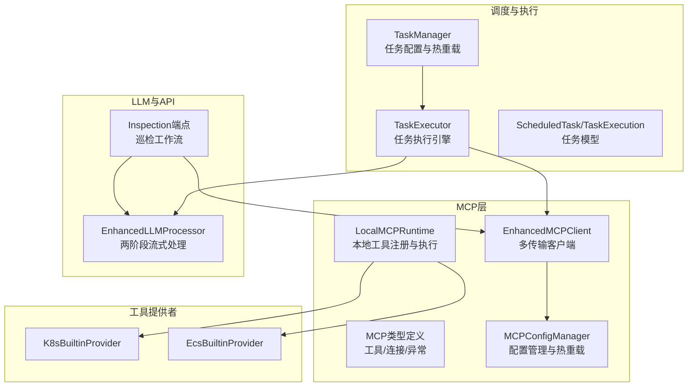
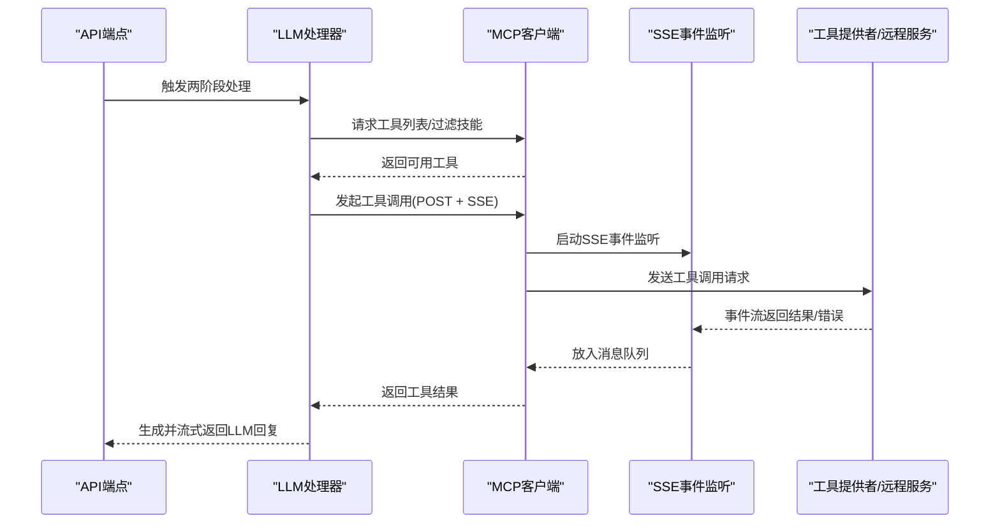
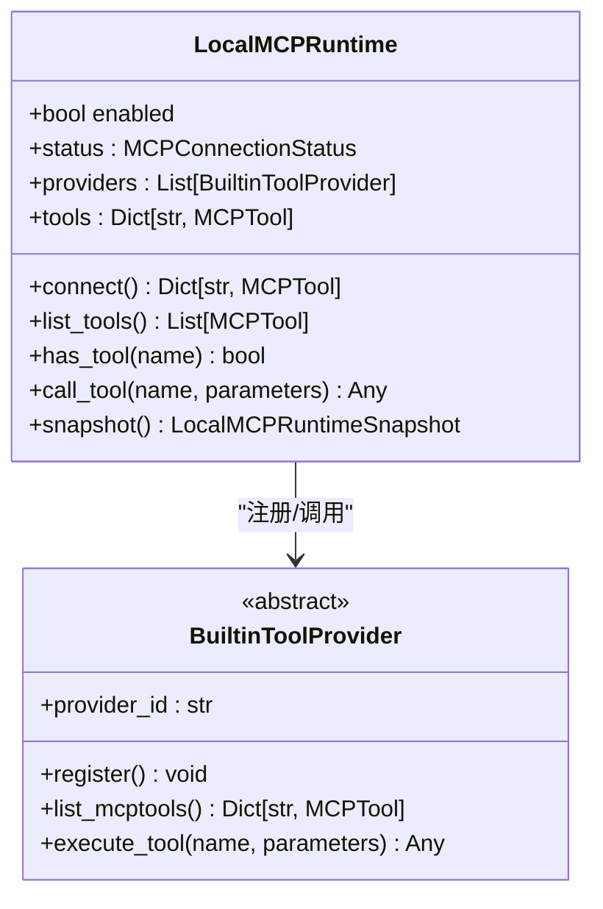
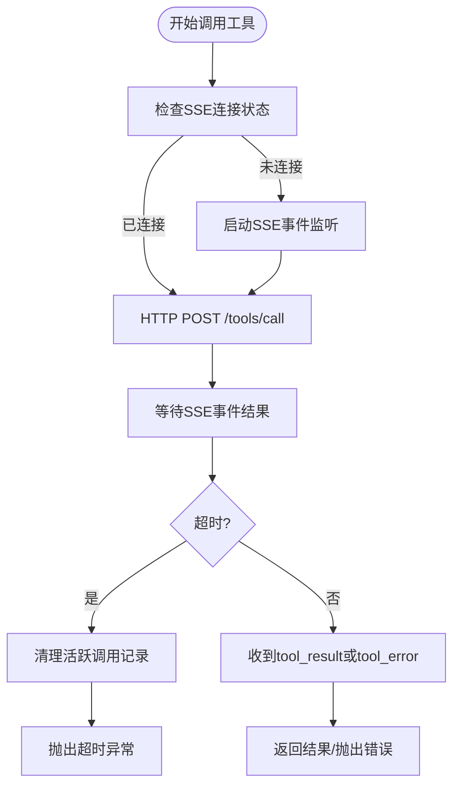
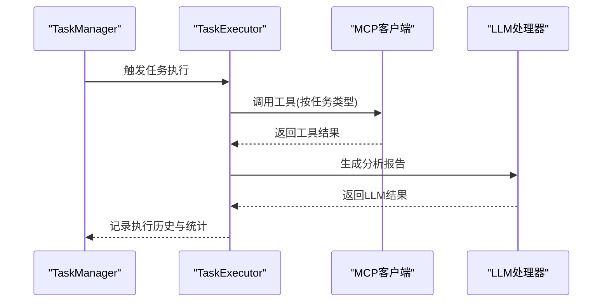
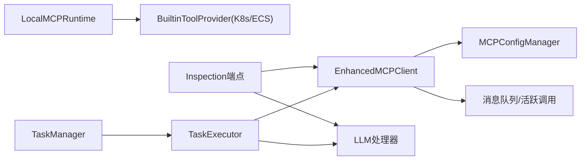

# 工具调用生命周期

<cite>
**本文档引用的文件**
- [runtime.py](file://backend/src/mcp/runtime.py)
- [enhanced_client.py](file://backend/src/mcp/enhanced_client.py)
- [types.py](file://backend/src/mcp/types.py)
- [providers.py](file://backend/src/mcp/builtin/providers.py)
- [registry.py](file://backend/src/tools/registry.py)
- [config_manager.py](file://backend/src/mcp/config_manager.py)
- [inspection.py](file://backend/src/api/v2/endpoints/inspection.py)
- [task_manager.py](file://backend/src/scheduler/task_manager.py)
- [task_executor.py](file://backend/src/scheduler/task_executor.py)
- [models.py](file://backend/src/scheduler/models.py)
- [processor.py](file://backend/src/llm/processor.py)
- [monitoring.py](file://backend/src/utils/monitoring.py)
</cite>

## 目录
1. [简介](#简介)
2. [项目结构](#项目结构)
3. [核心组件](#核心组件)
4. [架构总览](#架构总览)
5. [详细组件分析](#详细组件分析)
6. [依赖关系分析](#依赖关系分析)
7. [性能考量](#性能考量)
8. [故障排查指南](#故障排查指南)
9. [结论](#结论)
10. [附录](#附录)

## 简介
本文件围绕“工具调用生命周期”进行系统化文档化，覆盖从参数解析、工具选择、执行监控到结果返回的完整流程，并深入阐述异步处理机制（并发控制、超时管理、错误恢复）、工具调用跟踪与状态管理（活跃调用监控、SSE重连状态恢复、资源清理）、性能优化（缓存策略、批量处理、连接复用）、监控指标与日志调试方法，以及使用示例与常见问题解决方案。

## 项目结构
该系统围绕 MCP（Model Context Protocol）工具体系构建，结合本地进程内工具提供者与远程传输（SSE/HTTP/WebSocket/stdio）两类执行路径，配合任务调度器与LLM处理器，形成“工具发现—工具选择—异步调用—结果聚合—报告生成”的闭环。

**图表来源**
- [runtime.py:31-119](file://backend/src/mcp/runtime.py#L31-L119)
- [enhanced_client.py:33-800](file://backend/src/mcp/enhanced_client.py#L33-L800)
- [types.py:11-186](file://backend/src/mcp/types.py#L11-L186)
- [config_manager.py:41-800](file://backend/src/mcp/config_manager.py#L41-L800)
- [providers.py:53-171](file://backend/src/mcp/builtin/providers.py#L53-L171)
- [task_manager.py:133-657](file://backend/src/scheduler/task_manager.py#L133-L657)
- [task_executor.py:20-736](file://backend/src/scheduler/task_executor.py#L20-L736)
- [models.py:38-444](file://backend/src/scheduler/models.py#L38-L444)
- [inspection.py:66-262](file://backend/src/api/v2/endpoints/inspection.py#L66-L262)
- [processor.py:30-800](file://backend/src/llm/processor.py#L30-L800)

**章节来源**
- [runtime.py:1-119](file://backend/src/mcp/runtime.py#L1-L119)
- [enhanced_client.py:1-800](file://backend/src/mcp/enhanced_client.py#L1-L800)
- [types.py:1-186](file://backend/src/mcp/types.py#L1-L186)
- [config_manager.py:1-800](file://backend/src/mcp/config_manager.py#L1-L800)
- [providers.py:1-171](file://backend/src/mcp/builtin/providers.py#L1-L171)
- [task_manager.py:1-657](file://backend/src/scheduler/task_manager.py#L1-L657)
- [task_executor.py:1-736](file://backend/src/scheduler/task_executor.py#L1-L736)
- [models.py:1-444](file://backend/src/scheduler/models.py#L1-L444)
- [inspection.py:1-262](file://backend/src/api/v2/endpoints/inspection.py#L1-L262)
- [processor.py:1-800](file://backend/src/llm/processor.py#L1-L800)

## 核心组件
- 本地MCP运行时：负责注册内置工具提供者、刷新工具映射、执行工具调用、快照状态。
- 增强MCP客户端：支持多传输（SSE/HTTP/WebSocket/stdio/local），工具发现、调用、SSE事件监听、活跃调用跟踪与超时管理。
- 类型与异常：统一的MCP工具、连接状态、统计、异常类型定义。
- 工具提供者：K8s/ECS本地工具提供者，负责工具注册、列举与执行。
- 工具后端适配：将MCP客户端适配为统一工具后端接口，便于未来迁移到进程内工具注册表。
- 配置管理：MCP配置的加载、校验、热重载、备份与模板。
- 任务管理与执行：任务配置文件的热重载、执行历史、统计与LLM报告生成。
- LLM处理器：两阶段流式处理（工具决策→工具执行→LLM回复），上下文优化与结果提炼。
- 监控与调试：性能监控、请求追踪、系统指标与调试信息收集。

**章节来源**
- [runtime.py:31-119](file://backend/src/mcp/runtime.py#L31-L119)
- [enhanced_client.py:33-800](file://backend/src/mcp/enhanced_client.py#L33-L800)
- [types.py:11-186](file://backend/src/mcp/types.py#L11-L186)
- [providers.py:53-171](file://backend/src/mcp/builtin/providers.py#L53-L171)
- [registry.py:12-54](file://backend/src/tools/registry.py#L12-L54)
- [config_manager.py:41-800](file://backend/src/mcp/config_manager.py#L41-L800)
- [task_manager.py:133-657](file://backend/src/scheduler/task_manager.py#L133-L657)
- [task_executor.py:20-736](file://backend/src/scheduler/task_executor.py#L20-L736)
- [processor.py:30-800](file://backend/src/llm/processor.py#L30-L800)
- [monitoring.py:51-396](file://backend/src/utils/monitoring.py#L51-L396)

## 架构总览
工具调用生命周期贯穿“参数解析—工具选择—异步执行—结果聚合—报告生成—通知/存储”的全流程。系统支持本地工具与远程工具两种路径，前者通过本地运行时直接执行，后者通过增强客户端经由SSE/HTTP/WebSocket/stdio等传输方式调用。

**图表来源**
- [inspection.py:66-262](file://backend/src/api/v2/endpoints/inspection.py#L66-L262)
- [processor.py:536-757](file://backend/src/llm/processor.py#L536-L757)
- [enhanced_client.py:652-800](file://backend/src/mcp/enhanced_client.py#L652-L800)

## 详细组件分析

### 本地MCP运行时（LocalMCPRuntime）
- 注册与刷新：注册内置工具提供者，刷新工具映射，去重与冲突告警。
- 工具执行：按名称查找提供者并异步执行，异常包装为MCP异常。
- 快照：输出运行时状态、工具数量、提供者统计等诊断信息。

**图表来源**
- [runtime.py:31-119](file://backend/src/mcp/runtime.py#L31-L119)
- [providers.py:53-171](file://backend/src/mcp/builtin/providers.py#L53-L171)

**章节来源**
- [runtime.py:31-119](file://backend/src/mcp/runtime.py#L31-L119)
- [providers.py:53-171](file://backend/src/mcp/builtin/providers.py#L53-L171)

### 增强MCP客户端（EnhancedMCPClient）
- 多传输支持：SSE/HTTP/WebSocket/stdio/local。
- 工具发现：SSE事件流中接收tools_list，过滤启用/禁用工具。
- 工具调用：SSE路径下通过HTTP POST提交请求，SSE事件返回结果；维护活跃调用映射与超时。
- SSE重连与状态恢复：记录活跃调用，重连后提示可能丢失结果并清理。
- 资源清理：连接失败/断开时清理会话与任务。

**图表来源**
- [enhanced_client.py:652-800](file://backend/src/mcp/enhanced_client.py#L652-L800)

**章节来源**
- [enhanced_client.py:33-800](file://backend/src/mcp/enhanced_client.py#L33-L800)
- [types.py:11-186](file://backend/src/mcp/types.py#L11-L186)

### 工具后端适配（ToolExecutionBackend）
- 将MCP客户端适配为统一工具后端接口，便于后续迁移到进程内工具注册表。
- 提供list_tools与call_tool的异步适配实现。

**章节来源**
- [registry.py:12-54](file://backend/src/tools/registry.py#L12-L54)

### 配置管理（MCPConfigManager）
- 加载/保存/备份/模板/热重载/验证/连接测试。
- 自动生成工具配置并同步至配置文件，支持工具路由与安全配置。

**章节来源**
- [config_manager.py:41-800](file://backend/src/mcp/config_manager.py#L41-L800)

### 巡检端点（Inspection）
- 聚合调用集群概要、资源指标、Pod状态等工具，回退到备用工具组合。
- 使用LLM生成Markdown巡检报告，支持钉钉推送。

**章节来源**
- [inspection.py:66-262](file://backend/src/api/v2/endpoints/inspection.py#L66-L262)

### 任务管理与执行（TaskManager/TaskExecutor）
- 任务配置文件热重载、备份、执行历史持久化与清理。
- 任务执行引擎：按任务类型执行不同逻辑（集群巡检、资源分析、健康监控、自定义任务），调用MCP工具与LLM生成报告。
- 统计与可观测性：执行次数、成功率、平均耗时、最近执行时间。

**图表来源**
- [task_manager.py:133-657](file://backend/src/scheduler/task_manager.py#L133-L657)
- [task_executor.py:47-196](file://backend/src/scheduler/task_executor.py#L47-L196)

**章节来源**
- [task_manager.py:133-657](file://backend/src/scheduler/task_manager.py#L133-L657)
- [task_executor.py:20-736](file://backend/src/scheduler/task_executor.py#L20-L736)
- [models.py:38-444](file://backend/src/scheduler/models.py#L38-L444)

### LLM处理器（EnhancedLLMProcessor）
- 两阶段流式处理：工具决策→工具执行→LLM回复。
- 上下文优化：估算token、裁剪历史、保留关键对话循环。
- 结果提炼：针对工具结果进行关键信息抽取与分页建议。
- 技能过滤：按技能配置过滤暴露给模型的工具。

**章节来源**
- [processor.py:536-757](file://backend/src/llm/processor.py#L536-L757)
- [skills/registry.py:18-116](file://backend/src/skills/registry.py#L18-L116)

### 监控与调试（PerformanceMonitor/DebugCollector）
- 请求追踪：开始/结束请求，记录时延、状态码、错误、元数据。
- 系统指标：CPU/内存/磁盘/活跃连接/请求速率/错误率。
- 调试信息：日志队列、上下文数据、请求级调试信息。

**章节来源**
- [monitoring.py:51-396](file://backend/src/utils/monitoring.py#L51-L396)

## 依赖关系分析
- 运行时依赖：LocalMCPRuntime依赖BuiltinToolProvider，提供者依赖各自工具注册表。
- 客户端依赖：EnhancedMCPClient依赖MCPConfigManager进行配置与热重载，依赖SSE事件监听与消息队列实现异步调用。
- 执行链路：Inspection端点与TaskExecutor均依赖MCP客户端与LLM处理器。
- 调度依赖：TaskManager依赖文件监控与热重载，TaskExecutor依赖MCP客户端与LLM处理器。

**图表来源**
- [runtime.py:31-119](file://backend/src/mcp/runtime.py#L31-L119)
- [providers.py:53-171](file://backend/src/mcp/builtin/providers.py#L53-L171)
- [enhanced_client.py:33-800](file://backend/src/mcp/enhanced_client.py#L33-L800)
- [config_manager.py:41-800](file://backend/src/mcp/config_manager.py#L41-L800)
- [inspection.py:66-262](file://backend/src/api/v2/endpoints/inspection.py#L66-L262)
- [task_executor.py:20-736](file://backend/src/scheduler/task_executor.py#L20-L736)
- [task_manager.py:133-657](file://backend/src/scheduler/task_manager.py#L133-L657)

**章节来源**
- [runtime.py:31-119](file://backend/src/mcp/runtime.py#L31-L119)
- [enhanced_client.py:33-800](file://backend/src/mcp/enhanced_client.py#L33-L800)
- [config_manager.py:41-800](file://backend/src/mcp/config_manager.py#L41-L800)
- [inspection.py:66-262](file://backend/src/api/v2/endpoints/inspection.py#L66-L262)
- [task_executor.py:20-736](file://backend/src/scheduler/task_executor.py#L20-L736)
- [task_manager.py:133-657](file://backend/src/scheduler/task_manager.py#L133-L657)

## 性能考量
- 并发控制：客户端配置支持最大并发调用数，避免过度竞争资源。
- 超时管理：SSE调用路径支持请求级与配置级超时，超时后清理活跃调用并抛出异常。
- 缓存策略：自动同步工具配置时为查询类工具启用缓存与TTL，高风险操作禁用缓存。
- 连接复用：SSE连接复用事件流，HTTP会话复用，避免频繁握手。
- 结果优化：LLM侧对工具结果进行关键信息提炼与分页建议，降低上下文开销。
- 系统监控：性能监控器采集系统指标与请求统计，辅助容量规划与瓶颈定位。

**章节来源**
- [types.py:56-74](file://backend/src/mcp/types.py#L56-L74)
- [enhanced_client.py:652-800](file://backend/src/mcp/enhanced_client.py#L652-L800)
- [config_manager.py:321-400](file://backend/src/mcp/config_manager.py#L321-L400)
- [processor.py:383-458](file://backend/src/llm/processor.py#L383-L458)
- [monitoring.py:51-144](file://backend/src/utils/monitoring.py#L51-L144)

## 故障排查指南
- 工具调用失败
  - 检查工具是否存在与启用状态，确认服务器连接状态与工具路由。
  - 查看SSE事件监听是否正常，活跃调用是否超时或丢失。
  - 参考MCP异常类型与错误码定位问题。
- SSE重连问题
  - 关注重连时活跃调用提示，必要时手动清理或重试。
  - 检查认证头与授权令牌配置。
- LLM生成失败
  - 检查LLM客户端初始化与配置，关注上下文大小与token估算。
  - 使用回退Markdown生成保障接口可用性。
- 任务执行异常
  - 查看任务执行历史与统计，确认超时与重试配置。
  - 检查任务配置文件热重载与备份状态。

**章节来源**
- [enhanced_client.py:157-245](file://backend/src/mcp/enhanced_client.py#L157-L245)
- [inspection.py:154-168](file://backend/src/api/v2/endpoints/inspection.py#L154-L168)
- [task_manager.py:501-552](file://backend/src/scheduler/task_manager.py#L501-L552)
- [task_executor.py:680-710](file://backend/src/scheduler/task_executor.py#L680-L710)
- [types.py:178-186](file://backend/src/mcp/types.py#L178-L186)

## 结论
本系统通过本地运行时与增强客户端的双路径设计，实现了灵活的工具调用生命周期管理。借助SSE事件驱动的异步调用、完善的超时与错误恢复机制、活跃调用跟踪与资源清理，以及任务调度与LLM报告生成的协同，系统在保证可靠性的同时兼顾性能与可观测性。建议在生产环境中结合监控指标与日志进行持续优化，并通过配置管理与热重载机制保障运行时的稳定性。

## 附录

### 使用示例
- 巡检端点调用
  - 调用路径：POST /api/v2/inspection/run
  - 功能：聚合集群概要、资源指标、Pod状态，生成Markdown报告并可选推送钉钉。
  - 参考实现：[perform_inspection:66-262](file://backend/src/api/v2/endpoints/inspection.py#L66-L262)

- 任务执行
  - 创建/更新/删除任务，查看执行历史与统计。
  - 参考实现：[TaskManager:338-453](file://backend/src/scheduler/task_manager.py#L338-L453)、[TaskExecutor:47-196](file://backend/src/scheduler/task_executor.py#L47-L196)

- 工具调用（SSE）
  - 通过增强客户端发起工具调用，SSE事件返回结果。
  - 参考实现：[EnhancedMCPClient._call_tool_sse:652-735](file://backend/src/mcp/enhanced_client.py#L652-L735)

### 常见问题与解决方案
- 工具未发现或不可用
  - 检查服务器配置与enabled_tools列表，确认SSE事件流是否正常。
  - 参考：[MCPServerConnection._discover_tools_sse:547-568](file://backend/src/mcp/enhanced_client.py#L547-L568)
- SSE连接不稳定
  - 检查认证头、超时配置与网络状况，关注重试与指数退避。
  - 参考：[MCPServerConnection._sse_event_listener:157-245](file://backend/src/mcp/enhanced_client.py#L157-L245)
- LLM响应过大
  - 使用结果提炼与分页建议，控制上下文大小。
  - 参考：[EnhancedLLMProcessor._process_mcp_result:383-408](file://backend/src/llm/processor.py#L383-L408)