# 任务执行器

<cite>
**本文档引用的文件**
- [task_executor.py](file://backend/src/scheduler/task_executor.py)
- [task_scheduler.py](file://backend/src/scheduler/task_scheduler.py)
- [task_manager.py](file://backend/src/scheduler/task_manager.py)
- [models.py](file://backend/src/scheduler/models.py)
- [scheduler.py](file://backend/src/api/v2/endpoints/scheduler.py)
- [enhanced_client.py](file://backend/src/mcp/enhanced_client.py)
- [processor.py](file://backend/src/llm/processor.py)
- [main.py](file://backend/main.py)
- [scheduled_tasks.example.json](file://config/scheduled_tasks.example.json)
</cite>

## 目录
1. [简介](#简介)
2. [项目结构](#项目结构)
3. [核心组件](#核心组件)
4. [架构概览](#架构概览)
5. [详细组件分析](#详细组件分析)
6. [依赖关系分析](#依赖关系分析)
7. [性能考虑](#性能考虑)
8. [故障排除指南](#故障排除指南)
9. [结论](#结论)
10. [附录](#附录)

## 简介

任务执行器是钉钉K8s运维机器人系统中的核心组件，负责执行各种定时任务，包括集群巡检、资源分析、健康监控和自定义任务。该系统基于异步编程模型，集成了MCP客户端和LLM处理器，提供了完整的任务执行生命周期管理。

系统的主要特点包括：
- 多任务类型支持：集群巡检、资源分析、健康监控、自定义任务
- 异步并发执行：基于asyncio的高性能任务调度
- 智能重试机制：支持指数退避重试策略
- 完整的通知系统：通过钉钉机器人发送执行结果
- 丰富的监控指标：执行统计、性能分析、错误追踪
- 配置热重载：支持运行时配置动态更新

## 项目结构

任务执行器相关的文件组织结构如下：

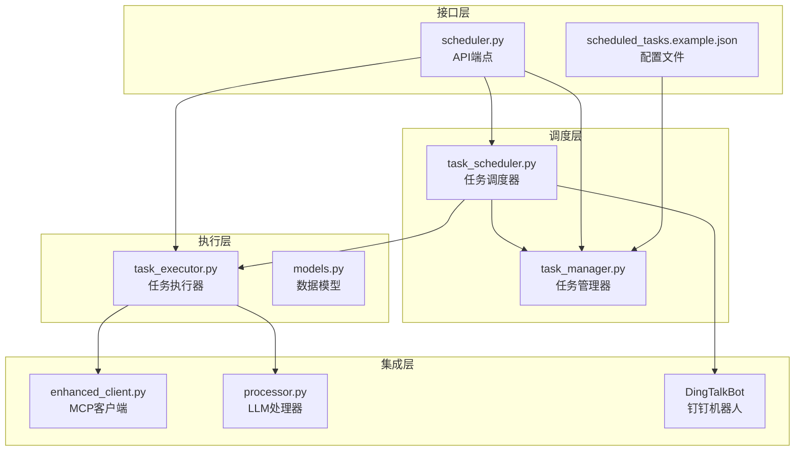

**图表来源**
- [task_scheduler.py:1-487](file://backend/src/scheduler/task_scheduler.py#L1-L487)
- [task_executor.py:1-736](file://backend/src/scheduler/task_executor.py#L1-L736)
- [task_manager.py:1-657](file://backend/src/scheduler/task_manager.py#L1-L657)

**章节来源**
- [task_scheduler.py:1-487](file://backend/src/scheduler/task_scheduler.py#L1-L487)
- [task_executor.py:1-736](file://backend/src/scheduler/task_executor.py#L1-L736)
- [task_manager.py:1-657](file://backend/src/scheduler/task_manager.py#L1-L657)

## 核心组件

### 任务执行器 TaskExecutor

TaskExecutor 是任务执行的核心组件，负责：
- 任务类型分发和执行
- 结果处理和摘要生成
- 执行统计和性能监控
- 错误处理和异常传播

主要功能特性：
- 支持四种任务类型：集群巡检、资源分析、健康监控、自定义任务
- 智能摘要提取：从复杂结果中提取关键信息
- 执行统计：记录成功/失败次数、执行时间分布
- 全局实例管理：提供单例模式的执行器实例

### 任务调度器 EnhancedTaskScheduler

EnhancedTaskScheduler 负责：
- 任务调度和并发控制
- 重试机制和异常处理
- 通知系统集成
- 生命周期管理

关键特性：
- 基于信号量的并发控制（默认5个并发任务）
- 指数退避重试策略
- 钉钉机器人通知集成
- 优雅的启动和停止流程

### 任务管理器 TaskManager

TaskManager 提供：
- 任务配置的持久化存储
- 配置文件的热重载功能
- 执行历史记录管理
- 配置验证和模板支持

**章节来源**
- [task_executor.py:20-736](file://backend/src/scheduler/task_executor.py#L20-L736)
- [task_scheduler.py:23-487](file://backend/src/scheduler/task_scheduler.py#L23-L487)
- [task_manager.py:133-657](file://backend/src/scheduler/task_manager.py#L133-L657)

## 架构概览

系统采用分层架构设计，各层职责明确：

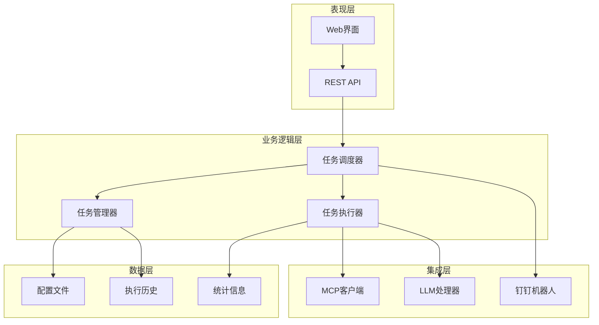

**图表来源**
- [main.py:137-270](file://backend/main.py#L137-L270)
- [task_scheduler.py:29-57](file://backend/src/scheduler/task_scheduler.py#L29-L57)
- [task_executor.py:26-45](file://backend/src/scheduler/task_executor.py#L26-L45)

系统的核心执行流程：

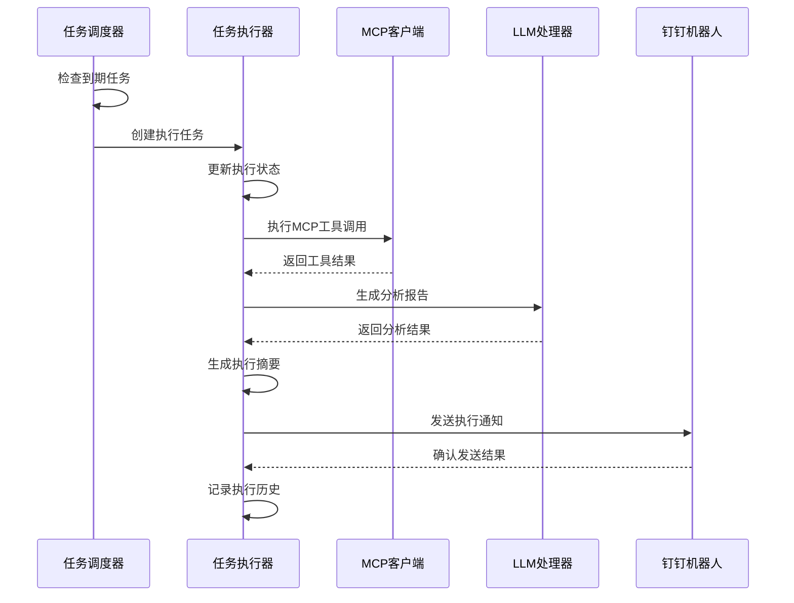

**图表来源**
- [task_scheduler.py:108-214](file://backend/src/scheduler/task_scheduler.py#L108-L214)
- [task_executor.py:47-99](file://backend/src/scheduler/task_executor.py#L47-L99)

**章节来源**
- [main.py:258-270](file://backend/main.py#L258-L270)
- [task_scheduler.py:108-214](file://backend/src/scheduler/task_scheduler.py#L108-L214)

## 详细组件分析

### 任务执行器架构

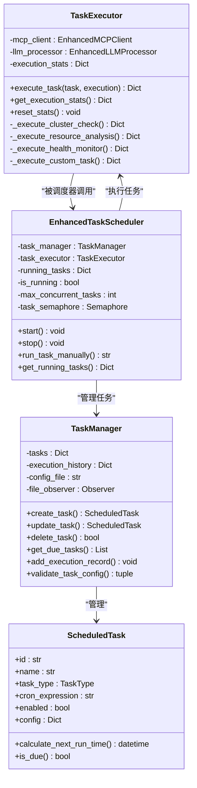

**图表来源**
- [task_executor.py:20-736](file://backend/src/scheduler/task_executor.py#L20-L736)
- [task_scheduler.py:23-487](file://backend/src/scheduler/task_scheduler.py#L23-L487)
- [task_manager.py:133-657](file://backend/src/scheduler/task_manager.py#L133-L657)
- [models.py:38-135](file://backend/src/scheduler/models.py#L38-L135)

### 任务类型执行流程

#### 集群巡检任务

集群巡检任务是最复杂的任务类型，涉及多个步骤：

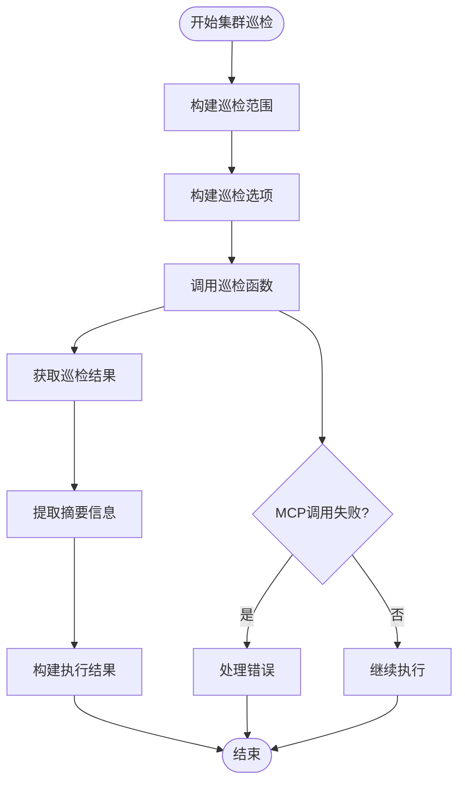

**图表来源**
- [task_executor.py:100-151](file://backend/src/scheduler/task_executor.py#L100-L151)

#### 资源分析任务

资源分析任务专注于Kubernetes集群的资源利用率分析：

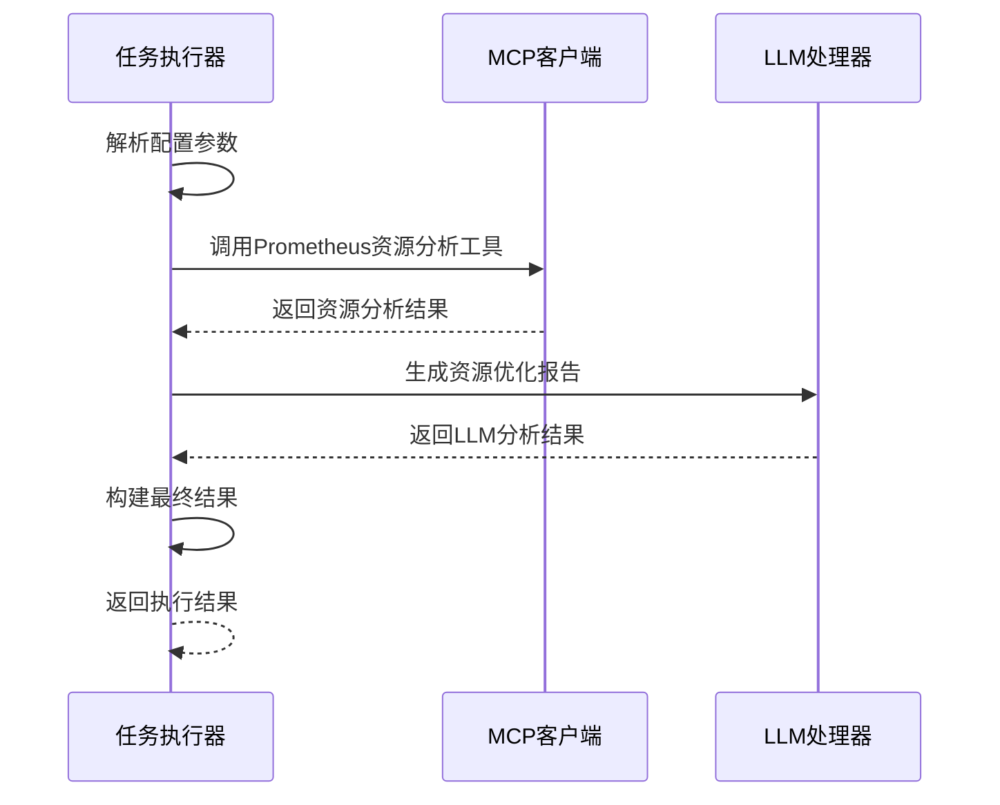

**图表来源**
- [task_executor.py:153-195](file://backend/src/scheduler/task_executor.py#L153-L195)

#### 健康监控任务

健康监控任务检查集群的各种健康指标：

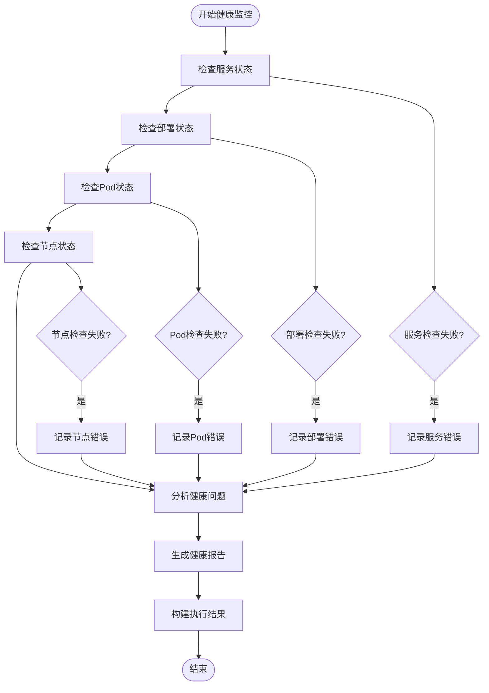

**图表来源**
- [task_executor.py:197-270](file://backend/src/scheduler/task_executor.py#L197-L270)

#### 自定义任务

自定义任务支持灵活的MCP工具调用组合：

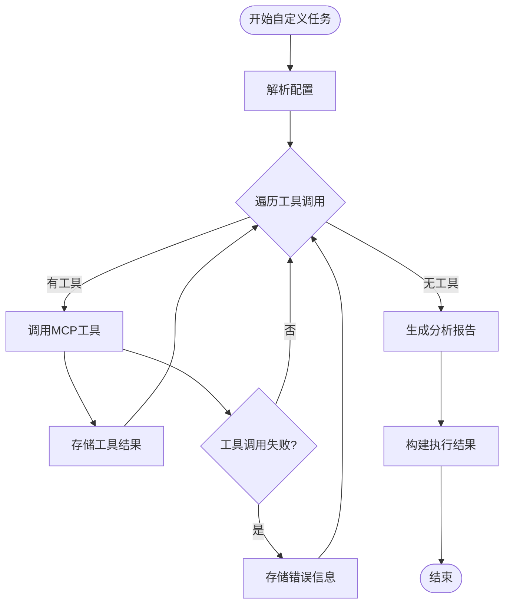

**图表来源**
- [task_executor.py:272-316](file://backend/src/scheduler/task_executor.py#L272-L316)

### 并发控制机制

系统采用多层并发控制机制：

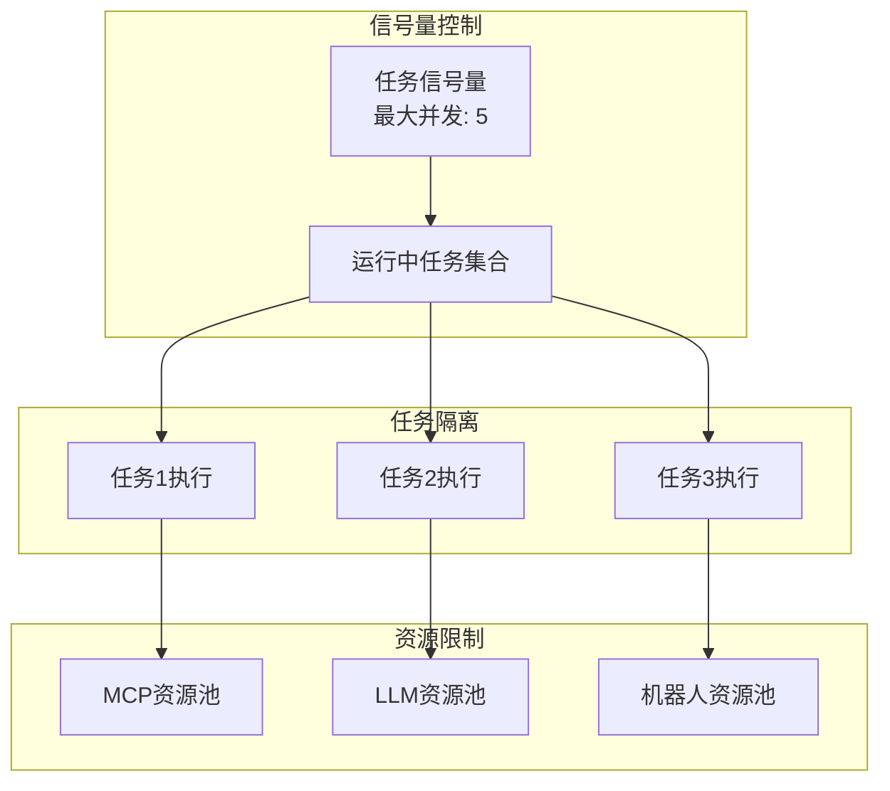

**图表来源**
- [task_scheduler.py:53-56](file://backend/src/scheduler/task_scheduler.py#L53-L56)
- [task_scheduler.py:151-156](file://backend/src/scheduler/task_scheduler.py#L151-L156)

并发控制的关键实现：
- 信号量限制：`max_concurrent_tasks = 5`
- 任务隔离：每个任务独立执行
- 资源池管理：MCP客户端和LLM处理器的资源管理
- 优雅降级：当资源不足时的处理策略

**章节来源**
- [task_scheduler.py:53-56](file://backend/src/scheduler/task_scheduler.py#L53-L56)
- [task_scheduler.py:151-156](file://backend/src/scheduler/task_scheduler.py#L151-L156)

### 重试机制

系统实现了智能的重试机制：

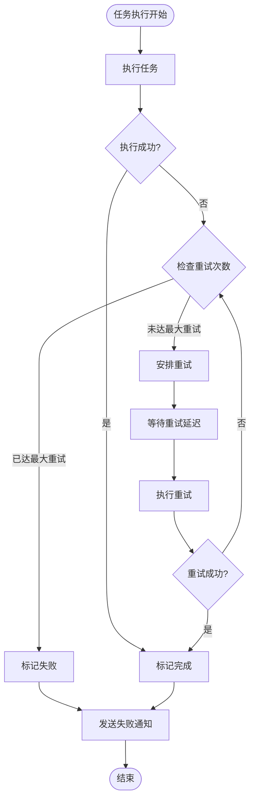

**图表来源**
- [task_scheduler.py:218-283](file://backend/src/scheduler/task_scheduler.py#L218-L283)

重试机制的关键特性：
- 指数退避：`retry_delay_seconds` 参数控制重试间隔
- 最大重试次数：`max_retries` 参数限制重试次数
- 重试状态跟踪：记录重试次数和父执行记录
- 通知策略：根据通知级别发送通知

**章节来源**
- [task_scheduler.py:218-283](file://backend/src/scheduler/task_scheduler.py#L218-L283)

### 监控和日志功能

系统提供了全面的监控和日志功能：

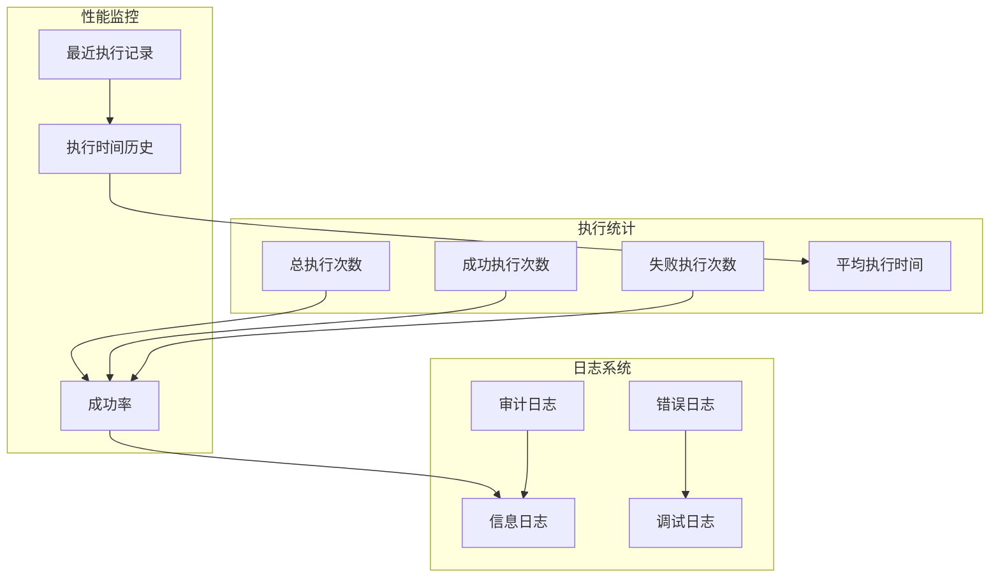

**图表来源**
- [task_executor.py:37-43](file://backend/src/scheduler/task_executor.py#L37-L43)
- [task_executor.py:680-698](file://backend/src/scheduler/task_executor.py#L680-L698)

监控功能包括：
- 执行统计：总次数、成功次数、失败次数、成功率
- 性能指标：平均执行时间、最近执行记录
- 日志记录：信息、错误、调试、审计日志
- 历史记录：执行历史的持久化存储

**章节来源**
- [task_executor.py:37-43](file://backend/src/scheduler/task_executor.py#L37-L43)
- [task_executor.py:680-698](file://backend/src/scheduler/task_executor.py#L680-L698)

## 依赖关系分析

系统组件之间的依赖关系：

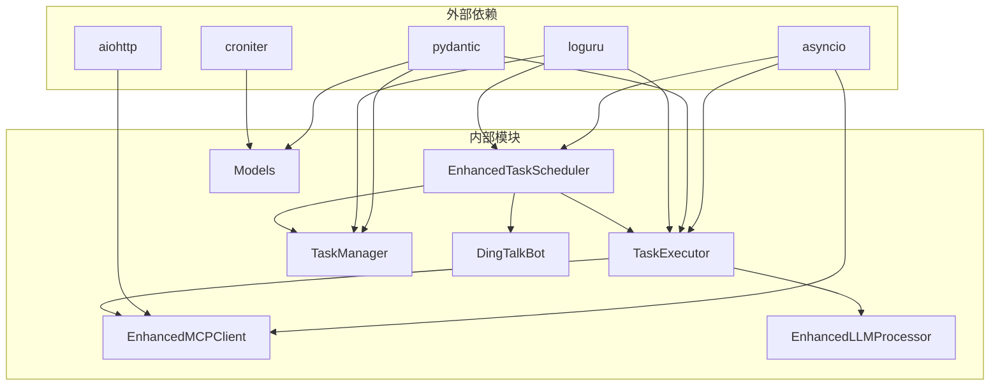

**图表来源**
- [task_executor.py:7-18](file://backend/src/scheduler/task_executor.py#L7-L18)
- [models.py:6-11](file://backend/src/scheduler/models.py#L6-L11)
- [enhanced_client.py:6-26](file://backend/src/mcp/enhanced_client.py#L6-L26)

**章节来源**
- [task_executor.py:7-18](file://backend/src/scheduler/task_executor.py#L7-L18)
- [models.py:6-11](file://backend/src/scheduler/models.py#L6-L11)

## 性能考虑

### 并发性能优化

系统在并发性能方面采用了多项优化策略：

1. **信号量控制**：限制同时执行的任务数量，避免资源争用
2. **异步I/O**：使用asyncio处理MCP工具调用和LLM请求
3. **连接池管理**：MCP客户端和LLM处理器的连接复用
4. **结果缓存**：MCP工具结果的智能缓存机制

### 内存管理

- 执行历史的限制：只保留最近100条执行记录
- 统计信息的滚动窗口：执行时间历史限制为100次
- 资源清理：优雅关闭时清理所有资源

### 网络性能

- MCP工具调用的超时控制
- LLM请求的重试机制
- 连接池的自动重连

## 故障排除指南

### 常见问题及解决方案

#### 任务执行失败

**症状**：任务执行后标记为失败

**排查步骤**：
1. 检查MCP客户端连接状态
2. 查看LLM处理器配置
3. 检查任务配置的有效性
4. 查看详细的错误日志

**解决方案**：
- 重新连接MCP服务器
- 验证LLM API密钥和配置
- 检查任务配置参数
- 查看系统日志获取详细错误信息

#### 并发执行问题

**症状**：任务执行超时或资源不足

**排查步骤**：
1. 检查并发任务数量
2. 查看系统资源使用情况
3. 检查MCP服务器负载

**解决方案**：
- 调整`max_concurrent_tasks`参数
- 增加系统资源
- 优化MCP服务器配置

#### 配置文件问题

**症状**：任务配置无法加载或热重载失败

**排查步骤**：
1. 检查配置文件格式
2. 验证JSON语法
3. 查看文件权限

**解决方案**：
- 修复JSON语法错误
- 设置正确的文件权限
- 使用配置模板进行验证

**章节来源**
- [task_scheduler.py:146-149](file://backend/src/scheduler/task_scheduler.py#L146-L149)
- [task_manager.py:263-291](file://backend/src/scheduler/task_manager.py#L263-L291)

## 结论

任务执行器是一个设计精良的异步任务管理系统，具有以下优势：

1. **模块化设计**：清晰的分层架构，职责分离明确
2. **高并发性能**：基于asyncio的异步执行模型
3. **智能重试**：完善的错误处理和重试机制
4. **全面监控**：丰富的统计信息和日志记录
5. **灵活配置**：支持运行时配置热重载
6. **集成能力**：与MCP客户端和LLM处理器深度集成

系统适用于生产环境的定时任务执行，能够处理复杂的运维场景，提供可靠的自动化能力。

## 附录

### 配置示例

#### 任务配置模板

```json
{
  "version": "1.0",
  "name": "定时任务配置",
  "description": "钉钉K8s运维机器人定时任务配置",
  "updated_at": "2025-01-01T00:00:00+08:00",
  "tasks": [
    {
      "id": "cluster-check-001",
      "name": "每日集群巡检",
      "description": "每天上午9点执行集群巡检",
      "task_type": "cluster_check",
      "cron_expression": "0 9 * * *",
      "enabled": true,
      "config": {
        "scope": {
          "namespaces": ["default", "kube-system"],
          "include_events": true,
          "include_metrics": true
        },
        "analysis": {
          "check_resource_usage": true,
          "check_pod_status": true,
          "check_node_status": true,
          "generate_summary": true
        }
      },
      "notification_level": "error_only",
      "timeout_seconds": 300,
      "max_retries": 3,
      "retry_delay_seconds": 60
    }
  ]
}
```

#### 环境变量配置

```bash
# 调度器配置
SCHEDULER_ENABLED=true
INSPECTION_ENABLED=false

# 日志配置
LOG_LEVEL=INFO

# 钉钉机器人配置
DINGTALK_WEBHOOK_URL=https://oapi.dingtalk.com/robot/send?access_token=your_token
DINGTALK_SECRET=your_secret
```

### API参考

#### 任务管理API

| 端点 | 方法 | 描述 |
|------|------|------|
| `/scheduler/tasks` | GET | 获取任务列表 |
| `/scheduler/tasks` | POST | 创建新任务 |
| `/scheduler/tasks/{task_id}` | GET | 获取单个任务 |
| `/scheduler/tasks/{task_id}` | PUT | 更新任务 |
| `/scheduler/tasks/{task_id}` | DELETE | 删除任务 |
| `/scheduler/tasks/{task_id}/run` | POST | 手动执行任务 |
| `/scheduler/stats` | GET | 获取任务统计信息 |

#### 任务类型配置

系统支持四种任务类型，每种都有特定的配置要求：

1. **集群巡检** (`cluster_check`)
   - 支持命名空间范围配置
   - 可选的事件和指标包含
   - LLM分析报告生成

2. **资源分析** (`resource_analysis`)
   - Prometheus URL配置
   - 时间范围和阈值设置
   - 分析模式选择

3. **健康监控** (`health_monitor`)
   - 服务、部署、Pod、节点检查
   - 健康问题分析
   - 严重程度分级

4. **自定义任务** (`custom`)
   - 多个MCP工具调用组合
   - 可选的LLM分析
   - 灵活的参数配置

**章节来源**
- [scheduled_tasks.example.json:1-8](file://config/scheduled_tasks.example.json#L1-L8)
- [scheduler.py:433-467](file://backend/src/api/v2/endpoints/scheduler.py#L433-L467)