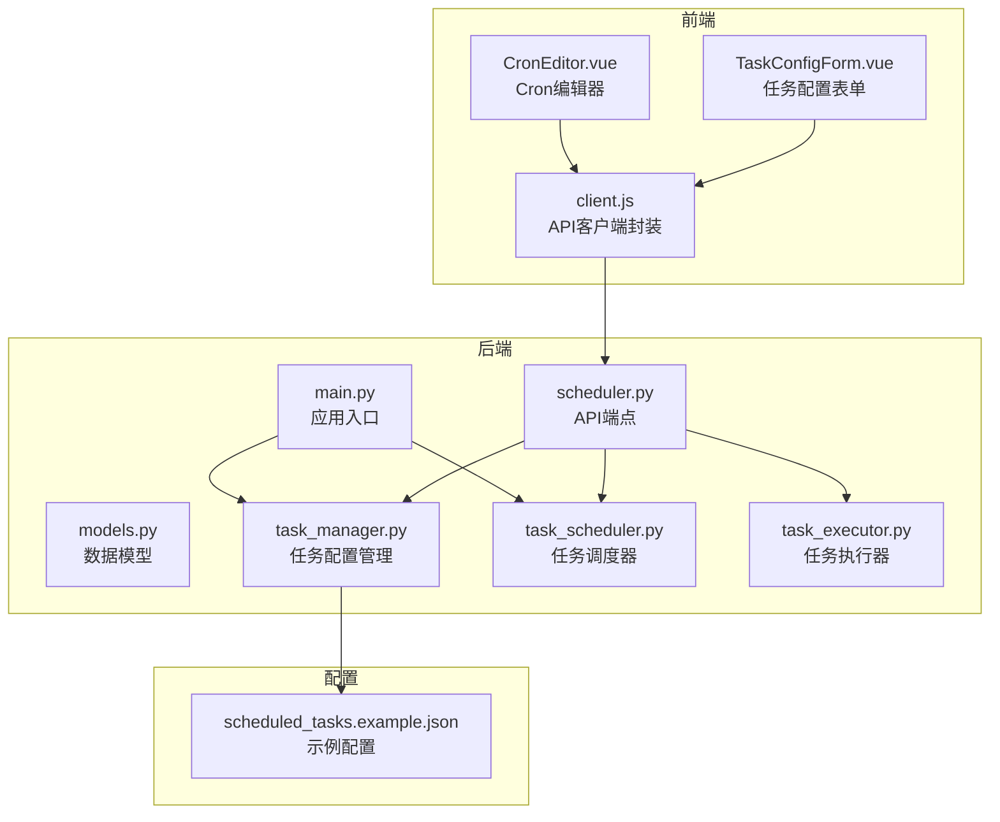
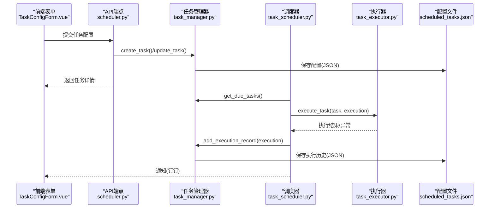
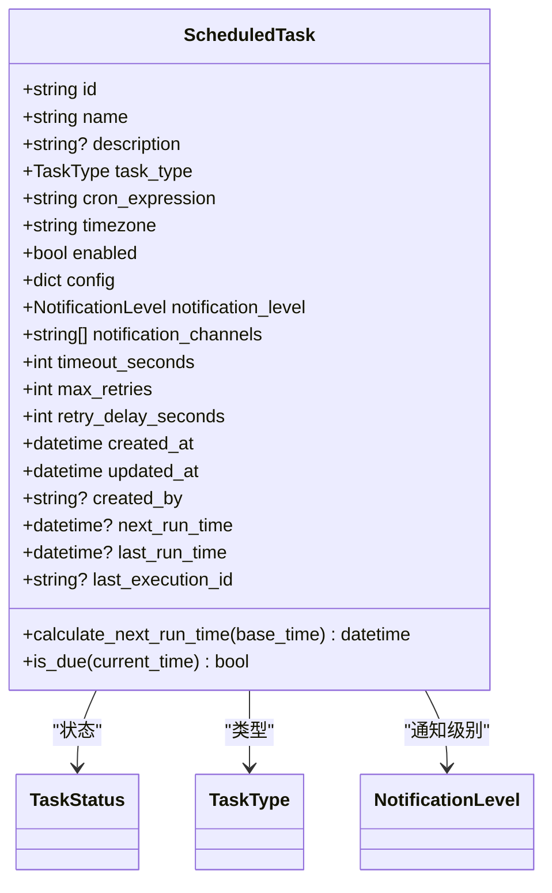
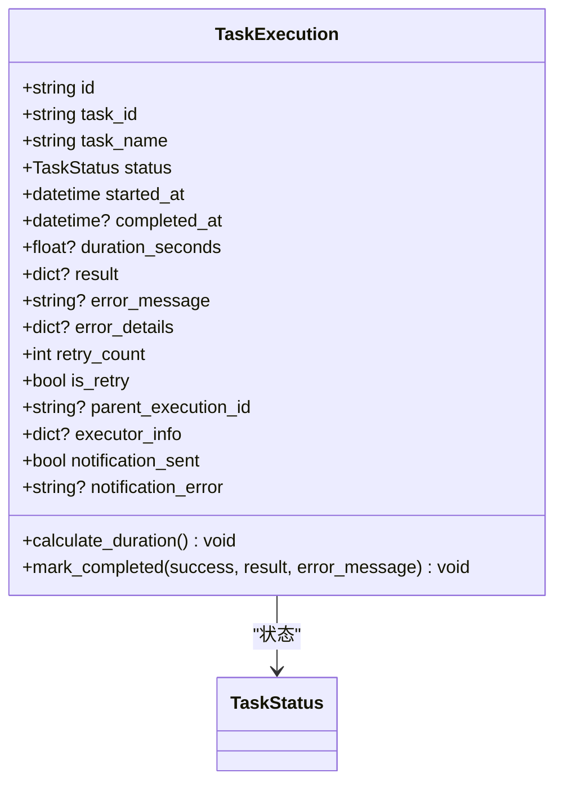
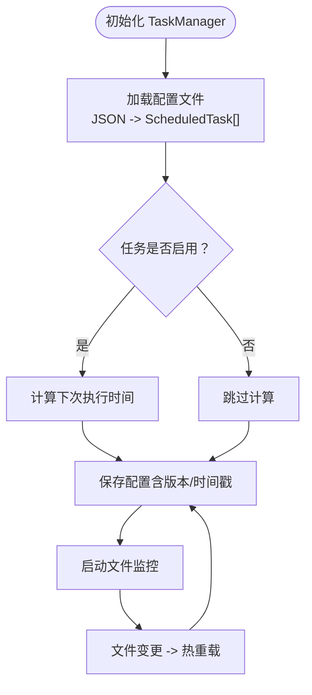
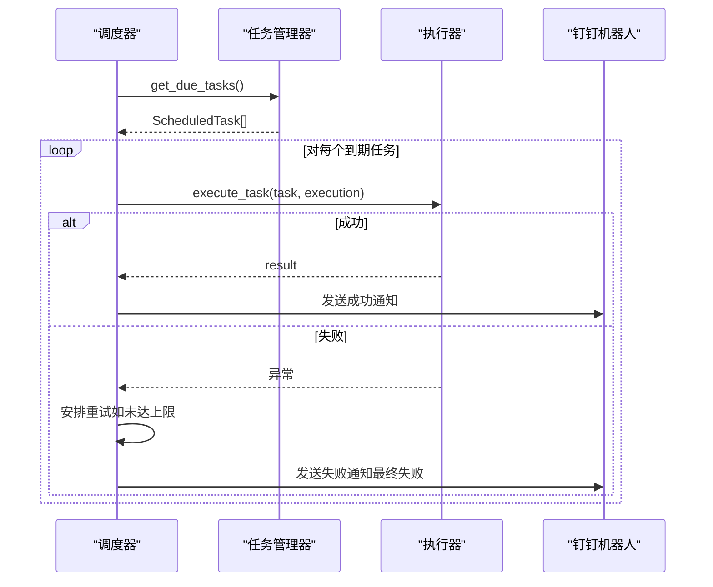
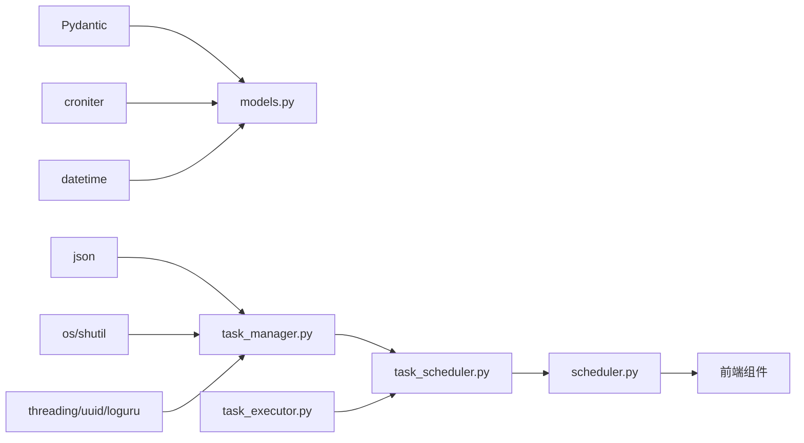

# 任务数据模型

<cite>
**本文引用的文件**
- [models.py](file://backend/src/scheduler/models.py)
- [task_manager.py](file://backend/src/scheduler/task_manager.py)
- [task_scheduler.py](file://backend/src/scheduler/task_scheduler.py)
- [task_executor.py](file://backend/src/scheduler/task_executor.py)
- [scheduler.py](file://backend/src/api/v2/endpoints/scheduler.py)
- [main.py](file://backend/main.py)
- [client.js](file://frontend-v2/src/api/client.js)
- [TaskConfigForm.vue](file://frontend-v2/src/components/TaskConfigForm.vue)
- [CronEditor.vue](file://frontend-v2/src/components/CronEditor.vue)
- [scheduled_tasks.example.json](file://config/scheduled_tasks.example.json)
</cite>

## 目录
1. [简介](#简介)
2. [项目结构](#项目结构)
3. [核心组件](#核心组件)
4. [架构概览](#架构概览)
5. [详细组件分析](#详细组件分析)
6. [依赖关系分析](#依赖关系分析)
7. [性能考量](#性能考量)
8. [故障排查指南](#故障排查指南)
9. [结论](#结论)
10. [附录](#附录)

## 简介
本文件系统性梳理任务数据模型的设计与实现，涵盖 ScheduledTask、TaskExecution、TaskStatus、TaskType 等核心实体，说明字段定义、数据类型、约束与验证规则；阐述模型间关系（一对一、一对多、多对多）；介绍序列化/反序列化机制（JSON 转换、数据校验与错误处理）；说明生命周期管理（创建、更新、删除、查询）；提供使用示例与最佳实践；解释与数据库存储及 ORM 的关系；并讨论模型演进与版本兼容性。

## 项目结构
任务数据模型位于后端 scheduler 子系统，配合 API 层、前端表单组件与配置文件共同构成完整的任务编排与执行体系：
- 后端模型与业务逻辑：backend/src/scheduler
- API 端点：backend/src/api/v2/endpoints/scheduler.py
- 应用入口与调度器初始化：backend/main.py
- 前端任务配置表单与 Cron 编辑器：frontend-v2/src/components
- 前端 API 客户端封装：frontend-v2/src/api/client.js
- 示例配置文件：config/scheduled_tasks.example.json

图表来源
- [models.py:1-444](file://backend/src/scheduler/models.py#L1-L444)
- [task_manager.py:1-657](file://backend/src/scheduler/task_manager.py#L1-L657)
- [task_scheduler.py:1-487](file://backend/src/scheduler/task_scheduler.py#L1-L487)
- [task_executor.py:1-736](file://backend/src/scheduler/task_executor.py#L1-L736)
- [scheduler.py:1-661](file://backend/src/api/v2/endpoints/scheduler.py#L1-L661)
- [main.py:258-270](file://backend/main.py#L258-L270)
- [client.js:1-865](file://frontend-v2/src/api/client.js#L1-L865)
- [TaskConfigForm.vue:1-746](file://frontend-v2/src/components/TaskConfigForm.vue#L1-L746)
- [CronEditor.vue:1-631](file://frontend-v2/src/components/CronEditor.vue#L1-L631)
- [scheduled_tasks.example.json:1-8](file://config/scheduled_tasks.example.json#L1-L8)

章节来源
- [models.py:1-444](file://backend/src/scheduler/models.py#L1-L444)
- [task_manager.py:1-657](file://backend/src/scheduler/task_manager.py#L1-L657)
- [task_scheduler.py:1-487](file://backend/src/scheduler/task_scheduler.py#L1-L487)
- [task_executor.py:1-736](file://backend/src/scheduler/task_executor.py#L1-L736)
- [scheduler.py:1-661](file://backend/src/api/v2/endpoints/scheduler.py#L1-L661)
- [main.py:258-270](file://backend/main.py#L258-L270)
- [client.js:1-865](file://frontend-v2/src/api/client.js#L1-L865)
- [TaskConfigForm.vue:1-746](file://frontend-v2/src/components/TaskConfigForm.vue#L1-L746)
- [CronEditor.vue:1-631](file://frontend-v2/src/components/CronEditor.vue#L1-L631)
- [scheduled_tasks.example.json:1-8](file://config/scheduled_tasks.example.json#L1-L8)

## 核心组件
本节聚焦任务数据模型的核心实体与配套请求/响应模型，以及它们在系统中的职责分工。

- TaskStatus：任务执行状态枚举，包含 pending、running、success、failed、cancelled。
- TaskType：任务类型枚举，包含 cluster_check、resource_analysis、health_monitor、custom。
- NotificationLevel：通知级别枚举，包含 none、error_only、all。
- ScheduledTask：定时任务配置模型，承载任务元信息、调度配置、执行配置、通知配置、时间戳与运行时状态。
- TaskExecution：任务执行记录模型，记录单次执行的状态、时间、结果、错误、重试信息与通知状态。
- TaskCreateRequest/TaskUpdateRequest：创建与更新任务的请求模型，用于 API 输入校验与转换。
- TaskListResponse/TaskExecutionListResponse/TaskStatsResponse：列表与统计响应模型，用于 API 输出标准化。
- CronValidationRequest/CronValidationResponse：Cron 表达式验证请求与响应模型。
- TaskRunRequest/TaskRunResponse：手动执行任务的请求与响应模型。

章节来源
- [models.py:14-371](file://backend/src/scheduler/models.py#L14-L371)

## 架构概览
任务数据模型贯穿“配置—调度—执行—通知—持久化”的完整链路，并通过 API 层与前端交互。

图表来源
- [scheduler.py:134-278](file://backend/src/api/v2/endpoints/scheduler.py#L134-L278)
- [task_manager.py:337-525](file://backend/src/scheduler/task_manager.py#L337-L525)
- [task_scheduler.py:108-283](file://backend/src/scheduler/task_scheduler.py#L108-L283)
- [task_executor.py:47-99](file://backend/src/scheduler/task_executor.py#L47-L99)
- [scheduled_tasks.example.json:1-8](file://config/scheduled_tasks.example.json#L1-L8)

章节来源
- [scheduler.py:1-661](file://backend/src/api/v2/endpoints/scheduler.py#L1-L661)
- [task_manager.py:1-657](file://backend/src/scheduler/task_manager.py#L1-L657)
- [task_scheduler.py:1-487](file://backend/src/scheduler/task_scheduler.py#L1-L487)
- [task_executor.py:1-736](file://backend/src/scheduler/task_executor.py#L1-L736)
- [scheduled_tasks.example.json:1-8](file://config/scheduled_tasks.example.json#L1-L8)

## 详细组件分析

### ScheduledTask 模型
- 职责：描述定时任务的完整配置，包括任务元信息、调度策略、执行策略、通知策略、时间戳与运行时状态。
- 关键字段与约束：
  - id/name：唯一标识与名称，均有限制长度与格式校验。
  - task_type：枚举类型，限定任务类别。
  - cron_expression/timezone：Cron 表达式与时区，表达调度周期。
  - enabled：启用开关。
  - config：任务特定配置，字典类型，按任务类型进行默认配置与验证。
  - notification_level/notification_channels：通知级别与渠道。
  - timeout_seconds/max_retries/retry_delay_seconds：执行超时、最大重试次数与重试延迟。
  - created_at/updated_at/created_by：创建与更新时间戳与创建者。
  - next_run_time/last_run_time/last_execution_id：运行时状态，用于调度与展示。
- 字段校验：
  - 使用 Pydantic 的 field_validator 对 id、name、cron_expression、config 等进行格式与范围校验。
  - 使用 croniter 验证 Cron 表达式合法性。
- 计算方法：
  - calculate_next_run_time：基于 croniter 计算下次执行时间。
  - is_due：判断当前时间是否到达下次执行时间。
- 序列化/反序列化：
  - 支持 model_dump(mode='json') 用于持久化为 JSON。
  - 通过 API 层的响应模型 TaskResponse 进行对外输出。

图表来源
- [models.py:38-135](file://backend/src/scheduler/models.py#L38-L135)

章节来源
- [models.py:38-135](file://backend/src/scheduler/models.py#L38-L135)

### TaskExecution 模型
- 职责：记录单次任务执行的完整生命周期，包括状态、时间、结果、错误、重试与通知。
- 关键字段与约束：
  - id/task_id/task_name：执行记录唯一标识、关联任务与任务快照名称。
  - status：执行状态，使用 TaskStatus 枚举。
  - started_at/completed_at/duration_seconds：开始、结束与耗时。
  - result/error_message/error_details：执行结果与错误信息。
  - retry_count/is_retry/parent_execution_id：重试计数、是否重试、父执行记录。
  - executor_info/notification_sent/notification_error：执行器信息与通知状态。
- 方法：
  - calculate_duration：根据开始/结束时间计算耗时。
  - mark_completed：标记执行完成并计算耗时。
- 序列化/反序列化：
  - 通过 model_dump(mode='json') 保存到按月分组的历史文件。

图表来源
- [models.py:137-192](file://backend/src/scheduler/models.py#L137-L192)

章节来源
- [models.py:137-192](file://backend/src/scheduler/models.py#L137-L192)

### 请求与响应模型
- TaskCreateRequest/TaskUpdateRequest：用于创建与更新任务的输入模型，包含字段校验与范围限制。
- TaskListResponse/TaskExecutionListResponse/TaskStatsResponse：用于列表与统计的输出模型，统一字段与分页结构。
- CronValidationRequest/CronValidationResponse：Cron 表达式验证的输入与输出模型。
- TaskRunRequest/TaskRunResponse：手动执行任务的输入与输出模型。

章节来源
- [models.py:194-340](file://backend/src/scheduler/models.py#L194-L340)

### 任务类型与默认配置
- DEFAULT_TASK_CONFIGS：按 TaskType 提供默认配置模板，用于创建任务时合并用户配置。
- validate_task_config：对任务配置进行基础有效性校验（如资源分析任务需提供 Prometheus 地址或启用环境变量配置）。

章节来源
- [models.py:342-393](file://backend/src/scheduler/models.py#L342-L393)

### 任务管理器（TaskManager）
- 职责：负责任务配置的文件存储、热重载、备份、变更回调、CRUD 操作、执行历史管理与统计。
- 关键能力：
  - 文件监控：基于 watchdog 的文件变更监听与热重载。
  - 配置持久化：保存为 JSON，包含版本、描述、更新时间与任务列表。
  - 执行历史：按月分组保存执行记录，保留最近 100 条。
  - 配置验证：结合默认模板与类型特定规则进行配置校验。
  - 统计信息：任务总数、启用数、类型分布、最后更新时间等。
- 生命周期：
  - 初始化：加载配置文件，若不存在则创建默认配置并保存。
  - 运行：启动文件监控，注册配置变更回调。
  - 清理：停止文件监控，析构时确保资源释放。

图表来源
- [task_manager.py:189-242](file://backend/src/scheduler/task_manager.py#L189-L242)
- [task_manager.py:263-303](file://backend/src/scheduler/task_manager.py#L263-L303)
- [task_manager.py:337-453](file://backend/src/scheduler/task_manager.py#L337-L453)

章节来源
- [task_manager.py:133-657](file://backend/src/scheduler/task_manager.py#L133-L657)

### 任务调度器（EnhancedTaskScheduler）
- 职责：基于 asyncio 的主调度循环，检查到期任务并执行，控制并发与重试，发送通知。
- 关键流程：
  - 主循环：每分钟检查到期任务，创建执行协程并加入运行中任务集合。
  - 并发控制：使用信号量限制同时执行的任务数量。
  - 重试机制：失败时按配置延迟重试，最多重试 max_retries 次。
  - 通知：根据通知级别与配置向钉钉机器人发送 Markdown 通知。
  - 手动执行：支持强制执行未启用任务（force=true）。
- 生命周期：
  - start：启动主调度循环与运行中任务集合。
  - stop：取消主任务与运行中任务，等待清理完成。

图表来源
- [task_scheduler.py:108-283](file://backend/src/scheduler/task_scheduler.py#L108-L283)
- [task_scheduler.py:285-391](file://backend/src/scheduler/task_scheduler.py#L285-L391)

章节来源
- [task_scheduler.py:23-487](file://backend/src/scheduler/task_scheduler.py#L23-L487)

### 任务执行器（TaskExecutor）
- 职责：根据任务类型执行具体逻辑，复用 MCP 客户端与 LLM 处理器，生成报告与摘要。
- 任务类型执行：
  - cluster_check：调用巡检工具，生成分析报告与摘要。
  - resource_analysis：调用 Prometheus 工具，使用 LLM 生成资源分析报告。
  - health_monitor：检查服务/部署/Pod/节点，汇总健康问题并生成报告。
  - custom：执行多个工具调用，可选 LLM 分析。
- 统计与重置：维护执行次数、成功/失败次数、平均耗时与最近执行时间，支持重置。

章节来源
- [task_executor.py:20-736](file://backend/src/scheduler/task_executor.py#L20-L736)

### API 端点与前端交互
- API 端点：
  - 任务 CRUD：/scheduler/tasks、/scheduler/tasks/{task_id}
  - 执行历史：/scheduler/tasks/{task_id}/executions
  - 手动执行：/scheduler/tasks/{task_id}/run
  - 统计与运行中任务：/scheduler/stats、/scheduler/running
  - Cron 模板与验证：/scheduler/cron-templates、/scheduler/validate-cron
  - 配置模板与验证：/scheduler/config/template/{task_type}、/scheduler/config/validate/{task_type}
- 前端组件：
  - TaskConfigForm.vue：任务配置表单，支持任务类型切换、Cron 模板、阈值与工具配置。
  - CronEditor.vue：可视化与文本两种模式编辑 Cron 表达式，内置模板与验证。
  - client.js：封装 API 调用、批量操作、格式化与验证工具。

章节来源
- [scheduler.py:99-661](file://backend/src/api/v2/endpoints/scheduler.py#L99-L661)
- [TaskConfigForm.vue:1-746](file://frontend-v2/src/components/TaskConfigForm.vue#L1-L746)
- [CronEditor.vue:1-631](file://frontend-v2/src/components/CronEditor.vue#L1-L631)
- [client.js:470-865](file://frontend-v2/src/api/client.js#L470-L865)

## 依赖关系分析
- 模型层依赖：models.py 使用 Pydantic、croniter、datetime、typing 等标准库与第三方库。
- 管理器依赖：task_manager.py 依赖 models.py、json、os、shutil、threading、uuid、loguru、watchdog（可选）。
- 调度器依赖：task_scheduler.py 依赖 models.py、task_manager.py、task_executor.py、asyncio、uuid、loguru。
- 执行器依赖：task_executor.py 依赖 models.py、mcp 客户端与 LLM 处理器。
- API 依赖：scheduler.py 依赖 models.py、task_manager.py、task_executor.py、task_scheduler.py、pydantic、fastapi。
- 前端依赖：TaskConfigForm.vue 与 CronEditor.vue 依赖 client.js 与 API 端点。

图表来源
- [models.py:1-12](file://backend/src/scheduler/models.py#L1-L12)
- [task_manager.py:1-33](file://backend/src/scheduler/task_manager.py#L1-L33)
- [task_scheduler.py:1-21](file://backend/src/scheduler/task_scheduler.py#L1-L21)
- [task_executor.py:1-18](file://backend/src/scheduler/task_executor.py#L1-L18)
- [scheduler.py:15-33](file://backend/src/api/v2/endpoints/scheduler.py#L15-L33)

章节来源
- [models.py:1-12](file://backend/src/scheduler/models.py#L1-L12)
- [task_manager.py:1-33](file://backend/src/scheduler/task_manager.py#L1-L33)
- [task_scheduler.py:1-21](file://backend/src/scheduler/task_scheduler.py#L1-L21)
- [task_executor.py:1-18](file://backend/src/scheduler/task_executor.py#L1-L18)
- [scheduler.py:15-33](file://backend/src/api/v2/endpoints/scheduler.py#L15-L33)

## 性能考量
- 并发控制：调度器使用 asyncio.Semaphore 控制最大并发任务数，避免资源争用。
- 执行统计：执行器维护最近 N 次执行时间，便于性能趋势分析。
- 文件 I/O：配置与执行历史采用 JSON 文件存储，按月分组，限制历史条目数量，减少磁盘占用。
- Cron 验证：前端与后端均提供 Cron 表达式验证，减少无效配置带来的调度开销。
- 通知频率：通知级别枚举允许按需发送通知，降低外部依赖压力。

[本节为通用指导，无需特定文件引用]

## 故障排查指南
- Cron 表达式错误
  - 现象：任务无法按时执行或调度器报错。
  - 排查：使用前端 CronEditor 或 API /scheduler/validate-cron 校验表达式；检查表达式格式与范围。
  - 参考：[Cron 验证端点:492-531](file://backend/src/api/v2/endpoints/scheduler.py#L492-L531)，[Cron 验证前端:357-389](file://frontend-v2/src/components/CronEditor.vue#L357-L389)。
- 任务配置无效
  - 现象：创建/更新任务时报错。
  - 排查：使用 /scheduler/config/validate/{task_type} 校验配置；检查必填字段与类型。
  - 参考：[配置验证端点:533-553](file://backend/src/api/v2/endpoints/scheduler.py#L533-L553)，[默认配置模板:342-371](file://backend/src/scheduler/models.py#L342-L371)。
- 任务未执行或重复执行
  - 现象：任务未按预期执行或多次执行。
  - 排查：检查 enabled 状态、timezone 设置、next_run_time 是否正确；查看执行历史与通知记录。
  - 参考：[任务管理器统计:476-498](file://backend/src/scheduler/task_manager.py#L476-L498)，[执行历史保存:526-551](file://backend/src/scheduler/task_manager.py#L526-L551)。
- 通知未送达
  - 现象：任务完成后未收到钉钉通知。
  - 排查：检查 notification_level、钉钉机器人配置是否可用；查看 execution.notification_error。
  - 参考：[通知发送逻辑:285-391](file://backend/src/scheduler/task_scheduler.py#L285-L391)。

章节来源
- [scheduler.py:492-553](file://backend/src/api/v2/endpoints/scheduler.py#L492-L553)
- [task_manager.py:476-551](file://backend/src/scheduler/task_manager.py#L476-L551)
- [task_scheduler.py:285-391](file://backend/src/scheduler/task_scheduler.py#L285-L391)

## 结论
任务数据模型以 Pydantic 为基础，结合 croniter、asyncio 与 JSON 文件存储，构建了高可靠、可扩展的定时任务体系。模型字段设计明确、约束严格，配合前端表单与 API 端点实现了从配置到执行再到通知的全链路闭环。通过并发控制、执行统计与文件分组存储，系统在性能与可维护性上取得平衡。建议在生产环境中启用文件监控与备份清理策略，并持续完善配置模板与验证规则以提升易用性与稳定性。

[本节为总结性内容，无需特定文件引用]

## 附录

### 字段定义与约束速查
- ScheduledTask
  - id：字符串，必填，仅允许字母、数字、下划线、连字符，去空白。
  - name：字符串，必填，长度 ≤ 100。
  - cron_expression：字符串，必填，使用 croniter 验证。
  - enabled：布尔，默认 True。
  - timeout_seconds：整数，30–3600。
  - max_retries：整数，0–10。
  - notification_level：枚举，none/error_only/all。
- TaskExecution
  - status：枚举，pending/running/success/failed/cancelled。
  - duration_seconds：数值，≥0。
  - retry_count：整数，≥0。
  - notification_sent：布尔，默认 False。

章节来源
- [models.py:38-192](file://backend/src/scheduler/models.py#L38-L192)

### 序列化与反序列化
- 模型到 JSON：使用 model_dump(mode='json')，适用于配置与执行记录的持久化。
- JSON 到模型：通过 ScheduledTask(**data) 等构造器从 JSON 数据重建模型。
- 配置文件结构：包含 version、name、description、updated_at、tasks 数组等字段。

章节来源
- [task_manager.py:219-242](file://backend/src/scheduler/task_manager.py#L219-L242)
- [models.py:38-135](file://backend/src/scheduler/models.py#L38-L135)
- [scheduled_tasks.example.json:1-8](file://config/scheduled_tasks.example.json#L1-L8)

### 生命周期管理
- 创建：前端提交 TaskConfigForm，API 调用 /scheduler/tasks，TaskManager 生成 UUID、合并默认配置、保存 JSON。
- 更新：API 调用 /scheduler/tasks/{task_id}，TaskManager 校验配置并更新。
- 删除：API 调用 /scheduler/tasks/{task_id}，TaskManager 删除任务并清理执行历史。
- 查询：API 提供分页列表、按类型过滤、按启用状态过滤、统计与运行中任务查询。
- 手动执行：API 调用 /scheduler/tasks/{task_id}/run，调度器创建执行协程。

章节来源
- [scheduler.py:99-430](file://backend/src/api/v2/endpoints/scheduler.py#L99-L430)
- [task_manager.py:337-453](file://backend/src/scheduler/task_manager.py#L337-L453)

### 与数据库/ORM 的关系
- 当前实现采用 JSON 文件存储（config/scheduled_tasks.json 与按月历史目录），未直接使用数据库 ORM。
- 若未来需要迁移到数据库，建议：
  - 使用 Pydantic 模型作为数据传输对象（DTO），数据库实体（ORM Model）通过映射生成。
  - 保持字段约束与校验逻辑不变，通过 ORM 层进行数据持久化与查询。
  - 保留 JSON 序列化能力以便与现有 API 兼容。

章节来源
- [task_manager.py:190-242](file://backend/src/scheduler/task_manager.py#L190-L242)
- [task_manager.py:526-551](file://backend/src/scheduler/task_manager.py#L526-L551)

### 模型演进与版本兼容
- 版本字段：配置文件包含 version 字段，便于后续版本迁移与兼容性检查。
- 默认配置：DEFAULT_TASK_CONFIGS 提供类型默认配置，新增字段时应向后兼容。
- 验证规则：validate_task_config 与 field_validator 保证配置有效性，新增字段时应补充校验逻辑。
- 前端适配：TaskConfigForm.vue 与 CronEditor.vue 需同步适配新增字段与校验规则。

章节来源
- [models.py:342-393](file://backend/src/scheduler/models.py#L342-L393)
- [scheduler.py:533-553](file://backend/src/api/v2/endpoints/scheduler.py#L533-L553)
- [TaskConfigForm.vue:397-592](file://frontend-v2/src/components/TaskConfigForm.vue#L397-L592)
- [CronEditor.vue:391-445](file://frontend-v2/src/components/CronEditor.vue#L391-L445)