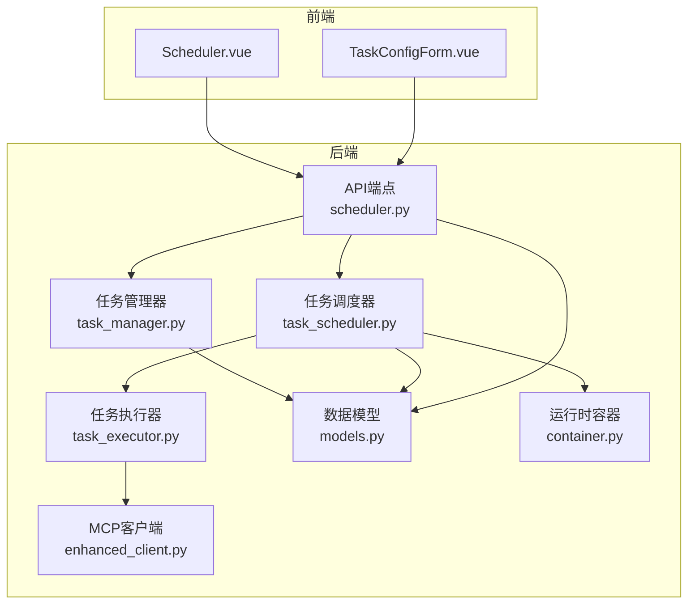
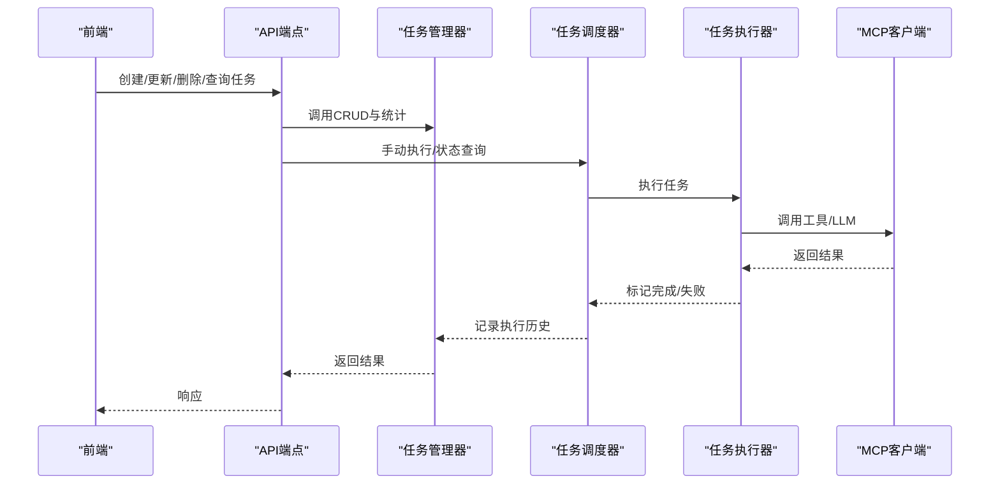
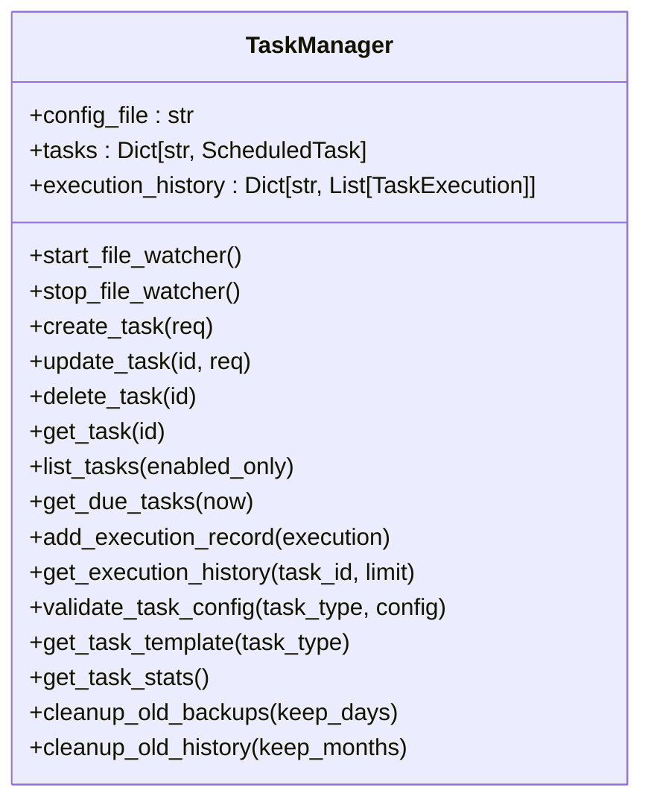
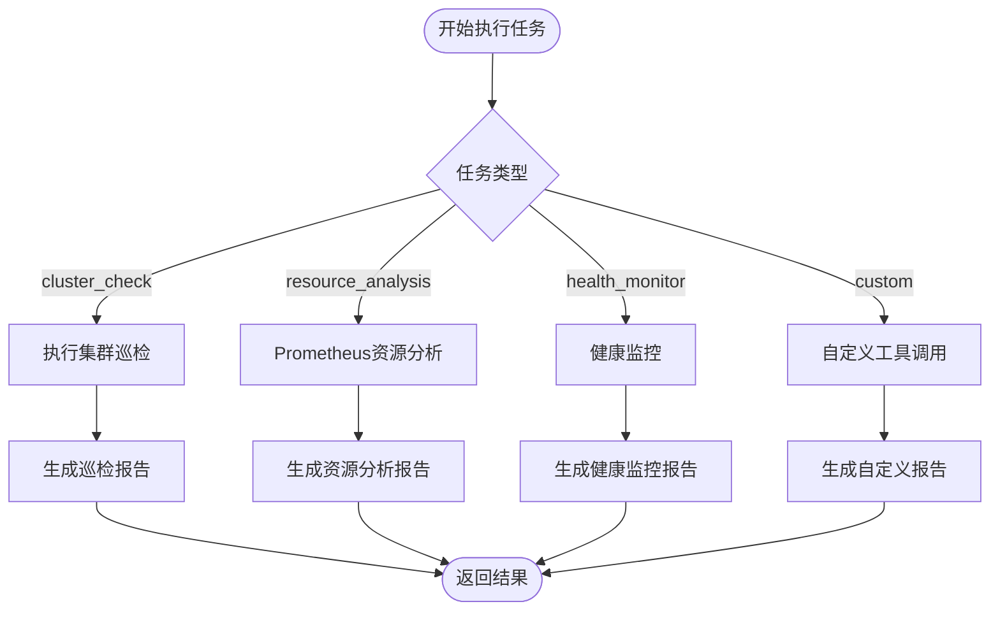
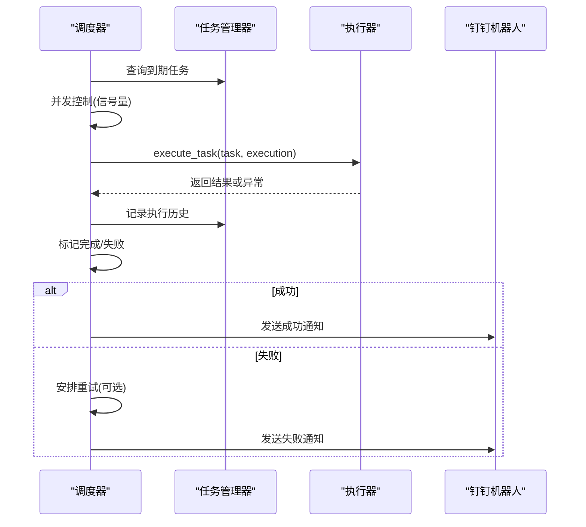
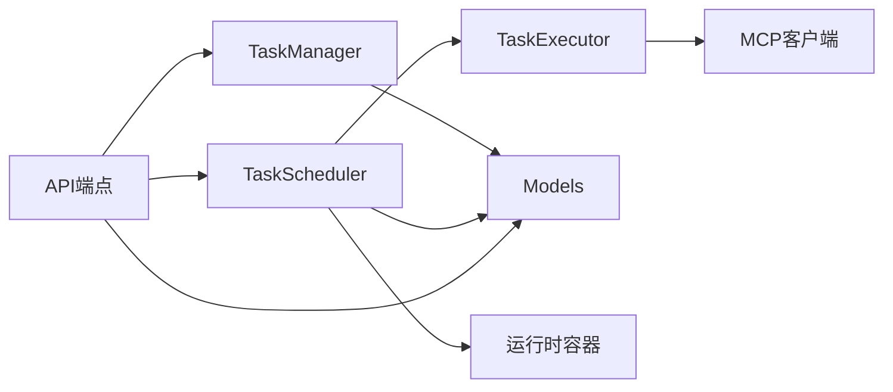

# 任务管理器

<cite>
**本文档引用的文件**
- [task_manager.py](file://backend/src/scheduler/task_manager.py)
- [models.py](file://backend/src/scheduler/models.py)
- [task_executor.py](file://backend/src/scheduler/task_executor.py)
- [task_scheduler.py](file://backend/src/scheduler/task_scheduler.py)
- [scheduler.py](file://backend/src/api/v2/endpoints/scheduler.py)
- [TaskConfigForm.vue](file://frontend-v2/src/components/TaskConfigForm.vue)
- [Scheduler.vue](file://frontend-v2/src/views/Scheduler.vue)
- [container.py](file://backend/src/app/container.py)
- [enhanced_client.py](file://backend/src/mcp/enhanced_client.py)
- [scheduled_tasks.example.json](file://config/scheduled_tasks.example.json)
</cite>

## 目录
1. [简介](#简介)
2. [项目结构](#项目结构)
3. [核心组件](#核心组件)
4. [架构总览](#架构总览)
5. [详细组件分析](#详细组件分析)
6. [依赖关系分析](#依赖关系分析)
7. [性能考量](#性能考量)
8. [故障排查指南](#故障排查指南)
9. [结论](#结论)
10. [附录](#附录)

## 简介
本文件面向“任务管理器”子系统，系统性阐述其设计架构与实现细节，涵盖任务的创建、更新、删除与查询；任务配置验证机制（参数校验、默认值设置、模板应用）；任务状态管理（状态转换、持久化与恢复）；任务生命周期（激活、暂停、取消、清理）；任务优先级与依赖关系处理（排序与执行顺序保障）；以及与后端其他组件的集成方式与最佳实践。同时提供面向使用者的代码示例路径与前端交互说明，帮助快速上手与高效运维。

## 项目结构
任务管理器位于后端 scheduler 子系统，采用“模型-管理器-执行器-调度器-API”的分层设计，并通过前端 Cockpit 提供可视化管理界面。

图表来源
- [scheduler.py:15-33](file://backend/src/api/v2/endpoints/scheduler.py#L15-L33)
- [task_manager.py:133-176](file://backend/src/scheduler/task_manager.py#L133-L176)
- [task_executor.py:20-45](file://backend/src/scheduler/task_executor.py#L20-L45)
- [task_scheduler.py:23-57](file://backend/src/scheduler/task_scheduler.py#L23-L57)
- [models.py:38-135](file://backend/src/scheduler/models.py#L38-L135)
- [container.py:15-53](file://backend/src/app/container.py#L15-L53)
- [enhanced_client.py:1-200](file://backend/src/mcp/enhanced_client.py#L1-L200)

章节来源
- [scheduler.py:15-33](file://backend/src/api/v2/endpoints/scheduler.py#L15-L33)
- [task_manager.py:133-176](file://backend/src/scheduler/task_manager.py#L133-L176)
- [task_executor.py:20-45](file://backend/src/scheduler/task_executor.py#L20-L45)
- [task_scheduler.py:23-57](file://backend/src/scheduler/task_scheduler.py#L23-L57)
- [models.py:38-135](file://backend/src/scheduler/models.py#L38-L135)
- [container.py:15-53](file://backend/src/app/container.py#L15-L53)
- [enhanced_client.py:1-200](file://backend/src/mcp/enhanced_client.py#L1-L200)

## 核心组件
- 数据模型层：定义任务类型、状态、通知级别、任务配置、执行记录等，提供字段级校验与运行时计算（如下次执行时间）。
- 任务管理器：负责任务配置的文件存储、热重载、备份、CRUD、统计与执行历史持久化。
- 任务执行器：根据任务类型调用 MCP 工具与 LLM 处理器，生成报告与摘要。
- 任务调度器：基于 asyncio 的主循环，按分钟扫描到期任务，控制并发与重试，发送钉钉通知。
- API 层：提供任务 CRUD、执行历史、手动执行、统计、状态查询、配置模板与验证等接口。
- 前端 Cockpit：提供任务矩阵、执行流水、运行态监控与配置表单。

章节来源
- [models.py:14-135](file://backend/src/scheduler/models.py#L14-L135)
- [task_manager.py:133-629](file://backend/src/scheduler/task_manager.py#L133-L629)
- [task_executor.py:20-736](file://backend/src/scheduler/task_executor.py#L20-L736)
- [task_scheduler.py:23-487](file://backend/src/scheduler/task_scheduler.py#L23-L487)
- [scheduler.py:99-661](file://backend/src/api/v2/endpoints/scheduler.py#L99-L661)
- [TaskConfigForm.vue:1-746](file://frontend-v2/src/components/TaskConfigForm.vue#L1-L746)
- [Scheduler.vue:1-800](file://frontend-v2/src/views/Scheduler.vue#L1-L800)

## 架构总览
任务管理器围绕“配置文件驱动 + 运行时内存状态 + 异步调度执行”的模式工作：
- 配置文件：config/scheduled_tasks.json，包含版本、描述、更新时间与任务列表。
- 管理器：加载/保存配置，提供热重载与备份，维护任务字典与执行历史。
- 调度器：每分钟扫描到期任务，使用信号量控制并发，执行失败自动重试。
- 执行器：按任务类型调用 MCP 工具与 LLM，产出结果与摘要。
- API：提供 REST 接口，前端通过表单与视图进行可视化管理。

图表来源
- [scheduler.py:134-374](file://backend/src/api/v2/endpoints/scheduler.py#L134-L374)
- [task_manager.py:338-453](file://backend/src/scheduler/task_manager.py#L338-L453)
- [task_scheduler.py:108-283](file://backend/src/scheduler/task_scheduler.py#L108-L283)
- [task_executor.py:47-99](file://backend/src/scheduler/task_executor.py#L47-L99)
- [enhanced_client.py:1-200](file://backend/src/mcp/enhanced_client.py#L1-L200)

## 详细组件分析

### 数据模型与配置验证
- 任务类型与状态：TaskType、TaskStatus、NotificationLevel 等枚举，确保类型安全。
- ScheduledTask：包含任务标识、名称、描述、类型、Cron 表达式、时区、启用状态、通知级别与渠道、超时与重试策略、时间戳与运行时状态（下次/上次执行时间、最后执行记录ID）。
- TaskExecution：记录单次执行的开始/完成时间、耗时、结果、错误、重试次数与是否重试、通知状态等。
- 字段校验：对 ID、名称、Cron 表达式、配置字典等进行严格校验；Cron 表达式使用 croniter 验证。
- 默认配置与模板：get_default_task_config 提供各类型默认配置；validate_task_config 提供基础校验；TaskManager.get_task_template 提供前端表单模板。
- Cron 模板与描述：内置常用 Cron 模板与人类可读描述生成。

章节来源
- [models.py:14-135](file://backend/src/scheduler/models.py#L14-L135)
- [models.py:194-269](file://backend/src/scheduler/models.py#L194-L269)
- [models.py:341-393](file://backend/src/scheduler/models.py#L341-L393)
- [models.py:395-444](file://backend/src/scheduler/models.py#L395-L444)

### 任务管理器（TaskManager）
职责与能力：
- 配置文件管理：加载/保存 config/scheduled_tasks.json，创建默认配置，备份与清理旧备份。
- 热重载：基于 watchdog 文件监控，防抖处理，记录配置变更并通知回调。
- 任务CRUD：create_task、update_task、delete_task、get_task、list_tasks、按类型过滤、到期任务查询。
- 执行历史：add_execution_record、get_execution_history、get_latest_execution，按月分目录持久化。
- 配置验证与模板：validate_task_config（类型特定校验）、get_task_template。
- 统计与维护：get_task_stats、cleanup_old_backups、cleanup_old_history。
- 全局实例：initialize_task_manager/get_task_manager/cleanup_task_manager。

图表来源
- [task_manager.py:133-629](file://backend/src/scheduler/task_manager.py#L133-L629)
- [models.py:38-135](file://backend/src/scheduler/models.py#L38-L135)

章节来源
- [task_manager.py:139-176](file://backend/src/scheduler/task_manager.py#L139-L176)
- [task_manager.py:189-242](file://backend/src/scheduler/task_manager.py#L189-L242)
- [task_manager.py:263-303](file://backend/src/scheduler/task_manager.py#L263-L303)
- [task_manager.py:338-453](file://backend/src/scheduler/task_manager.py#L338-L453)
- [task_manager.py:500-552](file://backend/src/scheduler/task_manager.py#L500-L552)
- [task_manager.py:554-593](file://backend/src/scheduler/task_manager.py#L554-L593)
- [task_manager.py:595-622](file://backend/src/scheduler/task_manager.py#L595-L622)

### 任务执行器（TaskExecutor）
职责与能力：
- 按任务类型执行：集群巡检、资源分析、健康监控、自定义任务。
- 调用 MCP 工具与 LLM 处理器，生成报告与摘要。
- 执行统计：总执行次数、成功/失败次数、成功率、平均耗时、最近执行时间。
- 健康分析：服务、部署、Pod、节点状态分析，提取问题清单。
- 结果摘要：从 Markdown 或分析结果中抽取关键摘要，便于通知与展示。

图表来源
- [task_executor.py:47-99](file://backend/src/scheduler/task_executor.py#L47-L99)
- [task_executor.py:100-317](file://backend/src/scheduler/task_executor.py#L100-L317)
- [task_executor.py:318-418](file://backend/src/scheduler/task_executor.py#L318-L418)
- [task_executor.py:542-678](file://backend/src/scheduler/task_executor.py#L542-L678)

章节来源
- [task_executor.py:20-736](file://backend/src/scheduler/task_executor.py#L20-L736)

### 任务调度器（EnhancedTaskScheduler）
职责与能力：
- 主循环：每分钟扫描到期任务，避免重复执行，使用 asyncio.Semaphore 控制并发。
- 单任务执行：创建 TaskExecution，调用 TaskExecutor，标记成功/失败，更新任务下次执行时间。
- 重试机制：按 max_retries 与 retry_delay_seconds 安排重试，支持重试执行记录与通知。
- 通知：根据通知级别向钉钉群发送 Markdown 通知，包含任务类型、耗时、重试次数、错误摘要等。
- 手动执行：run_task_manually 支持强制执行（忽略 enabled 状态）。
- 运行态：get_running_tasks 返回正在执行的任务映射。

图表来源
- [task_scheduler.py:108-283](file://backend/src/scheduler/task_scheduler.py#L108-L283)
- [task_scheduler.py:285-391](file://backend/src/scheduler/task_scheduler.py#L285-L391)

章节来源
- [task_scheduler.py:23-57](file://backend/src/scheduler/task_scheduler.py#L23-L57)
- [task_scheduler.py:108-150](file://backend/src/scheduler/task_scheduler.py#L108-L150)
- [task_scheduler.py:158-214](file://backend/src/scheduler/task_scheduler.py#L158-L214)
- [task_scheduler.py:218-283](file://backend/src/scheduler/task_scheduler.py#L218-L283)
- [task_scheduler.py:285-391](file://backend/src/scheduler/task_scheduler.py#L285-L391)

### API 层（REST 接口）
- 任务管理：GET/POST/PUT/DELETE /scheduler/tasks，支持分页、过滤、手动执行。
- 执行历史：GET /scheduler/tasks/{task_id}/executions。
- 统计与状态：GET /scheduler/stats、/scheduler/running、/scheduler/status。
- 配置与模板：GET /scheduler/task-types、/scheduler/config/template/{task_type}、/scheduler/config/validate/{task_type}。
- Cron 验证：POST /scheduler/validate-cron。
- 维护：POST /scheduler/maintenance/cleanup、/scheduler/maintenance/reset-stats。

章节来源
- [scheduler.py:99-661](file://backend/src/api/v2/endpoints/scheduler.py#L99-L661)

### 前端集成
- Scheduler.vue：任务矩阵、执行流水、运行态监控、批量操作、分页与过滤。
- TaskConfigForm.vue：按任务类型动态渲染配置表单，Cron 编辑器，表单验证与保存。
- 与后端交互：通过 api.client 调用 scheduler API，自动刷新状态与统计数据。

章节来源
- [Scheduler.vue:1-800](file://frontend-v2/src/views/Scheduler.vue#L1-L800)
- [TaskConfigForm.vue:1-746](file://frontend-v2/src/components/TaskConfigForm.vue#L1-L746)

## 依赖关系分析
- TaskManager 依赖 models 中的 ScheduledTask、TaskExecution、TaskType、NotificationLevel、TaskCreateRequest、TaskUpdateRequest、默认配置与校验工具。
- TaskExecutor 依赖 MCP 客户端与 LLM 处理器，复用现有工具与报告生成逻辑。
- TaskScheduler 依赖 TaskManager 与 TaskExecutor，通过运行时容器获取 MCP 客户端与 LLM 处理器。
- API 层聚合 TaskManager、TaskExecutor、TaskScheduler，提供统一的 REST 接口。
- 前端通过 API 与 Cockpit 进行交互，实现可视化配置与运维。

图表来源
- [scheduler.py:15-33](file://backend/src/api/v2/endpoints/scheduler.py#L15-L33)
- [task_manager.py:28-32](file://backend/src/scheduler/task_manager.py#L28-L32)
- [task_scheduler.py:15-21](file://backend/src/scheduler/task_scheduler.py#L15-L21)
- [task_executor.py:14-18](file://backend/src/scheduler/task_executor.py#L14-L18)
- [container.py:15-53](file://backend/src/app/container.py#L15-L53)
- [enhanced_client.py:1-200](file://backend/src/mcp/enhanced_client.py#L1-L200)

章节来源
- [scheduler.py:15-33](file://backend/src/api/v2/endpoints/scheduler.py#L15-L33)
- [task_manager.py:28-32](file://backend/src/scheduler/task_manager.py#L28-L32)
- [task_scheduler.py:15-21](file://backend/src/scheduler/task_scheduler.py#L15-L21)
- [task_executor.py:14-18](file://backend/src/scheduler/task_executor.py#L14-L18)
- [container.py:15-53](file://backend/src/app/container.py#L15-L53)
- [enhanced_client.py:1-200](file://backend/src/mcp/enhanced_client.py#L1-L200)

## 性能考量
- 并发控制：调度器使用 asyncio.Semaphore 控制最大并发任务数，避免资源争用。
- 防抖与批处理：文件监控使用防抖与延迟重载，减少频繁 I/O。
- 历史与备份：执行历史按月分目录存储，限制保留数量；备份文件自动清理，避免磁盘膨胀。
- Cron 验证：Cron 表达式使用 croniter 验证，确保调度准确性。
- 通知开销：通知按级别发送，避免冗余通知造成带宽浪费。

[本节为通用指导，无需具体文件引用]

## 故障排查指南
常见问题与定位思路：
- 配置文件无法热重载：检查 watchdog 是否安装、文件监控是否启用、配置路径是否一致。
- 任务未执行：检查 enabled 状态、Cron 表达式是否有效、下次执行时间是否正确。
- 执行失败重试：查看执行历史与重试次数，确认 retry_delay_seconds 设置；检查 MCP 工具可用性。
- 通知未发送：检查钉钉机器人 webhook 配置、通知级别设置。
- 并发阻塞：调整 max_concurrent_tasks，观察运行态面板中的并发数。
- 数据清理：使用维护接口清理旧备份与历史，释放磁盘空间。

章节来源
- [task_manager.py:263-303](file://backend/src/scheduler/task_manager.py#L263-L303)
- [task_manager.py:595-622](file://backend/src/scheduler/task_manager.py#L595-L622)
- [task_scheduler.py:285-391](file://backend/src/scheduler/task_scheduler.py#L285-L391)
- [scheduler.py:606-631](file://backend/src/api/v2/endpoints/scheduler.py#L606-L631)

## 结论
任务管理器以“配置文件驱动 + 运行时内存状态 + 异步调度执行”为核心，结合严格的配置验证、完善的执行历史与通知机制，提供了高可用、可观测、可维护的定时任务体系。通过前端 Cockpit 与 API 的协同，实现了从配置到执行、从监控到维护的全生命周期管理。

[本节为总结性内容，无需具体文件引用]

## 附录

### 任务配置验证机制
- 基础校验：TaskType、TaskStatus、NotificationLevel、ScheduledTask 字段校验。
- 类型特定校验：如资源分析任务需提供 prometheus_url 或启用 use_env_config；集群检查的命名空间数组类型校验。
- 模板应用：get_default_task_config 提供默认配置，TaskManager.get_task_template 提供前端表单模板。

章节来源
- [models.py:14-135](file://backend/src/scheduler/models.py#L14-L135)
- [models.py:374-393](file://backend/src/scheduler/models.py#L374-L393)
- [task_manager.py:554-593](file://backend/src/scheduler/task_manager.py#L554-L593)

### 任务状态管理与持久化
- 状态转换：PENDING → RUNNING → SUCCESS/FAILED；重试时创建新的执行记录并标记 is_retry。
- 持久化：执行历史按月分目录保存；配置文件保存时自动备份，保留最近10个备份。
- 恢复机制：文件监控热重载，记录变更并通知回调。

章节来源
- [models.py:14-21](file://backend/src/scheduler/models.py#L14-L21)
- [task_manager.py:500-552](file://backend/src/scheduler/task_manager.py#L500-L552)
- [task_manager.py:75-96](file://backend/src/scheduler/task_manager.py#L75-L96)

### 任务生命周期管理
- 激活/暂停：通过 enabled 字段控制；手动执行可强制执行（忽略 enabled）。
- 取消：调度器在 stop 时取消运行中的任务。
- 清理：清理旧备份与历史，释放磁盘空间。

章节来源
- [task_scheduler.py:77-107](file://backend/src/scheduler/task_scheduler.py#L77-L107)
- [task_manager.py:595-622](file://backend/src/scheduler/task_manager.py#L595-L622)

### 任务优先级与依赖关系
- 优先级：当前实现未显式支持任务优先级字段；可通过 Cron 表达式与并发控制间接影响执行顺序。
- 依赖关系：当前实现未提供任务间依赖关系；如需依赖，可在任务内部顺序调用多个工具或通过自定义任务组合实现。

[本节为概念性说明，无需具体文件引用]

### 使用示例（代码示例路径）
- 创建任务
  - API：POST /scheduler/tasks
  - 示例路径：[scheduler.py:134-174](file://backend/src/api/v2/endpoints/scheduler.py#L134-L174)
- 更新任务
  - API：PUT /scheduler/tasks/{task_id}
  - 示例路径：[scheduler.py:209-253](file://backend/src/api/v2/endpoints/scheduler.py#L209-L253)
- 删除任务
  - API：DELETE /scheduler/tasks/{task_id}
  - 示例路径：[scheduler.py:254-279](file://backend/src/api/v2/endpoints/scheduler.py#L254-L279)
- 查询任务
  - API：GET /scheduler/tasks
  - 示例路径：[scheduler.py:99-133](file://backend/src/api/v2/endpoints/scheduler.py#L99-L133)
- 手动执行任务
  - API：POST /scheduler/tasks/{task_id}/run
  - 示例路径：[scheduler.py:333-374](file://backend/src/api/v2/endpoints/scheduler.py#L333-L374)
- 获取执行历史
  - API：GET /scheduler/tasks/{task_id}/executions
  - 示例路径：[scheduler.py:280-332](file://backend/src/api/v2/endpoints/scheduler.py#L280-L332)
- 获取统计与状态
  - API：GET /scheduler/stats, GET /scheduler/status, GET /scheduler/running
  - 示例路径：[scheduler.py:375-430](file://backend/src/api/v2/endpoints/scheduler.py#L375-L430)
- 验证 Cron 表达式
  - API：POST /scheduler/validate-cron
  - 示例路径：[scheduler.py:492-532](file://backend/src/api/v2/endpoints/scheduler.py#L492-L532)
- 获取任务类型与模板
  - API：GET /scheduler/task-types, GET /scheduler/config/template/{task_type}
  - 示例路径：[scheduler.py:433-491](file://backend/src/api/v2/endpoints/scheduler.py#L433-L491)
- 配置文件示例
  - 示例文件：[scheduled_tasks.example.json:1-8](file://config/scheduled_tasks.example.json#L1-L8)

### 与其他组件的集成方式与最佳实践
- 与 MCP 的集成：TaskExecutor 通过 EnhancedMCPClient 调用工具，支持 SSE/STDIO 连接与工具发现。
- 与 LLM 的集成：TaskExecutor 使用 EnhancedLLMProcessor 生成报告与摘要，提升自动化运维价值。
- 与运行时容器的集成：调度器通过 container.get_active_container() 获取 MCP 客户端与 LLM 处理器，确保初始化顺序正确。
- 最佳实践：
  - 使用 Cron 模板与验证接口确保表达式正确性。
  - 合理设置超时与重试，避免长时间阻塞。
  - 通过通知级别控制通知频率，避免噪音。
  - 定期清理旧备份与历史，保持系统整洁。

章节来源
- [task_executor.py:14-18](file://backend/src/scheduler/task_executor.py#L14-L18)
- [task_scheduler.py:458-471](file://backend/src/scheduler/task_scheduler.py#L458-L471)
- [container.py:15-53](file://backend/src/app/container.py#L15-L53)
- [enhanced_client.py:1-200](file://backend/src/mcp/enhanced_client.py#L1-L200)