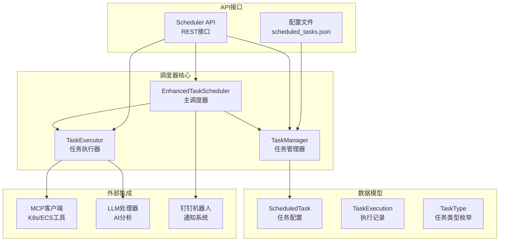
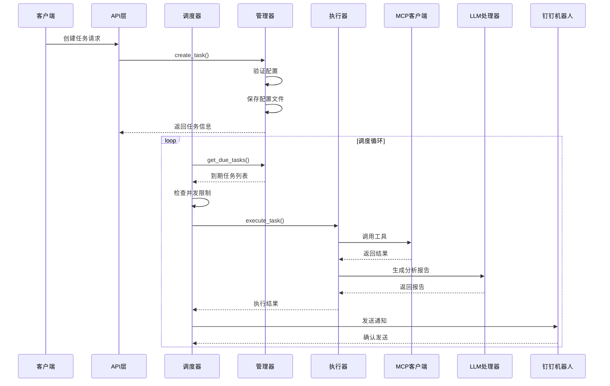
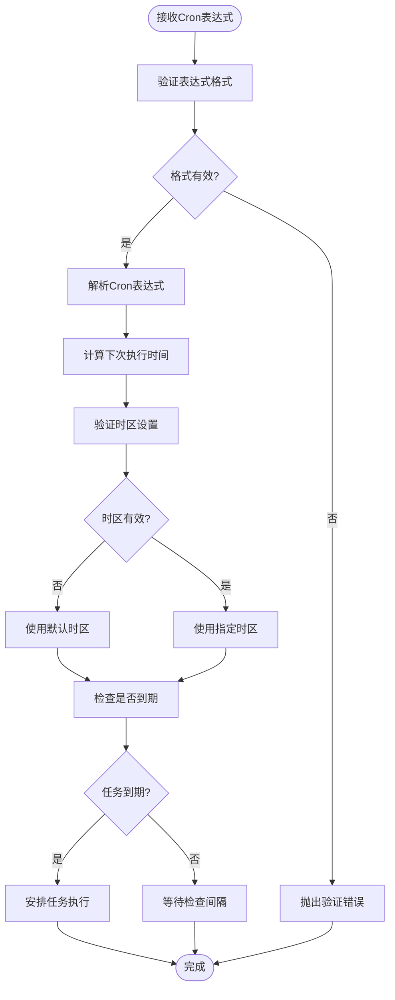
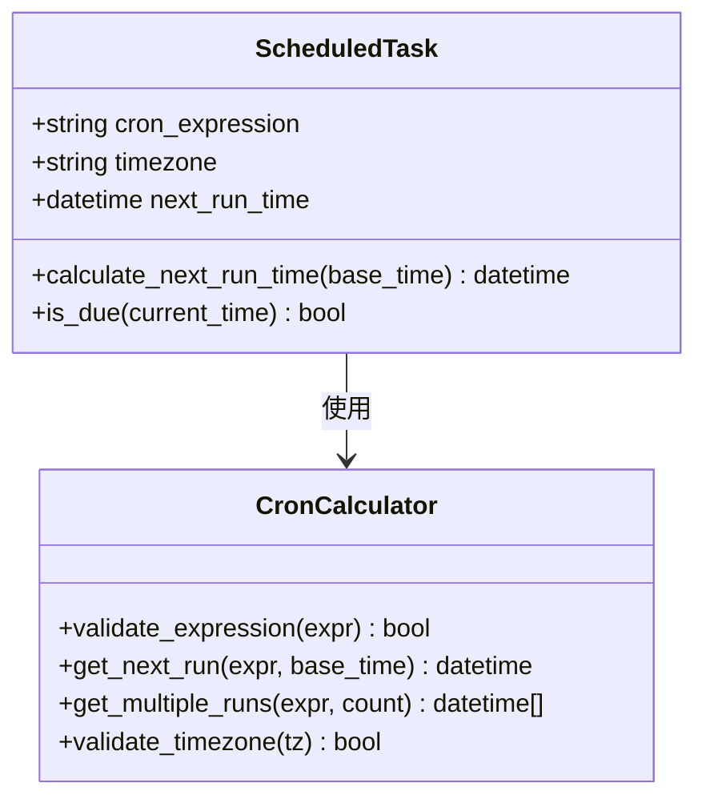
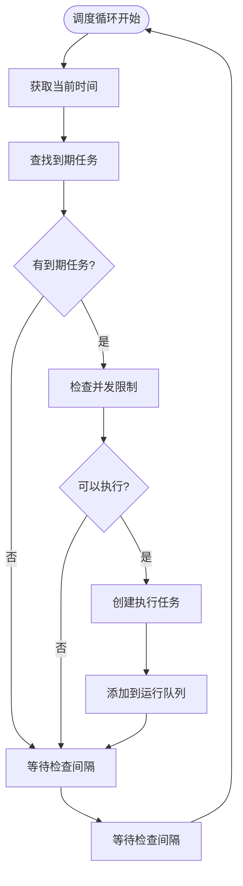
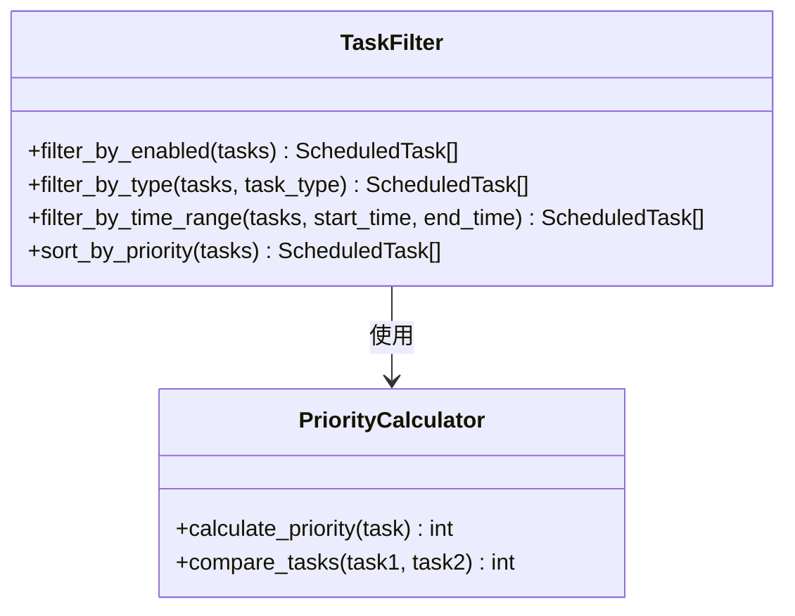
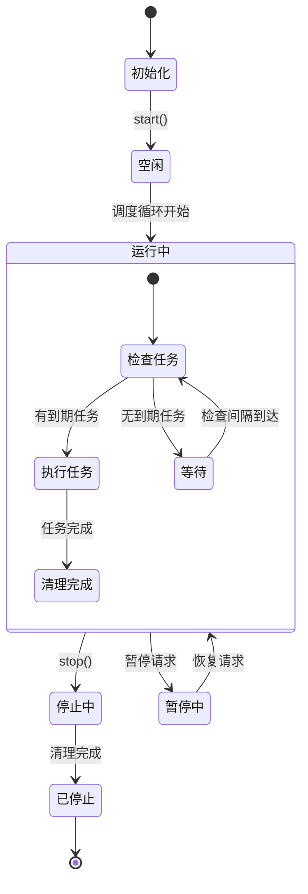
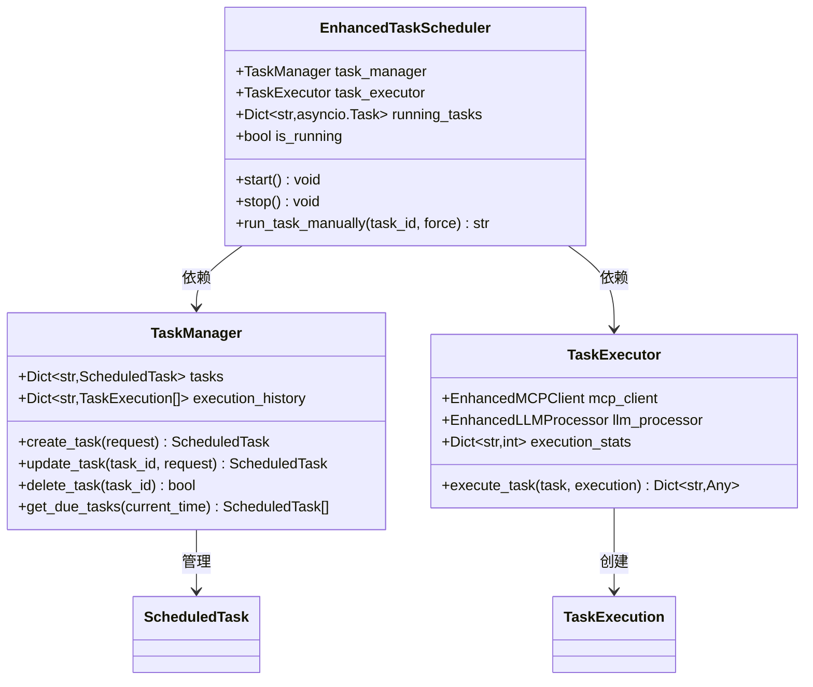
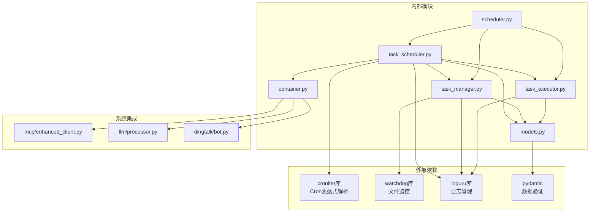
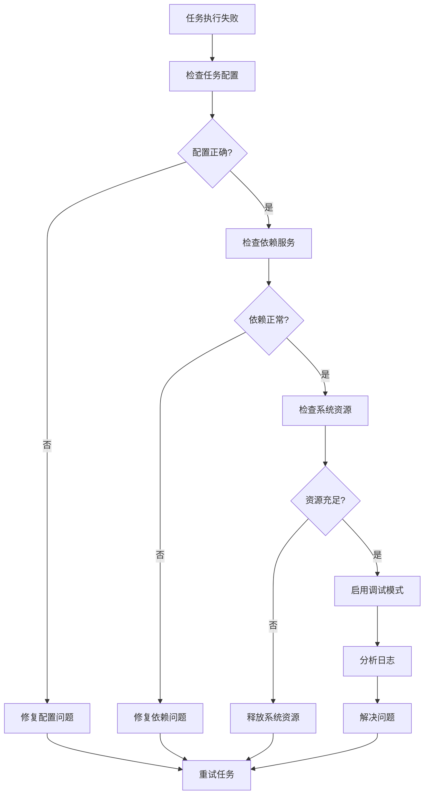

# 任务调度器

<cite>
**本文档引用的文件**
- [task_scheduler.py](file://backend/src/scheduler/task_scheduler.py)
- [task_manager.py](file://backend/src/scheduler/task_manager.py)
- [task_executor.py](file://backend/src/scheduler/task_executor.py)
- [models.py](file://backend/src/scheduler/models.py)
- [scheduler.py](file://backend/src/api/v2/endpoints/scheduler.py)
- [container.py](file://backend/src/app/container.py)
- [main.py](file://backend/main.py)
- [scheduled_tasks.example.json](file://config/scheduled_tasks.example.json)
</cite>

## 目录
1. [简介](#简介)
2. [项目结构](#项目结构)
3. [核心组件](#核心组件)
4. [架构概览](#架构概览)
5. [详细组件分析](#详细组件分析)
6. [依赖关系分析](#依赖关系分析)
7. [性能考虑](#性能考虑)
8. [故障排除指南](#故障排除指南)
9. [结论](#结论)
10. [附录](#附录)

## 简介

增强型任务调度器是一个基于Python asyncio的高性能任务调度系统，专为Kubernetes运维机器人设计。该调度器支持多种任务类型，包括集群巡检、资源分析、健康监控和自定义任务，通过Cron表达式实现精确的时间调度，并集成了通知机制和重试策略。

该系统采用模块化设计，将任务管理、执行和调度分离，提供了完整的生命周期管理、并发控制和错误处理机制。调度器能够与MCP客户端和LLM处理器无缝集成，为运维自动化提供强大的技术支持。

## 项目结构

增强型任务调度器位于后端系统的scheduler目录中，采用分层架构设计：



**图表来源**
- [task_scheduler.py:23-58](file://backend/src/scheduler/task_scheduler.py#L23-L58)
- [task_manager.py:133-177](file://backend/src/scheduler/task_manager.py#L133-L177)
- [task_executor.py:20-46](file://backend/src/scheduler/task_executor.py#L20-L46)

**章节来源**
- [task_scheduler.py:1-487](file://backend/src/scheduler/task_scheduler.py#L1-L487)
- [task_manager.py:1-657](file://backend/src/scheduler/task_manager.py#L1-L657)
- [task_executor.py:1-736](file://backend/src/scheduler/task_executor.py#L1-L736)

## 核心组件

### EnhancedTaskScheduler - 主调度器

EnhancedTaskScheduler是调度系统的核心组件，负责协调整个调度过程。其主要特性包括：

- **异步调度循环**：基于asyncio实现高效的事件驱动调度
- **并发控制**：使用信号量限制同时执行的任务数量
- **任务管理**：与TaskManager和TaskExecutor紧密协作
- **通知集成**：通过钉钉机器人发送执行结果通知

### TaskManager - 任务管理器

TaskManager负责任务配置的持久化和管理：

- **配置文件管理**：支持JSON配置文件的读取、写入和热重载
- **文件监控**：使用watchdog库实时监控配置文件变更
- **任务生命周期管理**：提供完整的CRUD操作
- **执行历史追踪**：记录和管理任务执行历史

### TaskExecutor - 任务执行器

TaskExecutor处理不同类型任务的实际执行：

- **多任务类型支持**：支持集群巡检、资源分析、健康监控和自定义任务
- **MCP工具集成**：与Kubernetes和ECS工具链深度集成
- **LLM分析能力**：利用大语言模型生成专业的运维报告
- **执行统计**：跟踪任务执行的成功率和性能指标

**章节来源**
- [task_scheduler.py:23-58](file://backend/src/scheduler/task_scheduler.py#L23-L58)
- [task_manager.py:133-177](file://backend/src/scheduler/task_manager.py#L133-L177)
- [task_executor.py:20-46](file://backend/src/scheduler/task_executor.py#L20-L46)

## 架构概览

增强型任务调度器采用分层架构，确保各组件职责明确且松耦合：



**图表来源**
- [task_scheduler.py:108-150](file://backend/src/scheduler/task_scheduler.py#L108-L150)
- [task_manager.py:338-430](file://backend/src/scheduler/task_manager.py#L338-L430)
- [task_executor.py:47-99](file://backend/src/scheduler/task_executor.py#L47-L99)

## 详细组件分析

### 时间计算与Cron表达式解析

调度器使用croniter库进行Cron表达式的解析和验证：



**图表来源**
- [models.py:93-135](file://backend/src/scheduler/models.py#L93-L135)
- [task_scheduler.py:118-134](file://backend/src/scheduler/task_scheduler.py#L118-L134)

#### Cron表达式验证机制

调度器实现了多层次的Cron表达式验证：

1. **格式验证**：使用正则表达式确保表达式符合标准格式
2. **语法验证**：通过croniter库验证表达式的语法正确性
3. **边界检查**：验证时间范围和特殊字符的有效性
4. **时区处理**：支持多时区配置和转换

#### 下次执行时间计算



**图表来源**
- [models.py:118-135](file://backend/src/scheduler/models.py#L118-L135)
- [models.py:301-326](file://backend/src/scheduler/models.py#L301-L326)

**章节来源**
- [models.py:93-135](file://backend/src/scheduler/models.py#L93-L135)
- [models.py:301-326](file://backend/src/scheduler/models.py#L301-L326)

### 任务队列管理与调度策略

调度器采用基于时间轮询的调度策略：



**图表来源**
- [task_scheduler.py:108-150](file://backend/src/scheduler/task_scheduler.py#L108-L150)

#### 并发控制机制

调度器实现了多层并发控制：

1. **信号量控制**：使用asyncio.Semaphore限制同时执行的任务数量
2. **任务去重**：防止同一任务的重复执行
3. **资源竞争处理**：通过异步任务管理避免竞态条件
4. **优雅停机**：支持平滑的任务取消和清理

**章节来源**
- [task_scheduler.py:54-56](file://backend/src/scheduler/task_scheduler.py#L54-L56)
- [task_scheduler.py:125-133](file://backend/src/scheduler/task_scheduler.py#L125-L133)

### 调度算法实现

#### 任务过滤与优先级排序



**图表来源**
- [task_manager.py:469-475](file://backend/src/scheduler/task_manager.py#L469-L475)

#### 重试策略与错误处理

调度器实现了智能的重试机制：

1. **指数退避**：重试延迟随重试次数增加而增长
2. **最大重试限制**：防止无限重试导致资源浪费
3. **错误分类**：区分可重试和不可重试错误
4. **通知机制**：在重试失败时发送通知

**章节来源**
- [task_scheduler.py:218-283](file://backend/src/scheduler/task_scheduler.py#L218-L283)

### 状态管理与生命周期

调度器支持完整的生命周期管理：



**图表来源**
- [task_scheduler.py:59-107](file://backend/src/scheduler/task_scheduler.py#L59-L107)

**章节来源**
- [task_scheduler.py:59-107](file://backend/src/scheduler/task_scheduler.py#L59-L107)

### 与任务管理器和执行器的协作



**图表来源**
- [task_scheduler.py:29-44](file://backend/src/scheduler/task_scheduler.py#L29-L44)
- [task_manager.py:161-162](file://backend/src/scheduler/task_manager.py#L161-L162)
- [task_executor.py:26-36](file://backend/src/scheduler/task_executor.py#L26-L36)

**章节来源**
- [task_scheduler.py:29-44](file://backend/src/scheduler/task_scheduler.py#L29-L44)
- [task_manager.py:161-162](file://backend/src/scheduler/task_manager.py#L161-L162)
- [task_executor.py:26-36](file://backend/src/scheduler/task_executor.py#L26-L36)

## 依赖关系分析

调度器的依赖关系体现了清晰的分层架构：



**图表来源**
- [task_scheduler.py:7-18](file://backend/src/scheduler/task_scheduler.py#L7-L18)
- [task_manager.py:19-32](file://backend/src/scheduler/task_manager.py#L19-L32)
- [task_executor.py:7-17](file://backend/src/scheduler/task_executor.py#L7-L17)

**章节来源**
- [task_scheduler.py:7-18](file://backend/src/scheduler/task_scheduler.py#L7-L18)
- [task_manager.py:19-32](file://backend/src/scheduler/task_manager.py#L19-L32)
- [task_executor.py:7-17](file://backend/src/scheduler/task_executor.py#L7-L17)

## 性能考虑

### 并发优化策略

1. **信号量控制**：默认最大并发任务数为5，可根据系统资源调整
2. **异步I/O**：充分利用asyncio的异步特性减少阻塞
3. **内存管理**：限制执行历史记录数量，避免内存泄漏
4. **资源清理**：及时清理已完成的任务和过期的配置文件

### 配置优化建议

```python
# 性能优化配置示例
OPTIMIZED_SCHEDULER_CONFIG = {
    "max_concurrent_tasks": 10,  # 根据CPU核心数调整
    "check_interval": 30,        # 减少检查频率提高响应速度
    "history_limit": 50,         # 减少历史记录保存数量
    "backup_count": 5,           # 减少备份文件数量
}

# 内存优化配置
MEMORY_OPTIMIZED_CONFIG = {
    "execution_history_limit": 20,  # 限制执行历史
    "file_watcher_enabled": False,  # 禁用文件监控减少开销
    "notification_level": "error_only"  # 减少通知发送频率
}
```

### 监控指标

调度器提供了丰富的监控指标：

- **执行统计**：总执行次数、成功次数、失败次数
- **性能指标**：平均执行时间、成功率
- **资源使用**：并发任务数、内存占用
- **错误统计**：各类错误的发生频率

**章节来源**
- [task_executor.py:680-699](file://backend/src/scheduler/task_executor.py#L680-L699)
- [task_manager.py:596-622](file://backend/src/scheduler/task_manager.py#L596-L622)

## 故障排除指南

### 常见问题诊断

#### Cron表达式错误

```python
# 常见Cron表达式错误及解决方案
COMMON_CRON_ERRORS = {
    "59 * * * *": "分钟值超出范围(0-59)",
    "* * * *": "表达式格式不正确",
    "0 24 * * *": "小时值超出范围(0-23)",
    "0 0 32 * *": "日期值超出范围(1-31)",
    "0 0 * * 7": "星期值超出范围(0-6)"
}

# 验证Cron表达式的正确方法
def validate_cron_safely(expression):
    try:
        croniter(expression)
        return True, "表达式有效"
    except Exception as e:
        return False, f"表达式无效: {str(e)}"
```

#### 任务执行失败排查



#### 调度器启动失败

常见启动失败原因：
1. **MCP客户端未初始化**：检查MCP配置和服务可用性
2. **LLM处理器未初始化**：验证LLM配置和模型可用性
3. **钉钉机器人配置缺失**：确认Webhook URL和密钥设置
4. **配置文件权限问题**：检查配置文件的读写权限

**章节来源**
- [task_scheduler.py:37-44](file://backend/src/scheduler/task_scheduler.py#L37-L44)
- [task_manager.py:189-218](file://backend/src/scheduler/task_manager.py#L189-L218)

### 调试技巧

1. **启用详细日志**：设置LOG_LEVEL为DEBUG获取详细信息
2. **监控执行历史**：通过API查看任务执行记录
3. **检查系统资源**：监控CPU、内存和磁盘使用情况
4. **验证依赖服务**：确保MCP、LLM和钉钉服务正常运行

## 结论

增强型任务调度器是一个功能完善、设计合理的异步任务调度系统。它通过模块化设计实现了高度的可扩展性和可维护性，同时提供了丰富的功能特性：

- **多任务类型支持**：涵盖运维场景的各种需求
- **智能调度算法**：基于Cron表达式的精确时间控制
- **完善的错误处理**：支持重试、通知和监控
- **优雅的并发控制**：通过信号量和异步机制保证系统稳定性
- **深度系统集成**：与MCP、LLM和钉钉机器人无缝协作

该调度器为Kubernetes运维自动化提供了坚实的技术基础，能够有效提升运维效率和系统可靠性。

## 附录

### 配置示例

#### 基础配置文件

```json
{
  "version": "1.0",
  "name": "定时任务配置",
  "description": "钉钉K8s运维机器人定时任务配置",
  "updated_at": "2026-04-29T00:00:00+08:00",
  "tasks": [
    {
      "id": "cluster-inspection-001",
      "name": "每日集群巡检",
      "description": "每天上午9点执行集群健康巡检",
      "task_type": "cluster_check",
      "cron_expression": "0 9 * * *",
      "timezone": "Asia/Shanghai",
      "enabled": true,
      "config": {
        "scope": {
          "namespaces": ["default", "kube-system"],
          "include_events": true,
          "include_metrics": true
        },
        "analysis": {
          "check_resource_usage": true,
          "check_pod_status": true,
          "check_node_status": true,
          "generate_summary": true
        }
      },
      "notification_level": "error_only",
      "timeout_seconds": 300,
      "max_retries": 3,
      "retry_delay_seconds": 60
    }
  ]
}
```

#### 环境变量配置

```bash
# 调度器配置
SCHEDULER_ENABLED=true
SCHEDULER_CHECK_INTERVAL=60

# MCP配置
MCP_SERVERS_ENABLED=true
MCP_SERVERS_COUNT=2

# LLM配置
LLM_PROVIDER=openai
LLM_MODEL=gpt-4
LLM_TEMPERATURE=0.7

# 钉钉机器人配置
DINGTALK_WEBHOOK_URL=https://oapi.dingtalk.com/robot/send?access_token=your_token
DINGTALK_SECRET=your_secret
```

### API使用示例

#### 创建任务

```bash
curl -X POST "http://localhost:8000/api/v2/scheduler/tasks" \
  -H "Content-Type: application/json" \
  -H "Authorization: Bearer YOUR_TOKEN" \
  -d '{
    "name": "资源分析任务",
    "task_type": "resource_analysis",
    "cron_expression": "0 10 * * *",
    "config": {
      "prometheus_url": "http://prometheus:9090",
      "days": 7,
      "cpu_threshold": 60.0,
      "memory_threshold": 60.0
    },
    "enabled": true,
    "timeout_seconds": 300,
    "max_retries": 3
  }'
```

#### 获取任务状态

```bash
curl "http://localhost:8000/api/v2/scheduler/stats" \
  -H "Authorization: Bearer YOUR_TOKEN"
```

#### 手动执行任务

```bash
curl -X POST "http://localhost:8000/api/v2/scheduler/tasks/{task_id}/run" \
  -H "Authorization: Bearer YOUR_TOKEN"
```

### 性能优化建议

1. **合理设置并发数**：根据CPU核心数和内存容量调整max_concurrent_tasks
2. **优化Cron表达式**：避免过于频繁的任务执行
3. **监控系统资源**：定期检查CPU、内存和磁盘使用情况
4. **配置合适的超时时间**：根据任务复杂度设置合理的timeout_seconds
5. **启用适当的日志级别**：生产环境中使用INFO级别，开发环境中使用DEBUG级别