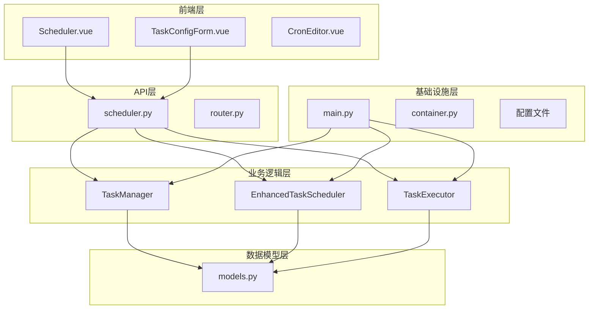
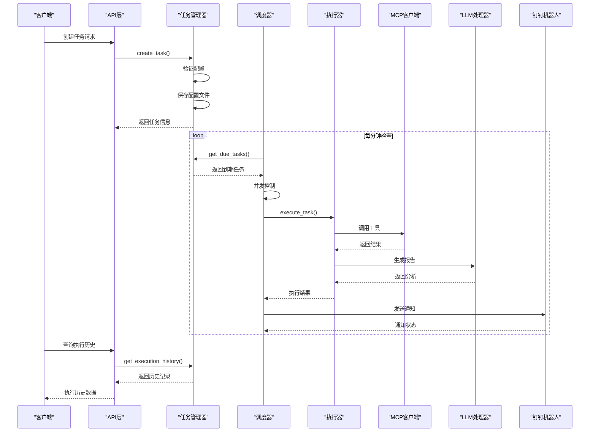
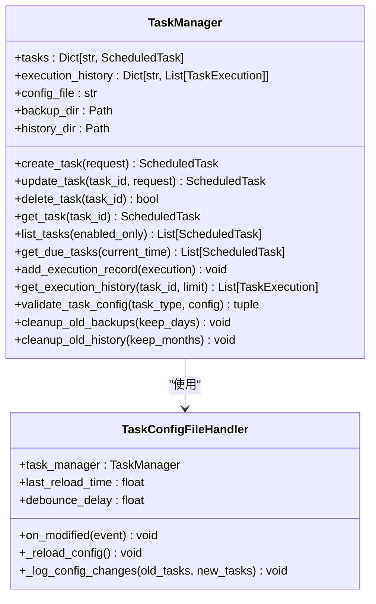
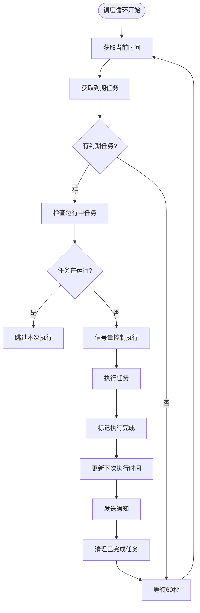
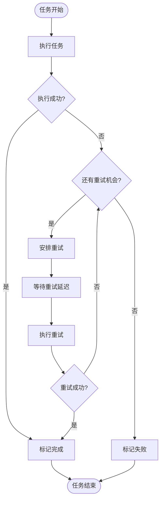
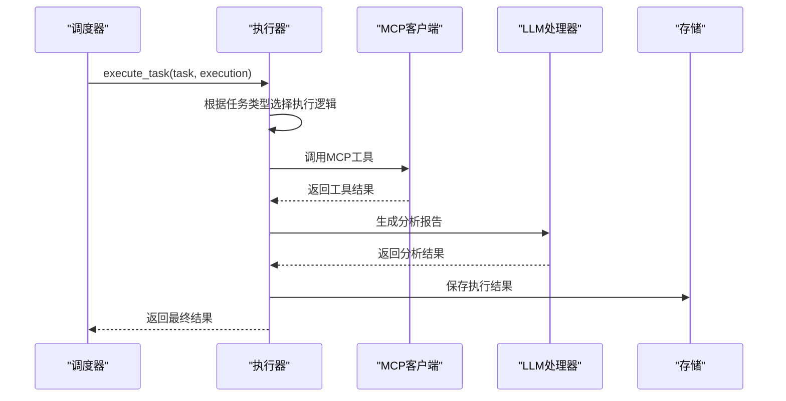
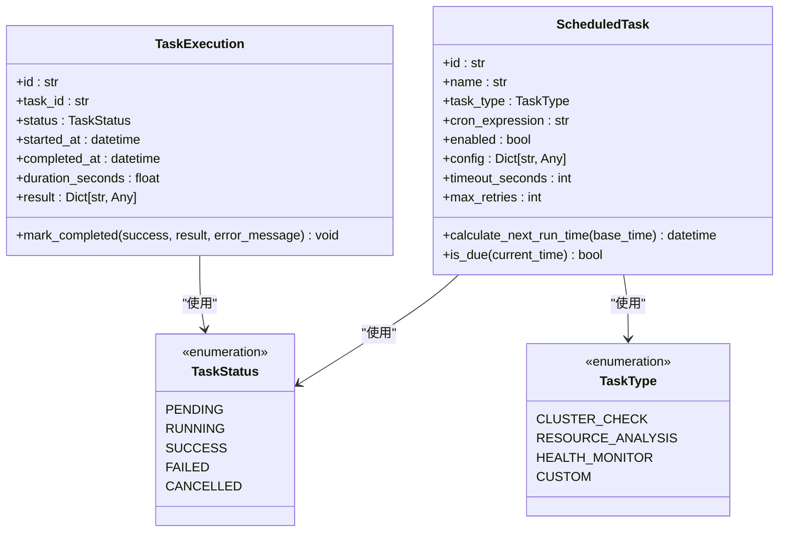
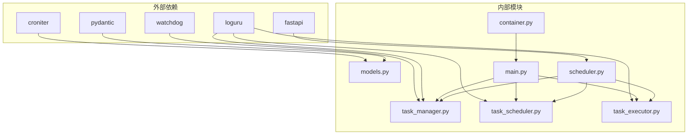

# 定时任务系统

<cite>
**本文档引用的文件**
- [task_manager.py](file://backend/src/scheduler/task_manager.py)
- [task_scheduler.py](file://backend/src/scheduler/task_scheduler.py)
- [task_executor.py](file://backend/src/scheduler/task_executor.py)
- [models.py](file://backend/src/scheduler/models.py)
- [scheduler.py](file://backend/src/api/v2/endpoints/scheduler.py)
- [main.py](file://backend/main.py)
- [container.py](file://backend/src/app/container.py)
- [scheduled_tasks.example.json](file://config/scheduled_tasks.example.json)
- [TaskConfigForm.vue](file://frontend-v2/src/components/TaskConfigForm.vue)
- [Scheduler.vue](file://frontend-v2/src/views/Scheduler.vue)
</cite>

## 目录
1. [简介](#简介)
2. [项目结构](#项目结构)
3. [核心组件](#核心组件)
4. [架构概览](#架构概览)
5. [详细组件分析](#详细组件分析)
6. [依赖关系分析](#依赖关系分析)
7. [性能考量](#性能考量)
8. [故障排除指南](#故障排除指南)
9. [结论](#结论)
10. [附录](#附录)

## 简介

定时任务系统是一个基于Python FastAPI框架构建的增强型任务调度器，集成了MCP客户端、LLM处理器和钉钉机器人通知功能。该系统提供了完整的任务生命周期管理，包括任务创建、调度、执行、监控和通知等功能。

系统支持多种任务类型，包括集群巡检、资源分析、健康监控和自定义任务，并提供了强大的配置管理和可视化界面。通过Cron表达式实现灵活的调度策略，支持并发控制、超时处理、重试机制和详细的执行历史记录。

## 项目结构

定时任务系统采用模块化的架构设计，主要分为以下几个层次：



**图表来源**
- [main.py:137-270](file://backend/main.py#L137-L270)
- [scheduler.py:15-33](file://backend/src/api/v2/endpoints/scheduler.py#L15-L33)

**章节来源**
- [main.py:1-494](file://backend/main.py#L1-L494)
- [scheduler.py:1-661](file://backend/src/api/v2/endpoints/scheduler.py#L1-L661)

## 核心组件

定时任务系统的核心组件包括任务管理器、调度器和执行器三个主要模块，每个模块都有明确的职责分工：

### 任务管理器 (TaskManager)
负责任务配置的持久化存储、热重载和备份管理。支持文件监控、配置验证和执行历史记录管理。

### 增强任务调度器 (EnhancedTaskScheduler)
基于现有的asyncio模式实现，负责任务的调度执行、并发控制和重试机制。支持多任务类型的统一调度。

### 任务执行器 (TaskExecutor)
负责具体任务的执行逻辑，复用现有的MCP客户端和LLM处理器，支持集群巡检、资源分析、健康监控等任务类型。

**章节来源**
- [task_manager.py:133-657](file://backend/src/scheduler/task_manager.py#L133-L657)
- [task_scheduler.py:23-487](file://backend/src/scheduler/task_scheduler.py#L23-L487)
- [task_executor.py:20-736](file://backend/src/scheduler/task_executor.py#L20-L736)

## 架构概览

系统采用分层架构设计，实现了清晰的关注点分离：



**图表来源**
- [task_scheduler.py:108-150](file://backend/src/scheduler/task_scheduler.py#L108-L150)
- [task_executor.py:47-99](file://backend/src/scheduler/task_executor.py#L47-L99)
- [scheduler.py:140-174](file://backend/src/api/v2/endpoints/scheduler.py#L140-L174)

## 详细组件分析

### 任务管理器 (TaskManager)

任务管理器是整个系统的核心协调者，负责任务配置的全生命周期管理：

#### 核心功能特性

1. **配置文件管理**
   - 支持JSON格式的配置文件存储
   - 自动备份机制，保留最近10个备份
   - 热重载功能，支持文件变更监控

2. **任务配置验证**
   - Cron表达式格式验证
   - 任务类型特定配置验证
   - 参数范围和类型检查

3. **执行历史管理**
   - 按月分组存储执行历史
   - 自动清理旧历史记录
   - 支持分页查询和统计



**图表来源**
- [task_manager.py:133-657](file://backend/src/scheduler/task_manager.py#L133-L657)

#### 配置文件结构

系统使用标准化的JSON配置文件格式：

```json
{
  "version": "1.0",
  "name": "定时任务配置",
  "description": "钉钉K8s运维机器人定时任务配置",
  "updated_at": "2026-04-29T00:00:00+08:00",
  "tasks": [
    {
      "id": "unique-task-id",
      "name": "任务名称",
      "description": "任务描述",
      "task_type": "cluster_check",
      "cron_expression": "0 9 * * *",
      "timezone": "Asia/Shanghai",
      "enabled": true,
      "config": {},
      "notification_level": "error_only",
      "timeout_seconds": 300,
      "max_retries": 3,
      "created_at": "2026-04-29T00:00:00+08:00",
      "updated_at": "2026-04-29T00:00:00+08:00"
    }
  ]
}
```

**章节来源**
- [task_manager.py:189-242](file://backend/src/scheduler/task_manager.py#L189-L242)
- [scheduled_tasks.example.json:1-8](file://config/scheduled_tasks.example.json#L1-L8)

### 增强任务调度器 (EnhancedTaskScheduler)

调度器基于现有的asyncio模式实现，提供了高效的异步调度能力：

#### 调度算法实现



**图表来源**
- [task_scheduler.py:108-150](file://backend/src/scheduler/task_scheduler.py#L108-L150)

#### 并发控制机制

调度器实现了基于信号量的并发控制：

- 最大并发任务数：5个
- 任务执行超时控制：300秒
- 重试机制：最多3次重试，每次重试间隔60秒

#### 重试策略



**图表来源**
- [task_scheduler.py:218-283](file://backend/src/scheduler/task_scheduler.py#L218-L283)

**章节来源**
- [task_scheduler.py:23-150](file://backend/src/scheduler/task_scheduler.py#L23-L150)
- [task_scheduler.py:218-283](file://backend/src/scheduler/task_scheduler.py#L218-L283)

### 任务执行器 (TaskExecutor)

执行器负责具体的任务执行逻辑，复用了现有的MCP客户端和LLM处理器：

#### 支持的任务类型

1. **集群巡检 (CLUSTER_CHECK)**
   - 执行Kubernetes集群全面巡检
   - 支持命名空间过滤和深度控制
   - 生成详细的巡检报告

2. **资源分析 (RESOURCE_ANALYSIS)**
   - 分析Prometheus资源利用率
   - 支持CPU、内存、磁盘、网络指标
   - 生成资源优化建议

3. **健康监控 (HEALTH_MONITOR)**
   - 监控集群关键组件状态
   - 检查服务、部署、Pod、节点健康状况
   - 识别潜在问题并生成报告

4. **自定义任务 (CUSTOM)**
   - 支持多个MCP工具的组合调用
   - 可配置的参数和执行流程
   - 集成LLM进行结果分析

#### 执行流程



**图表来源**
- [task_executor.py:47-99](file://backend/src/scheduler/task_executor.py#L47-L99)

**章节来源**
- [task_executor.py:20-46](file://backend/src/scheduler/task_executor.py#L20-L46)
- [task_executor.py:100-317](file://backend/src/scheduler/task_executor.py#L100-L317)

### 数据模型 (Models)

系统使用Pydantic定义了完整的数据模型体系：

#### 核心数据模型



**图表来源**
- [models.py:38-135](file://backend/src/scheduler/models.py#L38-L135)
- [models.py:137-192](file://backend/src/scheduler/models.py#L137-L192)

#### Cron表达式验证

系统提供了完整的Cron表达式验证机制：

- **格式验证**：使用croniter库验证表达式格式
- **时区处理**：支持多种时区配置
- **边界检查**：验证表达式的时间范围
- **描述生成**：提供人类可读的表达式描述

**章节来源**
- [models.py:14-28](file://backend/src/scheduler/models.py#L14-L28)
- [models.py:38-135](file://backend/src/scheduler/models.py#L38-L135)
- [models.py:301-326](file://backend/src/scheduler/models.py#L301-L326)

### API接口设计

系统提供了RESTful API接口，支持完整的任务管理功能：

#### 主要API端点

1. **任务管理接口**
   - GET `/scheduler/tasks` - 获取任务列表
   - POST `/scheduler/tasks` - 创建新任务
   - GET `/scheduler/tasks/{task_id}` - 获取任务详情
   - PUT `/scheduler/tasks/{task_id}` - 更新任务
   - DELETE `/scheduler/tasks/{task_id}` - 删除任务

2. **执行管理接口**
   - GET `/scheduler/tasks/{task_id}/executions` - 获取执行历史
   - POST `/scheduler/tasks/{task_id}/run` - 手动执行任务

3. **系统管理接口**
   - GET `/scheduler/stats` - 获取统计信息
   - GET `/scheduler/running` - 获取运行中任务
   - GET `/scheduler/status` - 获取调度器状态

**章节来源**
- [scheduler.py:99-430](file://backend/src/api/v2/endpoints/scheduler.py#L99-L430)

### 前端界面

系统提供了直观的Web界面，支持任务的可视化管理：

#### 核心界面组件

1. **调度面板 (Scheduler.vue)**
   - 任务矩阵展示
   - 执行流水查看
   - 运行状态监控
   - 批量操作支持

2. **任务配置表单 (TaskConfigForm.vue)**
   - Cron表达式编辑器
   - 任务类型配置
   - 执行参数设置
   - 实时验证反馈

3. **Cron编辑器 (CronEditor.vue)**
   - 可视化Cron表达式编辑
   - 实时验证和预览
   - 常用模板选择

**章节来源**
- [Scheduler.vue:1-800](file://frontend-v2/src/views/Scheduler.vue#L1-L800)
- [TaskConfigForm.vue:1-746](file://frontend-v2/src/components/TaskConfigForm.vue#L1-L746)

## 依赖关系分析

系统采用了清晰的依赖注入和模块化设计：



**图表来源**
- [task_manager.py:20-26](file://backend/src/scheduler/task_manager.py#L20-L26)
- [models.py:11](file://backend/src/scheduler/models.py#L11)

### 关键依赖关系

1. **Cron表达式处理**：依赖croniter库进行表达式验证和时间计算
2. **文件监控**：可选依赖watchdog库实现配置文件的实时监控
3. **日志记录**：使用loguru库提供结构化日志输出
4. **配置管理**：通过RuntimeContainer管理全局服务实例

**章节来源**
- [task_manager.py:20-26](file://backend/src/scheduler/task_manager.py#L20-L26)
- [models.py:11](file://backend/src/scheduler/models.py#L11)

## 性能考量

定时任务系统在设计时充分考虑了性能优化：

### 并发控制
- 最大并发任务数限制为5个，防止系统过载
- 使用asyncio实现异步执行，提高I/O密集型任务的效率
- 信号量机制确保资源合理分配

### 内存管理
- 执行历史记录限制为最近100条，避免内存泄漏
- 按月分组存储历史数据，便于清理和管理
- 自动清理机制定期删除过期数据

### 网络优化
- 重用MCP客户端连接，减少连接开销
- LLM处理器复用机制，避免重复初始化
- 异步通知发送，不影响任务执行主线程

### 存储优化
- JSON文件存储，读写性能良好
- 备份文件自动轮转，限制数量为10个
- 历史数据按月分割，便于查询和清理

## 故障排除指南

### 常见问题及解决方案

#### 1. Cron表达式验证失败
**症状**：创建任务时报Cron表达式错误
**原因**：
- 表达式格式不正确
- 数值超出允许范围
- 语法不符合5段式要求

**解决方法**：
```bash
# 使用API验证Cron表达式
curl -X POST "http://localhost:8000/api/v2/scheduler/validate-cron" \
  -H "Content-Type: application/json" \
  -d '{"expression": "0 9 * * *"}'
```

#### 2. 任务执行超时
**症状**：任务执行超过设定时间被强制终止
**原因**：
- 任务逻辑复杂，执行时间过长
- MCP工具调用响应慢
- LLM分析处理耗时

**解决方法**：
- 增加timeout_seconds配置
- 优化任务逻辑
- 调整任务执行频率

#### 3. 通知发送失败
**症状**：任务执行完成后未收到钉钉通知
**原因**：
- 钉钉机器人配置错误
- 网络连接问题
- Webhook地址失效

**解决方法**：
- 检查DINGTALK_WEBHOOK_URL环境变量
- 验证Webhook地址和密钥
- 查看系统日志获取详细错误信息

#### 4. 配置文件热重载失败
**症状**：修改配置文件后未生效
**原因**：
- watchdog库未安装
- 文件权限问题
- 配置文件格式错误

**解决方法**：
```bash
# 安装watchdog依赖
pip install watchdog

# 检查文件权限
chmod 644 config/scheduled_tasks.json

# 验证配置文件格式
python -m json.tool config/scheduled_tasks.json
```

### 调试技巧

#### 启用详细日志
```bash
# 设置日志级别
export LOG_LEVEL=DEBUG

# 查看系统状态
curl http://localhost:8000/api/v2/scheduler/status
```

#### 监控执行历史
```bash
# 获取最近执行记录
curl "http://localhost:8000/api/v2/scheduler/tasks/{task_id}/executions?page=1&page_size=10"
```

**章节来源**
- [scheduler.py:577-631](file://backend/src/api/v2/endpoints/scheduler.py#L577-L631)

## 结论

定时任务系统是一个功能完整、架构清晰的自动化任务管理平台。通过模块化设计和清晰的职责分离，系统实现了高可用性和可扩展性。

### 主要优势

1. **完整的生命周期管理**：从任务创建到执行监控的全流程支持
2. **灵活的调度策略**：基于Cron表达式的精确调度和多种任务类型
3. **强大的执行能力**：复用现有MCP和LLM技术栈，提供丰富的任务执行能力
4. **完善的监控机制**：详细的执行历史、统计信息和通知功能
5. **良好的用户体验**：直观的Web界面和丰富的配置选项

### 扩展建议

1. **任务依赖管理**：支持任务间的依赖关系和执行顺序控制
2. **动态配置更新**：支持运行时配置的动态更新而无需重启
3. **任务优先级**：实现任务优先级队列，确保关键任务优先执行
4. **分布式调度**：支持多实例部署，实现任务的分布式调度
5. **性能监控**：增加更详细的性能指标收集和分析功能

## 附录

### 配置示例

#### 基础配置
```json
{
  "version": "1.0",
  "name": "生产环境定时任务",
  "description": "生产环境的定时任务配置",
  "updated_at": "2026-04-29T00:00:00+08:00",
  "tasks": [
    {
      "id": "cluster-inspection-001",
      "name": "每日集群巡检",
      "task_type": "cluster_check",
      "cron_expression": "0 9 * * *",
      "enabled": true,
      "config": {
        "scope": {
          "namespaces": ["default", "kube-system"],
          "maxDepth": 2
        },
        "analysis": {
          "check_resource_usage": true,
          "check_pod_status": true,
          "check_node_status": true
        }
      },
      "notification_level": "error_only",
      "timeout_seconds": 300,
      "max_retries": 3
    }
  ]
}
```

#### 环境变量配置
```bash
# 基础配置
export SCHEDULER_ENABLED=true
export INSPECTION_ENABLED=false
export LOG_LEVEL=INFO

# 钉钉机器人配置
export DINGTALK_WEBHOOK_URL="https://oapi.dingtalk.com/robot/send?access_token=your_token"
export DINGTALK_SECRET="your_secret"

# MCP配置
export MCP_SERVERS="[]"
export MCP_BUILTIN_K8S_ECS_TOOLS_ENABLED=true
```

### API使用示例

#### 创建任务
```bash
curl -X POST "http://localhost:8000/api/v2/scheduler/tasks" \
  -H "Content-Type: application/json" \
  -d '{
    "name": "资源分析任务",
    "task_type": "resource_analysis",
    "cron_expression": "0 10 * * *",
    "config": {
      "prometheus_url": "http://prometheus:9090",
      "days": 14,
      "cpu_threshold": 60.0,
      "memory_threshold": 60.0
    },
    "timeout_seconds": 600,
    "max_retries": 2
  }'
```

#### 获取任务状态
```bash
curl "http://localhost:8000/api/v2/scheduler/stats"
```

#### 手动执行任务
```bash
curl -X POST "http://localhost:8000/api/v2/scheduler/tasks/{task_id}/run"
```

**章节来源**
- [scheduled_tasks.example.json:1-8](file://config/scheduled_tasks.example.json#L1-L8)
- [scheduler.py:140-174](file://backend/src/api/v2/endpoints/scheduler.py#L140-L174)