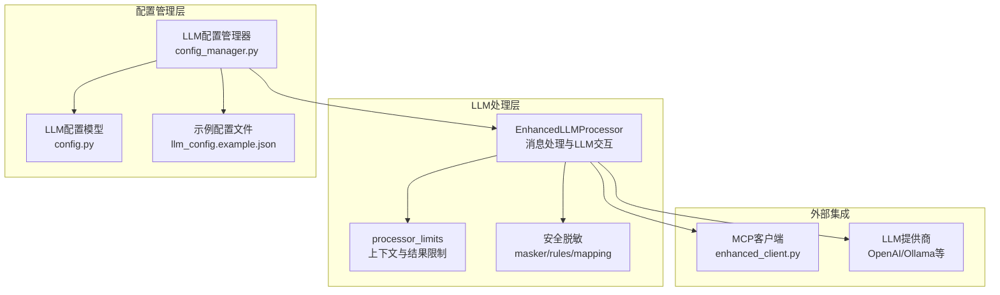
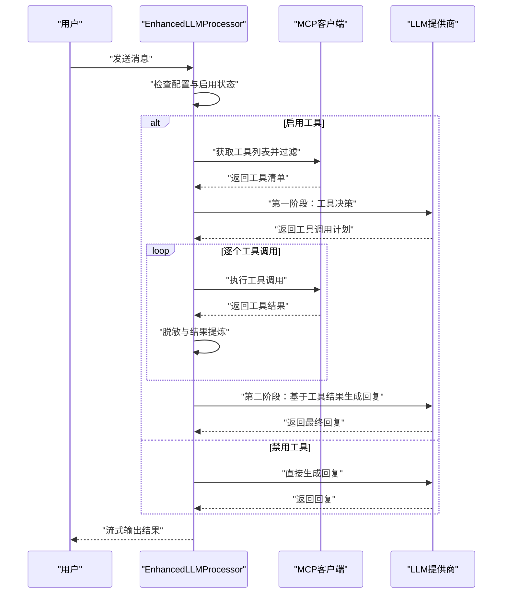
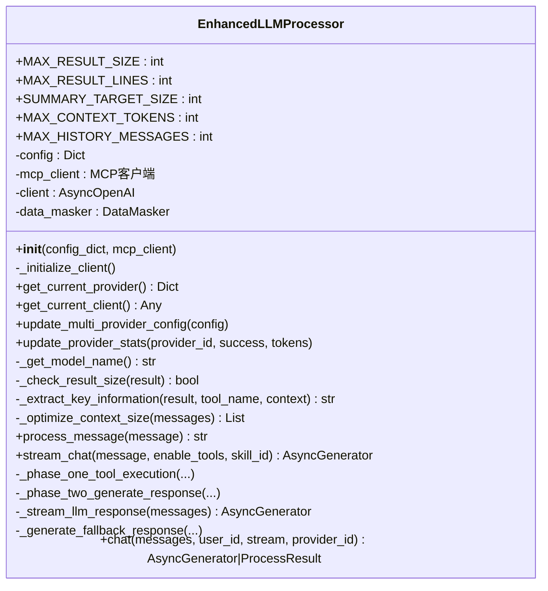
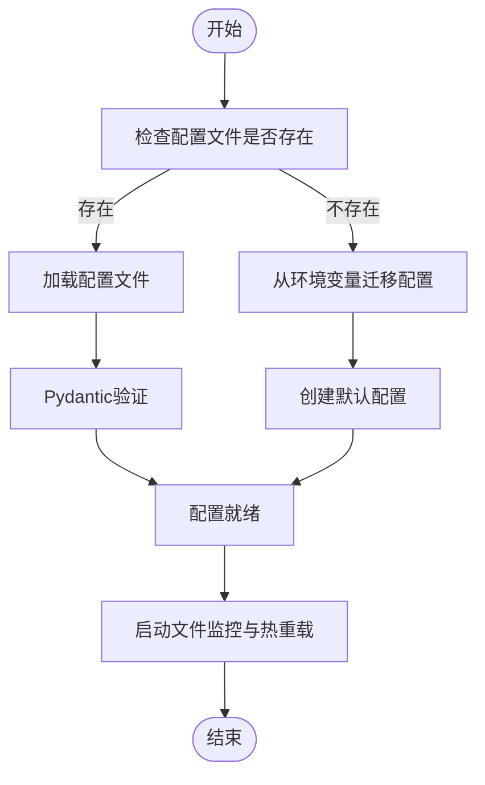
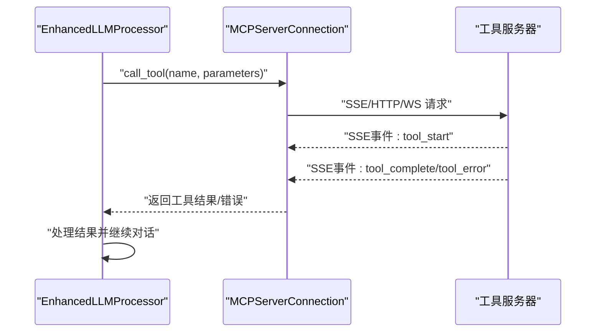
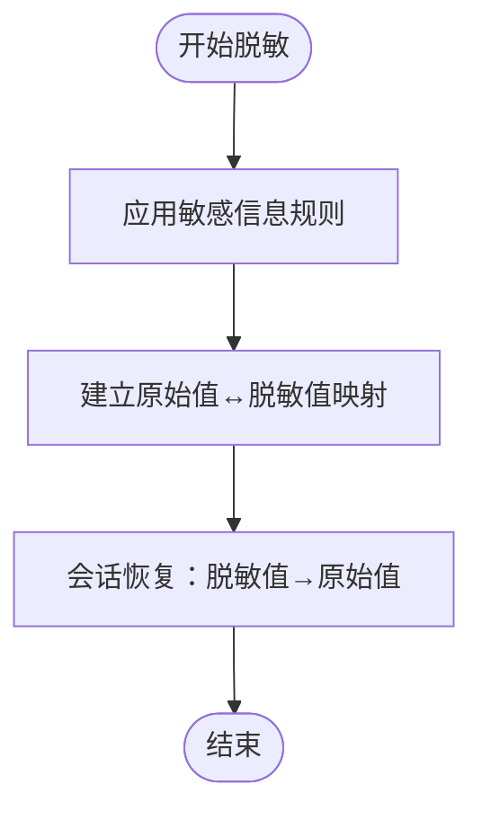
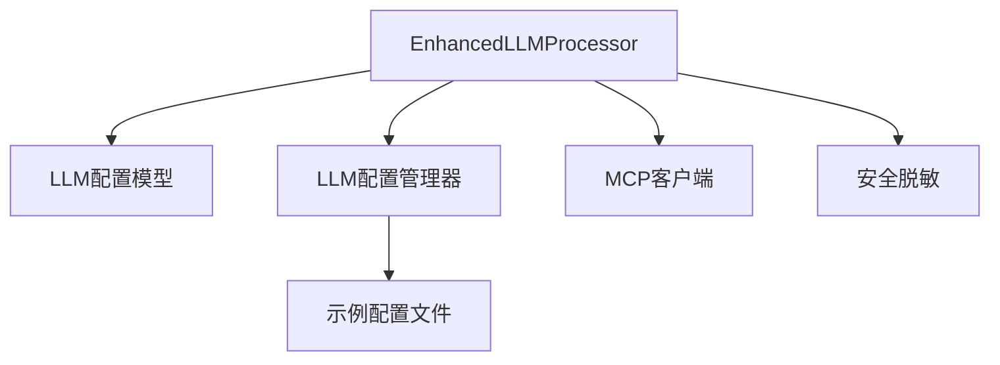

# LLM处理器

<cite>
**本文档引用的文件**
- [processor.py](file://backend/src/llm/processor.py)
- [processor_limits.py](file://backend/src/llm/processor_limits.py)
- [config.py](file://backend/src/llm/config.py)
- [config_manager.py](file://backend/src/llm/config_manager.py)
- [enhanced_client.py](file://backend/src/mcp/enhanced_client.py)
- [masker.py](file://backend/src/llm/security/masker.py)
- [config.py](file://backend/src/llm/security/config.py)
- [rules.py](file://backend/src/llm/security/rules.py)
- [mapping.py](file://backend/src/llm/security/mapping.py)
- [llm_config.example.json](file://config/llm_config.example.json)
</cite>

## 目录
1. [简介](#简介)
2. [项目结构](#项目结构)
3. [核心组件](#核心组件)
4. [架构概览](#架构概览)
5. [详细组件分析](#详细组件分析)
6. [依赖关系分析](#依赖关系分析)
7. [性能考量](#性能考量)
8. [故障排除指南](#故障排除指南)
9. [结论](#结论)
10. [附录](#附录)

## 简介
本文件针对LLM处理器进行深入技术文档化，重点围绕EnhancedLLMProcessor类的设计架构展开，涵盖以下方面：
- 基于环境变量的配置初始化与回退机制
- 多供应商客户端支持（OpenAI、Ollama等）的实现与扩展
- 错误处理与重试机制
- LLM客户端的创建流程、连接测试与故障恢复策略
- 配置管理机制（供应商切换、参数验证、热重载）
- 性能优化策略（token估算、超时设置、重试配置）
- 配置示例、使用场景与故障排除指南
- 与外部服务（MCP、LLM提供商）的集成方式与最佳实践

## 项目结构
LLM处理器位于后端子系统中，与MCP（Model Context Protocol）客户端紧密协作，形成“工具发现-工具调用-LLM对话”的闭环。关键模块包括：
- LLM处理器：负责消息处理、工具调用、LLM交互与结果优化
- 配置管理：支持文件配置与环境变量回退，提供热重载与备份
- 安全脱敏：对工具结果与LLM响应进行敏感信息脱敏与恢复
- MCP客户端：负责与外部工具服务器建立连接并执行工具调用

**图表来源**
- [processor.py:30-120](file://backend/src/llm/processor.py#L30-L120)
- [config.py:15-63](file://backend/src/llm/config.py#L15-L63)
- [config_manager.py:150-200](file://backend/src/llm/config_manager.py#L150-L200)
- [enhanced_client.py:33-112](file://backend/src/mcp/enhanced_client.py#L33-L112)
- [llm_config.example.json:1-45](file://config/llm_config.example.json#L1-L45)

**章节来源**
- [processor.py:30-120](file://backend/src/llm/processor.py#L30-L120)
- [config.py:15-63](file://backend/src/llm/config.py#L15-L63)
- [config_manager.py:150-200](file://backend/src/llm/config_manager.py#L150-L200)
- [enhanced_client.py:33-112](file://backend/src/mcp/enhanced_client.py#L33-L112)
- [llm_config.example.json:1-45](file://config/llm_config.example.json#L1-L45)

## 核心组件
- EnhancedLLMProcessor：简化版LLM处理器，直接基于环境变量字典配置，支持OpenAI与Ollama等供应商，具备两阶段流式聊天处理能力（工具执行 + LLM回复生成），内置结果提炼、上下文优化与脱敏恢复。
- LLM配置模型与管理器：提供Pydantic验证、文件读写、热重载、备份与环境变量回退，支持多供应商配置与全局默认参数。
- MCP客户端：负责与外部工具服务器建立连接（SSE/HTTP/WS等），自动发现工具、执行工具调用并处理超时与错误。
- 安全脱敏：在工具结果与LLM响应层面进行敏感信息脱敏与恢复，支持会话级映射管理与多种脱敏策略。

**章节来源**
- [processor.py:30-120](file://backend/src/llm/processor.py#L30-L120)
- [config.py:15-63](file://backend/src/llm/config.py#L15-L63)
- [config_manager.py:150-200](file://backend/src/llm/config_manager.py#L150-L200)
- [enhanced_client.py:33-112](file://backend/src/mcp/enhanced_client.py#L33-L112)
- [masker.py:12-25](file://backend/src/llm/security/masker.py#L12-L25)

## 架构概览
EnhancedLLMProcessor的运行流程分为两条主线：
- 简化消息处理：直接调用LLM生成回复，适用于无工具需求场景
- 两阶段流式聊天：先由LLM决策是否调用工具，再执行工具调用并将结果汇总给LLM生成最终回复，期间进行脱敏与上下文优化

**图表来源**
- [processor.py:520-750](file://backend/src/llm/processor.py#L520-L750)
- [processor.py:758-1061](file://backend/src/llm/processor.py#L758-L1061)
- [processor.py:1062-1214](file://backend/src/llm/processor.py#L1062-L1214)
- [enhanced_client.py:587-800](file://backend/src/mcp/enhanced_client.py#L587-L800)

**章节来源**
- [processor.py:520-750](file://backend/src/llm/processor.py#L520-L750)
- [processor.py:758-1061](file://backend/src/llm/processor.py#L758-L1061)
- [processor.py:1062-1214](file://backend/src/llm/processor.py#L1062-L1214)
- [enhanced_client.py:587-800](file://backend/src/mcp/enhanced_client.py#L587-L800)

## 详细组件分析

### EnhancedLLMProcessor 设计与实现
- 初始化与配置
  - 从环境变量或配置文件解析供应商、模型、API密钥、base_url、温度、最大token、超时、重试等参数
  - 基于供应商类型创建AsyncOpenAI客户端（OpenAI兼容接口），支持OpenAI与Ollama等
  - 初始化数据脱敏器，记录诊断日志并进行连接性测试
- 消息处理
  - 简化消息处理：直接调用LLM生成回复
  - 两阶段流式聊天：第一阶段由LLM决策工具调用，第二阶段汇总工具结果生成最终回复
- 结果处理与优化
  - 结果大小检查与提炼：对超大结果进行关键信息提取与分页建议
  - 上下文优化：估算token数量，控制历史消息与上下文大小
  - 脱敏恢复：在流式输出前对LLM响应进行敏感信息恢复
- 错误处理与回退
  - 客户端初始化失败时进入降级模式，仍可进行脱敏演示与提示
  - 工具调用超时与异常：记录错误并返回结构化状态更新
  - 第二阶段响应生成失败：提供回退响应摘要

**图表来源**
- [processor.py:30-120](file://backend/src/llm/processor.py#L30-L120)
- [processor.py:520-750](file://backend/src/llm/processor.py#L520-L750)
- [processor.py:758-1061](file://backend/src/llm/processor.py#L758-L1061)
- [processor.py:1062-1214](file://backend/src/llm/processor.py#L1062-L1214)

**章节来源**
- [processor.py:30-120](file://backend/src/llm/processor.py#L30-L120)
- [processor.py:520-750](file://backend/src/llm/processor.py#L520-L750)
- [processor.py:758-1061](file://backend/src/llm/processor.py#L758-L1061)
- [processor.py:1062-1214](file://backend/src/llm/processor.py#L1062-L1214)

### 配置管理机制
- 配置模型
  - LLMProviderConfig：定义供应商ID、名称、启用状态、模型、API密钥、base_url、温度、最大token、超时、重试、流式输出、功能支持等
  - LLMConfiguration：包含版本、名称、描述、全局启用状态、提供商列表、默认提供商、全局默认配置、安全与日志配置、缓存与监控配置
- 配置管理器
  - 文件读写与备份：支持创建默认配置、保存配置、备份与恢复
  - 环境变量回退：当配置文件不可用或未启用时，从环境变量构造与EnhancedLLMProcessor兼容的配置字典
  - 热重载：基于watchdog监控配置文件变更，防抖处理，记录变更并通知回调
  - 供应商切换：提供resolve_llm_processor_config_dict统一解析默认提供商配置

**图表来源**
- [config_manager.py:411-431](file://backend/src/llm/config_manager.py#L411-L431)
- [config_manager.py:281-315](file://backend/src/llm/config_manager.py#L281-L315)
- [config_manager.py:628-712](file://backend/src/llm/config_manager.py#L628-L712)
- [config.py:337-360](file://backend/src/llm/config.py#L337-L360)

**章节来源**
- [config.py:15-63](file://backend/src/llm/config.py#L15-L63)
- [config.py:95-162](file://backend/src/llm/config.py#L95-L162)
- [config_manager.py:411-431](file://backend/src/llm/config_manager.py#L411-L431)
- [config_manager.py:281-315](file://backend/src/llm/config_manager.py#L281-L315)
- [config_manager.py:628-712](file://backend/src/llm/config_manager.py#L628-L712)
- [config.py:337-360](file://backend/src/llm/config.py#L337-L360)

### MCP客户端与工具调用
- 连接类型
  - SSE：通过HTTP SSE事件流连接，支持长时间运行工具，具备指数退避重连
  - HTTP/WS：通过HTTP或WebSocket调用工具
  - stdio：本地子进程工具服务器
- 工具发现与过滤
  - 自动发现工具并支持启用/禁用列表过滤
  - 自动同步工具配置到MCP配置文件
- 工具调用与超时处理
  - SSE工具调用：通过HTTP POST触发，SSE事件流返回结果，支持消息队列等待与超时检测
  - 超时与错误：统一异常封装，记录活跃工具调用状态，便于重连后恢复

**图表来源**
- [enhanced_client.py:587-800](file://backend/src/mcp/enhanced_client.py#L587-L800)
- [enhanced_client.py:114-156](file://backend/src/mcp/enhanced_client.py#L114-L156)
- [enhanced_client.py:157-245](file://backend/src/mcp/enhanced_client.py#L157-L245)

**章节来源**
- [enhanced_client.py:587-800](file://backend/src/mcp/enhanced_client.py#L587-L800)
- [enhanced_client.py:114-156](file://backend/src/mcp/enhanced_client.py#L114-L156)
- [enhanced_client.py:157-245](file://backend/src/mcp/enhanced_client.py#L157-L245)

### 安全脱敏与恢复
- 脱敏引擎
  - 多规则匹配：主机名、IP地址、手机号、中文姓名、邮箱等
  - 多种策略：格式保持哈希、网络映射、部分掩码加密、完全加密、域名保持、姓名脱敏
- 会话管理
  - 会话级映射存储，支持脱敏值到原始值的恢复
  - 按会话统计与清理，支持调试日志
- 应用时机
  - 第一阶段工具执行后对结果进行脱敏
  - 第二阶段LLM生成回复前对响应进行恢复

**图表来源**
- [masker.py:25-75](file://backend/src/llm/security/masker.py#L25-L75)
- [masker.py:76-109](file://backend/src/llm/security/masker.py#L76-L109)
- [rules.py:54-151](file://backend/src/llm/security/rules.py#L54-L151)
- [mapping.py:46-112](file://backend/src/llm/security/mapping.py#L46-L112)

**章节来源**
- [masker.py:25-75](file://backend/src/llm/security/masker.py#L25-L75)
- [masker.py:76-109](file://backend/src/llm/security/masker.py#L76-L109)
- [rules.py:54-151](file://backend/src/llm/security/rules.py#L54-L151)
- [mapping.py:46-112](file://backend/src/llm/security/mapping.py#L46-L112)

## 依赖关系分析
- 组件耦合
  - EnhancedLLMProcessor依赖配置管理器提供的默认提供商配置字典
  - 与MCP客户端强耦合，用于工具发现与调用
  - 与安全脱敏模块弱耦合，通过DataMasker接口进行脱敏与恢复
- 外部依赖
  - OpenAI SDK（AsyncOpenAI）用于LLM调用
  - watchdog用于配置文件热重载
  - Pydantic用于配置模型验证
- 循环依赖
  - 未发现循环依赖，模块职责清晰

**图表来源**
- [processor.py:30-120](file://backend/src/llm/processor.py#L30-L120)
- [config.py:15-63](file://backend/src/llm/config.py#L15-L63)
- [config_manager.py:150-200](file://backend/src/llm/config_manager.py#L150-L200)
- [enhanced_client.py:33-112](file://backend/src/mcp/enhanced_client.py#L33-L112)
- [llm_config.example.json:1-45](file://config/llm_config.example.json#L1-L45)

**章节来源**
- [processor.py:30-120](file://backend/src/llm/processor.py#L30-L120)
- [config.py:15-63](file://backend/src/llm/config.py#L15-L63)
- [config_manager.py:150-200](file://backend/src/llm/config_manager.py#L150-L200)
- [enhanced_client.py:33-112](file://backend/src/mcp/enhanced_client.py#L33-L112)
- [llm_config.example.json:1-45](file://config/llm_config.example.json#L1-L45)

## 性能考量
- Token估算与上下文优化
  - 采用字符数估算token（约4字符/Token），结合历史消息与上下文大小限制，动态裁剪对话历史
- 超时与重试
  - LLM调用超时：第一阶段与第二阶段分别设置合理超时，避免阻塞
  - 工具调用超时：SSE工具调用支持独立超时，超过时限返回错误并清理活跃调用
  - 客户端重试：tenacity装饰器提供指数退避重试
- 结果处理优化
  - 对超大结果进行关键信息提炼，减少LLM输入负担
  - 流式输出：支持LLM与工具调用的流式响应，提升用户体验

**章节来源**
- [processor_limits.py:15-35](file://backend/src/llm/processor_limits.py#L15-L35)
- [processor.py:459-518](file://backend/src/llm/processor.py#L459-L518)
- [processor.py:1650-1690](file://backend/src/llm/processor.py#L1650-L1690)
- [enhanced_client.py:736-799](file://backend/src/mcp/enhanced_client.py#L736-L799)

## 故障排除指南
- LLM客户端初始化失败
  - 现象：日志显示初始化错误，进入降级模式
  - 排查：检查API密钥、base_url、代理设置；关注socks/proxy相关错误提示
- 工具调用超时
  - 现象：工具执行超时，返回错误状态
  - 排查：检查MCP服务器状态、网络连通性、工具服务器负载；调整超时配置
- 配置文件热重载失败
  - 现象：配置变更未生效或报JSON格式错误
  - 排查：确认文件路径、权限与JSON格式；检查watchdog可用性
- 脱敏恢复异常
  - 现象：LLM响应中敏感信息未正确恢复
  - 排查：确认会话ID一致、映射存储存在、调试日志开启

**章节来源**
- [processor.py:103-120](file://backend/src/llm/processor.py#L103-L120)
- [enhanced_client.py:214-244](file://backend/src/mcp/enhanced_client.py#L214-L244)
- [config_manager.py:78-119](file://backend/src/llm/config_manager.py#L78-L119)
- [masker.py:76-109](file://backend/src/llm/security/masker.py#L76-L109)

## 结论
EnhancedLLMProcessor通过清晰的模块划分与完善的错误处理机制，在保证功能完整性的同时兼顾了性能与可维护性。配合配置管理器的热重载与环境变量回退、MCP客户端的工具发现与调用、以及安全脱敏的敏感信息保护，形成了一个可扩展、可观测、可恢复的LLM处理体系。建议在生产环境中：
- 使用配置文件管理供应商与参数，启用热重载与备份
- 合理设置超时与重试，避免阻塞与资源浪费
- 开启脱敏功能并定期审计映射存储
- 监控MCP服务器状态与工具调用成功率

## 附录

### 配置示例与参数说明
- 示例配置文件：config/llm_config.example.json
  - enabled：是否启用LLM功能
  - providers：供应商列表，包含OpenAI兼容端点示例
  - global_defaults：全局默认参数（温度、最大token、超时、重试、流式输出）
  - security：脱敏开关、白名单工具等
  - logging：日志级别与敏感数据记录控制
- 环境变量回退：当配置文件不可用时，从环境变量构造与EnhancedLLMProcessor兼容的配置字典

**章节来源**
- [llm_config.example.json:1-45](file://config/llm_config.example.json#L1-L45)
- [config.py:300-317](file://backend/src/llm/config.py#L300-L317)
- [config.py:337-360](file://backend/src/llm/config.py#L337-L360)

### 使用场景
- 简化消息处理：无需工具调用的日常问答
- 两阶段流式聊天：需要结合工具执行与LLM分析的复杂场景
- 快捷指令：通过预设指令快速触发常见工具调用

**章节来源**
- [processor.py:520-535](file://backend/src/llm/processor.py#L520-L535)
- [processor.py:1620-1649](file://backend/src/llm/processor.py#L1620-L1649)

### 最佳实践
- 供应商切换：通过配置文件与管理器统一解析默认提供商，避免硬编码
- 参数验证：利用Pydantic模型验证配置合法性，防止运行时错误
- 性能优化：合理设置温度、最大token与上下文大小，启用流式输出
- 安全合规：启用脱敏与审计，严格控制日志中敏感信息的输出

**章节来源**
- [config.py:64-93](file://backend/src/llm/config.py#L64-L93)
- [config_manager.py:337-360](file://backend/src/llm/config.py#L337-L360)
- [masker.py:12-25](file://backend/src/llm/security/masker.py#L12-L25)