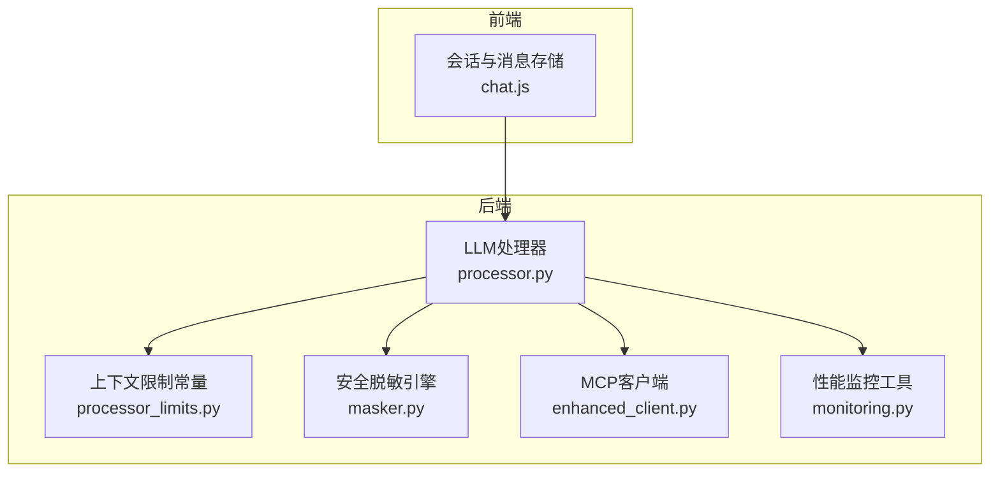
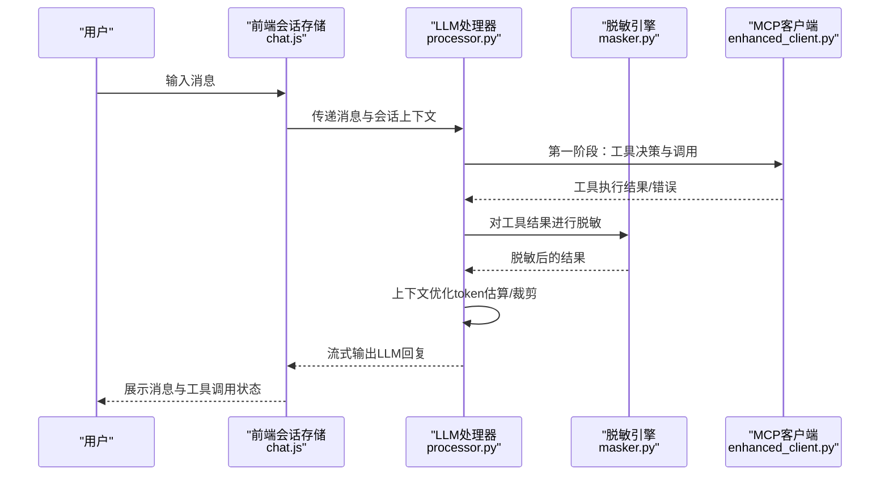
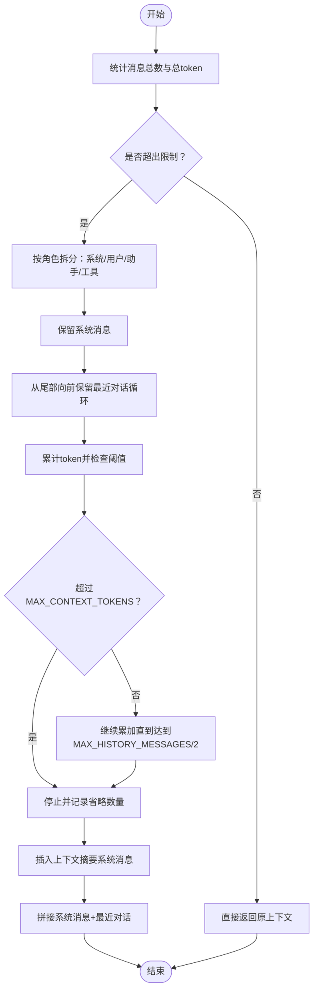
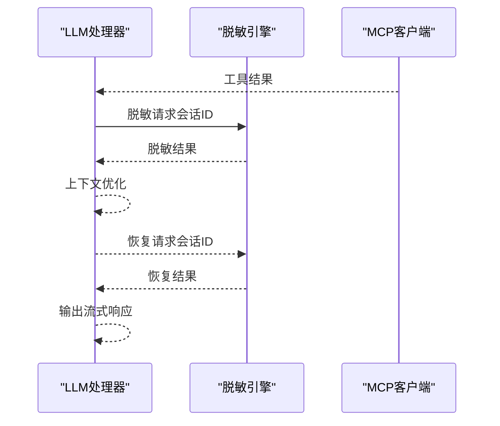
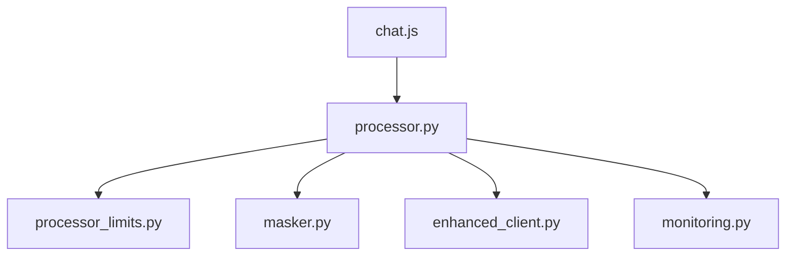

# 上下文管理

<cite>
**本文档引用的文件**
- [processor.py](file://backend/src/llm/processor.py)
- [processor_limits.py](file://backend/src/llm/processor_limits.py)
- [masker.py](file://backend/src/llm/security/masker.py)
- [enhanced_client.py](file://backend/src/mcp/enhanced_client.py)
- [monitoring.py](file://backend/src/utils/monitoring.py)
- [chat.js](file://frontend-v2/src/stores/chat.js)
</cite>

## 目录
1. [简介](#简介)
2. [项目结构](#项目结构)
3. [核心组件](#核心组件)
4. [架构总览](#架构总览)
5. [详细组件分析](#详细组件分析)
6. [依赖关系分析](#依赖关系分析)
7. [性能考量](#性能考量)
8. [故障排查指南](#故障排查指南)
9. [结论](#结论)
10. [附录](#附录)

## 简介
本文件围绕“上下文管理”主题，系统梳理并解释本项目的上下文优化策略与实现细节，涵盖以下方面：
- 上下文优化策略：token 估算、历史消息裁剪、性能优化
- 限制机制：MAX_CONTEXT_TOKENS 与 MAX_HISTORY_MESSAGES 的约束与回退策略
- 消息分类与优先级：系统消息、用户消息、助手消息、工具消息的管理
- 上下文摘要生成：省略消息的标记与性能监控
- 动态调整与资源回收：上下文窗口的动态控制与内存管理
- 最佳实践、性能调优与常见问题解决方案

## 项目结构
上下文管理相关的核心代码集中在后端 LLM 处理器模块，配合安全脱敏、MCP 工具调用、前端会话存储与监控工具共同构成完整的上下文生命周期。

图表来源
- [processor.py](file://backend/src/llm/processor.py)
- [processor_limits.py](file://backend/src/llm/processor_limits.py)
- [masker.py](file://backend/src/llm/security/masker.py)
- [enhanced_client.py](file://backend/src/mcp/enhanced_client.py)
- [monitoring.py](file://backend/src/utils/monitoring.py)
- [chat.js](file://frontend-v2/src/stores/chat.js)

章节来源
- [processor.py](file://backend/src/llm/processor.py)
- [processor_limits.py](file://backend/src/llm/processor_limits.py)
- [masker.py](file://backend/src/llm/security/masker.py)
- [enhanced_client.py](file://backend/src/mcp/enhanced_client.py)
- [monitoring.py](file://backend/src/utils/monitoring.py)
- [chat.js](file://frontend-v2/src/stores/chat.js)

## 核心组件
- LLM 处理器（EnhancedLLMProcessor）：负责两阶段对话流程、上下文优化、工具调用与流式输出。
- 上下文限制常量：定义 MAX_CONTEXT_TOKENS、MAX_HISTORY_MESSAGES、结果体量限制等。
- 安全脱敏引擎：在工具结果进入 LLM 前后进行脱敏与恢复，保障敏感信息不出域。
- MCP 客户端：提供工具发现、调用与结果队列管理，支撑上下文中的工具消息。
- 性能监控工具：采集系统与请求指标，辅助定位上下文过大、超时等问题。
- 前端会话存储：管理消息与工具调用的持久化、检索与上下文构建。

章节来源
- [processor.py](file://backend/src/llm/processor.py)
- [processor_limits.py](file://backend/src/llm/processor_limits.py)
- [masker.py](file://backend/src/llm/security/masker.py)
- [enhanced_client.py](file://backend/src/mcp/enhanced_client.py)
- [monitoring.py](file://backend/src/utils/monitoring.py)
- [chat.js](file://frontend-v2/src/stores/chat.js)

## 架构总览
上下文管理贯穿“工具决策—工具执行—LLM回复—流式输出”的完整链路，同时在两阶段之间进行上下文优化与脱敏处理。

图表来源
- [processor.py](file://backend/src/llm/processor.py)
- [masker.py](file://backend/src/llm/security/masker.py)
- [enhanced_client.py](file://backend/src/mcp/enhanced_client.py)
- [chat.js](file://frontend-v2/src/stores/chat.js)

## 详细组件分析

### 上下文优化策略与实现
- token 估算算法
  - 采用“粗略估算：约 4 字符/1 token”的启发式规则，快速评估消息体积，避免昂贵的模型调用。
  - 估算函数独立于主处理器，便于集中维护与调优。
- 历史消息裁剪
  - 保留系统消息（第一条）与最近的用户-助手-工具完整对话循环，确保上下文语义连贯。
  - 从尾部向前遍历，累计 token，一旦超过 MAX_CONTEXT_TOKENS 则停止，保证上下文在预算内。
  - 若仍有剩余空间，插入一条“上下文摘要”系统消息，标注省略的历史消息数量，帮助用户感知上下文被裁剪。
- 性能优化
  - 在两阶段对话中分别进行上下文优化，减少重复计算。
  - 流式输出阶段统一进行脱敏恢复，避免多次往返造成的性能损耗。
  - 对工具结果进行“智能提炼”，在超限时压缩为摘要，降低后续 LLM 输入规模。

图表来源
- [processor.py](file://backend/src/llm/processor.py)
- [processor_limits.py](file://backend/src/llm/processor_limits.py)

章节来源
- [processor.py](file://backend/src/llm/processor.py)
- [processor_limits.py](file://backend/src/llm/processor_limits.py)

### 限制机制：MAX_CONTEXT_TOKENS 与 MAX_HISTORY_MESSAGES
- MAX_CONTEXT_TOKENS
  - 作用：限制单次请求的上下文 token 上限，避免超出模型上下文窗口。
  - 实现：在上下文优化阶段，按角色拆分消息，从尾部向前累加估算 token，遇超限即停止。
- MAX_HISTORY_MESSAGES
  - 作用：限制保留的历史消息条数上限，控制消息数量。
  - 实现：在保留最近对话循环时，限制最多保留条数的一半，避免历史消息过多导致 token 超标。
- 回退策略
  - 当上下文过大时，插入“上下文摘要”系统消息，提示省略的消息数量。
  - 若仍超限，继续裁剪，直至满足阈值。
  - 工具结果过大时，采用“智能提炼”策略，压缩为摘要后再送入 LLM。

章节来源
- [processor.py](file://backend/src/llm/processor.py)
- [processor_limits.py](file://backend/src/llm/processor_limits.py)

### 消息分类与优先级处理
- 系统消息（system）
  - 保留全部，确保提示词与角色设定稳定。
- 用户消息（user）
  - 保留最近的一条，结合助手/工具消息形成完整对话循环。
- 助手消息（assistant）
  - 保留与用户消息对应的回复，维持对话连贯性。
- 工具消息（tool）
  - 保留与工具调用 ID 对应的结果，便于第二阶段 LLM 综合分析。
- 优先级策略
  - 严格保留系统消息与最近的完整对话循环。
  - 工具结果在进入 LLM 前进行脱敏与提炼，避免敏感信息泄露与输入膨胀。

章节来源
- [processor.py](file://backend/src/llm/processor.py)

### 上下文摘要生成与性能监控
- 摘要生成
  - 在裁剪后插入“上下文摘要”系统消息，标注省略的历史消息数量，帮助用户感知上下文变化。
- 性能监控
  - 使用性能监控工具采集系统指标（CPU、内存、磁盘、活跃连接、请求速率、平均响应时间）与请求指标（持续时间、错误率、端点统计）。
  - 通过监控数据定位上下文过大、超时、工具调用失败等瓶颈。

图表来源
- [processor.py](file://backend/src/llm/processor.py)
- [monitoring.py](file://backend/src/utils/monitoring.py)

章节来源
- [processor.py](file://backend/src/llm/processor.py)
- [monitoring.py](file://backend/src/utils/monitoring.py)

### 上下文窗口的动态调整与资源回收
- 动态调整
  - 在两阶段对话中分别进行上下文优化，避免一次性处理大量历史消息。
  - 根据工具结果大小与类型，动态选择“智能提炼”或“分页建议”，减少输入规模。
- 资源回收
  - 工具调用完成后，清理会话映射与临时状态，释放内存。
  - 前端会话存储支持压缩与健康检查，避免本地存储膨胀。

章节来源
- [processor.py](file://backend/src/llm/processor.py)
- [masker.py](file://backend/src/llm/security/masker.py)
- [chat.js](file://frontend-v2/src/stores/chat.js)

### 安全与隐私：脱敏与恢复
- 脱敏策略
  - 在工具结果进入 LLM 前进行脱敏，避免敏感信息泄露。
  - 支持工具白名单，对特定工具跳过脱敏。
- 恢复策略
  - 在流式输出阶段对 LLM 响应进行恢复，还原敏感信息，确保用户体验。
  - 会话级映射管理，支持统计与清理。

图表来源
- [processor.py](file://backend/src/llm/processor.py)
- [masker.py](file://backend/src/llm/security/masker.py)

章节来源
- [processor.py](file://backend/src/llm/processor.py)
- [masker.py](file://backend/src/llm/security/masker.py)

## 依赖关系分析
- LLM 处理器依赖上下文限制常量进行阈值控制。
- 脱敏引擎与 LLM 处理器协作，确保数据在边界内流转。
- MCP 客户端提供工具调用与结果队列，支撑上下文中的工具消息。
- 性能监控工具为上下文管理提供可观测性，辅助定位问题。

图表来源
- [processor.py](file://backend/src/llm/processor.py)
- [processor_limits.py](file://backend/src/llm/processor_limits.py)
- [masker.py](file://backend/src/llm/security/masker.py)
- [enhanced_client.py](file://backend/src/mcp/enhanced_client.py)
- [monitoring.py](file://backend/src/utils/monitoring.py)
- [chat.js](file://frontend-v2/src/stores/chat.js)

章节来源
- [processor.py](file://backend/src/llm/processor.py)
- [processor_limits.py](file://backend/src/llm/processor_limits.py)
- [masker.py](file://backend/src/llm/security/masker.py)
- [enhanced_client.py](file://backend/src/mcp/enhanced_client.py)
- [monitoring.py](file://backend/src/utils/monitoring.py)
- [chat.js](file://frontend-v2/src/stores/chat.js)

## 性能考量
- token 估算与裁剪
  - 使用粗略估算减少计算开销；在保证语义的前提下最大化保留最近对话。
- 工具结果提炼
  - 对超大结果进行“智能提炼”，优先保留关键字段与状态，降低后续 LLM 输入规模。
- 流式输出优化
  - 先收集完整响应再进行脱敏恢复，减少多次往返。
- 监控与告警
  - 通过性能监控工具识别 CPU/内存压力、请求超时、工具调用失败等异常，及时干预。

## 故障排查指南
- 上下文过大
  - 现象：上下文优化触发，出现“上下文摘要”消息。
  - 排查：检查 MAX_CONTEXT_TOKENS 与 MAX_HISTORY_MESSAGES 设置；关注工具结果是否过大。
  - 处置：开启“智能提炼”；减少不必要的历史消息；优化提示词长度。
- 工具调用超时
  - 现象：工具执行阶段出现超时错误。
  - 排查：查看 MCP 客户端状态与重连日志；检查工具参数与目标系统负载。
  - 处置：增加超时阈值；分批查询；使用分页建议。
- LLM 响应失败
  - 现象：第二阶段无法生成响应。
  - 排查：检查 LLM 客户端可用性与配置；查看回退响应内容。
  - 处置：启用回退机制；缩短输入；检查网络与代理。
- 脱敏/恢复异常
  - 现象：脱敏或恢复后内容异常或缺失。
  - 排查：检查会话映射状态与白名单配置。
  - 处置：清理会话缓存；确认脱敏规则与映射完整性。

章节来源
- [processor.py](file://backend/src/llm/processor.py)
- [enhanced_client.py](file://backend/src/mcp/enhanced_client.py)
- [monitoring.py](file://backend/src/utils/monitoring.py)

## 结论
本项目的上下文管理通过“粗略估算 + 历史裁剪 + 智能提炼 + 脱敏恢复 + 性能监控”的组合拳，在保证语义连贯与安全合规的同时，有效控制了上下文规模与响应延迟。建议在生产环境中结合监控指标动态调整阈值，并针对高频场景优化工具查询与提示词设计，以进一步提升稳定性与性能。

## 附录
- 最佳实践
  - 合理设置 MAX_CONTEXT_TOKENS 与 MAX_HISTORY_MESSAGES，结合业务场景动态调整。
  - 对工具结果进行“智能提炼”，优先保留关键字段与状态。
  - 使用“分页建议”减少一次性返回大量数据。
  - 在两阶段对话中分别进行上下文优化，避免一次性处理过多历史消息。
  - 启用性能监控，定期分析系统与请求指标，提前发现瓶颈。
- 性能调优
  - 缩短提示词与工具参数长度。
  - 合理使用流式输出，减少等待时间。
  - 优化工具调用频率与粒度，避免重复查询。
- 常见问题
  - 上下文过大：启用智能提炼与摘要插入。
  - 工具调用超时：增加超时阈值与分批查询。
  - LLM 响应失败：启用回退机制与简化输入。
  - 脱敏/恢复异常：清理会话缓存与检查白名单。