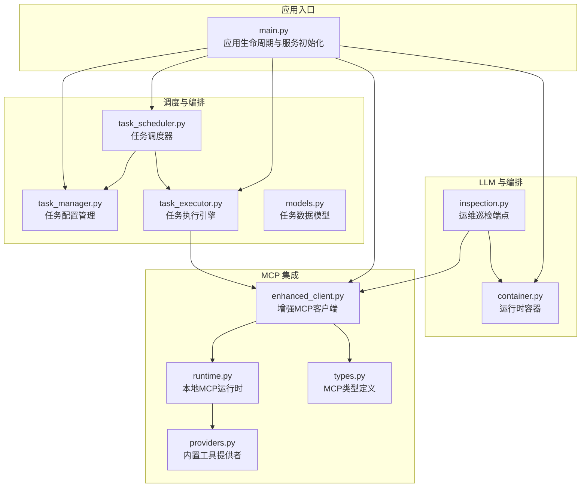
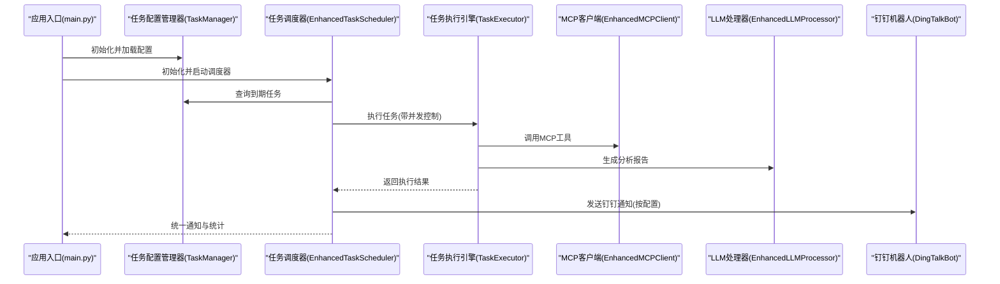
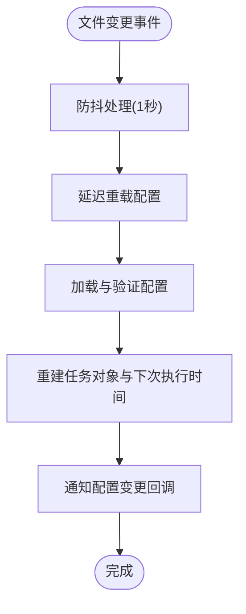
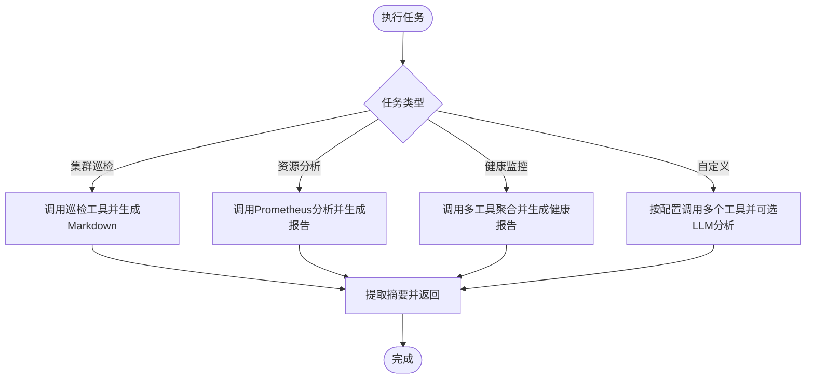
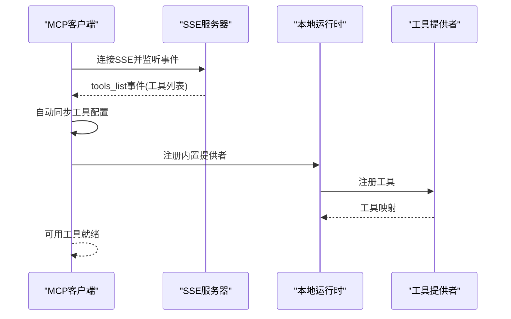
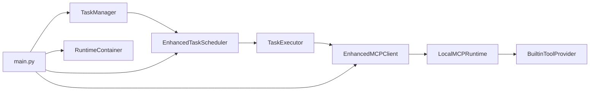

# 团队编排器

<cite>
**本文档引用的文件**
- [main.py](file://backend/main.py)
- [task_manager.py](file://backend/src/scheduler/task_manager.py)
- [task_scheduler.py](file://backend/src/scheduler/task_scheduler.py)
- [task_executor.py](file://backend/src/scheduler/task_executor.py)
- [models.py](file://backend/src/scheduler/models.py)
- [enhanced_client.py](file://backend/src/mcp/enhanced_client.py)
- [runtime.py](file://backend/src/mcp/runtime.py)
- [types.py](file://backend/src/mcp/types.py)
- [providers.py](file://backend/src/mcp/builtin/providers.py)
- [inspection.py](file://backend/src/api/v2/endpoints/inspection.py)
- [container.py](file://backend/src/app/container.py)
- [scheduled_tasks.example.json](file://config/scheduled_tasks.example.json)
</cite>

## 目录
1. [简介](#简介)
2. [项目结构](#项目结构)
3. [核心组件](#核心组件)
4. [架构总览](#架构总览)
5. [详细组件分析](#详细组件分析)
6. [依赖关系分析](#依赖关系分析)
7. [性能考虑](#性能考虑)
8. [故障排除指南](#故障排除指南)
9. [结论](#结论)
10. [附录](#附录)

## 简介
本项目是一个基于 FastAPI 的钉钉机器人系统，集成了 MCP（Model Context Protocol）工具链与 LLM（大语言模型）能力，提供 Kubernetes 集群运维巡检、资源分析、健康监控以及定时任务调度等能力。团队编排器的核心目标是通过多Agent协作机制（包括内置的 CrewAI 可选编排与现有任务调度体系），实现任务的自动化分配、协调与执行，同时具备完善的错误处理、通知与可观测性能力。

## 项目结构
项目采用分层与功能域结合的组织方式：
- 后端服务层：FastAPI 应用入口与生命周期管理
- 调度与编排层：定时任务管理、调度与执行引擎
- MCP 集成层：本地与远端 MCP 服务器连接、工具发现与调用
- LLM 层：增强的 LLM 处理器与可选的 CrewAI 编排
- API 层：运维巡检等业务接口
- 配置与工具：MCP 配置、LLM 配置、定时任务配置等



**图表来源**
- [main.py:137-270](file://backend/main.py#L137-L270)
- [task_manager.py:133-176](file://backend/src/scheduler/task_manager.py#L133-L176)
- [task_scheduler.py:23-58](file://backend/src/scheduler/task_scheduler.py#L23-L58)
- [task_executor.py:20-46](file://backend/src/scheduler/task_executor.py#L20-L46)
- [enhanced_client.py:33-95](file://backend/src/mcp/enhanced_client.py#L33-L95)
- [runtime.py:31-99](file://backend/src/mcp/runtime.py#L31-L99)
- [types.py:11-74](file://backend/src/mcp/types.py#L11-L74)
- [providers.py:53-171](file://backend/src/mcp/builtin/providers.py#L53-L171)
- [inspection.py:66-195](file://backend/src/api/v2/endpoints/inspection.py#L66-L195)
- [container.py:15-54](file://backend/src/app/container.py#L15-L54)

**章节来源**
- [main.py:137-270](file://backend/main.py#L137-L270)
- [task_manager.py:133-176](file://backend/src/scheduler/task_manager.py#L133-L176)
- [task_scheduler.py:23-58](file://backend/src/scheduler/task_scheduler.py#L23-L58)
- [task_executor.py:20-46](file://backend/src/scheduler/task_executor.py#L20-L46)
- [enhanced_client.py:33-95](file://backend/src/mcp/enhanced_client.py#L33-L95)
- [runtime.py:31-99](file://backend/src/mcp/runtime.py#L31-L99)
- [types.py:11-74](file://backend/src/mcp/types.py#L11-L74)
- [providers.py:53-171](file://backend/src/mcp/builtin/providers.py#L53-L171)
- [inspection.py:66-195](file://backend/src/api/v2/endpoints/inspection.py#L66-L195)
- [container.py:15-54](file://backend/src/app/container.py#L15-L54)

## 核心组件
- 任务配置管理器：负责定时任务配置的加载、热重载、备份与变更通知，支持文件监控与异步历史持久化。
- 任务调度器：基于 asyncio 的轻量调度循环，支持并发控制、重试与通知。
- 任务执行引擎：根据任务类型调用 MCP 工具与 LLM，生成分析报告并返回结果。
- MCP 客户端与运行时：支持 SSE/HTTP/WS/STDIO 等传输，自动发现工具、路由与配置同步。
- LLM 处理器与运行时容器：统一管理 LLM 配置与实例，支持动态重建。
- 运维巡检端点：整合 MCP 工具与 LLM，生成 Markdown 巡检报告并可选推送至钉钉。

**章节来源**
- [task_manager.py:133-176](file://backend/src/scheduler/task_manager.py#L133-L176)
- [task_scheduler.py:23-58](file://backend/src/scheduler/task_scheduler.py#L23-L58)
- [task_executor.py:20-46](file://backend/src/scheduler/task_executor.py#L20-L46)
- [enhanced_client.py:33-95](file://backend/src/mcp/enhanced_client.py#L33-L95)
- [runtime.py:31-99](file://backend/src/mcp/runtime.py#L31-L99)
- [container.py:15-54](file://backend/src/app/container.py#L15-L54)
- [inspection.py:66-195](file://backend/src/api/v2/endpoints/inspection.py#L66-L195)

## 架构总览
系统采用“应用入口 + 调度编排 + MCP 集成 + LLM 处理”的分层架构。应用启动时初始化 MCP 客户端、LLM 处理器与钉钉机器人，随后按需启动任务调度器与巡检任务。调度器通过任务管理器读取配置，使用任务执行引擎调用 MCP 工具与 LLM，最终通过钉钉机器人发送通知。



**图表来源**
- [main.py:148-270](file://backend/main.py#L148-L270)
- [task_manager.py:189-242](file://backend/src/scheduler/task_manager.py#L189-L242)
- [task_scheduler.py:108-150](file://backend/src/scheduler/task_scheduler.py#L108-L150)
- [task_executor.py:47-99](file://backend/src/scheduler/task_executor.py#L47-L99)
- [enhanced_client.py:587-607](file://backend/src/mcp/enhanced_client.py#L587-L607)
- [container.py:15-54](file://backend/src/app/container.py#L15-L54)

## 详细组件分析

### 任务配置管理器（TaskManager）
- 功能要点
  - 配置文件加载与热重载：支持 watchdog 文件监控，防抖与增量变更记录。
  - 配置备份与清理：自动备份与历史清理，保障配置安全。
  - 任务 CRUD：创建、更新、删除、查询与统计。
  - 执行历史管理：异步持久化与按月分组存储。
  - 配置验证与模板：针对不同类型任务的配置校验与默认模板。
- 关键流程
  - 文件监控事件 -> 防抖处理 -> 延迟重载 -> 配置对象重建 -> 变更通知回调。
  - 任务创建/更新 -> 配置验证 -> 下次执行时间计算 -> 保存配置。
  - 执行历史 -> 限制条数 -> 异步写入 -> 按月目录分隔。



**图表来源**
- [task_manager.py:35-131](file://backend/src/scheduler/task_manager.py#L35-L131)
- [task_manager.py:189-242](file://backend/src/scheduler/task_manager.py#L189-L242)

**章节来源**
- [task_manager.py:133-176](file://backend/src/scheduler/task_manager.py#L133-L176)
- [task_manager.py:189-242](file://backend/src/scheduler/task_manager.py#L189-L242)
- [task_manager.py:244-335](file://backend/src/scheduler/task_manager.py#L244-L335)
- [task_manager.py:500-552](file://backend/src/scheduler/task_manager.py#L500-L552)
- [task_manager.py:554-593](file://backend/src/scheduler/task_manager.py#L554-L593)
- [task_manager.py:594-622](file://backend/src/scheduler/task_manager.py#L594-L622)

### 任务调度器（EnhancedTaskScheduler）
- 功能要点
  - 基于 asyncio 的调度循环，每分钟检查一次到期任务。
  - 并发控制：信号量限制最大并发任务数。
  - 重试机制：失败时按配置延迟重试，支持通知。
  - 通知集成：通过钉钉机器人发送执行结果或错误信息。
  - 手动执行：支持强制执行未启用任务。
- 关键流程
  - 主循环 -> 查询到期任务 -> 创建执行协程 -> 并发控制 -> 执行器调用 -> 结果处理 -> 通知 -> 清理完成任务。

```mermaid
sequenceDiagram
participant TS as "调度器"
participant TM as "任务管理器"
participant TE as "任务执行引擎"
participant Bot as "钉钉机器人"
TS->>TM : 获取到期任务
TS->>TS : 并发控制(信号量)
TS->>TE : 执行任务
TE-->>TS : 返回结果或异常
alt 成功
TS->>Bot : 发送成功通知
else 失败
TS->>TS : 判断重试次数
opt 需要重试
TS->>TS : 安排重试任务
else 达到最大重试
TS->>Bot : 发送失败通知
end
end
```

**图表来源**
- [task_scheduler.py:108-150](file://backend/src/scheduler/task_scheduler.py#L108-L150)
- [task_scheduler.py:151-284](file://backend/src/scheduler/task_scheduler.py#L151-L284)
- [task_scheduler.py:285-391](file://backend/src/scheduler/task_scheduler.py#L285-L391)

**章节来源**
- [task_scheduler.py:23-58](file://backend/src/scheduler/task_scheduler.py#L23-L58)
- [task_scheduler.py:108-150](file://backend/src/scheduler/task_scheduler.py#L108-L150)
- [task_scheduler.py:151-284](file://backend/src/scheduler/task_scheduler.py#L151-L284)
- [task_scheduler.py:285-391](file://backend/src/scheduler/task_scheduler.py#L285-L391)

### 任务执行引擎（TaskExecutor）
- 功能要点
  - 多任务类型支持：集群巡检、资源分析、健康监控、自定义任务。
  - MCP 工具调用：按任务类型组装参数并调用对应工具。
  - LLM 分析：对工具结果进行二次分析，生成报告。
  - 执行统计：记录总执行次数、成功/失败次数与平均耗时。
- 关键流程
  - 接收任务与执行记录 -> 根据类型分派 -> 调用 MCP 工具 -> 可选 LLM 分析 -> 返回结果与摘要。



**图表来源**
- [task_executor.py:47-99](file://backend/src/scheduler/task_executor.py#L47-L99)
- [task_executor.py:100-152](file://backend/src/scheduler/task_executor.py#L100-L152)
- [task_executor.py:153-196](file://backend/src/scheduler/task_executor.py#L153-L196)
- [task_executor.py:197-271](file://backend/src/scheduler/task_executor.py#L197-L271)
- [task_executor.py:272-317](file://backend/src/scheduler/task_executor.py#L272-L317)

**章节来源**
- [task_executor.py:20-46](file://backend/src/scheduler/task_executor.py#L20-L46)
- [task_executor.py:47-99](file://backend/src/scheduler/task_executor.py#L47-L99)
- [task_executor.py:100-152](file://backend/src/scheduler/task_executor.py#L100-L152)
- [task_executor.py:153-196](file://backend/src/scheduler/task_executor.py#L153-L196)
- [task_executor.py:197-271](file://backend/src/scheduler/task_executor.py#L197-L271)
- [task_executor.py:272-317](file://backend/src/scheduler/task_executor.py#L272-L317)

### MCP 客户端与运行时
- 功能要点
  - 多传输支持：SSE、HTTP、WebSocket、STDIO、本地进程内。
  - 工具发现与路由：自动同步工具配置，支持按服务器与工具名路由。
  - 连接管理：心跳、重连、超时与错误处理。
  - 本地运行时：注册内置 K8s/ECS 工具，提供 in-process 执行边界。
- 关键流程
  - 连接服务器 -> 工具发现事件 -> 构建工具映射 -> 自动同步配置 -> 调用工具并等待结果。



**图表来源**
- [enhanced_client.py:61-95](file://backend/src/mcp/enhanced_client.py#L61-L95)
- [enhanced_client.py:246-320](file://backend/src/mcp/enhanced_client.py#L246-L320)
- [enhanced_client.py:321-504](file://backend/src/mcp/enhanced_client.py#L321-L504)
- [runtime.py:46-99](file://backend/src/mcp/runtime.py#L46-L99)
- [providers.py:74-155](file://backend/src/mcp/builtin/providers.py#L74-L155)

**章节来源**
- [enhanced_client.py:33-95](file://backend/src/mcp/enhanced_client.py#L33-L95)
- [enhanced_client.py:246-320](file://backend/src/mcp/enhanced_client.py#L246-L320)
- [enhanced_client.py:321-504](file://backend/src/mcp/enhanced_client.py#L321-L504)
- [runtime.py:31-99](file://backend/src/mcp/runtime.py#L31-L99)
- [providers.py:53-171](file://backend/src/mcp/builtin/providers.py#L53-L171)

### LLM 处理器与运行时容器
- 功能要点
  - 运行时容器统一持有 MCP 客户端、LLM 处理器与钉钉机器人实例。
  - 支持从磁盘配置重新构建 LLM 处理器，实现配置热重载。
  - 与巡检端点集成，生成 Markdown 报告并可选推送至钉钉。

**章节来源**
- [container.py:15-54](file://backend/src/app/container.py#L15-L54)
- [inspection.py:66-195](file://backend/src/api/v2/endpoints/inspection.py#L66-L195)

### 任务数据模型
- 功能要点
  - 定义任务状态、类型、通知级别等枚举。
  - ScheduledTask：任务配置与调度逻辑（Cron 表达式、下次执行时间等）。
  - TaskExecution：执行记录与结果、重试信息、通知状态。
  - 验证与默认配置：针对不同任务类型的默认参数与校验规则。

**章节来源**
- [models.py:14-135](file://backend/src/scheduler/models.py#L14-L135)
- [models.py:137-192](file://backend/src/scheduler/models.py#L137-L192)
- [models.py:194-269](file://backend/src/scheduler/models.py#L194-L269)
- [models.py:342-393](file://backend/src/scheduler/models.py#L342-L393)

## 依赖关系分析
- 组件耦合
  - TaskManager 与 TaskScheduler：通过任务对象与执行记录交互。
  - TaskScheduler 与 TaskExecutor：通过任务执行接口解耦。
  - TaskExecutor 与 EnhancedMCPClient：通过工具调用接口解耦。
  - EnhancedMCPClient 与 LocalMCPRuntime：通过工具注册与执行接口解耦。
  - 运行时容器：统一注入与共享服务实例。
- 外部依赖
  - watchdog：文件监控（可选）。
  - aiohttp/websockets：SSE/HTTP/WebSocket 传输。
  - croniter：Cron 表达式解析与下次执行时间计算。



**图表来源**
- [task_manager.py:133-176](file://backend/src/scheduler/task_manager.py#L133-L176)
- [task_scheduler.py:23-58](file://backend/src/scheduler/task_scheduler.py#L23-L58)
- [task_executor.py:20-46](file://backend/src/scheduler/task_executor.py#L20-L46)
- [enhanced_client.py:33-95](file://backend/src/mcp/enhanced_client.py#L33-L95)
- [runtime.py:31-99](file://backend/src/mcp/runtime.py#L31-L99)
- [providers.py:53-171](file://backend/src/mcp/builtin/providers.py#L53-L171)
- [main.py:148-270](file://backend/main.py#L148-L270)
- [container.py:15-54](file://backend/src/app/container.py#L15-L54)

**章节来源**
- [task_manager.py:133-176](file://backend/src/scheduler/task_manager.py#L133-L176)
- [task_scheduler.py:23-58](file://backend/src/scheduler/task_scheduler.py#L23-L58)
- [task_executor.py:20-46](file://backend/src/scheduler/task_executor.py#L20-L46)
- [enhanced_client.py:33-95](file://backend/src/mcp/enhanced_client.py#L33-L95)
- [runtime.py:31-99](file://backend/src/mcp/runtime.py#L31-L99)
- [providers.py:53-171](file://backend/src/mcp/builtin/providers.py#L53-L171)
- [main.py:148-270](file://backend/main.py#L148-L270)
- [container.py:15-54](file://backend/src/app/container.py#L15-L54)

## 性能考虑
- 并发控制：调度器使用信号量限制最大并发任务数，避免资源争用。
- 异步执行：任务执行与通知均采用异步模式，提高吞吐。
- 工具调用优化：本地运行时提供 in-process 执行边界，减少跨进程/网络开销。
- 配置热重载：文件监控与防抖机制降低频繁重载带来的性能影响。
- 统计与观测：执行引擎记录执行时间与成功率，便于性能分析与优化。

[本节为通用性能指导，无需具体文件引用]

## 故障排除指南
- MCP 连接失败
  - 检查服务器配置与网络连通性，查看 SSE/HTTP/WebSocket 连接日志。
  - 确认工具发现事件是否正常接收，自动同步配置是否成功。
- 工具调用超时或失败
  - 检查工具参数类型与必填字段，确认工具存在且启用。
  - 查看工具执行结果与错误事件，定位具体失败原因。
- 任务调度异常
  - 检查 Cron 表达式有效性与时区配置，确认下次执行时间计算正确。
  - 查看任务执行历史与通知状态，确认重试策略与通知通道配置。
- LLM 处理异常
  - 检查 LLM 配置与模型可用性，必要时通过运行时容器重建处理器。
  - 巡检端点在 LLM 失败时会回退生成最小可读 Markdown，确保接口稳定性。

**章节来源**
- [enhanced_client.py:61-95](file://backend/src/mcp/enhanced_client.py#L61-L95)
- [enhanced_client.py:246-320](file://backend/src/mcp/enhanced_client.py#L246-L320)
- [task_manager.py:189-242](file://backend/src/scheduler/task_manager.py#L189-L242)
- [task_scheduler.py:108-150](file://backend/src/scheduler/task_scheduler.py#L108-L150)
- [inspection.py:154-168](file://backend/src/api/v2/endpoints/inspection.py#L154-L168)

## 结论
团队编排器通过“任务配置管理 + 调度 + 执行 + MCP 集成 + LLM 分析 + 钉钉通知”的完整链路，实现了 Kubernetes 运维场景下的自动化与智能化。其架构强调解耦与可扩展性，既支持内置的 CrewAI 多智能体编排，也保留了稳定的任务调度体系。通过并发控制、异步执行与可观测性设计，系统在保证可靠性的同时提升了性能与可维护性。

[本节为总结性内容，无需具体文件引用]

## 附录
- 定时任务配置示例文件路径：config/scheduled_tasks.example.json
- 运行时容器字段：mcp_client、llm_processor、dingtalk_bot
- MCP 类型定义：连接状态、工具、调用、错误、统计等

**章节来源**
- [scheduled_tasks.example.json:1-8](file://config/scheduled_tasks.example.json#L1-L8)
- [container.py:15-54](file://backend/src/app/container.py#L15-L54)
- [types.py:11-74](file://backend/src/mcp/types.py#L11-L74)