# 工具结果处理

<cite>
**本文档引用的文件**
- [processor.py](file://backend/src/llm/processor.py)
- [processor_limits.py](file://backend/src/llm/processor_limits.py)
- [masker.py](file://backend/src/llm/security/masker.py)
- [rules.py](file://backend/src/llm/security/rules.py)
- [mapping.py](file://backend/src/llm/security/mapping.py)
- [config.py](file://backend/src/llm/security/config.py)
- [redaction.py](file://backend/src/security/redaction.py)
- [error_handler.py](file://backend/src/utils/error_handler.py)
- [enhanced_client.py](file://backend/src/mcp/enhanced_client.py)
- [runtime.py](file://backend/src/mcp/runtime.py)
- [types.py](file://backend/src/mcp/types.py)
- [k8s_get_pods.py](file://backend/src/k8s_mcp/tools/k8s_get_pods.py)
- [ecs_list_instances.py](file://backend/src/ecs_mcp/tools/ecs_list_instances.py)
</cite>

## 目录
1. [简介](#简介)
2. [项目结构](#项目结构)
3. [核心组件](#核心组件)
4. [架构概览](#架构概览)
5. [详细组件分析](#详细组件分析)
6. [依赖分析](#依赖分析)
7. [性能考虑](#性能考虑)
8. [故障排除指南](#故障排除指南)
9. [结论](#结论)

## 简介

本文档深入解析工具结果处理系统的完整实现，涵盖以下关键能力：

- **结果大小检查与智能提炼**：实时检测工具调用结果大小，自动进行关键信息提取和压缩
- **多维度信息提炼算法**：针对Kubernetes资源、ECS资源和日志信息的专门提炼策略
- **脱敏处理机制**：基于规则的数据脱敏、会话管理和隐私保护
- **结果压缩技术**：截断策略、摘要生成和用户体验优化
- **错误处理与回退机制**：全面的错误分类、处理和回退策略
- **最佳实践与性能优化**：安全考虑和性能优化技巧

## 项目结构

工具结果处理系统采用分层架构设计，主要包含以下层次：

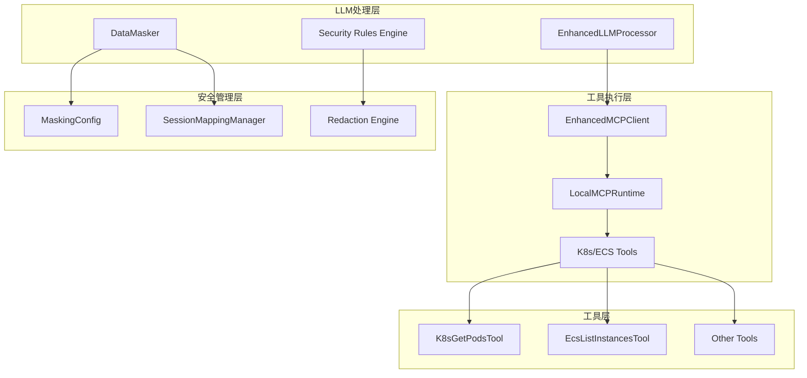

**图表来源**
- [processor.py:1-120](file://backend/src/llm/processor.py#L1-L120)
- [enhanced_client.py:1-80](file://backend/src/mcp/enhanced_client.py#L1-L80)
- [runtime.py:31-99](file://backend/src/mcp/runtime.py#L31-L99)

## 核心组件

### LLM处理器核心功能

EnhancedLLMProcessor作为系统的核心组件，负责：

1. **结果大小检查**：通过processor_limits模块实现
2. **智能信息提炼**：针对不同工具类型的专门算法
3. **脱敏处理**：在工具执行前后进行数据保护
4. **上下文优化**：控制LLM对话的历史消息和token使用

### 脱敏引擎架构

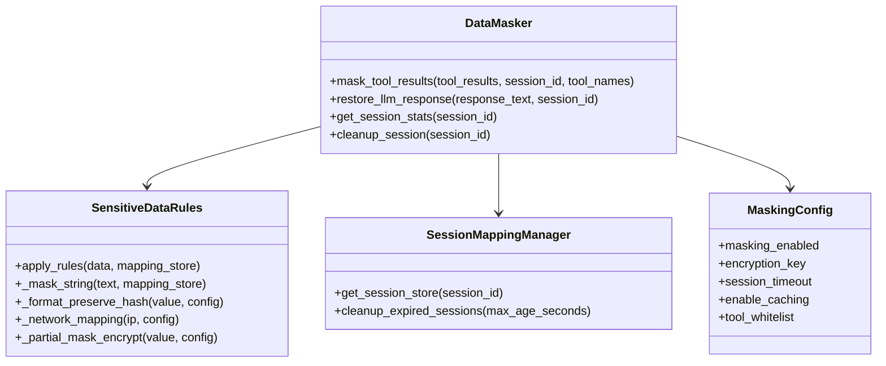

**图表来源**
- [masker.py:12-75](file://backend/src/llm/security/masker.py#L12-L75)
- [rules.py:13-64](file://backend/src/llm/security/rules.py#L13-L64)
- [mapping.py:125-152](file://backend/src/llm/security/mapping.py#L125-L152)
- [config.py:9-37](file://backend/src/llm/security/config.py#L9-L37)

**章节来源**
- [processor.py:30-58](file://backend/src/llm/processor.py#L30-L58)
- [masker.py:12-75](file://backend/src/llm/security/masker.py#L12-L75)

## 架构概览

工具结果处理系统采用两阶段流式处理架构：

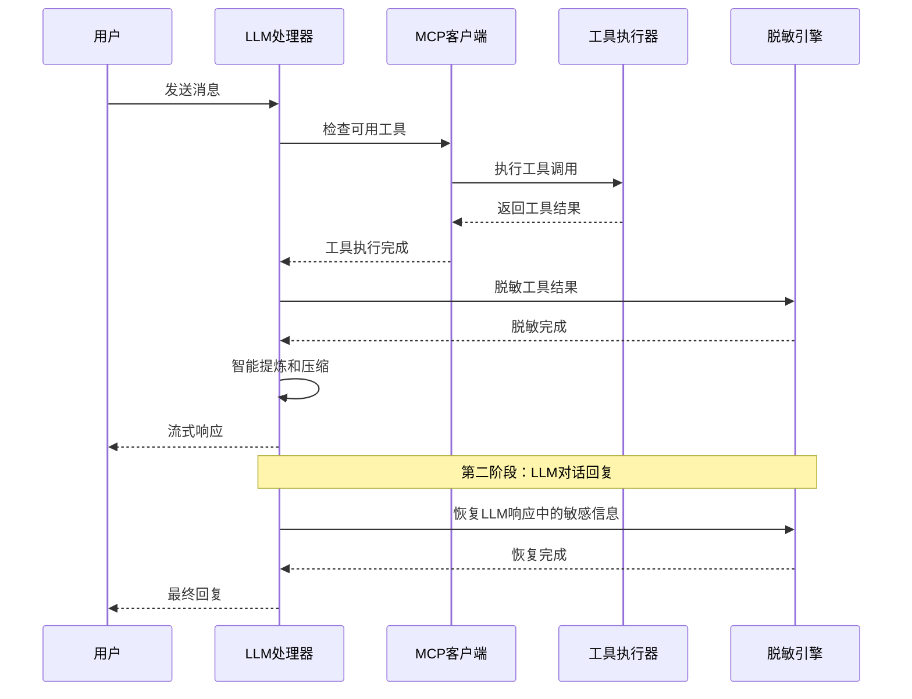

**图表来源**
- [processor.py:536-757](file://backend/src/llm/processor.py#L536-L757)
- [enhanced_client.py:587-800](file://backend/src/mcp/enhanced_client.py#L587-L800)

## 详细组件分析

### 结果大小检查与压缩机制

系统实现了多层次的结果大小检查和压缩策略：

#### 大小检查算法

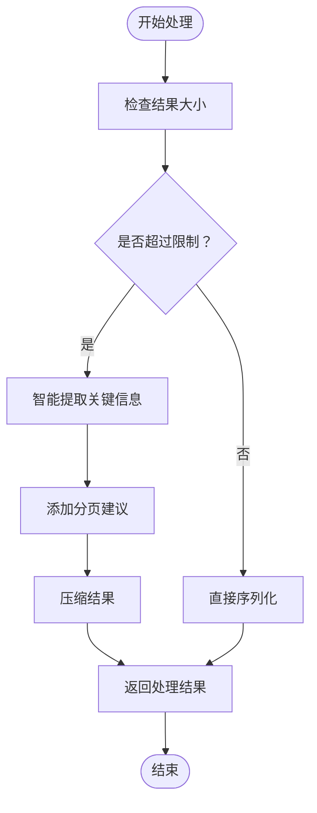

**图表来源**
- [processor.py:158-186](file://backend/src/llm/processor.py#L158-L186)
- [processor.py:383-407](file://backend/src/llm/processor.py#L383-L407)

#### 压缩策略配置

系统通过processor_limits模块定义了严格的大小限制：

| 限制类型 | 阈值 | 用途 |
|---------|------|------|
| MAX_RESULT_SIZE | 50,000 字节 | 单个结果最大大小 |
| MAX_RESULT_LINES | 1,000 行 | 单个结果最大行数 |
| SUMMARY_TARGET_SIZE | 8,000 字符 | LLM提示词目标大小 |
| MAX_CONTEXT_TOKENS | 100,000 tokens | 上下文最大token数 |
| MAX_HISTORY_MESSAGES | 20 条 | 历史消息最大数量 |

**章节来源**
- [processor_limits.py:8-12](file://backend/src/llm/processor_limits.py#L8-L12)
- [processor_limits.py:20-35](file://backend/src/llm/processor_limits.py#L20-L35)

### 智能信息提炼算法

系统针对不同类型的数据实现了专门的提炼算法：

#### Kubernetes资源信息提炼

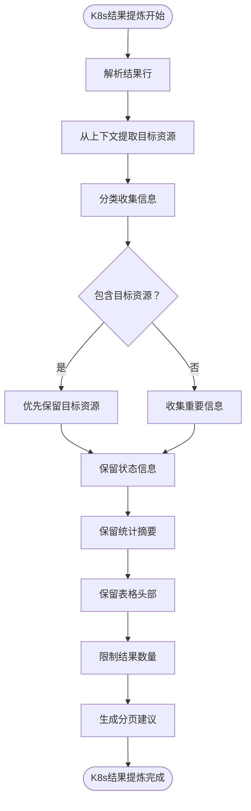

**图表来源**
- [processor.py:187-259](file://backend/src/llm/processor.py#L187-L259)
- [processor.py:261-326](file://backend/src/llm/processor.py#L261-L326)

#### ECS资源信息提炼

ECS工具的提炼策略重点关注实例状态和区域信息：

- **目标资源识别**：通过上下文提取实例名称和区域
- **状态信息保留**：优先保留实例状态、运行时间和区域信息
- **分页建议**：针对大规模实例列表提供分页查询建议

#### 日志信息提炼

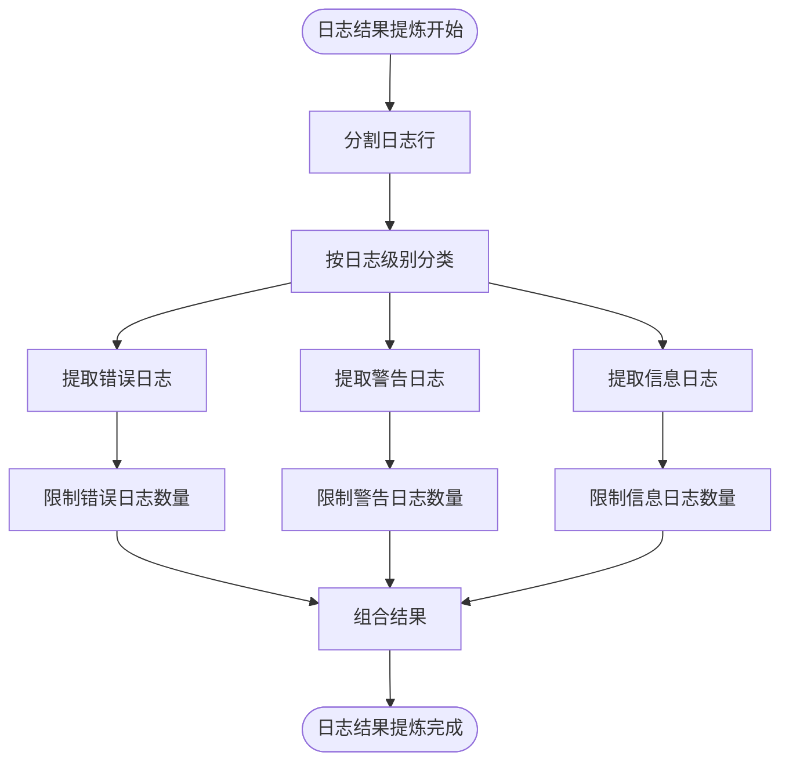

**图表来源**
- [processor.py:328-358](file://backend/src/llm/processor.py#L328-L358)

**章节来源**
- [processor.py:187-358](file://backend/src/llm/processor.py#L187-L358)

### 脱敏处理机制

系统实现了多层次的脱敏处理机制：

#### 脱敏规则引擎

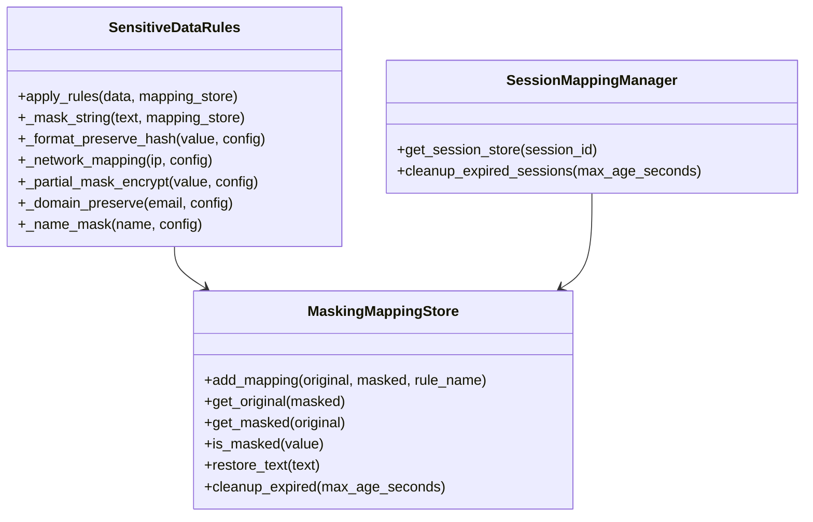

**图表来源**
- [rules.py:13-151](file://backend/src/llm/security/rules.py#L13-L151)
- [mapping.py:9-124](file://backend/src/llm/security/mapping.py#L9-L124)

#### 支持的脱敏规则

系统支持多种敏感数据类型的脱敏处理：

| 规则类型 | 匹配模式 | 脱敏策略 | 示例 |
|---------|----------|----------|------|
| 主机名 | worker\|master\|node\|host\|server[-\w\d\-\.]+\d{1,3}[-\d\-]*\d+ | 格式保持哈希 | host-abc123--123 |
| IP地址 | \b(?:(?:25[0-5]|2[0-4]\d|[01]?\d\d?)\.){3}(?:25[0-5]|2[0-4]\d|[01]?\d\d?)\b | 网络映射 | 10.0.x.x |
| 电话号码 | 1[3-9]\d{9} | 部分掩码加密 | 138****8888 |
| 中文姓名 | 基于姓氏词典 | 保留首字 | 李** |
| 电子邮箱 | \b[A-Za-z0-9._%+-]+@[A-Za-z0-9.-]+\.[A-Za-z]{2,}\b | 域名保持 | li.*@gmail.com |

**章节来源**
- [rules.py:22-52](file://backend/src/llm/security/rules.py#L22-L52)
- [surname_dict.py:14-36](file://backend/src/llm/security/surname_dict.py#L14-L36)

### 工具执行与结果处理

#### 工具执行流程

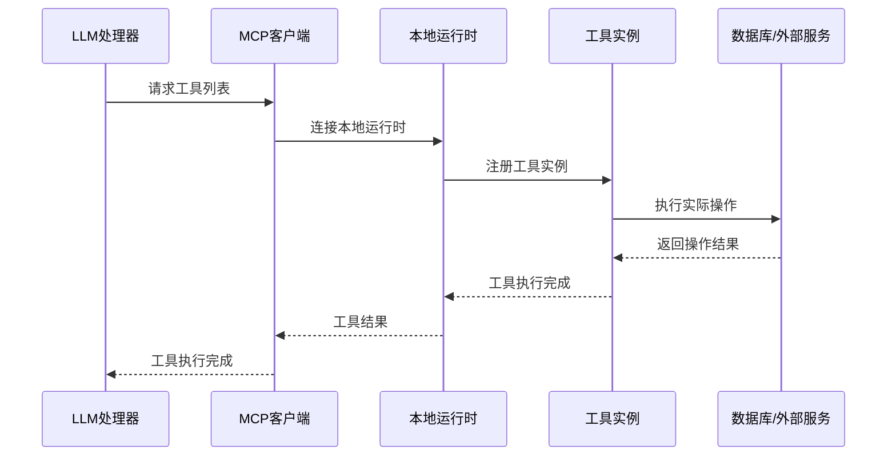

**图表来源**
- [enhanced_client.py:46-87](file://backend/src/mcp/enhanced_client.py#L46-L87)
- [runtime.py:46-98](file://backend/src/mcp/runtime.py#L46-L98)

#### 工具结果格式化

系统为不同类型的工具提供了专门的结果格式化：

**Kubernetes Pod列表格式化**：
- 状态摘要统计
- Pod基本信息（名称、命名空间、状态、重启次数）
- 容器详细信息
- 节点和IP信息

**ECS实例列表格式化**：
- 实例ID和名称
- 状态和可用区
- 分页信息和总数统计

**章节来源**
- [k8s_get_pods.py:114-150](file://backend/src/k8s_mcp/tools/k8s_get_pods.py#L114-L150)
- [ecs_list_instances.py:85-110](file://backend/src/ecs_mcp/tools/ecs_list_instances.py#L85-L110)

## 依赖分析

系统采用了清晰的依赖关系设计：

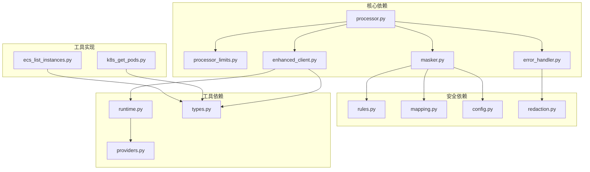

**图表来源**
- [processor.py:19-28](file://backend/src/llm/processor.py#L19-L28)
- [masker.py:4-10](file://backend/src/llm/security/masker.py#L4-L10)
- [enhanced_client.py:16-30](file://backend/src/mcp/enhanced_client.py#L16-L30)

**章节来源**
- [processor.py:19-28](file://backend/src/llm/processor.py#L19-L28)
- [masker.py:4-10](file://backend/src/llm/security/masker.py#L4-L10)

## 性能考虑

### 上下文优化策略

系统实现了智能的上下文优化机制：

1. **历史消息裁剪**：限制最大历史消息数量为20条
2. **Token估算**：粗略估算每条消息的token消耗
3. **动态调整**：根据实际token使用情况动态调整消息保留策略

### 缓存与会话管理

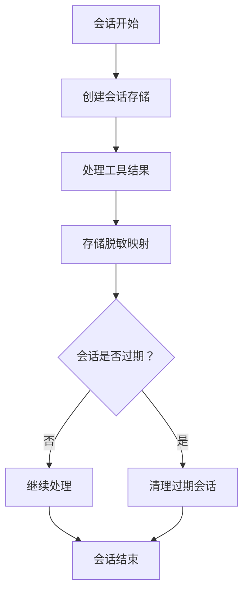

**图表来源**
- [mapping.py:114-124](file://backend/src/llm/security/mapping.py#L114-L124)
- [config.py:25-31](file://backend/src/llm/security/config.py#L25-L31)

### 性能优化技巧

1. **异步处理**：所有工具调用采用异步模式
2. **并发控制**：最大并发工具调用数限制为5个
3. **超时管理**：工具调用超时时间可达600秒
4. **内存管理**：会话超时时间为3600秒

## 故障排除指南

### 错误分类与处理

系统提供了全面的错误分类机制：

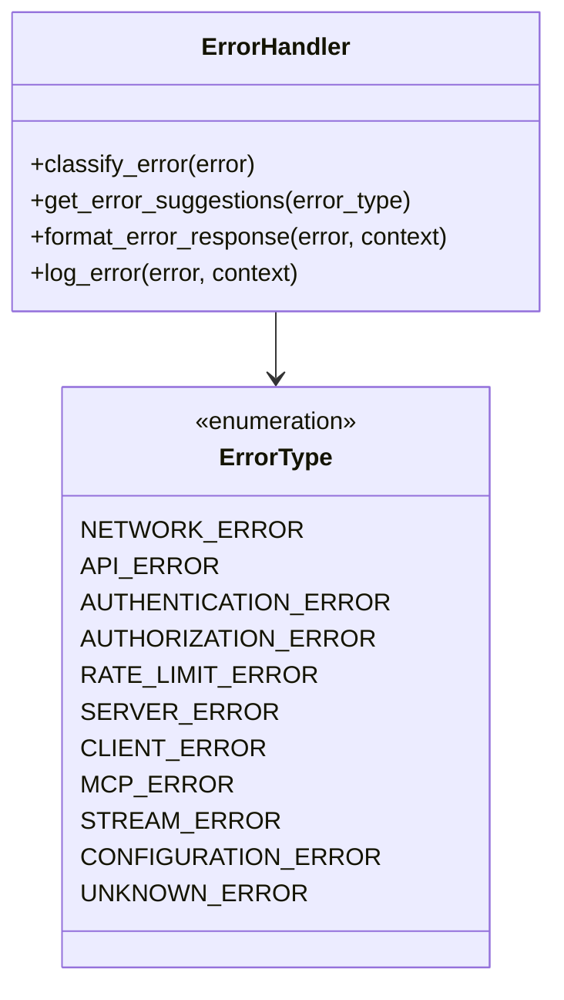

**图表来源**
- [error_handler.py:13-69](file://backend/src/utils/error_handler.py#L13-L69)

### 常见问题与解决方案

| 错误类型 | 诊断特征 | 解决方案 |
|---------|----------|----------|
| 网络错误 | 连接超时、网络不可达 | 检查网络连接、代理设置 |
| 认证错误 | 401未授权 | 验证API密钥、检查权限 |
| 速率限制 | 429请求过于频繁 | 增加请求间隔、升级套餐 |
| 服务器错误 | 500内部错误 | 检查服务器状态、重试请求 |
| MCP错误 | 工具调用失败 | 检查MCP服务器状态、工具配置 |

**章节来源**
- [error_handler.py:71-156](file://backend/src/utils/error_handler.py#L71-L156)
- [error_handler.py:218-244](file://backend/src/utils/error_handler.py#L218-L244)

### 回退机制

系统实现了多层次的回退机制：

1. **工具调用回退**：当工具执行失败时，系统会尝试回退到简化处理
2. **LLM连接回退**：当LLM客户端不可用时，提供模拟响应
3. **脱敏处理回退**：脱敏失败时返回原始数据
4. **结果压缩回退**：提炼失败时使用简单截断策略

## 结论

工具结果处理系统通过以下关键特性实现了高效、安全和可靠的工具调用结果处理：

### 核心优势

1. **智能化处理**：自动识别工具类型并应用相应的提炼策略
2. **安全性保障**：多层次的脱敏处理确保数据隐私
3. **性能优化**：智能的上下文管理和缓存机制
4. **错误处理**：完善的错误分类和回退机制
5. **扩展性设计**：模块化的架构便于功能扩展

### 最佳实践建议

1. **合理配置大小限制**：根据实际使用场景调整processor_limits参数
2. **启用必要的脱敏规则**：根据数据敏感性选择合适的脱敏策略
3. **监控会话状态**：定期清理过期会话，释放内存资源
4. **优化工具参数**：提供精确的查询参数以减少结果大小
5. **实施错误监控**：建立完善的错误日志和监控机制

该系统为复杂的企业级工具调用场景提供了可靠的技术支撑，通过智能化的处理流程和严格的安全保障，确保了系统的稳定性和安全性。