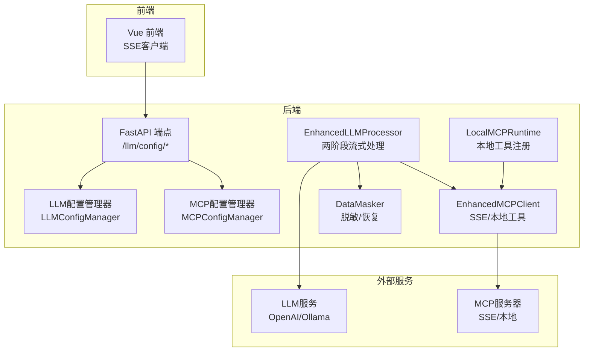
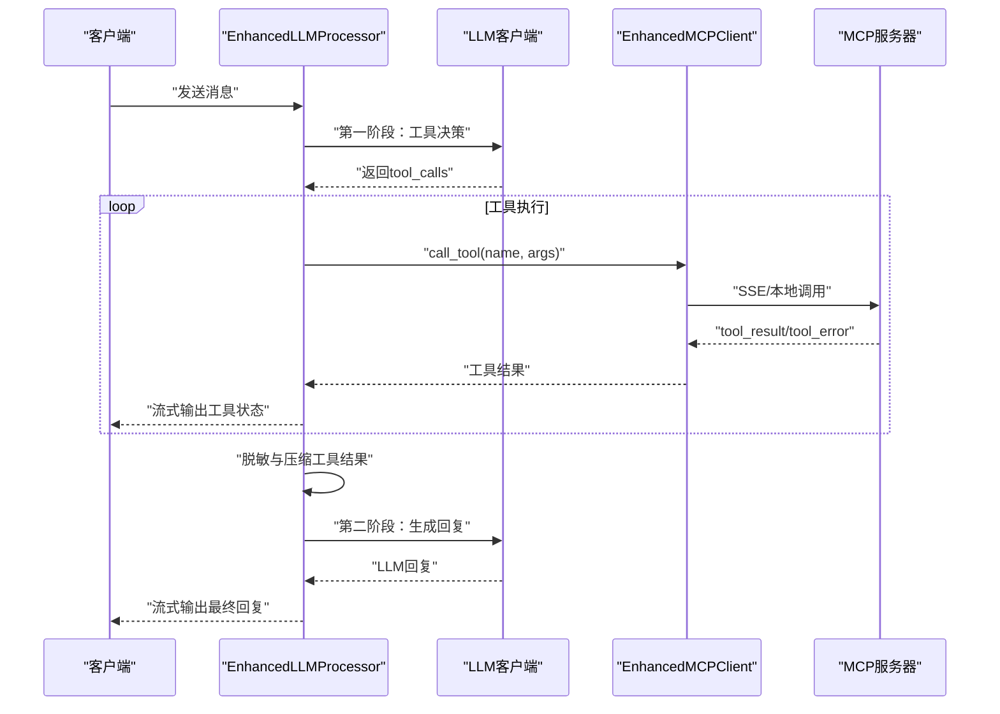
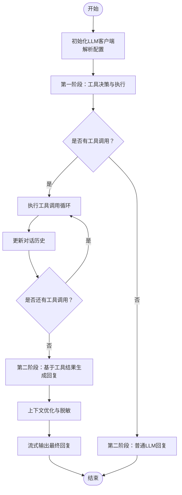
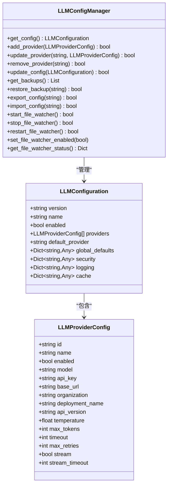
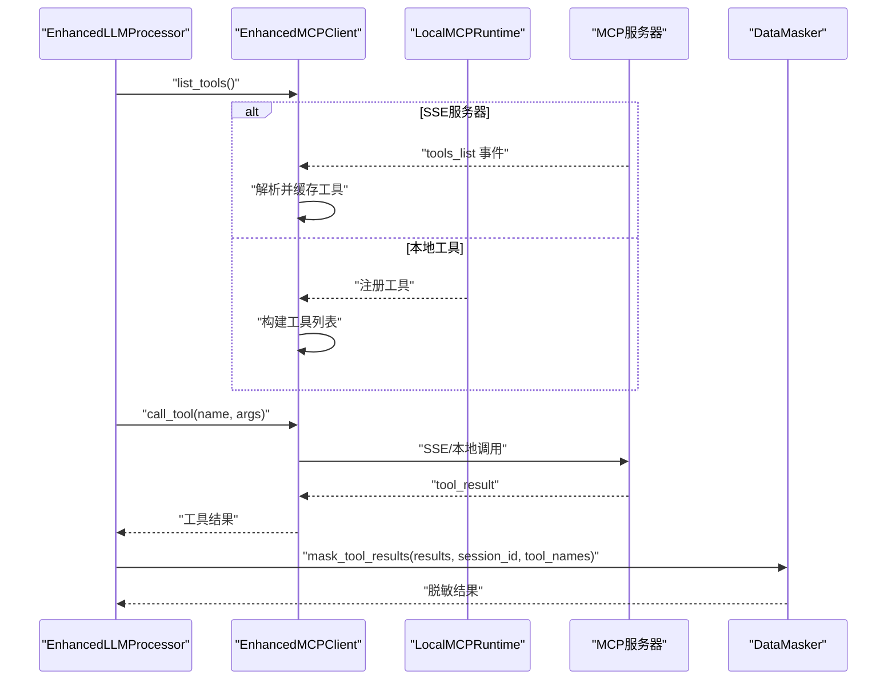
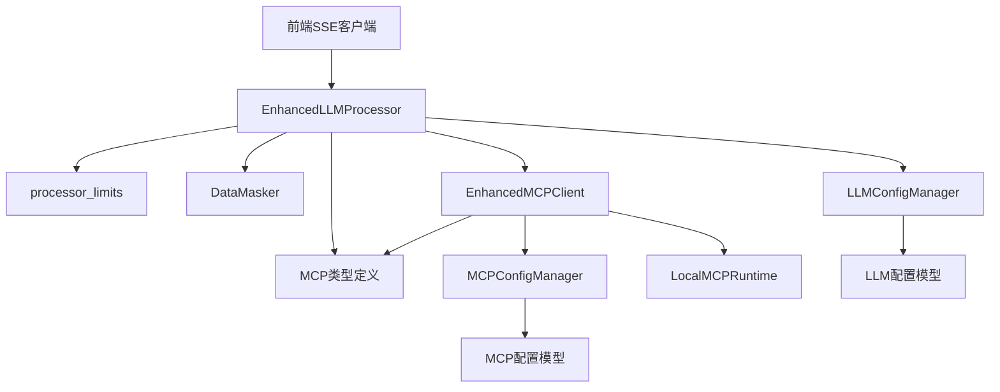

# 智能对话系统

<cite>
**本文档引用的文件**
- [processor.py](file://backend/src/llm/processor.py)
- [enhanced_client.py](file://backend/src/mcp/enhanced_client.py)
- [processor_limits.py](file://backend/src/llm/processor_limits.py)
- [masker.py](file://backend/src/llm/security/masker.py)
- [config.py](file://backend/src/llm/config.py)
- [config_manager.py](file://backend/src/llm/config_manager.py)
- [types.py](file://backend/src/mcp/types.py)
- [runtime.py](file://backend/src/mcp/runtime.py)
- [llm_config.py](file://backend/src/api/v2/endpoints/llm_config.py)
- [config.py](file://backend/src/mcp/config.py)
- [config_manager.py](file://backend/src/mcp/config_manager.py)
</cite>

## 目录
1. [简介](#简介)
2. [项目结构](#项目结构)
3. [核心组件](#核心组件)
4. [架构总览](#架构总览)
5. [详细组件分析](#详细组件分析)
6. [依赖关系分析](#依赖关系分析)
7. [性能考量](#性能考量)
8. [故障排除指南](#故障排除指南)
9. [结论](#结论)
10. [附录](#附录)

## 简介
本文件面向智能对话系统，重点阐释 EnhancedLLMProcessor 的工作机制，涵盖两阶段流式聊天处理（工具执行阶段与LLM回复阶段）、LLM客户端初始化与配置管理、错误处理与重试机制、工具调用集成（发现、函数调用、结果处理与脱敏）、SSE流式响应实现（消息分块、实时传输与连接管理）、上下文优化策略（token估算、历史消息裁剪与性能优化），并提供配置选项、使用示例与故障排除指南，同时说明与MCP客户端的集成方式与最佳实践。

## 项目结构
系统采用分层架构，核心位于 backend/src/llm 与 backend/src/mcp 目录：
- LLM层：EnhancedLLMProcessor 负责两阶段流式对话、上下文优化、结果处理与脱敏。
- MCP层：EnhancedMCPClient 负责多服务器连接、工具发现、SSE事件监听与工具调用。
- 配置层：LLMConfigManager 与 MCPConfigManager 提供文件化配置、热重载与备份。
- 安全层：DataMasker 提供工具结果与LLM响应的脱敏与恢复。
- API层：FastAPI端点提供LLM配置的增删改查与导入导出。

图表来源
- [processor.py:30-120](file://backend/src/llm/processor.py#L30-L120)
- [enhanced_client.py:33-112](file://backend/src/mcp/enhanced_client.py#L33-L112)
- [config_manager.py:150-193](file://backend/src/llm/config_manager.py#L150-L193)
- [config_manager.py:41-68](file://backend/src/mcp/config_manager.py#L41-L68)

章节来源
- [processor.py:30-120](file://backend/src/llm/processor.py#L30-L120)
- [enhanced_client.py:33-112](file://backend/src/mcp/enhanced_client.py#L33-L112)
- [config_manager.py:150-193](file://backend/src/llm/config_manager.py#L150-L193)
- [config_manager.py:41-68](file://backend/src/mcp/config_manager.py#L41-L68)

## 核心组件
- EnhancedLLMProcessor：两阶段流式聊天核心，负责工具决策与执行、LLM回复生成、上下文优化、结果处理与脱敏。
- EnhancedMCPClient：多服务器连接、SSE事件监听、工具发现与调用、重连与超时控制。
- DataMasker：工具结果与LLM响应的脱敏与恢复，支持会话级映射管理。
- LLMConfigManager：LLM配置文件管理、热重载、备份与导入导出。
- MCPConfigManager：MCP服务器与工具配置管理、连接测试与模板化配置。
- LocalMCPRuntime：本地工具注册与执行边界，避免远程传输复杂性。

章节来源
- [processor.py:30-120](file://backend/src/llm/processor.py#L30-L120)
- [enhanced_client.py:33-112](file://backend/src/mcp/enhanced_client.py#L33-L112)
- [masker.py:12-25](file://backend/src/llm/security/masker.py#L12-L25)
- [config_manager.py:150-193](file://backend/src/llm/config_manager.py#L150-L193)
- [config_manager.py:41-68](file://backend/src/mcp/config_manager.py#L41-L68)
- [runtime.py:31-59](file://backend/src/mcp/runtime.py#L31-L59)

## 架构总览
两阶段流式聊天流程：
1) 第一阶段：LLM决策与工具执行
- 构造OpenAI格式工具列表，调用LLM进行工具决策。
- 基于tool_calls循环执行工具调用，维护对话历史，流式产出工具调用状态。
2) 第二阶段：LLM回复生成
- 将工具结果进行脱敏与压缩，构建系统提示词与用户提示词。
- 调用LLM生成最终回复，支持流式输出与非流式输出两种模式。
3) 上下文优化
- 估算token总量，裁剪历史消息，保留系统消息与最近对话循环，必要时插入摘要信息。

图表来源
- [processor.py:536-757](file://backend/src/llm/processor.py#L536-L757)
- [processor.py:758-1061](file://backend/src/llm/processor.py#L758-L1061)
- [processor.py:1062-1215](file://backend/src/llm/processor.py#L1062-L1215)

章节来源
- [processor.py:536-757](file://backend/src/llm/processor.py#L536-L757)
- [processor.py:758-1061](file://backend/src/llm/processor.py#L758-L1061)
- [processor.py:1062-1215](file://backend/src/llm/processor.py#L1062-L1215)

## 详细组件分析

### EnhancedLLMProcessor 两阶段流式处理
- 初始化与客户端配置
  - 从环境变量或配置文件解析LLM提供商、模型、API密钥、基础URL、超时与重试等参数。
  - 支持OpenAI与Ollama等供应商，初始化AsyncOpenAI客户端并进行连接性诊断。
- 第一阶段：工具决策与执行
  - 将消息历史转换为OpenAI格式，附加工具列表与tool_choice="auto"。
  - 非流式调用LLM获取tool_calls，随后逐个执行工具调用，维护conversation_history。
  - 流式产出工具调用开始、更新、完成等结构化消息，便于前端实时反馈。
- 第二阶段：LLM回复生成
  - 构建系统提示词与用户提示词，其中用户提示词包含脱敏后的工具结果摘要。
  - 支持流式与非流式两种模式，非流式模式下模拟分句流式输出。
  - 异常时提供回退响应，保证用户体验。
- 上下文优化
  - 估算消息总token数，超过阈值时裁剪历史消息，保留系统消息与最近对话循环。
  - 插入摘要消息，记录省略的历史条目数量，平衡性能与信息完整性。

图表来源
- [processor.py:536-757](file://backend/src/llm/processor.py#L536-L757)
- [processor.py:1062-1215](file://backend/src/llm/processor.py#L1062-L1215)
- [processor.py:463-518](file://backend/src/llm/processor.py#L463-L518)

章节来源
- [processor.py:59-120](file://backend/src/llm/processor.py#L59-L120)
- [processor.py:536-757](file://backend/src/llm/processor.py#L536-L757)
- [processor.py:758-1061](file://backend/src/llm/processor.py#L758-L1061)
- [processor.py:1062-1215](file://backend/src/llm/processor.py#L1062-L1215)
- [processor.py:463-518](file://backend/src/llm/processor.py#L463-L518)

### LLM客户端初始化与配置管理
- 配置来源优先级
  - 文件配置：config/llm_config.json，通过LLMConfigManager加载与热重载。
  - 环境变量回退：当文件不可用或未启用时，从环境变量构造与EnhancedLLMProcessor兼容的配置字典。
- 配置项
  - 基础：provider、model、api_key、base_url、organization、deployment_name、api_version。
  - 参数：temperature、max_tokens、timeout、max_retries、stream、stream_timeout。
  - 高级：custom_headers、proxy_url、verify_ssl。
- API端点
  - 提供获取当前配置、更新配置、提供商管理、备份恢复、导入导出、文件监控开关等接口。

图表来源
- [config.py:95-207](file://backend/src/llm/config.py#L95-L207)
- [config.py:15-94](file://backend/src/llm/config.py#L15-L94)
- [config_manager.py:150-193](file://backend/src/llm/config_manager.py#L150-L193)

章节来源
- [config.py:95-207](file://backend/src/llm/config.py#L95-L207)
- [config.py:300-360](file://backend/src/llm/config.py#L300-L360)
- [config_manager.py:411-431](file://backend/src/llm/config_manager.py#L411-L431)
- [llm_config.py:94-131](file://backend/src/api/v2/endpoints/llm_config.py#L94-L131)

### 错误处理与重试机制
- LLM客户端初始化
  - 捕获初始化异常，记录详细错误与堆栈，区分代理相关错误并给出修复建议，降级为fallback模式继续运行。
- 工具调用
  - 增加重试装饰器，指数退避重试，避免瞬时网络波动影响。
  - 工具调用超时与异常时，记录错误并返回结构化状态更新，前端可据此展示。
- SSE连接
  - 建立SSE连接后持续监听事件，网络错误与超时采用指数退避重连，达到最大重试次数后抛出异常。
- LLM调用
  - 非流式与流式两种模式均设置超时，异常时提供回退响应，保证系统稳定性。

章节来源
- [processor.py:103-120](file://backend/src/llm/processor.py#L103-L120)
- [processor.py:945-1020](file://backend/src/llm/processor.py#L945-L1020)
- [enhanced_client.py:214-244](file://backend/src/mcp/enhanced_client.py#L214-L244)
- [processor.py:1650-1690](file://backend/src/llm/processor.py#L1650-L1690)

### 工具调用集成（发现、函数调用、结果处理与脱敏）
- 工具发现
  - SSE服务器通过tools_list事件推送工具清单，客户端解析并缓存工具元数据。
  - 支持本地工具提供者（LocalMCPRuntime）注册与执行，避免远程传输。
- 函数调用
  - 将MCP工具转换为OpenAI函数格式，参数schema清理兼容不同API提供商。
  - LLM返回tool_calls后，解析参数（支持列表合并为字典），调用MCP客户端执行工具。
- 结果处理
  - 工具结果过大时进行智能提炼（按工具类型与上下文提取关键信息），并生成分页建议。
  - 结果序列化为JSON，必要时截断，保证后续LLM输入可控。
- 脱敏机制
  - 工具结果在进入第二阶段LLM提示词前进行脱敏，使用会话级映射表恢复LLM响应中的敏感信息。
  - 支持工具白名单，白名单工具跳过脱敏处理。

图表来源
- [enhanced_client.py:252-291](file://backend/src/mcp/enhanced_client.py#L252-L291)
- [enhanced_client.py:587-607](file://backend/src/mcp/enhanced_client.py#L587-L607)
- [runtime.py:46-59](file://backend/src/mcp/runtime.py#L46-L59)
- [masker.py:25-75](file://backend/src/llm/security/masker.py#L25-L75)
- [processor.py:1314-1356](file://backend/src/llm/processor.py#L1314-L1356)

章节来源
- [enhanced_client.py:252-291](file://backend/src/mcp/enhanced_client.py#L252-L291)
- [enhanced_client.py:587-607](file://backend/src/mcp/enhanced_client.py#L587-L607)
- [runtime.py:46-59](file://backend/src/mcp/runtime.py#L46-L59)
- [masker.py:25-75](file://backend/src/llm/security/masker.py#L25-L75)
- [processor.py:1314-1356](file://backend/src/llm/processor.py#L1314-L1356)

### SSE流式响应实现（消息分块、实时传输与连接管理）
- 连接建立
  - 通过aiohttp发起SSE连接，支持认证头与令牌，设置长连接超时。
  - 监听connected、tools_list、tool_start、tool_complete、tool_error、heartbeat等事件。
- 事件处理
  - tools_list事件用于工具发现与自动同步；tool_complete与tool_error事件用于结果收集与错误上报。
  - 心跳事件用于连接健康检测。
- 重连策略
  - 网络错误与超时采用指数退避重连，达到最大重试次数后放弃连接。
  - 重连后记录活跃工具调用状态，避免结果丢失。

章节来源
- [enhanced_client.py:114-156](file://backend/src/mcp/enhanced_client.py#L114-L156)
- [enhanced_client.py:157-245](file://backend/src/mcp/enhanced_client.py#L157-L245)
- [enhanced_client.py:246-320](file://backend/src/mcp/enhanced_client.py#L246-L320)

### 上下文优化策略（token估算、历史消息裁剪与性能优化）
- 限制与估算
  - 通过processor_limits定义最大结果大小、行数、摘要目标大小、最大上下文token与历史消息数。
  - 粗略估算：1个token≈4个字符，用于快速估算消息总token数。
- 裁剪策略
  - 保留系统消息与最近用户-助手-工具完整循环，计算当前token总量，超过阈值时裁剪历史。
  - 若仍有空间，插入摘要消息，记录省略的历史条目数量，提升性能同时保留关键上下文。

章节来源
- [processor_limits.py:8-35](file://backend/src/llm/processor_limits.py#L8-L35)
- [processor.py:463-518](file://backend/src/llm/processor.py#L463-L518)

### 配置选项与使用示例
- LLM配置选项
  - 基础：provider、model、api_key、base_url、organization、deployment_name、api_version。
  - 参数：temperature、max_tokens、timeout、max_retries、stream、stream_timeout。
  - 高级：custom_headers、proxy_url、verify_ssl。
- 使用示例
  - 通过API端点更新LLM配置、导入导出配置、切换文件监控、恢复备份。
  - 在EnhancedLLMProcessor中，通过resolve_llm_processor_config_dict()优先使用文件配置，否则回退到环境变量。

章节来源
- [config.py:15-94](file://backend/src/llm/config.py#L15-L94)
- [config.py:300-360](file://backend/src/llm/config.py#L300-L360)
- [llm_config.py:107-131](file://backend/src/api/v2/endpoints/llm_config.py#L107-L131)
- [config_manager.py:539-552](file://backend/src/llm/config_manager.py#L539-L552)

### 与MCP客户端的集成方式与最佳实践
- 服务器类型
  - SSE：通过SSE事件流连接，适合远端MCP服务器；支持自动工具同步与热重载。
  - Local：本地工具提供者，避免网络传输，适合高安全性场景。
- 工具过滤
  - 通过技能（Skill）过滤暴露给模型的MCP工具，减少上下文负担与安全风险。
- 最佳实践
  - 优先使用本地工具提供者处理敏感操作。
  - 合理设置工具超时与LLM超时，避免长时间阻塞。
  - 使用工具白名单跳过脱敏，提高性能。
  - 定期备份与恢复MCP配置，确保配置变更可追溯。

章节来源
- [enhanced_client.py:33-112](file://backend/src/mcp/enhanced_client.py#L33-L112)
- [config.py:16-72](file://backend/src/mcp/config.py#L16-L72)
- [config_manager.py:486-551](file://backend/src/mcp/config_manager.py#L486-L551)
- [processor.py:609-637](file://backend/src/llm/processor.py#L609-L637)

## 依赖关系分析

图表来源
- [processor.py:19-28](file://backend/src/llm/processor.py#L19-L28)
- [enhanced_client.py:16-31](file://backend/src/mcp/enhanced_client.py#L16-L31)
- [types.py:11-95](file://backend/src/mcp/types.py#L11-L95)
- [config_manager.py:28-36](file://backend/src/llm/config_manager.py#L28-L36)
- [config_manager.py:16-18](file://backend/src/mcp/config_manager.py#L16-L18)

章节来源
- [processor.py:19-28](file://backend/src/llm/processor.py#L19-L28)
- [enhanced_client.py:16-31](file://backend/src/mcp/enhanced_client.py#L16-L31)
- [types.py:11-95](file://backend/src/mcp/types.py#L11-L95)
- [config_manager.py:28-36](file://backend/src/llm/config_manager.py#L28-L36)
- [config_manager.py:16-18](file://backend/src/mcp/config_manager.py#L16-L18)

## 性能考量
- 流式输出：优先使用流式模式，降低首字节延迟，提升交互体验。
- 上下文优化：严格估算token与消息数量，避免超出模型上下文限制。
- 结果压缩：工具结果过大时进行智能提炼与分页建议，减少LLM输入体积。
- 超时与重试：合理设置超时与重试策略，避免长时间阻塞与资源浪费。
- 脱敏策略：在保证安全的前提下，尽量使用工具白名单跳过脱敏，提高性能。

## 故障排除指南
- LLM客户端初始化失败
  - 检查API密钥、基础URL与代理配置；查看详细错误日志与堆栈信息；确认网络可达性。
- 工具调用超时或失败
  - 检查MCP服务器状态与SSE连接；查看工具超时设置；确认参数格式正确。
- SSE连接异常
  - 检查认证头与令牌；查看网络错误与超时重试日志；确认服务器端点与路径正确。
- 配置文件问题
  - 使用API端点验证配置；检查备份与恢复；确认文件监控状态与热重载功能。

章节来源
- [processor.py:103-120](file://backend/src/llm/processor.py#L103-L120)
- [processor.py:945-1020](file://backend/src/llm/processor.py#L945-L1020)
- [enhanced_client.py:214-244](file://backend/src/mcp/enhanced_client.py#L214-L244)
- [llm_config.py:324-361](file://backend/src/api/v2/endpoints/llm_config.py#L324-L361)

## 结论
本系统通过EnhancedLLMProcessor实现了两阶段流式聊天，结合EnhancedMCPClient的工具发现与调用能力，配合DataMasker的安全脱敏与恢复机制，提供了稳定、高效、可扩展的智能对话能力。通过严格的上下文优化与性能策略，系统在保证用户体验的同时兼顾了安全性与可靠性。完善的配置管理与API端点使得系统易于部署、维护与演进。

## 附录
- 配置文件位置：config/llm_config.json 与 config/mcp_config.json
- 环境变量回退：当配置文件不可用时，系统自动从环境变量构造配置字典。
- 模板与备份：MCP配置支持模板化创建与自动备份，便于快速部署与安全回滚。

章节来源
- [config_manager.py:160-193](file://backend/src/llm/config_manager.py#L160-L193)
- [config_manager.py:44-68](file://backend/src/mcp/config_manager.py#L44-L68)
- [config_manager.py:452-470](file://backend/src/llm/config_manager.py#L452-L470)
- [config_manager.py:291-310](file://backend/src/mcp/config_manager.py#L291-L310)