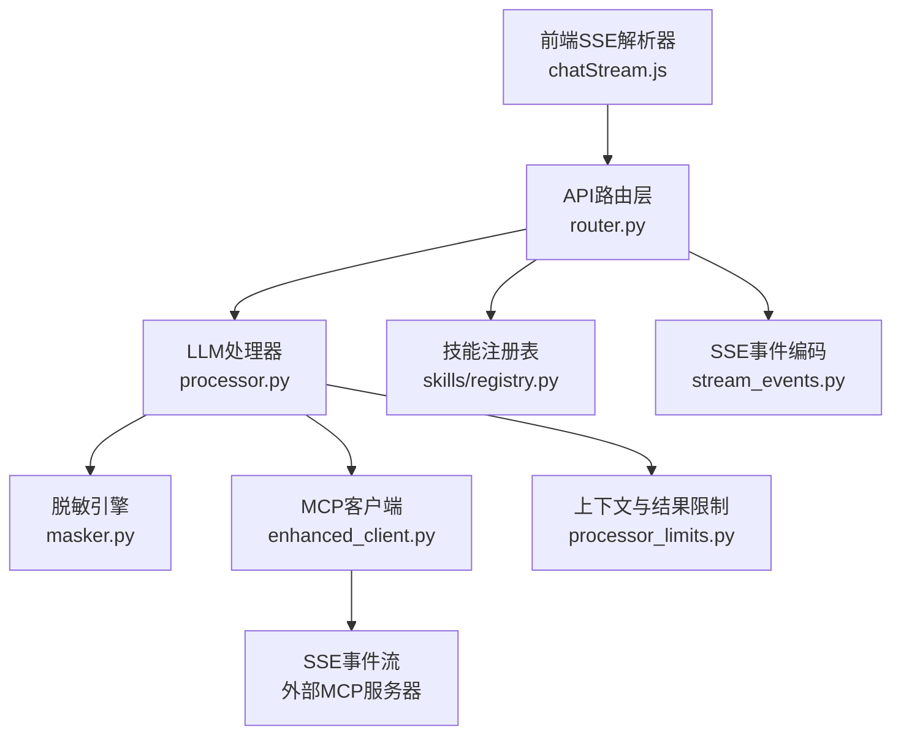
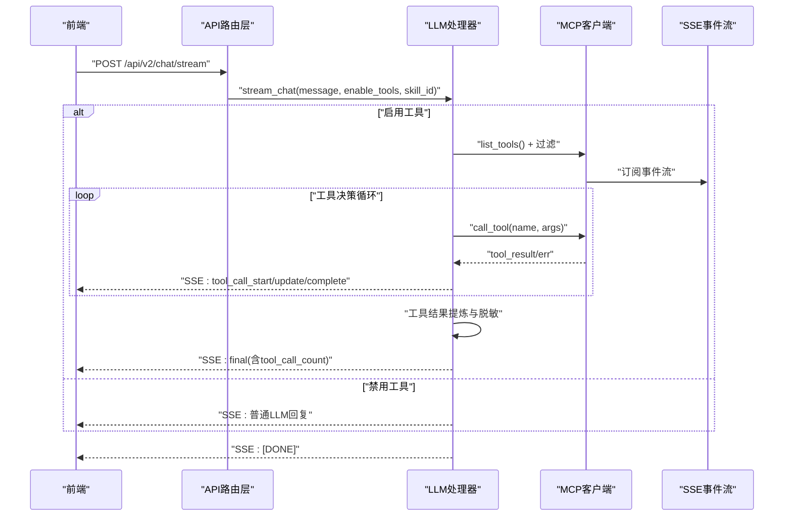
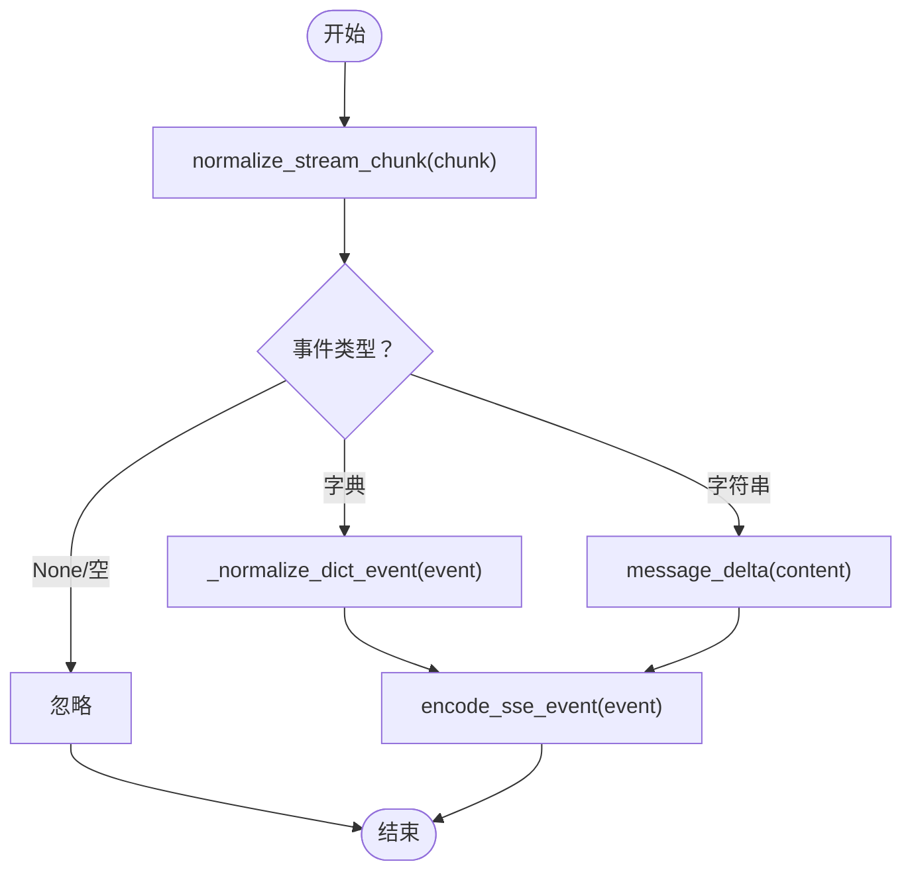
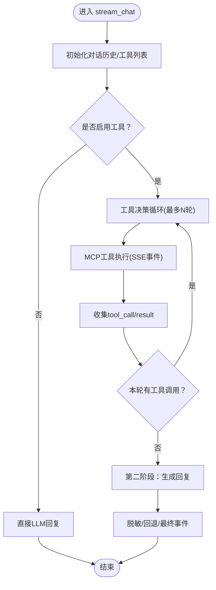
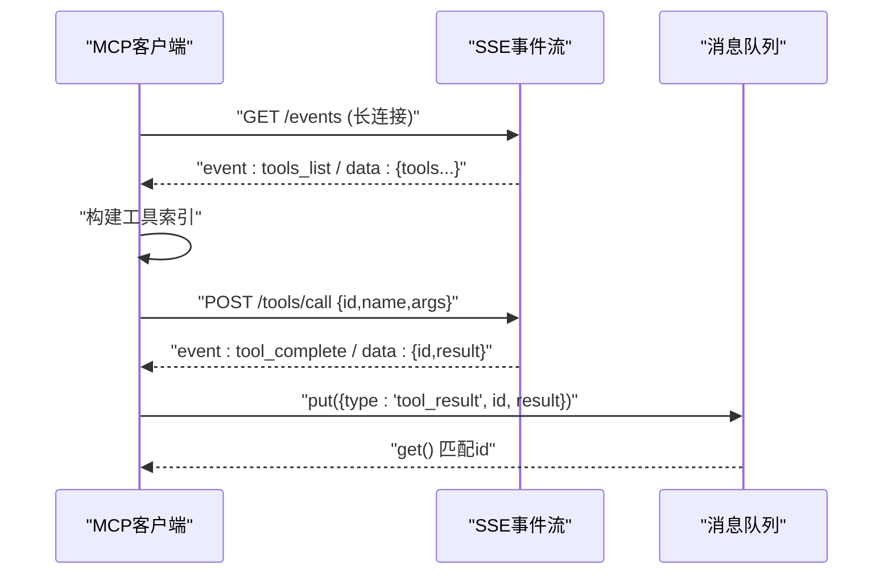
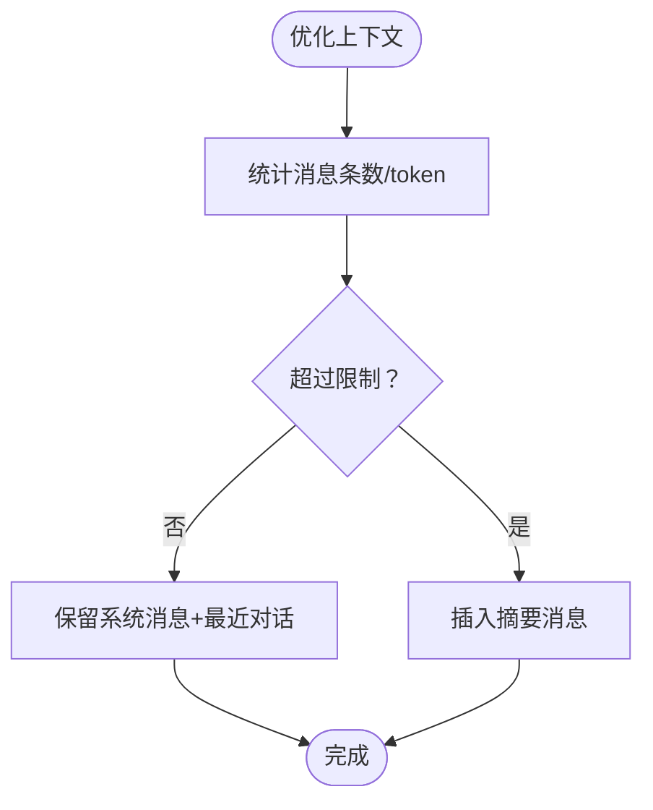
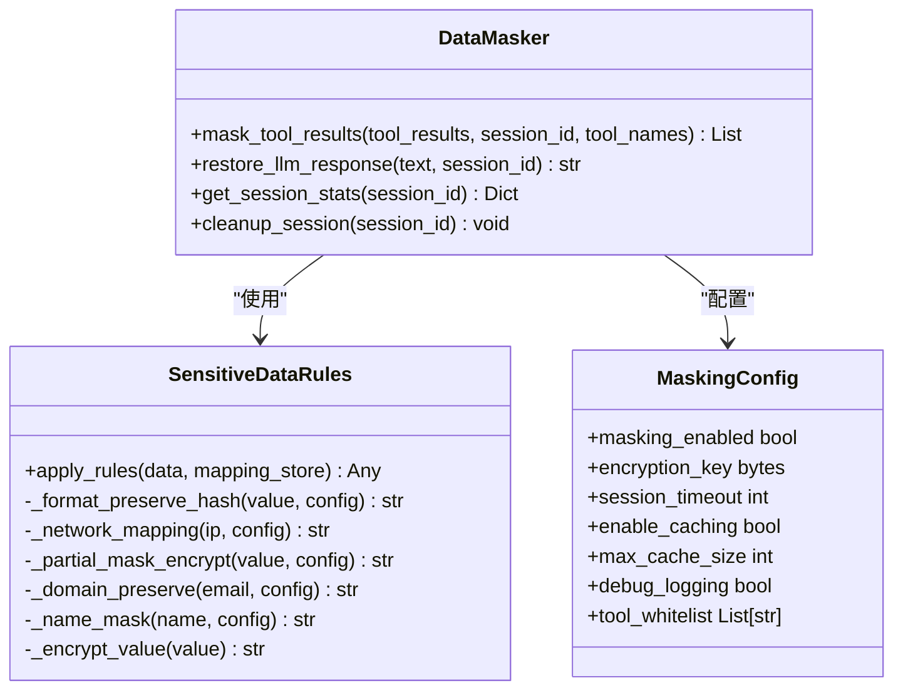
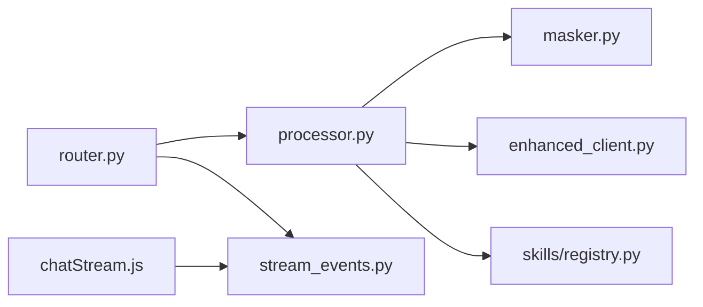

# 流式聊天处理

<cite>
**本文档引用的文件**
- [backend/src/api/v2/stream_events.py](file://backend/src/api/v2/stream_events.py)
- [backend/src/api/v2/router.py](file://backend/src/api/v2/router.py)
- [backend/src/llm/processor.py](file://backend/src/llm/processor.py)
- [backend/src/llm/crew_orchestrator.py](file://backend/src/llm/crew_orchestrator.py)
- [backend/src/llm/security/masker.py](file://backend/src/llm/security/masker.py)
- [backend/src/llm/security/config.py](file://backend/src/llm/security/config.py)
- [backend/src/llm/security/rules.py](file://backend/src/llm/security/rules.py)
- [backend/src/mcp/enhanced_client.py](file://backend/src/mcp/enhanced_client.py)
- [backend/src/skills/registry.py](file://backend/src/skills/registry.py)
- [frontend-v2/src/shared/stream/chatStream.js](file://frontend-v2/src/shared/stream/chatStream.js)
- [backend/src/llm/processor_limits.py](file://backend/src/llm/processor_limits.py)
- [backend/src/api/v2/endpoints/mcp.py](file://backend/src/api/v2/endpoints/mcp.py)
</cite>

## 目录
1. [简介](#简介)
2. [项目结构](#项目结构)
3. [核心组件](#核心组件)
4. [架构总览](#架构总览)
5. [详细组件分析](#详细组件分析)
6. [依赖分析](#依赖分析)
7. [性能考虑](#性能考虑)
8. [故障排除指南](#故障排除指南)
9. [结论](#结论)
10. [附录](#附录)

## 简介
本文件系统性阐述本项目的两阶段流式聊天处理机制，覆盖以下关键主题：
- 两阶段流式聊天：工具执行阶段与LLM回复阶段的实现原理与协作流程
- 流式响应的SSE实现：消息分块、实时传输与连接管理
- 异步生成器与错误处理：超时控制、资源清理与健壮性保障
- 对话历史管理：消息缓存、状态同步与性能优化
- 工具调用集成：函数调用、结果处理与脱敏机制
- 最佳实践、性能优化与故障排除

## 项目结构
后端采用模块化设计，围绕“API路由层—LLM处理器—MCP客户端—安全脱敏”构建，前端通过SSE订阅流式事件。关键模块如下：
- API路由层：定义流式聊天端点，封装SSE响应头与错误编码
- LLM处理器：实现两阶段流式处理、上下文优化与结果提炼
- MCP客户端：管理SSE连接、工具发现与调用，支持超时与重连
- 安全脱敏：对工具结果与LLM响应进行会话级脱敏与恢复
- 技能注册表：按配置限制可调用工具集合
- 前端SSE解析器：将SSE帧解析为统一事件模型

图表来源
- [backend/src/api/v2/router.py:175-345](file://backend/src/api/v2/router.py#L175-L345)
- [backend/src/llm/processor.py:536-757](file://backend/src/llm/processor.py#L536-L757)
- [backend/src/llm/security/masker.py:25-75](file://backend/src/llm/security/masker.py#L25-L75)
- [backend/src/mcp/enhanced_client.py:61-95](file://backend/src/mcp/enhanced_client.py#L61-L95)
- [backend/src/skills/registry.py:104-105](file://backend/src/skills/registry.py#L104-L105)
- [backend/src/api/v2/stream_events.py:13-57](file://backend/src/api/v2/stream_events.py#L13-L57)
- [frontend-v2/src/shared/stream/chatStream.js:3-33](file://frontend-v2/src/shared/stream/chatStream.js#L3-L33)

章节来源
- [backend/src/api/v2/router.py:175-345](file://backend/src/api/v2/router.py#L175-L345)
- [backend/src/llm/processor.py:536-757](file://backend/src/llm/processor.py#L536-L757)
- [backend/src/mcp/enhanced_client.py:61-95](file://backend/src/mcp/enhanced_client.py#L61-L95)
- [backend/src/llm/security/masker.py:25-75](file://backend/src/llm/security/masker.py#L25-L75)
- [backend/src/skills/registry.py:104-105](file://backend/src/skills/registry.py#L104-L105)
- [backend/src/api/v2/stream_events.py:13-57](file://backend/src/api/v2/stream_events.py#L13-L57)
- [frontend-v2/src/shared/stream/chatStream.js:3-33](file://frontend-v2/src/shared/stream/chatStream.js#L3-L33)

## 核心组件
- 流式事件编码与标准化：将处理器内部产出的混合负载标准化为SSE事件，保证前后端契约一致
- 两阶段流式聊天处理器：第一阶段工具决策与执行，第二阶段基于工具结果生成LLM回复
- SSE事件监听与工具调用：维护SSE连接、工具发现、调用与结果队列
- 脱敏引擎：对工具结果与LLM响应进行会话级脱敏与恢复
- 技能注册表：按配置限制可调用工具集合，支持前缀与精确名过滤
- 前端SSE解析器：将SSE帧解析为统一事件模型，支持兼容旧格式

章节来源
- [backend/src/api/v2/stream_events.py:13-160](file://backend/src/api/v2/stream_events.py#L13-L160)
- [backend/src/llm/processor.py:536-757](file://backend/src/llm/processor.py#L536-L757)
- [backend/src/mcp/enhanced_client.py:114-245](file://backend/src/mcp/enhanced_client.py#L114-L245)
- [backend/src/llm/security/masker.py:25-75](file://backend/src/llm/security/masker.py#L25-L75)
- [backend/src/skills/registry.py:104-105](file://backend/src/skills/registry.py#L104-L105)
- [frontend-v2/src/shared/stream/chatStream.js:3-33](file://frontend-v2/src/shared/stream/chatStream.js#L3-L33)

## 架构总览
两阶段流式聊天的总体流程：
1) 前端发起流式聊天请求，后端路由层创建异步生成器
2) 第一阶段：LLM决策是否调用工具，MCP客户端通过SSE执行工具，事件逐步返回
3) 第二阶段：将工具结果压缩与脱敏后喂给LLM，生成最终回复
4) SSE编码与标准化：将中间产物统一为SSE事件，前端逐帧渲染

图表来源
- [backend/src/api/v2/router.py:175-345](file://backend/src/api/v2/router.py#L175-L345)
- [backend/src/llm/processor.py:536-757](file://backend/src/llm/processor.py#L536-L757)
- [backend/src/mcp/enhanced_client.py:652-734](file://backend/src/mcp/enhanced_client.py#L652-L734)
- [backend/src/api/v2/stream_events.py:13-57](file://backend/src/api/v2/stream_events.py#L13-L57)

## 详细组件分析

### 流式事件编码与SSE实现
- 编码器：将事件对象序列化为SSE数据帧，支持“消息增量”“最终事件”“错误事件”
- 标准化器：将处理器内部混合负载（字符串/字典）规范化为统一事件模型
- 前端解析器：解析SSE行，兼容旧版内容更新标记，统一为事件对象

图表来源
- [backend/src/api/v2/stream_events.py:60-160](file://backend/src/api/v2/stream_events.py#L60-L160)

章节来源
- [backend/src/api/v2/stream_events.py:13-160](file://backend/src/api/v2/stream_events.py#L13-L160)
- [frontend-v2/src/shared/stream/chatStream.js:3-33](file://frontend-v2/src/shared/stream/chatStream.js#L3-L33)

### 两阶段流式聊天处理器
- 第一阶段：LLM决策与工具执行
  - 构建请求参数，调用LLM获取工具调用意图
  - 通过MCP客户端并发执行工具，事件逐步返回前端
  - 收集工具调用与结果，更新对话历史
- 第二阶段：基于工具结果生成LLM回复
  - 对工具结果进行大小检查与提炼，必要时生成分页建议
  - 脱敏处理后喂给LLM，生成最终回复
  - 若无有效结果，提供回退机制

图表来源
- [backend/src/llm/processor.py:536-757](file://backend/src/llm/processor.py#L536-L757)

章节来源
- [backend/src/llm/processor.py:536-757](file://backend/src/llm/processor.py#L536-L757)

### SSE事件监听与工具调用
- 连接管理：SSE连接建立、心跳检测、异常重连与超时控制
- 工具发现：接收“tools_list”事件，构建工具索引
- 工具调用：通过HTTP POST提交调用请求，SSE返回结果/错误事件
- 结果聚合：消息队列按请求ID匹配结果，支持超时与清理

图表来源
- [backend/src/mcp/enhanced_client.py:114-245](file://backend/src/mcp/enhanced_client.py#L114-L245)
- [backend/src/mcp/enhanced_client.py:652-734](file://backend/src/mcp/enhanced_client.py#L652-L734)

章节来源
- [backend/src/mcp/enhanced_client.py:114-245](file://backend/src/mcp/enhanced_client.py#L114-L245)
- [backend/src/mcp/enhanced_client.py:652-734](file://backend/src/mcp/enhanced_client.py#L652-L734)

### 对话历史管理与性能优化
- 上下文优化：估算token数，限制历史消息条数与上下文总量，保留关键对话循环
- 结果提炼：对过大工具结果进行智能提炼，减少LLM输入体积
- 结果大小限制：统一阈值控制，避免内存与性能问题

图表来源
- [backend/src/llm/processor.py:463-518](file://backend/src/llm/processor.py#L463-L518)
- [backend/src/llm/processor_limits.py:8-35](file://backend/src/llm/processor_limits.py#L8-L35)

章节来源
- [backend/src/llm/processor.py:463-518](file://backend/src/llm/processor.py#L463-L518)
- [backend/src/llm/processor_limits.py:8-35](file://backend/src/llm/processor_limits.py#L8-L35)

### 工具调用集成与脱敏机制
- 工具过滤：基于技能配置（精确名/前缀）限制可调用工具
- 脱敏策略：对工具结果进行会话级脱敏，支持多种规则（哈希、掩码、加密、域保留等）
- 响应恢复：在流式输出前恢复LLM响应中的敏感信息，保证展示一致性

图表来源
- [backend/src/llm/security/masker.py:25-75](file://backend/src/llm/security/masker.py#L25-L75)
- [backend/src/llm/security/rules.py:54-151](file://backend/src/llm/security/rules.py#L54-L151)
- [backend/src/llm/security/config.py:9-37](file://backend/src/llm/security/config.py#L9-L37)

章节来源
- [backend/src/llm/security/masker.py:25-75](file://backend/src/llm/security/masker.py#L25-L75)
- [backend/src/llm/security/rules.py:54-151](file://backend/src/llm/security/rules.py#L54-L151)
- [backend/src/llm/security/config.py:9-37](file://backend/src/llm/security/config.py#L9-L37)

### CrewAI可选编排（兼容模式）
- 当启用环境变量时，优先使用CrewAI多智能体编排；若不可用则回退至EnhancedLLMProcessor
- 通过统一的工具桥接接口，保持与MCP生态一致的调用体验

章节来源
- [backend/src/llm/crew_orchestrator.py:31-124](file://backend/src/llm/crew_orchestrator.py#L31-L124)
- [backend/src/api/v2/router.py:245-290](file://backend/src/api/v2/router.py#L245-L290)

## 依赖分析
- API路由层依赖LLM处理器与MCP客户端，负责SSE响应头与错误编码
- LLM处理器依赖MCP客户端、脱敏引擎与技能注册表，负责两阶段流式处理
- MCP客户端依赖SSE事件流，负责工具发现、调用与结果聚合
- 前端SSE解析器依赖统一事件模型，负责事件解析与兼容处理

图表来源
- [backend/src/api/v2/router.py:175-345](file://backend/src/api/v2/router.py#L175-L345)
- [backend/src/llm/processor.py:536-757](file://backend/src/llm/processor.py#L536-L757)
- [backend/src/api/v2/stream_events.py:13-57](file://backend/src/api/v2/stream_events.py#L13-L57)
- [frontend-v2/src/shared/stream/chatStream.js:3-33](file://frontend-v2/src/shared/stream/chatStream.js#L3-L33)

章节来源
- [backend/src/api/v2/router.py:175-345](file://backend/src/api/v2/router.py#L175-L345)
- [backend/src/llm/processor.py:536-757](file://backend/src/llm/processor.py#L536-L757)
- [backend/src/api/v2/stream_events.py:13-57](file://backend/src/api/v2/stream_events.py#L13-L57)
- [frontend-v2/src/shared/stream/chatStream.js:3-33](file://frontend-v2/src/shared/stream/chatStream.js#L3-L33)

## 性能考虑
- 上下文与结果体量限制：通过阈值控制避免LLM输入过大
- 工具结果提炼：对大结果进行摘要与分页建议，降低LLM负担
- SSE长连接与事件聚合：减少HTTP握手开销，提升交互流畅度
- 超时与重连：SSE连接具备指数退避与超时控制，提升稳定性
- 会话级脱敏缓存：在可配置前提下启用缓存，减少重复处理成本

章节来源
- [backend/src/llm/processor_limits.py:8-35](file://backend/src/llm/processor_limits.py#L8-L35)
- [backend/src/llm/processor.py:383-424](file://backend/src/llm/processor.py#L383-L424)
- [backend/src/mcp/enhanced_client.py:165-244](file://backend/src/mcp/enhanced_client.py#L165-L244)

## 故障排除指南
- SSE连接失败
  - 现象：SSE连接超时或网络错误
  - 排查：检查服务器地址、认证头、超时配置；关注重试次数与退避策略
- 工具调用超时
  - 现象：工具执行超过设定超时
  - 排查：调整工具超时配置，检查后端日志与活跃调用记录
- 工具不可用
  - 现象：工具列表为空或调用失败
  - 排查：确认MCP服务器状态、工具发现事件、技能过滤规则
- 流式响应异常
  - 现象：前端解析失败或事件缺失
  - 排查：检查SSE编码与标准化逻辑，确认前端解析器兼容性

章节来源
- [backend/src/mcp/enhanced_client.py:165-244](file://backend/src/mcp/enhanced_client.py#L165-L244)
- [backend/src/mcp/enhanced_client.py:736-798](file://backend/src/mcp/enhanced_client.py#L736-L798)
- [backend/src/api/v2/stream_events.py:60-160](file://backend/src/api/v2/stream_events.py#L60-L160)
- [frontend-v2/src/shared/stream/chatStream.js:3-33](file://frontend-v2/src/shared/stream/chatStream.js#L3-L33)

## 结论
本系统通过两阶段流式聊天与SSE事件驱动，实现了“工具决策—工具执行—LLM回复”的闭环。结合上下文优化、结果提炼与会话级脱敏，既保证了性能与安全性，又提供了良好的用户体验。建议在生产环境中：
- 明确工具调用权限与超时策略
- 合理配置上下文与结果阈值
- 监控SSE连接质量与工具调用耗时
- 持续评估脱敏策略与缓存命中率

## 附录
- 技能配置示例：支持全量工具、只读工具集等
- MCP配置管理端点：提供服务器状态、工具列表与批量切换能力

章节来源
- [config/skills.example.json:1-53](file://config/skills.example.json#L1-L53)
- [backend/src/api/v2/endpoints/mcp.py:144-226](file://backend/src/api/v2/endpoints/mcp.py#L144-L226)