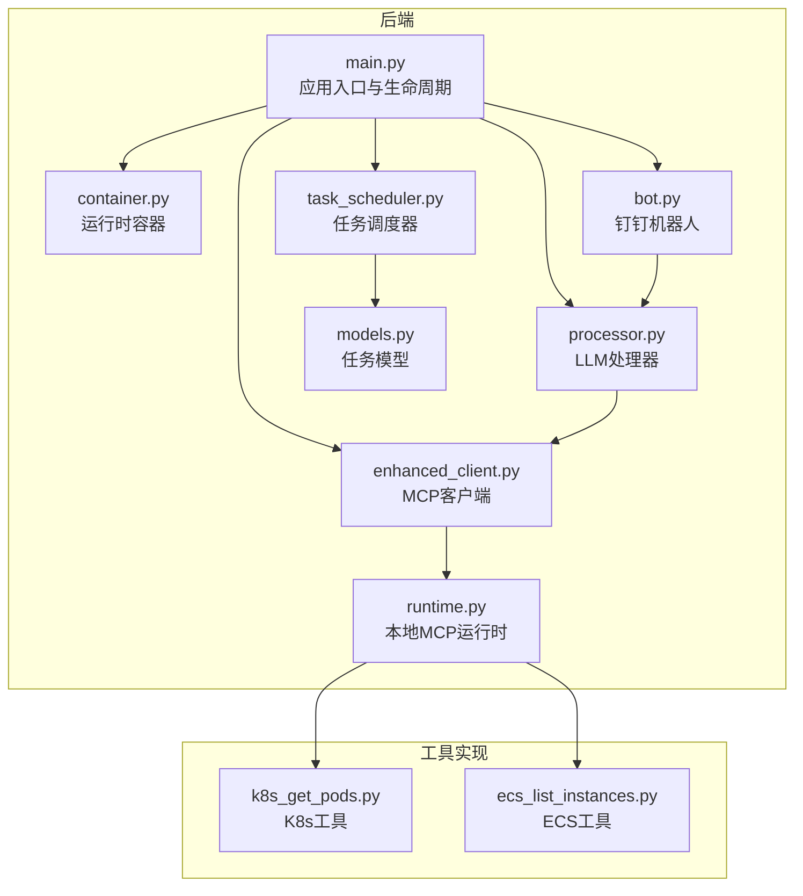
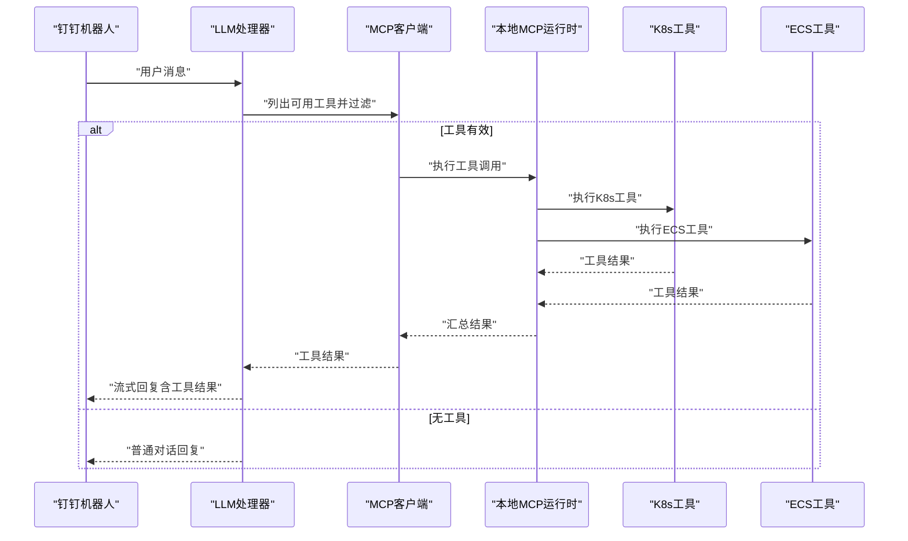
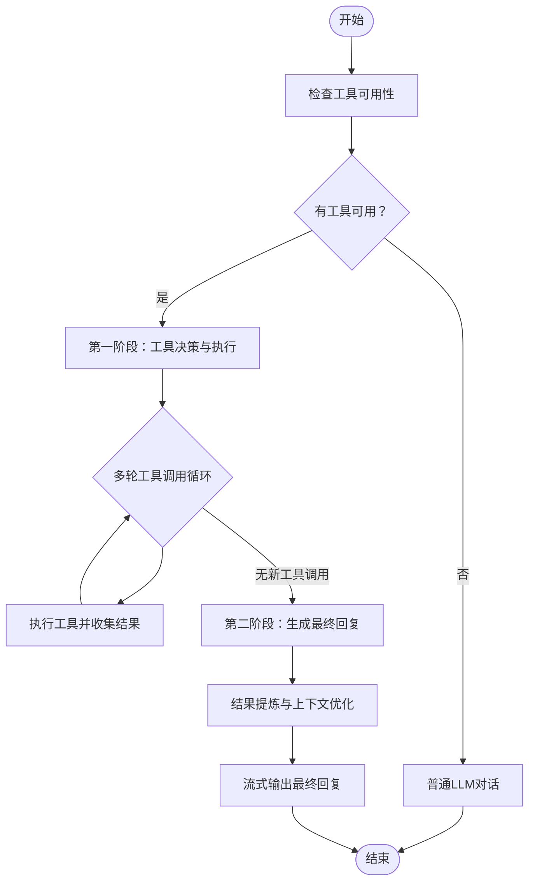
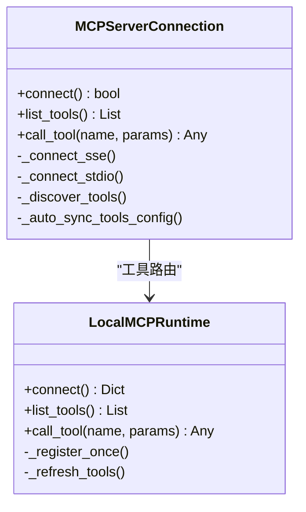
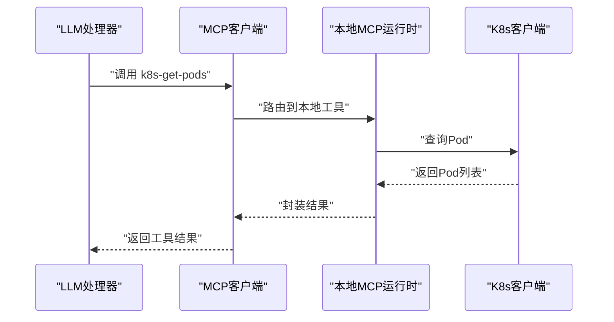
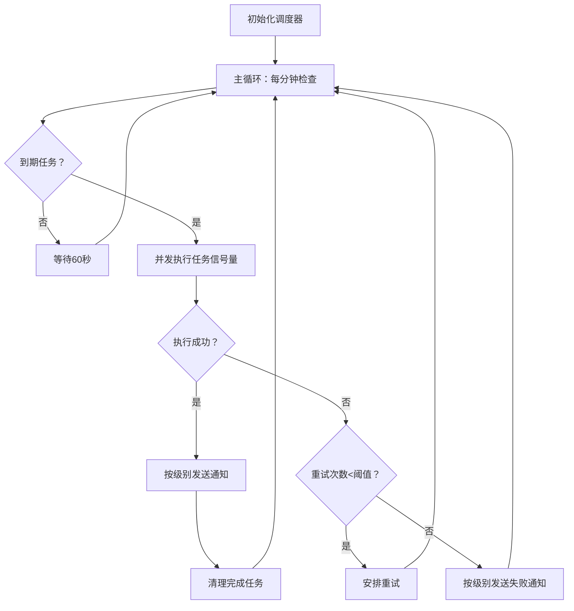
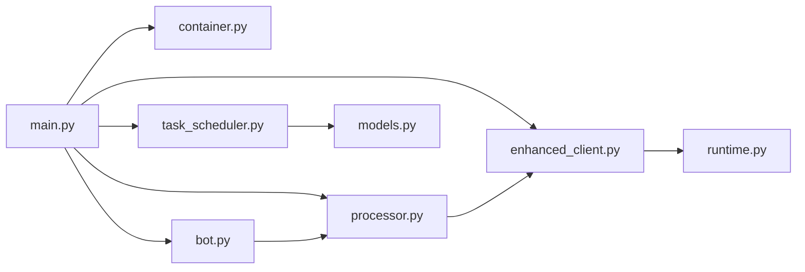

# 核心功能

<cite>
**本文引用的文件**
- [backend/main.py](file://backend/main.py)
- [backend/src/app/container.py](file://backend/src/app/container.py)
- [backend/src/llm/processor.py](file://backend/src/llm/processor.py)
- [backend/src/mcp/enhanced_client.py](file://backend/src/mcp/enhanced_client.py)
- [backend/src/mcp/runtime.py](file://backend/src/mcp/runtime.py)
- [backend/src/scheduler/task_scheduler.py](file://backend/src/scheduler/task_scheduler.py)
- [backend/src/scheduler/models.py](file://backend/src/scheduler/models.py)
- [backend/src/dingtalk/bot.py](file://backend/src/dingtalk/bot.py)
- [backend/src/k8s_mcp/tools/k8s_get_pods.py](file://backend/src/k8s_mcp/tools/k8s_get_pods.py)
- [backend/src/ecs_mcp/tools/ecs_list_instances.py](file://backend/src/ecs_mcp/tools/ecs_list_instances.py)
- [config/llm_config.example.json](file://config/llm_config.example.json)
- [config/mcp_config.example.json](file://config/mcp_config.example.json)
- [config/scheduled_tasks.example.json](file://config/scheduled_tasks.example.json)
</cite>

## 目录
1. [简介](#简介)
2. [项目结构](#项目结构)
3. [核心组件](#核心组件)
4. [架构总览](#架构总览)
5. [详细组件分析](#详细组件分析)
6. [依赖关系分析](#依赖关系分析)
7. [性能考量](#性能考量)
8. [故障排查指南](#故障排查指南)
9. [结论](#结论)
10. [附录](#附录)

## 简介
本文件面向钉钉K8s运维机器人的核心功能，系统性梳理智能对话系统、MCP工具系统、Kubernetes与ECS资源管理、定时任务调度以及它们之间的协作关系。文档重点覆盖以下方面：
- LLM处理器架构与两阶段流式响应机制
- MCP工具发现、连接管理与错误处理
- Kubernetes与ECS工具链的查询与管理能力
- 定时任务调度设计与实现
- 配置选项、使用示例与最佳实践
- 模块间集成方式与数据流

## 项目结构
该系统采用后端主程序作为统一入口，结合LLM处理器、MCP客户端与工具运行时、定时任务调度器、钉钉机器人等模块协同工作。前端通过静态资源提供交互界面，后端通过API路由对外提供能力。

图表来源
- [backend/main.py:137-270](file://backend/main.py#L137-L270)
- [backend/src/app/container.py:15-36](file://backend/src/app/container.py#L15-L36)
- [backend/src/llm/processor.py:30-120](file://backend/src/llm/processor.py#L30-L120)
- [backend/src/mcp/enhanced_client.py:33-112](file://backend/src/mcp/enhanced_client.py#L33-L112)
- [backend/src/mcp/runtime.py:31-119](file://backend/src/mcp/runtime.py#L31-L119)
- [backend/src/scheduler/task_scheduler.py:23-80](file://backend/src/scheduler/task_scheduler.py#L23-L80)
- [backend/src/scheduler/models.py:38-135](file://backend/src/scheduler/models.py#L38-L135)
- [backend/src/dingtalk/bot.py:51-114](file://backend/src/dingtalk/bot.py#L51-L114)
- [backend/src/k8s_mcp/tools/k8s_get_pods.py:16-30](file://backend/src/k8s_mcp/tools/k8s_get_pods.py#L16-L30)
- [backend/src/ecs_mcp/tools/ecs_list_instances.py:23-46](file://backend/src/ecs_mcp/tools/ecs_list_instances.py#L23-L46)

章节来源
- [backend/main.py:137-270](file://backend/main.py#L137-L270)

## 核心组件
- 应用入口与生命周期：负责服务初始化、MCP/Llm/DingTalk/定时任务的启动与清理，提供健康检查端点。
- 运行时容器：集中持有MCP客户端、LLM处理器、钉钉机器人实例，支持动态重建LLM处理器。
- LLM处理器：两阶段流式对话（工具决策 + LLM回复），具备结果提炼、上下文优化、脱敏与安全策略。
- MCP客户端：支持SSE/STDIO等传输，自动发现工具、路由工具调用、错误处理与重连。
- 本地MCP运行时：内置K8s/ECS工具的进程内执行边界，注册与执行工具。
- 定时任务调度器：基于Cron表达式的任务管理，支持并发控制、重试与通知。
- 钉钉机器人：接收Webhook消息，路由到LLM或快捷指令，支持Markdown分片发送与签名验证。

章节来源
- [backend/src/app/container.py:15-36](file://backend/src/app/container.py#L15-L36)
- [backend/src/llm/processor.py:30-120](file://backend/src/llm/processor.py#L30-L120)
- [backend/src/mcp/enhanced_client.py:33-112](file://backend/src/mcp/enhanced_client.py#L33-L112)
- [backend/src/mcp/runtime.py:31-119](file://backend/src/mcp/runtime.py#L31-L119)
- [backend/src/scheduler/task_scheduler.py:23-80](file://backend/src/scheduler/task_scheduler.py#L23-L80)
- [backend/src/dingtalk/bot.py:51-114](file://backend/src/dingtalk/bot.py#L51-L114)

## 架构总览
系统采用“主程序统一入口 + 模块化组件”的架构，核心流程如下：
- 启动阶段：初始化MCP客户端（可内置K8s/ECS工具）、LLM处理器、钉钉机器人；可选启动定时巡检与任务调度器。
- 请求阶段：钉钉Webhook进入机器人，路由到LLM处理器；LLM根据工具可用性决定是否调用MCP工具；工具执行完成后进入第二阶段生成回复。
- 调度阶段：定时任务调度器周期性执行任务，必要时通过钉钉机器人发送通知。

图表来源
- [backend/src/dingtalk/bot.py:115-220](file://backend/src/dingtalk/bot.py#L115-L220)
- [backend/src/llm/processor.py:541-757](file://backend/src/llm/processor.py#L541-L757)
- [backend/src/mcp/enhanced_client.py:587-800](file://backend/src/mcp/enhanced_client.py#L587-L800)
- [backend/src/mcp/runtime.py:94-99](file://backend/src/mcp/runtime.py#L94-L99)

## 详细组件分析

### LLM处理器与两阶段流式对话
- 两阶段流程
  - 第一阶段：LLM基于用户消息与工具Schema进行工具决策，支持多轮工具调用，逐步收集工具结果。
  - 第二阶段：将工具结果进行提炼与压缩，注入提示词，生成最终回复。
- 流式输出
  - 对工具执行过程进行流式输出，工具执行完成后插入分隔符，再输出LLM回复。
- 上下文优化与结果提炼
  - 估算token并裁剪历史消息，避免上下文超限；对工具结果进行关键信息提炼与分页建议。
- 脱敏与安全
  - 基于配置的数据脱敏策略，对敏感信息进行掩码处理。

图表来源
- [backend/src/llm/processor.py:541-757](file://backend/src/llm/processor.py#L541-L757)
- [backend/src/llm/processor.py:383-458](file://backend/src/llm/processor.py#L383-L458)

章节来源
- [backend/src/llm/processor.py:520-757](file://backend/src/llm/processor.py#L520-L757)

### MCP工具系统
- 工具发现与连接
  - 支持SSE与STDIO两种传输；SSE连接包含心跳、事件监听与自动重连；STDIO通过子进程启动。
  - 自动同步工具配置到配置文件，便于持久化与热重载。
- 工具路由与过滤
  - 基于技能（Skill）过滤工具集合，限定可调用工具范围。
- 错误处理与超时
  - 工具调用超时、网络异常、工具不存在等情况均有明确错误类型与日志记录。
- 本地运行时
  - 内置K8s/ECS工具在进程中注册与执行，避免外部独立服务依赖。

图表来源
- [backend/src/mcp/enhanced_client.py:33-112](file://backend/src/mcp/enhanced_client.py#L33-L112)
- [backend/src/mcp/runtime.py:31-119](file://backend/src/mcp/runtime.py#L31-L119)

章节来源
- [backend/src/mcp/enhanced_client.py:587-800](file://backend/src/mcp/enhanced_client.py#L587-L800)
- [backend/src/mcp/runtime.py:31-119](file://backend/src/mcp/runtime.py#L31-L119)

### Kubernetes管理能力
- 工具能力
  - 列表查询：Pod、Service、Deployment、Node、Endpoints、Events、日志等。
  - 描述与分析：Pod详情、集群概览、关系查询、资源分析报告等。
- 示例：Pod列表工具
  - 支持命名空间与标签选择器过滤；对结果进行格式化与状态摘要；超过阈值时截断并给出优化建议。

图表来源
- [backend/src/k8s_mcp/tools/k8s_get_pods.py:53-113](file://backend/src/k8s_mcp/tools/k8s_get_pods.py#L53-L113)

章节来源
- [backend/src/k8s_mcp/tools/k8s_get_pods.py:16-169](file://backend/src/k8s_mcp/tools/k8s_get_pods.py#L16-L169)

### ECS资源管理能力
- 工具能力
  - 列举实例：支持地域、状态、分页参数；返回实例ID、名称、状态、可用区等元数据。
- 示例：实例列表工具
  - 通过自签名RPC调用阿里云接口，兼容SDK凭证链问题；对返回数据进行结构化整理。

章节来源
- [backend/src/ecs_mcp/tools/ecs_list_instances.py:23-115](file://backend/src/ecs_mcp/tools/ecs_list_instances.py#L23-L115)

### 定时任务调度系统
- 设计要点
  - 基于Cron表达式与异步循环，支持并发控制（信号量）、重试与通知。
  - 任务类型：集群检查、资源分析、健康监控、自定义任务。
  - 通知：支持钉钉机器人推送执行结果或错误信息。
- 关键模型
  - ScheduledTask：任务配置、Cron表达式、通知级别、超时与重试。
  - TaskExecution：执行记录、耗时、结果与错误、重试与通知状态。
  - Cron表达式模板与描述辅助工具。

图表来源
- [backend/src/scheduler/task_scheduler.py:108-284](file://backend/src/scheduler/task_scheduler.py#L108-L284)
- [backend/src/scheduler/models.py:38-135](file://backend/src/scheduler/models.py#L38-L135)

章节来源
- [backend/src/scheduler/task_scheduler.py:23-487](file://backend/src/scheduler/task_scheduler.py#L23-L487)
- [backend/src/scheduler/models.py:38-444](file://backend/src/scheduler/models.py#L38-L444)

### 钉钉机器人集成
- Webhook处理
  - 解析请求、识别快捷指令与普通消息；路由到LLM或快捷指令处理器。
- 流式响应
  - 将LLM流式输出转换为钉钉消息；支持Markdown分片发送与签名验证。
- 主动消息
  - 支持主动推送文本或Markdown消息，自动分片与签名。

章节来源
- [backend/src/dingtalk/bot.py:64-331](file://backend/src/dingtalk/bot.py#L64-L331)
- [backend/src/dingtalk/bot.py:412-473](file://backend/src/dingtalk/bot.py#L412-L473)

## 依赖关系分析
- 组件耦合
  - main.py作为统一入口，依赖容器、LLM、MCP、调度器与机器人模块。
  - LLM处理器依赖MCP客户端与安全配置；MCP客户端依赖运行时与配置管理。
  - 定时任务调度器依赖任务模型与执行器，执行器依赖MCP与LLM。
  - 钉钉机器人依赖LLM处理器与MCP类型。
- 外部依赖
  - LLM客户端（OpenAI兼容）、HTTP/WebSocket/SSE、阿里云SDK/RPC。
  - 异步运行时（asyncio）、Cron解析库。

图表来源
- [backend/main.py:137-270](file://backend/main.py#L137-L270)
- [backend/src/llm/processor.py:30-120](file://backend/src/llm/processor.py#L30-L120)
- [backend/src/mcp/enhanced_client.py:33-112](file://backend/src/mcp/enhanced_client.py#L33-L112)
- [backend/src/mcp/runtime.py:31-119](file://backend/src/mcp/runtime.py#L31-L119)
- [backend/src/scheduler/task_scheduler.py:23-80](file://backend/src/scheduler/task_scheduler.py#L23-L80)
- [backend/src/scheduler/models.py:38-135](file://backend/src/scheduler/models.py#L38-L135)
- [backend/src/dingtalk/bot.py:51-114](file://backend/src/dingtalk/bot.py#L51-L114)

## 性能考量
- 上下文与结果大小控制
  - LLM处理器对消息与工具结果进行估算与裁剪，避免上下文超限；对大结果进行关键信息提炼与分页建议。
- 并发与重试
  - 定时任务调度器使用信号量限制并发；MCP客户端对SSE连接进行指数退避重试。
- I/O与超时
  - MCP工具调用设置合理超时；SSE事件监听与HTTP请求均设置超时与错误处理。
- 资源隔离
  - 本地MCP运行时将K8s/ECS工具在进程中执行，减少跨进程通信开销。

[本节为通用指导，不直接分析具体文件]

## 故障排查指南
- LLM不可用
  - 检查LLM配置文件与环境变量；确认API密钥与网络代理；查看初始化日志中的错误堆栈。
- MCP连接失败
  - 查看SSE连接状态与事件日志；确认服务器地址、端口与认证头；关注重试与超时配置。
- 工具调用超时或错误
  - 检查工具参数类型与必填字段；查看工具返回的错误信息；确认权限与资源状态。
- 钉钉消息发送失败
  - 检查Webhook URL与签名配置；关注HTTP状态码与钉钉返回的错误码；确认消息长度限制。
- 定时任务异常
  - 查看任务执行记录与重试状态；核对Cron表达式与时区；确认通知通道配置。

章节来源
- [backend/src/llm/processor.py:103-120](file://backend/src/llm/processor.py#L103-L120)
- [backend/src/mcp/enhanced_client.py:168-244](file://backend/src/mcp/enhanced_client.py#L168-L244)
- [backend/src/dingtalk/bot.py:313-318](file://backend/src/dingtalk/bot.py#L313-L318)
- [backend/src/scheduler/task_scheduler.py:146-149](file://backend/src/scheduler/task_scheduler.py#L146-L149)

## 结论
本系统通过统一入口与模块化组件，实现了从智能对话到工具执行再到自动化调度的闭环。LLM处理器的两阶段流式机制提升了交互体验，MCP工具系统提供了灵活的资源管理能力，定时任务调度器保障了运维工作的自动化与可观测性。通过合理的配置与错误处理策略，系统在复杂生产环境中具备良好的稳定性与可维护性。

[本节为总结性内容，不直接分析具体文件]

## 附录

### 配置选项与使用示例

- LLM配置
  - 文件位置：config/llm_config.json
  - 关键项：提供商、模型、API密钥、基础URL、温度、最大令牌数、超时、重试、流式支持、安全与日志开关
  - 示例参考：config/llm_config.example.json

- MCP配置
  - 文件位置：config/mcp_config.json
  - 关键项：全局超时、重试、并发、缓存、服务器列表（SSE/STDIO）、工具路由、安全与日志
  - 示例参考：config/mcp_config.example.json

- 定时任务配置
  - 文件位置：config/scheduled_tasks.json
  - 关键项：任务列表、Cron表达式、通知级别、超时与重试、任务类型与配置
  - 示例参考：config/scheduled_tasks.example.json

- 环境变量
  - LOG_LEVEL、HOST、PORT、WORKERS、RELOAD、INSPECTION_ENABLED、INSPECTION_INTERVAL_MINUTES、INSPECTION_SEND_TO_DINGTALK、SCHEDULER_ENABLED、DINGTALK_WEBHOOK_URL、DINGTALK_SECRET 等

章节来源
- [config/llm_config.example.json:1-45](file://config/llm_config.example.json#L1-L45)
- [config/mcp_config.example.json:1-66](file://config/mcp_config.example.json#L1-L66)
- [config/scheduled_tasks.example.json:1-8](file://config/scheduled_tasks.example.json#L1-L8)
- [backend/main.py:54-61](file://backend/main.py#L54-L61)

### 最佳实践
- LLM与MCP
  - 明确工具Schema与参数约束；对大结果进行提炼与分页；开启数据脱敏与审计日志。
- MCP连接
  - 合理设置超时与重试；使用SSE时关注心跳与事件流；对工具配置进行自动同步与备份。
- Kubernetes与ECS
  - 使用命名空间与标签选择器精确查询；对大量结果进行截断与摘要；避免高风险操作的默认执行。
- 定时任务
  - 使用稳定的Cron表达式与时区；设置合适的并发与重试；按级别发送通知；记录执行历史与统计。
- 钉钉集成
  - 启用签名验证；对Markdown内容进行规范化处理；对长内容进行分片发送。

[本节为通用指导，不直接分析具体文件]