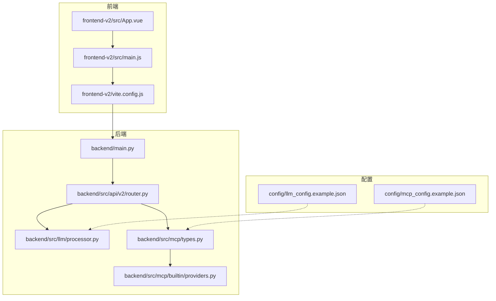
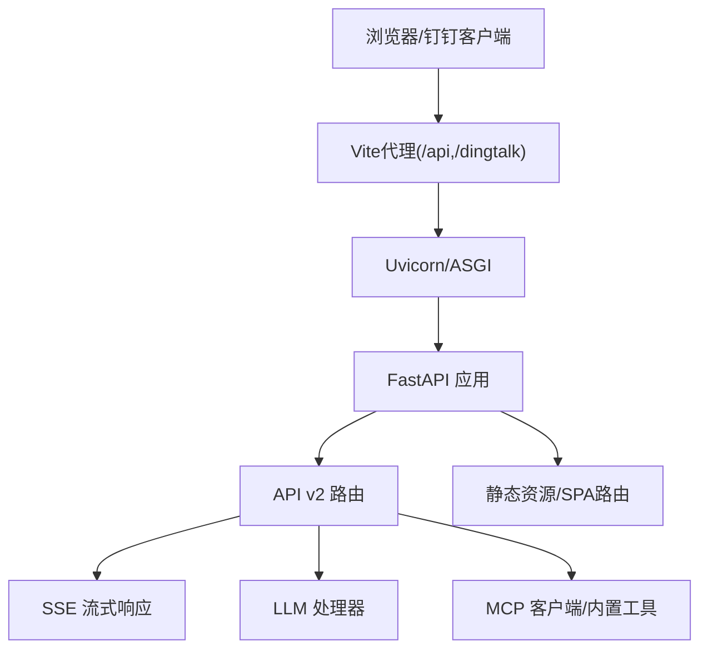
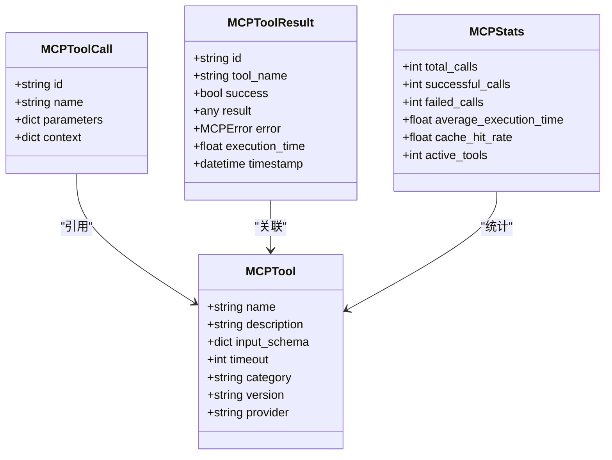
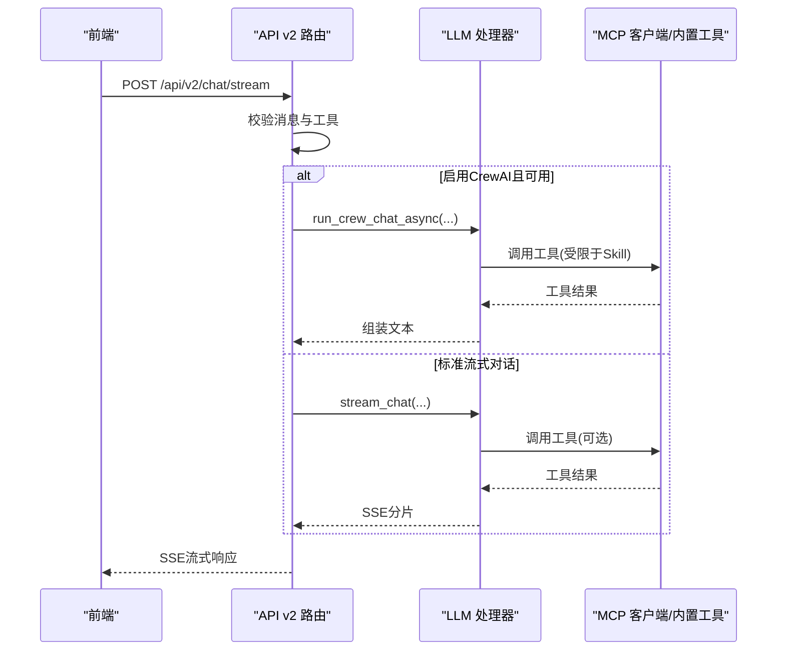
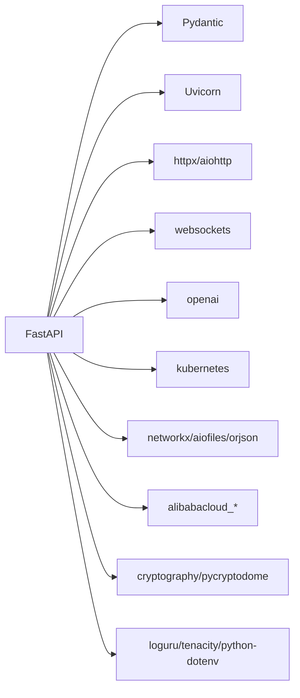

# 技术栈与选型决策

<cite>
**本文引用的文件**
- [backend/main.py](file://backend/main.py)
- [pyproject.toml](file://pyproject.toml)
- [frontend-v2/package.json](file://frontend-v2/package.json)
- [frontend-v2/vite.config.js](file://frontend-v2/vite.config.js)
- [backend/src/api/v2/router.py](file://backend/src/api/v2/router.py)
- [backend/src/mcp/types.py](file://backend/src/mcp/types.py)
- [backend/src/mcp/builtin/providers.py](file://backend/src/mcp/builtin/providers.py)
- [backend/src/llm/config.py](file://backend/src/llm/config.py)
- [backend/src/llm/processor.py](file://backend/src/llm/processor.py)
- [backend/src/llm/crew_orchestrator.py](file://backend/src/llm/crew_orchestrator.py)
- [frontend-v2/src/main.js](file://frontend-v2/src/main.js)
- [frontend-v2/src/App.vue](file://frontend-v2/src/App.vue)
- [config/llm_config.example.json](file://config/llm_config.example.json)
- [config/mcp_config.example.json](file://config/mcp_config.example.json)
- [README.md](file://README.md)
</cite>

## 目录
1. [引言](#引言)
2. [项目结构](#项目结构)
3. [核心组件](#核心组件)
4. [架构总览](#架构总览)
5. [详细组件分析](#详细组件分析)
6. [依赖分析](#依赖分析)
7. [性能考虑](#性能考虑)
8. [故障排查指南](#故障排查指南)
9. [结论](#结论)
10. [附录](#附录)

## 引言
本文件面向“钉钉K8s运维机器人”项目的“技术栈与选型决策”，围绕后端框架（Python FastAPI）、前端框架（Vue.js 3）、MCP协议与LLM集成进行系统化说明。文档重点解释：
- 为什么选择Python FastAPI作为后端框架（性能、开发效率、生态支持）
- 为什么选择Vue.js 3作为前端框架（响应式、Composition API、现代开发体验）
- MCP协议的技术考量（标准化程度、工具生态）
- LLM集成的技术选型（OpenAI SDK使用、多提供商支持）
- 技术栈对比分析与替代方案
- 版本兼容性与升级策略

## 项目结构
项目采用前后端分离与一体化部署的混合架构：
- 后端：Python + FastAPI，提供REST API、流式SSE、静态资源托管与SPA路由
- 前端：Vue.js 3 + Vite，提供现代化聊天界面与运维工作台
- MCP协议：统一的工具调用协议，支持本地内置工具与远端MCP服务器
- LLM集成：OpenAI SDK驱动，支持多提供商配置与可选的CrewAI编排

图表来源
- [backend/main.py:302-450](file://backend/main.py#L302-L450)
- [backend/src/api/v2/router.py:158-345](file://backend/src/api/v2/router.py#L158-L345)
- [backend/src/llm/processor.py:40-120](file://backend/src/llm/processor.py#L40-L120)
- [backend/src/mcp/types.py:19-74](file://backend/src/mcp/types.py#L19-L74)
- [backend/src/mcp/builtin/providers.py:74-158](file://backend/src/mcp/builtin/providers.py#L74-L158)
- [frontend-v2/src/main.js:1-52](file://frontend-v2/src/main.js#L1-L52)
- [frontend-v2/vite.config.js:6-54](file://frontend-v2/vite.config.js#L6-L54)
- [config/llm_config.example.json:1-45](file://config/llm_config.example.json#L1-L45)
- [config/mcp_config.example.json:1-66](file://config/mcp_config.example.json#L1-L66)

章节来源
- [backend/main.py:302-450](file://backend/main.py#L302-L450)
- [backend/src/api/v2/router.py:158-345](file://backend/src/api/v2/router.py#L158-L345)
- [frontend-v2/src/main.js:1-52](file://frontend-v2/src/main.js#L1-L52)
- [frontend-v2/vite.config.js:6-54](file://frontend-v2/vite.config.js#L6-L54)
- [config/llm_config.example.json:1-45](file://config/llm_config.example.json#L1-L45)
- [config/mcp_config.example.json:1-66](file://config/mcp_config.example.json#L1-L66)

## 核心组件
- 后端主程序（FastAPI）：负责应用生命周期、中间件、静态资源、路由注册与健康检查
- API v2路由：提供聊天、工具、配置、巡检、调度等核心接口
- LLM处理器：基于OpenAI SDK，支持多提供商配置与流式输出
- MCP类型与客户端：定义工具调用契约、统计与异常，支持本地内置工具与远端MCP
- 前端应用：Vue 3 + Element Plus，提供聊天、配置、审计、调度等功能页面

章节来源
- [backend/main.py:137-300](file://backend/main.py#L137-L300)
- [backend/src/api/v2/router.py:158-345](file://backend/src/api/v2/router.py#L158-L345)
- [backend/src/llm/processor.py:40-120](file://backend/src/llm/processor.py#L40-L120)
- [backend/src/mcp/types.py:19-74](file://backend/src/mcp/types.py#L19-L74)
- [frontend-v2/src/main.js:1-52](file://frontend-v2/src/main.js#L1-L52)

## 架构总览
系统采用“后端统一服务 + 前端SPA”的架构，后端同时承担API服务、静态资源托管与SPA路由，前端通过Vite开发服务器代理API请求。

图表来源
- [backend/main.py:397-450](file://backend/main.py#L397-L450)
- [backend/src/api/v2/router.py:158-345](file://backend/src/api/v2/router.py#L158-L345)
- [frontend-v2/vite.config.js:15-28](file://frontend-v2/vite.config.js#L15-L28)

章节来源
- [backend/main.py:397-450](file://backend/main.py#L397-L450)
- [frontend-v2/vite.config.js:15-28](file://frontend-v2/vite.config.js#L15-L28)

## 详细组件分析

### 后端框架：Python FastAPI 选型决策
- 性能优势
  - 基于Starlette与Uvicorn，异步I/O与高并发场景表现优异
  - 内置Pydantic模型校验与自动OpenAPI文档生成，减少样板代码
- 开发效率
  - 类型注解与依赖注入，提升IDE体验与可维护性
  - 生命周期管理（lifespan）集中初始化与清理，降低耦合
- 生态系统支持
  - 与loguru、httpx、pydantic、tenacity等库无缝协作
  - CORS、静态文件、SSE等中间件开箱即用

章节来源
- [backend/main.py:137-300](file://backend/main.py#L137-L300)
- [backend/main.py:302-450](file://backend/main.py#L302-L450)
- [pyproject.toml:9-51](file://pyproject.toml#L9-L51)

### 前端框架：Vue.js 3 选型决策
- 响应式数据绑定
  - Composition API提供更灵活的状态与逻辑复用，适合复杂聊天与配置界面
- 现代化开发体验
  - Vite提供快速冷启动与热重载，开发体验流畅
  - Pinia状态管理与Element Plus UI库，降低前端开发成本
- 与后端集成
  - Vite代理配置简化跨域与本地联调
  - SPA路由与后端静态托管配合，统一入口与用户体验

章节来源
- [frontend-v2/src/main.js:1-52](file://frontend-v2/src/main.js#L1-L52)
- [frontend-v2/src/App.vue:128-292](file://frontend-v2/src/App.vue#L128-L292)
- [frontend-v2/vite.config.js:6-54](file://frontend-v2/vite.config.js#L6-L54)
- [frontend-v2/package.json:1-41](file://frontend-v2/package.json#L1-L41)

### MCP协议选型的技术考量
- 标准化程度
  - MCP类型定义（工具、调用、结果、统计、异常）统一了工具契约，便于扩展与治理
- 工具生态
  - 支持本地内置K8s/ECS工具与远端MCP服务器，既满足离线场景又保留扩展空间
  - 工具注册与Schema转换机制，保证工具清单一致性与安全性

图表来源
- [backend/src/mcp/types.py:19-74](file://backend/src/mcp/types.py#L19-L74)

章节来源
- [backend/src/mcp/types.py:19-74](file://backend/src/mcp/types.py#L19-L74)
- [backend/src/mcp/builtin/providers.py:74-158](file://backend/src/mcp/builtin/providers.py#L74-L158)

### LLM集成的技术选型
- OpenAI SDK使用
  - 基于AsyncOpenAI客户端，支持流式输出与重试机制
  - 通过配置文件与环境变量统一管理提供商、模型与参数
- 多提供商支持
  - LLM配置模型支持多提供商、默认提供商、全局默认参数与安全/日志/监控配置
  - 运行时优先读取文件配置，回退到环境变量，保证灵活性与兼容性
- 可选CrewAI编排
  - 在满足条件时使用CrewAI进行多智能体编排，否则回退到标准流式对话

图表来源
- [backend/src/api/v2/router.py:245-345](file://backend/src/api/v2/router.py#L245-L345)
- [backend/src/llm/crew_orchestrator.py:31-124](file://backend/src/llm/crew_orchestrator.py#L31-L124)
- [backend/src/llm/processor.py:40-120](file://backend/src/llm/processor.py#L40-L120)

章节来源
- [backend/src/llm/config.py:259-360](file://backend/src/llm/config.py#L259-L360)
- [backend/src/llm/processor.py:40-120](file://backend/src/llm/processor.py#L40-L120)
- [backend/src/llm/crew_orchestrator.py:31-124](file://backend/src/llm/crew_orchestrator.py#L31-L124)
- [config/llm_config.example.json:1-45](file://config/llm_config.example.json#L1-L45)

### 技术栈对比分析与替代方案
- 后端框架
  - FastAPI vs Django/Flask：FastAPI在异步、类型安全、自动文档方面更具优势；Flask更轻量但生态与性能略逊
  - 选型理由：本项目强调高并发与可观测性，FastAPI契合需求
- 前端框架
  - Vue 3 vs React：Vue 3 Composition API与TypeScript生态成熟，学习曲线平缓；React生态庞大但复杂度更高
  - 选型理由：团队与项目对Vue生态更熟悉，开发效率与维护性更优
- MCP协议
  - 自研vs标准协议：自研协议灵活但生态有限；MCP标准化程度高，工具生态丰富
  - 选型理由：项目强调工具可扩展与生态互通，MCP更合适
- LLM集成
  - OpenAI SDK vs 其他SDK：OpenAI SDK生态完善、流式支持好；其他SDK需自行封装
  - 选型理由：OpenAI生态与多提供商适配良好，满足当前需求

[本节为概念性分析，不直接引用具体文件]

### 版本兼容性与升级策略
- Python版本
  - 项目要求Python 3.11–3.13，crewai等上游依赖限制在3.14以下，建议在3.13环境中使用crewai
- Node版本
  - 前端要求Node >=20 且 <23，建议使用LTS版本（20/22）以获得稳定支持
- 升级策略
  - 后端：遵循Poetry锁定版本，逐步验证依赖兼容性；重大版本升级前先在测试环境验证
  - 前端：Vite与Vue生态迭代较快，建议按季度评估升级；保持Node LTS以降低风险
  - MCP/LLM：通过配置文件与环境变量隔离变更，避免硬编码；升级前备份配置

章节来源
- [pyproject.toml:10-11](file://pyproject.toml#L10-L11)
- [frontend-v2/package.json:6-8](file://frontend-v2/package.json#L6-L8)
- [README.md:20-28](file://README.md#L20-L28)

## 依赖分析
后端依赖以FastAPI为核心，围绕HTTP、WebSocket、MCP、LLM、Kubernetes/ECS、加密与工具库构建；前端依赖以Vue 3、Element Plus、Pinia、Vue Router为主。

图表来源
- [pyproject.toml:9-51](file://pyproject.toml#L9-L51)

章节来源
- [pyproject.toml:9-51](file://pyproject.toml#L9-L51)

## 性能考虑
- 后端
  - 异步I/O与SSE流式输出，降低长连接与大响应的内存占用
  - 连接池与重试策略（tenacity）提升稳定性
- 前端
  - Vite按需打包与分包策略，减小首屏体积
  - Element Plus按需引入，避免全量UI库
- MCP/LLM
  - 工具调用超时与并发限制，避免阻塞与雪崩
  - LLM流式输出与分片传输，改善用户体验

[本节提供通用指导，不直接引用具体文件]

## 故障排查指南
- 后端
  - 健康检查与审计中间件：通过/health与操作审计记录定位问题
  - 异常处理：统一错误封装与SSE错误事件，便于前端展示
- 前端
  - Vite代理配置：确认/api与/dingtalk代理指向后端地址
  - 全局错误处理：Vue errorHandler捕获组件渲染错误
- MCP/LLM
  - 工具不可用：检查MCP客户端连接与工具列表刷新
  - LLM不可用：检查配置文件与环境变量，确认提供商与模型可用

章节来源
- [backend/main.py:311-346](file://backend/main.py#L311-L346)
- [backend/src/api/v2/router.py:116-157](file://backend/src/api/v2/router.py#L116-L157)
- [frontend-v2/src/main.js:33-38](file://frontend-v2/src/main.js#L33-L38)
- [config/llm_config.example.json:1-45](file://config/llm_config.example.json#L1-L45)
- [config/mcp_config.example.json:1-66](file://config/mcp_config.example.json#L1-L66)

## 结论
本项目在后端采用FastAPI，在前端采用Vue 3，结合MCP协议与OpenAI SDK，形成高性能、可扩展、易维护的K8s运维机器人技术栈。选型兼顾性能、开发效率与生态成熟度，同时通过配置文件与环境变量实现灵活部署与演进。

[本节为总结性内容，不直接引用具体文件]

## 附录
- 关键配置示例
  - LLM配置：[config/llm_config.example.json:1-45](file://config/llm_config.example.json#L1-L45)
  - MCP配置：[config/mcp_config.example.json:1-66](file://config/mcp_config.example.json#L1-L66)
- 快速开始与常用命令
  - [README.md:15-98](file://README.md#L15-L98)