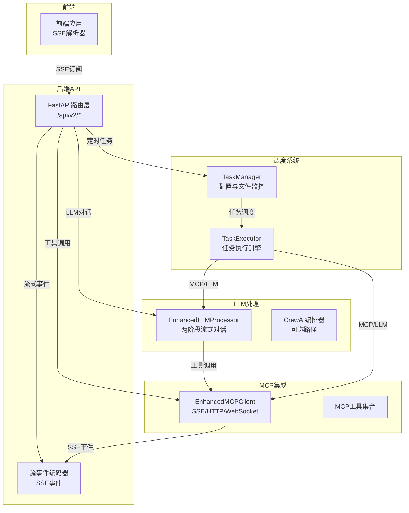
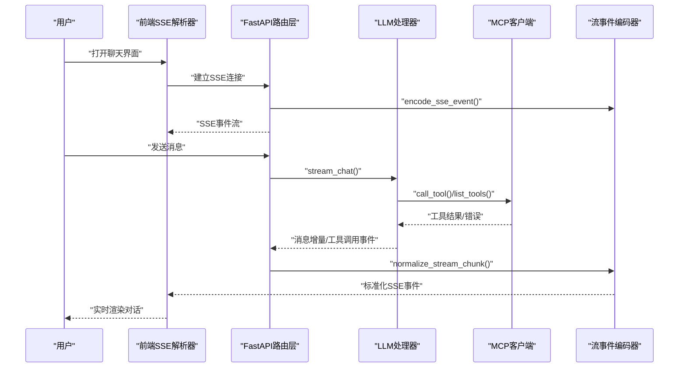
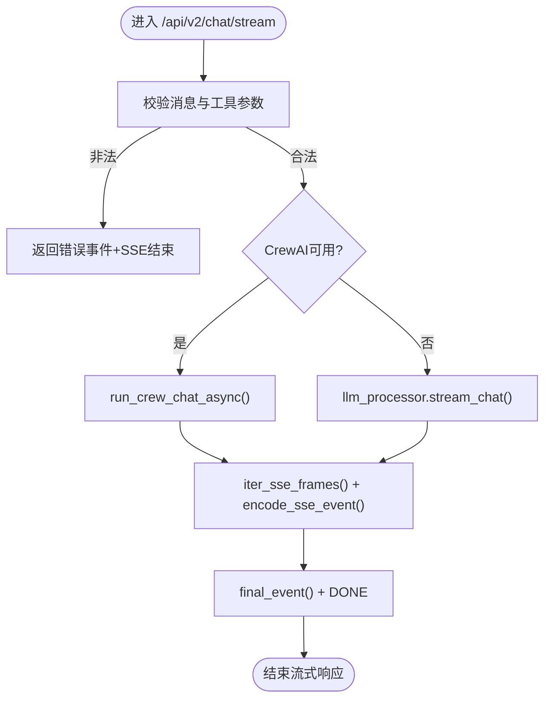
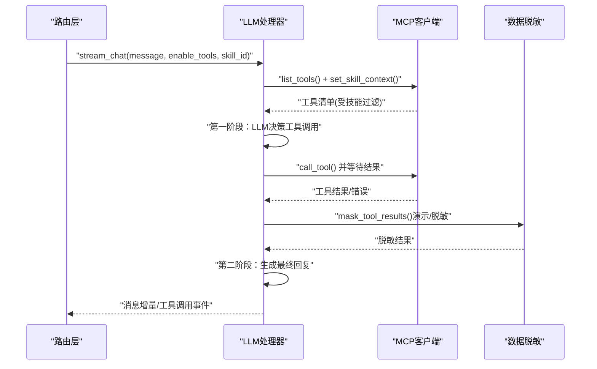
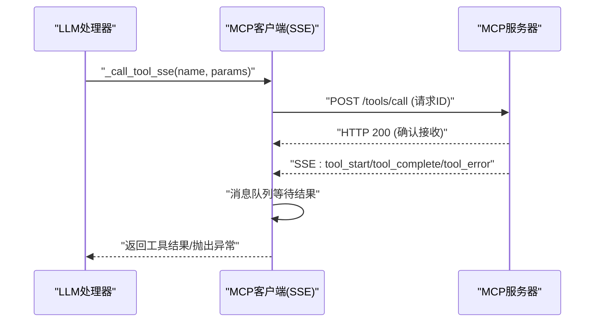
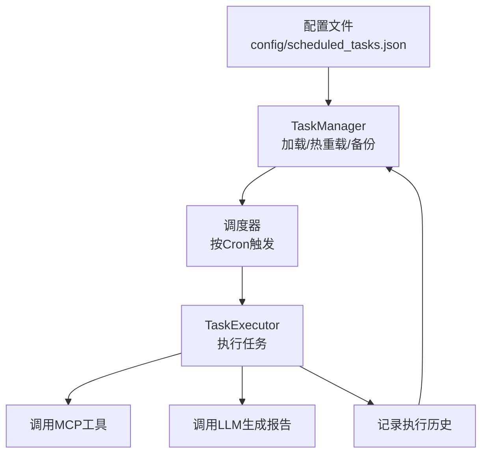
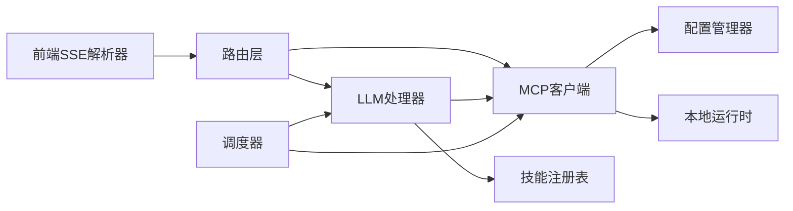

# 数据流与处理流程

<cite>
**本文档引用的文件**
- [backend/src/api/v2/router.py](file://backend/src/api/v2/router.py)
- [backend/src/api/v2/stream_events.py](file://backend/src/api/v2/stream_events.py)
- [backend/src/llm/processor.py](file://backend/src/llm/processor.py)
- [backend/src/llm/crew_orchestrator.py](file://backend/src/llm/crew_orchestrator.py)
- [backend/src/mcp/enhanced_client.py](file://backend/src/mcp/enhanced_client.py)
- [backend/src/scheduler/task_manager.py](file://backend/src/scheduler/task_manager.py)
- [backend/src/scheduler/task_executor.py](file://backend/src/scheduler/task_executor.py)
- [frontend-v2/src/shared/stream/chatStream.js](file://frontend-v2/src/shared/stream/chatStream.js)
</cite>

## 目录
1. [简介](#简介)
2. [项目结构](#项目结构)
3. [核心组件](#核心组件)
4. [架构总览](#架构总览)
5. [详细组件分析](#详细组件分析)
6. [依赖关系分析](#依赖关系分析)
7. [性能考虑](#性能考虑)
8. [故障排查指南](#故障排查指南)
9. [结论](#结论)

## 简介
本文件面向“钉钉K8s运维机器人”的数据流与处理流程，覆盖从用户输入到最终输出的完整链路，包括请求接收、LLM处理、工具调用、结果聚合、流式响应（SSE）、定时任务执行、错误处理与异常恢复等。文档同时解释了SSE与WebSocket的使用场景差异，并提供了关键路径上的数据转换与状态变化图示。

## 项目结构
后端采用FastAPI路由层，结合LLM处理器、MCP客户端与调度器模块，形成“API网关—LLM—MCP—工具—结果聚合—前端流式渲染”的闭环。前端通过SSE解析器消费后端流式事件，完成实时对话体验。

图表来源
- [backend/src/api/v2/router.py:158-344](file://backend/src/api/v2/router.py#L158-L344)
- [backend/src/api/v2/stream_events.py:13-87](file://backend/src/api/v2/stream_events.py#L13-L87)
- [backend/src/llm/processor.py:536-757](file://backend/src/llm/processor.py#L536-L757)
- [backend/src/llm/crew_orchestrator.py:31-124](file://backend/src/llm/crew_orchestrator.py#L31-L124)
- [backend/src/mcp/enhanced_client.py:652-800](file://backend/src/mcp/enhanced_client.py#L652-L800)
- [backend/src/scheduler/task_manager.py:133-242](file://backend/src/scheduler/task_manager.py#L133-L242)
- [backend/src/scheduler/task_executor.py:47-99](file://backend/src/scheduler/task_executor.py#L47-L99)

章节来源
- [backend/src/api/v2/router.py:1-120](file://backend/src/api/v2/router.py#L1-L120)

## 核心组件
- FastAPI路由层：提供聊天接口、工具列表、配置管理、健康检查、定时任务管理等端点，负责请求校验、权限控制与流式响应封装。
- 流事件编码器：将内部事件标准化为SSE帧，统一前端解析。
- LLM处理器：两阶段流式对话（工具决策→工具执行→LLM回复），支持技能过滤、结果提炼与上下文优化。
- MCP客户端：多协议（SSE/HTTP/WebSocket）连接与工具调用，支持自动工具发现与配置同步。
- 调度器：任务配置文件监控、任务创建/更新/删除、执行历史与统计、手动执行与状态查询。
- 前端SSE解析器：将SSE数据行解析为统一事件结构，支持工具调用与消息增量事件。

章节来源
- [backend/src/api/v2/router.py:158-344](file://backend/src/api/v2/router.py#L158-L344)
- [backend/src/api/v2/stream_events.py:60-160](file://backend/src/api/v2/stream_events.py#L60-L160)
- [backend/src/llm/processor.py:536-757](file://backend/src/llm/processor.py#L536-L757)
- [backend/src/mcp/enhanced_client.py:652-800](file://backend/src/mcp/enhanced_client.py#L652-L800)
- [backend/src/scheduler/task_manager.py:133-242](file://backend/src/scheduler/task_manager.py#L133-L242)
- [frontend-v2/src/shared/stream/chatStream.js:35-85](file://frontend-v2/src/shared/stream/chatStream.js#L35-L85)

## 架构总览
系统采用“事件驱动 + 流式传输”的设计。用户通过前端发起SSE订阅，后端在路由层生成流式事件，LLM处理器与MCP客户端协作完成工具调用与结果聚合，前端逐帧解析并渲染。

图表来源
- [backend/src/api/v2/router.py:175-344](file://backend/src/api/v2/router.py#L175-L344)
- [backend/src/api/v2/stream_events.py:60-160](file://backend/src/api/v2/stream_events.py#L60-L160)
- [backend/src/llm/processor.py:536-757](file://backend/src/llm/processor.py#L536-L757)
- [backend/src/mcp/enhanced_client.py:652-800](file://backend/src/mcp/enhanced_client.py#L652-L800)
- [frontend-v2/src/shared/stream/chatStream.js:35-85](file://frontend-v2/src/shared/stream/chatStream.js#L35-L85)

## 详细组件分析

### 路由层与流式响应
- 路由层提供/stream端点，支持SSE流式输出，包含错误事件、最终事件与DONE标记。
- 流式生成器会根据CrewAI可用性选择两条路径：优先使用CrewAI，失败则回退至传统LLM流式对话。
- 工具调用验证：当请求携带工具名时，会校验MCP工具列表，避免非法调用。

图表来源
- [backend/src/api/v2/router.py:175-344](file://backend/src/api/v2/router.py#L175-L344)
- [backend/src/api/v2/stream_events.py:84-160](file://backend/src/api/v2/stream_events.py#L84-L160)
- [backend/src/llm/crew_orchestrator.py:31-124](file://backend/src/llm/crew_orchestrator.py#L31-L124)

章节来源
- [backend/src/api/v2/router.py:175-344](file://backend/src/api/v2/router.py#L175-L344)
- [backend/src/api/v2/stream_events.py:13-87](file://backend/src/api/v2/stream_events.py#L13-L87)

### LLM处理器与两阶段流式对话
- 第一阶段：LLM决策是否调用工具，生成工具调用事件；同时维护对话历史与上下文优化。
- 第二阶段：工具执行完成后，将结果提炼并压缩，再交给LLM生成最终回复；若无有效结果，提供回退机制。
- 技能过滤：通过技能注册表限制暴露给模型的工具集合，保障安全与可控。

图表来源
- [backend/src/llm/processor.py:536-757](file://backend/src/llm/processor.py#L536-L757)
- [backend/src/mcp/enhanced_client.py:652-800](file://backend/src/mcp/enhanced_client.py#L652-L800)

章节来源
- [backend/src/llm/processor.py:536-757](file://backend/src/llm/processor.py#L536-L757)

### MCP客户端与SSE工具调用
- 支持SSE、HTTP、WebSocket等多种协议；SSE用于长连接事件流，适合工具执行结果的异步推送。
- SSE工具调用流程：HTTP POST提交调用请求，随后通过SSE事件队列等待结果；支持活跃调用跟踪与超时控制。
- 自动工具发现与配置同步：首次连接后自动拉取工具清单并写入配置文件，便于前端与管理端使用。

图表来源
- [backend/src/mcp/enhanced_client.py:652-800](file://backend/src/mcp/enhanced_client.py#L652-L800)

章节来源
- [backend/src/mcp/enhanced_client.py:652-800](file://backend/src/mcp/enhanced_client.py#L652-L800)

### 定时任务执行流程
- 配置管理：基于文件存储与热重载，支持备份、清理与变更通知；任务类型包括集群巡检、资源分析、健康监控、自定义任务。
- 执行引擎：按任务类型调用MCP工具与LLM，生成报告并记录执行历史；提供统计指标与重置能力。
- 调度器状态：提供运行中任务查询、统计信息与维护操作。

图表来源
- [backend/src/scheduler/task_manager.py:133-242](file://backend/src/scheduler/task_manager.py#L133-L242)
- [backend/src/scheduler/task_executor.py:47-99](file://backend/src/scheduler/task_executor.py#L47-L99)

章节来源
- [backend/src/scheduler/task_manager.py:133-242](file://backend/src/scheduler/task_manager.py#L133-L242)
- [backend/src/scheduler/task_executor.py:47-99](file://backend/src/scheduler/task_executor.py#L47-L99)

### 前端SSE解析与事件标准化
- 将SSE数据行解析为统一事件结构，支持工具调用开始/结果/错误、消息增量、最终事件与DONE标记。
- 兼容旧版内容更新标记，保证前后端兼容性。

章节来源
- [frontend-v2/src/shared/stream/chatStream.js:35-85](file://frontend-v2/src/shared/stream/chatStream.js#L35-L85)

## 依赖关系分析
- 路由层依赖LLM处理器与MCP客户端，用于流式对话与工具调用。
- LLM处理器依赖MCP客户端与技能注册表，实现工具过滤与结果提炼。
- MCP客户端依赖配置管理器与本地运行时，实现自动工具发现与配置同步。
- 调度器依赖MCP客户端与LLM处理器，实现任务自动化执行与报告生成。
- 前端依赖SSE解析器，实现流式事件的实时渲染。

图表来源
- [backend/src/api/v2/router.py:158-344](file://backend/src/api/v2/router.py#L158-L344)
- [backend/src/llm/processor.py:536-757](file://backend/src/llm/processor.py#L536-L757)
- [backend/src/mcp/enhanced_client.py:652-800](file://backend/src/mcp/enhanced_client.py#L652-L800)
- [backend/src/scheduler/task_manager.py:133-242](file://backend/src/scheduler/task_manager.py#L133-L242)
- [backend/src/scheduler/task_executor.py:47-99](file://backend/src/scheduler/task_executor.py#L47-L99)
- [frontend-v2/src/shared/stream/chatStream.js:35-85](file://frontend-v2/src/shared/stream/chatStream.js#L35-L85)

## 性能考虑
- 流式传输：SSE避免一次性响应，降低前端渲染压力；后端通过事件编码器分片输出，提升交互流畅度。
- 上下文优化：LLM处理器对历史消息与工具结果进行令牌估算与裁剪，避免超出上下文限制。
- 工具结果提炼：对过大结果进行关键信息抽取与分页建议，减少LLM负载。
- 超时与重试：MCP客户端对SSE连接与工具调用设置超时与指数退避重试，提高稳定性。
- 文件监控：任务配置文件监控采用防抖与异步重载，避免频繁I/O与配置抖动。

## 故障排查指南
- SSE连接失败：检查MCP服务器地址、端口与认证头；关注SSE连接超时与网络错误日志。
- 工具调用超时：调整工具超时阈值或优化工具执行逻辑；查看活跃工具调用跟踪。
- LLM不可用：确认LLM配置（供应商、模型、API Key、超时）；在演示模式下观察脱敏与回退行为。
- 定时任务异常：查看任务执行历史与统计；核对任务类型配置与Cron表达式；检查MCP/LLM可用性。
- 前端解析异常：确认SSE事件格式与DONE标记；检查旧版兼容事件的解析逻辑。

章节来源
- [backend/src/mcp/enhanced_client.py:165-244](file://backend/src/mcp/enhanced_client.py#L165-L244)
- [backend/src/llm/processor.py:536-757](file://backend/src/llm/processor.py#L536-L757)
- [backend/src/scheduler/task_manager.py:133-242](file://backend/src/scheduler/task_manager.py#L133-L242)
- [backend/src/api/v2/stream_events.py:13-87](file://backend/src/api/v2/stream_events.py#L13-L87)

## 结论
本系统通过“SSE流式传输 + LLM两阶段对话 + MCP工具链 + 调度器”的架构，实现了从用户输入到运维动作与报告生成的完整闭环。路由层负责统一接入与流式封装，LLM处理器与MCP客户端协同完成智能决策与工具执行，前端SSE解析器提供实时渲染体验。调度器确保定时任务的稳定执行与可观测性。整体设计兼顾性能、安全与可扩展性，适合在复杂K8s运维场景中落地。