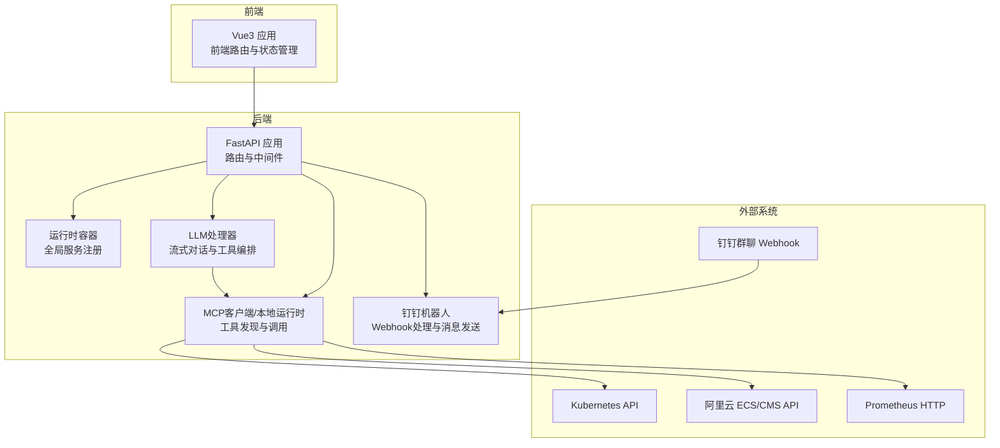
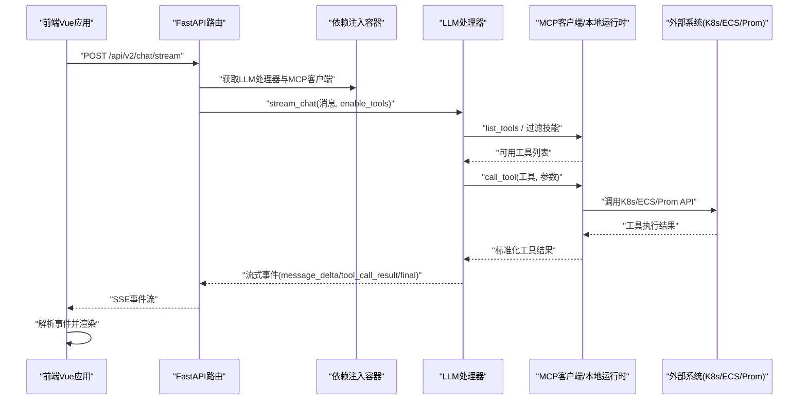
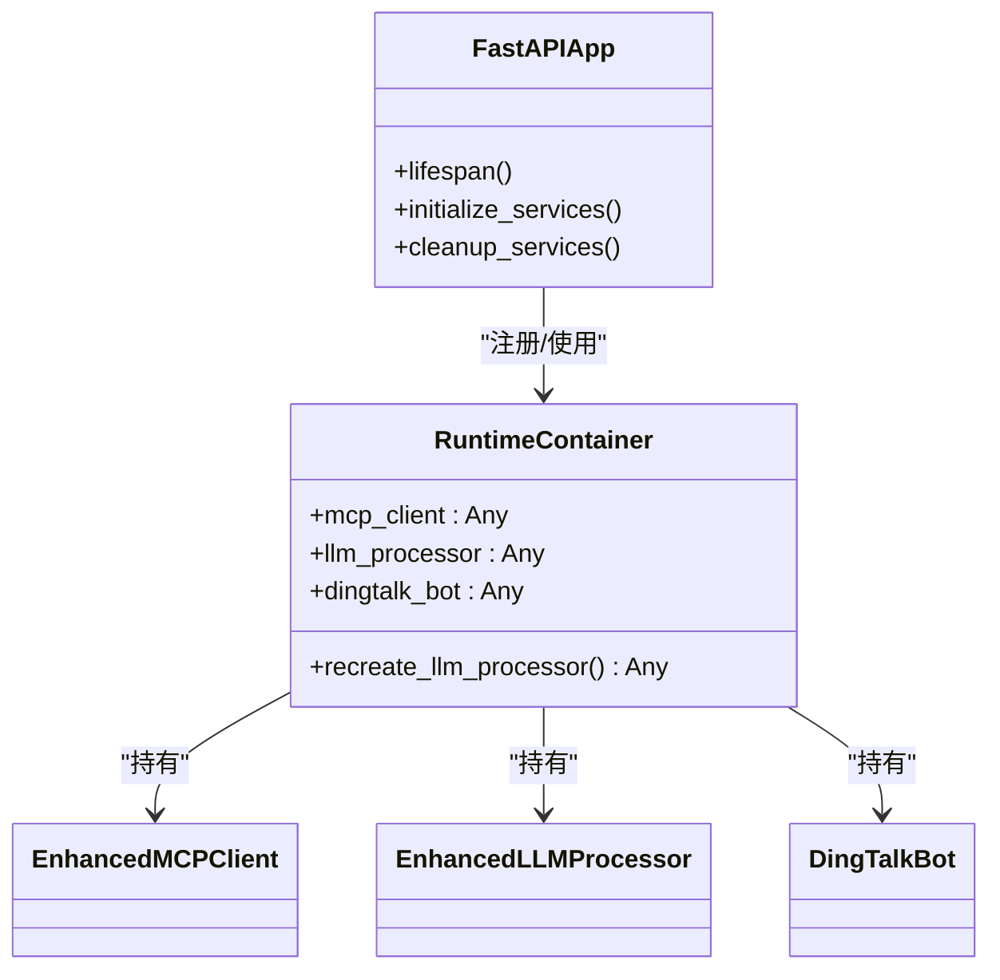
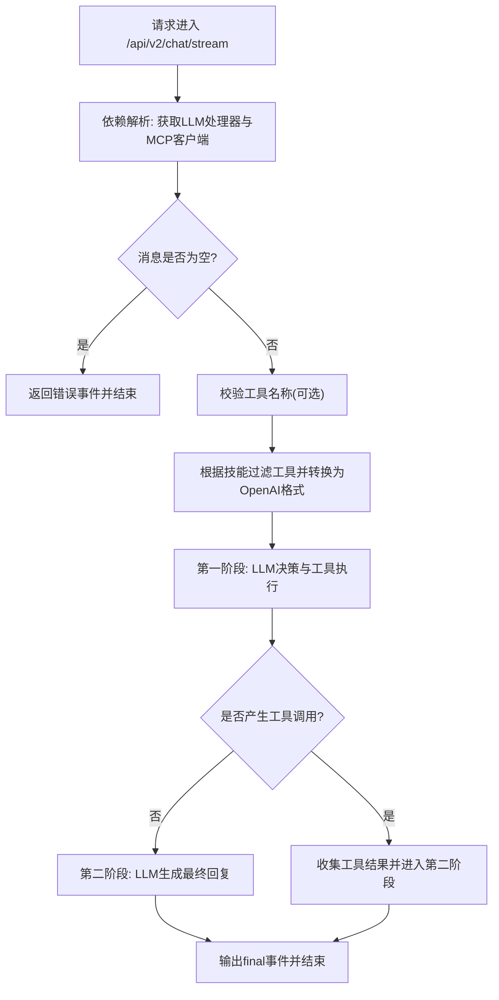
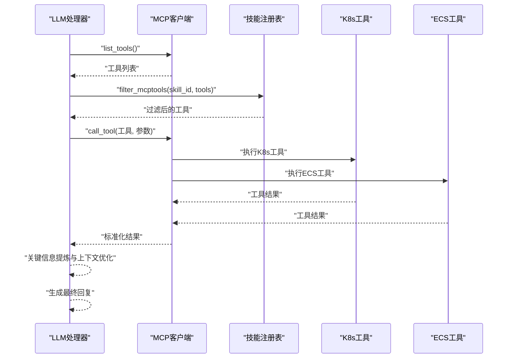
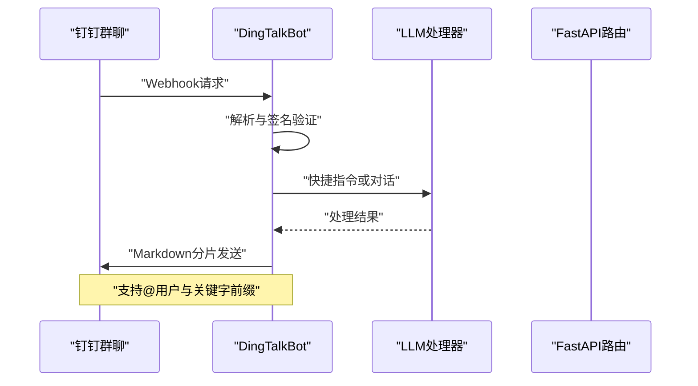
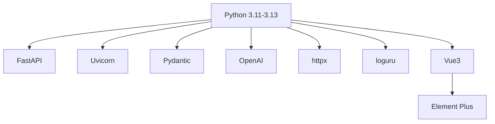

# 整体架构设计

<cite>
**本文引用的文件**
- [main.py](file://backend/main.py)
- [container.py](file://backend/src/app/container.py)
- [router.py](file://backend/src/api/v2/router.py)
- [dependencies.py](file://backend/src/api/v2/dependencies.py)
- [stream_events.py](file://backend/src/api/v2/stream_events.py)
- [processor.py](file://backend/src/llm/processor.py)
- [runtime.py](file://backend/src/mcp/runtime.py)
- [bot.py](file://backend/src/dingtalk/bot.py)
- [pyproject.toml](file://pyproject.toml)
- [architecture.excalidraw](file://project_document/architecture-diagrams/architecture.excalidraw)
- [02-architecture-and-data-flow.md](file://project_document/wiki/k8s-ecs-mcp/02-architecture-and-data-flow.md)
- [chat-stream-contract.md](file://project_document/chat-stream-contract.md)
- [main.js](file://frontend-v2/src/main.js)
</cite>

## 目录
1. [简介](#简介)
2. [项目结构](#项目结构)
3. [核心组件](#核心组件)
4. [架构总览](#架构总览)
5. [详细组件分析](#详细组件分析)
6. [依赖关系分析](#依赖关系分析)
7. [性能考虑](#性能考虑)
8. [故障排查指南](#故障排查指南)
9. [结论](#结论)
10. [附录](#附录)

## 简介
本项目为“钉钉K8s运维机器人”，通过FastAPI提供统一后端服务，结合LLM处理器与MCP工具系统，实现面向Kubernetes与ECS的智能运维对话与自动化操作。系统采用分层架构与事件驱动设计，支持流式响应与实时通信，并通过依赖注入容器集中管理全局服务，确保高内聚、低耦合与可扩展性。

## 项目结构
项目采用“后端服务 + 前端应用 + 文档与配置”的组织方式：
- 后端服务位于 backend/，包含FastAPI主程序、API路由、LLM与MCP处理、钉钉机器人集成、调度与安全模块等。
- 前端应用位于 frontend-v2/，基于Vue3 + Element Plus，提供流式聊天界面与运维工作台。
- 文档与配置位于 project_document/ 与 config/，包含架构图、聊天流协议、示例配置等。

图表来源
- [main.py:302-494](file://backend/main.py#L302-L494)
- [container.py:15-54](file://backend/src/app/container.py#L15-L54)
- [router.py:45-550](file://backend/src/api/v2/router.py#L45-L550)
- [processor.py:30-120](file://backend/src/llm/processor.py#L30-L120)
- [runtime.py:31-119](file://backend/src/mcp/runtime.py#L31-L119)
- [bot.py:51-120](file://backend/src/dingtalk/bot.py#L51-L120)

章节来源
- [main.py:1-494](file://backend/main.py#L1-L494)
- [pyproject.toml:1-116](file://pyproject.toml#L1-L116)

## 核心组件
- FastAPI后端服务：统一入口，提供REST API、CORS、静态资源挂载、健康检查、异常处理与审计中间件。
- 运行时容器（RuntimeContainer）：集中持有全局服务实例（MCP客户端、LLM处理器、钉钉机器人），支持热重载LLM处理器。
- LLM处理器：封装LLM客户端，支持流式对话、工具调用、结果提炼与上下文优化。
- MCP客户端/本地运行时：统一工具发现与调用，支持内置K8s/ECS工具与远程MCP服务器。
- 钉钉机器人：接收Webhook消息，路由到LLM或快捷指令，支持签名验证与Markdown分片发送。
- 前端Vue应用：提供流式聊天界面、会话历史、工具调用状态展示与主题配置。

章节来源
- [container.py:15-54](file://backend/src/app/container.py#L15-L54)
- [processor.py:30-120](file://backend/src/llm/processor.py#L30-L120)
- [runtime.py:31-119](file://backend/src/mcp/runtime.py#L31-L119)
- [bot.py:51-120](file://backend/src/dingtalk/bot.py#L51-L120)
- [main.js:1-52](file://frontend-v2/src/main.js#L1-L52)

## 架构总览
系统采用三层分层与事件驱动相结合的架构：
- 表现层：前端Vue应用，负责用户交互与流式渲染。
- 业务逻辑层：FastAPI路由与依赖注入，负责请求解析、权限控制、工具过滤与流式事件编码。
- 服务层：LLM处理器与MCP运行时，负责对话编排、工具执行与结果聚合。

事件驱动体现在：
- 流式对话：后端以SSE事件逐步推送message_delta、tool_call_*、final等事件，前端按事件流解析并渲染。
- 实时通信：钉钉Webhook即时触发，机器人异步处理并回传Markdown消息。
- 工具执行：MCP工具调用过程以事件形式反馈进度与结果，便于前端可视化。

图表来源
- [router.py:175-345](file://backend/src/api/v2/router.py#L175-L345)
- [dependencies.py:10-36](file://backend/src/api/v2/dependencies.py#L10-L36)
- [stream_events.py:13-87](file://backend/src/api/v2/stream_events.py#L13-L87)
- [processor.py:536-757](file://backend/src/llm/processor.py#L536-L757)
- [runtime.py:88-99](file://backend/src/mcp/runtime.py#L88-L99)

章节来源
- [router.py:158-345](file://backend/src/api/v2/router.py#L158-L345)
- [chat-stream-contract.md:1-121](file://project_document/chat-stream-contract.md#L1-L121)

## 详细组件分析

### 依赖注入与全局服务管理（RuntimeContainer）
- 设计理念：通过RuntimeContainer集中持有全局服务实例，避免全局变量污染，同时提供热重载能力（如LLM处理器重建）。
- 生命周期：在FastAPI应用启动时初始化，通过lifespan钩子完成服务连接与后台任务启动；在关闭时清理资源。
- 服务注册：MCP客户端、LLM处理器、钉钉机器人均注册到容器，供路由依赖注入使用。

图表来源
- [container.py:15-54](file://backend/src/app/container.py#L15-L54)
- [main.py:137-299](file://backend/main.py#L137-L299)

章节来源
- [container.py:15-54](file://backend/src/app/container.py#L15-L54)
- [main.py:137-299](file://backend/main.py#L137-L299)

### FastAPI路由与依赖注入（API v2）
- 路由组织：API v2统一前缀“/api/v2”，按功能拆分为ops、auth、users、audit、mcp、resources、scheduler等子路由。
- 依赖注入：通过dependencies.py提供get_runtime_container/get_mcp_client/get_llm_processor等依赖解析器，确保路由层只依赖抽象接口。
- 流式对话：/api/v2/chat/stream支持SSE流式输出，事件类型包括message_delta、tool_call_start、tool_call_result、error、final等。
- 健康检查：/api/v2/health与/health提供组件状态检查，包含MCP工具数量、LLM可用性与钉钉配置状态。

图表来源
- [router.py:175-345](file://backend/src/api/v2/router.py#L175-L345)
- [stream_events.py:60-146](file://backend/src/api/v2/stream_events.py#L60-L146)
- [processor.py:536-757](file://backend/src/llm/processor.py#L536-L757)

章节来源
- [router.py:45-550](file://backend/src/api/v2/router.py#L45-L550)
- [dependencies.py:10-36](file://backend/src/api/v2/dependencies.py#L10-L36)
- [stream_events.py:13-160](file://backend/src/api/v2/stream_events.py#L13-L160)

### LLM处理器与工具编排
- 流式对话：支持两阶段处理：第一阶段由LLM判断是否需要工具调用并执行；第二阶段基于工具结果生成最终回复。
- 工具过滤：结合技能（Skill）对可用工具进行白名单过滤，确保安全可控。
- 结果提炼：对过大工具结果进行关键信息提炼与分页建议，避免上下文溢出。
- 上下文优化：估算token并裁剪历史消息，保留系统消息与最近对话循环。

图表来源
- [processor.py:536-757](file://backend/src/llm/processor.py#L536-L757)
- [runtime.py:88-99](file://backend/src/mcp/runtime.py#L88-L99)
- [02-architecture-and-data-flow.md:43-51](file://project_document/wiki/k8s-ecs-mcp/02-architecture-and-data-flow.md#L43-L51)

章节来源
- [processor.py:30-120](file://backend/src/llm/processor.py#L30-L120)
- [processor.py:536-757](file://backend/src/llm/processor.py#L536-L757)
- [runtime.py:31-119](file://backend/src/mcp/runtime.py#L31-L119)

### 钉钉机器人集成
- Webhook接收：解析钉钉Webhook请求，支持签名验证与@用户信息。
- 消息路由：区分快捷指令与普通消息，快捷指令走LLM快捷命令流程，普通消息走LLM对话。
- Markdown分片：自动检测Markdown并进行分片发送，避免超限；支持关键字前缀与签名验证。
- 主动消息：支持主动推送告警或巡检结果，具备错误码提示与重试策略。

图表来源
- [bot.py:64-120](file://backend/src/dingtalk/bot.py#L64-L120)
- [bot.py:223-331](file://backend/src/dingtalk/bot.py#L223-L331)
- [bot.py:412-473](file://backend/src/dingtalk/bot.py#L412-L473)

章节来源
- [bot.py:51-120](file://backend/src/dingtalk/bot.py#L51-L120)
- [bot.py:223-331](file://backend/src/dingtalk/bot.py#L223-L331)
- [bot.py:412-473](file://backend/src/dingtalk/bot.py#L412-L473)

### 前端Vue应用
- 应用初始化：创建Vue应用、Pinia状态管理、Element Plus UI库与路由。
- 主题与样式：支持多种主题切换与CSS变量覆盖。
- 开发信息：在开发环境下输出启动日志与API基地址提示。

章节来源
- [main.js:1-52](file://frontend-v2/src/main.js#L1-L52)

## 依赖关系分析
- 框架与库：后端使用FastAPI + Uvicorn + Pydantic + OpenAI + httpx + loguru等；前端使用Vue3 + Element Plus。
- 版本约束：Python版本限制在3.11~3.13，crewai等上游依赖要求Python <3.14。
- MCP与LLM：MCP工具通过本地运行时与远程服务器统一管理；LLM支持OpenAI/Ollama等提供商。

图表来源
- [pyproject.toml:9-51](file://pyproject.toml#L9-L51)

章节来源
- [pyproject.toml:1-116](file://pyproject.toml#L1-L116)

## 性能考虑
- 流式响应：SSE事件逐步输出，前端按事件流解析，降低首屏延迟与内存占用。
- 上下文优化：估算token并裁剪历史消息，避免LLM上下文溢出与超时。
- 工具结果提炼：对过大结果进行关键信息提炼与分页建议，减少LLM负载。
- 超时与重试：LLM客户端与HTTP请求设置合理超时与重试策略，提升稳定性。
- 并发与异步：使用async/await与异步HTTP客户端，提高I/O密集型场景吞吐。

## 故障排查指南
- 健康检查：通过/health与/api/v2/health检查MCP连接、LLM可用性与钉钉配置状态。
- 异常处理：统一错误响应封装，SSE流中输出error事件，前端据此展示可恢复/不可恢复错误与建议。
- 审计日志：HTTP中间件记录请求ID、用户、资源与耗时，便于追踪问题。
- MCP工具：若工具列表为空，检查MCP配置与连接状态；必要时强制刷新工具列表。
- LLM配置：若LLM不可用，检查环境变量与API密钥；可通过容器重建LLM处理器。

章节来源
- [main.py:465-474](file://backend/main.py#L465-L474)
- [router.py:116-157](file://backend/src/api/v2/router.py#L116-L157)
- [router.py:376-423](file://backend/src/api/v2/router.py#L376-L423)
- [stream_events.py:41-58](file://backend/src/api/v2/stream_events.py#L41-L58)

## 结论
本项目通过清晰的分层架构与事件驱动设计，实现了从前端到后端再到外部系统的高效协作。FastAPI提供了高性能与易用性，RuntimeContainer保障了全局服务的可管理性，LLM与MCP的结合提升了运维智能化水平。系统在保证安全性与可观测性的前提下，兼顾了扩展性与可维护性。

## 附录
- 系统上下文图（来自架构图文档）
- 聊天流协议（SSE事件契约）

章节来源
- [architecture.excalidraw:1-1102](file://project_document/architecture-diagrams/architecture.excalidraw#L1-L1102)
- [chat-stream-contract.md:1-121](file://project_document/chat-stream-contract.md#L1-L121)