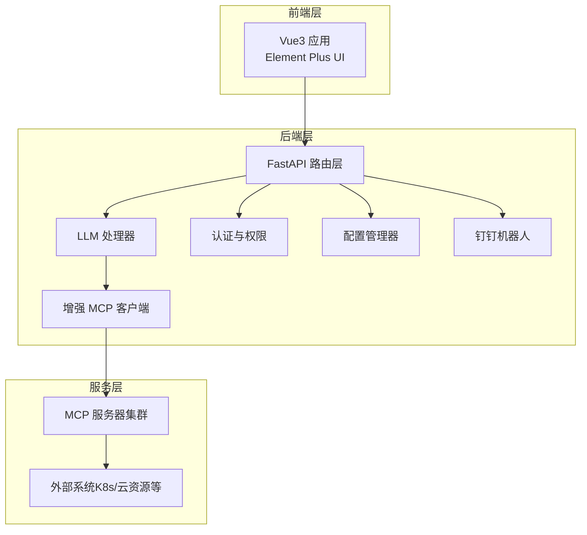
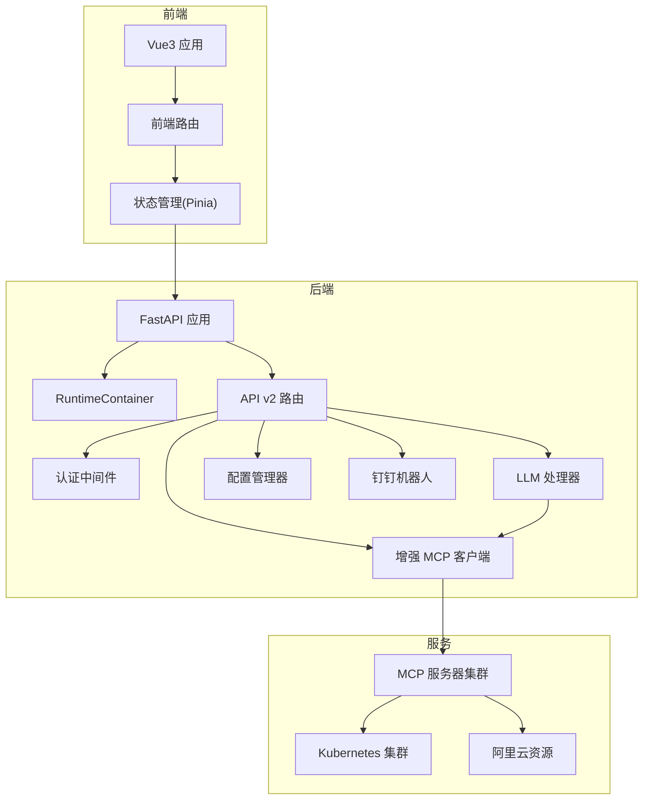
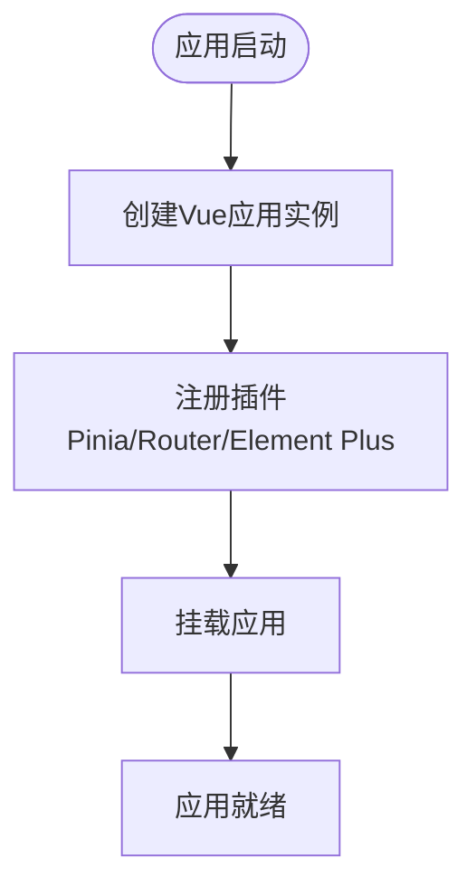
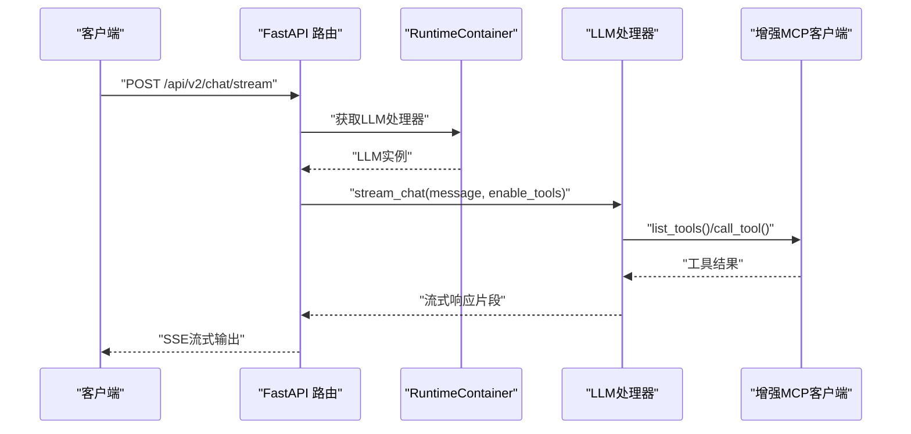
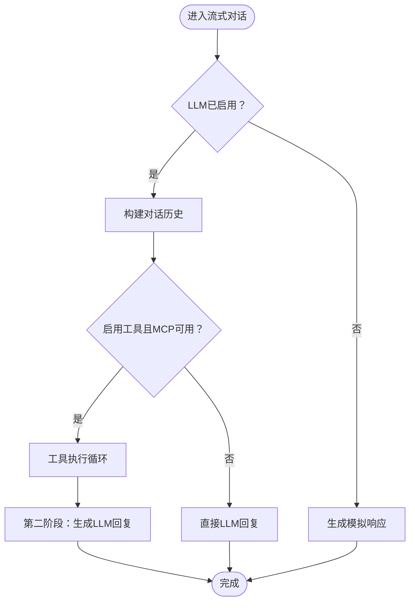
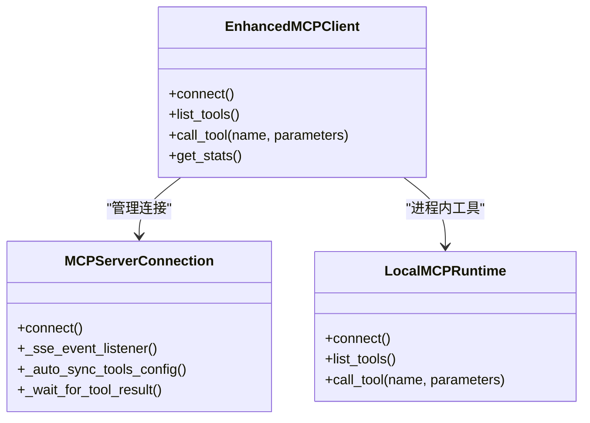
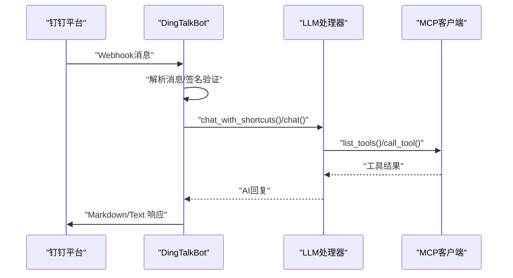
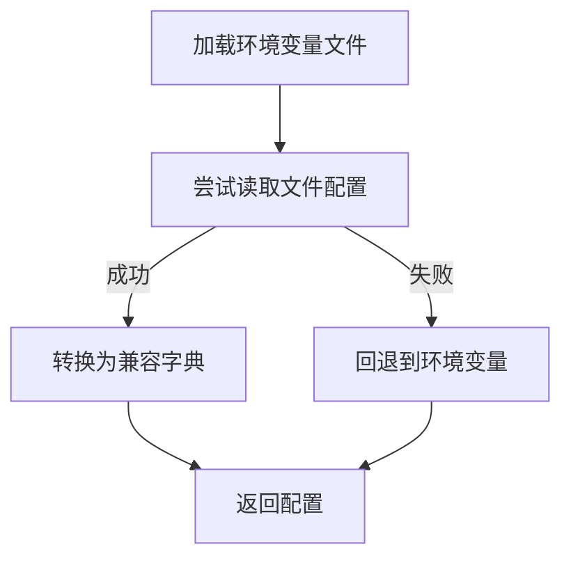
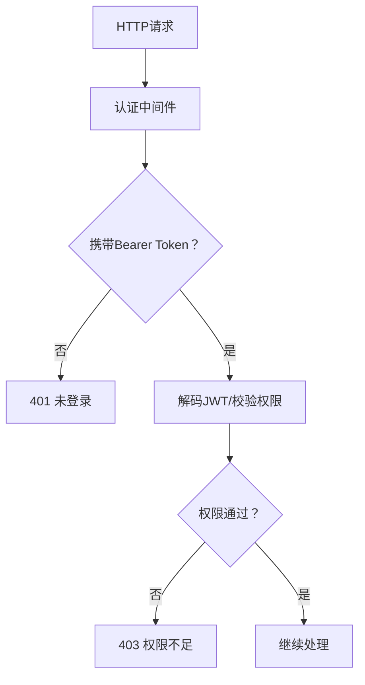
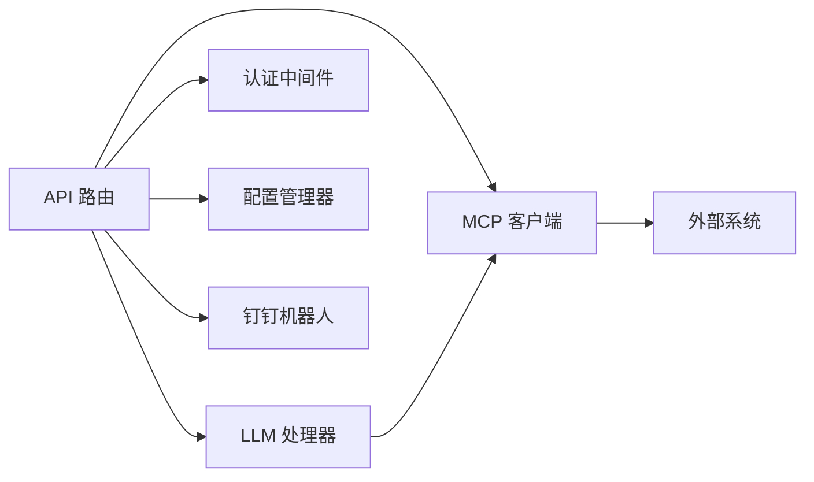

# 系统架构

<cite>
**本文引用的文件**
- [backend/main.py](file://backend/main.py)
- [backend/src/app/container.py](file://backend/src/app/container.py)
- [backend/src/api/v2/router.py](file://backend/src/api/v2/router.py)
- [backend/src/llm/processor.py](file://backend/src/llm/processor.py)
- [backend/src/mcp/enhanced_client.py](file://backend/src/mcp/enhanced_client.py)
- [backend/src/mcp/runtime.py](file://backend/src/mcp/runtime.py)
- [backend/src/dingtalk/bot.py](file://backend/src/dingtalk/bot.py)
- [backend/src/security/auth.py](file://backend/src/security/auth.py)
- [backend/src/config/manager.py](file://backend/src/config/manager.py)
- [frontend-v2/src/main.js](file://frontend-v2/src/main.js)
- [frontend-v2/package.json](file://frontend-v2/package.json)
- [project_document/技术架构与配置指南.md](file://project_document/技术架构与配置指南.md)
- [project_document/architecture-diagrams/architecture.excalidraw](file://project_document/architecture-diagrams/architecture.excalidraw)
</cite>

## 目录
1. [简介](#简介)
2. [项目结构](#项目结构)
3. [核心组件](#核心组件)
4. [架构总览](#架构总览)
5. [详细组件分析](#详细组件分析)
6. [依赖关系分析](#依赖关系分析)
7. [性能考量](#性能考量)
8. [故障排查指南](#故障排查指南)
9. [结论](#结论)
10. [附录](#附录)

## 简介
本系统是一套“钉钉K8s运维机器人”，融合了前端Vue.js应用、后端FastAPI服务、MCP工具系统、LLM处理器以及钉钉机器人集成。系统采用分层架构、事件驱动与依赖注入相结合的设计，围绕“用户输入—工具执行—结果返回”的完整链路，提供流式对话、工具路由、权限控制、配置管理与安全脱敏等能力。本文档旨在帮助开发者快速理解系统组织结构、交互关系与技术决策，并给出可视化架构图与流程图以便落地实施。

## 项目结构
- 后端（Python/FastAPI）：集中于 backend/ 目录，包含API路由、LLM处理器、MCP客户端、安全与配置管理、钉钉机器人集成等模块。
- 前端（Vue3 + Element Plus）：集中于 frontend-v2/ 目录，提供流式聊天界面、会话历史、工具调用状态展示等。
- 文档与架构图：project_document/ 下包含技术架构与配置指南、架构图等资料。
- 归档模块：archived/ 下包含历史独立的 ECS/K8s MCP 服务，便于理解演进与兼容性。

图表来源
- [backend/src/api/v2/router.py:1-120](file://backend/src/api/v2/router.py#L1-L120)
- [backend/src/llm/processor.py:1-120](file://backend/src/llm/processor.py#L1-L120)
- [backend/src/mcp/enhanced_client.py:1-120](file://backend/src/mcp/enhanced_client.py#L1-L120)
- [backend/src/dingtalk/bot.py:1-120](file://backend/src/dingtalk/bot.py#L1-L120)

章节来源
- [backend/src/api/v2/router.py:1-120](file://backend/src/api/v2/router.py#L1-L120)
- [frontend-v2/src/main.js:1-52](file://frontend-v2/src/main.js#L1-L52)
- [project_document/技术架构与配置指南.md:8-38](file://project_document/技术架构与配置指南.md#L8-L38)

## 核心组件
- 前端Vue3应用：负责用户交互、流式聊天、会话管理与工具调用状态展示。
- FastAPI后端：统一API入口，提供路由、中间件、认证授权、配置管理与健康检查。
- LLM处理器：封装LLM客户端，支持两阶段流式对话、工具调用、结果提炼与上下文优化。
- 增强MCP客户端：支持多服务器连接、工具发现、路由与调用、SSE/HTTP/STDIO传输。
- 钉钉机器人：接收Webhook消息，路由到LLM处理，构建Markdown/文本响应并发送。
- 配置管理器：统一管理环境变量与文件配置，支持热重载与迁移。
- 安全与权限：基于JWT的认证与权限控制，结合审计日志。

章节来源
- [backend/src/llm/processor.py:1-120](file://backend/src/llm/processor.py#L1-L120)
- [backend/src/mcp/enhanced_client.py:1-120](file://backend/src/mcp/enhanced_client.py#L1-L120)
- [backend/src/dingtalk/bot.py:1-120](file://backend/src/dingtalk/bot.py#L1-L120)
- [backend/src/config/manager.py:1-120](file://backend/src/config/manager.py#L1-L120)
- [backend/src/security/auth.py:1-120](file://backend/src/security/auth.py#L1-L120)

## 架构总览
系统采用分层架构与事件驱动相结合：
- 分层架构：前端层、后端层（路由/业务/安全）、服务层（MCP/外部系统）。
- 事件驱动：MCP通过SSE事件流推送工具结果；前端通过SSE订阅流式响应。
- 依赖注入：通过 RuntimeContainer 统一持有长生命周期服务实例，API依赖通过依赖注入获取。

图表来源
- [backend/main.py:1-120](file://backend/main.py#L1-L120)
- [backend/src/app/container.py:1-54](file://backend/src/app/container.py#L1-L54)
- [backend/src/api/v2/router.py:1-120](file://backend/src/api/v2/router.py#L1-L120)
- [backend/src/llm/processor.py:1-120](file://backend/src/llm/processor.py#L1-L120)
- [backend/src/mcp/enhanced_client.py:1-120](file://backend/src/mcp/enhanced_client.py#L1-L120)

章节来源
- [backend/main.py:1-120](file://backend/main.py#L1-L120)
- [backend/src/app/container.py:1-54](file://backend/src/app/container.py#L1-L54)
- [backend/src/api/v2/router.py:1-120](file://backend/src/api/v2/router.py#L1-L120)

## 详细组件分析

### 前端Vue3应用
- 技术栈：Vue3 + Element Plus + Pinia + Vue Router + Vite。
- 功能：流式聊天界面、会话历史、工具调用状态展示、主题与布局。
- 依赖：axios、marked、katex、highlight.js 等。

图表来源
- [frontend-v2/src/main.js:1-52](file://frontend-v2/src/main.js#L1-L52)
- [frontend-v2/package.json:1-41](file://frontend-v2/package.json#L1-L41)

章节来源
- [frontend-v2/src/main.js:1-52](file://frontend-v2/src/main.js#L1-L52)
- [frontend-v2/package.json:1-41](file://frontend-v2/package.json#L1-L41)

### FastAPI后端服务与依赖注入
- 应用入口：backend/main.py，定义生命周期、中间件、静态资源、根路径重定向与健康检查。
- 依赖注入：RuntimeContainer 统一持有 mcp_client、llm_processor、dingtalk_bot，API依赖通过依赖注入获取。
- 路由层：backend/src/api/v2/router.py，提供聊天、工具、配置、巡检、调度等API。

图表来源
- [backend/main.py:1-120](file://backend/main.py#L1-L120)
- [backend/src/app/container.py:1-54](file://backend/src/app/container.py#L1-L54)
- [backend/src/api/v2/router.py:158-345](file://backend/src/api/v2/router.py#L158-L345)
- [backend/src/llm/processor.py:536-757](file://backend/src/llm/processor.py#L536-L757)
- [backend/src/mcp/enhanced_client.py:587-800](file://backend/src/mcp/enhanced_client.py#L587-L800)

章节来源
- [backend/main.py:1-120](file://backend/main.py#L1-L120)
- [backend/src/app/container.py:1-54](file://backend/src/app/container.py#L1-L54)
- [backend/src/api/v2/router.py:158-345](file://backend/src/api/v2/router.py#L158-L345)

### LLM处理器与两阶段流式对话
- 功能：两阶段流式对话（工具决策与执行 + LLM回复生成），支持上下文优化、结果提炼、分页建议。
- 关键点：工具调用统计、流式输出、错误处理与回退机制。

图表来源
- [backend/src/llm/processor.py:520-757](file://backend/src/llm/processor.py#L520-L757)

章节来源
- [backend/src/llm/processor.py:520-757](file://backend/src/llm/processor.py#L520-L757)

### 增强MCP客户端与工具路由
- 功能：支持SSE/HTTP/STDIO等多种传输，自动发现工具、路由与调用，支持超时与重试。
- 关键点：SSE事件监听、工具配置自动同步、活跃工具调用跟踪。

图表来源
- [backend/src/mcp/enhanced_client.py:1-120](file://backend/src/mcp/enhanced_client.py#L1-L120)
- [backend/src/mcp/runtime.py:1-119](file://backend/src/mcp/runtime.py#L1-L119)

章节来源
- [backend/src/mcp/enhanced_client.py:1-120](file://backend/src/mcp/enhanced_client.py#L1-L120)
- [backend/src/mcp/runtime.py:1-119](file://backend/src/mcp/runtime.py#L1-L119)

### 钉钉机器人集成
- 功能：接收Webhook消息，解析@信息与快捷指令，路由到LLM处理，构建Markdown/文本响应并发送。
- 关键点：签名验证、消息分片、Markdown渲染兼容性处理。

图表来源
- [backend/src/dingtalk/bot.py:64-330](file://backend/src/dingtalk/bot.py#L64-L330)
- [backend/src/llm/processor.py:176-220](file://backend/src/llm/processor.py#L176-L220)
- [backend/src/mcp/enhanced_client.py:587-800](file://backend/src/mcp/enhanced_client.py#L587-L800)

章节来源
- [backend/src/dingtalk/bot.py:64-330](file://backend/src/dingtalk/bot.py#L64-L330)

### 配置管理与热重载
- 功能：统一管理环境变量与文件配置，支持LLM/MCP配置的热重载与迁移。
- 关键点：文件优先策略、环境变量回退、自动迁移脚本。

图表来源
- [backend/src/config/manager.py:73-174](file://backend/src/config/manager.py#L73-L174)

章节来源
- [backend/src/config/manager.py:73-174](file://backend/src/config/manager.py#L73-L174)

### 安全与权限控制
- 功能：基于JWT的认证与权限控制，支持审计日志与中间件拦截。
- 关键点：Bearer Token解析、权限校验、审计记录异步写入。

图表来源
- [backend/src/security/auth.py:151-182](file://backend/src/security/auth.py#L151-L182)

章节来源
- [backend/src/security/auth.py:151-182](file://backend/src/security/auth.py#L151-L182)

## 依赖关系分析
- 组件耦合：后端通过 RuntimeContainer 与 API 路由解耦，降低全局变量依赖；MCP客户端与LLM处理器通过接口解耦。
- 外部依赖：HTTP/WS/SSE、AIOHTTP、OpenAI SDK、钉钉Webhook。
- 循环依赖：未发现明显循环依赖；各模块职责清晰，通过依赖注入与接口边界避免耦合。

图表来源
- [backend/src/api/v2/router.py:1-120](file://backend/src/api/v2/router.py#L1-L120)
- [backend/src/llm/processor.py:1-120](file://backend/src/llm/processor.py#L1-L120)
- [backend/src/mcp/enhanced_client.py:1-120](file://backend/src/mcp/enhanced_client.py#L1-L120)
- [backend/src/dingtalk/bot.py:1-120](file://backend/src/dingtalk/bot.py#L1-L120)

章节来源
- [backend/src/api/v2/router.py:1-120](file://backend/src/api/v2/router.py#L1-L120)

## 性能考量
- 流式处理：前端SSE与后端异步生成，降低延迟与内存占用。
- 上下文优化：LLM处理器对消息历史与工具结果进行估算与裁剪，避免超限。
- 工具调用并发：MCP客户端支持并发调用与超时控制，避免阻塞。
- 缓存与热重载：配置热重载减少停机时间，缓存提升工具调用性能。
- 日志与监控：统一日志与审计，便于定位性能瓶颈。

## 故障排查指南
- 健康检查：/health 与 /api/v2/health 检查组件状态。
- MCP连接：检查SSE/HTTP连接状态、工具发现与路由配置。
- LLM配置：确认配置文件与环境变量一致性，必要时回退到环境变量。
- 钉钉签名：核对WEBHOOK_URL与SECRET配置，确保签名验证通过。
- 日志定位：查看 logs/app.log 与审计日志，结合请求ID定位问题。

章节来源
- [backend/main.py:464-474](file://backend/main.py#L464-L474)
- [backend/src/api/v2/router.py:116-157](file://backend/src/api/v2/router.py#L116-L157)
- [backend/src/dingtalk/bot.py:313-330](file://backend/src/dingtalk/bot.py#L313-L330)

## 结论
本系统通过清晰的分层架构、事件驱动与依赖注入，实现了从前端到后端再到外部系统的完整闭环。LLM与MCP的结合提供了强大的智能运维能力，配合安全与配置管理，满足生产级可用性与可维护性要求。建议在后续版本中进一步完善配置管理API与可观测性指标，以提升可运维性与用户体验。

## 附录
- 架构图与组件分解图可参考项目文档中的架构图文件。
- 技术架构与配置指南提供了更深入的配置与部署细节。

章节来源
- [project_document/architecture-diagrams/architecture.excalidraw:1-120](file://project_document/architecture-diagrams/architecture.excalidraw#L1-L120)
- [project_document/技术架构与配置指南.md:8-38](file://project_document/技术架构与配置指南.md#L8-L38)