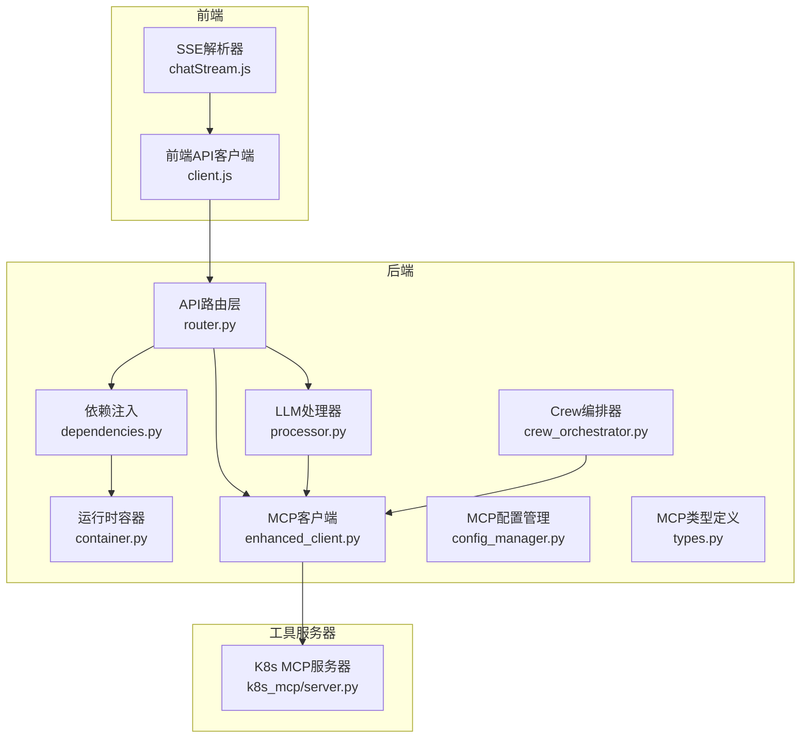
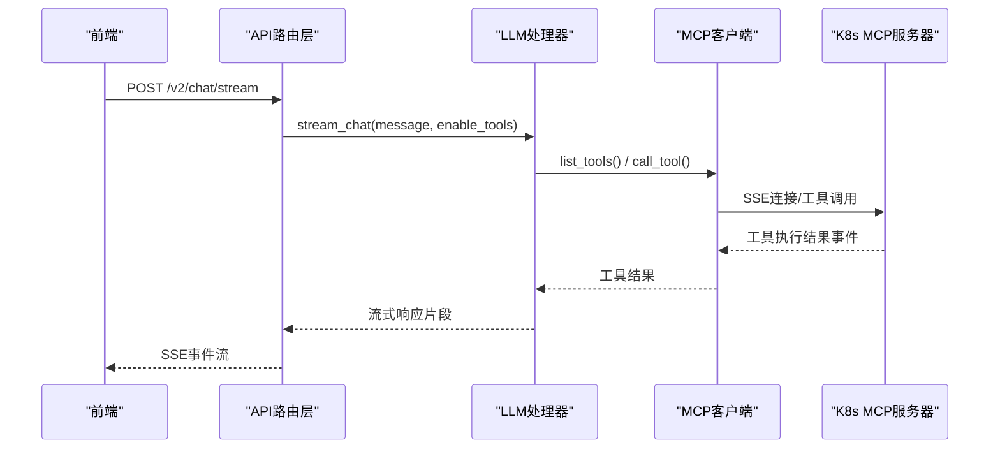
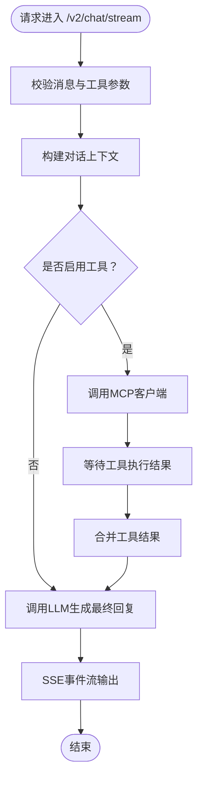
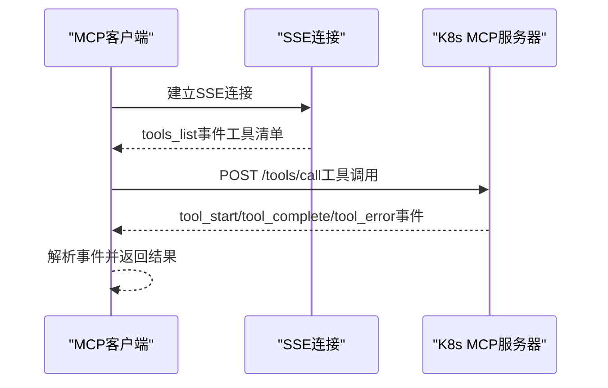
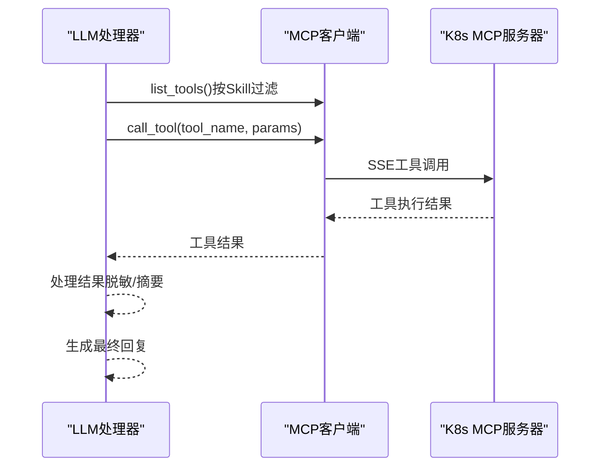
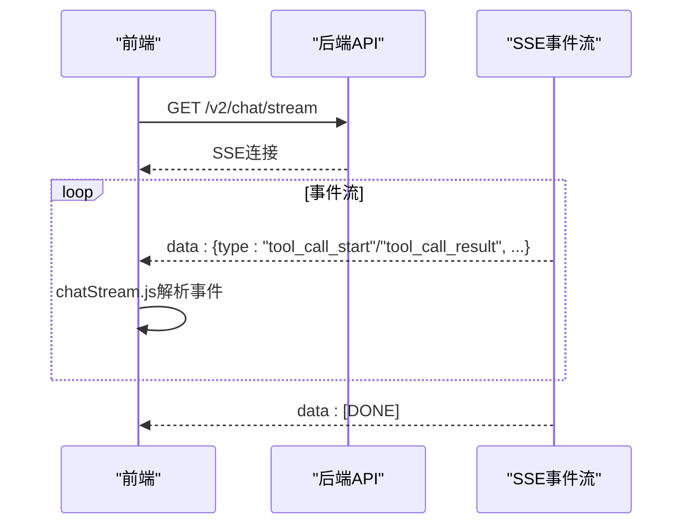
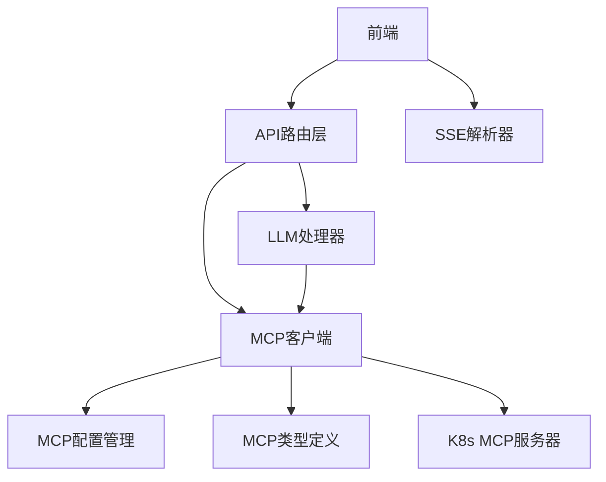

# 组件交互关系

<cite>
**本文档引用的文件**
- [backend/src/api/v2/router.py](file://backend/src/api/v2/router.py)
- [backend/src/mcp/enhanced_client.py](file://backend/src/mcp/enhanced_client.py)
- [backend/src/k8s_mcp/server.py](file://backend/src/k8s_mcp/server.py)
- [backend/src/llm/crew_orchestrator.py](file://backend/src/llm/crew_orchestrator.py)
- [backend/src/llm/processor.py](file://backend/src/llm/processor.py)
- [frontend-v2/src/shared/stream/chatStream.js](file://frontend-v2/src/shared/stream/chatStream.js)
- [backend/src/mcp/types.py](file://backend/src/mcp/types.py)
- [backend/src/mcp/config_manager.py](file://backend/src/mcp/config_manager.py)
- [backend/src/mcp/config.py](file://backend/src/mcp/config.py)
- [backend/src/api/v2/dependencies.py](file://backend/src/api/v2/dependencies.py)
- [backend/src/app/container.py](file://backend/src/app/container.py)
- [frontend-v2/src/api/client.js](file://frontend-v2/src/api/client.js)
</cite>

## 目录
1. [简介](#简介)
2. [项目结构](#项目结构)
3. [核心组件](#核心组件)
4. [架构概览](#架构概览)
5. [详细组件分析](#详细组件分析)
6. [依赖关系分析](#依赖关系分析)
7. [性能考量](#性能考量)
8. [故障排查指南](#故障排查指南)
9. [结论](#结论)

## 简介
本文件面向钉钉K8s运维机器人系统的开发者与运维人员，系统性梳理后端API路由层、MCP客户端、LLM处理器、工具服务器（K8s MCP）以及前端组件之间的交互关系。重点解释：
- API路由层如何协调LLM处理器与MCP客户端，实现流式对话与工具调用；
- MCP客户端与工具服务器（SSE）的通信机制，包括连接建立、工具发现、调用流程；
- LLM处理器与MCP客户端的协作关系，以及工具调用的完整链路；
- 前端组件与后端服务的交互方式，包括WebSocket与SSE流式传输。

## 项目结构
系统采用前后端分离架构，后端基于FastAPI提供REST API与SSE流式接口，MCP客户端负责与工具服务器通信，LLM处理器负责对话与工具调用编排，前端通过SSE与后端进行实时交互。

**图表来源**
- [backend/src/api/v2/router.py:1-1059](file://backend/src/api/v2/router.py#L1-L1059)
- [backend/src/api/v2/dependencies.py:1-36](file://backend/src/api/v2/dependencies.py#L1-L36)
- [backend/src/app/container.py:1-54](file://backend/src/app/container.py#L1-L54)
- [backend/src/llm/processor.py:1-800](file://backend/src/llm/processor.py#L1-L800)
- [backend/src/llm/crew_orchestrator.py:1-124](file://backend/src/llm/crew_orchestrator.py#L1-L124)
- [backend/src/mcp/enhanced_client.py:942-1519](file://backend/src/mcp/enhanced_client.py#L942-L1519)
- [backend/src/k8s_mcp/server.py:1-1001](file://backend/src/k8s_mcp/server.py#L1-L1001)
- [frontend-v2/src/api/client.js:1-865](file://frontend-v2/src/api/client.js#L1-L865)
- [frontend-v2/src/shared/stream/chatStream.js:1-129](file://frontend-v2/src/shared/stream/chatStream.js#L1-L129)

**章节来源**
- [backend/src/api/v2/router.py:1-1059](file://backend/src/api/v2/router.py#L1-L1059)
- [backend/src/api/v2/dependencies.py:1-36](file://backend/src/api/v2/dependencies.py#L1-L36)
- [backend/src/app/container.py:1-54](file://backend/src/app/container.py#L1-L54)
- [backend/src/llm/processor.py:1-800](file://backend/src/llm/processor.py#L1-L800)
- [backend/src/llm/crew_orchestrator.py:1-124](file://backend/src/llm/crew_orchestrator.py#L1-L124)
- [backend/src/mcp/enhanced_client.py:942-1519](file://backend/src/mcp/enhanced_client.py#L942-L1519)
- [backend/src/k8s_mcp/server.py:1-1001](file://backend/src/k8s_mcp/server.py#L1-L1001)
- [frontend-v2/src/api/client.js:1-865](file://frontend-v2/src/api/client.js#L1-L865)
- [frontend-v2/src/shared/stream/chatStream.js:1-129](file://frontend-v2/src/shared/stream/chatStream.js#L1-L129)

## 核心组件
- API路由层：提供/v2状态、健康检查、聊天接口（普通与流式）、工具列表与调用、配置管理等端点，负责权限校验与依赖注入。
- LLM处理器：封装LLM客户端，支持两阶段流式对话（工具决策与结果生成），并与MCP客户端协作执行工具。
- MCP客户端：管理多服务器连接（SSE/stdio），自动发现工具，执行工具调用并维护统计信息。
- 工具服务器（K8s MCP）：基于SSE提供工具注册与调用，支持异步工具执行与事件广播。
- 前端组件：通过SSE与后端交互，解析流式事件，渲染聊天与工具调用结果。

**章节来源**
- [backend/src/api/v2/router.py:158-423](file://backend/src/api/v2/router.py#L158-L423)
- [backend/src/llm/processor.py:536-757](file://backend/src/llm/processor.py#L536-L757)
- [backend/src/mcp/enhanced_client.py:942-1519](file://backend/src/mcp/enhanced_client.py#L942-L1519)
- [backend/src/k8s_mcp/server.py:50-800](file://backend/src/k8s_mcp/server.py#L50-L800)
- [frontend-v2/src/shared/stream/chatStream.js:1-129](file://frontend-v2/src/shared/stream/chatStream.js#L1-L129)

## 架构概览
系统采用“API路由层 + LLM处理器 + MCP客户端 + 工具服务器”的分层架构。API路由层通过依赖注入获取运行时容器中的服务实例，LLM处理器在需要时调用MCP客户端执行工具，MCP客户端通过SSE与工具服务器通信，前端通过SSE接收流式事件。

**图表来源**
- [backend/src/api/v2/router.py:175-338](file://backend/src/api/v2/router.py#L175-L338)
- [backend/src/llm/processor.py:536-757](file://backend/src/llm/processor.py#L536-L757)
- [backend/src/mcp/enhanced_client.py:1178-1290](file://backend/src/mcp/enhanced_client.py#L1178-L1290)
- [backend/src/k8s_mcp/server.py:617-724](file://backend/src/k8s_mcp/server.py#L617-L724)

## 详细组件分析

### API路由层与服务协调
- 路由层提供/v2/status、/v2/health、/v2/chat与/v2/chat/stream等端点，统一进行权限校验与依赖注入。
- 通过依赖注入获取运行时容器中的LLM处理器与MCP客户端，保证服务实例的复用与生命周期管理。
- 流式对话端点支持工具调用与结果聚合，前端通过SSE接收实时事件。

**图表来源**
- [backend/src/api/v2/router.py:175-338](file://backend/src/api/v2/router.py#L175-L338)
- [backend/src/llm/processor.py:536-757](file://backend/src/llm/processor.py#L536-L757)

**章节来源**
- [backend/src/api/v2/router.py:158-423](file://backend/src/api/v2/router.py#L158-L423)
- [backend/src/api/v2/dependencies.py:10-36](file://backend/src/api/v2/dependencies.py#L10-L36)
- [backend/src/app/container.py:15-54](file://backend/src/app/container.py#L15-L54)

### MCP客户端与工具服务器通信机制
- 连接建立：支持SSE与stdio两种类型，SSE通过aiohttp客户端建立事件流，stdio通过子进程通信。
- 工具发现：SSE连接建立后，服务器通过tools_list事件推送工具清单，客户端解析并存储。
- 工具调用：通过HTTP POST触发工具执行，SSE事件流返回执行结果；支持超时控制与错误处理。
- 自动同步：客户端可将工具配置自动写入配置文件，便于持久化与热重载。

**图表来源**
- [backend/src/mcp/enhanced_client.py:61-110](file://backend/src/mcp/enhanced_client.py#L61-L110)
- [backend/src/mcp/enhanced_client.py:114-245](file://backend/src/mcp/enhanced_client.py#L114-L245)
- [backend/src/mcp/enhanced_client.py:652-734](file://backend/src/mcp/enhanced_client.py#L652-L734)
- [backend/src/k8s_mcp/server.py:536-548](file://backend/src/k8s_mcp/server.py#L536-L548)
- [backend/src/k8s_mcp/server.py:617-724](file://backend/src/k8s_mcp/server.py#L617-L724)

**章节来源**
- [backend/src/mcp/enhanced_client.py:61-110](file://backend/src/mcp/enhanced_client.py#L61-L110)
- [backend/src/mcp/enhanced_client.py:114-245](file://backend/src/mcp/enhanced_client.py#L114-L245)
- [backend/src/mcp/enhanced_client.py:652-734](file://backend/src/mcp/enhanced_client.py#L652-L734)
- [backend/src/k8s_mcp/server.py:536-548](file://backend/src/k8s_mcp/server.py#L536-L548)
- [backend/src/k8s_mcp/server.py:617-724](file://backend/src/k8s_mcp/server.py#L617-L724)

### LLM处理器与MCP客户端协作
- 两阶段流式对话：第一阶段由LLM决定是否调用工具，第二阶段基于工具结果生成最终回复。
- 工具调用编排：LLM处理器根据Skill过滤工具，调用MCP客户端执行工具，处理结果并进行脱敏与摘要。
- CrewAI集成：可选的Crew编排器，通过单个工具桥接MCP，实现多智能体协作。

**图表来源**
- [backend/src/llm/processor.py:536-757](file://backend/src/llm/processor.py#L536-L757)
- [backend/src/llm/crew_orchestrator.py:31-124](file://backend/src/llm/crew_orchestrator.py#L31-L124)
- [backend/src/mcp/enhanced_client.py:1178-1290](file://backend/src/mcp/enhanced_client.py#L1178-L1290)

**章节来源**
- [backend/src/llm/processor.py:536-757](file://backend/src/llm/processor.py#L536-L757)
- [backend/src/llm/crew_orchestrator.py:31-124](file://backend/src/llm/crew_orchestrator.py#L31-L124)
- [backend/src/mcp/enhanced_client.py:1178-1290](file://backend/src/mcp/enhanced_client.py#L1178-L1290)

### 前端组件与后端服务交互
- SSE流式传输：前端通过fetch获取SSE流，使用chatStream.js解析事件，支持工具调用开始/结果/错误等事件类型。
- WebSocket：前端提供EventSource封装，具备错误处理与重连能力。
- API客户端：统一的API客户端封装，支持鉴权、错误处理与请求拦截。

**图表来源**
- [frontend-v2/src/api/client.js:289-310](file://frontend-v2/src/api/client.js#L289-L310)
- [frontend-v2/src/shared/stream/chatStream.js:1-129](file://frontend-v2/src/shared/stream/chatStream.js#L1-L129)
- [backend/src/api/v2/router.py:175-338](file://backend/src/api/v2/router.py#L175-L338)

**章节来源**
- [frontend-v2/src/api/client.js:289-310](file://frontend-v2/src/api/client.js#L289-L310)
- [frontend-v2/src/shared/stream/chatStream.js:1-129](file://frontend-v2/src/shared/stream/chatStream.js#L1-L129)
- [backend/src/api/v2/router.py:175-338](file://backend/src/api/v2/router.py#L175-L338)

## 依赖关系分析
- 组件耦合：API路由层通过依赖注入解耦LLM处理器与MCP客户端；MCP客户端与工具服务器通过SSE协议解耦。
- 外部依赖：aiohttp用于SSE连接，websockets用于WebSocket连接，前端使用EventSource与fetch。
- 配置管理：MCP配置管理器集中管理服务器与工具配置，支持热重载与备份恢复。

**图表来源**
- [backend/src/api/v2/router.py:1-1059](file://backend/src/api/v2/router.py#L1-L1059)
- [backend/src/llm/processor.py:1-800](file://backend/src/llm/processor.py#L1-L800)
- [backend/src/mcp/enhanced_client.py:942-1519](file://backend/src/mcp/enhanced_client.py#L942-L1519)
- [backend/src/mcp/config_manager.py:1-948](file://backend/src/mcp/config_manager.py#L1-L948)
- [backend/src/mcp/config.py:1-132](file://backend/src/mcp/config.py#L1-L132)
- [backend/src/mcp/types.py:1-186](file://backend/src/mcp/types.py#L1-L186)
- [backend/src/k8s_mcp/server.py:1-1001](file://backend/src/k8s_mcp/server.py#L1-L1001)
- [frontend-v2/src/api/client.js:1-865](file://frontend-v2/src/api/client.js#L1-L865)
- [frontend-v2/src/shared/stream/chatStream.js:1-129](file://frontend-v2/src/shared/stream/chatStream.js#L1-L129)

**章节来源**
- [backend/src/mcp/config_manager.py:1-948](file://backend/src/mcp/config_manager.py#L1-L948)
- [backend/src/mcp/config.py:1-132](file://backend/src/mcp/config.py#L1-L132)
- [backend/src/mcp/types.py:1-186](file://backend/src/mcp/types.py#L1-L186)

## 性能考量
- 流式处理：后端采用异步生成器与SSE流式输出，降低内存占用与延迟。
- 工具超时：MCP客户端为不同工具设置超时时间，避免长时间阻塞。
- 连接池与重试：SSE连接具备指数退避重试机制，提升稳定性。
- 上下文优化：LLM处理器对对话历史进行优化，避免超出Token限制。

## 故障排查指南
- 工具调用失败：检查MCP客户端状态、服务器连接状态与工具配置；查看SSE事件流中的错误事件。
- LLM不可用：确认LLM配置与API密钥；检查客户端初始化与超时设置。
- 前端SSE断流：检查EventSource错误回调与网络状况；确认后端SSE头部与缓冲设置。
- 配置问题：使用MCP配置管理器的验证接口检查服务器与工具配置；必要时恢复备份。

**章节来源**
- [backend/src/mcp/enhanced_client.py:896-940](file://backend/src/mcp/enhanced_client.py#L896-L940)
- [backend/src/mcp/config_manager.py:486-551](file://backend/src/mcp/config_manager.py#L486-L551)
- [frontend-v2/src/api/client.js:419-429](file://frontend-v2/src/api/client.js#L419-L429)

## 结论
本文档系统梳理了钉钉K8s运维机器人在API路由层、LLM处理器、MCP客户端与工具服务器之间的交互关系，明确了SSE流式传输与工具调用的完整链路。通过依赖注入与配置管理，系统实现了高内聚、低耦合的服务架构，为复杂运维场景下的实时对话与工具编排提供了稳定支撑。