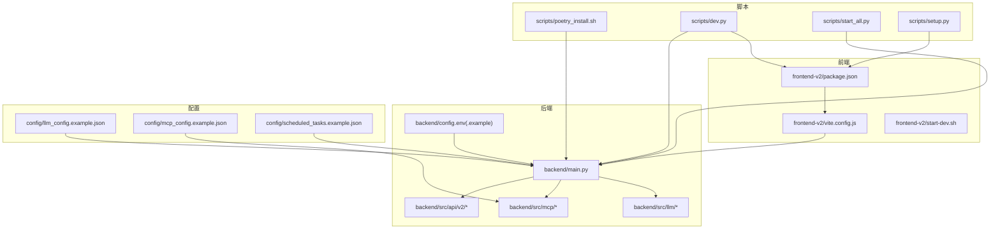
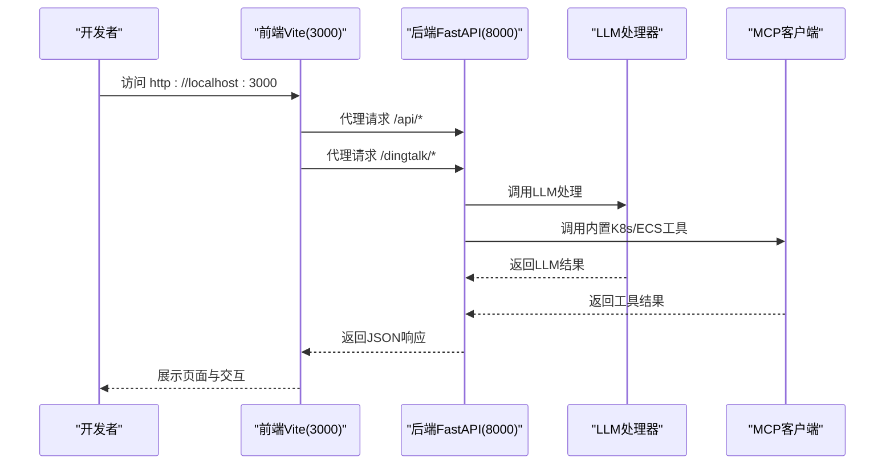
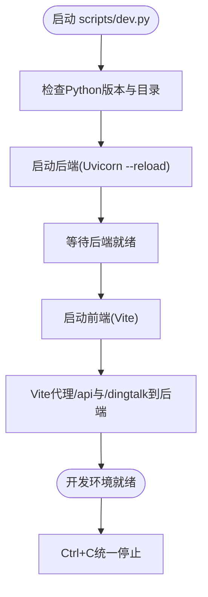
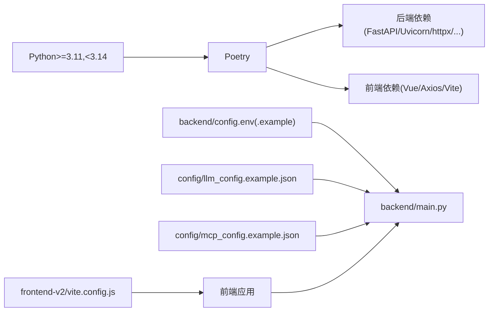

# 开发环境搭建

<cite>
**本文引用的文件**
- [pyproject.toml](file://pyproject.toml)
- [poetry.toml](file://poetry.toml)
- [scripts/poetry_install.sh](file://scripts/poetry_install.sh)
- [scripts/dev.py](file://scripts/dev.py)
- [scripts/start_all.py](file://scripts/start_all.py)
- [scripts/setup.py](file://scripts/setup.py)
- [backend/main.py](file://backend/main.py)
- [backend/config.env.example](file://backend/config.env.example)
- [backend/config.env](file://backend/config.env)
- [frontend-v2/package.json](file://frontend-v2/package.json)
- [frontend-v2/start-dev.sh](file://frontend-v2/start-dev.sh)
- [frontend-v2/vite.config.js](file://frontend-v2/vite.config.js)
- [config/llm_config.example.json](file://config/llm_config.example.json)
- [config/mcp_config.example.json](file://config/mcp_config.example.json)
- [config/scheduled_tasks.example.json](file://config/scheduled_tasks.example.json)
</cite>

## 目录
1. [简介](#简介)
2. [项目结构](#项目结构)
3. [核心组件](#核心组件)
4. [架构总览](#架构总览)
5. [详细组件分析](#详细组件分析)
6. [依赖关系分析](#依赖关系分析)
7. [性能注意事项](#性能注意事项)
8. [故障排查指南](#故障排查指南)
9. [结论](#结论)
10. [附录](#附录)

## 简介
本指南面向参与“钉钉K8s运维机器人”项目的开发者，提供从零搭建开发环境的完整流程，涵盖：
- Python 版本与 Poetry 环境准备
- 后端依赖安装（FastAPI、Uvicorn 等）
- 前端开发环境（Node.js、npm、Vite 代理）
- 环境变量配置（数据库、LLM、MCP、K8s 等）
- 开发服务器启动（并行启动、热重载、调试）
- 常见问题排查与最佳实践

## 项目结构
该项目采用前后端分离与多子工程协同的组织方式：
- backend：后端主应用（FastAPI + Uvicorn），包含 API、MCP、LLM、安全与调度模块
- frontend-v2：Vue3 前端应用，通过 Vite 开发服务器提供热重载与代理
- config：配置样例（LLM、MCP、定时任务）
- scripts：开发与部署脚本（Poetry 安装、并行启动、集成启动）
- archived：历史独立 MCP 工程（可选参考）

图表来源
- [backend/main.py:1-494](file://backend/main.py#L1-L494)
- [frontend-v2/package.json:1-41](file://frontend-v2/package.json#L1-L41)
- [frontend-v2/vite.config.js:1-55](file://frontend-v2/vite.config.js#L1-L55)
- [backend/config.env.example:1-51](file://backend/config.env.example#L1-L51)
- [config/llm_config.example.json:1-45](file://config/llm_config.example.json#L1-L45)
- [config/mcp_config.example.json:1-66](file://config/mcp_config.example.json#L1-L66)
- [config/scheduled_tasks.example.json:1-8](file://config/scheduled_tasks.example.json#L1-L8)
- [scripts/dev.py:1-219](file://scripts/dev.py#L1-L219)
- [scripts/start_all.py:1-306](file://scripts/start_all.py#L1-L306)
- [scripts/setup.py:1-85](file://scripts/setup.py#L1-L85)
- [scripts/poetry_install.sh:1-35](file://scripts/poetry_install.sh#L1-L35)

章节来源
- [backend/main.py:1-494](file://backend/main.py#L1-L494)
- [frontend-v2/package.json:1-41](file://frontend-v2/package.json#L1-L41)
- [frontend-v2/vite.config.js:1-55](file://frontend-v2/vite.config.js#L1-L55)
- [backend/config.env.example:1-51](file://backend/config.env.example#L1-L51)
- [config/llm_config.example.json:1-45](file://config/llm_config.example.json#L1-L45)
- [config/mcp_config.example.json:1-66](file://config/mcp_config.example.json#L1-L66)
- [config/scheduled_tasks.example.json:1-8](file://config/scheduled_tasks.example.json#L1-L8)
- [scripts/dev.py:1-219](file://scripts/dev.py#L1-L219)
- [scripts/start_all.py:1-306](file://scripts/start_all.py#L1-L306)
- [scripts/setup.py:1-85](file://scripts/setup.py#L1-L85)
- [scripts/poetry_install.sh:1-35](file://scripts/poetry_install.sh#L1-L35)

## 核心组件
- Python 与 Poetry
  - Python 版本要求：>=3.11 且 <3.14（避免 pydantic-core/PyO3 对 3.14 的兼容性问题）
  - Poetry 安装与配置：使用项目提供的安装脚本与配置，降低弱网下载失败概率
- 后端依赖
  - 核心：FastAPI、Uvicorn、Pydantic
  - HTTP/WS：httpx、requests、aiohttp、websockets
  - MCP/LLM：openai、crewai（条件安装，需 <3.14）
  - K8s/ECS：kubernetes、alibabacloud_*、networkx、aiofiles、orjson
  - 安全与工具：cryptography、python-dotenv、loguru、tenacity、watchdog、croniter
- 前端依赖
  - Vue3、Element Plus、Pinia、Vue Router、Axios、Vite
  - Node.js 版本：>=20 且 <23（建议使用 nvm 管理多版本）

章节来源
- [pyproject.toml:9-51](file://pyproject.toml#L9-L51)
- [poetry.toml:1-7](file://poetry.toml#L1-L7)
- [scripts/poetry_install.sh:1-35](file://scripts/poetry_install.sh#L1-L35)
- [frontend-v2/package.json:6-9](file://frontend-v2/package.json#L6-L9)

## 架构总览
开发环境由“后端 API 服务 + 前端开发服务器”组成，前端通过 Vite 代理将 /api 与 /dingtalk 请求转发至后端。后端负责：
- 加载环境变量与配置文件（config.env、config/llm_config.json）
- 初始化 LLM 处理器与 MCP 客户端（内置 K8s/ECS 工具）
- 提供 API v2 接口、静态资源与 SPA 路由
- 可选：定时巡检与任务调度

图表来源
- [frontend-v2/vite.config.js:13-28](file://frontend-v2/vite.config.js#L13-L28)
- [backend/main.py:302-450](file://backend/main.py#L302-L450)

章节来源
- [backend/main.py:302-450](file://backend/main.py#L302-L450)
- [frontend-v2/vite.config.js:13-28](file://frontend-v2/vite.config.js#L13-L28)

## 详细组件分析

### Python 与 Poetry 环境
- 版本要求
  - Python >=3.11 且 <3.14
  - 建议使用 Poetry 管理虚拟环境
- 安装与配置
  - 使用项目脚本提升弱网稳定性：加长 pip 超时、重试次数、限制并发下载
  - 如需使用国内镜像，可在 pyproject.toml 中启用（已提供示例注释）
- 常见问题
  - 使用 Python 3.14 会导致某些依赖编译失败（如 pydantic-core/PyO3）
  - 弱网环境下可增大超时或重试次数

章节来源
- [pyproject.toml:10-11](file://pyproject.toml#L10-L11)
- [poetry.toml:4-6](file://poetry.toml#L4-L6)
- [scripts/poetry_install.sh:8-11](file://scripts/poetry_install.sh#L8-L11)
- [scripts/poetry_install.sh:13-29](file://scripts/poetry_install.sh#L13-L29)

### 后端依赖安装（FastAPI/Uvicorn 等）
- 快速安装
  - 使用 Poetry 安装：poetry install
  - 若网络不稳定，使用项目脚本：./scripts/poetry_install.sh
- 关键依赖
  - Web 框架：FastAPI、Uvicorn
  - HTTP/WS：httpx、requests、aiohttp、websockets
  - LLM/MCP：openai、crewai（条件安装）
  - K8s/ECS：kubernetes、alibabacloud_*、networkx、aiofiles、orjson
  - 安全与工具：cryptography、python-dotenv、loguru、tenacity、watchdog、croniter

章节来源
- [pyproject.toml:13-49](file://pyproject.toml#L13-L49)
- [scripts/poetry_install.sh:19-29](file://scripts/poetry_install.sh#L19-L29)

### 前端开发环境（Node.js/npm/Vite）
- Node.js 版本要求
  - Node >=20 且 <23
  - npm >=10 且 <12
- 依赖安装
  - 使用 npm install 安装依赖
  - 若未安装，脚本会自动检测并安装
- 开发服务器
  - Vite 默认端口 3000，自动代理 /api 与 /dingtalk 到后端 8000
  - 构建产物输出到 backend/static/spa，供后端静态托管

章节来源
- [frontend-v2/package.json:6-9](file://frontend-v2/package.json#L6-L9)
- [frontend-v2/start-dev.sh:7-12](file://frontend-v2/start-dev.sh#L7-L12)
- [frontend-v2/vite.config.js:13-28](file://frontend-v2/vite.config.js#L13-L28)
- [frontend-v2/vite.config.js:30-47](file://frontend-v2/vite.config.js#L30-L47)

### 环境变量配置
- 后端配置文件
  - backend/config.env（复制自 config.env.example）用于本地开发
  - 支持 LLM、钉钉、K8s、MCP、日志、数据脱敏等配置项
- LLM 配置
  - 支持多提供商配置（示例：openai-compatible）
  - 包含模型、温度、最大令牌、超时、重试、流式等参数
- MCP 配置
  - 默认内置 K8s/ECS 工具已在主进程运行，无需独立 MCP 服务器
  - 示例配置展示如何启用 SSE 服务器与工具集
- 定时任务
  - scheduled_tasks.example.json 作为模板，启用后在后端调度器中生效

章节来源
- [backend/config.env.example:1-51](file://backend/config.env.example#L1-L51)
- [backend/config.env:1-42](file://backend/config.env#L1-L42)
- [config/llm_config.example.json:1-45](file://config/llm_config.example.json#L1-L45)
- [config/mcp_config.example.json:1-66](file://config/mcp_config.example.json#L1-L66)
- [config/scheduled_tasks.example.json:1-8](file://config/scheduled_tasks.example.json#L1-L8)

### 开发服务器启动
- 并行启动（推荐）
  - 使用 scripts/dev.py：同时启动后端（Uvicorn + reload）与前端（Vite）
  - 自动检查 Python 版本、目录存在性，实时输出日志，支持 Ctrl+C 统一停止
- 单独启动
  - 后端：poetry run python backend/main.py 或 scripts/dev.py run_backend
  - 前端：npm run dev 或 scripts/dev.py run_frontend
- 集成启动（生产/集成场景）
  - scripts/start_all.py：按顺序启动 MCP 服务与后端，支持端口等待与统一信号处理

图表来源
- [scripts/dev.py:92-139](file://scripts/dev.py#L92-L139)
- [frontend-v2/vite.config.js:13-28](file://frontend-v2/vite.config.js#L13-L28)

章节来源
- [scripts/dev.py:28-155](file://scripts/dev.py#L28-L155)
- [scripts/dev.py:156-196](file://scripts/dev.py#L156-L196)
- [scripts/start_all.py:225-270](file://scripts/start_all.py#L225-L270)

### 热重载与调试
- 后端热重载
  - Uvicorn 启动时启用 --reload，修改 Python 源码后自动重启
  - 日志实时输出，便于定位问题
- 前端热重载
  - Vite 默认启用 HMR，修改 Vue 组件与样式即时生效
  - 代理配置确保 API 请求无需手动更改目标地址
- 调试建议
  - 后端：设置 LOG_LEVEL=DEBUG，关注 logs/app.log
  - 前端：浏览器控制台与 Vite 日志双通道排查

章节来源
- [backend/main.py:475-493](file://backend/main.py#L475-L493)
- [frontend-v2/vite.config.js:13-28](file://frontend-v2/vite.config.js#L13-L28)

## 依赖关系分析
- 后端依赖层次
  - Web 层：FastAPI + Uvicorn
  - 通信层：httpx/aiohttp/websockets
  - 工具层：MCP 客户端、K8s/ECS 工具、LLM 处理器
  - 安全与工具：dotenv、loguru、tenacity、watchdog、croniter
- 前端依赖层次
  - 视图层：Vue3 + Element Plus + Pinia + Vue Router
  - 构建与代理：Vite + @vitejs/plugin-vue
  - 网络：Axios
- 配置与脚本
  - 环境变量与配置文件驱动后端行为
  - 脚本负责安装、并行启动与集成启动

图表来源
- [pyproject.toml:9-51](file://pyproject.toml#L9-L51)
- [backend/main.py:14-61](file://backend/main.py#L14-L61)
- [frontend-v2/vite.config.js:1-55](file://frontend-v2/vite.config.js#L1-L55)

章节来源
- [pyproject.toml:9-51](file://pyproject.toml#L9-L51)
- [backend/main.py:14-61](file://backend/main.py#L14-L61)
- [frontend-v2/vite.config.js:1-55](file://frontend-v2/vite.config.js#L1-L55)

## 性能注意事项
- Poetry 安装优化
  - 降低并发下载数、增加超时与重试次数，适配弱网环境
- 后端性能
  - 使用 Uvicorn 多工作进程（生产环境）；开发环境建议单进程 + reload
  - 合理设置 LLM 超时与重试，避免阻塞请求
- 前端性能
  - Vite 构建时拆分 vendor 与 elementplus，减少首屏体积
  - 关闭 sourcemap 以减小产物体积（开发阶段可开启调试）

## 故障排查指南
- Python 版本不兼容
  - 症状：启动失败或依赖编译报错
  - 解决：使用 Python 3.11–3.13，并确保 Poetry 使用正确解释器
- Poetry 安装失败（弱网）
  - 症状：下载超时或连接重置
  - 解决：使用 ./scripts/poetry_install.sh，增大超时与重试次数
- 前端依赖未安装
  - 症状：npm install 失败或 Vite 启动报错
  - 解决：确认 Node >=20 且 <23，执行 npm install 或使用 start-dev.sh
- 端口占用
  - 症状：后端 8000 或前端 3000 被占用
  - 解决：释放端口或在环境变量中调整 HOST/PORT
- LLM 配置无效
  - 症状：LLM 不生效或报错
  - 解决：检查 config/llm_config.json 是否存在，或 backend/config.env 中对应键值
- MCP 服务器未就绪
  - 症状：后端初始化失败或工具不可用
  - 解决：确认内置 K8s/ECS 工具已启用；如需独立 MCP，参考 archived 工程

章节来源
- [scripts/poetry_install.sh:8-11](file://scripts/poetry_install.sh#L8-L11)
- [scripts/poetry_install.sh:13-29](file://scripts/poetry_install.sh#L13-L29)
- [frontend-v2/start-dev.sh:7-12](file://frontend-v2/start-dev.sh#L7-L12)
- [backend/main.py:62-129](file://backend/main.py#L62-L129)
- [config/mcp_config.example.json:1-66](file://config/mcp_config.example.json#L1-L66)

## 结论
通过本指南，您可以在本地快速搭建“钉钉K8s运维机器人”的开发环境：选择合适的 Python 与 Node.js 版本，使用 Poetry 安装后端依赖，使用 npm 安装前端依赖，配置后端与 LLM/MCP 配置文件，最后通过并行启动脚本获得热重载与代理的开发体验。遇到问题时，可依据故障排查章节逐项定位。

## 附录
- 常用命令
  - 初始化项目：poetry run setup
  - 并行启动：poetry run dev
  - 后端启动：poetry run python backend/main.py
  - 前端启动：cd frontend-v2 && npm run dev
  - 构建前端：poetry run build
  - 集成启动：poetry run start-all
- 配置文件位置
  - 后端：backend/config.env(.example)
  - LLM：config/llm_config.example.json
  - MCP：config/mcp_config.example.json
  - 定时任务：config/scheduled_tasks.example.json