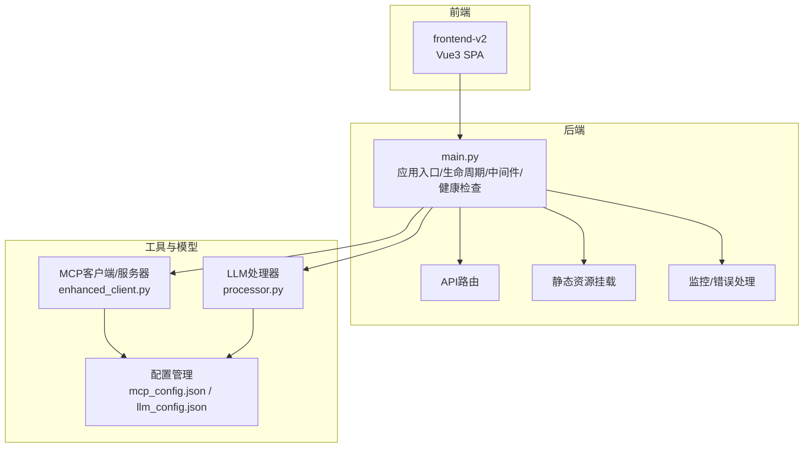
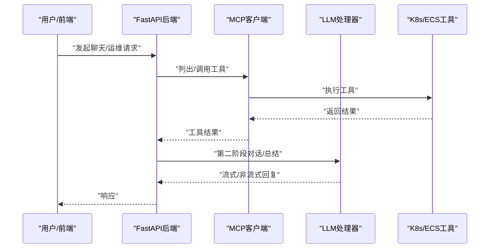
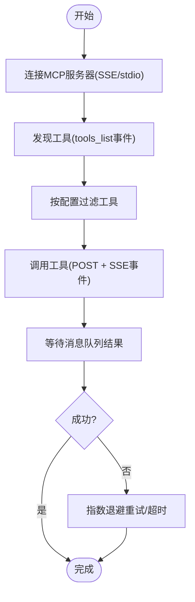
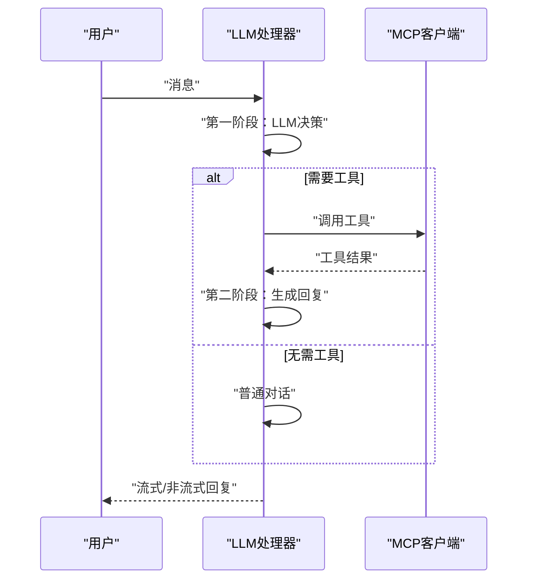
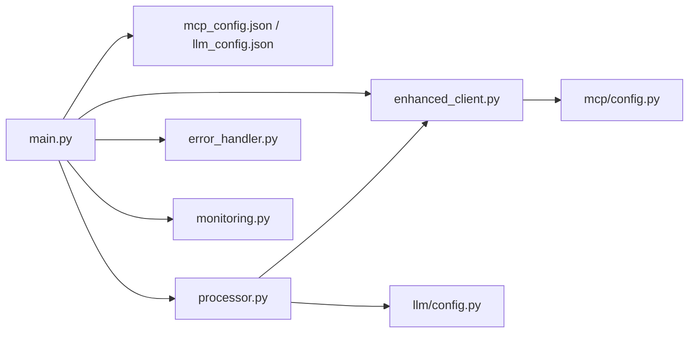

# 故障排除与常见问题

<cite>
**本文引用的文件**
- [README.md](file://README.md)
- [backend/main.py](file://backend/main.py)
- [scripts/start_all.py](file://scripts/start_all.py)
- [scripts/dev.py](file://scripts/dev.py)
- [scripts/build.py](file://scripts/build.py)
- [config/mcp_config.example.json](file://config/mcp_config.example.json)
- [config/llm_config.example.json](file://config/llm_config.example.json)
- [backend/src/utils/error_handler.py](file://backend/src/utils/error_handler.py)
- [backend/src/utils/monitoring.py](file://backend/src/utils/monitoring.py)
- [backend/src/mcp/enhanced_client.py](file://backend/src/mcp/enhanced_client.py)
- [backend/src/mcp/config.py](file://backend/src/mcp/config.py)
- [backend/src/llm/processor.py](file://backend/src/llm/processor.py)
- [backend/src/llm/config.py](file://backend/src/llm/config.py)
- [archived/k8s-mcp-standalone/project_document/troubleshooting-guide.md](file://archived/k8s-mcp-standalone/project_document/troubleshooting-guide.md)
</cite>

## 目录
1. [简介](#简介)
2. [项目结构](#项目结构)
3. [核心组件](#核心组件)
4. [架构总览](#架构总览)
5. [详细组件分析](#详细组件分析)
6. [依赖关系分析](#依赖关系分析)
7. [性能考量](#性能考量)
8. [故障排除指南](#故障排除指南)
9. [结论](#结论)
10. [附录](#附录)

## 简介
本指南面向“钉钉K8s运维机器人”的运维与开发人员，聚焦于部署与运行时问题的快速定位与解决，覆盖依赖冲突、端口占用、权限不足、MCP连接失败、LLM调用异常、前端资源加载失败、性能问题（内存/CPU/网络）、日志分析与错误解读、应急处理与恢复策略、配置错误识别与修正、问题上报与反馈流程，以及FAQ。

## 项目结构
系统由后端FastAPI主服务、前端Vue3 SPA、MCP工具子系统、LLM处理层、统一配置与监控/错误处理工具组成。后端负责统一启动、路由、中间件、健康检查与静态资源挂载；前端负责聊天与运维界面；MCP负责与K8s/ECS工具交互；LLM负责对话与工具调用的第二阶段处理；配置文件位于config目录，支持JSON与环境变量双通道。

图表来源
- [backend/main.py:302-450](file://backend/main.py#L302-L450)
- [backend/src/mcp/enhanced_client.py:1-120](file://backend/src/mcp/enhanced_client.py#L1-L120)
- [backend/src/llm/processor.py:520-750](file://backend/src/llm/processor.py#L520-L750)

章节来源
- [README.md:64-76](file://README.md#L64-L76)
- [backend/main.py:406-450](file://backend/main.py#L406-L450)

## 核心组件
- 应用入口与生命周期：负责加载环境变量、迁移配置、初始化MCP/LLM/钉钉机器人、定时巡检与任务调度、健康检查、CORS与静态资源挂载。
- MCP客户端：支持SSE/stdio等连接方式，自动发现工具、路由与过滤、超时与重试、消息队列等待结果、自动同步工具配置到配置文件。
- LLM处理器：基于OpenAI兼容接口，支持流式对话、工具调用、上下文优化、结果提炼、脱敏与安全策略。
- 监控与错误处理：统一错误分类与建议、性能监控（请求/系统指标）、调试信息收集、请求追踪上下文。
- 配置管理：MCP与LLM配置的JSON文件与环境变量回退，提供默认模板与校验。

章节来源
- [backend/main.py:148-270](file://backend/main.py#L148-L270)
- [backend/src/mcp/enhanced_client.py:61-120](file://backend/src/mcp/enhanced_client.py#L61-L120)
- [backend/src/llm/processor.py:30-120](file://backend/src/llm/processor.py#L30-L120)
- [backend/src/utils/error_handler.py:13-70](file://backend/src/utils/error_handler.py#L13-L70)
- [backend/src/utils/monitoring.py:51-144](file://backend/src/utils/monitoring.py#L51-L144)
- [backend/src/mcp/config.py:16-72](file://backend/src/mcp/config.py#L16-L72)
- [backend/src/llm/config.py:15-93](file://backend/src/llm/config.py#L15-L93)

## 架构总览
后端通过FastAPI统一对外提供API与SPA静态资源；MCP客户端在应用启动时连接或内置工具，LLM处理器在对话时按需调用；错误与性能通过统一模块处理与采集。

图表来源
- [backend/src/mcp/enhanced_client.py:587-735](file://backend/src/mcp/enhanced_client.py#L587-L735)
- [backend/src/llm/processor.py:536-750](file://backend/src/llm/processor.py#L536-L750)

## 详细组件分析

### MCP客户端与工具调用
- 连接方式：SSE/stdio/local，SSE支持重连与事件监听，工具通过tools_list事件发现并自动同步到配置文件。
- 超时与重试：配置项控制超时、重试次数与延迟；工具调用等待结果通过消息队列实现。
- 工具过滤：按配置启用/禁用工具，支持技能过滤（Skill Registry）。
- 异常处理：连接失败、超时、网络错误、HTTP状态码错误均有明确分类与日志记录。

图表来源
- [backend/src/mcp/enhanced_client.py:114-156](file://backend/src/mcp/enhanced_client.py#L114-L156)
- [backend/src/mcp/enhanced_client.py:246-320](file://backend/src/mcp/enhanced_client.py#L246-L320)
- [backend/src/mcp/enhanced_client.py:652-735](file://backend/src/mcp/enhanced_client.py#L652-L735)

章节来源
- [backend/src/mcp/enhanced_client.py:61-120](file://backend/src/mcp/enhanced_client.py#L61-L120)
- [backend/src/mcp/enhanced_client.py:114-156](file://backend/src/mcp/enhanced_client.py#L114-L156)
- [backend/src/mcp/enhanced_client.py:246-320](file://backend/src/mcp/enhanced_client.py#L246-L320)
- [backend/src/mcp/enhanced_client.py:587-735](file://backend/src/mcp/enhanced_client.py#L587-L735)

### LLM处理器与对话流
- 两阶段处理：第一阶段由LLM判断是否调用工具；第二阶段基于工具结果生成回复。
- 上下文优化：估算token、限制历史消息数量与总token，避免超限。
- 结果提炼：对过大工具结果进行关键信息提炼与分页建议。
- 流式输出：支持流式对话，便于前端实时展示。

图表来源
- [backend/src/llm/processor.py:536-750](file://backend/src/llm/processor.py#L536-L750)
- [backend/src/llm/processor.py:758-800](file://backend/src/llm/processor.py#L758-L800)

章节来源
- [backend/src/llm/processor.py:520-750](file://backend/src/llm/processor.py#L520-L750)
- [backend/src/llm/processor.py:758-800](file://backend/src/llm/processor.py#L758-L800)

### 错误处理与统一建议
- 错误分类：网络、认证、授权、速率限制、服务器、客户端、MCP、流式、配置、未知。
- 建议生成：针对不同错误类型给出可执行的排查建议。
- 日志记录：按严重程度选择日志级别，并携带上下文信息。

章节来源
- [backend/src/utils/error_handler.py:13-70](file://backend/src/utils/error_handler.py#L13-L70)
- [backend/src/utils/error_handler.py:71-156](file://backend/src/utils/error_handler.py#L71-L156)
- [backend/src/utils/error_handler.py:218-245](file://backend/src/utils/error_handler.py#L218-L245)

### 监控与性能指标
- 请求追踪：开始/结束记录、耗时、状态码、错误、元数据。
- 系统指标：CPU/内存/磁盘/连接数/请求量/错误率/平均响应时间。
- 警告阈值：CPU/内存/活跃连接数等阈值告警。

章节来源
- [backend/src/utils/monitoring.py:19-68](file://backend/src/utils/monitoring.py#L19-L68)
- [backend/src/utils/monitoring.py:85-144](file://backend/src/utils/monitoring.py#L85-L144)
- [backend/src/utils/monitoring.py:207-242](file://backend/src/utils/monitoring.py#L207-L242)

## 依赖关系分析
- 后端入口依赖配置管理、MCP客户端、LLM处理器、钉钉机器人、调度器与审计中间件。
- MCP客户端依赖配置模型、类型定义、运行时与传输层。
- LLM处理器依赖MCP客户端、安全脱敏模块、上下文优化与结果提炼。
- 监控与错误处理作为横切关注点被各模块复用。

图表来源
- [backend/main.py:148-270](file://backend/main.py#L148-L270)
- [backend/src/mcp/enhanced_client.py:1-31](file://backend/src/mcp/enhanced_client.py#L1-L31)
- [backend/src/llm/processor.py:19-28](file://backend/src/llm/processor.py#L19-L28)
- [backend/src/mcp/config.py:1-14](file://backend/src/mcp/config.py#L1-L14)
- [backend/src/llm/config.py:1-13](file://backend/src/llm/config.py#L1-L13)

## 性能考量
- CPU/内存/连接数：监控模块提供阈值告警，结合日志定位瓶颈。
- LLM上下文优化：限制历史消息与总token，避免超限导致延迟上升。
- 工具调用超时：合理设置MCP超时与重试，避免阻塞。
- 前端构建与静态资源：构建脚本将前端产物集成到后端static目录，减少CDN依赖带来的延迟。

章节来源
- [backend/src/utils/monitoring.py:131-138](file://backend/src/utils/monitoring.py#L131-L138)
- [backend/src/llm/processor.py:463-518](file://backend/src/llm/processor.py#L463-L518)
- [scripts/build.py:107-144](file://scripts/build.py#L107-L144)

## 故障排除指南

### 一、部署与启动问题
- 依赖冲突与Python版本
  - 现象：启动失败、模块导入错误、Poetry环境不匹配。
  - 排查：确认Python版本在3.11–3.13之间，使用Poetry切换环境并安装依赖。
  - 参考：[README.md:19-28](file://README.md#L19-L28)、[scripts/dev.py:30-39](file://scripts/dev.py#L30-L39)
- 端口占用
  - 现象：服务无法启动、端口绑定失败。
  - 排查：检查8000端口占用，释放或修改端口；确认防火墙放行。
  - 参考：[backend/main.py:482-493](file://backend/main.py#L482-L493)、[scripts/start_all.py:51-68](file://scripts/start_all.py#L51-L68)
- 前端资源加载失败
  - 现象：访问主页空白或404。
  - 排查：确认已构建前端并将SPA静态资源挂载到/static/spa；检查静态文件目录存在性。
  - 参考：[backend/main.py:406-420](file://backend/main.py#L406-L420)、[scripts/build.py:107-144](file://scripts/build.py#L107-L144)

章节来源
- [README.md:19-28](file://README.md#L19-L28)
- [scripts/dev.py:30-39](file://scripts/dev.py#L30-L39)
- [backend/main.py:482-493](file://backend/main.py#L482-L493)
- [scripts/start_all.py:51-68](file://scripts/start_all.py#L51-L68)
- [backend/main.py:406-420](file://backend/main.py#L406-L420)
- [scripts/build.py:107-144](file://scripts/build.py#L107-L144)

### 二、运行时问题诊断
- MCP连接失败
  - 现象：工具不可用、健康检查失败、SSE连接超时/断开。
  - 排查：检查SSE端点可达性、认证头/令牌、重连与超时配置；查看SSE事件监听日志；确认工具列表事件是否到达。
  - 参考：[backend/src/mcp/enhanced_client.py:114-156](file://backend/src/mcp/enhanced_client.py#L114-L156)、[backend/src/mcp/enhanced_client.py:157-245](file://backend/src/mcp/enhanced_client.py#L157-L245)
- LLM调用异常
  - 现象：LLM不可用、流式中断、代理/网络错误。
  - 排查：检查API Key、Base URL、超时与重试；查看客户端初始化日志；确认代理与NO_PROXY设置。
  - 参考：[backend/src/llm/processor.py:59-120](file://backend/src/llm/processor.py#L59-L120)、[backend/src/llm/config.py:300-317](file://backend/src/llm/config.py#L300-L317)
- 前端资源加载失败
  - 现象：页面空白、资源404。
  - 排查：确认构建产物存在、静态目录挂载正确、SPA入口index.html存在。
  - 参考：[backend/main.py:406-420](file://backend/main.py#L406-L420)、[scripts/build.py:112-144](file://scripts/build.py#L112-L144)

章节来源
- [backend/src/mcp/enhanced_client.py:114-156](file://backend/src/mcp/enhanced_client.py#L114-L156)
- [backend/src/mcp/enhanced_client.py:157-245](file://backend/src/mcp/enhanced_client.py#L157-L245)
- [backend/src/llm/processor.py:59-120](file://backend/src/llm/processor.py#L59-L120)
- [backend/src/llm/config.py:300-317](file://backend/src/llm/config.py#L300-L317)
- [backend/main.py:406-420](file://backend/main.py#L406-L420)
- [scripts/build.py:112-144](file://scripts/build.py#L112-L144)

### 三、性能问题定位与优化
- CPU/内存过高
  - 排查：使用监控模块查看CPU/内存使用率与活跃连接数；检查是否有长时间运行的工具调用。
  - 优化：调整MCP超时与重试、减少并发、优化LLM上下文大小。
  - 参考：[backend/src/utils/monitoring.py:131-138](file://backend/src/utils/monitoring.py#L131-L138)、[backend/src/llm/processor.py:463-518](file://backend/src/llm/processor.py#L463-L518)
- 网络延迟
  - 排查：检查到K8s API或LLM服务的网络连通性与延迟；确认代理配置。
  - 优化：增加超时、启用缓存、减少不必要的工具调用。
  - 参考：[archived/k8s-mcp-standalone/project_document/troubleshooting-guide.md:396-404](file://archived/k8s-mcp-standalone/project_document/troubleshooting-guide.md#L396-L404)

章节来源
- [backend/src/utils/monitoring.py:131-138](file://backend/src/utils/monitoring.py#L131-L138)
- [backend/src/llm/processor.py:463-518](file://backend/src/llm/processor.py#L463-L518)
- [archived/k8s-mcp-standalone/project_document/troubleshooting-guide.md:396-404](file://archived/k8s-mcp-standalone/project_document/troubleshooting-guide.md#L396-L404)

### 四、日志分析与错误解读
- 日志位置：后端默认写入logs/app.log；MCP审计日志可配置。
- 错误分类：统一错误处理器按关键字与异常类型分类，生成建议。
- 建议：优先查看连接/超时/认证/服务器错误；结合性能监控定位瓶颈。

章节来源
- [backend/main.py:48-51](file://backend/main.py#L48-L51)
- [backend/src/utils/error_handler.py:32-69](file://backend/src/utils/error_handler.py#L32-L69)
- [backend/src/mcp/enhanced_client.py:462-464](file://backend/src/mcp/enhanced_client.py#L462-L464)

### 五、应急处理与恢复策略
- 快速降级：MCP初始化失败不影响LLM服务；LLM初始化失败直接中止启动。
- 重启与回滚：通过启动脚本优雅停止与重启；必要时回退配置文件。
- 临时措施：禁用高风险工具、降低并发、开启缓存。

章节来源
- [backend/main.py:183-188](file://backend/main.py#L183-L188)
- [backend/main.py:215-218](file://backend/main.py#L215-L218)
- [scripts/start_all.py:76-89](file://scripts/start_all.py#L76-L89)

### 六、常见配置错误与修正
- MCP配置
  - 症状：工具不可用、SSE端点不存在、认证失败。
  - 修正：核对host/port/path/认证头；启用对应服务器；确认enabled_tools列表。
  - 参考：[config/mcp_config.example.json:13-55](file://config/mcp_config.example.json#L13-L55)、[backend/src/mcp/config.py:16-72](file://backend/src/mcp/config.py#L16-L72)
- LLM配置
  - 症状：LLM不可用、API Key无效、Base URL错误。
  - 修正：填写api_key/base_url/model；检查环境变量回退；确认代理设置。
  - 参考：[config/llm_config.example.json:7-24](file://config/llm_config.example.json#L7-L24)、[backend/src/llm/config.py:300-317](file://backend/src/llm/config.py#L300-L317)

章节来源
- [config/mcp_config.example.json:13-55](file://config/mcp_config.example.json#L13-L55)
- [backend/src/mcp/config.py:16-72](file://backend/src/mcp/config.py#L16-L72)
- [config/llm_config.example.json:7-24](file://config/llm_config.example.json#L7-L24)
- [backend/src/llm/config.py:300-317](file://backend/src/llm/config.py#L300-L317)

### 七、问题上报与反馈流程
- 收集信息：错误类型、建议、时间戳、请求ID、上下文、日志片段。
- 分类与分级：依据错误处理器分类，确定紧急程度。
- 反馈渠道：按团队规范提交Issue/工单，附带日志与复现步骤。

章节来源
- [backend/src/utils/error_handler.py:158-187](file://backend/src/utils/error_handler.py#L158-L187)

### 八、FAQ
- Q：为什么前端访问空白？
  - A：确认已执行构建脚本并将SPA静态资源挂载到/static/spa。
  - 参考：[scripts/build.py:107-144](file://scripts/build.py#L107-L144)、[backend/main.py:406-420](file://backend/main.py#L406-L420)
- Q：MCP连接一直超时怎么办？
  - A：检查SSE端点可达性、认证配置、重试与超时设置；查看SSE事件监听日志。
  - 参考：[backend/src/mcp/enhanced_client.py:114-156](file://backend/src/mcp/enhanced_client.py#L114-L156)
- Q：LLM一直报网络错误？
  - A：检查API Key、Base URL、代理与NO_PROXY设置；适当增加超时与重试。
  - 参考：[backend/src/llm/processor.py:59-120](file://backend/src/llm/processor.py#L59-L120)、[backend/src/llm/config.py:300-317](file://backend/src/llm/config.py#L300-L317)
- Q：如何快速定位性能问题？
  - A：查看监控模块的CPU/内存/连接数与平均响应时间；结合错误日志定位瓶颈。
  - 参考：[backend/src/utils/monitoring.py:131-138](file://backend/src/utils/monitoring.py#L131-L138)

## 结论
本指南提供了从部署到运行时的全链路故障排除方法，结合统一错误分类、性能监控与配置模板，帮助快速定位与解决问题。建议在生产环境启用日志与监控，定期复核配置，建立标准化的应急与反馈流程。

## 附录
- 快速命令
  - 启动：poetry run start-all；开发：poetry run dev；构建：poetry run build
  - 参考：[README.md:78-86](file://README.md#L78-L86)、[scripts/start_all.py:272-302](file://scripts/start_all.py#L272-L302)、[scripts/dev.py:198-219](file://scripts/dev.py#L198-L219)、[scripts/build.py:174-179](file://scripts/build.py#L174-L179)