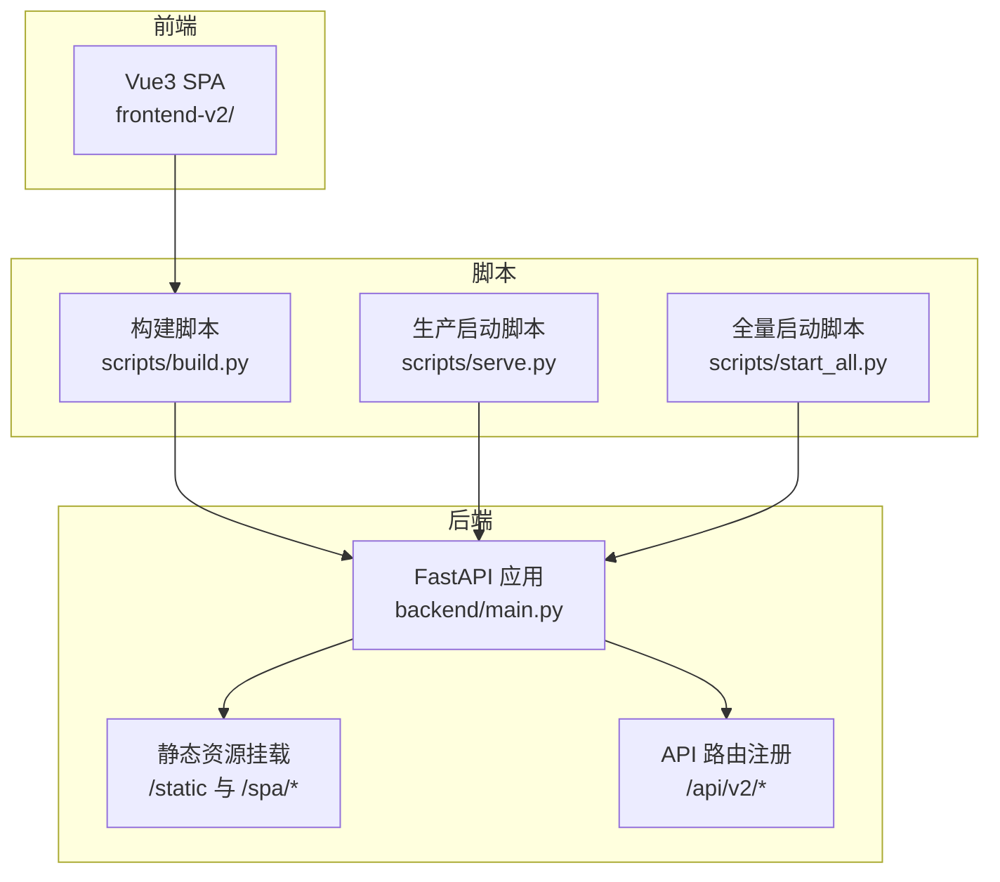
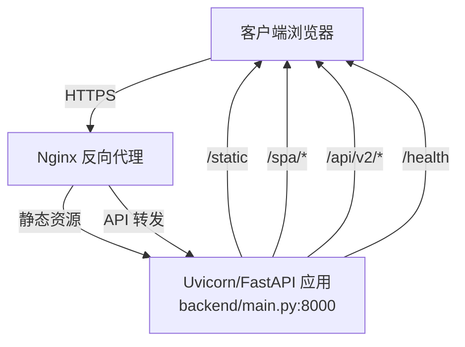
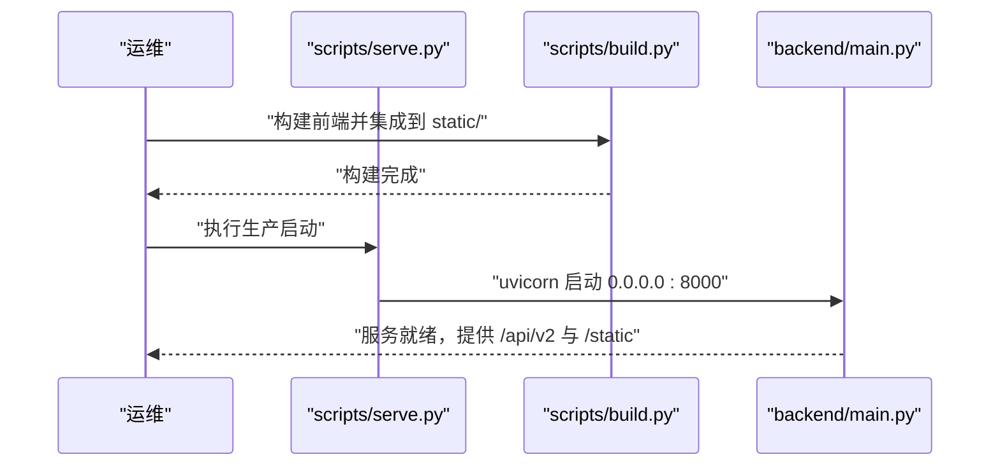
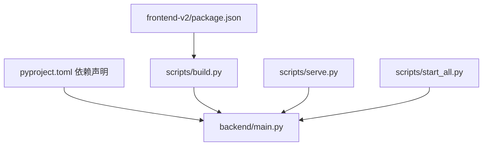

# 生产环境部署

<cite>
**本文引用的文件**
- [backend/main.py](file://backend/main.py)
- [scripts/start_all.py](file://scripts/start_all.py)
- [scripts/serve.py](file://scripts/serve.py)
- [scripts/build.py](file://scripts/build.py)
- [scripts/dev.py](file://scripts/dev.py)
- [backend/config.env.example](file://backend/config.env.example)
- [pyproject.toml](file://pyproject.toml)
- [README.md](file://README.md)
- [config/llm_config.example.json](file://config/llm_config.example.json)
- [config/mcp_config.example.json](file://config/mcp_config.example.json)
- [frontend-v2/package.json](file://frontend-v2/package.json)
</cite>

## 目录
1. [简介](#简介)
2. [项目结构](#项目结构)
3. [核心组件](#核心组件)
4. [架构总览](#架构总览)
5. [详细组件分析](#详细组件分析)
6. [依赖关系分析](#依赖关系分析)
7. [性能考量](#性能考量)
8. [故障排查指南](#故障排查指南)
9. [结论](#结论)
10. [附录](#附录)

## 简介
本指南面向生产环境部署“钉钉K8s运维机器人”，覆盖服务启动脚本使用方法（单服务与全量启动）、Nginx反向代理配置（静态资源、API转发、SSL）、Docker容器化方案（Dockerfile、镜像构建、容器编排）、PM2进程管理（进程数、内存限制、自动重启）、负载均衡与高可用架构、环境变量生产配置与安全要点、部署检查清单与验证步骤，以及部署后的健康检查与监控建议。

## 项目结构
- 后端采用 FastAPI 应用入口，内置静态资源挂载与 SPA 路由支持，统一对外提供 API 与前端静态资源。
- 前端为 Vue3 单页应用，通过构建脚本打包到后端 static 目录，实现单端口服务。
- 部分子服务（K8s/ECS MCP）已并入主应用进程，无需独立启动。
- 提供多套启动脚本：开发、生产、全量集成启动。

图表来源
- [backend/main.py:406-450](file://backend/main.py#L406-L450)
- [scripts/build.py:24-179](file://scripts/build.py#L24-L179)
- [scripts/serve.py:39-117](file://scripts/serve.py#L39-L117)
- [scripts/start_all.py:225-270](file://scripts/start_all.py#L225-L270)

章节来源
- [README.md:64-76](file://README.md#L64-L76)
- [backend/main.py:406-450](file://backend/main.py#L406-L450)
- [scripts/build.py:24-179](file://scripts/build.py#L24-L179)

## 核心组件
- FastAPI 应用与生命周期：应用启动时初始化 MCP 客户端、LLM 处理器、钉钉机器人；支持健康检查端点与审计中间件。
- 静态资源与 SPA 路由：后端挂载 static 目录，SPA 路由 fallback 到 index.html，根路径返回 SPA。
- 启动脚本：
  - 生产启动：scripts/serve.py，校验构建产物后以 uvicorn 单进程运行。
  - 全量启动：scripts/start_all.py，按规范启动 MCP 子服务（当前已并入主进程，脚本保留兼容）。
  - 开发启动：scripts/dev.py，前后端并行开发。
- 配置体系：环境变量（backend/config.env.example），JSON 配置（llm_config.json、mcp_config.json）。

章节来源
- [backend/main.py:137-300](file://backend/main.py#L137-L300)
- [backend/main.py:406-474](file://backend/main.py#L406-L474)
- [scripts/serve.py:39-117](file://scripts/serve.py#L39-L117)
- [scripts/start_all.py:225-270](file://scripts/start_all.py#L225-L270)
- [scripts/dev.py:92-155](file://scripts/dev.py#L92-L155)
- [backend/config.env.example:1-51](file://backend/config.env.example#L1-L51)
- [config/llm_config.example.json:1-45](file://config/llm_config.example.json#L1-L45)
- [config/mcp_config.example.json:1-66](file://config/mcp_config.example.json#L1-L66)

## 架构总览
生产部署采用“单服务 + Nginx 反向代理”的模式：
- 后端服务监听 0.0.0.0:8000，提供 API 与静态资源。
- Nginx 作为反向代理，负责静态资源服务、API 转发、SSL 终止与压缩。
- 前端构建产物集成到后端 static 目录，通过 /static 与 SPA 路由暴露。

图表来源
- [backend/main.py:406-474](file://backend/main.py#L406-L474)
- [scripts/serve.py:85-108](file://scripts/serve.py#L85-L108)

## 详细组件分析

### 服务启动脚本使用方法
- 单服务启动（仅后端）
  - 使用 scripts/serve.py，该脚本会检查构建产物（static/index.html、static/spa/index.html），确认后以 uvicorn 在 0.0.0.0:8000 启动。
  - 适合生产单容器部署场景。
- 全量启动（包含 MCP 子服务）
  - 使用 scripts/start_all.py，按 MCP_SERVICE_SPECS 规范启动子服务；当前已并入主进程，脚本保留兼容，实际启动顺序为先 MCP（已内嵌）再后端。
  - 适合本地联调或需要独立 MCP 的历史场景。
- 开发启动
  - 使用 scripts/dev.py，同时启动前端开发服务器与后端（带热重载），便于本地调试。

图表来源
- [scripts/serve.py:39-117](file://scripts/serve.py#L39-L117)
- [scripts/build.py:24-179](file://scripts/build.py#L24-L179)
- [backend/main.py:464-474](file://backend/main.py#L464-L474)

章节来源
- [scripts/serve.py:39-117](file://scripts/serve.py#L39-L117)
- [scripts/start_all.py:225-270](file://scripts/start_all.py#L225-L270)
- [scripts/dev.py:92-155](file://scripts/dev.py#L92-L155)
- [backend/main.py:464-474](file://backend/main.py#L464-L474)

### Nginx 反向代理配置
- 静态资源服务
  - 将 /static 与 /spa/* 映射到后端 static 目录，Nginx 可直接提供静态文件。
- API 转发
  - 将 /api/v2/* 转发到后端 0.0.0.0:8000。
- SSL 证书
  - 使用 HTTPS，证书与私钥路径需在 Nginx 中配置。
- 压缩与缓存
  - 建议开启 gzip/br 压缩，对静态资源设置合理缓存头。
- 示例要点（不含具体证书路径）：
  - upstream 指向 backend:8000
  - location /static 与 /spa/* 直接服务静态
  - location /api/v2/* proxy_pass 到 upstream
  - ssl_certificate 与 ssl_certificate_key 指向实际证书文件

章节来源
- [backend/main.py:406-450](file://backend/main.py#L406-L450)

### Docker 容器化部署方案
- Dockerfile 编写思路
  - 基于 Python 3.11–3.13（满足依赖要求），安装系统依赖（如 build-essential 等，视需而定）。
  - 使用 Poetry 安装 Python 依赖；前端依赖 Node 20–22（package.json engines）。
  - 先执行构建脚本生成 static 目录，再启动 uvicorn。
- 镜像构建
  - 建议分层构建：Python 依赖层、前端依赖层、构建产物层、运行时层。
  - 使用 .dockerignore 排除不必要的构建上下文。
- 容器编排
  - 使用 docker-compose 或 Kubernetes Deployment/Service 暴露 8000 端口。
  - 挂载持久卷用于 logs 目录（应用会写入 logs/app.log）。
  - 通过环境变量注入 config.env 内容。

章节来源
- [pyproject.toml:9-51](file://pyproject.toml#L9-L51)
- [frontend-v2/package.json:6-8](file://frontend-v2/package.json#L6-L8)
- [scripts/build.py:24-179](file://scripts/build.py#L24-L179)
- [backend/main.py:38-52](file://backend/main.py#L38-L52)

### PM2 进程管理配置
- 进程数量
  - 默认单进程运行（scripts/serve.py 固定 workers=1）。若需多核利用，可在生产环境调整 uvicorn workers 数量（注意 GIL 与并发模型）。
- 内存限制
  - 通过系统 cgroup 或容器资源限制控制内存上限，避免 OOM。
- 自动重启策略
  - 使用 PM2 的 restart time、max_memory_restart 等策略，结合健康检查端点 /health。
- 健康检查
  - PM2 可配置 httpHealth 指向 /health，失败时自动重启。
- 日志
  - PM2 输出与应用日志（logs/app.log）分离，便于排查。

章节来源
- [scripts/serve.py:90-92](file://scripts/serve.py#L90-L92)
- [backend/main.py:464-474](file://backend/main.py#L464-L474)

### 负载均衡与高可用部署架构
- 无状态设计
  - 应用为无状态服务，可水平扩展多个副本。
- 负载均衡
  - Nginx/HAProxy/LBaaS 做四层/七层负载均衡，健康检查指向 /health。
- 数据与配置
  - 配置集中管理（如 config/llm_config.json、config/mcp_config.json），通过挂载或配置中心下发。
- 容灾
  - 多副本部署，结合滚动更新与蓝绿发布策略。

章节来源
- [backend/main.py:464-474](file://backend/main.py#L464-L474)

### 环境变量的生产配置与安全考虑
- 关键环境变量
  - LOG_LEVEL、HOST、PORT、WORKERS
  - LLM_*、DINGTALK_*、K8S_*、MCP_*、LLM_MASKING_* 等
- 安全要点
  - 不将真实密钥提交到版本库；使用加密存储与只读权限。
  - 限制日志敏感信息输出；必要时启用 LLM 数据脱敏。
  - 通过 Nginx 强制 HTTPS，避免明文传输。
- 配置来源
  - backend/config.env.example 提供完整字段清单；JSON 配置文件（llm_config.json、mcp_config.json）用于运行时配置。

章节来源
- [backend/config.env.example:1-51](file://backend/config.env.example#L1-L51)
- [config/llm_config.example.json:1-45](file://config/llm_config.example.json#L1-L45)
- [config/mcp_config.example.json:1-66](file://config/mcp_config.example.json#L1-L66)

### 部署检查清单与验证步骤
- 构建产物
  - static/index.html 与 static/spa/index.html 是否存在。
- 服务启动
  - uvicorn 在 0.0.0.0:8000 启动成功。
  - /health 返回健康状态，mcp_connected、llm_enabled、dingtalk_enabled 符合预期。
- Nginx
  - /static 与 /spa/* 能正确返回静态文件；/api/v2/* 转发到后端。
  - HTTPS 证书有效，无自签名或过期提示。
- 功能验证
  - 访问首页与 SPA；调用 /api/v2/* 接口；查看日志是否正常。

章节来源
- [scripts/build.py:12-37](file://scripts/build.py#L12-L37)
- [scripts/serve.py:39-117](file://scripts/serve.py#L39-L117)
- [backend/main.py:464-474](file://backend/main.py#L464-L474)

## 依赖关系分析
- 后端应用依赖 FastAPI、Uvicorn、Pydantic、Kubernetes 客户端、网络与安全库等。
- 前端依赖 Vue3、Element Plus、Axios 等，Node 版本要求 20–22。
- 启动脚本依赖 Poetry 与系统 Python 环境。

图表来源
- [pyproject.toml:9-51](file://pyproject.toml#L9-L51)
- [frontend-v2/package.json:24-39](file://frontend-v2/package.json#L24-L39)
- [scripts/serve.py:39-117](file://scripts/serve.py#L39-L117)
- [scripts/start_all.py:225-270](file://scripts/start_all.py#L225-L270)
- [scripts/build.py:24-179](file://scripts/build.py#L24-L179)

章节来源
- [pyproject.toml:9-51](file://pyproject.toml#L9-L51)
- [frontend-v2/package.json:24-39](file://frontend-v2/package.json#L24-L39)

## 性能考量
- 单容器单进程运行，适合小规模生产；如需更高吞吐，可增加 uvicorn workers 数量（注意并发模型与 GIL）。
- 前端静态资源由 Nginx 直接服务，减少后端压力。
- 合理的日志轮转与保留策略，避免磁盘占用过高。
- 通过容器资源限制与 HPA/HPA 类似机制控制 CPU/内存。

## 故障排查指南
- 健康检查
  - 访问 /health，确认 mcp_connected、llm_enabled、dingtalk_enabled 状态。
- 日志定位
  - 查看 logs/app.log；关注启动阶段的配置迁移与服务初始化日志。
- 端口与网络
  - 确认 8000 端口可达；Nginx 转发规则正确。
- 配置问题
  - 检查 config.env 与 JSON 配置文件是否完整；LLM/MCP 工具是否启用。

章节来源
- [backend/main.py:464-474](file://backend/main.py#L464-L474)
- [backend/main.py:62-129](file://backend/main.py#L62-L129)

## 结论
本指南提供了从启动脚本、Nginx 反代、Docker 容器化、PM2 管理到负载均衡与高可用的完整生产部署路径。建议在生产环境中严格遵循安全与配置管理规范，配合健康检查与监控体系，确保系统稳定运行。

## 附录
- 常用命令参考
  - 构建：poetry run build
  - 生产启动：poetry run serve
  - 全量启动：poetry run start-all
  - 开发启动：poetry run dev

章节来源
- [README.md:78-86](file://README.md#L78-L86)