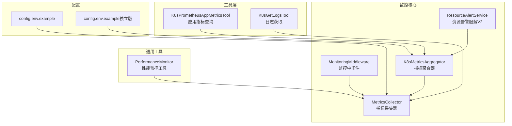
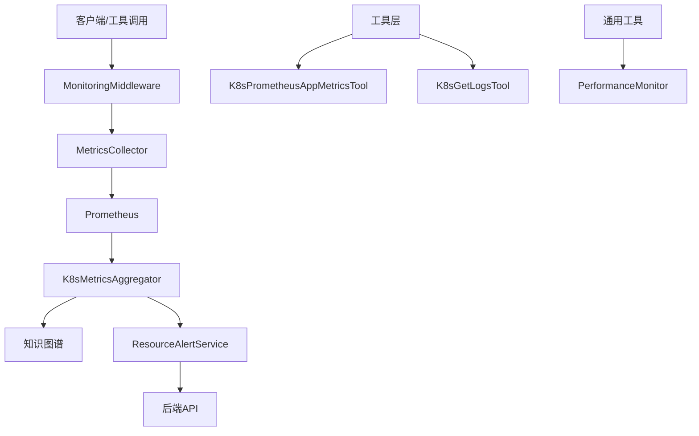
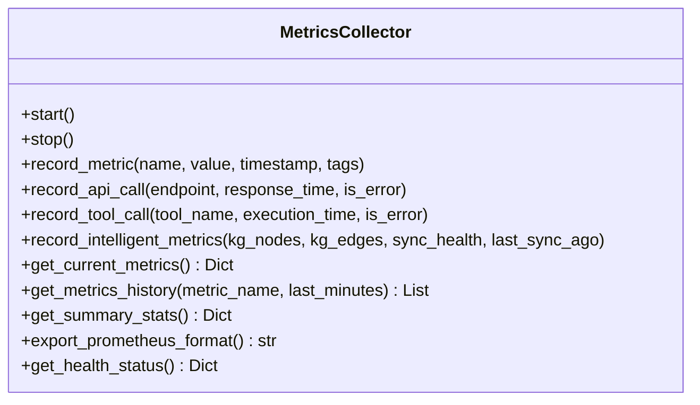
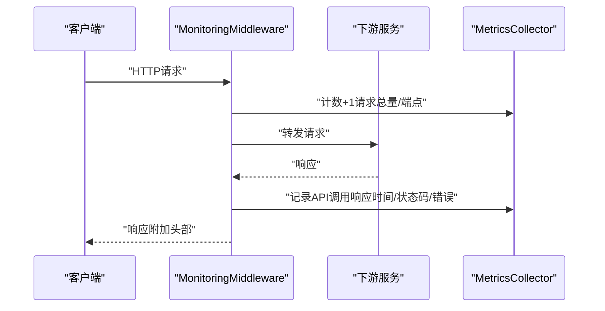
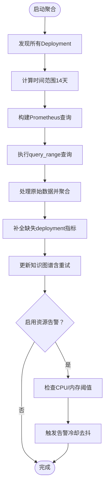
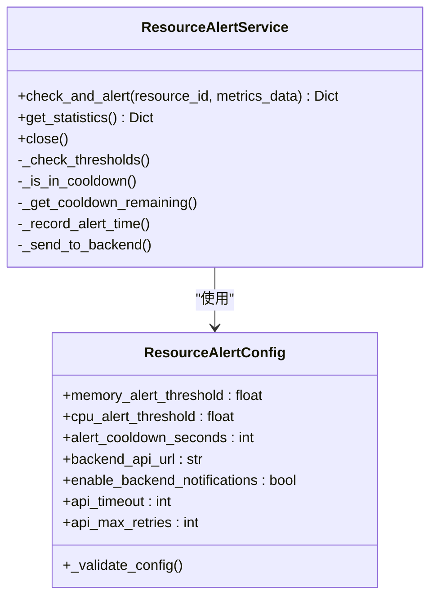
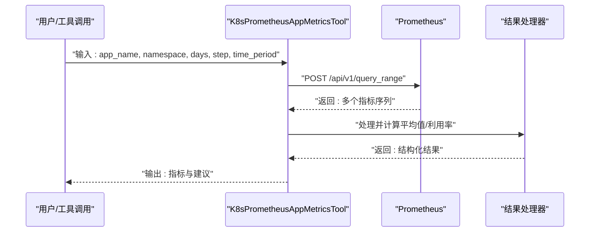
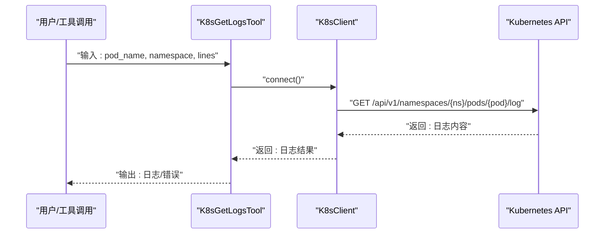
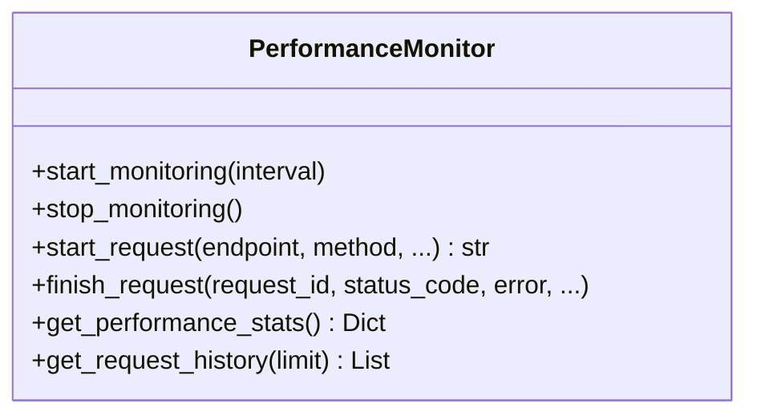
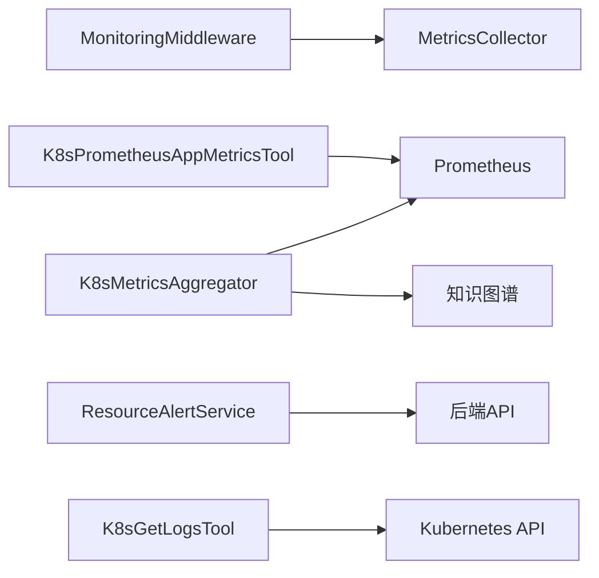

# 监控与日志管理

<cite>
**本文引用的文件**
- [metrics_collector.py](file://backend/src/k8s_mcp/core/metrics_collector.py)
- [monitoring_middleware.py](file://backend/src/k8s_mcp/core/monitoring_middleware.py)
- [metrics_aggregator.py](file://backend/src/k8s_mcp/core/metrics_aggregator.py)
- [resource_alert_service_v2.py](file://backend/src/k8s_mcp/core/resource_alert_service_v2.py)
- [k8s_prometheus_app_metrics.py](file://backend/src/k8s_mcp/tools/k8s_prometheus_app_metrics.py)
- [k8s_get_logs.py](file://backend/src/k8s_mcp/tools/k8s_get_logs.py)
- [monitoring.py](file://backend/src/utils/monitoring.py)
- [config.env.example](file://backend/config.env.example)
- [config.env.example（独立版）](file://archived/k8s-mcp-standalone/config.env.example)
- [deployment-guide.md（独立版）](file://archived/k8s-mcp-standalone/project_document/deployment-guide.md)
</cite>

## 目录
1. [简介](#简介)
2. [项目结构](#项目结构)
3. [核心组件](#核心组件)
4. [架构总览](#架构总览)
5. [详细组件分析](#详细组件分析)
6. [依赖关系分析](#依赖关系分析)
7. [性能考量](#性能考量)
8. [故障排查指南](#故障排查指南)
9. [结论](#结论)
10. [附录](#附录)

## 简介
本指南面向“钉钉K8s运维机器人”项目的监控与日志管理，目标是帮助运维与开发团队建立完善的可观测性体系，覆盖以下方面：
- 应用监控指标采集与展示：CPU使用率、内存占用、请求延迟、错误率等
- 日志系统配置与管理：结构化日志、日志级别、日志轮转策略
- 性能监控最佳实践：慢查询追踪、内存泄漏检测、并发瓶颈分析
- 告警机制配置：阈值设置、告警渠道与通知策略
- APM工具集成：Prometheus、Grafana、云监控服务
- 日志分析与问题诊断方法论
- 监控仪表板定制化建议与运维自动化脚本

## 项目结构
本项目采用模块化设计，监控与日志相关的核心代码集中在后端模块中，主要分布在以下位置：
- 核心监控：metrics_collector.py、monitoring_middleware.py、metrics_aggregator.py、resource_alert_service_v2.py
- 工具层：k8s_prometheus_app_metrics.py、k8s_get_logs.py
- 通用工具：monitoring.py
- 配置样例：config.env.example、config.env.example（独立版）

图表来源
- [metrics_collector.py:88-446](file://backend/src/k8s_mcp/core/metrics_collector.py#L88-L446)
- [monitoring_middleware.py:24-404](file://backend/src/k8s_mcp/core/monitoring_middleware.py#L24-L404)
- [metrics_aggregator.py:42-653](file://backend/src/k8s_mcp/core/metrics_aggregator.py#L42-L653)
- [resource_alert_service_v2.py:67-352](file://backend/src/k8s_mcp/core/resource_alert_service_v2.py#L67-L352)
- [k8s_prometheus_app_metrics.py:22-535](file://backend/src/k8s_mcp/tools/k8s_prometheus_app_metrics.py#L22-L535)
- [k8s_get_logs.py:16-91](file://backend/src/k8s_mcp/tools/k8s_get_logs.py#L16-L91)
- [monitoring.py:51-396](file://backend/src/utils/monitoring.py#L51-L396)
- [config.env.example:1-51](file://backend/config.env.example#L1-L51)
- [config.env.example（独立版）:1-54](file://archived/k8s-mcp-standalone/config.env.example#L1-L54)

章节来源
- [metrics_collector.py:1-446](file://backend/src/k8s_mcp/core/metrics_collector.py#L1-L446)
- [monitoring_middleware.py:1-404](file://backend/src/k8s_mcp/core/monitoring_middleware.py#L1-L404)
- [metrics_aggregator.py:1-653](file://backend/src/k8s_mcp/core/metrics_aggregator.py#L1-L653)
- [resource_alert_service_v2.py:1-352](file://backend/src/k8s_mcp/core/resource_alert_service_v2.py#L1-L352)
- [k8s_prometheus_app_metrics.py:1-535](file://backend/src/k8s_mcp/tools/k8s_prometheus_app_metrics.py#L1-L535)
- [k8s_get_logs.py:1-91](file://backend/src/k8s_mcp/tools/k8s_get_logs.py#L1-L91)
- [monitoring.py:1-396](file://backend/src/utils/monitoring.py#L1-L396)
- [config.env.example:1-51](file://backend/config.env.example#L1-L51)
- [config.env.example（独立版）:1-54](file://archived/k8s-mcp-standalone/config.env.example#L1-L54)

## 核心组件
- 指标采集器（MetricsCollector）：定时采集系统与进程指标，记录API与工具调用统计，并支持导出Prometheus格式
- 监控中间件（MonitoringMiddleware）：自动拦截HTTP请求，统计响应时间、状态码、错误数，并注入响应头
- 指标聚合器（K8sMetricsAggregator）：周期性从Prometheus拉取指标，计算14天平均利用率并写入知识图谱，支持资源告警
- 资源告警服务V2（ResourceAlertService）：检测CPU/内存利用率阈值，冷却去抖，向后端API上报告警
- 应用指标查询工具（K8sPrometheusAppMetricsTool）：按应用维度查询CPU/内存使用率与请求比例
- 日志获取工具（K8sGetLogsTool）：查询指定Pod日志
- 性能监控工具（PerformanceMonitor）：通用性能监控、请求追踪、调试信息收集

章节来源
- [metrics_collector.py:88-446](file://backend/src/k8s_mcp/core/metrics_collector.py#L88-L446)
- [monitoring_middleware.py:24-404](file://backend/src/k8s_mcp/core/monitoring_middleware.py#L24-L404)
- [metrics_aggregator.py:42-653](file://backend/src/k8s_mcp/core/metrics_aggregator.py#L42-L653)
- [resource_alert_service_v2.py:67-352](file://backend/src/k8s_mcp/core/resource_alert_service_v2.py#L67-L352)
- [k8s_prometheus_app_metrics.py:22-535](file://backend/src/k8s_mcp/tools/k8s_prometheus_app_metrics.py#L22-L535)
- [k8s_get_logs.py:16-91](file://backend/src/k8s_mcp/tools/k8s_get_logs.py#L16-L91)
- [monitoring.py:51-396](file://backend/src/utils/monitoring.py#L51-L396)

## 架构总览
下图展示了监控与日志管理的整体架构：指标采集器与中间件负责运行时指标收集；指标聚合器对接Prometheus进行周期性聚合；告警服务对阈值进行检测并上报；工具层提供应用指标查询与日志获取；通用工具提供性能监控与调试能力。

图表来源
- [monitoring_middleware.py:45-95](file://backend/src/k8s_mcp/core/monitoring_middleware.py#L45-L95)
- [metrics_collector.py:154-163](file://backend/src/k8s_mcp/core/metrics_collector.py#L154-L163)
- [metrics_aggregator.py:137-166](file://backend/src/k8s_mcp/core/metrics_aggregator.py#L137-L166)
- [resource_alert_service_v2.py:102-182](file://backend/src/k8s_mcp/core/resource_alert_service_v2.py#L102-L182)
- [k8s_prometheus_app_metrics.py:90-124](file://backend/src/k8s_mcp/tools/k8s_prometheus_app_metrics.py#L90-L124)
- [k8s_get_logs.py:59-91](file://backend/src/k8s_mcp/tools/k8s_get_logs.py#L59-L91)
- [monitoring.py:51-144](file://backend/src/utils/monitoring.py#L51-L144)

## 详细组件分析

### 指标采集器（MetricsCollector）
- 职责：采集系统CPU/内存/线程数、进程内存、Python GC、API与工具调用统计，维护历史队列与当前指标快照
- 关键能力：
  - 定时采集与派生指标计算（如RPS）
  - 记录与导出Prometheus格式指标
  - 健康状态查询与历史清理
- 性能特征：基于线程循环采集，异常时自动重试，避免阻塞主线程

图表来源
- [metrics_collector.py:88-446](file://backend/src/k8s_mcp/core/metrics_collector.py#L88-L446)

章节来源
- [metrics_collector.py:139-446](file://backend/src/k8s_mcp/core/metrics_collector.py#L139-L446)

### 监控中间件（MonitoringMiddleware）
- 职责：拦截HTTP请求，统计响应时间、状态码分布、异常数，注入响应头
- 关键能力：
  - 排除健康检查与指标端点
  - 自动记录API调用统计并联动指标采集器
- 性能特征：轻量中间件，避免影响业务逻辑

图表来源
- [monitoring_middleware.py:45-95](file://backend/src/k8s_mcp/core/monitoring_middleware.py#L45-L95)

章节来源
- [monitoring_middleware.py:24-95](file://backend/src/k8s_mcp/core/monitoring_middleware.py#L24-L95)

### 指标聚合器（K8sMetricsAggregator）
- 职责：周期性从Prometheus拉取指标，计算14天平均CPU/内存利用率，写入知识图谱，触发资源告警
- 关键能力：
  - 构建查询语句（CPU/内存使用率、请求量、limits）
  - 处理查询结果并聚合
  - 冷却去抖与失败重试
  - 导出统计信息与失败清单
- 性能特征：异步HTTP会话，带超时与错误统计

图表来源
- [metrics_aggregator.py:167-211](file://backend/src/k8s_mcp/core/metrics_aggregator.py#L167-L211)
- [metrics_aggregator.py:212-302](file://backend/src/k8s_mcp/core/metrics_aggregator.py#L212-L302)
- [metrics_aggregator.py:304-384](file://backend/src/k8s_mcp/core/metrics_aggregator.py#L304-L384)
- [metrics_aggregator.py:386-453](file://backend/src/k8s_mcp/core/metrics_aggregator.py#L386-L453)

章节来源
- [metrics_aggregator.py:42-653](file://backend/src/k8s_mcp/core/metrics_aggregator.py#L42-L653)

### 资源告警服务V2（ResourceAlertService）
- 职责：检测CPU/内存利用率阈值，冷却去抖，向后端API上报告警
- 关键能力：
  - 配置校验（阈值范围、冷却时间）
  - 告警冷却缓存与剩余时间计算
  - 后端通知开关与统计
- 性能特征：职责单一，便于扩展与替换通知通道

图表来源
- [resource_alert_service_v2.py:17-101](file://backend/src/k8s_mcp/core/resource_alert_service_v2.py#L17-L101)
- [resource_alert_service_v2.py:102-352](file://backend/src/k8s_mcp/core/resource_alert_service_v2.py#L102-L352)

章节来源
- [resource_alert_service_v2.py:67-352](file://backend/src/k8s_mcp/core/resource_alert_service_v2.py#L67-L352)

### 应用指标查询工具（K8sPrometheusAppMetricsTool）
- 职责：查询指定应用的CPU/内存使用率与请求比例，支持14天平均与1天近期两种模式
- 关键能力：
  - 构建Prometheus查询语句（使用率、请求量、limits）
  - 处理查询结果并计算平均值与利用率
  - 生成Pod级明细与分析建议
- 性能特征：异步HTTP会话，带超时与错误处理

图表来源
- [k8s_prometheus_app_metrics.py:90-124](file://backend/src/k8s_mcp/tools/k8s_prometheus_app_metrics.py#L90-L124)
- [k8s_prometheus_app_metrics.py:126-196](file://backend/src/k8s_mcp/tools/k8s_prometheus_app_metrics.py#L126-L196)
- [k8s_prometheus_app_metrics.py:198-229](file://backend/src/k8s_mcp/tools/k8s_prometheus_app_metrics.py#L198-L229)
- [k8s_prometheus_app_metrics.py:231-497](file://backend/src/k8s_mcp/tools/k8s_prometheus_app_metrics.py#L231-L497)

章节来源
- [k8s_prometheus_app_metrics.py:22-535](file://backend/src/k8s_mcp/tools/k8s_prometheus_app_metrics.py#L22-L535)

### 日志获取工具（K8sGetLogsTool）
- 职责：查询指定Pod日志，支持命名空间与行数限制
- 关键能力：
  - 参数校验与K8s客户端初始化
  - 错误分类与统一返回格式
- 性能特征：异步调用K8s API，日志量受lines限制

图表来源
- [k8s_get_logs.py:59-91](file://backend/src/k8s_mcp/tools/k8s_get_logs.py#L59-L91)

章节来源
- [k8s_get_logs.py:16-91](file://backend/src/k8s_mcp/tools/k8s_get_logs.py#L16-L91)

### 性能监控工具（PerformanceMonitor）
- 职责：通用性能监控、请求追踪、调试信息收集
- 关键能力：
  - 请求生命周期追踪（开始/结束/错误）
  - 统计最近窗口内的请求量、错误率、平均响应时间
  - 系统指标采样与异常阈值告警
- 性能特征：异步任务周期采样，线程安全队列

图表来源
- [monitoring.py:51-396](file://backend/src/utils/monitoring.py#L51-L396)

章节来源
- [monitoring.py:51-396](file://backend/src/utils/monitoring.py#L51-L396)

## 依赖关系分析
- 组件耦合：
  - MonitoringMiddleware依赖MetricsCollector进行指标记录
  - K8sMetricsAggregator依赖Prometheus与知识图谱
  - ResourceAlertService依赖后端API客户端
  - 工具层通过环境变量与配置交互
- 外部依赖：
  - Prometheus（指标查询与聚合）
  - Kubernetes API（日志与资源查询）
  - 后端API（告警上报）

图表来源
- [monitoring_middleware.py:21-21](file://backend/src/k8s_mcp/core/monitoring_middleware.py#L21-L21)
- [metrics_aggregator.py:19-19](file://backend/src/k8s_mcp/core/metrics_aggregator.py#L19-L19)
- [resource_alert_service_v2.py:14-14](file://backend/src/k8s_mcp/core/resource_alert_service_v2.py#L14-L14)
- [k8s_prometheus_app_metrics.py:19-19](file://backend/src/k8s_mcp/tools/k8s_prometheus_app_metrics.py#L19-L19)
- [k8s_get_logs.py:13-13](file://backend/src/k8s_mcp/tools/k8s_get_logs.py#L13-L13)

章节来源
- [monitoring_middleware.py:1-404](file://backend/src/k8s_mcp/core/monitoring_middleware.py#L1-L404)
- [metrics_aggregator.py:1-653](file://backend/src/k8s_mcp/core/metrics_aggregator.py#L1-L653)
- [resource_alert_service_v2.py:1-352](file://backend/src/k8s_mcp/core/resource_alert_service_v2.py#L1-L352)
- [k8s_prometheus_app_metrics.py:1-535](file://backend/src/k8s_mcp/tools/k8s_prometheus_app_metrics.py#L1-L535)
- [k8s_get_logs.py:1-91](file://backend/src/k8s_mcp/tools/k8s_get_logs.py#L1-L91)

## 性能考量
- 指标采集频率与历史容量：通过配置项控制采集间隔与历史队列上限，避免内存膨胀
- 异步与并发：Prometheus查询与K8s API调用均采用异步方式，降低阻塞风险
- 冷却去抖：告警服务内置冷却时间，避免频繁告警风暴
- 资源阈值：CPU/内存阈值与分析天数可调，兼顾准确性与实时性
- 建议：
  - 对高QPS场景适当增大采集间隔与历史容量
  - 使用Prometheus远端存储与压缩策略
  - 在工具层限制日志查询行数，避免大流量冲击

## 故障排查指南
- 指标缺失或异常：
  - 检查Prometheus连通性与认证配置
  - 确认采集器运行状态与健康检查
- 告警不触发或过于频繁：
  - 校验阈值与冷却时间配置
  - 查看告警统计与失败清单
- 日志查询失败：
  - 校验Pod名称、命名空间与权限
  - 控制日志行数，避免超时
- 性能问题定位：
  - 使用PerformanceMonitor查看最近窗口的请求统计
  - 结合工具层的指标查询与日志获取进行交叉验证

章节来源
- [metrics_aggregator.py:585-596](file://backend/src/k8s_mcp/core/metrics_aggregator.py#L585-L596)
- [resource_alert_service_v2.py:318-340](file://backend/src/k8s_mcp/core/resource_alert_service_v2.py#L318-L340)
- [k8s_get_logs.py:67-91](file://backend/src/k8s_mcp/tools/k8s_get_logs.py#L67-L91)
- [monitoring.py:207-242](file://backend/src/utils/monitoring.py#L207-L242)

## 结论
本项目提供了从指标采集、聚合、告警到日志查询与性能监控的完整链路。通过Prometheus与Grafana的集成，结合钉钉告警通道与工具层的查询能力，能够有效支撑K8s运维机器人的可观测性需求。建议在生产环境中完善配置与告警策略，持续优化阈值与冷却时间，并配合自动化脚本提升运维效率。

## 附录

### 监控指标与展示建议
- 关键指标：
  - CPU使用率：system.cpu_percent、process.cpu_percent
  - 内存使用率：system.memory_percent、process.memory_rss_mb
  - API性能：api.{endpoint}.response_time、api.{endpoint}.rps、api_summary.error_rate
  - 知识图谱：intelligent.kg_nodes、intelligent.kg_edges、intelligent.sync_health_score
- 展示建议：
  - 使用Grafana仪表板展示系统资源、API吞吐与延迟、知识图谱规模
  - 为告警阈值设置可视化阈值线与颜色分级

章节来源
- [metrics_collector.py:354-396](file://backend/src/k8s_mcp/core/metrics_collector.py#L354-L396)
- [metrics_aggregator.py:585-596](file://backend/src/k8s_mcp/core/metrics_aggregator.py#L585-L596)
- [deployment-guide.md（独立版）:910-1002](file://archived/k8s-mcp-standalone/project_document/deployment-guide.md#L910-L1002)

### 日志系统配置与管理
- 结构化日志：统一使用日志库记录字段化日志，便于检索与分析
- 日志级别：生产环境建议INFO及以上，必要时临时提升至DEBUG
- 日志轮转：结合系统日志轮转策略，控制单文件大小与保留天数
- 日志采集：建议接入集中式日志平台（如EFK/ELK），实现统一检索与告警

章节来源
- [config.env.example:16-16](file://backend/config.env.example#L16-L16)

### 告警机制配置
- 阈值设置：CPU/内存阈值、错误率阈值、同步延迟阈值
- 冷却时间：避免告警风暴，建议5分钟以上
- 通知策略：后端API开关、钉钉Webhook集成（参考配置样例）

章节来源
- [monitoring_middleware.py:239-296](file://backend/src/k8s_mcp/core/monitoring_middleware.py#L239-L296)
- [metrics_aggregator.py:635-652](file://backend/src/k8s_mcp/core/metrics_aggregator.py#L635-L652)
- [resource_alert_service_v2.py:17-65](file://backend/src/k8s_mcp/core/resource_alert_service_v2.py#L17-L65)
- [config.env.example（独立版）:15-54](file://archived/k8s-mcp-standalone/config.env.example#L15-L54)

### APM工具集成方案
- Prometheus：作为指标采集与聚合中心，支持多维查询与告警
- Grafana：基于Prometheus数据构建仪表板，展示关键指标趋势
- 云监控服务：可选接入云厂商监控（如阿里云云监控），实现统一告警与可视化

章节来源
- [metrics_aggregator.py:261-302](file://backend/src/k8s_mcp/core/metrics_aggregator.py#L261-L302)
- [deployment-guide.md（独立版）:910-1002](file://archived/k8s-mcp-standalone/project_document/deployment-guide.md#L910-L1002)

### 日志分析与问题诊断方法论
- 快速定位：先看错误率与响应时间，再深入到具体端点与工具
- 交叉验证：结合应用指标查询与日志获取，确认异常范围
- 历史回溯：利用历史指标与日志，复盘问题根因
- 性能回归：对比不同时间段的指标，识别性能退化

章节来源
- [k8s_prometheus_app_metrics.py:231-497](file://backend/src/k8s_mcp/tools/k8s_prometheus_app_metrics.py#L231-L497)
- [k8s_get_logs.py:59-91](file://backend/src/k8s_mcp/tools/k8s_get_logs.py#L59-L91)
- [monitoring.py:207-260](file://backend/src/utils/monitoring.py#L207-L260)

### 监控仪表板定制化建议
- 仪表板布局：左侧系统资源，中部API性能，右侧知识图谱与告警
- 主题与刷新：统一主题色，设置30秒刷新间隔
- 面板命名：清晰标注单位与阈值线，便于非专业用户理解

章节来源
- [deployment-guide.md（独立版）:910-1002](file://archived/k8s-mcp-standalone/project_document/deployment-guide.md#L910-L1002)

### 运维自动化脚本
- 指标聚合触发：提供强制聚合接口或命令，便于手动触发
- 告警上报：封装后端通知接口，支持批量上报与重试
- 日志导出：提供日志查询与导出脚本，支持按时间范围与关键字过滤

章节来源
- [metrics_aggregator.py:598-618](file://backend/src/k8s_mcp/core/metrics_aggregator.py#L598-L618)
- [resource_alert_service_v2.py:253-316](file://backend/src/k8s_mcp/core/resource_alert_service_v2.py#L253-L316)
- [k8s_get_logs.py:59-91](file://backend/src/k8s_mcp/tools/k8s_get_logs.py#L59-L91)