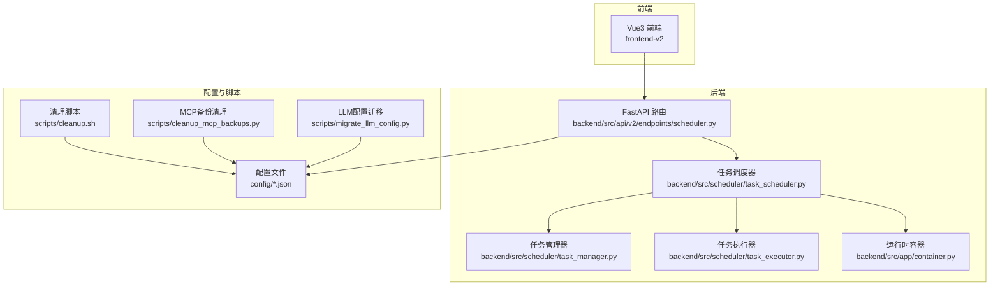
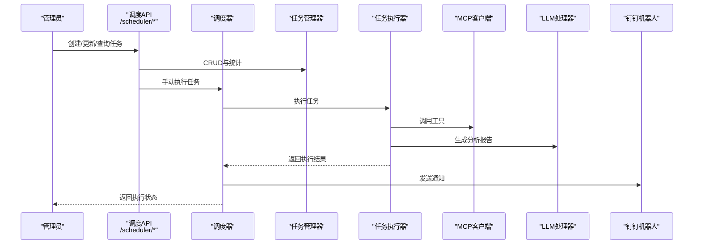
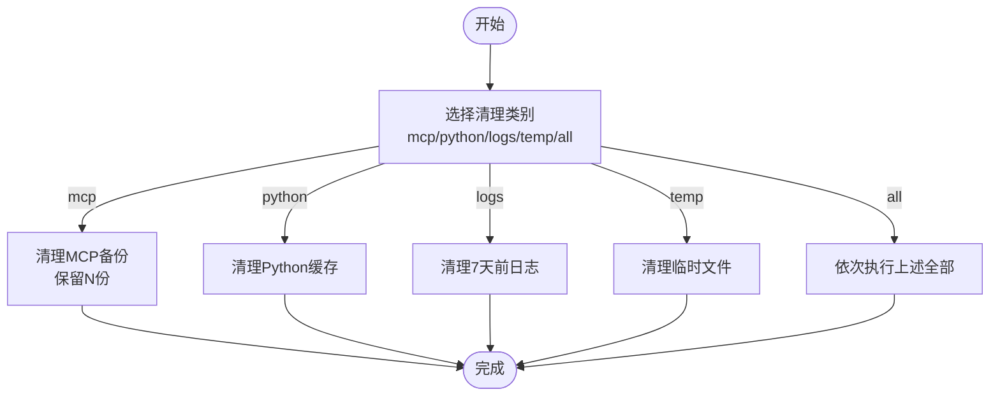
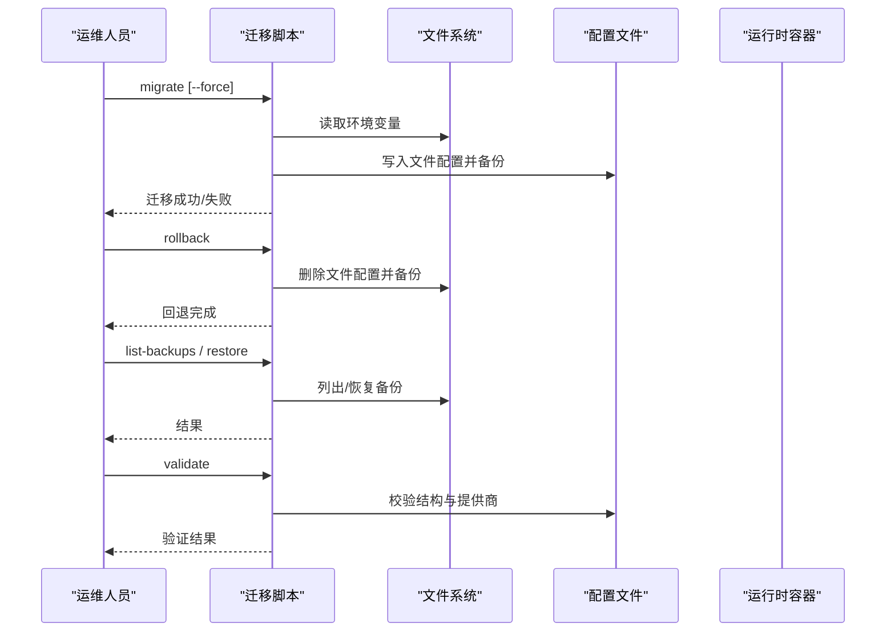
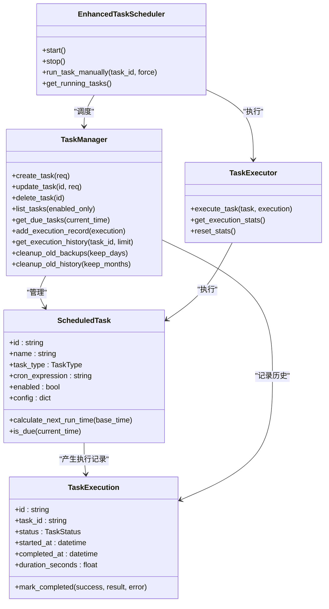
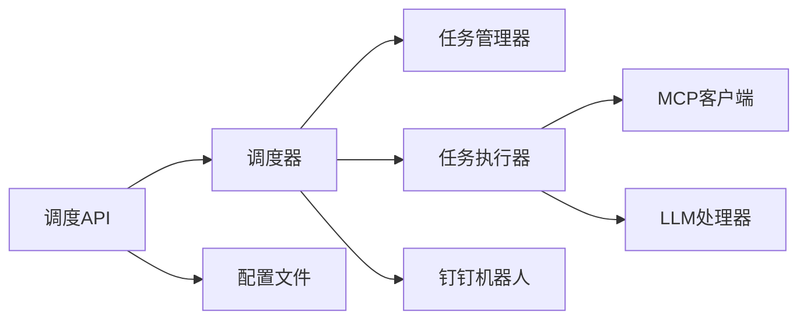

# 运维自动化

<cite>
**本文引用的文件**
- [README.md](file://README.md)
- [scripts/cleanup.sh](file://scripts/cleanup.sh)
- [scripts/cleanup_mcp_backups.py](file://scripts/cleanup_mcp_backups.py)
- [scripts/migrate_llm_config.py](file://scripts/migrate_llm_config.py)
- [config/scheduled_tasks.example.json](file://config/scheduled_tasks.example.json)
- [backend/src/scheduler/task_scheduler.py](file://backend/src/scheduler/task_scheduler.py)
- [backend/src/scheduler/models.py](file://backend/src/scheduler/models.py)
- [backend/src/scheduler/task_manager.py](file://backend/src/scheduler/task_manager.py)
- [backend/src/scheduler/task_executor.py](file://backend/src/scheduler/task_executor.py)
- [backend/src/api/v2/endpoints/scheduler.py](file://backend/src/api/v2/endpoints/scheduler.py)
- [backend/src/app/container.py](file://backend/src/app/container.py)
- [config/llm_config.example.json](file://config/llm_config.example.json)
- [config/mcp_config.example.json](file://config/mcp_config.example.json)
</cite>

## 目录
1. [简介](#简介)
2. [项目结构](#项目结构)
3. [核心组件](#核心组件)
4. [架构总览](#架构总览)
5. [详细组件分析](#详细组件分析)
6. [依赖分析](#依赖分析)
7. [性能考量](#性能考量)
8. [故障排查指南](#故障排查指南)
9. [结论](#结论)
10. [附录](#附录)

## 简介
本指南面向使用“钉钉K8s运维机器人”的运维工程师与平台管理员，围绕系统维护脚本、配置迁移、备份恢复、定期维护自动化、脚本定制与最佳实践、与外部运维平台集成（Ansible/SaltStack/自定义平台），以及安全与权限管理等方面，提供可操作的运维自动化方案。文档以仓库现有脚本与后端调度模块为依据，结合API与配置文件，给出落地步骤与可视化图示。

## 项目结构
项目采用前后端分离与后端服务内嵌工具的架构：后端提供API与调度能力，前端提供可视化界面；配置集中于config目录，运维脚本位于scripts目录；定时任务调度器位于backend/src/scheduler。

图表来源
- [backend/src/api/v2/endpoints/scheduler.py:1-661](file://backend/src/api/v2/endpoints/scheduler.py#L1-L661)
- [backend/src/scheduler/task_scheduler.py:1-487](file://backend/src/scheduler/task_scheduler.py#L1-L487)
- [backend/src/scheduler/task_manager.py:1-657](file://backend/src/scheduler/task_manager.py#L1-L657)
- [backend/src/scheduler/task_executor.py:1-736](file://backend/src/scheduler/task_executor.py#L1-L736)
- [backend/src/app/container.py:1-54](file://backend/src/app/container.py#L1-L54)
- [scripts/cleanup.sh:1-137](file://scripts/cleanup.sh#L1-L137)
- [scripts/cleanup_mcp_backups.py:1-148](file://scripts/cleanup_mcp_backups.py#L1-L148)
- [scripts/migrate_llm_config.py:1-411](file://scripts/migrate_llm_config.py#L1-L411)

章节来源
- [README.md:1-98](file://README.md#L1-L98)

## 核心组件
- 定时任务调度器：基于asyncio的增强调度器，负责周期性检查到期任务、并发控制、重试与通知。
- 任务管理器：负责任务配置的文件存储、热重载、备份与清理，提供CRUD与统计。
- 任务执行器：封装MCP客户端与LLM处理器，按任务类型执行具体动作（集群巡检、资源分析、健康监控、自定义）。
- API端点：提供任务的增删改查、手动执行、统计查询、Cron模板与校验、维护清理等接口。
- 运行时容器：统一持有MCP、LLM、钉钉机器人等长生命周期服务，支持动态重建LLM处理器。
- 维护脚本：提供日志、缓存、临时文件清理，MCP备份清理，以及LLM配置从环境变量向文件迁移的能力。

章节来源
- [backend/src/scheduler/task_scheduler.py:1-487](file://backend/src/scheduler/task_scheduler.py#L1-L487)
- [backend/src/scheduler/task_manager.py:1-657](file://backend/src/scheduler/task_manager.py#L1-L657)
- [backend/src/scheduler/task_executor.py:1-736](file://backend/src/scheduler/task_executor.py#L1-L736)
- [backend/src/api/v2/endpoints/scheduler.py:1-661](file://backend/src/api/v2/endpoints/scheduler.py#L1-L661)
- [backend/src/app/container.py:1-54](file://backend/src/app/container.py#L1-L54)

## 架构总览
调度器通过任务管理器加载配置，使用任务执行器调用MCP工具与LLM生成报告，执行完成后通过钉钉机器人发送通知。API端点提供配置与运维能力的统一入口。

图表来源
- [backend/src/api/v2/endpoints/scheduler.py:1-661](file://backend/src/api/v2/endpoints/scheduler.py#L1-L661)
- [backend/src/scheduler/task_scheduler.py:1-487](file://backend/src/scheduler/task_scheduler.py#L1-L487)
- [backend/src/scheduler/task_executor.py:1-736](file://backend/src/scheduler/task_executor.py#L1-L736)

## 详细组件分析

### 日志清理、缓存清理与临时文件管理
- 清理范围
  - MCP备份文件：仅保留最新N份，其余删除并统计释放空间。
  - Python缓存：清理__pycache__、.pyc、.pyo。
  - 日志文件：删除7天前的日志。
  - 临时文件：删除常见临时文件与系统隐藏文件。
- 使用方式
  - bash脚本提供统一入口，支持按类别清理与全量清理。
  - MCP备份清理脚本支持演练模式与实际执行，可自定义保留数量与目录。
- 注意事项
  - 在项目根目录运行脚本。
  - 演练模式不删除文件，仅展示将要删除的清单。

图表来源
- [scripts/cleanup.sh:1-137](file://scripts/cleanup.sh#L1-L137)
- [scripts/cleanup_mcp_backups.py:1-148](file://scripts/cleanup_mcp_backups.py#L1-L148)

章节来源
- [scripts/cleanup.sh:1-137](file://scripts/cleanup.sh#L1-L137)
- [scripts/cleanup_mcp_backups.py:1-148](file://scripts/cleanup_mcp_backups.py#L1-L148)

### LLM配置迁移与回退
- 功能概览
  - 从环境变量读取LLM配置，生成文件配置（config/llm_config.json）。
  - 支持强制覆盖、备份现有配置、生成迁移记录。
  - 支持回退到环境变量模式（删除文件配置）。
  - 支持列出/恢复备份、验证配置文件结构。
- 使用场景
  - 从环境变量驱动迁移到文件驱动，便于版本化与团队协作。
  - 配置变更前自动备份，出现问题可快速回滚。
- 与运行时的关系
  - 运行时容器提供“重建LLM处理器”能力，配合配置文件热生效。

图表来源
- [scripts/migrate_llm_config.py:1-411](file://scripts/migrate_llm_config.py#L1-L411)
- [backend/src/app/container.py:1-54](file://backend/src/app/container.py#L1-L54)

章节来源
- [scripts/migrate_llm_config.py:1-411](file://scripts/migrate_llm_config.py#L1-L411)
- [backend/src/app/container.py:1-54](file://backend/src/app/container.py#L1-L54)
- [config/llm_config.example.json:1-45](file://config/llm_config.example.json#L1-L45)

### MCP配置备份清理
- 功能要点
  - 查找匹配的备份文件，按修改时间排序，保留最新N个。
  - 支持演练模式（不删除）、实际删除、自定义保留数量与目录。
  - 输出删除数量、释放空间与保留数量统计。
- 使用建议
  - 生产环境建议先演练，确认删除清单后再执行。
  - 结合定期维护任务自动清理，避免磁盘膨胀。

章节来源
- [scripts/cleanup_mcp_backups.py:1-148](file://scripts/cleanup_mcp_backups.py#L1-L148)

### 定时任务调度与运维自动化
- 任务类型
  - 集群巡检、资源分析、健康监控、自定义任务。
- 调度与执行
  - 调度器每分钟检查一次到期任务，使用信号量控制并发。
  - 执行器按任务类型调用MCP工具与LLM生成报告。
  - 支持重试、通知（钉钉机器人）、执行历史与统计。
- API能力
  - 任务的增删改查、手动执行、统计查询、Cron模板与校验、维护清理、状态查询。
- 配置文件
  - config/scheduled_tasks.json为任务配置文件，支持备份与热重载。

图表来源
- [backend/src/scheduler/models.py:1-444](file://backend/src/scheduler/models.py#L1-L444)
- [backend/src/scheduler/task_manager.py:1-657](file://backend/src/scheduler/task_manager.py#L1-L657)
- [backend/src/scheduler/task_executor.py:1-736](file://backend/src/scheduler/task_executor.py#L1-L736)
- [backend/src/scheduler/task_scheduler.py:1-487](file://backend/src/scheduler/task_scheduler.py#L1-L487)

章节来源
- [backend/src/scheduler/models.py:1-444](file://backend/src/scheduler/models.py#L1-L444)
- [backend/src/scheduler/task_manager.py:1-657](file://backend/src/scheduler/task_manager.py#L1-L657)
- [backend/src/scheduler/task_executor.py:1-736](file://backend/src/scheduler/task_executor.py#L1-L736)
- [backend/src/scheduler/task_scheduler.py:1-487](file://backend/src/scheduler/task_scheduler.py#L1-L487)
- [backend/src/api/v2/endpoints/scheduler.py:1-661](file://backend/src/api/v2/endpoints/scheduler.py#L1-L661)
- [config/scheduled_tasks.example.json:1-8](file://config/scheduled_tasks.example.json#L1-L8)

### 备份与恢复（配置与任务历史）
- LLM配置备份与恢复
  - 迁移脚本自动备份现有配置，支持列出与恢复备份。
  - 回退到环境变量模式时同样备份当前文件配置。
- 任务配置备份与清理
  - 任务管理器自动备份配置文件，保留最近10个备份。
  - 提供清理旧备份与历史的维护接口。
- 任务执行历史
  - 按月分目录保存执行历史，保留最近100条，支持清理旧历史。

章节来源
- [scripts/migrate_llm_config.py:1-411](file://scripts/migrate_llm_config.py#L1-L411)
- [backend/src/scheduler/task_manager.py:1-657](file://backend/src/scheduler/task_manager.py#L1-L657)

### 定时任务调度与执行监控
- 调度器
  - 每分钟检查一次到期任务，使用信号量限制并发。
  - 支持重试与通知（钉钉机器人），失败时发送通知。
- 执行器
  - 集成MCP工具与LLM，生成报告并提取摘要。
  - 统计执行次数、成功率与平均耗时。
- API
  - 提供任务列表、手动执行、统计、运行中任务查询、状态查询、维护清理等。

章节来源
- [backend/src/scheduler/task_scheduler.py:1-487](file://backend/src/scheduler/task_scheduler.py#L1-L487)
- [backend/src/scheduler/task_executor.py:1-736](file://backend/src/scheduler/task_executor.py#L1-L736)
- [backend/src/api/v2/endpoints/scheduler.py:1-661](file://backend/src/api/v2/endpoints/scheduler.py#L1-L661)

### 运维脚本定制与最佳实践
- 脚本模板
  - 参考现有脚本的参数解析、日志输出、错误处理与退出码规范。
  - 清理脚本提供统一入口与分类清理，适合作为模板扩展。
- 最佳实践
  - 演练优先：涉及删除的脚本先演练，确认影响面。
  - 备份先行：重要配置与历史在变更前备份。
  - 权限最小化：仅授予执行所需权限，避免sudo滥用。
  - 幂等性：多次执行不应产生副作用。
  - 监控告警：将关键脚本纳入监控与告警。

章节来源
- [scripts/cleanup.sh:1-137](file://scripts/cleanup.sh#L1-L137)
- [scripts/cleanup_mcp_backups.py:1-148](file://scripts/cleanup_mcp_backups.py#L1-L148)
- [scripts/migrate_llm_config.py:1-411](file://scripts/migrate_llm_config.py#L1-L411)

### 与外部运维平台集成
- Ansible
  - 使用Ansible调用现有脚本与API：清理脚本通过shell模块执行；定时任务通过HTTP API进行创建/更新/手动执行。
- SaltStack
  - 通过salt.modules.shell与http模块对接脚本与API，实现任务编排与状态校验。
- 自定义运维平台
  - 通过API端点实现任务编排、执行监控与告警联动，平台侧负责权限与审计。

章节来源
- [backend/src/api/v2/endpoints/scheduler.py:1-661](file://backend/src/api/v2/endpoints/scheduler.py#L1-L661)

### 安全考虑与权限管理
- 配置安全
  - 配置文件不提交敏感信息，使用示例文件复制为运行时文件。
  - LLM配置支持数据脱敏与日志开关，避免泄露。
- 权限控制
  - API端点按权限位控制读写与运行，防止越权操作。
  - 定时任务通知通过钉钉机器人发送，需配置合法webhook。
- 运行时重建
  - 容器提供重建LLM处理器能力，确保配置变更即时生效。

章节来源
- [config/README.md:1-17](file://config/README.md#L1-L17)
- [config/llm_config.example.json:1-45](file://config/llm_config.example.json#L1-L45)
- [backend/src/api/v2/endpoints/scheduler.py:1-661](file://backend/src/api/v2/endpoints/scheduler.py#L1-L661)
- [backend/src/app/container.py:1-54](file://backend/src/app/container.py#L1-L54)

## 依赖分析
- 组件耦合
  - 调度器依赖任务管理器与任务执行器；执行器依赖MCP客户端与LLM处理器；API端点依赖调度器与管理器。
- 外部依赖
  - croniter用于Cron表达式解析；watchdog用于配置文件热重载（可选）。
- 循环依赖
  - 通过模块化与延迟初始化避免循环依赖。

图表来源
- [backend/src/api/v2/endpoints/scheduler.py:1-661](file://backend/src/api/v2/endpoints/scheduler.py#L1-L661)
- [backend/src/scheduler/task_scheduler.py:1-487](file://backend/src/scheduler/task_scheduler.py#L1-L487)
- [backend/src/scheduler/task_executor.py:1-736](file://backend/src/scheduler/task_executor.py#L1-L736)

章节来源
- [backend/src/scheduler/models.py:1-444](file://backend/src/scheduler/models.py#L1-L444)
- [backend/src/scheduler/task_manager.py:1-657](file://backend/src/scheduler/task_manager.py#L1-L657)

## 性能考量
- 并发控制：调度器使用信号量限制并发任务数量，避免资源争用。
- 执行统计：执行器记录执行次数、成功数、失败数与平均耗时，便于容量规划。
- 资源分析：执行器对Prometheus数据进行分析并生成报告，注意网络与LLM调用的超时设置。
- 历史与备份：定期清理旧备份与历史，避免I/O与存储压力。

## 故障排查指南
- 任务未执行
  - 检查任务是否启用、Cron表达式是否有效、下次执行时间是否正确。
  - 通过API查询运行中任务与调度器状态。
- 执行失败
  - 查看执行历史与错误信息，确认MCP工具可用性与LLM配置。
  - 如需重试，检查重试次数与延迟设置。
- 配置变更未生效
  - 若使用文件配置，确认热重载是否启用；必要时重启服务。
  - LLM配置可通过容器重建处理器即时生效。
- 备份与恢复
  - 使用迁移脚本列出/恢复备份；任务管理器提供清理旧备份与历史的维护接口。

章节来源
- [backend/src/api/v2/endpoints/scheduler.py:1-661](file://backend/src/api/v2/endpoints/scheduler.py#L1-L661)
- [backend/src/scheduler/task_manager.py:1-657](file://backend/src/scheduler/task_manager.py#L1-L657)
- [backend/src/scheduler/task_executor.py:1-736](file://backend/src/scheduler/task_executor.py#L1-L736)
- [backend/src/app/container.py:1-54](file://backend/src/app/container.py#L1-L54)

## 结论
本指南基于仓库现有脚本与调度模块，提供了日志/缓存/临时文件清理、LLM配置迁移、MCP备份清理、定时任务调度与运维自动化、备份恢复、脚本定制与安全权限管理的完整方案。通过API与脚本的协同，可实现标准化、可观测、可回滚的运维自动化流程。

## 附录
- 常用命令
  - 清理：bash scripts/cleanup.sh [mcp|python|logs|temp|all]
  - MCP备份清理：python scripts/cleanup_mcp_backups.py [--execute --keep N --backup-dir PATH]
  - LLM配置迁移：python scripts/migrate_llm_config.py migrate [--force]
  - 回退：python scripts/migrate_llm_config.py rollback
  - 列表/恢复备份：python scripts/migrate_llm_config.py list-backups / restore <backup_name>
  - 验证：python scripts/migrate_llm_config.py validate
- 配置文件
  - 定时任务：config/scheduled_tasks.json（参考示例）
  - LLM：config/llm_config.json（参考示例）
  - MCP：config/mcp_config.json（参考示例）

章节来源
- [scripts/cleanup.sh:1-137](file://scripts/cleanup.sh#L1-L137)
- [scripts/cleanup_mcp_backups.py:1-148](file://scripts/cleanup_mcp_backups.py#L1-L148)
- [scripts/migrate_llm_config.py:1-411](file://scripts/migrate_llm_config.py#L1-L411)
- [config/scheduled_tasks.example.json:1-8](file://config/scheduled_tasks.example.json#L1-L8)
- [config/llm_config.example.json:1-45](file://config/llm_config.example.json#L1-L45)
- [config/mcp_config.example.json:1-66](file://config/mcp_config.example.json#L1-L66)