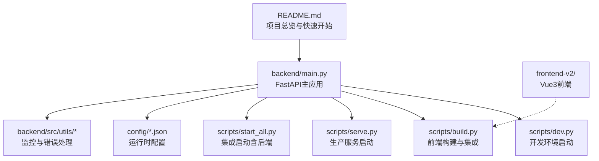
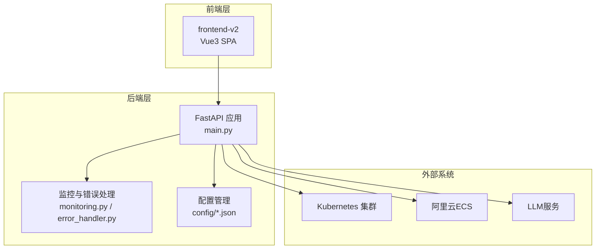
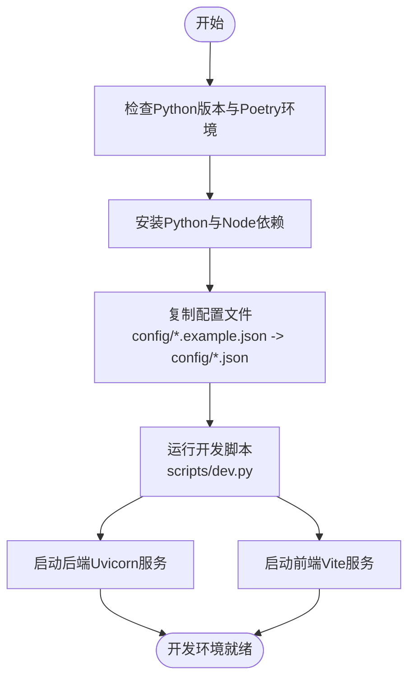
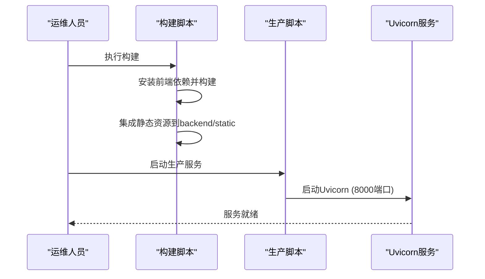
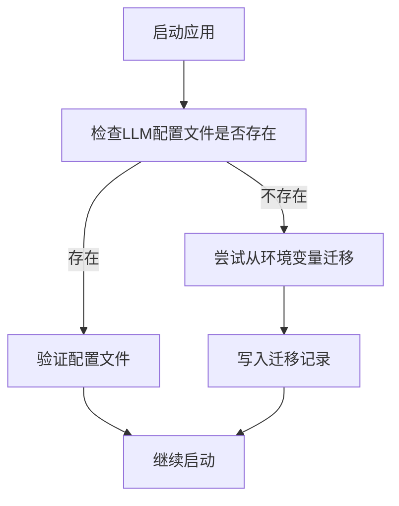
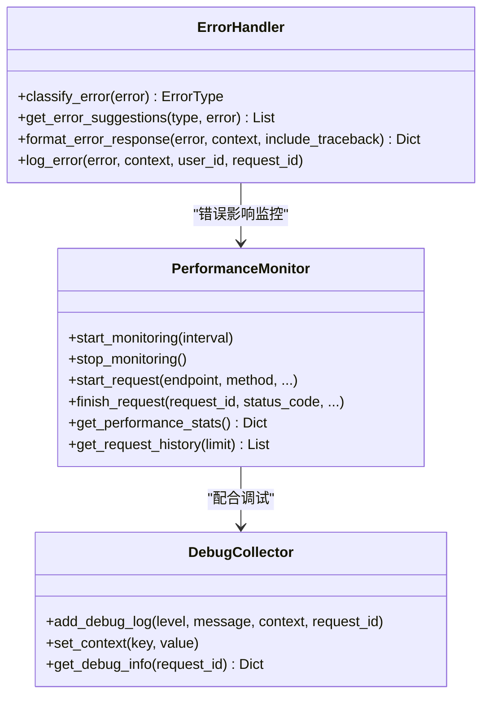
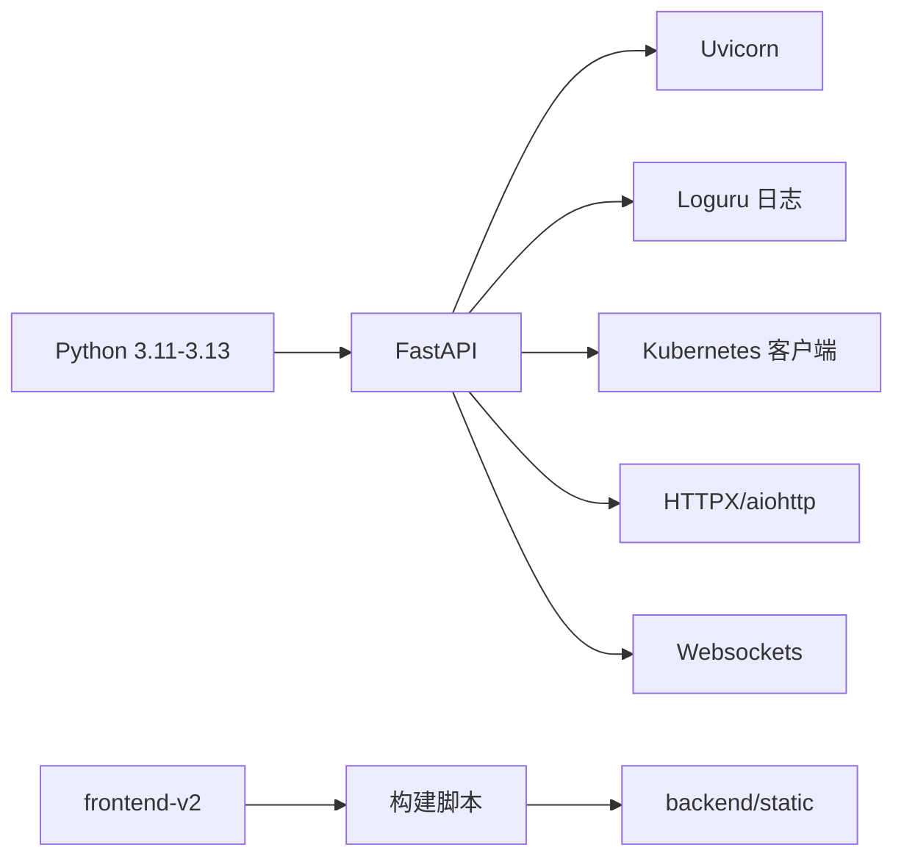
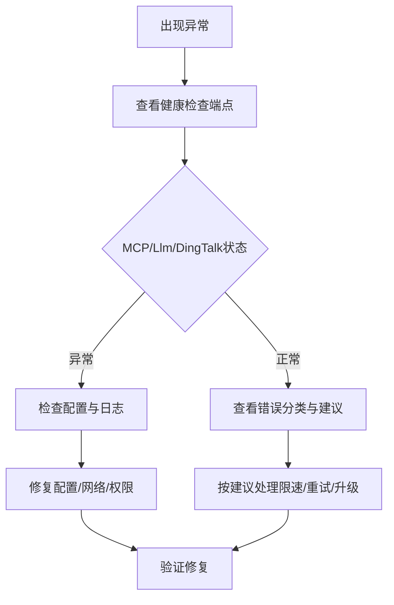

# 部署与运维

<cite>
**本文引用的文件**
- [README.md](file://README.md)
- [pyproject.toml](file://pyproject.toml)
- [backend/main.py](file://backend/main.py)
- [scripts/start_all.py](file://scripts/start_all.py)
- [scripts/dev.py](file://scripts/dev.py)
- [scripts/serve.py](file://scripts/serve.py)
- [scripts/build.py](file://scripts/build.py)
- [config/README.md](file://config/README.md)
- [config/llm_config.example.json](file://config/llm_config.example.json)
- [config/mcp_config.example.json](file://config/mcp_config.example.json)
- [config/skills.example.json](file://config/skills.example.json)
- [config/scheduled_tasks.example.json](file://config/scheduled_tasks.example.json)
- [backend/src/utils/monitoring.py](file://backend/src/utils/monitoring.py)
- [backend/src/utils/error_handler.py](file://backend/src/utils/error_handler.py)
- [project_document/技术架构与配置指南.md](file://project_document/技术架构与配置指南.md)
</cite>

## 目录
1. [简介](#简介)
2. [项目结构](#项目结构)
3. [核心组件](#核心组件)
4. [架构总览](#架构总览)
5. [详细组件分析](#详细组件分析)
6. [依赖关系分析](#依赖关系分析)
7. [性能考量](#性能考量)
8. [故障排除指南](#故障排除指南)
9. [结论](#结论)
10. [附录](#附录)

## 简介
本指南面向运维工程师与开发者，提供钉钉K8s运维机器人的完整部署与运维方案。内容涵盖开发环境搭建、生产部署流程、监控与日志管理、自动化运维脚本使用、备份与恢复策略、故障排除、性能优化与容量规划，以及CI/CD最佳实践。

## 项目结构
项目采用多模块组织方式：后端API（含进程内K8s/ECS工具）、前端Vue3应用、统一配置目录、归档的历史独立MCP工程与项目文档。核心入口为后端主程序，提供FastAPI服务与静态资源托管，并通过脚本实现开发、构建与生产启动。

**图表来源**
- [README.md:1-98](file://README.md#L1-L98)
- [backend/main.py:1-494](file://backend/main.py#L1-L494)
- [scripts/dev.py:1-219](file://scripts/dev.py#L1-L219)
- [scripts/build.py:1-181](file://scripts/build.py#L1-L181)
- [scripts/serve.py:1-119](file://scripts/serve.py#L1-L119)
- [scripts/start_all.py:1-306](file://scripts/start_all.py#L1-L306)

**章节来源**
- [README.md:64-98](file://README.md#L64-L98)
- [backend/main.py:302-450](file://backend/main.py#L302-L450)

## 核心组件
- 应用入口与生命周期：后端主程序负责日志初始化、环境变量加载、配置迁移检查、服务初始化与清理、健康检查端点、CORS与静态资源挂载。
- 配置体系：统一在config目录下管理LLM/MCP/技能/定时任务等配置，支持文件与环境变量混合，具备迁移与热重载能力。
- 运维脚本：提供开发、构建、生产启动与集成启动脚本，覆盖多场景启动需求。
- 监控与错误处理：内置性能监控器与统一错误处理器，便于定位问题与优化性能。

**章节来源**
- [backend/main.py:37-129](file://backend/main.py#L37-L129)
- [backend/main.py:148-270](file://backend/main.py#L148-L270)
- [backend/main.py:464-474](file://backend/main.py#L464-L474)
- [config/README.md:1-17](file://config/README.md#L1-L17)
- [config/llm_config.example.json:1-45](file://config/llm_config.example.json#L1-L45)
- [config/mcp_config.example.json:1-66](file://config/mcp_config.example.json#L1-L66)
- [config/skills.example.json:1-53](file://config/skills.example.json#L1-L53)
- [config/scheduled_tasks.example.json:1-8](file://config/scheduled_tasks.example.json#L1-L8)
- [backend/src/utils/monitoring.py:51-396](file://backend/src/utils/monitoring.py#L51-L396)
- [backend/src/utils/error_handler.py:28-334](file://backend/src/utils/error_handler.py#L28-L334)

## 架构总览
系统采用前后端一体化部署：后端FastAPI提供API与静态资源托管，前端Vue3应用通过SPA方式运行，后端统一对外暴露单一端口。MCP工具默认以内置进程方式运行，无需独立MCP服务。

**图表来源**
- [backend/main.py:302-450](file://backend/main.py#L302-L450)
- [backend/src/utils/monitoring.py:51-396](file://backend/src/utils/monitoring.py#L51-L396)
- [backend/src/utils/error_handler.py:28-334](file://backend/src/utils/error_handler.py#L28-L334)
- [config/llm_config.example.json:1-45](file://config/llm_config.example.json#L1-L45)
- [config/mcp_config.example.json:1-66](file://config/mcp_config.example.json#L1-L66)

## 详细组件分析

### 开发环境搭建
- Python与Poetry：使用指定Python版本并通过Poetry管理依赖；前端依赖通过npm安装。
- 环境变量与配置：复制示例配置文件至运行时名称，避免提交敏感信息。
- 启动方式：提供开发脚本并行启动后端与前端，或分别启动后端/前端。

**图表来源**
- [README.md:17-41](file://README.md#L17-L41)
- [scripts/dev.py:28-150](file://scripts/dev.py#L28-L150)

**章节来源**
- [README.md:17-41](file://README.md#L17-L41)
- [scripts/dev.py:28-150](file://scripts/dev.py#L28-L150)

### 生产环境部署
- 前端构建：构建脚本自动安装前端依赖、执行构建并将产物集成到后端static目录。
- 服务启动：生产脚本在检查构建产物后启动Uvicorn服务，默认监听8000端口。
- 集成启动：集成脚本负责后端服务启动与日志输出，便于一次性启动多个子进程。

**图表来源**
- [scripts/build.py:71-179](file://scripts/build.py#L71-L179)
- [scripts/serve.py:63-117](file://scripts/serve.py#L63-L117)
- [scripts/start_all.py:225-270](file://scripts/start_all.py#L225-L270)

**章节来源**
- [scripts/build.py:71-179](file://scripts/build.py#L71-L179)
- [scripts/serve.py:63-117](file://scripts/serve.py#L63-L117)
- [scripts/start_all.py:225-270](file://scripts/start_all.py#L225-L270)

### 配置管理与迁移
- 配置文件：LLM/MCP/技能/定时任务等配置均在config目录下管理，示例文件需复制为运行时文件。
- 迁移机制：主程序启动时自动检查并迁移LLM配置，支持从环境变量迁移至文件。
- 热重载：配置变更后可触发热重载，保障运行时平滑更新。

**图表来源**
- [backend/main.py:62-129](file://backend/main.py#L62-L129)
- [config/README.md:1-17](file://config/README.md#L1-L17)

**章节来源**
- [backend/main.py:62-129](file://backend/main.py#L62-L129)
- [config/README.md:1-17](file://config/README.md#L1-L17)

### 监控与日志管理
- 日志：控制台与文件日志分离，文件日志按周轮转、保留4周；支持通过环境变量调整日志级别。
- 性能监控：内置性能监控器，统计请求总量、平均响应时间、错误率、活跃连接数等；可启动系统指标采集（psutil可用时）。
- 错误处理：统一错误分类与建议，支持流式错误格式化，便于前端展示与排查。

**图表来源**
- [backend/src/utils/monitoring.py:51-396](file://backend/src/utils/monitoring.py#L51-L396)
- [backend/src/utils/error_handler.py:28-334](file://backend/src/utils/error_handler.py#L28-L334)

**章节来源**
- [backend/main.py:37-52](file://backend/main.py#L37-L52)
- [backend/src/utils/monitoring.py:51-396](file://backend/src/utils/monitoring.py#L51-L396)
- [backend/src/utils/error_handler.py:28-334](file://backend/src/utils/error_handler.py#L28-L334)

### 运维自动化脚本
- 开发脚本：并行启动后端与前端，支持单独启动后端/前端，便于联调。
- 构建脚本：自动安装前端依赖、执行构建并将SPA产物集成到后端静态目录。
- 生产脚本：检查构建产物后启动Uvicorn服务，支持自定义环境变量。
- 集成启动：负责后端服务启动与日志输出，便于一次性启动多个子进程。

**章节来源**
- [scripts/dev.py:92-150](file://scripts/dev.py#L92-L150)
- [scripts/build.py:24-111](file://scripts/build.py#L24-L111)
- [scripts/serve.py:63-117](file://scripts/serve.py#L63-L117)
- [scripts/start_all.py:225-270](file://scripts/start_all.py#L225-L270)

### 备份与恢复策略
- 配置备份：配置管理器具备自动备份与恢复能力，迁移过程会生成迁移记录文件，便于回滚。
- 建议流程：定期导出配置文件，保存至安全位置；变更前先备份，变更后验证可用性。

**章节来源**
- [project_document/技术架构与配置指南.md:56-62](file://project_document/技术架构与配置指南.md#L56-L62)
- [backend/main.py:86-103](file://backend/main.py#L86-L103)

### CI/CD流程与自动化部署最佳实践
- 构建阶段：在CI中执行前端构建与后端依赖安装，生成可部署镜像或制品。
- 部署阶段：使用容器编排平台部署，结合健康检查与滚动更新策略。
- 发布策略：灰度发布、回滚预案与变更通知机制，确保变更可控。

**章节来源**
- [project_document/技术架构与配置指南.md:333-383](file://project_document/技术架构与配置指南.md#L333-L383)

## 依赖关系分析
- 语言与框架：Python 3.11–3.13、FastAPI、Uvicorn、Pydantic、HTTPX、Websocket、Kubernetes客户端、Loguru、Tenacity等。
- 前端：Vue3 + Vite，构建后静态资源集成至后端。
- 配置：统一在config目录管理，支持文件与环境变量混合。

**图表来源**
- [pyproject.toml:9-51](file://pyproject.toml#L9-L51)
- [scripts/build.py:24-47](file://scripts/build.py#L24-L47)

**章节来源**
- [pyproject.toml:9-51](file://pyproject.toml#L9-L51)
- [scripts/build.py:24-47](file://scripts/build.py#L24-L47)

## 性能考量
- 监控指标：请求总量、平均响应时间、错误率、活跃连接数、系统资源使用率（CPU/内存/磁盘）。
- 优化建议：合理设置并发与重试策略、启用缓存、限制请求体大小、开启访问日志与错误日志分级。
- 容量规划：根据峰值QPS与响应时间目标估算实例数量与资源规格，预留20–30%冗余。

**章节来源**
- [backend/src/utils/monitoring.py:51-242](file://backend/src/utils/monitoring.py#L51-L242)
- [backend/src/utils/monitoring.py:386-396](file://backend/src/utils/monitoring.py#L386-L396)

## 故障排除指南
- 健康检查：通过健康端点检查MCP连接、LLM与钉钉机器人状态。
- 错误分类：根据错误类型提供针对性建议，如网络、认证、速率限制、服务器错误等。
- 常见问题：配置文件缺失、MCP连接失败、热重载不生效等，可通过对应API或脚本诊断。

**图表来源**
- [backend/main.py:464-474](file://backend/main.py#L464-L474)
- [backend/src/utils/error_handler.py:31-156](file://backend/src/utils/error_handler.py#L31-L156)

**章节来源**
- [backend/main.py:464-474](file://backend/main.py#L464-L474)
- [backend/src/utils/error_handler.py:31-156](file://backend/src/utils/error_handler.py#L31-L156)

## 结论
本指南提供了从开发到生产的完整落地路径：明确的环境与依赖要求、清晰的构建与启动流程、完善的监控与日志策略、可操作的故障排除与备份恢复方法，以及可扩展的CI/CD与性能优化建议。建议在生产环境中结合企业安全与合规要求，完善访问控制、密钥管理与审计日志。

## 附录
- 常用命令
  - 开发：poetry run dev
  - 构建：poetry run build
  - 生产：poetry run serve 或 poetry run start
  - 集成启动：poetry run start-all
- 关键端点
  - 健康检查：/health
  - API文档：/docs
  - SPA首页：/spa/

**章节来源**
- [README.md:78-98](file://README.md#L78-L98)
- [backend/main.py:464-474](file://backend/main.py#L464-L474)