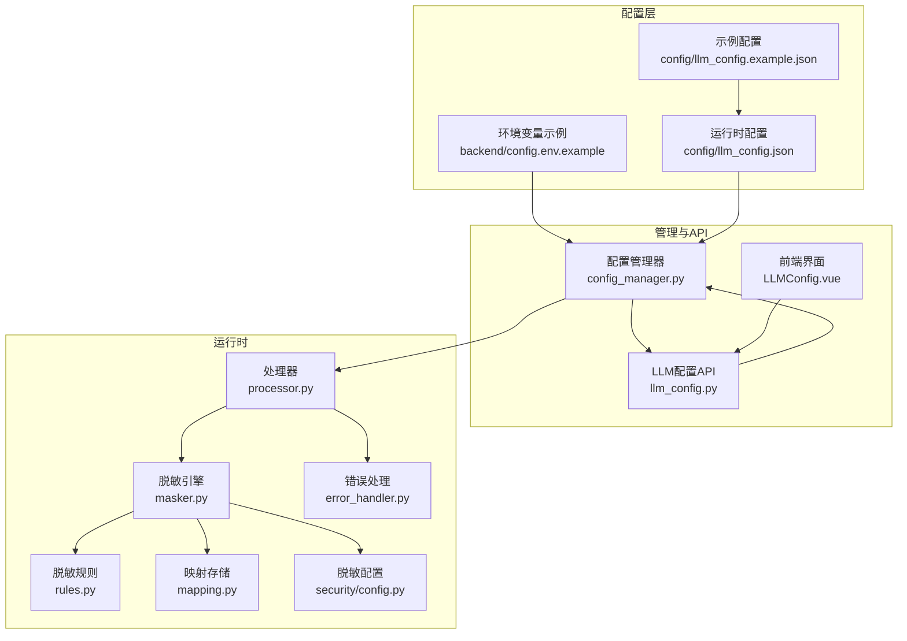
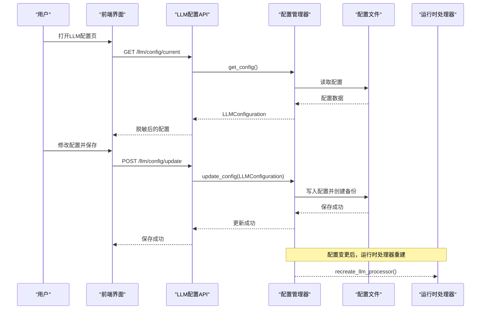
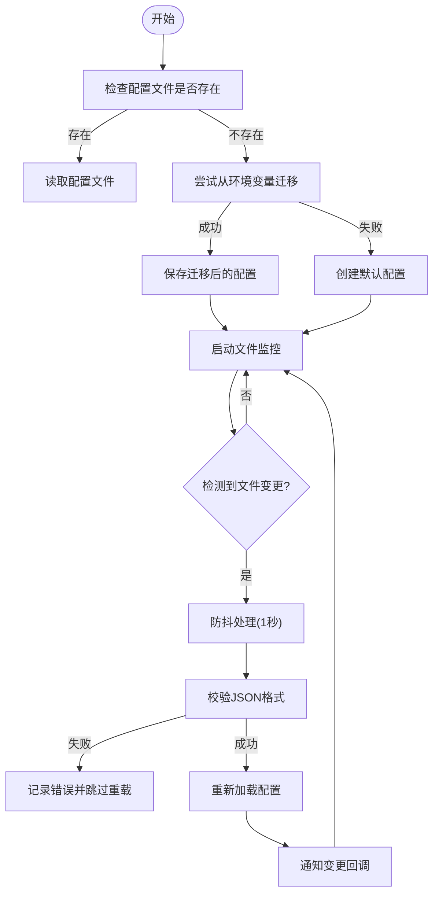
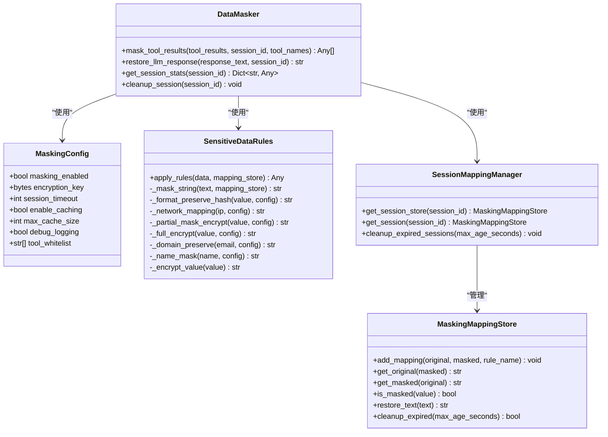
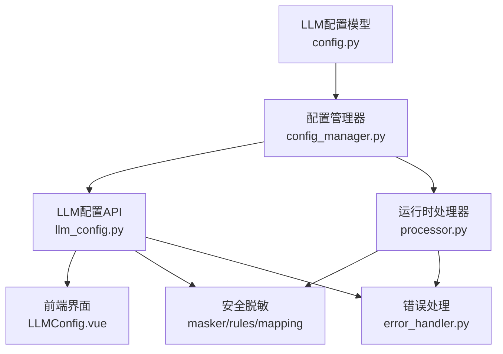

# LLM配置管理

<cite>
**本文档引用的文件**
- [llm_config.example.json](file://config/llm_config.example.json)
- [config.py](file://backend/src/llm/config.py)
- [config_manager.py](file://backend/src/llm/config_manager.py)
- [llm_config.py](file://backend/src/api/v2/endpoints/llm_config.py)
- [masker.py](file://backend/src/llm/security/masker.py)
- [rules.py](file://backend/src/llm/security/rules.py)
- [mapping.py](file://backend/src/llm/security/mapping.py)
- [config.py](file://backend/src/llm/security/config.py)
- [processor.py](file://backend/src/llm/processor.py)
- [error_handler.py](file://backend/src/utils/error_handler.py)
- [README.md](file://config/README.md)
- [config.env.example](file://backend/config.env.example)
- [LLMConfig.vue](file://frontend-v2/src/views/LLMConfig.vue)
</cite>

## 目录
1. [简介](#简介)
2. [项目结构](#项目结构)
3. [核心组件](#核心组件)
4. [架构总览](#架构总览)
5. [详细组件分析](#详细组件分析)
6. [依赖关系分析](#依赖关系分析)
7. [性能考量](#性能考量)
8. [故障排除指南](#故障排除指南)
9. [结论](#结论)
10. [附录](#附录)

## 简介
本文件面向LLM配置管理系统，提供从配置文件结构、提供商配置、全局默认值、安全与日志设置到参数影响与验证规则的完整说明。系统支持多种LLM提供商（如OpenAI兼容端点），并通过文件驱动的配置管理实现热重载、备份与恢复，并提供前端可视化界面与API端点进行配置管理。

## 项目结构
系统围绕“配置文件 + 配置管理器 + API端点 + 安全脱敏 + 运行时处理器”的架构组织，关键文件分布如下：
- 配置文件与示例：config/llm_config.example.json、config/README.md
- 配置模型与管理：backend/src/llm/config.py、backend/src/llm/config_manager.py
- API端点：backend/src/api/v2/endpoints/llm_config.py
- 安全与脱敏：backend/src/llm/security/masker.py、rules.py、mapping.py、config.py
- 运行时处理器：backend/src/llm/processor.py
- 错误处理：backend/src/utils/error_handler.py
- 前端界面：frontend-v2/src/views/LLMConfig.vue
- 环境变量示例：backend/config.env.example

**图表来源**
- [llm_config.example.json:1-45](file://config/llm_config.example.json#L1-L45)
- [config_manager.py:150-193](file://backend/src/llm/config_manager.py#L150-L193)
- [llm_config.py:94-131](file://backend/src/api/v2/endpoints/llm_config.py#L94-L131)
- [processor.py:30-58](file://backend/src/llm/processor.py#L30-L58)
- [masker.py:12-24](file://backend/src/llm/security/masker.py#L12-L24)
- [rules.py:13-52](file://backend/src/llm/security/rules.py#L13-L52)
- [mapping.py:9-27](file://backend/src/llm/security/mapping.py#L9-L27)
- [config.py:9-36](file://backend/src/llm/security/config.py#L9-L36)

**章节来源**
- [config/README.md:1-17](file://config/README.md#L1-L17)
- [config/llm_config.example.json:1-45](file://config/llm_config.example.json#L1-L45)

## 核心组件
- 配置模型：定义LLM配置的结构与校验规则，包括版本、名称、描述、启用状态、提供商列表、默认提供商、全局默认值、安全与日志配置、缓存与监控等。
- 配置管理器：负责配置文件的加载、保存、备份、热重载、迁移与导入导出，提供文件监控与变更通知。
- API端点：提供配置读取、更新、验证、提供商增删改查、备份列表与恢复、导入导出、文件监控状态控制等能力。
- 安全与脱敏：提供敏感数据识别与脱敏、映射存储与恢复、会话管理、白名单工具等能力。
- 运行时处理器：根据配置字典初始化LLM客户端，支持OpenAI兼容端点、Ollama等，具备重试与超时控制。
- 错误处理：统一错误分类、格式化与建议，支持流式错误处理。

**章节来源**
- [config.py:15-63](file://backend/src/llm/config.py#L15-L63)
- [config_manager.py:150-193](file://backend/src/llm/config_manager.py#L150-L193)
- [llm_config.py:94-131](file://backend/src/api/v2/endpoints/llm_config.py#L94-L131)
- [masker.py:12-24](file://backend/src/llm/security/masker.py#L12-L24)
- [processor.py:30-58](file://backend/src/llm/processor.py#L30-L58)
- [error_handler.py:28-70](file://backend/src/utils/error_handler.py#L28-L70)

## 架构总览
系统采用“文件驱动 + API管理 + 安全脱敏 + 运行时执行”的分层架构。配置文件作为单一真相源，管理器负责持久化与热重载；API端点提供读写能力；前端界面提供可视化配置体验；运行时处理器依据配置字典调用LLM服务；安全模块贯穿数据流全程。

**图表来源**
- [llm_config.py:94-131](file://backend/src/api/v2/endpoints/llm_config.py#L94-L131)
- [config_manager.py:539-551](file://backend/src/llm/config_manager.py#L539-L551)
- [processor.py:145-148](file://backend/src/llm/processor.py#L145-L148)

## 详细组件分析

### 配置文件结构与参数详解
- 版本控制：version字段标识配置版本，便于迁移与兼容性管理。
- 基本元信息：name、description用于标识配置用途与说明。
- 启用状态：enabled控制LLM功能整体开关。
- 默认提供商：default_provider指定默认使用的提供商ID。
- 提供商列表：providers数组包含多个LLMProviderConfig，每个包含：
  - 基础配置：id、name、enabled、model、api_key、base_url
  - Azure/OpenAI特有：deployment_name、api_version、organization
  - 模型参数：temperature、max_tokens、top_p、frequency_penalty、presence_penalty
  - 连接配置：timeout、max_retries、retry_delay
  - 流式输出：stream、stream_timeout
  - 高级配置：custom_headers、proxy_url、verify_ssl
  - 功能支持：supports_functions、supports_vision、supports_streaming
  - 成本与限制：cost_per_token、rate_limit_rpm、rate_limit_tpm
- 全局默认值：global_defaults提供未显式配置时的默认参数集合。
- 安全配置：enable_data_masking、mask_sensitive_data、allowed_hosts、blocked_patterns
- 日志配置：level、enable_request_logging、enable_response_logging、log_sensitive_data
- 缓存与监控：cache（enabled、ttl、max_size）、monitoring（enabled、collect_metrics、alert_on_errors、performance_threshold）

参数影响说明（基于配置模型与运行时处理器的行为）：
- temperature：控制生成随机性，数值越高越发散，越低越稳定。
- max_tokens：限制单次调用的最大输出token数，影响成本与响应时间。
- timeout：请求超时时间，过短可能导致频繁超时，过长影响响应速度。
- max_retries：失败重试次数，提升稳定性但增加成本与延迟。
- stream：启用流式输出可改善用户体验，但需注意前端与网络稳定性。
- supports_functions/supports_vision：决定是否启用函数调用与视觉能力，影响模型选择与功能可用性。

**章节来源**
- [llm_config.example.json:1-45](file://config/llm_config.example.json#L1-L45)
- [config.py:15-63](file://backend/src/llm/config.py#L15-L63)
- [config.py:95-162](file://backend/src/llm/config.py#L95-L162)
- [processor.py:59-98](file://backend/src/llm/processor.py#L59-L98)

### 配置管理器与热重载
- 文件加载与迁移：优先加载config/llm_config.json，若不存在则尝试从环境变量迁移，否则创建默认配置。
- 备份策略：每次保存前创建备份，最多保留最近5个备份。
- 热重载：基于watchdog监控配置文件变更，防抖处理与JSON格式校验，支持回调通知。
- 导入导出：支持从文件导入与导出配置，便于迁移与审计。
- 路径一致性：检查配置路径一致性并给出迁移建议。

**图表来源**
- [config_manager.py:411-431](file://backend/src/llm/config_manager.py#L411-L431)
- [config_manager.py:78-118](file://backend/src/llm/config_manager.py#L78-L118)

**章节来源**
- [config_manager.py:150-193](file://backend/src/llm/config_manager.py#L150-L193)
- [config_manager.py:411-431](file://backend/src/llm/config_manager.py#L411-L431)
- [config_manager.py:432-450](file://backend/src/llm/config_manager.py#L432-L450)
- [config_manager.py:627-703](file://backend/src/llm/config_manager.py#L627-L703)

### API端点与前端集成
- 读取当前配置：GET /llm/config/current，返回脱敏后的配置。
- 更新配置：POST /llm/config/update，接收LLMConfiguration并进行校验与保存。
- 配置验证：POST /llm/config/validate，返回错误与警告列表。
- 提供商管理：GET/POST/PUT/DELETE /llm/config/providers，支持增删改查。
- 备份与恢复：GET /llm/config/backups、POST /llm/config/restore/{name}。
- 导入导出：GET /llm/config/export、POST /llm/config/import。
- 文件监控：GET /llm/config/file-watcher/status、POST /llm/config/file-watcher/toggle、restart。

前端界面提供：
- 运行时配置与策略开关展示
- 提供商卡片与功能支持展示
- 配置快照脱敏展示
- 编辑器支持温度、最大token、超时、重试、流式输出等参数调整

**章节来源**
- [llm_config.py:94-131](file://backend/src/api/v2/endpoints/llm_config.py#L94-L131)
- [llm_config.py:107-131](file://backend/src/api/v2/endpoints/llm_config.py#L107-L131)
- [llm_config.py:324-360](file://backend/src/api/v2/endpoints/llm_config.py#L324-L360)
- [llm_config.py:169-285](file://backend/src/api/v2/endpoints/llm_config.py#L169-L285)
- [llm_config.py:286-322](file://backend/src/api/v2/endpoints/llm_config.py#L286-L322)
- [llm_config.py:362-413](file://backend/src/api/v2/endpoints/llm_config.py#L362-L413)
- [llm_config.py:415-473](file://backend/src/api/v2/endpoints/llm_config.py#L415-L473)
- [LLMConfig.vue:1-800](file://frontend-v2/src/views/LLMConfig.vue#L1-L800)

### 安全与数据脱敏
- 脱敏配置：支持启用/禁用、加密密钥、会话超时、缓存与调试、工具白名单等。
- 脱敏规则：支持主机名、IP地址、手机号、中文姓名、邮箱等多种敏感信息识别与脱敏策略。
- 映射存储：会话级映射存储，支持恢复文本中的敏感信息。
- 白名单工具：特定工具结果不进行脱敏，便于审计与调试。

**图表来源**
- [config.py:9-36](file://backend/src/llm/security/config.py#L9-L36)
- [rules.py:13-52](file://backend/src/llm/security/rules.py#L13-L52)
- [mapping.py:9-27](file://backend/src/llm/security/mapping.py#L9-L27)
- [mapping.py:125-152](file://backend/src/llm/security/mapping.py#L125-L152)
- [masker.py:12-24](file://backend/src/llm/security/masker.py#L12-L24)

**章节来源**
- [config.py:9-36](file://backend/src/llm/security/config.py#L9-L36)
- [rules.py:13-52](file://backend/src/llm/security/rules.py#L13-L52)
- [mapping.py:9-27](file://backend/src/llm/security/mapping.py#L9-L27)
- [mapping.py:125-152](file://backend/src/llm/security/mapping.py#L125-L152)
- [masker.py:12-24](file://backend/src/llm/security/masker.py#L12-L24)

### 运行时处理器与提供商适配
- 处理器初始化：从配置字典读取provider、model、api_key、base_url、timeout、max_retries等参数，创建对应LLM客户端。
- 客户端适配：支持OpenAI兼容端点与Ollama等，具备超时与重试控制。
- 错误诊断：初始化失败时记录详细诊断信息，便于定位问题。

**章节来源**
- [processor.py:40-58](file://backend/src/llm/processor.py#L40-L58)
- [processor.py:59-98](file://backend/src/llm/processor.py#L59-L98)
- [processor.py:103-120](file://backend/src/llm/processor.py#L103-L120)

## 依赖关系分析
- 配置模型依赖Pydantic进行字段校验与序列化。
- 配置管理器依赖watchdog进行文件监控（可选），并使用loguru记录日志。
- API端点依赖配置管理器与安全脱敏模块，提供权限控制与敏感信息脱敏。
- 运行时处理器依赖LLM SDK与MCP客户端，结合安全模块进行数据处理。
- 错误处理模块提供统一的错误分类与建议，贯穿各组件。

**图表来源**
- [config.py:15-63](file://backend/src/llm/config.py#L15-L63)
- [config_manager.py:150-193](file://backend/src/llm/config_manager.py#L150-L193)
- [llm_config.py:94-131](file://backend/src/api/v2/endpoints/llm_config.py#L94-L131)
- [processor.py:30-58](file://backend/src/llm/processor.py#L30-L58)
- [masker.py:12-24](file://backend/src/llm/security/masker.py#L12-L24)
- [error_handler.py:28-70](file://backend/src/utils/error_handler.py#L28-L70)

**章节来源**
- [config.py:15-63](file://backend/src/llm/config.py#L15-L63)
- [config_manager.py:150-193](file://backend/src/llm/config_manager.py#L150-L193)
- [llm_config.py:94-131](file://backend/src/api/v2/endpoints/llm_config.py#L94-L131)
- [processor.py:30-58](file://backend/src/llm/processor.py#L30-L58)
- [masker.py:12-24](file://backend/src/llm/security/masker.py#L12-L24)
- [error_handler.py:28-70](file://backend/src/utils/error_handler.py#L28-L70)

## 性能考量
- 超时与重试：合理设置timeout与max_retries，避免长时间阻塞与过度重试导致的成本上升。
- 流式输出：启用stream可改善交互体验，但需关注网络稳定性与前端渲染性能。
- 缓存与监控：缓存配置可用于减少重复计算，监控配置有助于及时发现性能瓶颈。
- 脱敏开销：脱敏规则与映射存储在高并发场景下可能带来额外CPU与内存消耗，建议根据业务需求调整策略。

## 故障排除指南
常见错误类型与处理建议：
- 网络错误：检查网络连接、服务器地址与防火墙设置。
- 认证错误：确认API密钥正确、未过期，检查认证方式。
- 授权错误：确认账户权限与API密钥权限范围。
- 速率限制：降低请求频率或升级套餐。
- 服务器错误：稍后重试或联系技术支持。
- 客户端错误：检查请求参数与格式。
- 配置错误：检查配置文件格式与必填参数，参考示例配置。

**章节来源**
- [error_handler.py:13-26](file://backend/src/utils/error_handler.py#L13-L26)
- [error_handler.py:71-156](file://backend/src/utils/error_handler.py#L71-L156)
- [error_handler.py:188-216](file://backend/src/utils/error_handler.py#L188-L216)

## 结论
本系统通过文件驱动的配置管理，实现了LLM提供商的灵活接入、参数的精细化控制、安全与日志策略的统一管理，以及运行时的稳定执行。配合API与前端界面，提供了可视化的配置体验与完善的验证、备份与恢复机制，适合在生产环境中进行持续演进与维护。

## 附录

### 配置示例与最佳实践
- 示例文件：复制示例配置至运行时文件，避免提交包含密钥的配置。
- 环境变量：在无配置文件时，系统可从环境变量初始化配置。
- 最佳实践：
  - 为不同环境准备独立的配置文件与环境变量。
  - 启用数据脱敏与最小化日志敏感信息。
  - 合理设置超时与重试，平衡稳定性与成本。
  - 使用热重载与备份机制，确保变更可控可回滚。
  - 对关键参数进行定期审查与监控。

**章节来源**
- [config/README.md:1-17](file://config/README.md#L1-L17)
- [config/llm_config.example.json:1-45](file://config/llm_config.example.json#L1-L45)
- [config.env.example:1-51](file://backend/config.env.example#L1-L51)