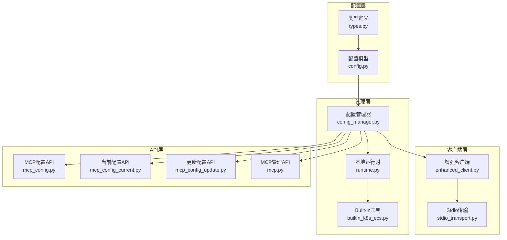
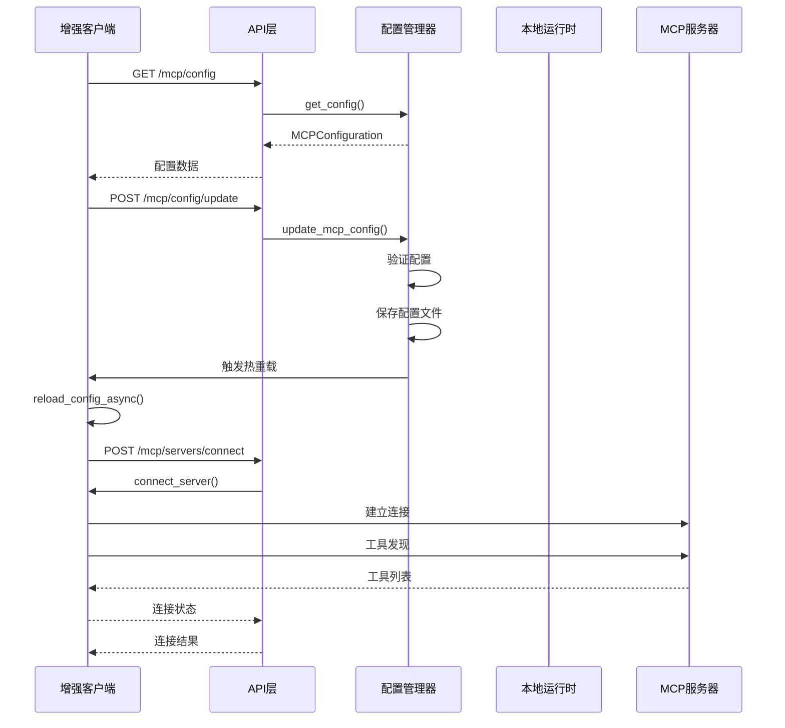
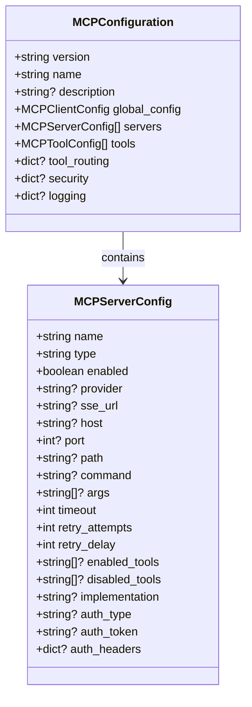
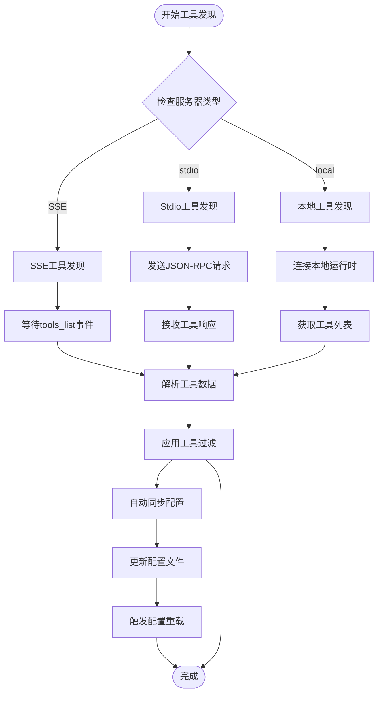
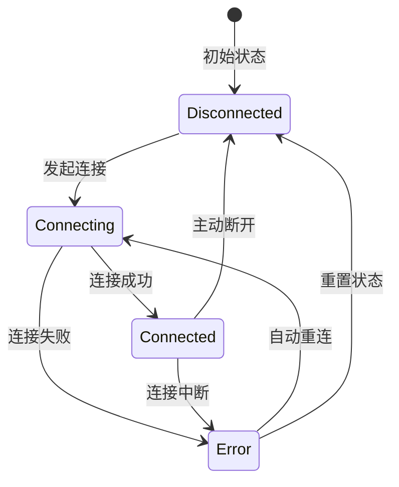
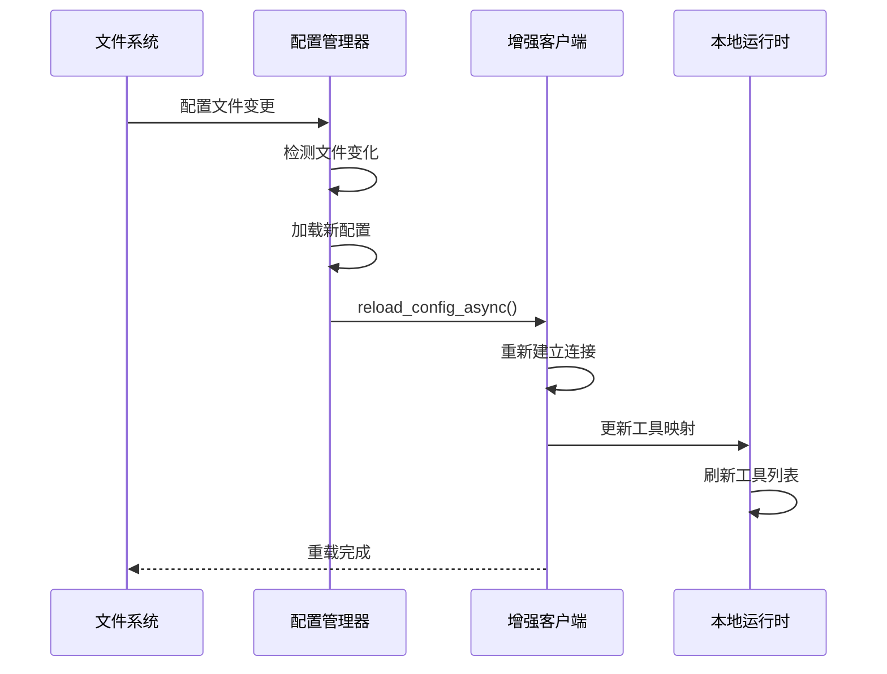
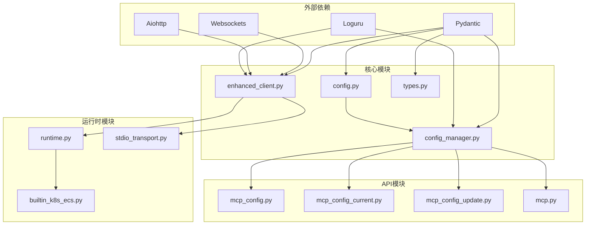

# MCP配置管理

<cite>
**本文档引用的文件**
- [config/mcp_config.example.json](file://config/mcp_config.example.json)
- [backend/src/mcp/config.py](file://backend/src/mcp/config.py)
- [backend/src/mcp/config_manager.py](file://backend/src/mcp/config_manager.py)
- [backend/src/mcp/runtime.py](file://backend/src/mcp/runtime.py)
- [backend/src/mcp/enhanced_client.py](file://backend/src/mcp/enhanced_client.py)
- [backend/src/mcp/types.py](file://backend/src/mcp/types.py)
- [backend/src/mcp/builtin_k8s_ecs.py](file://backend/src/mcp/builtin_k8s_ecs.py)
- [backend/src/mcp/stdio_transport.py](file://backend/src/mcp/stdio_transport.py)
- [backend/src/api/v2/endpoints/mcp_config.py](file://backend/src/api/v2/endpoints/mcp_config.py)
- [backend/src/api/v2/endpoints/mcp_config_current.py](file://backend/src/api/v2/endpoints/mcp_config_current.py)
- [backend/src/api/v2/endpoints/mcp_config_update.py](file://backend/src/api/v2/endpoints/mcp_config_update.py)
- [backend/src/api/v2/endpoints/mcp.py](file://backend/src/api/v2/endpoints/mcp.py)
- [config/README.md](file://config/README.md)
- [archived/k8s-mcp-standalone/config/k8s_config.example.yaml](file://archived/k8s-mcp-standalone/config/k8s_config.example.yaml)
- [archived/ecs-mcp-standalone/pyproject.toml](file://archived/ecs-mcp-standalone/pyproject.toml)
</cite>

## 目录
1. [简介](#简介)
2. [项目结构](#项目结构)
3. [核心组件](#核心组件)
4. [架构概览](#架构概览)
5. [详细组件分析](#详细组件分析)
6. [依赖关系分析](#依赖关系分析)
7. [性能考虑](#性能考虑)
8. [故障排除指南](#故障排除指南)
9. [结论](#结论)
10. [附录](#附录)

## 简介

MCP（Model Context Protocol）配置管理系统是钉钉K8s运维机器人的核心组件，负责管理MCP服务器和工具的配置。该系统支持多种MCP服务器类型，包括SSE、stdio、HTTP和本地运行时，并提供了完整的配置管理、工具发现、路由机制和连接状态管理功能。

系统的主要特点包括：
- 支持多服务器配置和动态管理
- 提供工具发现和自动同步功能
- 实现连接状态管理和自动重连机制
- 支持配置热重载和备份恢复
- 提供RESTful API接口进行配置管理

## 项目结构

MCP配置管理系统采用模块化设计，主要分为以下几个层次：

**图表来源**
- [backend/src/mcp/config.py:1-132](file://backend/src/mcp/config.py#L1-L132)
- [backend/src/mcp/config_manager.py:1-800](file://backend/src/mcp/config_manager.py#L1-L800)
- [backend/src/mcp/enhanced_client.py:1-800](file://backend/src/mcp/enhanced_client.py#L1-L800)

**章节来源**
- [backend/src/mcp/config.py:1-132](file://backend/src/mcp/config.py#L1-L132)
- [backend/src/mcp/config_manager.py:1-800](file://backend/src/mcp/config_manager.py#L1-L800)

## 核心组件

### 配置模型体系

系统采用Pydantic模型定义配置结构，主要包括以下核心组件：

#### MCPConfiguration - 主配置类
- 版本控制和元数据管理
- 全局客户端配置
- 服务器配置列表
- 工具配置列表
- 工具路由配置
- 安全和日志配置

#### MCPServerConfig - 服务器配置类
- 服务器标识和类型
- 连接参数（主机、端口、路径）
- 认证配置
- 工具过滤规则
- 实现方式（builtin/remote）

#### MCPToolConfig - 工具配置类
- 工具元数据（名称、描述、分类）
- 输入参数schema
- 执行配置（超时、缓存）
- 权限控制

**章节来源**
- [backend/src/mcp/config.py:97-120](file://backend/src/mcp/config.py#L97-L120)
- [backend/src/mcp/config.py:16-56](file://backend/src/mcp/config.py#L16-L56)
- [backend/src/mcp/config.py:74-95](file://backend/src/mcp/config.py#L74-L95)

### 配置管理器

MCPConfigManager是系统的核心管理组件，提供以下功能：

- 配置文件加载和验证
- 动态配置更新
- 模板管理
- 配置备份和恢复
- 连接状态测试
- 配置热重载

**章节来源**
- [backend/src/mcp/config_manager.py:41-800](file://backend/src/mcp/config_manager.py#L41-L800)

## 架构概览

MCP配置管理系统采用分层架构设计，实现了配置管理、工具发现、连接管理和API接口的分离：

**图表来源**
- [backend/src/api/v2/endpoints/mcp.py:70-120](file://backend/src/api/v2/endpoints/mcp.py#L70-L120)
- [backend/src/mcp/config_manager.py:785-796](file://backend/src/mcp/config_manager.py#L785-L796)
- [backend/src/mcp/enhanced_client.py:61-95](file://backend/src/mcp/enhanced_client.py#L61-L95)

## 详细组件分析

### 配置文件结构详解

#### 全局配置 (global_config)
- timeout: 客户端超时时间（毫秒）
- retry_attempts: 重试次数
- retry_delay: 重试延迟（毫秒）
- max_concurrent_calls: 最大并发调用数
- enable_cache: 是否启用缓存
- cache_timeout: 缓存超时时间（毫秒）

#### 服务器配置示例
每个服务器配置包含以下关键字段：

**图表来源**
- [backend/src/mcp/config.py:16-56](file://backend/src/mcp/config.py#L16-L56)
- [backend/src/mcp/config.py:97-120](file://backend/src/mcp/config.py#L97-L120)

#### 工具配置结构
工具配置支持详细的参数验证和权限控制：

- input_schema: JSON Schema定义输入参数
- default_parameters: 默认参数值
- timeout: 执行超时时间
- cache_enabled: 缓存策略
- required_permissions: 权限要求
- allowed_users/roles: 访问控制

**章节来源**
- [backend/src/mcp/config.py:74-95](file://backend/src/mcp/config.py#L74-L95)
- [backend/src/mcp/config.py:58-72](file://backend/src/mcp/config.py#L58-L72)

### 工具发现和路由机制

#### 自动工具发现流程
系统支持多种工具发现方式：

**图表来源**
- [backend/src/mcp/enhanced_client.py:527-586](file://backend/src/mcp/enhanced_client.py#L527-L586)
- [backend/src/mcp/stdio_transport.py:49-91](file://backend/src/mcp/stdio_transport.py#L49-L91)
- [backend/src/mcp/runtime.py:64-87](file://backend/src/mcp/runtime.py#L64-L87)

#### 工具路由配置
系统支持基于模式的工具路由：

- k8s-*: 匹配所有以k8s开头的工具
- ecs-*: 匹配所有以ecs开头的工具
- 具体工具名: 精确匹配

**章节来源**
- [backend/src/mcp/enhanced_client.py:321-404](file://backend/src/mcp/enhanced_client.py#L321-L404)

### 连接状态管理和自动重连

#### 连接状态管理
系统维护完整的连接状态跟踪：

#### 自动重连机制
- 指数退避算法：2^attempt秒延迟
- 最大重连次数限制
- SSE连接状态检测
- 工具调用状态恢复

**章节来源**
- [backend/src/mcp/enhanced_client.py:165-244](file://backend/src/mcp/enhanced_client.py#L165-L244)
- [backend/src/mcp/enhanced_client.py:38-56](file://backend/src/mcp/enhanced_client.py#L38-L56)

### 配置热重载机制

#### 热重载流程
系统支持配置文件的实时重载：

**图表来源**
- [backend/src/mcp/config_manager.py:785-796](file://backend/src/mcp/config_manager.py#L785-L796)
- [backend/src/mcp/enhanced_client.py:494-501](file://backend/src/mcp/enanced_client.py#L494-L501)

#### 配置备份策略
- 自动生成备份文件
- 保留最近5个备份
- 备份文件命名规范
- 自动清理旧备份

**章节来源**
- [backend/src/mcp/config_manager.py:291-310](file://backend/src/mcp/config_manager.py#L291-L310)

### 多服务器配置示例

#### Kubernetes MCP配置
基于SSE协议的Kubernetes MCP服务器配置：

| 配置项 | 值 | 说明 |
|--------|-----|------|
| name | k8s-mcp | 服务器名称 |
| type | sse | 服务器类型 |
| host | localhost | 主机地址 |
| port | 8766 | 端口号 |
| path | /events | SSE路径 |
| timeout | 600 | 超时时间(秒) |
| retry_attempts | 3 | 重试次数 |
| retry_delay | 1 | 重试延迟(秒) |

#### ECS MCP配置
基于本地运行时的ECS MCP服务器配置：

| 配置项 | 值 | 说明 |
|--------|-----|------|
| name | ecs-sse-server | 服务器名称 |
| type | local | 服务器类型 |
| provider | ecs | 提供者类型 |
| implementation | builtin | 实现方式 |
| enabled | false | 启用状态 |

**章节来源**
- [config/mcp_config.example.json:13-57](file://config/mcp_config.example.json#L13-L57)

## 依赖关系分析

### 组件依赖图

**图表来源**
- [backend/src/mcp/enhanced_client.py:1-31](file://backend/src/mcp/enhanced_client.py#L1-L31)
- [backend/src/mcp/config_manager.py:13-17](file://backend/src/mcp/config_manager.py#L13-L17)

### 错误处理策略

系统采用分层错误处理机制：

1. **配置验证层**: Pydantic模型验证
2. **连接错误层**: 详细的连接状态跟踪
3. **工具调用层**: 具体的工具执行错误
4. **API响应层**: 标准化的HTTP响应

**章节来源**
- [backend/src/mcp/types.py:178-186](file://backend/src/mcp/types.py#L178-L186)
- [backend/src/mcp/enhanced_client.py:89-94](file://backend/src/mcp/enhanced_client.py#L89-L94)

## 性能考虑

### 连接池管理
- 最大并发连接数控制
- 连接超时时间优化
- 连接复用策略

### 缓存策略
- 工具调用结果缓存
- 配置文件缓存
- 工具发现结果缓存

### 异步处理
- SSE事件流异步处理
- 工具调用异步执行
- 配置更新异步重载

## 故障排除指南

### 常见问题诊断

#### 配置文件问题
- **问题**: 配置文件加载失败
- **原因**: JSON格式错误或字段缺失
- **解决方案**: 检查配置文件格式，参考示例配置

#### 连接问题
- **问题**: 服务器连接失败
- **原因**: 网络连接、认证失败、端口占用
- **解决方案**: 使用连接测试API验证配置

#### 工具发现失败
- **问题**: 工具列表为空
- **原因**: 服务器未正确响应、工具过滤配置错误
- **解决方案**: 检查服务器状态，验证工具过滤规则

### 调试工具

系统提供多种调试接口：
- 配置验证API
- 连接状态检查
- 工具调用测试
- 日志级别调整

**章节来源**
- [backend/src/mcp/config_manager.py:486-551](file://backend/src/mcp/config_manager.py#L486-L551)
- [backend/src/api/v2/endpoints/mcp_config.py:535-563](file://backend/src/api/v2/endpoints/mcp_config.py#L535-L563)

## 结论

MCP配置管理系统提供了完整的MCP服务器和工具配置管理能力，具有以下优势：

1. **模块化设计**: 清晰的分层架构便于维护和扩展
2. **配置灵活**: 支持多种配置方式和动态更新
3. **可靠性高**: 完善的错误处理和重连机制
4. **易用性强**: 提供丰富的API接口和调试工具
5. **性能优化**: 异步处理和缓存策略提升系统性能

系统支持从简单的本地工具到复杂的分布式MCP服务器的各种场景，为Kubernetes和ECS等云原生平台提供了强大的运维自动化能力。

## 附录

### 配置文件迁移
系统支持配置文件的自动迁移，确保向后兼容性。

### 安全配置
- 认证头和令牌支持
- 访问控制列表
- 审计日志记录
- 权限验证机制

### 扩展开发
系统提供了完善的扩展接口，支持自定义MCP服务器类型和工具实现。