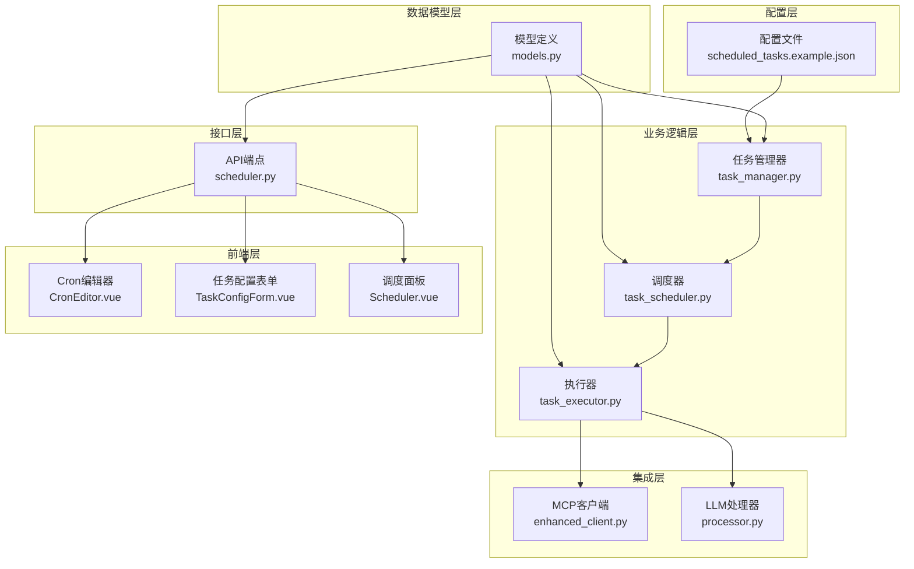
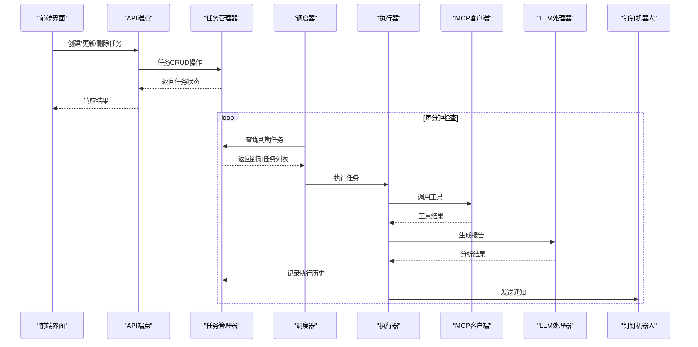
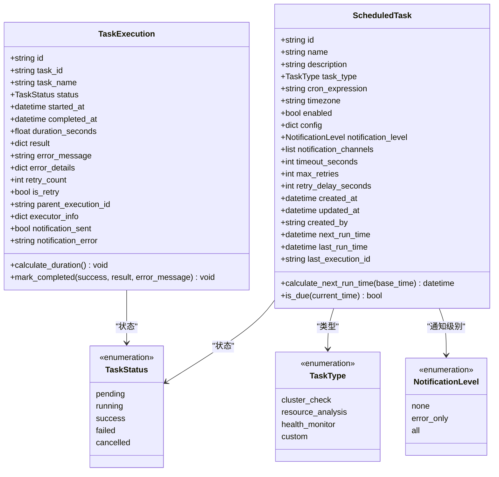
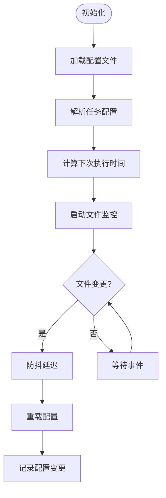
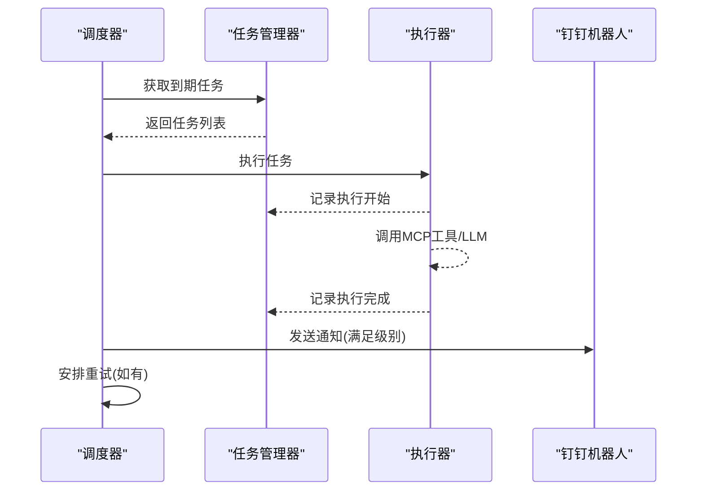
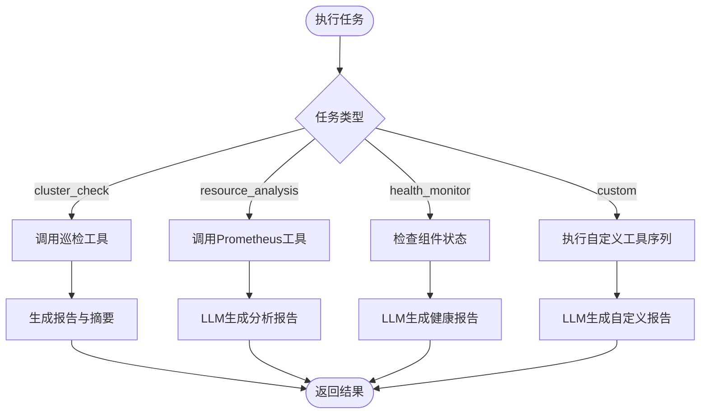
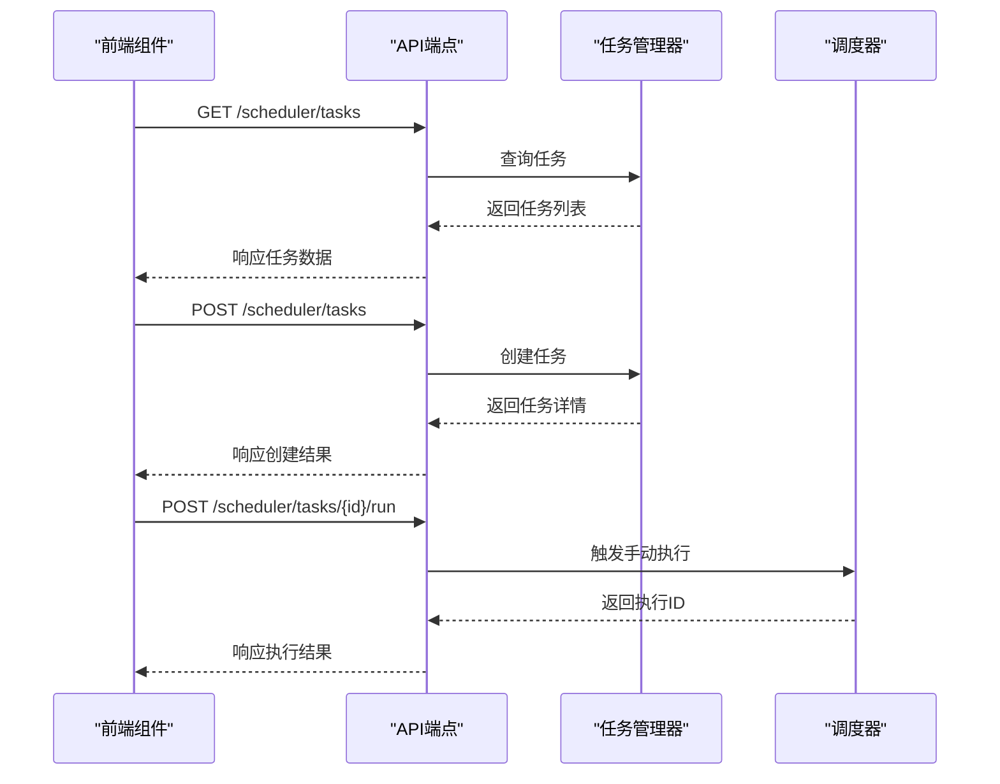
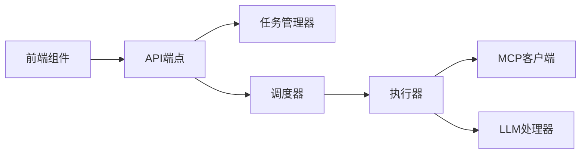

# 定时任务配置

<cite>
**本文档引用的文件**
- [scheduled_tasks.example.json](file://config/scheduled_tasks.example.json)
- [models.py](file://backend/src/scheduler/models.py)
- [task_manager.py](file://backend/src/scheduler/task_manager.py)
- [task_scheduler.py](file://backend/src/scheduler/task_scheduler.py)
- [task_executor.py](file://backend/src/scheduler/task_executor.py)
- [scheduler.py](file://backend/src/api/v2/endpoints/scheduler.py)
- [CronEditor.vue](file://frontend-v2/src/components/CronEditor.vue)
- [TaskConfigForm.vue](file://frontend-v2/src/components/TaskConfigForm.vue)
- [Scheduler.vue](file://frontend-v2/src/views/Scheduler.vue)
- [enhanced_client.py](file://backend/src/mcp/enhanced_client.py)
- [processor.py](file://backend/src/llm/processor.py)
</cite>

## 目录
1. [简介](#简介)
2. [项目结构](#项目结构)
3. [核心组件](#核心组件)
4. [架构概览](#架构概览)
5. [详细组件分析](#详细组件分析)
6. [依赖关系分析](#依赖关系分析)
7. [性能考量](#性能考量)
8. [故障排除指南](#故障排除指南)
9. [结论](#结论)
10. [附录](#附录)

## 简介
本项目提供了一个完整的定时任务配置系统，支持多种任务类型（集群巡检、资源分析、健康监控、自定义任务），具备强大的Cron表达式解析与验证能力、并发控制、失败重试、超时处理、通知机制以及执行历史记录与监控指标。系统通过前后端分离的方式，提供直观的Web界面进行任务配置与管理，并通过MCP（Model Context Protocol）客户端与LLM处理器集成，实现智能化的运维分析与报告生成。

## 项目结构
定时任务系统由以下主要层次组成：
- 配置层：配置文件与示例模板，定义任务结构与默认配置
- 数据模型层：Pydantic模型定义任务、执行记录、状态枚举等
- 业务逻辑层：任务管理器、调度器、执行器
- 接口层：FastAPI端点，提供RESTful API
- 前端层：Vue组件与页面，提供可视化配置与监控界面
- 集成层：MCP客户端与LLM处理器，用于工具调用与报告生成

图表来源
- [models.py:1-444](file://backend/src/scheduler/models.py#L1-L444)
- [task_manager.py:1-657](file://backend/src/scheduler/task_manager.py#L1-L657)
- [task_scheduler.py:1-487](file://backend/src/scheduler/task_scheduler.py#L1-L487)
- [task_executor.py:1-736](file://backend/src/scheduler/task_executor.py#L1-L736)
- [scheduler.py:1-661](file://backend/src/api/v2/endpoints/scheduler.py#L1-L661)
- [CronEditor.vue:1-631](file://frontend-v2/src/components/CronEditor.vue#L1-L631)
- [TaskConfigForm.vue:1-746](file://frontend-v2/src/components/TaskConfigForm.vue#L1-L746)
- [Scheduler.vue:1-1236](file://frontend-v2/src/views/Scheduler.vue#L1-L1236)
- [enhanced_client.py:1-200](file://backend/src/mcp/enhanced_client.py#L1-L200)
- [processor.py:1-200](file://backend/src/llm/processor.py#L1-L200)

章节来源
- [scheduled_tasks.example.json:1-8](file://config/scheduled_tasks.example.json#L1-L8)
- [models.py:1-444](file://backend/src/scheduler/models.py#L1-L444)
- [task_manager.py:1-657](file://backend/src/scheduler/task_manager.py#L1-L657)
- [task_scheduler.py:1-487](file://backend/src/scheduler/task_scheduler.py#L1-L487)
- [task_executor.py:1-736](file://backend/src/scheduler/task_executor.py#L1-L736)
- [scheduler.py:1-661](file://backend/src/api/v2/endpoints/scheduler.py#L1-L661)
- [CronEditor.vue:1-631](file://frontend-v2/src/components/CronEditor.vue#L1-L631)
- [TaskConfigForm.vue:1-746](file://frontend-v2/src/components/TaskConfigForm.vue#L1-L746)
- [Scheduler.vue:1-1236](file://frontend-v2/src/views/Scheduler.vue#L1-L1236)
- [enhanced_client.py:1-200](file://backend/src/mcp/enhanced_client.py#L1-L200)
- [processor.py:1-200](file://backend/src/llm/processor.py#L1-L200)

## 核心组件
- 任务模型与状态：定义任务类型、状态枚举、任务配置、执行记录等
- 任务管理器：负责配置文件的加载、保存、热重载、备份、执行历史持久化
- 调度器：基于Cron表达式驱动的任务调度，支持并发控制、重试、通知
- 执行器：根据任务类型执行具体逻辑，调用MCP工具与LLM生成报告
- API端点：提供任务的CRUD、执行历史查询、统计信息、状态监控等接口
- 前端组件：可视化Cron编辑器、任务配置表单、调度面板

章节来源
- [models.py:14-135](file://backend/src/scheduler/models.py#L14-L135)
- [task_manager.py:133-657](file://backend/src/scheduler/task_manager.py#L133-L657)
- [task_scheduler.py:23-487](file://backend/src/scheduler/task_scheduler.py#L23-L487)
- [task_executor.py:20-736](file://backend/src/scheduler/task_executor.py#L20-L736)
- [scheduler.py:9-661](file://backend/src/api/v2/endpoints/scheduler.py#L9-L661)

## 架构概览
系统采用事件驱动与异步并发的架构设计，调度器每分钟检查到期任务，执行器按任务类型调用MCP工具与LLM，最终通过钉钉机器人发送通知。前端通过API进行配置与监控，支持Cron表达式可视化编辑与模板应用。

图表来源
- [task_scheduler.py:108-150](file://backend/src/scheduler/task_scheduler.py#L108-L150)
- [task_executor.py:47-99](file://backend/src/scheduler/task_executor.py#L47-L99)
- [enhanced_client.py:1-200](file://backend/src/mcp/enhanced_client.py#L1-L200)
- [processor.py:1-200](file://backend/src/llm/processor.py#L1-L200)
- [scheduler.py:134-279](file://backend/src/api/v2/endpoints/scheduler.py#L134-L279)

## 详细组件分析

### 数据模型与配置文件
- 任务模型：包含任务ID、名称、描述、类型、Cron表达式、时区、启用状态、配置、通知级别与渠道、超时与重试策略、时间戳与运行时状态等
- 执行记录模型：包含执行ID、任务ID、状态、开始/完成时间、耗时、结果、错误信息、重试次数与父执行ID、执行器信息、通知状态等
- 配置文件：示例配置文件定义版本、名称、描述、更新时间与任务数组，实际使用时复制为config/scheduled_tasks.json

图表来源
- [models.py:14-192](file://backend/src/scheduler/models.py#L14-L192)

章节来源
- [models.py:38-135](file://backend/src/scheduler/models.py#L38-L135)
- [models.py:137-192](file://backend/src/scheduler/models.py#L137-L192)
- [scheduled_tasks.example.json:1-8](file://config/scheduled_tasks.example.json#L1-L8)

### 任务管理器
- 职责：加载/保存配置文件、热重载、备份、执行历史持久化、文件监控、配置验证与模板、清理旧数据
- 特性：支持watchdog文件监控，防抖重载，备份保留策略，执行历史按月分组存储，支持清理旧备份与历史

图表来源
- [task_manager.py:189-242](file://backend/src/scheduler/task_manager.py#L189-L242)
- [task_manager.py:263-303](file://backend/src/scheduler/task_manager.py#L263-L303)
- [task_manager.py:337-453](file://backend/src/scheduler/task_manager.py#L337-L453)

章节来源
- [task_manager.py:133-657](file://backend/src/scheduler/task_manager.py#L133-L657)

### 调度器
- 职责：每分钟检查到期任务，使用信号量控制并发，执行任务并处理重试与通知
- 并发控制：最大并发任务数限制，防止资源争用
- 重试机制：基于最大重试次数与重试延迟，支持父子执行记录关联
- 通知机制：根据通知级别与渠道，通过钉钉机器人发送Markdown通知

图表来源
- [task_scheduler.py:108-150](file://backend/src/scheduler/task_scheduler.py#L108-L150)
- [task_scheduler.py:158-215](file://backend/src/scheduler/task_scheduler.py#L158-L215)
- [task_scheduler.py:218-284](file://backend/src/scheduler/task_scheduler.py#L218-L284)

章节来源
- [task_scheduler.py:23-487](file://backend/src/scheduler/task_scheduler.py#L23-L487)

### 执行器
- 职责：根据任务类型执行具体逻辑，调用MCP工具与LLM生成报告
- 任务类型支持：
  - 集群巡检：调用巡检工具，生成Markdown报告与摘要
  - 资源分析：调用Prometheus工具，结合LLM生成优化报告
  - 健康监控：检查服务/部署/Pod/节点状态，生成健康报告
  - 自定义任务：支持多个MCP工具调用与可选LLM分析
- 统计与重置：执行统计、成功率、平均耗时、重置统计

图表来源
- [task_executor.py:47-99](file://backend/src/scheduler/task_executor.py#L47-L99)
- [task_executor.py:100-152](file://backend/src/scheduler/task_executor.py#L100-L152)
- [task_executor.py:153-196](file://backend/src/scheduler/task_executor.py#L153-L196)
- [task_executor.py:197-271](file://backend/src/scheduler/task_executor.py#L197-L271)
- [task_executor.py:272-317](file://backend/src/scheduler/task_executor.py#L272-L317)

章节来源
- [task_executor.py:20-736](file://backend/src/scheduler/task_executor.py#L20-L736)

### API端点与前端交互
- API端点：提供任务列表、创建/更新/删除、执行历史、手动执行、统计、状态、清理与重置等接口
- 权限控制：基于scheduler:read/write/run权限
- 前端组件：
  - Cron编辑器：可视化与文本两种模式，模板与验证
  - 任务配置表单：按任务类型动态渲染配置项
  - 调度面板：任务矩阵、执行流水、运行态监控

图表来源
- [scheduler.py:99-279](file://backend/src/api/v2/endpoints/scheduler.py#L99-L279)
- [scheduler.py:333-374](file://backend/src/api/v2/endpoints/scheduler.py#L333-L374)

章节来源
- [scheduler.py:9-661](file://backend/src/api/v2/endpoints/scheduler.py#L9-L661)
- [CronEditor.vue:1-631](file://frontend-v2/src/components/CronEditor.vue#L1-L631)
- [TaskConfigForm.vue:1-746](file://frontend-v2/src/components/TaskConfigForm.vue#L1-L746)
- [Scheduler.vue:1-1236](file://frontend-v2/src/views/Scheduler.vue#L1-L1236)

## 依赖关系分析
- 模块耦合：调度器依赖任务管理器与执行器；执行器依赖MCP客户端与LLM处理器；API端点依赖调度器与任务管理器
- 外部依赖：croniter用于Cron表达式验证与推演；watchdog用于文件监控；loguru用于日志；Element Plus与Vue用于前端
- 循环依赖：未发现循环依赖，各模块职责清晰

图表来源
- [scheduler.py:15-33](file://backend/src/api/v2/endpoints/scheduler.py#L15-L33)
- [task_scheduler.py:15-21](file://backend/src/scheduler/task_scheduler.py#L15-L21)
- [task_executor.py:14-18](file://backend/src/scheduler/task_executor.py#L14-L18)

章节来源
- [scheduler.py:1-661](file://backend/src/api/v2/endpoints/scheduler.py#L1-L661)
- [task_scheduler.py:1-487](file://backend/src/scheduler/task_scheduler.py#L1-L487)
- [task_executor.py:1-736](file://backend/src/scheduler/task_executor.py#L1-L736)

## 性能考量
- 并发控制：调度器使用信号量限制最大并发任务数，避免资源争用
- 执行统计：执行器维护最近100次执行时间，便于性能分析
- 文件监控：watchdog防抖重载，减少频繁I/O
- 历史存储：执行历史按月分组，限制每任务保留数量，平衡存储与查询效率

## 故障排除指南
- Cron表达式验证失败：使用前端Cron编辑器或API端点验证，检查字段范围与格式
- 任务未执行：检查任务启用状态、Cron表达式、时区设置、下次执行时间
- 执行失败重试：查看执行历史记录，确认重试次数与延迟，检查工具调用与LLM可用性
- 通知未发送：检查钉钉机器人配置、通知级别与渠道
- 配置文件异常：查看备份文件，确认文件格式与权限，必要时手动恢复

章节来源
- [scheduler.py:492-532](file://backend/src/api/v2/endpoints/scheduler.py#L492-L532)
- [task_manager.py:263-303](file://backend/src/scheduler/task_manager.py#L263-L303)
- [task_scheduler.py:285-391](file://backend/src/scheduler/task_scheduler.py#L285-L391)

## 结论
本定时任务配置系统提供了从配置、调度、执行到监控的完整闭环，具备良好的扩展性与可观测性。通过Cron表达式可视化编辑、任务类型模板、并发控制与重试机制，能够满足多样化的运维自动化需求。前端界面直观易用，后端架构稳定可靠，适合在生产环境中长期运行。

## 附录

### Cron表达式语法与使用
- 字段说明：分、时、日、月、周（共5个字段），支持通配符*、步进*/n、范围a-b、列表a,b、特殊字符L（月末）、W（工作日）
- 常用模板：每分钟、每5/15/30分钟、每小时、每2/6/12小时、每日/每周/每月固定时间
- 验证与预览：前端Cron编辑器与API端点均提供验证与下一次执行时间预览

章节来源
- [models.py:395-417](file://backend/src/scheduler/models.py#L395-L417)
- [scheduler.py:469-491](file://backend/src/api/v2/endpoints/scheduler.py#L469-L491)
- [CronEditor.vue:391-446](file://frontend-v2/src/components/CronEditor.vue#L391-L446)

### 任务类型与配置参数
- 集群巡检：配置命名空间、深度、选项（异常检测、报告生成、发送至钉钉）
- 资源分析：配置指标（CPU/内存/磁盘/网络）、时间范围、阈值（警告/严重）
- 健康监控：配置监控组件（API Server/ETCD/Controller Manager/Scheduler/Kubelet）、检查间隔、失败阈值
- 自定义任务：配置多个MCP工具调用与可选LLM分析

章节来源
- [models.py:342-371](file://backend/src/scheduler/models.py#L342-L371)
- [TaskConfigForm.vue:129-318](file://frontend-v2/src/components/TaskConfigForm.vue#L129-L318)

### 执行策略与状态管理
- 并发控制：信号量限制最大并发任务数
- 失败重试：基于最大重试次数与重试延迟，支持父子执行记录
- 超时处理：任务超时自动终止
- 状态管理：任务状态枚举、执行记录、通知状态、统计指标

章节来源
- [task_scheduler.py:53-56](file://backend/src/scheduler/task_scheduler.py#L53-L56)
- [task_scheduler.py:218-284](file://backend/src/scheduler/task_scheduler.py#L218-L284)
- [models.py:14-21](file://backend/src/scheduler/models.py#L14-L21)
- [models.py:137-192](file://backend/src/scheduler/models.py#L137-L192)

### 常见定时任务场景配置示例
- 健康检查：每5分钟检查服务/部署/Pod/节点状态，失败阈值3次触发告警
- 数据备份：每日午夜执行备份工具，超时300秒，最大重试3次
- 报告生成：每周一上午9点执行资源分析，生成CPU/内存使用率报告

章节来源
- [models.py:396-411](file://backend/src/scheduler/models.py#L396-L411)
- [TaskConfigForm.vue:213-251](file://frontend-v2/src/components/TaskConfigForm.vue#L213-L251)

### 安全考虑与权限控制
- 权限控制：API端点基于scheduler:read/write/run权限
- 数据脱敏：LLM处理器集成数据脱敏器，保护敏感信息
- 通知安全：钉钉机器人配置需妥善保管，避免泄露

章节来源
- [scheduler.py:35-42](file://backend/src/api/v2/endpoints/scheduler.py#L35-L42)
- [processor.py:24-27](file://backend/src/llm/processor.py#L24-L27)