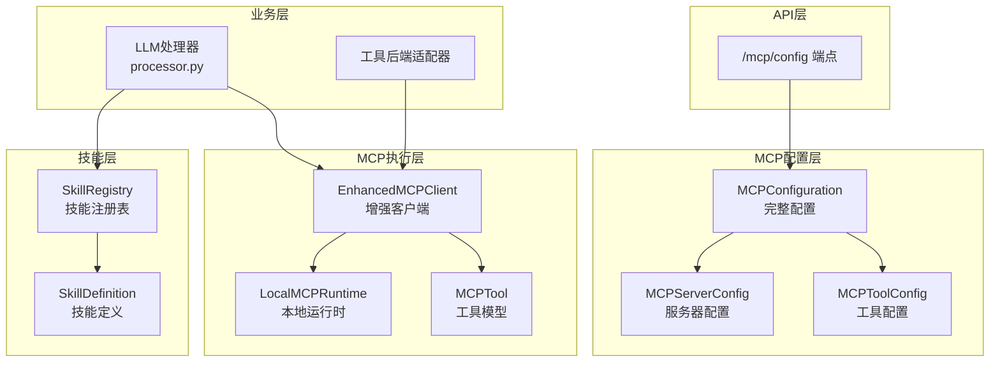
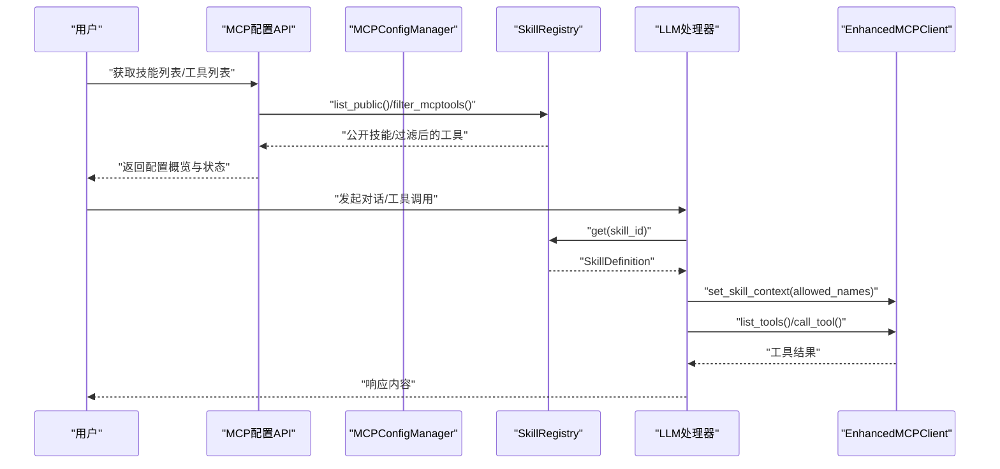
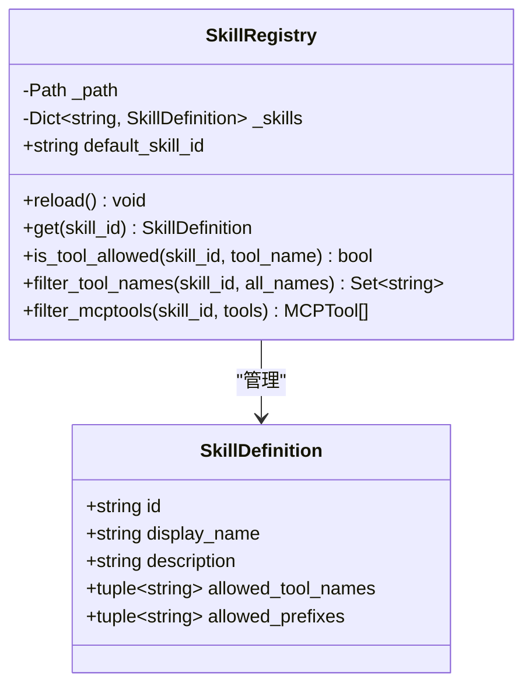
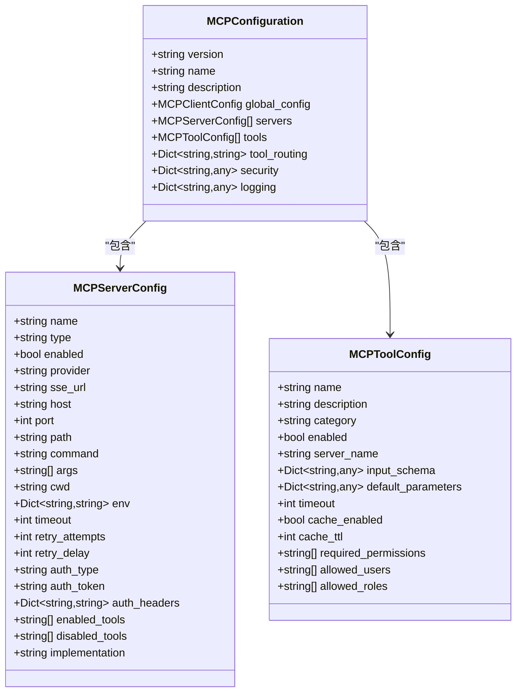
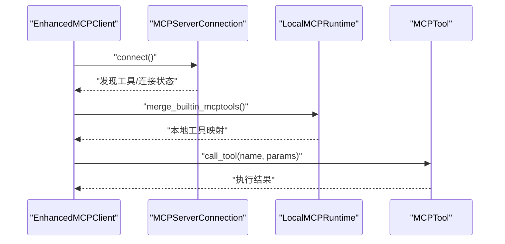
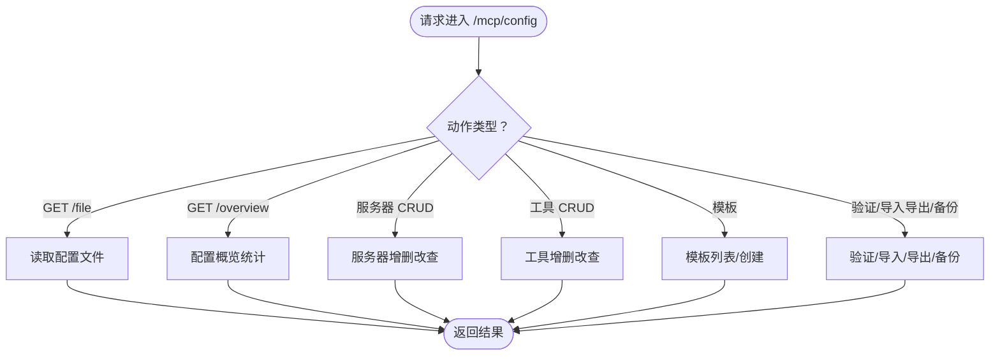
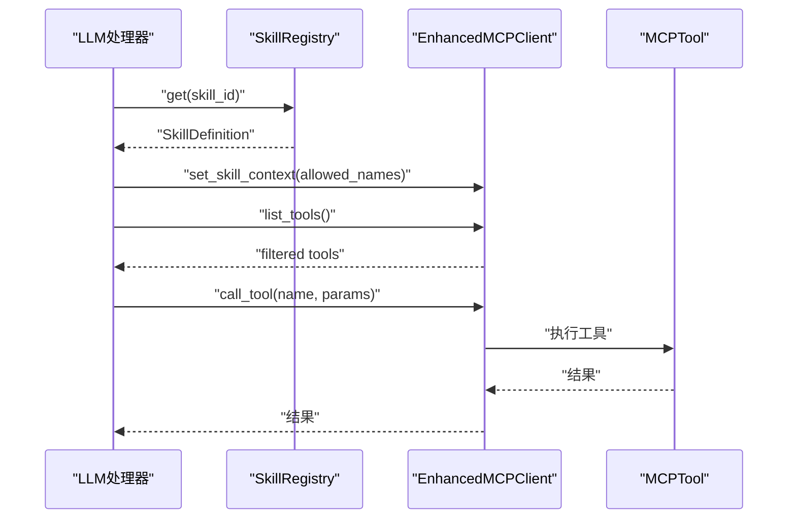
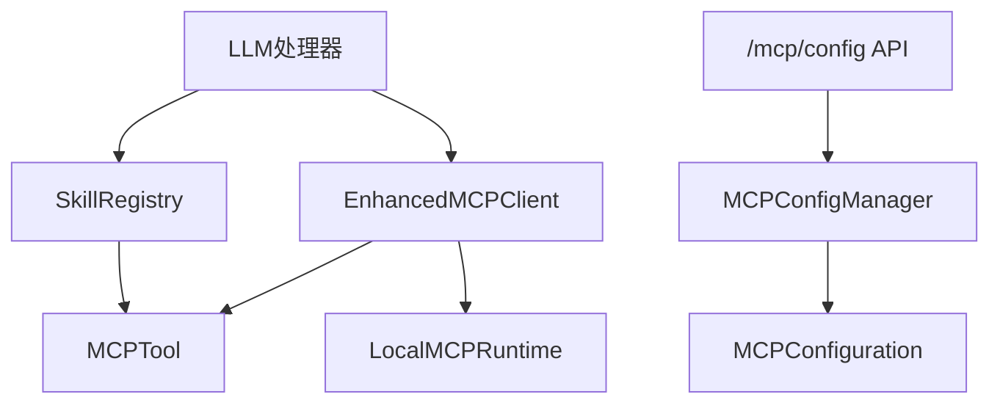

# 技能配置管理

<cite>
**本文档引用的文件**
- [skills/registry.py](file://backend/src/skills/registry.py)
- [skills.example.json](file://config/skills.example.json)
- [mcp/config.py](file://backend/src/mcp/config.py)
- [mcp/config_manager.py](file://backend/src/mcp/config_manager.py)
- [mcp/types.py](file://backend/src/mcp/types.py)
- [mcp/enhanced_client.py](file://backend/src/mcp/enhanced_client.py)
- [mcp/builtin_k8s_ecs.py](file://backend/src/mcp/builtin_k8s_ecs.py)
- [mcp/runtime.py](file://backend/src/mcp/runtime.py)
- [api/v2/endpoints/mcp_config.py](file://backend/src/api/v2/endpoints/mcp_config.py)
- [mcp_config.example.json](file://config/mcp_config.example.json)
- [llm/processor.py](file://backend/src/llm/processor.py)
- [tools/registry.py](file://backend/src/tools/registry.py)
</cite>

## 目录
1. [简介](#简介)
2. [项目结构](#项目结构)
3. [核心组件](#核心组件)
4. [架构总览](#架构总览)
5. [详细组件分析](#详细组件分析)
6. [依赖关系分析](#依赖关系分析)
7. [性能考量](#性能考量)
8. [故障排查指南](#故障排查指南)
9. [结论](#结论)
10. [附录](#附录)

## 简介
本文件面向技能配置管理系统，系统性阐述技能配置文件的结构与配置项、技能定义与参数规范、权限控制策略、技能注册与动态加载机制、技能与MCP工具的映射关系、启用/禁用控制、优先级与依赖管理、最佳实践（参数校验、错误处理、性能优化）、完整配置示例与常见使用场景，以及版本管理与向后兼容性考虑。

## 项目结构
技能配置管理涉及以下关键模块：
- 技能注册与过滤：SkillRegistry 负责加载 skills.json 并提供工具过滤能力
- MCP 配置管理：MCPConfiguration/MCPServerConfig/MCPToolConfig 提供服务器与工具的配置模型
- MCP 客户端与运行时：EnhancedMCPClient 负责连接与工具调用；LocalMCPRuntime 提供本地工具注册
- API 层：FastAPI 端点提供 MCP 配置的增删改查、验证、导入导出、备份恢复
- LLM 处理器：在对话流程中应用技能上下文，过滤可用工具集

**图表来源**
- [skills/registry.py:27-115](file://backend/src/skills/registry.py#L27-L115)
- [mcp/config.py:16-120](file://backend/src/mcp/config.py#L16-L120)
- [mcp/config_manager.py:41-800](file://backend/src/mcp/config_manager.py#L41-L800)
- [mcp/enhanced_client.py:33-200](file://backend/src/mcp/enhanced_client.py#L33-L200)
- [mcp/runtime.py:31-119](file://backend/src/mcp/runtime.py#L31-L119)
- [api/v2/endpoints/mcp_config.py:25-563](file://backend/src/api/v2/endpoints/mcp_config.py#L25-L563)
- [llm/processor.py:613-623](file://backend/src/llm/processor.py#L613-L623)
- [tools/registry.py:26-54](file://backend/src/tools/registry.py#L26-L54)

**章节来源**
- [skills/registry.py:1-116](file://backend/src/skills/registry.py#L1-L116)
- [mcp/config.py:1-132](file://backend/src/mcp/config.py#L1-L132)
- [mcp/config_manager.py:1-948](file://backend/src/mcp/config_manager.py#L1-L948)
- [mcp/enhanced_client.py:1-200](file://backend/src/mcp/enhanced_client.py#L1-L200)
- [mcp/runtime.py:1-119](file://backend/src/mcp/runtime.py#L1-L119)
- [api/v2/endpoints/mcp_config.py:1-563](file://backend/src/api/v2/endpoints/mcp_config.py#L1-L563)
- [llm/processor.py:613-623](file://backend/src/llm/processor.py#L613-L623)
- [tools/registry.py:1-54](file://backend/src/tools/registry.py#L1-L54)

## 核心组件
- 技能注册表（SkillRegistry）
  - 负责加载 skills.json，解析默认技能与过滤规则
  - 提供 is_tool_allowed/filter_tool_names/filter_mcptools 等过滤方法
  - 支持热重载与默认技能回退
- MCP 配置模型（MCPConfiguration/MCPServerConfig/MCPToolConfig）
  - 描述服务器类型、连接参数、认证、工具过滤、执行超时、缓存等
  - 支持全局客户端配置与路由配置
- MCP 客户端与运行时（EnhancedMCPClient/LocalMCPRuntime）
  - 支持 SSE/stdio 等传输，自动发现工具，连接状态管理
  - 本地运行时提供 K8s/ECS 工具的进程内执行
- API 管理端点（/mcp/config）
  - 提供服务器/工具的增删改查、模板创建、配置验证、导入导出、备份恢复、连接测试
- LLM 处理器（processor.py）
  - 在对话流程中应用技能上下文，过滤可用工具集并设置到 MCP 客户端

**章节来源**
- [skills/registry.py:27-115](file://backend/src/skills/registry.py#L27-L115)
- [mcp/config.py:16-120](file://backend/src/mcp/config.py#L16-L120)
- [mcp/enhanced_client.py:33-200](file://backend/src/mcp/enhanced_client.py#L33-L200)
- [mcp/runtime.py:31-119](file://backend/src/mcp/runtime.py#L31-L119)
- [api/v2/endpoints/mcp_config.py:182-563](file://backend/src/api/v2/endpoints/mcp_config.py#L182-L563)
- [llm/processor.py:613-623](file://backend/src/llm/processor.py#L613-L623)

## 架构总览
技能配置管理贯穿“配置—过滤—执行—反馈”的闭环：
- 配置阶段：skills.json 定义技能与工具白名单/前缀；mcp_config.json 定义服务器与工具
- 过滤阶段：SkillRegistry 基于技能规则过滤可用工具
- 执行阶段：EnhancedMCPClient 连接服务器并执行工具；LocalMCPRuntime 提供本地工具
- 反馈阶段：API 端点提供验证、导入导出、备份恢复与连接测试

**图表来源**
- [api/v2/endpoints/mcp_config.py:135-180](file://backend/src/api/v2/endpoints/mcp_config.py#L135-L180)
- [skills/registry.py:79-105](file://backend/src/skills/registry.py#L79-L105)
- [llm/processor.py:613-623](file://backend/src/llm/processor.py#L613-L623)
- [mcp/enhanced_client.py:33-200](file://backend/src/mcp/enhanced_client.py#L33-L200)

## 详细组件分析

### 技能注册与过滤（SkillRegistry）
- 配置文件结构
  - version：配置版本
  - default_skill_id：默认技能 ID
  - skills：技能数组，每项包含 id/display_name/description/allowed_tool_names/allowed_prefixes
- 过滤规则
  - 若未设置 allowed_tool_names 与 allowed_prefixes，则视为“全量工具”
  - 支持精确匹配工具名与前缀匹配
- 关键方法
  - get：获取技能定义，未知 ID 回退到默认技能
  - is_tool_allowed：判断工具是否允许
  - filter_tool_names/filter_mcptools：批量过滤工具名/工具对象

**图表来源**
- [skills/registry.py:18-115](file://backend/src/skills/registry.py#L18-L115)

**章节来源**
- [skills/registry.py:27-115](file://backend/src/skills/registry.py#L27-L115)
- [skills.example.json:1-53](file://config/skills.example.json#L1-L53)

### MCP 配置模型与管理（MCPConfiguration/MCPServerConfig/MCPToolConfig）
- MCPConfiguration
  - version/name/description：配置元信息
  - global_config：全局客户端配置（超时、重试、并发、缓存）
  - servers：服务器列表（类型、连接参数、认证、工具过滤、实现方式）
  - tools：工具列表（名称、描述、分类、输入 schema、默认参数、执行配置、权限配置）
  - tool_routing/security/logging：路由、安全与日志配置
- MCPServerConfig
  - type 支持 sse/stdio/local（注意：配置模型注释中列出的类型与校验逻辑略有差异）
  - 连接参数：host/port/path/base_url/command/args/cwd/env 等
  - 认证：auth_type/auth_token/auth_headers
  - 工具过滤：enabled_tools/disabled_tools
  - implementation：builtin/local 表示在主进程内注册，客户端应跳过远程连接
- MCPToolConfig
  - 输入 schema 与默认参数
  - 执行配置：timeout/cache_enabled/cache_ttl
  - 权限配置：required_permissions/allowed_users/allowed_roles

**图表来源**
- [mcp/config.py:16-120](file://backend/src/mcp/config.py#L16-L120)

**章节来源**
- [mcp/config.py:16-132](file://backend/src/mcp/config.py#L16-L132)
- [mcp_config.example.json:1-66](file://config/mcp_config.example.json#L1-L66)

### MCP 客户端与本地运行时（EnhancedMCPClient/LocalMCPRuntime）
- EnhancedMCPClient
  - 支持 SSE/stdio 传输，自动发现工具，连接状态管理，消息队列与重连
  - 与 LocalMCPRuntime 协作，优先使用本地工具
- LocalMCPRuntime
  - 注册本地工具提供者，维护工具映射，执行工具调用
  - 提供快照信息（启用状态、工具数量、提供者统计）

**图表来源**
- [mcp/enhanced_client.py:61-95](file://backend/src/mcp/enhanced_client.py#L61-L95)
- [mcp/runtime.py:46-99](file://backend/src/mcp/runtime.py#L46-L99)
- [mcp/builtin_k8s_ecs.py:76-92](file://backend/src/mcp/builtin_k8s_ecs.py#L76-L92)

**章节来源**
- [mcp/enhanced_client.py:33-200](file://backend/src/mcp/enhanced_client.py#L33-L200)
- [mcp/runtime.py:31-119](file://backend/src/mcp/runtime.py#L31-L119)
- [mcp/builtin_k8s_ecs.py:25-92](file://backend/src/mcp/builtin_k8s_ecs.py#L25-L92)

### API 管理端点（/mcp/config）
- 功能覆盖
  - 获取配置文件、配置概览
  - 服务器管理：创建/更新/删除/切换启用状态
  - 工具管理：创建/更新/删除/切换启用状态
  - 模板管理：内置模板与用户模板
  - 配置验证：连接测试、工具与服务器配置校验
  - 导入导出与备份恢复
- 权限控制
  - 读取端点需要 mcp:read 权限
  - 写入端点需要 mcp:write 权限

**图表来源**
- [api/v2/endpoints/mcp_config.py:115-563](file://backend/src/api/v2/endpoints/mcp_config.py#L115-L563)

**章节来源**
- [api/v2/endpoints/mcp_config.py:25-563](file://backend/src/api/v2/endpoints/mcp_config.py#L25-L563)

### 技能与MCP工具的映射与动态加载
- 技能与工具映射
  - SkillRegistry 通过 allowed_tool_names/allowed_prefixes 控制工具可见性
  - LLM 处理器在对话中获取技能定义，过滤可用工具，并将允许的工具名集合设置到 MCP 客户端
- 动态加载
  - 技能配置文件支持热重载（SkillRegistry.reload）
  - MCP 配置支持热加载与异步重载（MCPConfigManager.reload_config/reload_config_async）
  - 本地工具通过 LocalMCPRuntime 注册，随进程内工具提供者生效

**图表来源**
- [llm/processor.py:613-623](file://backend/src/llm/processor.py#L613-L623)
- [skills/registry.py:72-105](file://backend/src/skills/registry.py#L72-L105)
- [mcp/enhanced_client.py:33-200](file://backend/src/mcp/enhanced_client.py#L33-L200)

**章节来源**
- [llm/processor.py:613-623](file://backend/src/llm/processor.py#L613-L623)
- [skills/registry.py:69-105](file://backend/src/skills/registry.py#L69-L105)
- [mcp/enhanced_client.py:33-200](file://backend/src/mcp/enhanced_client.py#L33-L200)

## 依赖关系分析
- 组件耦合
  - SkillRegistry 依赖 MCPTool 类型（用于过滤 MCPTool 对象）
  - LLM 处理器依赖 SkillRegistry 与 EnhancedMCPClient
  - API 端点依赖 MCPConfigManager 与配置模型
  - EnhancedMCPClient 依赖 LocalMCPRuntime 与工具提供者
- 外部依赖
  - aiohttp/websockets/subprocess 等用于不同传输类型的连接
  - pydantic 用于配置模型的序列化与校验
- 循环依赖规避
  - 通过延迟导入（如 get_config_manager）避免循环依赖

**图表来源**
- [skills/registry.py:15-15](file://backend/src/skills/registry.py#L15-L15)
- [mcp/types.py:19-28](file://backend/src/mcp/types.py#L19-L28)
- [llm/processor.py:613-623](file://backend/src/llm/processor.py#L613-L623)
- [api/v2/endpoints/mcp_config.py:16-22](file://backend/src/api/v2/endpoints/mcp_config.py#L16-L22)
- [mcp/enhanced_client.py:20-30](file://backend/src/mcp/enhanced_client.py#L20-L30)

**章节来源**
- [skills/registry.py:15-15](file://backend/src/skills/registry.py#L15-L15)
- [mcp/types.py:19-28](file://backend/src/mcp/types.py#L19-L28)
- [llm/processor.py:613-623](file://backend/src/llm/processor.py#L613-L623)
- [api/v2/endpoints/mcp_config.py:16-22](file://backend/src/api/v2/endpoints/mcp_config.py#L16-L22)
- [mcp/enhanced_client.py:20-30](file://backend/src/mcp/enhanced_client.py#L20-L30)

## 性能考量
- 工具过滤
  - 使用前缀集合与集合查找，避免线性扫描过多工具
  - 过滤结果缓存（可选）减少重复计算
- 连接与重试
  - 合理设置超时与重试次数，避免阻塞主线程
  - SSE/stdio 传输的长连接与心跳检测
- 并发与缓存
  - 全局客户端配置中的并发调用上限与缓存策略
  - 工具级缓存 TTL 与失效策略
- 本地工具优先
  - LocalMCPRuntime 减少远程调用开销，提升响应速度

[本节为通用性能建议，不直接分析具体文件]

## 故障排查指南
- 技能过滤问题
  - 检查 skills.json 的 allowed_tool_names/allowed_prefixes 是否正确
  - 使用 SkillRegistry.list_public() 与 filter_mcptools() 排查过滤结果
- MCP 服务器连接失败
  - 使用 /mcp/config/test/{server_name} 进行连接测试
  - 检查服务器类型、端口、认证配置与网络连通性
- 配置导入/导出失败
  - 确认 JSON 格式正确，使用 /mcp/config/import 与 /mcp/config/export
  - 查看备份列表与恢复功能
- 本地工具不可用
  - 确认 BUILTIN_K8S_ECS_TOOLS 环境变量与 LocalMCPRuntime 状态
  - 检查 implementation/local 配置是否正确

**章节来源**
- [skills/registry.py:79-105](file://backend/src/skills/registry.py#L79-L105)
- [api/v2/endpoints/mcp_config.py:535-563](file://backend/src/api/v2/endpoints/mcp_config.py#L535-L563)
- [mcp/enhanced_client.py:553-716](file://backend/src/mcp/enhanced_client.py#L553-L716)
- [mcp/builtin_k8s_ecs.py:25-92](file://backend/src/mcp/builtin_k8s_ecs.py#L25-L92)

## 结论
技能配置管理系统通过 skills.json 与 mcp_config.json 实现“策略驱动”的工具访问控制与执行编排。SkillRegistry 提供灵活的工具过滤能力，MCPConfigManager 提供可视化的配置管理体验，EnhancedMCPClient 与 LocalMCPRuntime 实现可靠的工具执行边界。结合 API 端点与 LLM 处理器，系统实现了从配置到执行的完整闭环，并具备热重载、验证、备份恢复等工程化能力。

[本节为总结性内容，不直接分析具体文件]

## 附录

### 技能配置文件结构与示例
- skills.json 字段说明
  - version：配置版本
  - default_skill_id：默认技能 ID
  - skills：技能数组，每项包含
    - id：技能唯一标识
    - display_name：展示名称
    - description：描述
    - allowed_tool_names：允许的工具名列表
    - allowed_prefixes：允许的工具名前缀列表
- 示例参考
  - [skills.example.json:1-53](file://config/skills.example.json#L1-L53)

**章节来源**
- [skills.example.json:1-53](file://config/skills.example.json#L1-L53)

### MCP 配置文件结构与示例
- mcp_config.json 字段说明
  - version/name/description：配置元信息
  - global_config：全局客户端配置（超时、重试、并发、缓存）
  - servers：服务器列表（类型、连接参数、认证、工具过滤、实现方式）
  - tools：工具列表（名称、描述、分类、输入 schema、默认参数、执行配置、权限配置）
  - tool_routing/security/logging：路由、安全与日志配置
- 示例参考
  - [mcp_config.example.json:1-66](file://config/mcp_config.example.json#L1-L66)

**章节来源**
- [mcp/config.py:97-120](file://backend/src/mcp/config.py#L97-L120)
- [mcp_config.example.json:1-66](file://config/mcp_config.example.json#L1-L66)

### 定义自定义技能的关键要素
- 技能名称与描述
  - id/display_name/description
- 参数规范
  - allowed_tool_names：精确工具名白名单
  - allowed_prefixes：工具名前缀白名单
- 返回值格式
  - 通过 MCPTool/input_schema 描述工具输入参数结构
  - 通过 MCPToolResult/error 字段承载工具执行结果与错误信息

**章节来源**
- [skills/registry.py:18-25](file://backend/src/skills/registry.py#L18-L25)
- [mcp/types.py:19-54](file://backend/src/mcp/types.py#L19-L54)

### 技能注册机制与动态加载
- 注册机制
  - SkillRegistry 从 skills.json 加载技能定义
  - 默认技能为 "full"，若未配置则回退
- 动态加载
  - 支持 reload() 热重载
  - MCPConfigManager 支持异步重载与路径一致性检查

**章节来源**
- [skills/registry.py:30-71](file://backend/src/skills/registry.py#L30-L71)
- [mcp/config_manager.py:785-796](file://backend/src/mcp/config_manager.py#L785-L796)

### 技能与MCP工具的关系与映射
- 映射关系
  - allowed_tool_names/allowed_prefixes 决定工具可见性
  - LLM 处理器在对话中设置技能上下文，过滤可用工具
- 本地工具优先
  - LocalMCPRuntime 注册本地工具，EnhancedMCPClient 优先使用本地工具

**章节来源**
- [skills/registry.py:90-105](file://backend/src/skills/registry.py#L90-L105)
- [llm/processor.py:613-623](file://backend/src/llm/processor.py#L613-L623)
- [mcp/builtin_k8s_ecs.py:76-92](file://backend/src/mcp/builtin_k8s_ecs.py#L76-L92)

### 启用/禁用控制、优先级与依赖管理
- 启用/禁用
  - 技能：通过 allowed_tool_names/allowed_prefixes 控制
  - MCP：服务器/工具的 enabled 字段控制启用状态
- 优先级
  - LocalMCPRuntime 优先级高于远程服务器
  - implementation/local 的服务器优先使用本地工具
- 依赖管理
  - 工具依赖对应服务器的 enabled_tools 列表
  - 配置验证会检查工具与服务器的关联关系

**章节来源**
- [mcp/config.py:74-95](file://backend/src/mcp/config.py#L74-L95)
- [mcp/enhanced_client.py:33-200](file://backend/src/mcp/enhanced_client.py#L33-L200)
- [mcp/config_manager.py:486-551](file://backend/src/mcp/config_manager.py#L486-L551)

### 最佳实践
- 参数验证
  - 使用 pydantic 模型进行配置校验
  - 在 API 层提供 validate_config 接口
- 错误处理
  - 使用 MCPException 统一异常处理
  - 服务器连接失败时记录详细错误信息
- 性能优化
  - 合理设置超时与重试
  - 使用本地工具减少远程调用
  - 控制并发调用数量与缓存 TTL

**章节来源**
- [mcp/config.py:16-132](file://backend/src/mcp/config.py#L16-L132)
- [mcp/types.py:178-186](file://backend/src/mcp/types.py#L178-L186)
- [mcp/enhanced_client.py:553-716](file://backend/src/mcp/enhanced_client.py#L553-L716)

### 版本管理与向后兼容性
- 配置版本
  - version 字段用于标识配置版本
- 向后兼容
  - MCPConfiguration 保留向后兼容字段
  - 配置迁移与路径一致性检查
- 备份与恢复
  - 自动创建备份，限制保留数量
  - 支持备份恢复与导入导出

**章节来源**
- [mcp/config.py:97-120](file://backend/src/mcp/config.py#L97-L120)
- [mcp/config_manager.py:94-139](file://backend/src/mcp/config_manager.py#L94-L139)
- [mcp/config_manager.py:291-310](file://backend/src/mcp/config_manager.py#L291-L310)
- [mcp/config_manager.py:748-784](file://backend/src/mcp/config_manager.py#L748-L784)