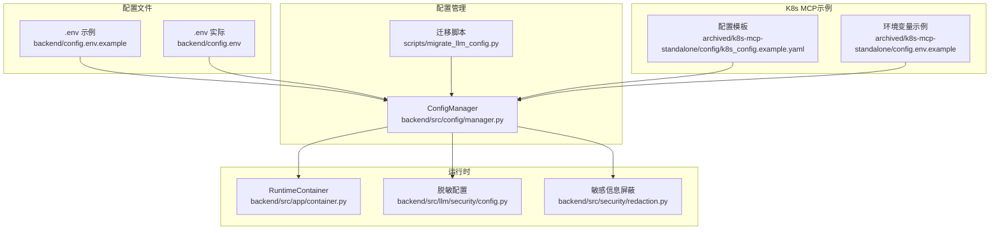
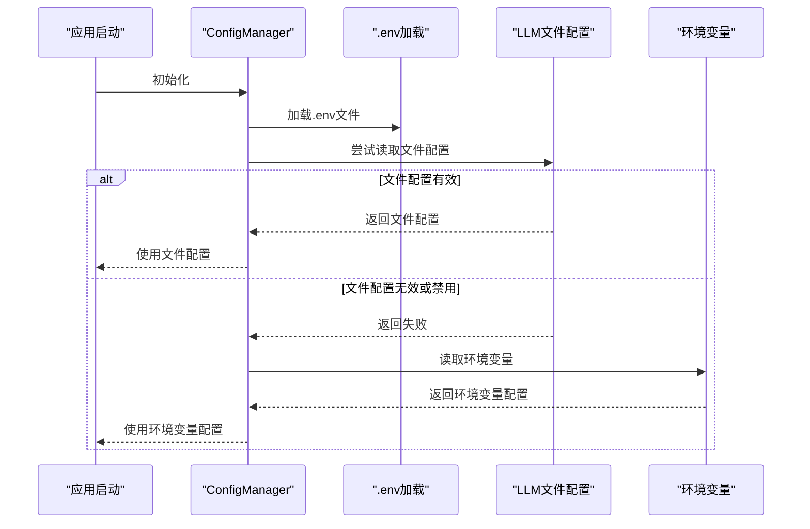
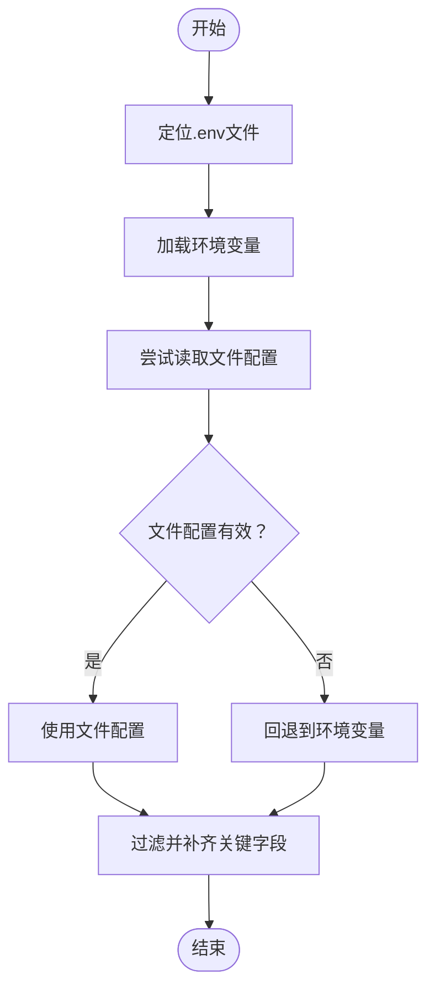
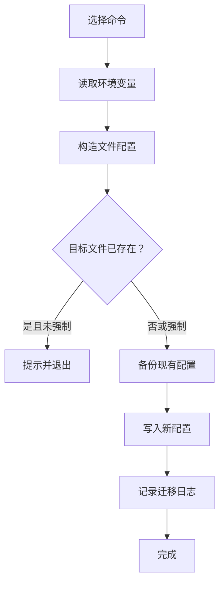
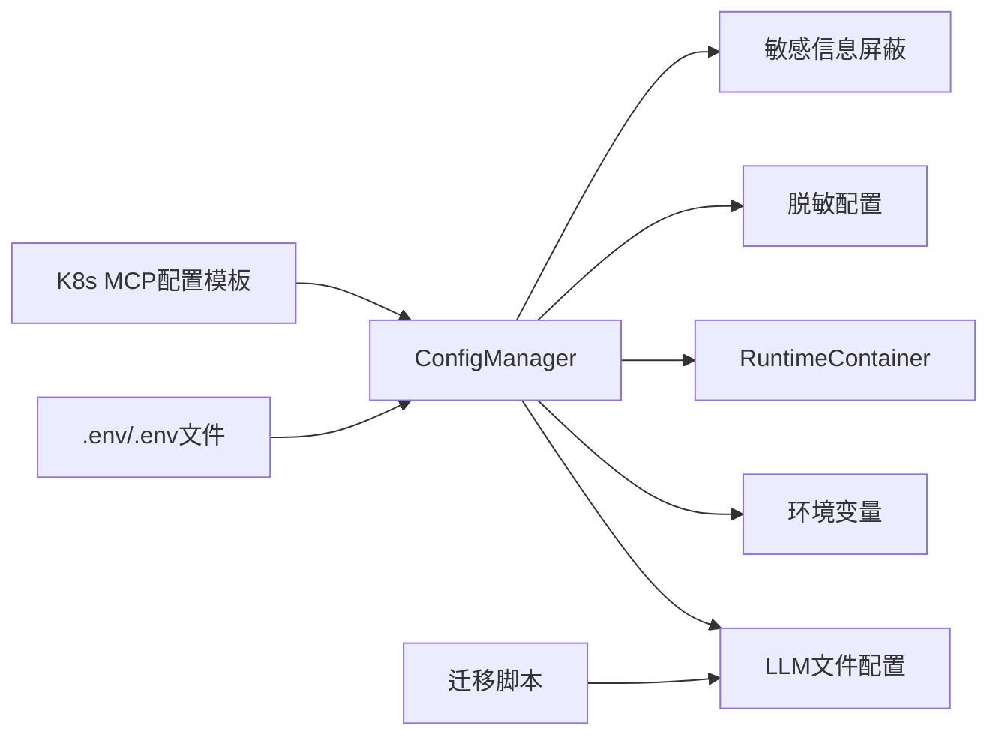

# 环境变量配置

<cite>
**本文引用的文件**
- [backend/config.env.example](file://backend/config.env.example)
- [backend/config.env](file://backend/config.env)
- [backend/src/config/manager.py](file://backend/src/config/manager.py)
- [scripts/migrate_llm_config.py](file://scripts/migrate_llm_config.py)
- [backend/src/llm/security/config.py](file://backend/src/llm/security/config.py)
- [backend/src/security/redaction.py](file://backend/src/security/redaction.py)
- [backend/src/app/container.py](file://backend/src/app/container.py)
- [archived/k8s-mcp-standalone/config/k8s_config.example.yaml](file://archived/k8s-mcp-standalone/config/k8s_config.example.yaml)
- [archived/k8s-mcp-standalone/config.env.example](file://archived/k8s-mcp-standalone/config.env.example)
- [frontend-v2/src/views/LLMConfig.vue](file://frontend-v2/src/views/LLMConfig.vue)
</cite>

## 目录
1. [简介](#简介)
2. [项目结构](#项目结构)
3. [核心组件](#核心组件)
4. [架构总览](#架构总览)
5. [详细组件分析](#详细组件分析)
6. [依赖关系分析](#依赖关系分析)
7. [性能考量](#性能考量)
8. [故障排查指南](#故障排查指南)
9. [结论](#结论)
10. [附录](#附录)

## 简介
本文件系统性阐述本项目的环境变量配置体系，涵盖配置来源与优先级、文件与环境变量的合并机制、敏感信息保护、多环境管理策略、最佳实践、验证与错误处理、以及在Docker与Kubernetes中的配置要点。读者无需深入技术背景，亦可通过本指南快速掌握如何正确配置与维护本项目的运行参数。

## 项目结构
围绕环境变量配置的关键位置如下：
- 示例与实际配置文件：backend/config.env.example、backend/config.env
- 配置管理器：backend/src/config/manager.py
- LLM配置迁移工具：scripts/migrate_llm_config.py
- LLM脱敏配置：backend/src/llm/security/config.py
- 敏感信息屏蔽工具：backend/src/security/redaction.py
- 运行时容器与配置刷新：backend/src/app/container.py
- K8s MCP配置示例（含环境变量占位）：archived/k8s-mcp-standalone/config/k8s_config.example.yaml、archived/k8s-mcp-standalone/config.env.example
- 前端配置界面的敏感信息掩码：frontend-v2/src/views/LLMConfig.vue

**图表来源**
- [backend/config.env.example:1-51](file://backend/config.env.example#L1-L51)
- [backend/config.env:1-42](file://backend/config.env#L1-L42)
- [backend/src/config/manager.py:35-71](file://backend/src/config/manager.py#L35-L71)
- [scripts/migrate_llm_config.py:31-42](file://scripts/migrate_llm_config.py#L31-L42)
- [backend/src/llm/security/config.py:9-37](file://backend/src/llm/security/config.py#L9-L37)
- [backend/src/security/redaction.py:9-36](file://backend/src/security/redaction.py#L9-L36)
- [backend/src/app/container.py:15-36](file://backend/src/app/container.py#L15-L36)
- [archived/k8s-mcp-standalone/config/k8s_config.example.yaml:21-44](file://archived/k8s-mcp-standalone/config/k8s_config.example.yaml#L21-L44)
- [archived/k8s-mcp-standalone/config.env.example:1-54](file://archived/k8s-mcp-standalone/config.env.example#L1-L54)

**章节来源**
- [backend/config.env.example:1-51](file://backend/config.env.example#L1-L51)
- [backend/config.env:1-42](file://backend/config.env#L1-L42)
- [backend/src/config/manager.py:35-71](file://backend/src/config/manager.py#L35-L71)
- [scripts/migrate_llm_config.py:31-42](file://scripts/migrate_llm_config.py#L31-L42)
- [archived/k8s-mcp-standalone/config/k8s_config.example.yaml:1-122](file://archived/k8s-mcp-standalone/config/k8s_config.example.yaml#L1-L122)
- [archived/k8s-mcp-standalone/config.env.example:1-54](file://archived/k8s-mcp-standalone/config.env.example#L1-L54)

## 核心组件
- 配置管理器（ConfigManager）
  - 负责定位并加载 .env 文件，支持从文件配置与环境变量两种来源读取，并在文件配置缺失或禁用时回退到环境变量。
  - 提供 LLM、MCP 等配置的统一访问接口，并在必要时触发配置重载。
- LLM配置迁移工具
  - 将环境变量配置迁移到文件配置，同时提供备份、回滚、校验与状态查询能力。
- LLM脱敏配置
  - 通过环境变量控制脱敏开关、加密密钥、会话超时、缓存策略与工具白名单。
- 敏感信息屏蔽工具
  - 提供敏感键识别与值掩码能力，用于日志与响应输出的脱敏。
- 运行时容器
  - 提供按磁盘配置重建 LLM 处理器的能力，便于在不重启进程的情况下刷新配置。
- K8s MCP配置模板
  - 提供 YAML 配置模板，其中包含对环境变量占位符的引用，便于在不同环境注入变量。

**章节来源**
- [backend/src/config/manager.py:35-221](file://backend/src/config/manager.py#L35-L221)
- [scripts/migrate_llm_config.py:154-207](file://scripts/migrate_llm_config.py#L154-L207)
- [backend/src/llm/security/config.py:9-37](file://backend/src/llm/security/config.py#L9-L37)
- [backend/src/security/redaction.py:9-45](file://backend/src/security/redaction.py#L9-L45)
- [backend/src/app/container.py:23-36](file://backend/src/app/container.py#L23-L36)
- [archived/k8s-mcp-standalone/config/k8s_config.example.yaml:21-44](file://archived/k8s-mcp-standalone/config/k8s_config.example.yaml#L21-L44)

## 架构总览
下图展示了“文件配置优先、环境变量回退”的混合策略，以及迁移工具与运行时容器的协作关系。

**图表来源**
- [backend/src/config/manager.py:38-96](file://backend/src/config/manager.py#L38-L96)
- [scripts/migrate_llm_config.py:154-207](file://scripts/migrate_llm_config.py#L154-L207)

**章节来源**
- [backend/src/config/manager.py:35-96](file://backend/src/config/manager.py#L35-L96)

## 详细组件分析

### 配置管理器（ConfigManager）
- 环境变量文件定位
  - 自动搜索多个候选路径，若均不存在则默认使用 config.env。
- LLM配置获取流程
  - 优先从文件配置读取；若文件配置不可用，则回退到环境变量。
  - 对返回配置进行过滤，保留关键字段并剔除空值。
- MCP配置获取流程
  - 从环境变量读取超时、重试、并发与缓存等参数。
- 错误处理
  - 文件读取异常或配置无效时，记录警告并返回默认配置。
- 配置重载
  - 提供重新加载LLM配置的能力，便于动态更新。

**图表来源**
- [backend/src/config/manager.py:57-125](file://backend/src/config/manager.py#L57-L125)

**章节来源**
- [backend/src/config/manager.py:35-221](file://backend/src/config/manager.py#L35-L221)

### LLM配置迁移工具
- 功能概览
  - 从环境变量读取配置，生成文件配置并写入目标路径。
  - 支持备份现有配置、回滚到环境变量模式、列出与恢复备份、验证配置有效性。
- 关键流程
  - 读取环境变量 → 构造提供商配置 → 生成完整配置 → 写入文件 → 记录迁移日志。
- 使用建议
  - 在生产环境迁移前务必备份；迁移后验证配置文件结构与提供商列表。

**图表来源**
- [scripts/migrate_llm_config.py:154-207](file://scripts/migrate_llm_config.py#L154-L207)

**章节来源**
- [scripts/migrate_llm_config.py:1-411](file://scripts/migrate_llm_config.py#L1-L411)

### LLM脱敏配置
- 关键点
  - 通过环境变量控制脱敏开关、加密密钥、会话超时、缓存策略与工具白名单。
  - 若未提供密钥，系统将生成随机密钥并在控制台打印（生产环境应持久化密钥）。
- 使用建议
  - 在生产环境显式设置 LLM_MASKING_KEY 并妥善保管；合理设置会话超时与缓存大小以平衡安全与性能。

**章节来源**
- [backend/src/llm/security/config.py:9-37](file://backend/src/llm/security/config.py#L9-L37)

### 敏感信息屏蔽工具
- 关键点
  - 识别敏感键（如 api_key、authorization、token、secret、webhook 等），并对值进行掩码处理。
- 使用建议
  - 在日志与响应输出前调用屏蔽逻辑，避免泄露敏感信息。

**章节来源**
- [backend/src/security/redaction.py:9-45](file://backend/src/security/redaction.py#L9-L45)

### 运行时容器与配置刷新
- 关键点
  - 通过重建 LLM 处理器的方式，按磁盘配置重新构建运行时组件，并同步更新钉钉机器人的处理器引用。
- 使用建议
  - 在配置变更后调用重建流程，确保运行时使用最新配置。

**章节来源**
- [backend/src/app/container.py:23-36](file://backend/src/app/container.py#L23-L36)

### K8s MCP配置模板与环境变量
- 关键点
  - YAML 配置模板中使用 ${ENV_VAR} 形式的占位符，可在不同环境注入对应变量。
  - 示例环境变量文件提供了开发、测试、生产等场景的配置片段。
- 使用建议
  - 在容器编排中通过环境变量注入占位符；区分开发、测试、生产环境的变量集合。

**章节来源**
- [archived/k8s-mcp-standalone/config/k8s_config.example.yaml:21-44](file://archived/k8s-mcp-standalone/config/k8s_config.example.yaml#L21-L44)
- [archived/k8s-mcp-standalone/config.env.example:1-54](file://archived/k8s-mcp-standalone/config.env.example#L1-L54)

## 依赖关系分析
- 配置来源与耦合
  - ConfigManager 依赖 .env 文件与环境变量；在文件配置可用时优先使用，降低对环境变量的直接依赖。
  - 迁移脚本独立于运行时，仅在需要时执行，避免影响线上运行。
- 组件内聚与解耦
  - 脱敏配置与屏蔽工具相对独立，便于在日志与响应层统一处理敏感信息。
  - 运行时容器提供统一的重建入口，降低配置刷新对上层业务的侵入。

**图表来源**
- [backend/src/config/manager.py:38-96](file://backend/src/config/manager.py#L38-L96)
- [scripts/migrate_llm_config.py:154-207](file://scripts/migrate_llm_config.py#L154-L207)
- [archived/k8s-mcp-standalone/config/k8s_config.example.yaml:21-44](file://archived/k8s-mcp-standalone/config/k8s_config.example.yaml#L21-L44)

**章节来源**
- [backend/src/config/manager.py:35-221](file://backend/src/config/manager.py#L35-L221)
- [scripts/migrate_llm_config.py:154-207](file://scripts/migrate_llm_config.py#L154-L207)

## 性能考量
- 配置读取与回退
  - 文件配置优先可减少对环境变量解析的依赖，提升启动与运行时的稳定性。
- 缓存与超时
  - MCP 配置中的缓存与超时参数直接影响请求性能与可靠性，应结合业务负载调整。
- 脱敏开销
  - 脱敏与屏蔽在高并发场景下可能带来额外开销，建议在生产环境合理设置缓存大小与调试开关。

[本节为通用指导，无需具体文件分析]

## 故障排查指南
- 未找到 .env 文件
  - 现象：系统使用默认配置或报错。
  - 排查：确认候选路径是否存在；若不存在，创建 backend/config.env 或 backend/.env。
  - 参考：[backend/src/config/manager.py:57-71](file://backend/src/config/manager.py#L57-L71)
- 文件配置无效或禁用
  - 现象：回退到环境变量但仍异常。
  - 排查：检查文件配置结构与提供商列表；使用迁移工具验证配置有效性。
  - 参考：[scripts/migrate_llm_config.py:283-325](file://scripts/migrate_llm_config.py#L283-L325)
- 环境变量类型错误
  - 现象：整型/浮点型参数解析失败。
  - 排查：确认数值型参数的字符串格式；参考默认值处理逻辑。
  - 参考：[backend/src/config/manager.py:142-146](file://backend/src/config/manager.py#L142-L146)
- 脱敏密钥缺失
  - 现象：系统生成随机密钥并打印。
  - 排查：在生产环境设置 LLM_MASKING_KEY 并持久化。
  - 参考：[backend/src/llm/security/config.py:16-23](file://backend/src/llm/security/config.py#L16-L23)
- 前端敏感信息泄露风险
  - 现象：配置界面展示原始密钥。
  - 排查：前端对敏感键进行掩码处理；避免在UI中明文显示。
  - 参考：[frontend-v2/src/views/LLMConfig.vue:347-360](file://frontend-v2/src/views/LLMConfig.vue#L347-L360)

**章节来源**
- [backend/src/config/manager.py:57-71](file://backend/src/config/manager.py#L57-L71)
- [scripts/migrate_llm_config.py:283-325](file://scripts/migrate_llm_config.py#L283-L325)
- [backend/src/llm/security/config.py:16-23](file://backend/src/llm/security/config.py#L16-L23)
- [frontend-v2/src/views/LLMConfig.vue:347-360](file://frontend-v2/src/views/LLMConfig.vue#L347-L360)

## 结论
本项目的环境变量配置体系采用“文件优先、环境变量回退”的混合策略，既保证了配置的集中化与可审计性，又保留了灵活的环境适配能力。配合迁移工具、脱敏配置与屏蔽工具，能够满足开发、测试与生产等多环境需求，并在安全性与可维护性之间取得平衡。

[本节为总结，无需具体文件分析]

## 附录

### 环境变量配置清单与用途
- LLM相关
  - LLM_ENABLED、LLM_PROVIDER、LLM_MODEL、LLM_API_KEY、LLM_BASE_URL、LLM_ORGANIZATION、LLM_API_VERSION、LLM_DEPLOYMENT_NAME、LLM_TIMEOUT、LLM_MAX_RETRIES、LLM_TEMPERATURE、LLM_MAX_TOKENS、LLM_STREAM
- 服务与日志
  - LOG_LEVEL、LOG_FILE、PORT、DEBUG、NO_PROXY
- 钉钉机器人
  - DINGTALK_WEBHOOK_URL、DINGTALK_SECRET
- Kubernetes（可选）
  - KUBECONFIG_PATH、K8S_NAMESPACE、K8S_IN_CLUSTER、K8S_API_SERVER、K8S_TOKEN、K8S_CA_CERT_PATH
- K8s MCP服务器（可选）
  - K8S_MCP_HOST、K8S_MCP_PORT、K8S_MCP_DEBUG
- 安全与审计（可选）
  - K8S_AUDIT_ENABLED、K8S_ALLOWED_NAMESPACES、K8S_FORBIDDEN_NAMESPACES、K8S_MAX_RESOURCES
- MCP全局（可选）
  - MCP_TIMEOUT、MCP_RETRY_ATTEMPTS、MCP_RETRY_DELAY、MCP_MAX_CONCURRENT_CALLS、MCP_ENABLE_CACHE、MCP_CACHE_TIMEOUT
- LLM脱敏（可选）
  - LLM_MASKING_ENABLED、LLM_MASKING_KEY、LLM_MASKING_SESSION_TIMEOUT、LLM_MASKING_CACHE、LLM_MASKING_CACHE_SIZE、LLM_MASKING_DEBUG、LLM_MASKING_TOOL_WHITELIST

**章节来源**
- [backend/config.env.example:4-51](file://backend/config.env.example#L4-L51)
- [backend/config.env:1-42](file://backend/config.env#L1-L42)
- [archived/k8s-mcp-standalone/config.env.example:1-54](file://archived/k8s-mcp-standalone/config.env.example#L1-L54)

### 不同部署环境的管理策略
- 开发环境
  - 使用本地 .env 文件，开启调试与较低的日志级别；允许宽松的安全策略以便快速迭代。
- 测试环境
  - 使用 .env.testing，限定命名空间与资源上限，降低日志级别，启用监控但关闭严格认证。
- 生产环境
  - 使用 .env.production，启用审计与认证、HTTPS、CORS；提高日志级别与线程池大小；开启Prometheus导出与邮件告警。

**章节来源**
- [archived/k8s-mcp-standalone/config.env.example:543-597](file://archived/k8s-mcp-standalone/config.env.example#L543-L597)

### Docker与Kubernetes环境下的配置方法
- Docker
  - 在容器中设置 K8S_MCP_HOST、KUBECONFIG_PATH、LOG_FILE 等变量；启用优雅关闭与健康检查路径。
- Kubernetes
  - 使用 ConfigMap/Secret 注入环境变量；在 Pod 模板中通过 env 与 envFrom 引用；YAML 配置模板中的 ${ENV_VAR} 占位符由环境变量注入。

**章节来源**
- [archived/k8s-mcp-standalone/config.env.example:586-597](file://archived/k8s-mcp-standalone/config.env.example#L586-L597)
- [archived/k8s-mcp-standalone/config/k8s_config.example.yaml:21-44](file://archived/k8s-mcp-standalone/config/k8s_config.example.yaml#L21-L44)

### 最佳实践
- 命名规范
  - 使用全大写与下划线风格；按模块前缀区分（如 LLM_、K8S_、MCP_）。
- 分类管理
  - 将配置分为“核心参数”“可选参数”“敏感参数”，敏感参数统一放入 Secret。
- 版本控制
  - 将 .env 示例纳入版本库，实际 .env 忽略在 .gitignore 中；迁移脚本生成的迁移日志与备份也应纳入版本控制策略。
- 验证与回滚
  - 迁移前后进行配置验证；保留备份以便快速回滚。
- 运行时刷新
  - 通过运行时容器重建流程刷新配置，避免不必要的重启。

**章节来源**
- [scripts/migrate_llm_config.py:154-207](file://scripts/migrate_llm_config.py#L154-L207)
- [backend/src/app/container.py:23-36](file://backend/src/app/container.py#L23-L36)