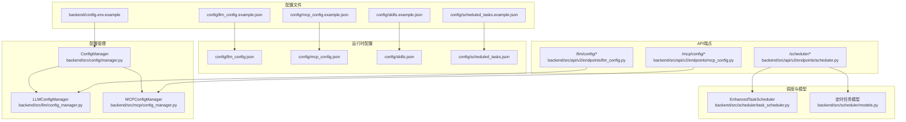
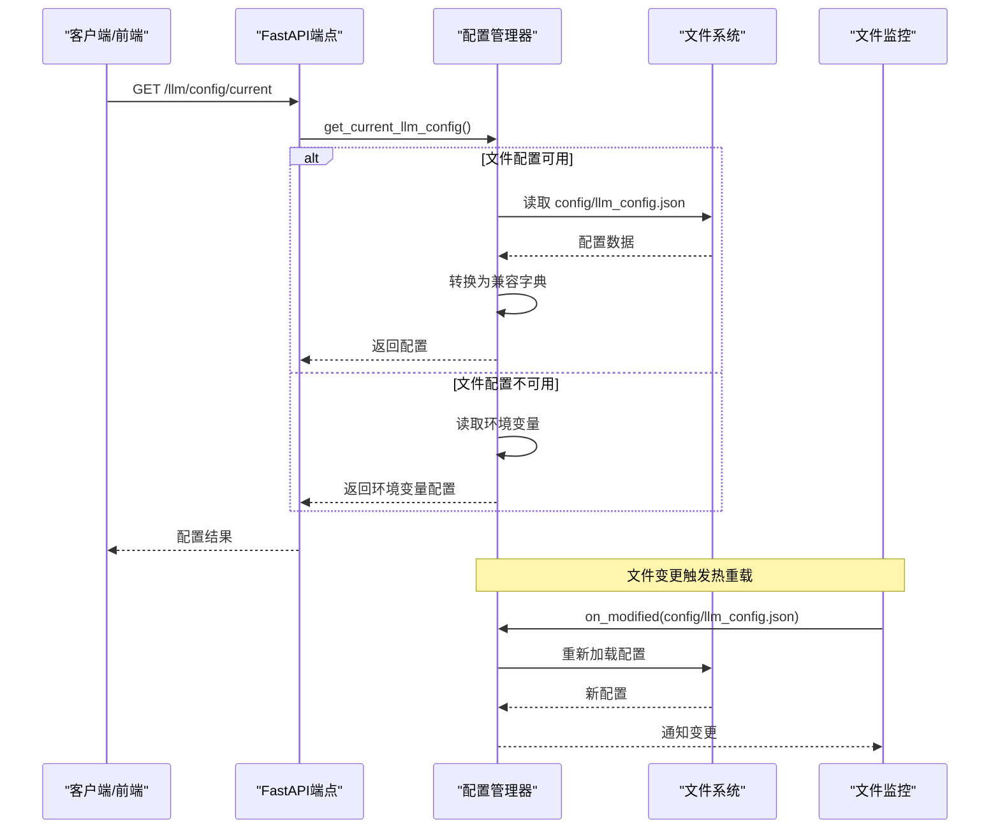
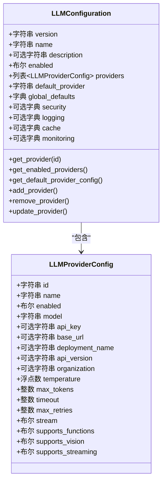
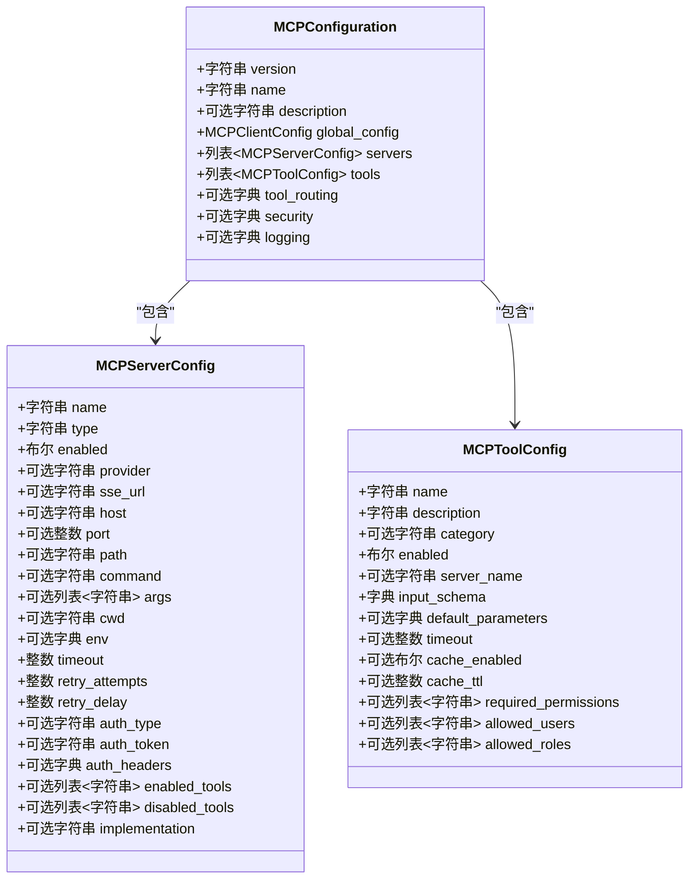
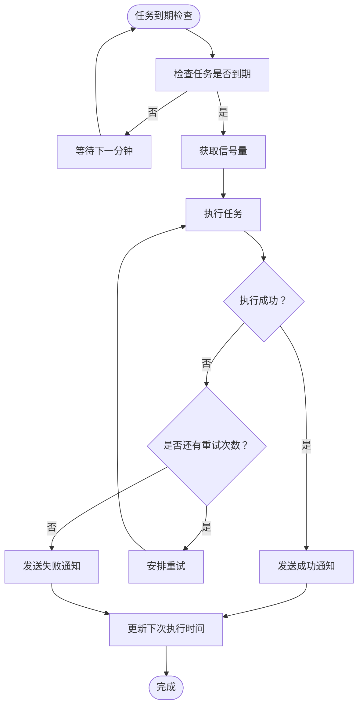
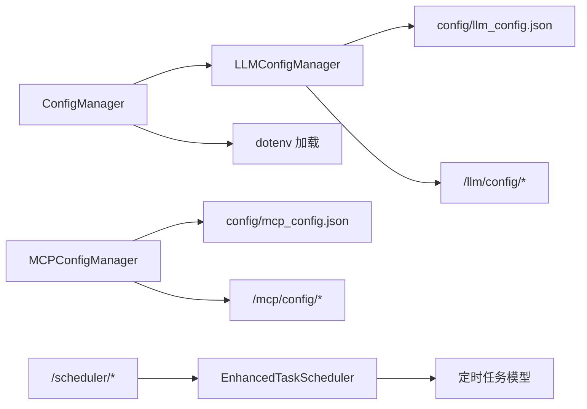

# 配置管理

<cite>
**本文引用的文件**
- [config/README.md](file://config/README.md)
- [config/llm_config.example.json](file://config/llm_config.example.json)
- [config/mcp_config.example.json](file://config/mcp_config.example.json)
- [config/scheduled_tasks.example.json](file://config/scheduled_tasks.example.json)
- [config/skills.example.json](file://config/skills.example.json)
- [backend/src/config/manager.py](file://backend/src/config/manager.py)
- [backend/src/llm/config_manager.py](file://backend/src/llm/config_manager.py)
- [backend/src/llm/config.py](file://backend/src/llm/config.py)
- [backend/src/mcp/config_manager.py](file://backend/src/mcp/config_manager.py)
- [backend/src/mcp/config.py](file://backend/src/mcp/config.py)
- [backend/src/api/v2/endpoints/llm_config.py](file://backend/src/api/v2/endpoints/llm_config.py)
- [backend/src/api/v2/endpoints/mcp_config.py](file://backend/src/api/v2/endpoints/mcp_config.py)
- [backend/src/scheduler/models.py](file://backend/src/scheduler/models.py)
- [backend/src/scheduler/task_scheduler.py](file://backend/src/scheduler/task_scheduler.py)
- [backend/src/api/v2/endpoints/scheduler.py](file://backend/src/api/v2/endpoints/scheduler.py)
- [scripts/migrate_llm_config.py](file://scripts/migrate_llm_config.py)
- [backend/config.env.example](file://backend/config.env.example)
- [backend/src/security/redaction.py](file://backend/src/security/redaction.py)
</cite>

## 目录
1. [简介](#简介)
2. [项目结构](#项目结构)
3. [核心组件](#核心组件)
4. [架构总览](#架构总览)
5. [详细组件分析](#详细组件分析)
6. [依赖分析](#依赖分析)
7. [性能考虑](#性能考虑)
8. [故障排除指南](#故障排除指南)
9. [结论](#结论)
10. [附录](#附录)

## 简介
本文件面向“钉钉K8s运维机器人”的配置管理系统，系统化阐述配置文件结构、加载与验证机制、热重载流程、环境变量与文件配置的优先级策略、安全与隐私保护、版本与迁移策略、故障排除与最佳实践。读者可据此完成LLM、MCP、技能与定时任务等配置的创建、维护与运维。

## 项目结构
配置相关的核心位置与职责如下：
- config/：运行时配置根目录，包含示例配置文件，禁止提交含凭证的运行时文件
- backend/config.env.example：环境变量示例，涵盖LLM、MCP、K8s、日志、钉钉等关键配置键
- backend/src/config/manager.py：统一配置管理器，负责文件与环境变量的混合策略
- backend/src/llm/config.py 与 backend/src/llm/config_manager.py：LLM配置的模型、文件管理与热重载
- backend/src/mcp/config.py 与 backend/src/mcp/config_manager.py：MCP配置的模型、文件管理与校验
- backend/src/api/v2/endpoints/*：LLM/MCP/定时任务的API端点，提供配置读取、更新、导入导出、备份恢复、连接测试等能力
- backend/src/scheduler/*：定时任务模型与调度器，配合API提供任务生命周期管理
- scripts/migrate_llm_config.py：LLM配置迁移脚本，支持从环境变量迁移到文件配置、备份与回滚
- backend/src/security/redaction.py：敏感信息脱敏工具，用于日志与响应输出

图表来源
- [config/README.md:1-17](file://config/README.md#L1-L17)
- [backend/src/config/manager.py:35-221](file://backend/src/config/manager.py#L35-L221)
- [backend/src/llm/config_manager.py:150-760](file://backend/src/llm/config_manager.py#L150-L760)
- [backend/src/mcp/config_manager.py:41-800](file://backend/src/mcp/config_manager.py#L41-L800)
- [backend/src/api/v2/endpoints/llm_config.py:94-473](file://backend/src/api/v2/endpoints/llm_config.py#L94-L473)
- [backend/src/api/v2/endpoints/mcp_config.py:115-563](file://backend/src/api/v2/endpoints/mcp_config.py#L115-L563)
- [backend/src/scheduler/task_scheduler.py:23-487](file://backend/src/scheduler/task_scheduler.py#L23-L487)
- [backend/src/scheduler/models.py:38-444](file://backend/src/scheduler/models.py#L38-L444)

章节来源
- [config/README.md:1-17](file://config/README.md#L1-L17)
- [backend/src/config/manager.py:35-221](file://backend/src/config/manager.py#L35-L221)

## 核心组件
- 统一配置管理器（ConfigManager）
  - 负责查找与加载 .env 或 config.env，支持LLM与MCP配置的文件优先、环境变量回退策略
  - 提供LLM与MCP配置的读取、热重载与降级回退
- LLM配置管理器（LLMConfigManager）
  - 基于文件的LLM配置管理，支持热重载、备份、导入导出、迁移与回调通知
  - 提供LLM提供商的增删改查与默认提供商选择
- MCP配置管理器（MCPConfigManager）
  - 基于文件的MCP服务器与工具配置管理，支持模板、连接测试、导入导出与备份恢复
- API端点
  - LLM配置API：当前配置、更新、提供商管理、验证、导入导出、备份恢复、文件监控开关与重启
  - MCP配置API：配置概览、服务器/工具管理、模板、验证、导入导出、备份恢复、连接测试
  - 定时任务API：任务增删改查、执行历史、手动执行、统计、Cron模板与校验、调度器状态、维护清理
- 调度器与模型
  - 增强任务调度器：并发控制、重试、通知、手动执行、运行中任务查询
  - 定时任务模型：任务类型、状态、通知级别、Cron表达式、默认配置模板

章节来源
- [backend/src/config/manager.py:35-221](file://backend/src/config/manager.py#L35-L221)
- [backend/src/llm/config_manager.py:150-760](file://backend/src/llm/config_manager.py#L150-L760)
- [backend/src/mcp/config_manager.py:41-800](file://backend/src/mcp/config_manager.py#L41-L800)
- [backend/src/api/v2/endpoints/llm_config.py:94-473](file://backend/src/api/v2/endpoints/llm_config.py#L94-L473)
- [backend/src/api/v2/endpoints/mcp_config.py:115-563](file://backend/src/api/v2/endpoints/mcp_config.py#L115-L563)
- [backend/src/scheduler/task_scheduler.py:23-487](file://backend/src/scheduler/task_scheduler.py#L23-L487)
- [backend/src/scheduler/models.py:38-444](file://backend/src/scheduler/models.py#L38-L444)

## 架构总览
配置管理采用“文件优先 + 环境变量回退”的混合策略，并通过API提供可视化与自动化运维能力。LLM与MCP分别拥有独立的配置文件与管理器，定时任务通过独立的模型与调度器实现。

图表来源
- [backend/src/config/manager.py:73-174](file://backend/src/config/manager.py#L73-L174)
- [backend/src/llm/config_manager.py:38-148](file://backend/src/llm/config_manager.py#L38-L148)

## 详细组件分析

### LLM配置管理
- 配置文件结构与字段
  - 版本、名称、描述、启用开关、默认提供商、提供商数组、全局默认、安全、日志、缓存、监控等
  - 提供商字段包含ID/名称/启用、模型、API密钥、基础URL、Azure/OpenAI特有字段、模型参数、连接与流式配置、功能支持、成本与限制等
- 加载与回退策略
  - 优先从文件读取；若文件缺失或默认提供商不可用，回退到环境变量
  - 环境变量回退时保留重要字段的默认值
- 热重载与备份
  - 基于文件监控的防抖热重载，读取JSON并验证格式，记录变更并通知回调
  - 自动创建备份目录与最近5个备份
- API能力
  - 读取当前配置、更新完整配置、提供商增删改查、验证、导入导出、备份列表与恢复、文件监控状态与开关、重启
- 安全与脱敏
  - 敏感键集合与正则匹配，对日志与响应进行递归脱敏

图表来源
- [backend/src/llm/config.py:15-360](file://backend/src/llm/config.py#L15-L360)

章节来源
- [config/llm_config.example.json:1-45](file://config/llm_config.example.json#L1-L45)
- [backend/src/llm/config.py:15-360](file://backend/src/llm/config.py#L15-L360)
- [backend/src/llm/config_manager.py:150-760](file://backend/src/llm/config_manager.py#L150-L760)
- [backend/src/api/v2/endpoints/llm_config.py:94-473](file://backend/src/api/v2/endpoints/llm_config.py#L94-L473)
- [backend/src/security/redaction.py:1-79](file://backend/src/security/redaction.py#L1-L79)

### MCP配置管理
- 配置文件结构与字段
  - 全局配置、服务器列表（名称、类型、启用、SSE/stdio/http/local参数、认证、工具过滤、实现方式）、工具列表、路由、安全与日志
  - 服务器类型支持sse、stdio、http、local；工具支持输入schema、默认参数、执行超时、缓存、权限等
- 加载与验证
  - 从文件加载，支持模板与连接测试；提供导入导出与备份恢复
- API能力
  - 配置概览、服务器/工具增删改查、模板列表与创建、验证、导入导出、备份恢复、连接测试

图表来源
- [backend/src/mcp/config.py:16-132](file://backend/src/mcp/config.py#L16-L132)

章节来源
- [config/mcp_config.example.json:1-66](file://config/mcp_config.example.json#L1-L66)
- [backend/src/mcp/config.py:16-132](file://backend/src/mcp/config.py#L16-L132)
- [backend/src/mcp/config_manager.py:41-800](file://backend/src/mcp/config_manager.py#L41-L800)
- [backend/src/api/v2/endpoints/mcp_config.py:115-563](file://backend/src/api/v2/endpoints/mcp_config.py#L115-L563)

### 技能配置
- 结构要点
  - 版本、默认技能ID、技能列表（ID、显示名、描述、允许的工具名与前缀）
- 用途
  - 控制不同角色或场景下的工具访问范围，如“全量工具”、“K8s只读”、“运维只读”

章节来源
- [config/skills.example.json:1-53](file://config/skills.example.json#L1-L53)

### 定时任务配置
- 结构要点
  - 版本、名称、描述、更新时间、任务数组
  - 任务类型枚举：cluster_check、resource_analysis、health_monitor、custom
  - 任务状态：pending、running、success、failed、cancelled
  - 通知级别：none、error_only、all
- 调度与执行
  - 增强任务调度器：并发控制、重试、通知（钉钉）、手动执行、运行中任务查询
  - API提供任务增删改查、执行历史、统计、Cron模板与校验、维护清理与统计重置

图表来源
- [backend/src/scheduler/task_scheduler.py:108-284](file://backend/src/scheduler/task_scheduler.py#L108-L284)
- [backend/src/scheduler/models.py:38-135](file://backend/src/scheduler/models.py#L38-L135)

章节来源
- [config/scheduled_tasks.example.json:1-8](file://config/scheduled_tasks.example.json#L1-L8)
- [backend/src/scheduler/models.py:38-444](file://backend/src/scheduler/models.py#L38-L444)
- [backend/src/scheduler/task_scheduler.py:23-487](file://backend/src/scheduler/task_scheduler.py#L23-L487)
- [backend/src/api/v2/endpoints/scheduler.py:99-661](file://backend/src/api/v2/endpoints/scheduler.py#L99-L661)

### 环境变量与文件配置优先级
- LLM配置
  - 优先读取文件配置（config/llm_config.json），若文件不可用或默认提供商不可用，则回退到环境变量
  - 环境变量回退时保留重要字段默认值
- MCP配置
  - 通过环境变量读取（如MCP_CONFIG_PATH等），用于运行期参数传递
- 技能与定时任务
  - 通过对应JSON文件管理，不涉及环境变量回退

章节来源
- [backend/src/config/manager.py:73-202](file://backend/src/config/manager.py#L73-L202)
- [backend/config.env.example:1-51](file://backend/config.env.example#L1-L51)

### 配置迁移与版本管理
- LLM配置迁移脚本
  - 从环境变量读取并生成文件配置，创建备份与迁移记录
  - 支持回退到环境变量模式、列出备份、从备份恢复、验证配置
- 文件备份策略
  - LLM与MCP均在保存配置前创建备份，保留最近5个备份
- 路径一致性与迁移
  - LLM与MCP配置管理器会检查配置文件路径一致性，必要时提示迁移至标准路径

章节来源
- [scripts/migrate_llm_config.py:1-411](file://scripts/migrate_llm_config.py#L1-L411)
- [backend/src/llm/config_manager.py:235-279](file://backend/src/llm/config_manager.py#L235-L279)
- [backend/src/mcp/config_manager.py:94-139](file://backend/src/mcp/config_manager.py#L94-L139)

### 安全与隐私保护
- 敏感信息脱敏
  - 敏感键集合与正则匹配，对日志与响应输出进行递归脱敏
- 配置文件安全
  - 运行时配置目录仅接受 *.example.json 提交，运行时文件不应包含API密钥、Webhook令牌、云凭证、kubeconfig路径等
- 环境变量安全
  - 示例文件中包含敏感键，需复制为 .env 并严格保密

章节来源
- [config/README.md:1-17](file://config/README.md#L1-L17)
- [backend/src/security/redaction.py:1-79](file://backend/src/security/redaction.py#L1-L79)
- [backend/config.env.example:1-51](file://backend/config.env.example#L1-L51)

## 依赖分析
- 组件耦合
  - ConfigManager 依赖 LLMConfigManager 与环境变量加载，形成“文件优先、环境变量回退”的统一入口
  - LLMConfigManager 与 MCPConfigManager 分别管理各自配置文件，提供导入导出、备份恢复、热重载与回调
  - API端点依赖各自的配置管理器与模型，提供可视化运维能力
  - 定时任务API依赖调度器与模型，实现任务生命周期管理
- 外部依赖
  - watchdog（文件监控，可选）
  - croniter（Cron表达式解析）
  - websockets/aiohttp（MCP连接测试）

图表来源
- [backend/src/config/manager.py:35-221](file://backend/src/config/manager.py#L35-L221)
- [backend/src/llm/config_manager.py:150-760](file://backend/src/llm/config_manager.py#L150-L760)
- [backend/src/mcp/config_manager.py:41-800](file://backend/src/mcp/config_manager.py#L41-L800)
- [backend/src/scheduler/task_scheduler.py:23-487](file://backend/src/scheduler/task_scheduler.py#L23-L487)

章节来源
- [backend/src/config/manager.py:35-221](file://backend/src/config/manager.py#L35-L221)
- [backend/src/llm/config_manager.py:150-760](file://backend/src/llm/config_manager.py#L150-L760)
- [backend/src/mcp/config_manager.py:41-800](file://backend/src/mcp/config_manager.py#L41-L800)
- [backend/src/scheduler/task_scheduler.py:23-487](file://backend/src/scheduler/task_scheduler.py#L23-L487)

## 性能考虑
- 并发与重试
  - 任务调度器使用信号量控制并发，避免资源争用；支持重试与延迟
- 文件监控防抖
  - LLM配置文件监控设置1秒防抖，减少频繁写入导致的重复重载
- 缓存与日志
  - LLM配置支持缓存与监控，MCP配置支持工具缓存；日志级别与敏感数据记录可配置
- 网络与超时
  - LLM与MCP均提供超时与重试配置，避免阻塞与资源泄漏

章节来源
- [backend/src/scheduler/task_scheduler.py:53-57](file://backend/src/scheduler/task_scheduler.py#L53-L57)
- [backend/src/llm/config_manager.py:46-68](file://backend/src/llm/config_manager.py#L46-L68)
- [backend/src/llm/config.py:143-150](file://backend/src/llm/config.py#L143-L150)
- [backend/src/mcp/config.py:87-90](file://backend/src/mcp/config.py#L87-L90)

## 故障排除指南
- LLM配置无法加载
  - 检查 config/llm_config.json 是否存在且JSON格式正确；查看热重载日志与备份
  - 若文件缺失，确认环境变量是否正确；回退到环境变量模式
- MCP配置连接失败
  - 使用连接测试端点验证服务器类型（sse/http/local等）与参数；检查认证与超时
- 定时任务未执行
  - 检查Cron表达式有效性与时区；查看调度器状态与运行中任务；确认任务启用与下次执行时间
- 配置迁移问题
  - 使用迁移脚本列出/恢复备份；验证配置结构与提供商字段；检查迁移记录

章节来源
- [backend/src/llm/config_manager.py:78-119](file://backend/src/llm/config_manager.py#L78-L119)
- [backend/src/api/v2/endpoints/mcp_config.py:536-563](file://backend/src/api/v2/endpoints/mcp_config.py#L536-L563)
- [backend/src/api/v2/endpoints/scheduler.py:492-531](file://backend/src/api/v2/endpoints/scheduler.py#L492-L531)
- [scripts/migrate_llm_config.py:233-282](file://scripts/migrate_llm_config.py#L233-L282)

## 结论
本配置管理系统通过“文件优先 + 环境变量回退”的策略，结合热重载、备份恢复、导入导出与可视化API，实现了LLM、MCP、技能与定时任务的全链路配置管理。配合敏感信息脱敏与严格的文件安全策略，满足生产环境的可运维性与安全性要求。

## 附录
- 环境变量键参考（节选）
  - LLM相关：LLM_ENABLED、LLM_PROVIDER、LLM_MODEL、LLM_API_KEY、LLM_BASE_URL、LLM_TEMPERATURE、LLM_MAX_TOKENS、LLM_TIMEOUT、LLM_MAX_RETRIES、LLM_STREAM
  - 钉钉机器人：DINGTALK_WEBHOOK_URL、DINGTALK_SECRET
  - Kubernetes：KUBECONFIG_PATH、K8S_NAMESPACE、K8S_IN_CLUSTER、K8S_API_SERVER、K8S_TOKEN、K8S_CA_CERT_PATH
  - MCP：MCP_CONFIG_PATH、MCP_TOOLS_CONFIG_PATH
  - LLM数据脱敏：LLM_MASKING_ENABLED、LLM_MASKING_KEY、LLM_MASKING_SESSION_TIMEOUT、LLM_MASKING_CACHE、LLM_MASKING_CACHE_SIZE、LLM_MASKING_DEBUG、LLM_MASKING_TOOL_WHITELIST

章节来源
- [backend/config.env.example:1-51](file://backend/config.env.example#L1-L51)