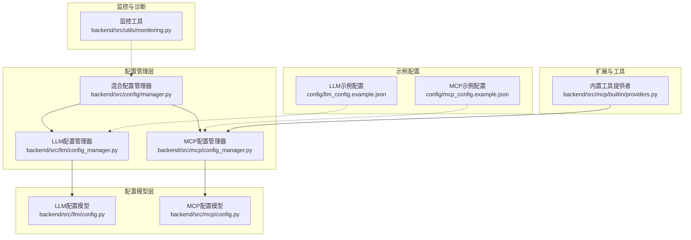
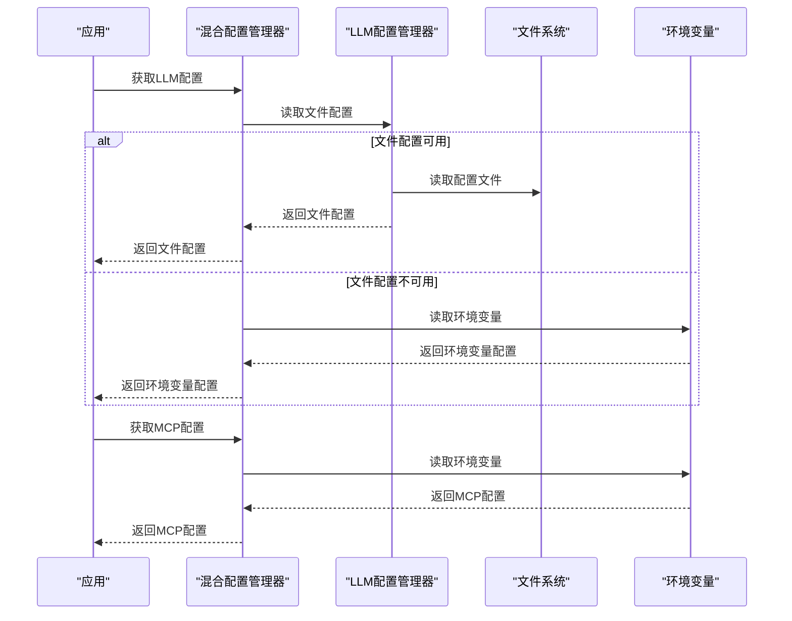
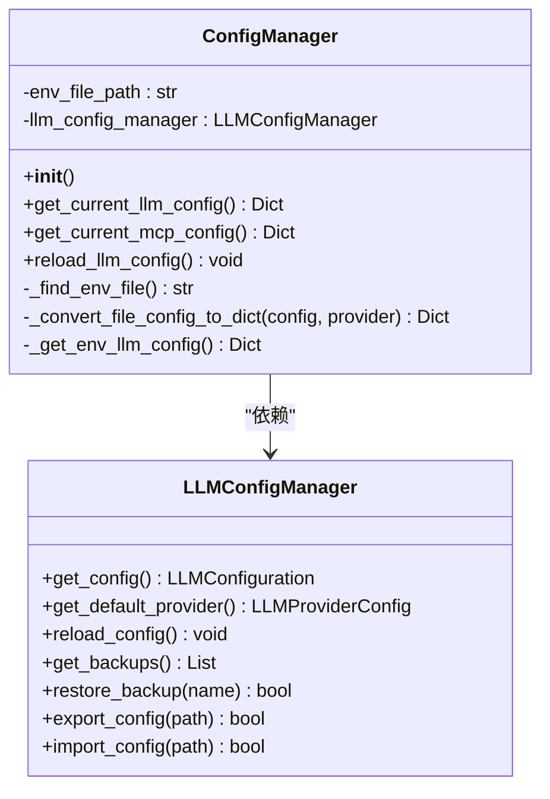
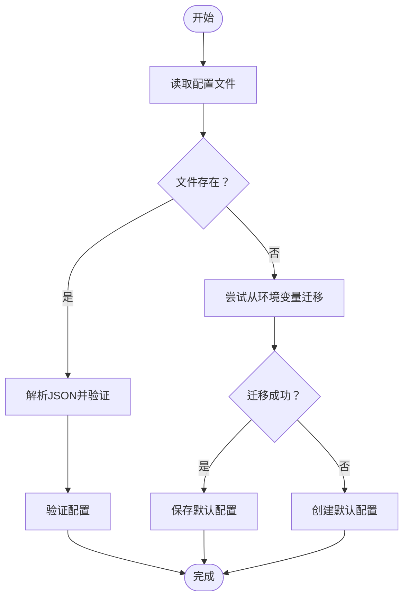
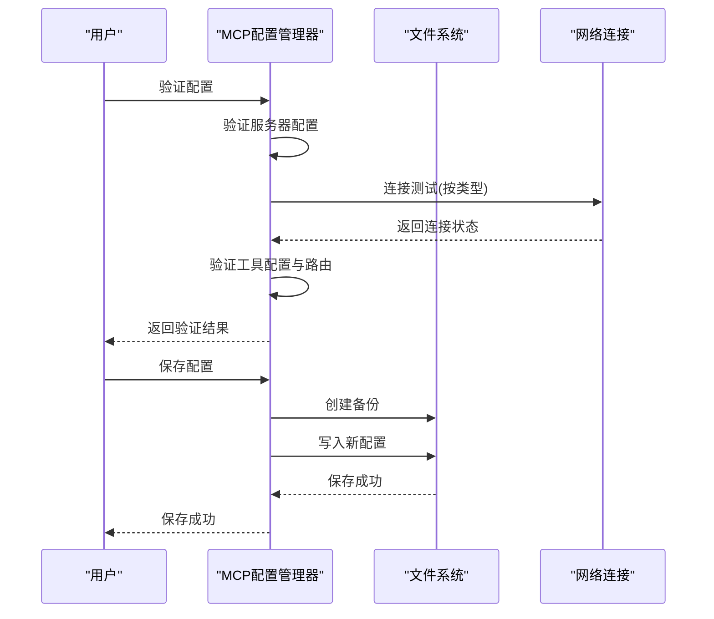
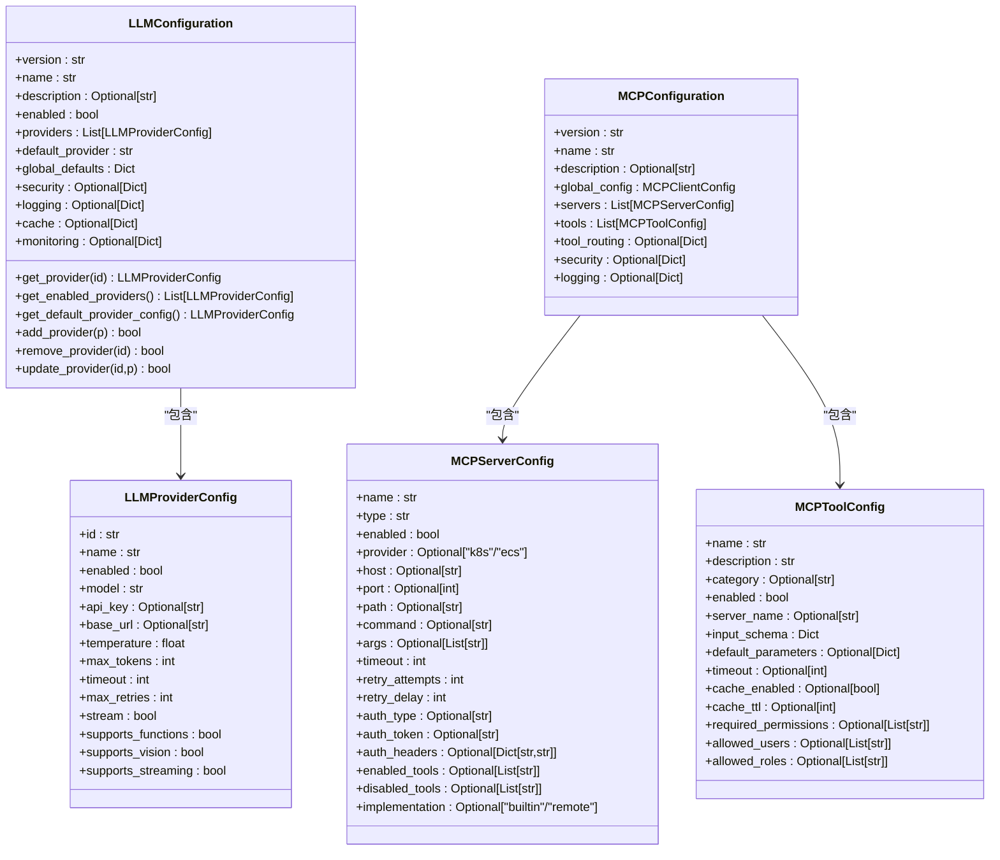
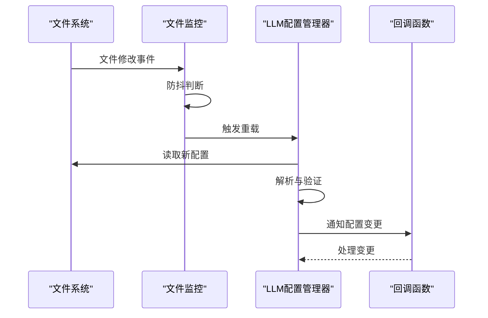
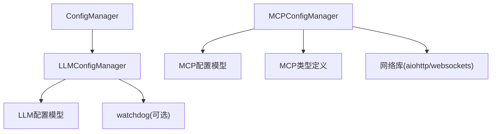

# 配置管理核心机制

<cite>
**本文档引用的文件**
- [backend/src/config/manager.py](file://backend/src/config/manager.py)
- [backend/src/mcp/config_manager.py](file://backend/src/mcp/config_manager.py)
- [backend/src/llm/config_manager.py](file://backend/src/llm/config_manager.py)
- [backend/src/llm/config.py](file://backend/src/llm/config.py)
- [backend/src/mcp/config.py](file://backend/src/mcp/config.py)
- [config/llm_config.example.json](file://config/llm_config.example.json)
- [config/mcp_config.example.json](file://config/mcp_config.example.json)
- [backend/src/utils/monitoring.py](file://backend/src/utils/monitoring.py)
- [backend/src/mcp/builtin/providers.py](file://backend/src/mcp/builtin/providers.py)
- [backend/tests/test_config_manager.py](file://backend/tests/test_config_manager.py)
</cite>

## 目录
1. [引言](#引言)
2. [项目结构](#项目结构)
3. [核心组件](#核心组件)
4. [架构总览](#架构总览)
5. [详细组件分析](#详细组件分析)
6. [依赖关系分析](#依赖关系分析)
7. [性能考量](#性能考量)
8. [故障排查指南](#故障排查指南)
9. [结论](#结论)
10. [附录](#附录)

## 引言
本文件系统性阐述配置管理核心机制，覆盖配置加载、验证、热重载、变更检测与通知、缓存策略、依赖关系与循环检测、安全机制、版本与回滚、扩展接口与自定义提供者、监控与诊断等方面。通过对仓库中LLM配置管理器、MCP配置管理器以及混合配置管理器的深入分析，帮助开发者与运维人员全面掌握配置系统的实现原理与最佳实践。

## 项目结构
配置管理相关代码主要分布在以下模块：
- 混合配置管理器：负责统一加载与提供LLM与MCP配置，并支持环境变量回退。
- LLM配置管理器：基于文件的配置管理，支持热重载、备份、导入导出、迁移与路径一致性校验。
- MCP配置管理器：面向MCP服务器与工具的配置管理，支持模板、验证、连接测试、备份与回滚。
- 配置模型：Pydantic模型定义，提供强类型约束与字段校验。
- 示例配置：提供标准JSON配置示例，便于本地复制与定制。
- 监控与诊断：性能监控、请求追踪与调试信息收集工具。
- 扩展接口：内置工具提供者抽象，支持自定义工具提供者扩展。

**图表来源**
- [backend/src/config/manager.py:1-221](file://backend/src/config/manager.py#L1-L221)
- [backend/src/llm/config_manager.py:1-760](file://backend/src/llm/config_manager.py#L1-L760)
- [backend/src/mcp/config_manager.py:1-800](file://backend/src/mcp/config_manager.py#L1-L800)
- [backend/src/llm/config.py:1-360](file://backend/src/llm/config.py#L1-L360)
- [backend/src/mcp/config.py:1-132](file://backend/src/mcp/config.py#L1-L132)
- [config/llm_config.example.json:1-45](file://config/llm_config.example.json#L1-L45)
- [config/mcp_config.example.json:1-66](file://config/mcp_config.example.json#L1-L66)
- [backend/src/mcp/builtin/providers.py:1-171](file://backend/src/mcp/builtin/providers.py#L1-L171)
- [backend/src/utils/monitoring.py:1-396](file://backend/src/utils/monitoring.py#L1-L396)

**章节来源**
- [backend/src/config/manager.py:1-221](file://backend/src/config/manager.py#L1-L221)
- [backend/src/llm/config_manager.py:1-760](file://backend/src/llm/config_manager.py#L1-L760)
- [backend/src/mcp/config_manager.py:1-800](file://backend/src/mcp/config_manager.py#L1-L800)
- [backend/src/llm/config.py:1-360](file://backend/src/llm/config.py#L1-L360)
- [backend/src/mcp/config.py:1-132](file://backend/src/mcp/config.py#L1-L132)
- [config/llm_config.example.json:1-45](file://config/llm_config.example.json#L1-L45)
- [config/mcp_config.example.json:1-66](file://config/mcp_config.example.json#L1-L66)
- [backend/src/mcp/builtin/providers.py:1-171](file://backend/src/mcp/builtin/providers.py#L1-L171)
- [backend/src/utils/monitoring.py:1-396](file://backend/src/utils/monitoring.py#L1-L396)

## 核心组件
- 混合配置管理器（ConfigManager）
  - 统一加载环境变量文件，支持LLM与MCP配置的获取与回退策略。
  - 提供LLM配置的文件优先与环境变量回退、MCP配置的环境变量读取。
  - 支持LLM配置的重新加载。
- LLM配置管理器（LLMConfigManager）
  - 基于文件的配置管理，支持迁移、路径一致性校验、备份与回滚。
  - 内置文件监控与热重载，带防抖与变更记录。
  - 提供提供商的增删改查、默认提供商选择、导入导出。
- MCP配置管理器（MCPConfigManager）
  - 统一的MCP配置结构，支持服务器与工具的增删改查、模板与验证。
  - 提供连接测试、备份与回滚、导入导出。
  - 支持模板加载与内置模板集合。
- 配置模型（Pydantic）
  - LLMConfiguration/LLMProviderConfig：强类型LLM配置模型，含字段校验与默认值。
  - MCPConfiguration/MCPServerConfig/MCPToolConfig：强类型MCP配置模型，含字段校验与默认值。
- 监控与诊断（PerformanceMonitor/DebugCollector）
  - 请求追踪、系统指标采集、错误统计与性能分析。
  - 调试日志收集与上下文数据管理。

**章节来源**
- [backend/src/config/manager.py:35-221](file://backend/src/config/manager.py#L35-L221)
- [backend/src/llm/config_manager.py:150-760](file://backend/src/llm/config_manager.py#L150-L760)
- [backend/src/mcp/config_manager.py:41-800](file://backend/src/mcp/config_manager.py#L41-L800)
- [backend/src/llm/config.py:15-360](file://backend/src/llm/config.py#L15-L360)
- [backend/src/mcp/config.py:16-132](file://backend/src/mcp/config.py#L16-L132)
- [backend/src/utils/monitoring.py:51-396](file://backend/src/utils/monitoring.py#L51-L396)

## 架构总览
配置管理采用“混合优先、文件优先、环境变量回退”的策略。LLM配置优先从文件读取，若不可用或未启用则回退到环境变量；MCP配置主要来源于环境变量。LLM配置管理器提供热重载能力，MCP配置管理器提供模板与验证能力。两者均支持备份与回滚，确保配置变更的安全性与可追溯性。

**图表来源**
- [backend/src/config/manager.py:73-202](file://backend/src/config/manager.py#L73-L202)
- [backend/src/llm/config_manager.py:411-431](file://backend/src/llm/config_manager.py#L411-L431)

**章节来源**
- [backend/src/config/manager.py:35-202](file://backend/src/config/manager.py#L35-L202)

## 详细组件分析

### 混合配置管理器（ConfigManager）
- 环境变量文件发现与加载：支持多种路径，自动定位并加载。
- LLM配置获取：
  - 优先尝试从文件配置读取，转换为兼容字典格式。
  - 若文件配置不可用或未启用，回退到环境变量配置。
- MCP配置获取：从环境变量读取，提供超时、重试、并发与缓存等参数。
- LLM配置重新加载：委托给LLM配置管理器执行。

**图表来源**
- [backend/src/config/manager.py:35-221](file://backend/src/config/manager.py#L35-L221)
- [backend/src/llm/config_manager.py:473-564](file://backend/src/llm/config_manager.py#L473-L564)

**章节来源**
- [backend/src/config/manager.py:35-221](file://backend/src/config/manager.py#L35-L221)

### LLM配置管理器（LLMConfigManager）
- 文件迁移与路径一致性：自动迁移至标准路径，检查并提示其他位置的配置文件。
- 配置加载与回退：优先读取文件，不存在则尝试从环境变量迁移，最后创建默认配置。
- 热重载与文件监控：基于watchdog实现文件监控，防抖机制避免频繁重载，记录变更并通知回调。
- 备份与回滚：保存配置前自动创建备份，限制最近5个备份；支持从备份恢复。
- 导入导出：支持配置导入与导出，便于迁移与备份。
- 提供商管理：支持添加、更新、删除提供商，选择默认提供商。

**图表来源**
- [backend/src/llm/config_manager.py:411-431](file://backend/src/llm/config_manager.py#L411-L431)
- [backend/src/llm/config_manager.py:235-279](file://backend/src/llm/config_manager.py#L235-L279)

**章节来源**
- [backend/src/llm/config_manager.py:150-760](file://backend/src/llm/config_manager.py#L150-L760)

### MCP配置管理器（MCPConfigManager）
- 配置结构统一：统一的MCP配置结构，包含全局配置、服务器列表、工具列表、安全与日志配置。
- 模板系统：内置模板与用户模板，支持从模板创建服务器配置。
- 验证与连接测试：对服务器类型、必填字段进行验证，并进行连接测试（WebSocket、HTTP、SSE、本地、子进程）。
- 备份与回滚：保存配置前自动创建备份，限制最近5个备份；支持从备份恢复。
- 导入导出：支持配置导入与导出，便于迁移与备份。
- 服务器与工具管理：支持增删改查、启用/禁用切换、工具路由配置。

**图表来源**
- [backend/src/mcp/config_manager.py:486-551](file://backend/src/mcp/config_manager.py#L486-L551)
- [backend/src/mcp/config_manager.py:272-289](file://backend/src/mcp/config_manager.py#L272-L289)

**章节来源**
- [backend/src/mcp/config_manager.py:41-800](file://backend/src/mcp/config_manager.py#L41-L800)

### 配置模型与解析流程
- LLM配置模型：
  - LLMProviderConfig：提供商核心配置、Azure/OpenAI特有配置、模型参数、连接配置、流式输出配置、功能支持与成本限制等。
  - LLMConfiguration：版本、名称、描述、启用状态、提供商列表、默认提供商、全局默认配置、安全与日志、缓存与监控配置。
  - 字段校验：ID格式、模型名称、基础URL格式等。
- MCP配置模型：
  - MCPServerConfig：服务器类型（sse/stdio/http/local）、连接配置、认证配置、工具过滤、实现方式（builtin/remote）等。
  - MCPToolConfig：工具描述、分类、启用状态、所属服务器、输入schema、默认参数、执行配置、权限配置等。
  - MCPConfiguration：全局配置、服务器列表、工具列表、路由配置、安全与日志配置等。

**图表来源**
- [backend/src/llm/config.py:15-360](file://backend/src/llm/config.py#L15-L360)
- [backend/src/mcp/config.py:16-132](file://backend/src/mcp/config.py#L16-L132)

**章节来源**
- [backend/src/llm/config.py:15-360](file://backend/src/llm/config.py#L15-L360)
- [backend/src/mcp/config.py:16-132](file://backend/src/mcp/config.py#L16-L132)

### 配置变更检测与通知机制
- LLM配置热重载：
  - 文件监控：基于watchdog，防抖延迟1秒，避免频繁重载。
  - 变更记录：比较旧配置与新配置的关键字段，记录主要变更。
  - 回调通知：通知已注册的回调函数，触发运行时服务更新。
- MCP配置变更：
  - 保存配置时自动创建备份，限制最近5个备份。
  - 通过管理器提供的reload接口重新加载配置。

**图表来源**
- [backend/src/llm/config_manager.py:38-148](file://backend/src/llm/config_manager.py#L38-L148)
- [backend/src/llm/config_manager.py:713-732](file://backend/src/llm/config_manager.py#L713-L732)

**章节来源**
- [backend/src/llm/config_manager.py:38-148](file://backend/src/llm/config_manager.py#L38-L148)
- [backend/src/llm/config_manager.py:713-732](file://backend/src/llm/config_manager.py#L713-L732)

### 配置缓存策略与性能优化
- LLM配置缓存：
  - 配置模型自带缓存配置项（启用、TTL、最大大小），可在配置中启用并调整。
  - 运行时可通过配置开关与参数控制缓存行为。
- MCP查询缓存：
  - 查询处理器实现简单的LRU风格缓存，限制最大条目数量并按TTL清理。
- 性能监控：
  - 性能监控器收集系统指标、请求统计、错误计数与端点统计，支持启动/停止与历史查询。
  - 调试信息收集器支持上下文数据与请求级调试日志。

**章节来源**
- [backend/src/llm/config.py:142-161](file://backend/src/llm/config.py#L142-L161)
- [backend/src/k8s_mcp/core/relation_query_handler.py:998-1028](file://backend/src/k8s_mcp/core/relation_query_handler.py#L998-L1028)
- [backend/src/utils/monitoring.py:51-242](file://backend/src/utils/monitoring.py#L51-L242)

### 配置依赖关系管理与循环依赖检测
- LLM配置模型：
  - 通过默认提供商ID与提供商列表关联，提供获取默认提供商与启用提供商的方法。
  - 通过字段校验确保默认提供商存在于提供商列表中。
- MCP配置模型：
  - 工具配置包含所属服务器名称字段，用于建立工具与服务器的依赖关系。
  - 验证阶段检查工具是否对应启用的服务器，未对应时产生警告。
- 循环依赖检测：
  - 代码中未实现显式的循环依赖检测逻辑，建议在新增配置时遵循“单向依赖”原则，并在验证阶段增加依赖图检查。

**章节来源**
- [backend/src/llm/config.py:163-207](file://backend/src/llm/config.py#L163-L207)
- [backend/src/mcp/config.py:74-95](file://backend/src/mcp/config.py#L74-L95)
- [backend/src/mcp/config_manager.py:525-545](file://backend/src/mcp/config_manager.py#L525-L545)

### 配置安全机制
- 敏感信息处理：
  - LLM安全配置包含脱敏开关、加密密钥、会话超时、缓存与调试选项。
  - 脱敏规则支持多种敏感信息识别与不同脱敏策略（哈希、映射、部分掩码、完全加密、域名保持）。
- 访问控制：
  - MCP配置包含安全配置与日志配置，可用于控制只读默认、审计启用等。
  - 工具配置支持权限要求、用户与角色白名单。
- 环境变量回退：
  - LLM配置支持从环境变量读取API密钥、基础URL、组织ID等敏感信息，避免硬编码。

**章节来源**
- [backend/src/llm/config.py:120-161](file://backend/src/llm/config.py#L120-L161)
- [backend/src/mcp/config.py:74-95](file://backend/src/mcp/config.py#L74-L95)
- [backend/src/config/manager.py:127-173](file://backend/src/config/manager.py#L127-L173)

### 配置版本管理与回滚机制
- 版本字段：LLM与MCP配置均包含version字段，便于版本追踪。
- 自动备份：保存配置前自动创建备份，限制最近5个备份。
- 回滚操作：支持从备份文件恢复配置，确保变更可逆。
- 迁移与路径一致性：自动迁移配置文件至标准路径，检查并提示其他位置的配置文件。

**章节来源**
- [backend/src/llm/config_manager.py:291-309](file://backend/src/llm/config_manager.py#L291-L309)
- [backend/src/mcp/config_manager.py:272-289](file://backend/src/mcp/config_manager.py#L272-L289)
- [backend/src/llm/config_manager.py:235-279](file://backend/src/llm/config_manager.py#L235-L279)

### 扩展接口与自定义配置提供者
- 内置工具提供者抽象：
  - BuiltinToolProvider抽象定义了提供者ID、注册、工具列表与执行接口。
  - K8sBuiltinProvider与EcsBuiltinProvider分别注册并提供工具映射与执行。
  - 支持多提供者合并，处理同名工具的覆盖策略。
- 自定义提供者开发指南：
  - 实现BuiltinToolProvider接口，定义provider_id、register、list_mcptools、execute_tool。
  - 在工具注册处注册自定义提供者，确保工具Schema与MCPTool兼容。
  - 通过collect_builtin_mcptools合并工具映射，注意命名冲突处理。

**章节来源**
- [backend/src/mcp/builtin/providers.py:53-171](file://backend/src/mcp/builtin/providers.py#L53-L171)

### 监控指标与故障诊断
- 性能监控：
  - 收集系统指标（CPU、内存、磁盘、连接数、请求量、错误率、平均响应时间）。
  - 提供启动/停止监控任务、获取性能统计与请求历史。
- 调试信息：
  - 调试信息收集器支持上下文数据与请求级调试日志，便于问题定位。
- 配置验证与连接测试：
  - MCP配置管理器提供验证与连接测试，返回服务器与工具状态，辅助诊断配置问题。

**章节来源**
- [backend/src/utils/monitoring.py:51-396](file://backend/src/utils/monitoring.py#L51-L396)
- [backend/src/mcp/config_manager.py:486-716](file://backend/src/mcp/config_manager.py#L486-L716)

## 依赖关系分析
- 组件耦合：
  - ConfigManager依赖LLMConfigManager，实现混合配置获取。
  - LLMConfigManager与MCPConfigManager分别管理各自配置，互不直接依赖。
  - MCP配置管理器依赖MCP配置模型与类型定义。
- 外部依赖：
  - watchdog：文件监控（可选）。
  - pydantic：配置模型验证。
  - json/aiohttp/websockets：配置文件读写与连接测试。
- 潜在循环依赖：
  - 配置模型之间无循环依赖；工具提供者通过抽象接口解耦。

**图表来源**
- [backend/src/config/manager.py:35-221](file://backend/src/config/manager.py#L35-L221)
- [backend/src/llm/config_manager.py:150-760](file://backend/src/llm/config_manager.py#L150-L760)
- [backend/src/mcp/config_manager.py:41-800](file://backend/src/mcp/config_manager.py#L41-L800)

**章节来源**
- [backend/src/config/manager.py:35-221](file://backend/src/config/manager.py#L35-L221)
- [backend/src/llm/config_manager.py:150-760](file://backend/src/llm/config_manager.py#L150-L760)
- [backend/src/mcp/config_manager.py:41-800](file://backend/src/mcp/config_manager.py#L41-L800)

## 性能考量
- 文件监控防抖：避免频繁重载导致的性能抖动。
- 备份数量限制：仅保留最近5个备份，减少磁盘占用。
- 查询缓存：简单LRU风格缓存，限制最大条目数量并按TTL清理。
- 监控开销：系统指标采集可配置间隔，避免过度消耗资源。
- 连接测试：按服务器类型进行轻量级连接测试，避免阻塞主线程。

[本节为通用指导，无需特定文件引用]

## 故障排查指南
- 配置加载失败：
  - 检查配置文件路径一致性与权限。
  - 查看迁移日志，确认是否成功迁移至标准路径。
  - 检查环境变量是否正确设置，特别是敏感信息。
- 热重载不生效：
  - 确认watchdog是否可用，文件监控是否启动。
  - 检查防抖机制是否导致重载被抑制。
  - 查看回调函数是否正确注册。
- 连接测试失败：
  - 检查服务器类型与必填字段配置。
  - 根据返回的状态码定位具体问题（超时、拒绝、协议错误等）。
- 备份与回滚：
  - 确认备份文件存在且可读。
  - 恢复后验证配置是否正确加载。

**章节来源**
- [backend/src/llm/config_manager.py:628-703](file://backend/src/llm/config_manager.py#L628-L703)
- [backend/src/mcp/config_manager.py:553-716](file://backend/src/mcp/config_manager.py#L553-L716)
- [backend/src/mcp/config_manager.py:766-783](file://backend/src/mcp/config_manager.py#L766-L783)

## 结论
本配置管理系统通过“文件优先、环境变量回退”的策略，结合热重载、备份与回滚、验证与连接测试、监控与诊断等能力，实现了高可用、可维护、可观测的配置管理。LLM与MCP配置分别采用成熟的文件管理与模板验证机制，配合内置工具提供者抽象，支持灵活扩展。建议在生产环境中启用备份与监控，合理配置缓存与连接测试，确保配置变更的安全与稳定。

[本节为总结，无需特定文件引用]

## 附录
- 示例配置参考：
  - LLM配置示例：包含版本、名称、描述、启用状态、默认提供商、提供商列表、全局默认配置、安全与日志配置。
  - MCP配置示例：包含版本、名称、描述、全局配置、服务器列表、工具列表、安全与日志配置。
- 单元测试：
  - MCP配置管理器单元测试覆盖默认配置路径、路径一致性检查、配置迁移与统一结构验证。

**章节来源**
- [config/llm_config.example.json:1-45](file://config/llm_config.example.json#L1-L45)
- [config/mcp_config.example.json:1-66](file://config/mcp_config.example.json#L1-L66)
- [backend/tests/test_config_manager.py:33-141](file://backend/tests/test_config_manager.py#L33-L141)