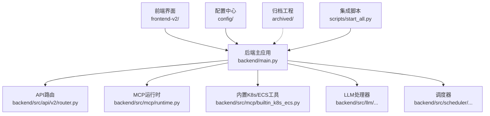
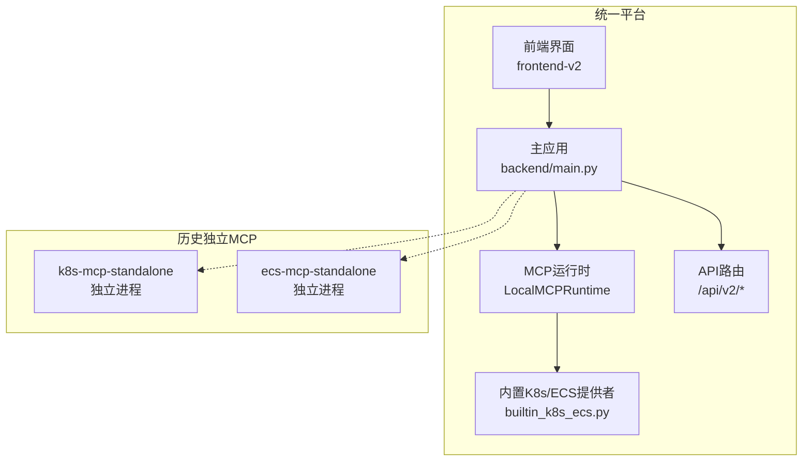
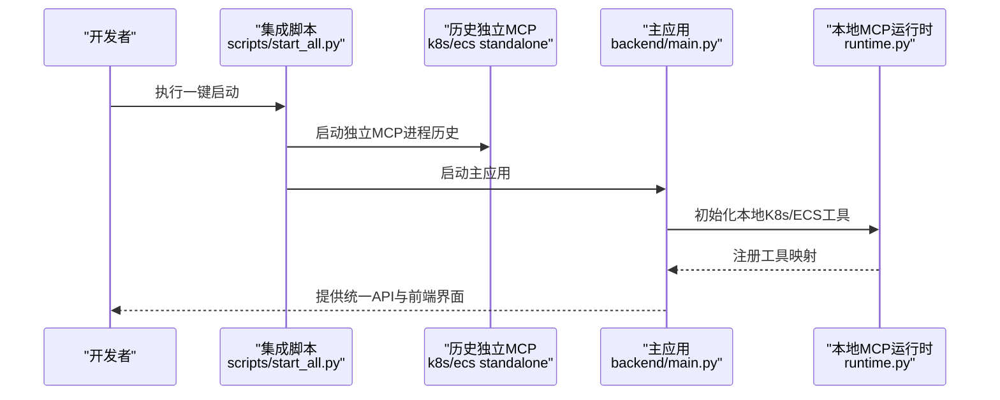
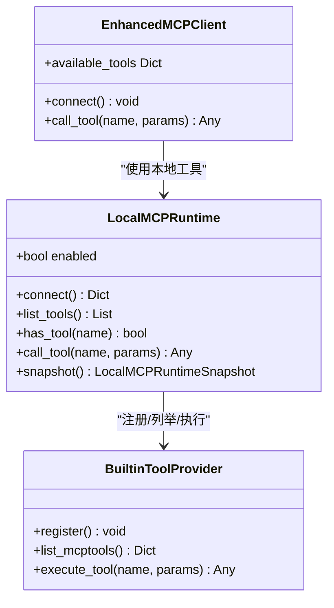
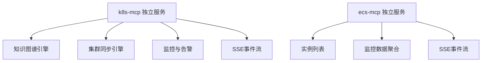
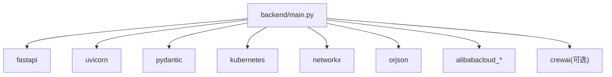

# 发展历程

<cite>
**本文引用的文件**
- [README.md](file://README.md)
- [archived/README.md](file://archived/README.md)
- [backend/main.py](file://backend/main.py)
- [backend/src/mcp/builtin_k8s_ecs.py](file://backend/src/mcp/builtin_k8s_ecs.py)
- [backend/src/mcp/runtime.py](file://backend/src/mcp/runtime.py)
- [scripts/start_all.py](file://scripts/start_all.py)
- [pyproject.toml](file://pyproject.toml)
- [archived/k8s-mcp-standalone/README.md](file://archived/k8s-mcp-standalone/README.md)
- [archived/ecs-mcp-standalone/README.md](file://archived/ecs-mcp-standalone/README.md)
</cite>

## 目录
1. [引言](#引言)
2. [项目结构](#项目结构)
3. [核心组件](#核心组件)
4. [架构总览](#架构总览)
5. [详细组件分析](#详细组件分析)
6. [依赖分析](#依赖分析)
7. [性能考量](#性能考量)
8. [故障排查指南](#故障排查指南)
9. [结论](#结论)
10. [附录](#附录)

## 引言
本项目“钉钉K8s运维机器人”经历了从“独立MCP工程”到“统一平台”的演进。早期阶段，Kubernetes MCP（k8s-mcp）与ECS MCP（ecs-mcp）分别作为独立进程提供工具能力，采用FastAPI + SSE的架构。随着统一平台建设推进，K8s/ECS工具被迁移整合进主应用进程内，形成“进程内集成 + MCP协议”的统一运行时，从而实现从分布式到集中式的管理转变。本文将梳理这一发展历程、主要里程碑、架构重构原因与目标，并总结在功能完善、性能优化、安全性提升方面的进展，最后给出未来方向与成熟度评估。

## 项目结构
当前项目采用“后端主应用 + 前端界面 + 归档历史工程”的组织方式：
- backend/src：统一后端主应用，包含API路由、MCP运行时、LLM处理、调度与安全等模块
- frontend-v2：Vue3现代化前端界面
- config：统一配置目录（LLM/MCP/技能/定时任务等）
- archived：历史独立MCP工程归档（k8s-mcp-standalone、ecs-mcp-standalone）
- scripts：集成启动与构建脚本

**图示来源**
- [backend/main.py:1-494](file://backend/main.py#L1-L494)
- [backend/src/mcp/runtime.py:1-119](file://backend/src/mcp/runtime.py#L1-L119)
- [backend/src/mcp/builtin_k8s_ecs.py:1-92](file://backend/src/mcp/builtin_k8s_ecs.py#L1-L92)
- [scripts/start_all.py:1-306](file://scripts/start_all.py#L1-L306)

**章节来源**
- [README.md:64-76](file://README.md#L64-L76)
- [pyproject.toml:1-116](file://pyproject.toml#L1-L116)

## 核心组件
- 主应用入口与生命周期管理：负责服务初始化、异常处理、静态资源挂载、健康检查等
- MCP运行时与内置工具：将K8s/ECS工具注册为本地MCP工具，支持按需启用/跳过远程服务器
- LLM处理器与钉钉机器人：统一LLM配置与消息通道
- 调度器与审计：定时巡检与操作审计
- 归档工程：历史独立MCP服务的完整实现与文档

**章节来源**
- [backend/main.py:137-300](file://backend/main.py#L137-L300)
- [backend/src/mcp/runtime.py:31-119](file://backend/src/mcp/runtime.py#L31-L119)
- [backend/src/mcp/builtin_k8s_ecs.py:25-92](file://backend/src/mcp/builtin_k8s_ecs.py#L25-L92)

## 架构总览
统一平台的架构以“主应用进程 + MCP运行时 + 前后端”为核心，MCP工具既可来自远程SSE服务，也可来自进程内的本地运行时。集成脚本不再启动独立MCP子进程，而是直接由主应用统一管理。

**图示来源**
- [backend/main.py:137-300](file://backend/main.py#L137-L300)
- [backend/src/mcp/runtime.py:31-119](file://backend/src/mcp/runtime.py#L31-L119)
- [backend/src/mcp/builtin_k8s_ecs.py:49-92](file://backend/src/mcp/builtin_k8s_ecs.py#L49-L92)
- [scripts/start_all.py:162-164](file://scripts/start_all.py#L162-L164)

## 详细组件分析

### 从独立MCP到进程内集成的演进
- 独立MCP阶段：k8s-mcp与ecs-mcp分别提供REST/SSE工具服务，具备完整的监控、告警与知识图谱能力
- 进程内集成阶段：K8s/ECS工具迁移到主应用，通过LocalMCPRuntime注册为本地工具，统一由EnhancedMCPClient管理
- 启动流程变化：集成脚本不再启动独立MCP进程，改为由主应用统一初始化

**图示来源**
- [scripts/start_all.py:162-164](file://scripts/start_all.py#L162-L164)
- [backend/main.py:148-182](file://backend/main.py#L148-L182)
- [backend/src/mcp/runtime.py:46-58](file://backend/src/mcp/runtime.py#L46-L58)

**章节来源**
- [archived/README.md:3-11](file://archived/README.md#L3-L11)
- [README.md:46-55](file://README.md#L46-L55)
- [scripts/start_all.py:162-164](file://scripts/start_all.py#L162-L164)

### 进程内K8s/ECS工具注册与执行
- 环境变量控制：默认启用进程内工具，可通过环境变量禁用或跳过远程服务器
- 运行时注册：LocalMCPRuntime按需注册内置提供者，刷新工具映射
- 工具执行：通过provider.execute_tool异步执行，保持MCP协议语义

**图示来源**
- [backend/src/mcp/runtime.py:31-119](file://backend/src/mcp/runtime.py#L31-L119)
- [backend/src/mcp/builtin_k8s_ecs.py:49-92](file://backend/src/mcp/builtin_k8s_ecs.py#L49-L92)

**章节来源**
- [backend/src/mcp/builtin_k8s_ecs.py:25-92](file://backend/src/mcp/builtin_k8s_ecs.py#L25-L92)
- [backend/src/mcp/runtime.py:46-98](file://backend/src/mcp/runtime.py#L46-L98)

### 历史独立MCP能力概览
- k8s-mcp：知识图谱、集群同步、智能摘要、关联查询、Prometheus集成、资源告警（V2）、SSE通信
- ecs-mcp：阿里云ECS实例巡检、监控数据聚合、SSE事件流、RAM权限要求

**图示来源**
- [archived/k8s-mcp-standalone/README.md:1-800](file://archived/k8s-mcp-standalone/README.md#L1-L800)
- [archived/ecs-mcp-standalone/README.md:1-278](file://archived/ecs-mcp-standalone/README.md#L1-L278)

**章节来源**
- [archived/k8s-mcp-standalone/README.md:7-38](file://archived/k8s-mcp-standalone/README.md#L7-L38)
- [archived/ecs-mcp-standalone/README.md:3-22](file://archived/ecs-mcp-standalone/README.md#L3-L22)

### 架构重构原因与目标
- 降低运维复杂度：从多进程拆分到单体主应用，减少进程间通信与部署维护成本
- 提升一致性：统一MCP运行时与工具协议，便于扩展与治理
- 优化资源占用：进程内工具减少网络开销与外部依赖
- 保持兼容性：通过环境变量与配置管理，平滑过渡到新架构

**章节来源**
- [archived/README.md:5-9](file://archived/README.md#L5-L9)
- [backend/src/mcp/builtin_k8s_ecs.py:25-46](file://backend/src/mcp/builtin_k8s_ecs.py#L25-L46)

## 依赖分析
- 后端主应用依赖FastAPI、Uvicorn、Pydantic、Kubernetes客户端、网络图与JSON处理库等
- 进程内K8s工具依赖NetworkX、aiofiles、orjson等
- 进程内ECS工具依赖阿里云SDK生态
- LLM与多智能体编排可选依赖crewai（受Python版本限制）

**图示来源**
- [pyproject.toml:9-51](file://pyproject.toml#L9-L51)

**章节来源**
- [pyproject.toml:9-51](file://pyproject.toml#L9-L51)

## 性能考量
- 进程内工具减少网络往返，降低延迟与外部依赖风险
- 本地运行时按需注册与刷新工具映射，避免重复初始化
- 定时巡检与任务调度采用异步模式，不引入额外阻塞
- 健康检查与指标采集支持可配置的间隔与阈值，便于调优

**章节来源**
- [backend/main.py:220-270](file://backend/main.py#L220-L270)
- [backend/src/mcp/runtime.py:64-87](file://backend/src/mcp/runtime.py#L64-L87)

## 故障排查指南
- 启动失败：检查主应用日志与环境变量，确认LLM配置迁移与前端静态资源挂载状态
- MCP工具不可用：确认BUILTIN_K8S_ECS_TOOLS开关、远程服务器跳过名单与配置管理器状态
- 定时巡检异常：检查巡检开关、间隔与钉钉推送配置
- ECS工具权限：核对RAM策略与区域域名，确保CMS与ECS接口可达

**章节来源**
- [backend/main.py:62-128](file://backend/main.py#L62-L128)
- [backend/src/mcp/builtin_k8s_ecs.py:25-46](file://backend/src/mcp/builtin_k8s_ecs.py#L25-L46)
- [archived/ecs-mcp-standalone/README.md:198-244](file://archived/ecs-mcp-standalone/README.md#L198-L244)

## 结论
项目从“独立MCP工程”演进到“统一平台”，实现了从分布式到集中式的架构升级。通过进程内集成K8s/ECS工具、统一MCP运行时与配置管理，显著降低了运维复杂度与资源占用，同时保持了与历史独立服务的兼容性与可追溯性。未来可在可观测性、自动化与安全治理方面进一步深化，持续提升平台稳定性与可扩展性。

## 附录
- 项目状态与计划：参见项目文档中的状态与计划说明
- 技术架构与配置：参见技术架构与配置指南
- 重构基线：参见重构基线文档
- Chat Stream Contract：参见聊天流式协议契约
- 归档说明：参见归档工程说明

**章节来源**
- [README.md:87-93](file://README.md#L87-L93)