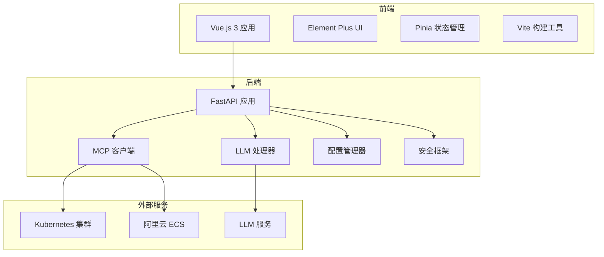
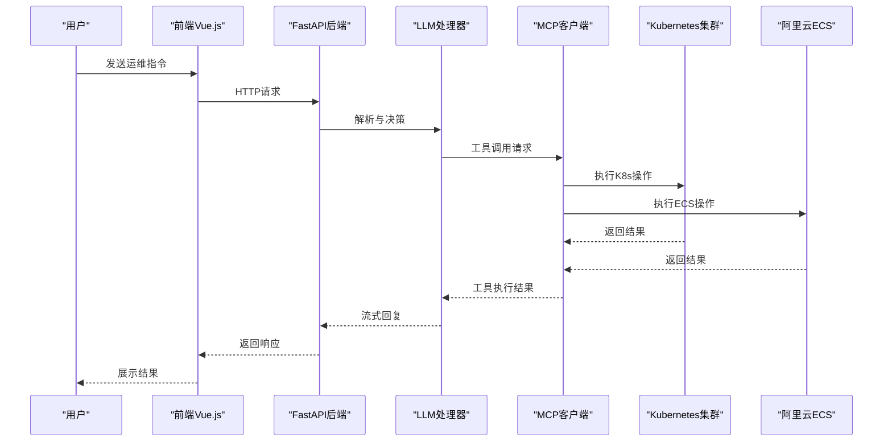
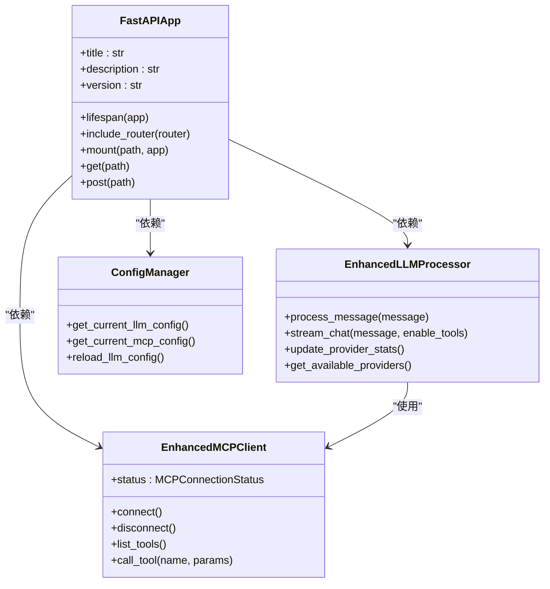
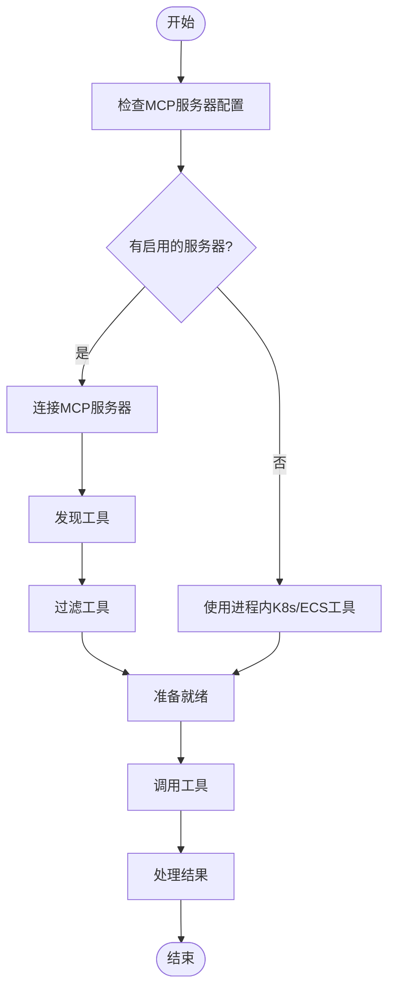
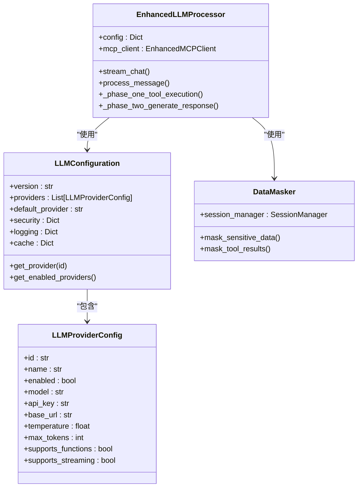
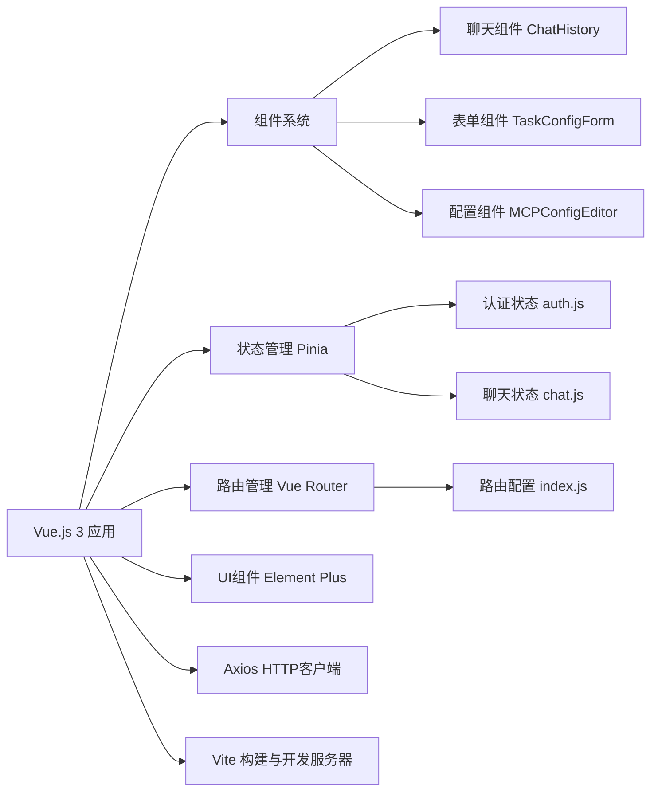
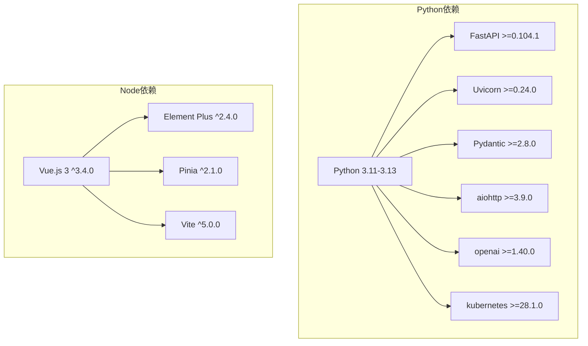

# 技术栈

<cite>
**本文档引用的文件**
- [pyproject.toml](file://pyproject.toml)
- [poetry.lock](file://poetry.lock)
- [package.json](file://frontend-v2/package.json)
- [vite.config.js](file://frontend-v2/vite.config.js)
- [main.py](file://backend/main.py)
- [README.md](file://README.md)
- [builtin_k8s_ecs.py](file://backend/src/mcp/builtin_k8s_ecs.py)
- [enhanced_client.py](file://backend/src/mcp/enhanced_client.py)
- [processor.py](file://backend/src/llm/processor.py)
- [config.py](file://backend/src/llm/config.py)
- [manager.py](file://backend/src/config/manager.py)
- [dev.py](file://scripts/dev.py)
- [llm_config.example.json](file://config/llm_config.example.json)
- [mcp_config.example.json](file://config/mcp_config.example.json)
</cite>

## 目录
1. [简介](#简介)
2. [项目结构](#项目结构)
3. [核心组件](#核心组件)
4. [架构总览](#架构总览)
5. [详细组件分析](#详细组件分析)
6. [依赖关系分析](#依赖关系分析)
7. [性能考虑](#性能考虑)
8. [故障排查指南](#故障排查指南)
9. [结论](#结论)
10. [附录](#附录)

## 简介
本项目是一个基于钉钉的智能Kubernetes运维机器人，支持通过自然语言进行K8s集群管理和运维操作。系统采用前后端分离架构，后端基于Python 3.11-3.13、FastAPI、Uvicorn，前端基于Vue.js 3、Element Plus、Pinia、Vite，结合MCP协议实现可扩展的工具系统，并集成LLM进行智能对话与运维决策。

## 项目结构
项目采用模块化分层结构：
- backend：后端服务，包含API接口、MCP协议实现、LLM集成、配置管理、安全框架等
- frontend-v2：现代化Vue.js 3前端界面，提供聊天交互与运维管理功能
- config：统一配置管理，包含LLM、MCP、技能、定时任务等配置文件
- scripts：开发与生产环境脚本，支持一键启动与构建
- archived：历史独立MCP工程归档

**图表来源**
- [main.py:302-494](file://backend/main.py#L302-L494)
- [enhanced_client.py:1-800](file://backend/src/mcp/enhanced_client.py#L1-L800)
- [processor.py:1-800](file://backend/src/llm/processor.py#L1-L800)

**章节来源**
- [README.md:64-76](file://README.md#L64-L76)

## 核心组件

### 后端技术栈
- **Python 3.11-3.13**：支持范围严格控制，避免与某些依赖的兼容性问题（如pydantic-core对3.14的支持限制）
- **FastAPI**：高性能异步Web框架，提供自动API文档与类型安全
- **Uvicorn**：ASGI服务器，支持异步请求处理与WebSocket
- **Pydantic**：数据验证与序列化，确保配置与请求数据的完整性
- **HTTP客户端**：aiohttp、httpx、requests，支持异步与同步HTTP通信
- **MCP协议**：多服务器连接、工具发现与调用，支持SSE、WebSocket、HTTP等多种传输方式
- **LLM集成**：OpenAI客户端封装，支持流式响应与工具调用
- **Kubernetes/ECS集成**：原生进程内工具，无需独立MCP服务器
- **安全框架**：加密、脱敏、审计日志、权限控制

### 前端技术栈
- **Vue.js 3**：响应式框架，支持Composition API与TypeScript
- **Element Plus**：企业级UI组件库，提供丰富的运维管理界面
- **Pinia**：轻量级状态管理，替代Vuex
- **Vite**：快速构建工具，支持热重载与模块联邦
- **Axios**：HTTP客户端，用于API请求
- **Vue Router**：前端路由管理

### 数据库与缓存
- **文件配置**：使用JSON文件存储LLM与MCP配置，便于版本控制与本地化
- **内存缓存**：基于Python内置数据结构的临时缓存
- **会话持久化**：对话历史自动保存到文件系统

### 配置管理方案
- **混合配置策略**：优先使用文件配置，回退到环境变量
- **配置迁移**：自动从环境变量迁移至JSON配置文件
- **热重载**：支持运行时重新加载配置

**章节来源**
- [pyproject.toml:9-51](file://pyproject.toml#L9-L51)
- [package.json:24-39](file://frontend-v2/package.json#L24-L39)
- [manager.py:35-221](file://backend/src/config/manager.py#L35-L221)

## 架构总览

**图表来源**
- [main.py:422-450](file://backend/main.py#L422-L450)
- [processor.py:541-757](file://backend/src/llm/processor.py#L541-L757)
- [enhanced_client.py:587-800](file://backend/src/mcp/enhanced_client.py#L587-L800)

## 详细组件分析

### FastAPI后端服务

**图表来源**
- [main.py:302-309](file://backend/main.py#L302-L309)
- [enhanced_client.py:1-800](file://backend/src/mcp/enhanced_client.py#L1-L800)
- [processor.py:30-148](file://backend/src/llm/processor.py#L30-L148)
- [manager.py:35-221](file://backend/src/config/manager.py#L35-L221)

**章节来源**
- [main.py:137-309](file://backend/main.py#L137-L309)

### MCP协议实现

**图表来源**
- [builtin_k8s_ecs.py:25-92](file://backend/src/mcp/builtin_k8s_ecs.py#L25-L92)
- [enhanced_client.py:61-87](file://backend/src/mcp/enhanced_client.py#L61-L87)

**章节来源**
- [builtin_k8s_ecs.py:1-92](file://backend/src/mcp/builtin_k8s_ecs.py#L1-L92)
- [enhanced_client.py:1-800](file://backend/src/mcp/enhanced_client.py#L1-L800)

### LLM集成与安全框架

**图表来源**
- [config.py:15-207](file://backend/src/llm/config.py#L15-L207)
- [processor.py:30-148](file://backend/src/llm/processor.py#L30-L148)
- [config.py:270-360](file://backend/src/llm/config.py#L270-L360)

**章节来源**
- [config.py:1-360](file://backend/src/llm/config.py#L1-L360)
- [processor.py:1-800](file://backend/src/llm/processor.py#L1-L800)

### 前端架构

**图表来源**
- [package.json:24-39](file://frontend-v2/package.json#L24-L39)
- [vite.config.js:1-55](file://frontend-v2/vite.config.js#L1-L55)

**章节来源**
- [package.json:1-41](file://frontend-v2/package.json#L1-L41)
- [vite.config.js:1-55](file://frontend-v2/vite.config.js#L1-L55)

## 依赖关系分析

### Python依赖管理
项目使用Poetry进行依赖管理，核心依赖包括：
- **核心框架**：FastAPI >=0.104.1, Uvicorn >=0.24.0, Pydantic >=2.8.0
- **HTTP客户端**：aiohttp >=3.9.0, httpx >=0.27.0, requests >=2.31.0
- **MCP与AI**：openai >=1.40.0
- **Kubernetes**：kubernetes >=28.1.0
- **安全与加密**：cryptography >=41.0.7
- **开发工具**：pytest, black, flake8, mypy

### 前端依赖管理
前端使用npm进行包管理，核心依赖包括：
- **Vue.js 3**：vue ^3.4.0
- **UI组件**：element-plus ^2.4.0
- **状态管理**：pinia ^2.1.0
- **构建工具**：vite ^5.0.0

### 版本兼容性
- **Python版本**：3.11 <= Python < 3.14，避免与pydantic-core和crewai的兼容性问题
- **Node版本**：Node >=20 <23，npm >=10 <12
- **依赖锁定**：poetry.lock确保后端依赖版本一致性

**图表来源**
- [pyproject.toml:9-51](file://pyproject.toml#L9-L51)
- [package.json:24-39](file://frontend-v2/package.json#L24-L39)

**章节来源**
- [pyproject.toml:9-51](file://pyproject.toml#L9-L51)
- [package.json:6-9](file://frontend-v2/package.json#L6-L9)

## 性能考虑
- **异步处理**：后端使用asyncio和aiohttp，支持高并发请求处理
- **流式响应**：LLM与MCP工具调用支持流式输出，提升用户体验
- **缓存策略**：MCP工具结果缓存，减少重复调用
- **连接池**：HTTP客户端复用连接，降低网络开销
- **资源限制**：工具结果大小与上下文长度限制，防止内存溢出

## 故障排查指南

### 常见问题
1. **Python版本不兼容**
   - 症状：Poetry安装失败或运行时报错
   - 解决：使用Python 3.11-3.13，执行`poetry env use $(which python3.13)`

2. **LLM连接失败**
   - 症状：API返回"LLM服务未配置"
   - 解决：检查config/llm_config.json配置，确保API密钥正确

3. **MCP工具不可用**
   - 症状：工具列表为空或调用失败
   - 解决：检查MCP服务器配置，确认进程内工具已启用

4. **前端开发服务器无法访问**
   - 症状：localhost:3000无法访问
   - 解决：检查Vite代理配置，确认后端API服务正常运行

**章节来源**
- [dev.py:28-50](file://scripts/dev.py#L28-L50)
- [processor.py:103-120](file://backend/src/llm/processor.py#L103-L120)

## 结论
本项目采用现代化技术栈，实现了高性能的Kubernetes运维机器人。后端基于Python 3.11-3.13、FastAPI、Uvicorn，前端基于Vue.js 3、Element Plus、Pinia、Vite，结合MCP协议与LLM实现智能化运维决策。通过合理的依赖管理与配置策略，系统具备良好的可维护性与扩展性。

## 附录

### 技术选型考量
- **Python 3.11-3.13**：平衡新特性和生态兼容性
- **FastAPI**：提供类型安全与自动API文档
- **Vue.js 3**：现代化前端框架，组件化开发
- **MCP协议**：标准化工具接口，支持多供应商
- **Poetry**：现代化Python包管理
- **Vite**：快速构建工具，提升开发体验

### 未来演进方向
- **多供应商LLM支持**：扩展更多LLM提供商配置
- **容器化部署**：支持Docker与Kubernetes部署
- **监控与可观测性**：集成Prometheus与Grafana
- **自动化测试**：完善单元测试与集成测试
- **国际化支持**：多语言界面与文档

**章节来源**
- [README.md:1-98](file://README.md#L1-L98)
- [pyproject.toml:90-116](file://pyproject.toml#L90-L116)