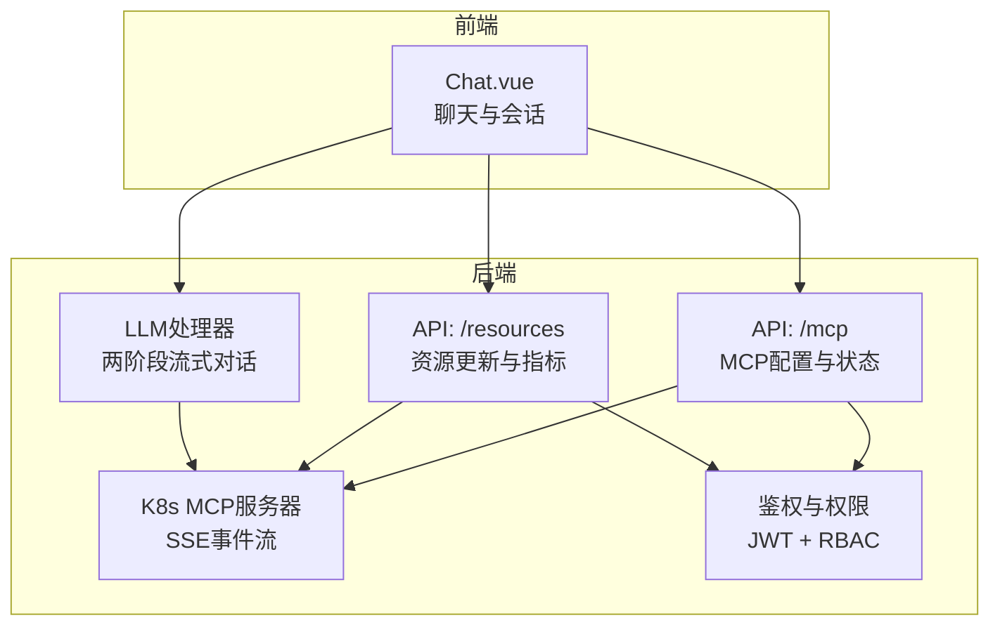
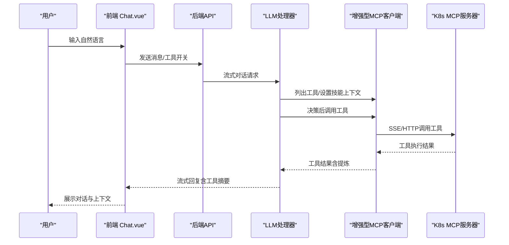
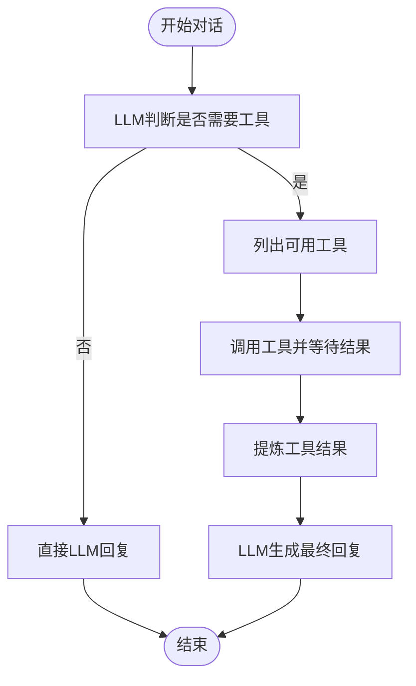
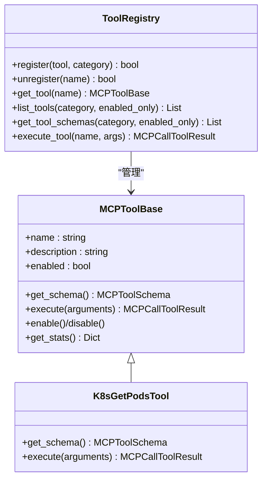
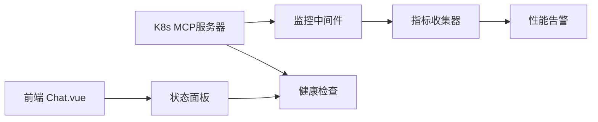
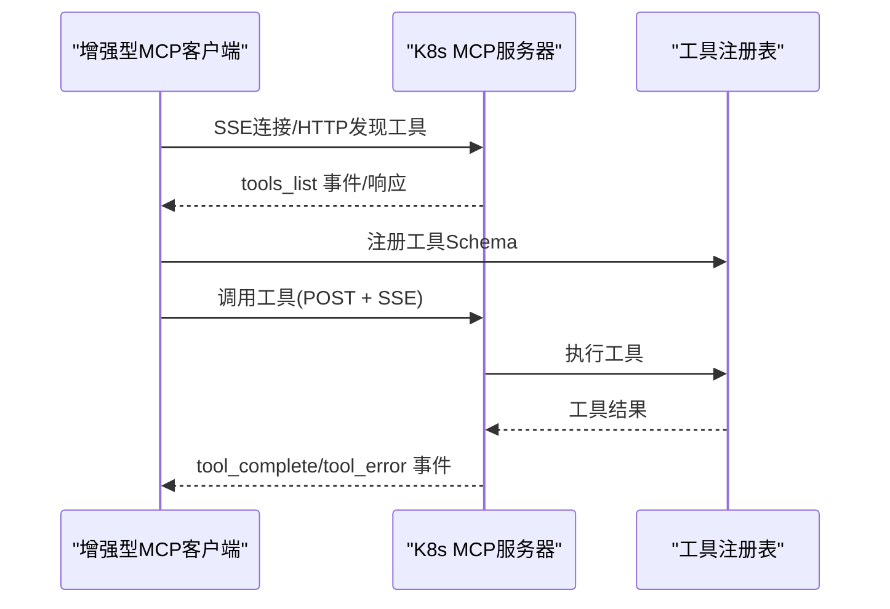
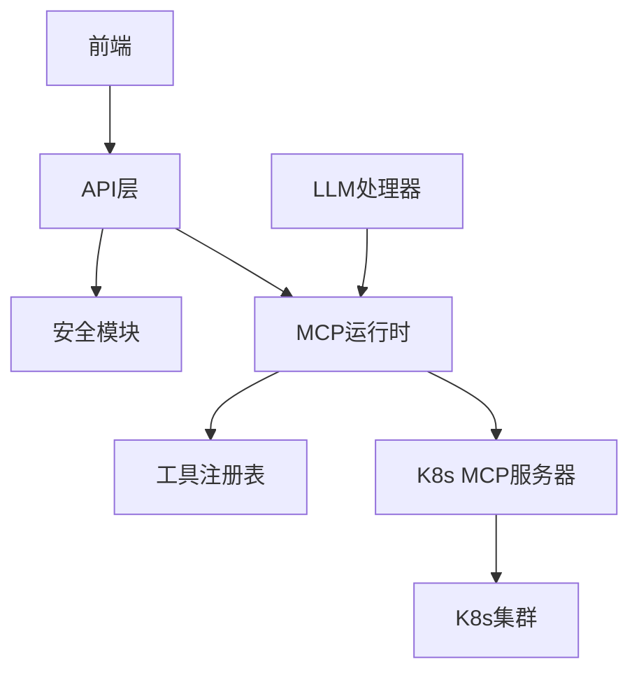

# 核心特性

<cite>
**本文档引用的文件**
- [mcp.py](file://backend/src/api/v2/endpoints/mcp.py)
- [tool_registry.py](file://backend/src/k8s_mcp/core/tool_registry.py)
- [enhanced_client.py](file://backend/src/mcp/enhanced_client.py)
- [mcp_protocol.py](file://backend/src/k8s_mcp/core/mcp_protocol.py)
- [server.py](file://backend/src/k8s_mcp/server.py)
- [resources.py](file://backend/src/api/v2/endpoints/resources.py)
- [Chat.vue](file://frontend-v2/src/views/Chat.vue)
- [auth.py](file://backend/src/security/auth.py)
- [processor.py](file://backend/src/llm/processor.py)
- [k8s_get_pods.py](file://backend/src/k8s_mcp/tools/k8s_get_pods.py)
- [mcp_config.example.json](file://config/mcp_config.example.json)
</cite>

## 目录
1. [简介](#简介)
2. [项目结构](#项目结构)
3. [核心组件](#核心组件)
4. [架构总览](#架构总览)
5. [详细组件分析](#详细组件分析)
6. [依赖关系分析](#依赖关系分析)
7. [性能考虑](#性能考虑)
8. [故障排查指南](#故障排查指南)
9. [结论](#结论)
10. [附录](#附录)

## 简介
本项目为“钉钉K8s运维机器人”，提供基于MCP（Model Context Protocol）协议的智能对话与K8s资源管理能力。系统通过增强型MCP客户端连接内置或外部MCP服务器，动态发现与调用工具，结合流式LLM对话与前端交互界面，实现“读状态—列证据—给建议”的可审计运维流程。核心特性包括：
- 智能对话系统：自然语言理解、上下文保持、流式响应、工具调用与结果提炼
- K8s管理功能：查询类工具覆盖Pod/Service/Deployment/Node/日志/事件等资源
- 实时监控能力：集群状态监控、资源使用统计、告警与指标可视化
- MCP协议集成：标准化工具发现与调用、可扩展工具系统
- Web界面：现代化主题、会话管理、工具总线与上下文控制
- 数据安全与会话持久化：鉴权、权限控制、敏感信息脱敏、本地存储

## 项目结构
系统采用前后端分离与模块化设计：
- 后端（FastAPI）：API网关、MCP配置与运行时、K8s MCP服务器、LLM处理器、安全与权限、前端静态资源
- 前端（Vue3 + Element Plus）：聊天界面、会话历史、工具总线、存储管理、主题与布局
- 配置：MCP配置样例、LLM配置、定时任务与技能配置

**图表来源**
- [mcp.py](file://backend/src/api/v2/endpoints/mcp.py)
- [resources.py](file://backend/src/api/v2/endpoints/resources.py)
- [server.py](file://backend/src/k8s_mcp/server.py)
- [processor.py](file://backend/src/llm/processor.py)
- [auth.py](file://backend/src/security/auth.py)

**章节来源**
- [mcp.py](file://backend/src/api/v2/endpoints/mcp.py)
- [resources.py](file://backend/src/api/v2/endpoints/resources.py)
- [server.py](file://backend/src/k8s_mcp/server.py)
- [processor.py](file://backend/src/llm/processor.py)
- [auth.py](file://backend/src/security/auth.py)

## 核心组件
- MCP配置与运行时：提供MCP服务器状态、工具列表、批量切换、连接/断开、配置校验与热重载
- 工具注册与执行：统一的工具基类、Schema定义、执行统计、并发与超时控制
- 增强型MCP客户端：多服务器连接、SSE事件监听、工具调用、自动同步工具配置
- K8s MCP服务器：SSE事件流、工具注册与刷新、异步工具执行、监控与健康检查
- LLM处理器：两阶段流式对话、工具调用、结果提炼、上下文优化、脱敏与审计
- 资源管理API：批量更新指标、生成分析报告、指标覆盖统计
- Web界面：聊天面板、历史记录、工具总线、存储管理、主题与设置

**章节来源**
- [mcp.py](file://backend/src/api/v2/endpoints/mcp.py)
- [tool_registry.py](file://backend/src/k8s_mcp/core/tool_registry.py)
- [enhanced_client.py](file://backend/src/mcp/enhanced_client.py)
- [server.py](file://backend/src/k8s_mcp/server.py)
- [processor.py](file://backend/src/llm/processor.py)
- [resources.py](file://backend/src/api/v2/endpoints/resources.py)

## 架构总览
系统通过MCP协议实现“对话层—工具层—集群层”的解耦。前端通过API与MCP运行时交互，LLM处理器在对话中根据上下文决定是否调用工具，工具通过增强型客户端与MCP服务器通信，最终访问K8s集群。

**图表来源**
- [Chat.vue](file://frontend-v2/src/views/Chat.vue)
- [mcp.py](file://backend/src/api/v2/endpoints/mcp.py)
- [processor.py](file://backend/src/llm/processor.py)
- [enhanced_client.py](file://backend/src/mcp/enhanced_client.py)
- [server.py](file://backend/src/k8s_mcp/server.py)

## 详细组件分析

### 智能对话系统
- 自然语言理解与工具调用
  - LLM处理器在两阶段对话中，先由LLM判断是否需要工具，再执行工具并将结果提炼后反馈LLM，最终生成可读性强的回复
  - 支持按Skill过滤工具集合，确保只在受控范围内调用工具
- 上下文保持与优化
  - 通过消息历史估算token并裁剪，保留系统消息与最近对话循环，避免上下文溢出
  - 对工具结果进行关键信息提炼，减少LLM输入体积
- 流式响应
  - 前端通过SSE接收流式片段，实时展示LLM与工具执行状态
  - 工具执行期间可间歇输出中间状态，提升交互体验

**图表来源**
- [processor.py](file://backend/src/llm/processor.py)

**章节来源**
- [processor.py](file://backend/src/llm/processor.py)
- [Chat.vue](file://frontend-v2/src/views/Chat.vue)

### K8s管理功能（查询类）
- 工具体系与注册
  - 工具基类统一定义Schema、执行接口与统计信息
  - 工具注册表支持分类、搜索、批量注册与启用/禁用
- 典型工具示例
  - Pod查询工具：支持命名空间与标签过滤，返回结构化摘要并进行结果截断与警告提示
- 资源管理API
  - 批量更新知识图谱指标、生成资源分析报告、查询指标覆盖情况
  - 提供超时保护与结果摘要，便于前端展示

**图表来源**
- [tool_registry.py](file://backend/src/k8s_mcp/core/tool_registry.py)
- [k8s_get_pods.py](file://backend/src/k8s_mcp/tools/k8s_get_pods.py)

**章节来源**
- [tool_registry.py](file://backend/src/k8s_mcp/core/tool_registry.py)
- [k8s_get_pods.py](file://backend/src/k8s_mcp/tools/k8s_get_pods.py)
- [resources.py](file://backend/src/api/v2/endpoints/resources.py)

### 实时监控能力
- 指标采集与聚合
  - K8s MCP服务器内置监控中间件与指标收集器，支持性能阈值告警、历史指标查询与汇总
  - 提供Prometheus格式导出，便于外部监控系统接入
- 健康检查与智能组件
  - 智能模式下可启用知识图谱、集群同步与指标聚合器，提供更丰富的运维视图
- 告警与可视化
  - 前端聊天界面展示连接状态、工具总线与运行时统计，辅助快速定位问题

**图表来源**
- [server.py](file://backend/src/k8s_mcp/server.py)
- [Chat.vue](file://frontend-v2/src/views/Chat.vue)

**章节来源**
- [server.py](file://backend/src/k8s_mcp/server.py)
- [Chat.vue](file://frontend-v2/src/views/Chat.vue)

### MCP协议集成与可扩展工具系统
- 协议实现
  - 基于MCP标准定义请求/响应、工具Schema、错误码与通知机制
- 客户端能力
  - 支持SSE/HTTP等多种传输，自动发现工具、维护工具调用队列、超时与重试
  - 运行时自动同步工具配置到配置文件，支持热重载
- 服务器能力
  - SSE事件流广播工具列表与执行状态，异步执行工具并回传结果
  - 提供健康检查、指标查询与告警接口

**图表来源**
- [enhanced_client.py](file://backend/src/mcp/enhanced_client.py)
- [server.py](file://backend/src/k8s_mcp/server.py)
- [mcp_protocol.py](file://backend/src/k8s_mcp/core/mcp_protocol.py)

**章节来源**
- [enhanced_client.py](file://backend/src/mcp/enhanced_client.py)
- [server.py](file://backend/src/k8s_mcp/server.py)
- [mcp_protocol.py](file://backend/src/k8s_mcp/core/mcp_protocol.py)

### Web界面的现代化特性与用户体验
- 设计与主题
  - 提供多种主题（现代、运维、圆润），支持按需切换
  - 响应式布局与组件化设计，提升可用性
- 功能特性
  - 会话历史、消息检索、导入导出、存储管理与清理
  - 工具总线开关、MCP服务器状态展示、聊天设置（自动滚动、最大消息数、工具策略）
- 交互体验
  - 连接状态指示、工具调用统计、风险操作提示与二次确认

**章节来源**
- [Chat.vue](file://frontend-v2/src/views/Chat.vue)

### 数据安全机制与会话持久化
- 鉴权与权限
  - JWT签名与过期控制、基于角色的权限校验（如mcp:read/write、resources:read/write）
- 敏感信息脱敏
  - LLM处理器集成脱敏器，对工具结果进行会话级脱敏映射，保障输出安全
- 会话持久化
  - 前端提供会话存储与清理策略，支持LRU/按时间/按大小的清理规则

**章节来源**
- [auth.py](file://backend/src/security/auth.py)
- [processor.py](file://backend/src/llm/processor.py)
- [Chat.vue](file://frontend-v2/src/views/Chat.vue)

## 依赖关系分析
- 组件耦合
  - API层依赖MCP运行时与安全模块；MCP运行时依赖工具注册表与K8s MCP服务器；前端依赖API与流式事件
- 外部依赖
  - LLM客户端（OpenAI/Ollama）、SSE事件流、Prometheus指标导出
- 风险点
  - 工具调用超时与网络波动；LLM上下文溢出；前端消息过多导致性能下降

**图表来源**
- [mcp.py](file://backend/src/api/v2/endpoints/mcp.py)
- [enhanced_client.py](file://backend/src/mcp/enhanced_client.py)
- [server.py](file://backend/src/k8s_mcp/server.py)
- [processor.py](file://backend/src/llm/processor.py)

**章节来源**
- [mcp.py](file://backend/src/api/v2/endpoints/mcp.py)
- [enhanced_client.py](file://backend/src/mcp/enhanced_client.py)
- [server.py](file://backend/src/k8s_mcp/server.py)
- [processor.py](file://backend/src/llm/processor.py)

## 性能考虑
- 上下文优化：估算token并裁剪历史消息，保留系统消息与最近对话循环
- 工具结果提炼：针对不同工具类型提炼关键信息，减少LLM输入体积
- 并发与超时：MCP客户端限制并发调用与超时时间，SSE事件流支持长时间运行工具
- 指标监控：内置性能监控与告警，支持阈值配置与历史趋势分析

[本节为通用指导，无需特定文件引用]

## 故障排查指南
- MCP连接问题
  - 检查服务器状态与连接标志位；尝试重连或批量切换服务器启用状态
  - 查看SSE事件流日志，确认工具列表是否正常下发
- 工具调用失败
  - 核对工具Schema与参数类型；查看工具执行日志与错误事件
  - 检查MCP配置文件与自动同步状态
- LLM与流式响应
  - 确认LLM客户端可用性与网络代理；检查前端SSE连接状态
- 权限与安全
  - 核对JWT令牌与权限声明；确认RBAC策略与工具策略（Skill）

**章节来源**
- [mcp.py](file://backend/src/api/v2/endpoints/mcp.py)
- [enhanced_client.py](file://backend/src/mcp/enhanced_client.py)
- [server.py](file://backend/src/k8s_mcp/server.py)
- [auth.py](file://backend/src/security/auth.py)

## 结论
本系统通过MCP协议实现了“智能对话—工具调用—集群操作”的闭环，结合流式响应与前端可视化，提供了可审计、可扩展、安全可靠的K8s运维体验。其模块化设计与可插拔工具体系，使得功能持续演进与风险可控并存。

[本节为总结，无需特定文件引用]

## 附录

### 实际使用示例与最佳实践
- 智能对话
  - 示例：询问Pod状态与日志，系统自动识别资源并调用对应工具，流式返回结果摘要
  - 最佳实践：使用Skill限制工具范围，开启工具总线开关，合理设置最大消息数
- K8s资源查询
  - 示例：查询某命名空间下特定标签的Pod列表，自动截断与警告提示
  - 最佳实践：使用标签选择器缩小范围，避免一次性返回大量数据
- 资源指标更新
  - 示例：批量更新知识图谱指标，触发资源分析报告并钉钉通知
  - 最佳实践：设置合理的并发与时间窗口，关注失败资源详情
- MCP配置管理
  - 示例：启用/禁用服务器、批量切换工具上下文、验证配置与热重载
  - 最佳实践：先验证配置再批量更新，保留备份以便回滚

**章节来源**
- [Chat.vue](file://frontend-v2/src/views/Chat.vue)
- [resources.py](file://backend/src/api/v2/endpoints/resources.py)
- [mcp.py](file://backend/src/api/v2/endpoints/mcp.py)
- [mcp_config.example.json](file://config/mcp_config.example.json)