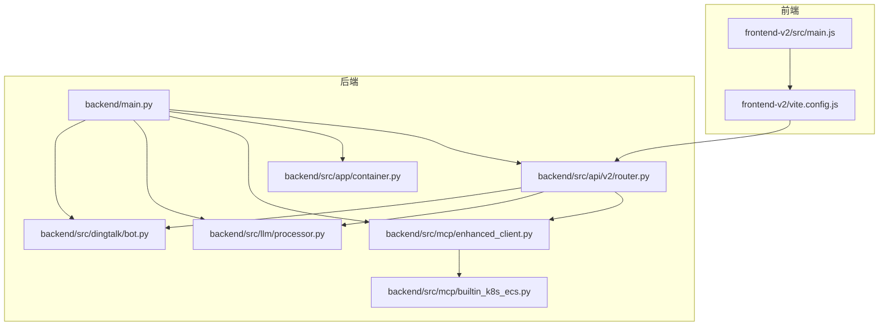
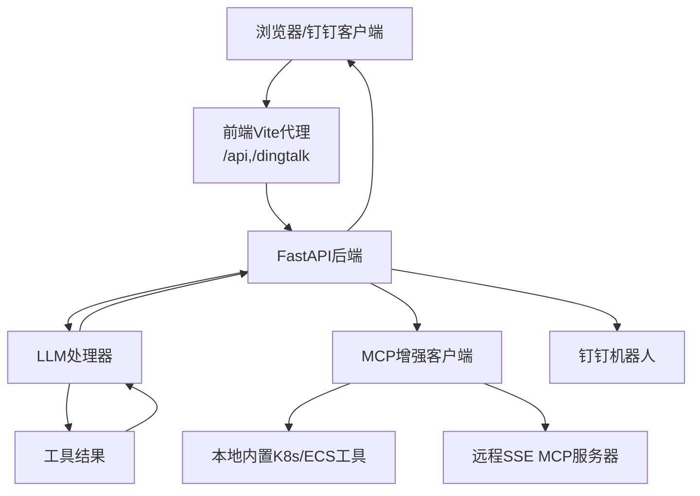
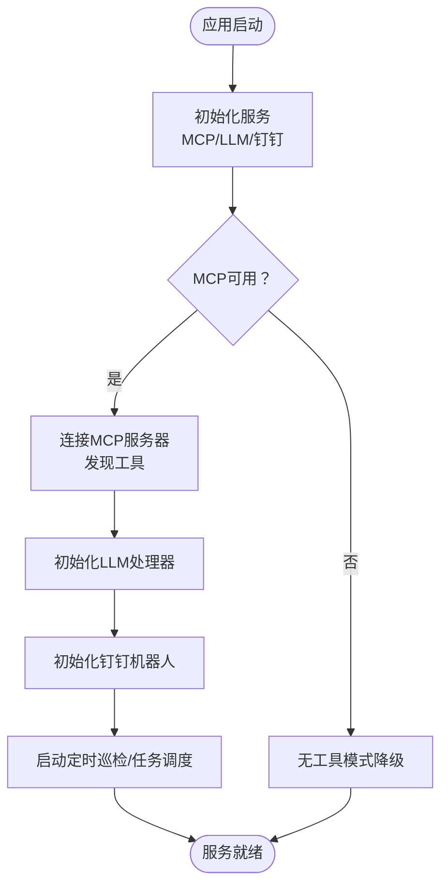
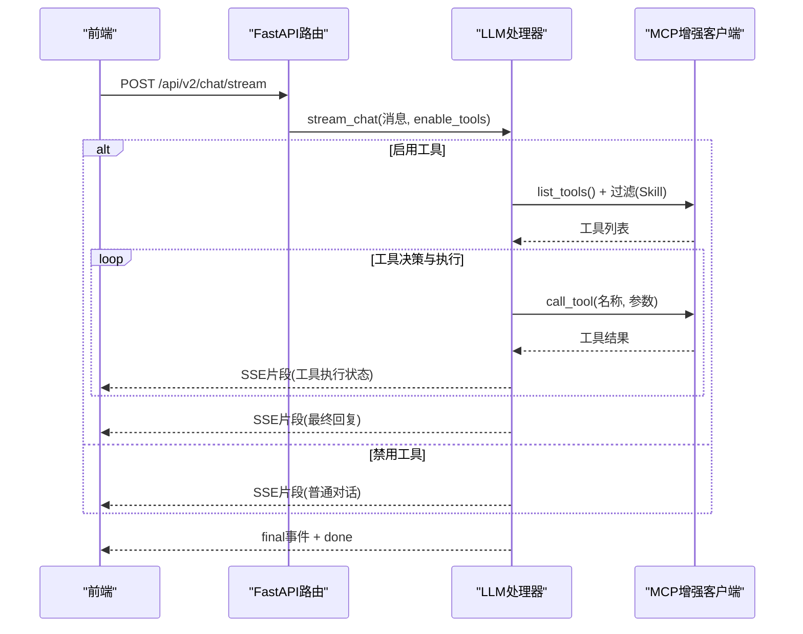
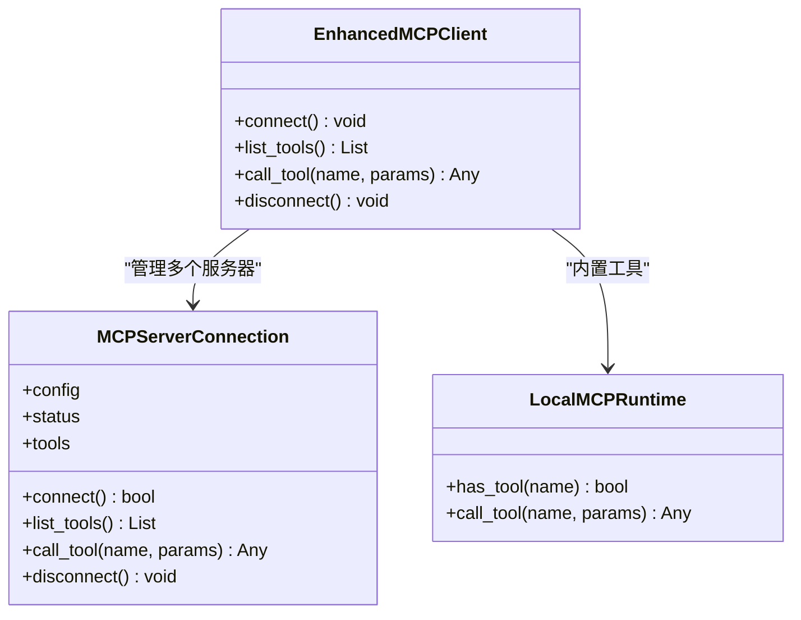
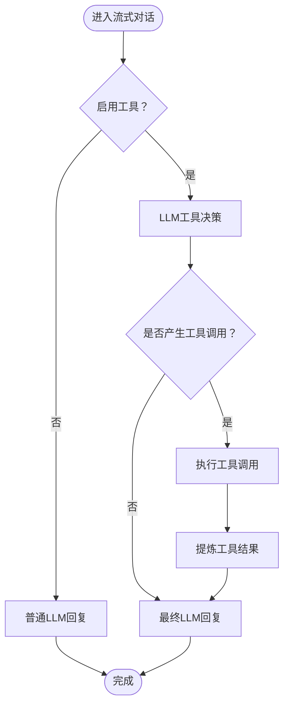
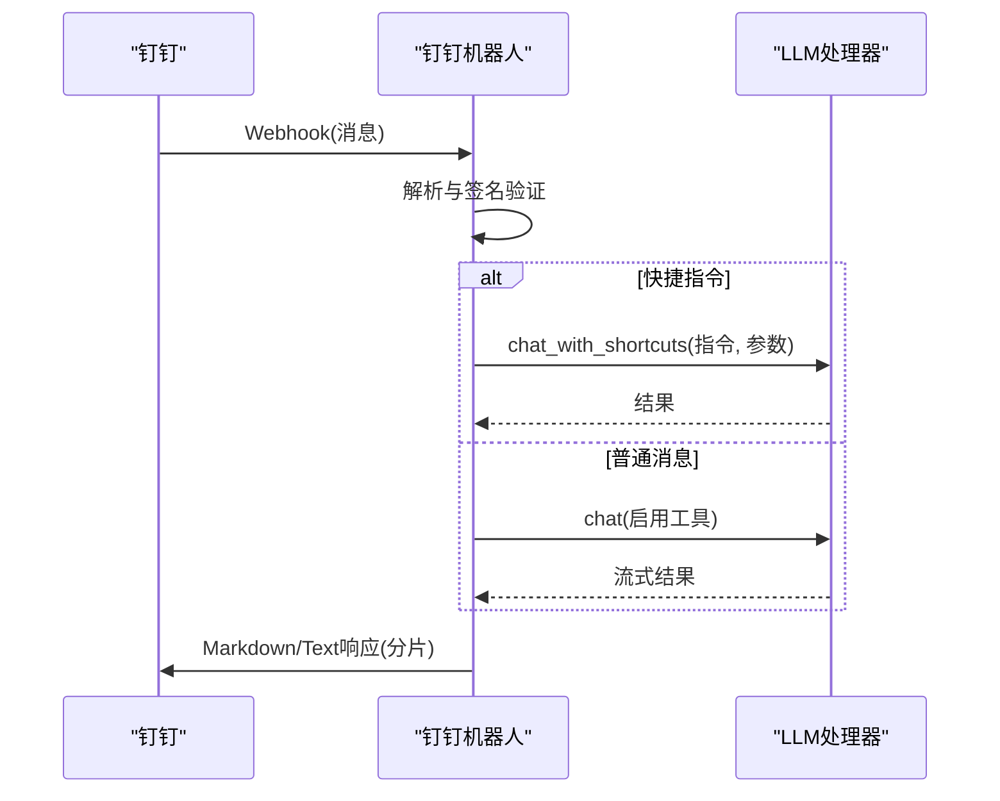
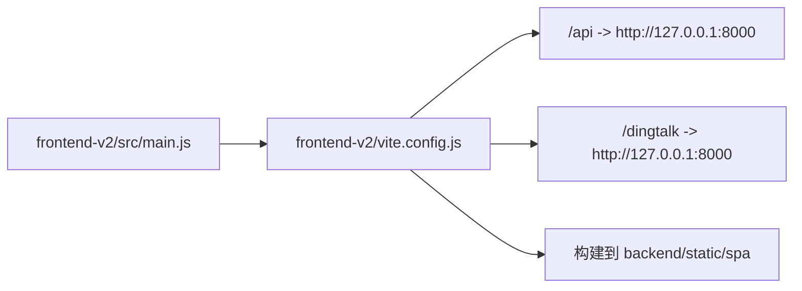
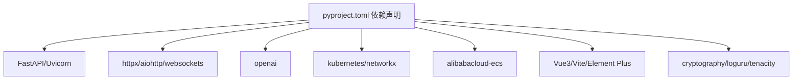

# 系统架构

<cite>
**本文引用的文件**   
- [backend/main.py](file://backend/main.py)
- [backend/src/app/container.py](file://backend/src/app/container.py)
- [backend/src/api/v2/router.py](file://backend/src/api/v2/router.py)
- [backend/src/mcp/enhanced_client.py](file://backend/src/mcp/enhanced_client.py)
- [backend/src/mcp/builtin_k8s_ecs.py](file://backend/src/mcp/builtin_k8s_ecs.py)
- [backend/src/llm/processor.py](file://backend/src/llm/processor.py)
- [backend/src/dingtalk/bot.py](file://backend/src/dingtalk/bot.py)
- [frontend-v2/src/main.js](file://frontend-v2/src/main.js)
- [frontend-v2/vite.config.js](file://frontend-v2/vite.config.js)
- [pyproject.toml](file://pyproject.toml)
- [README.md](file://README.md)
</cite>

## 目录
1. [简介](#简介)
2. [项目结构](#项目结构)
3. [核心组件](#核心组件)
4. [架构总览](#架构总览)
5. [详细组件分析](#详细组件分析)
6. [依赖分析](#依赖分析)
7. [性能考量](#性能考量)
8. [故障排查指南](#故障排查指南)
9. [结论](#结论)
10. [附录](#附录)

## 简介
本系统是一个“钉钉K8s运维机器人”，融合了自然语言对话、LLM（大语言模型）推理、MCP（Model Context Protocol）工具系统以及可选的钉钉Webhook集成。系统采用前后端分离与微服务化理念，后端以FastAPI为核心，提供REST API与SSE流式响应；前端使用Vue3 + Vite构建SPA，通过代理访问后端API；MCP工具系统支持本地内置K8s/ECS工具与远程SSE MCP服务器；LLM处理器负责对话与工具调用的两阶段编排，并内置数据脱敏与结果提炼能力。

## 项目结构
- 后端（Python/FastAPI）：集中式主应用入口，统一管理MCP客户端、LLM处理器、钉钉机器人、定时巡检与任务调度。
- 前端（Vue3/Vite）：现代化聊天界面，构建产物部署到后端静态目录，实现SPA路由与API代理。
- MCP工具系统：支持本地内置工具（K8s/ECS）与远程SSE MCP服务器，统一注册与调用。
- LLM处理器：基于OpenAI风格的异步客户端，支持工具调用与两阶段流式对话。
- 配置与脚本：Poetry工程管理、启动脚本、配置迁移与环境变量。

图表来源
- [backend/main.py:1-494](file://backend/main.py#L1-L494)
- [backend/src/api/v2/router.py:1-1059](file://backend/src/api/v2/router.py#L1-L1059)
- [backend/src/app/container.py:1-54](file://backend/src/app/container.py#L1-L54)
- [backend/src/mcp/enhanced_client.py:1-1519](file://backend/src/mcp/enhanced_client.py#L1-L1519)
- [backend/src/mcp/builtin_k8s_ecs.py:1-92](file://backend/src/mcp/builtin_k8s_ecs.py#L1-L92)
- [backend/src/llm/processor.py:1-2169](file://backend/src/llm/processor.py#L1-L2169)
- [backend/src/dingtalk/bot.py:1-527](file://backend/src/dingtalk/bot.py#L1-L527)
- [frontend-v2/src/main.js:1-52](file://frontend-v2/src/main.js#L1-L52)
- [frontend-v2/vite.config.js:1-55](file://frontend-v2/vite.config.js#L1-L55)

章节来源
- [README.md:64-76](file://README.md#L64-L76)
- [backend/main.py:302-450](file://backend/main.py#L302-L450)
- [frontend-v2/vite.config.js:13-29](file://frontend-v2/vite.config.js#L13-L29)

## 核心组件
- FastAPI主应用与生命周期管理：负责服务初始化、MCP/LLM/钉钉机器人装配、定时巡检与任务调度启动、健康检查与异常处理。
- API路由与权限控制：提供聊天、工具管理、配置管理、巡检、调度、资源告警等端点，统一SSE流式响应与错误封装。
- 运行时容器：集中持有MCP客户端、LLM处理器、钉钉机器人实例，支持配置热重载与实例重建。
- MCP增强客户端：统一管理多服务器连接（SSE/STDIO等）、工具发现与过滤、工具调用与结果等待、自动配置同步。
- 进程内K8s/ECS工具：通过LocalMCPRuntime注册内置工具，替代远程SSE MCP，降低外部依赖。
- LLM处理器：两阶段流式对话（工具决策 + 结果汇总），内置结果提炼、上下文优化、脱敏与回退机制。
- 钉钉机器人：接收Webhook消息、签名验证、消息路由（快捷指令/普通AI）、Markdown渲染兼容与分片发送。
- 前端SPA：Vue3应用，Element Plus UI，Vite代理后端API与钉钉Webhook，构建产物部署到后端静态目录。

章节来源
- [backend/main.py:148-270](file://backend/main.py#L148-L270)
- [backend/src/api/v2/router.py:158-423](file://backend/src/api/v2/router.py#L158-L423)
- [backend/src/app/container.py:15-54](file://backend/src/app/container.py#L15-L54)
- [backend/src/mcp/enhanced_client.py:33-800](file://backend/src/mcp/enhanced_client.py#L33-L800)
- [backend/src/mcp/builtin_k8s_ecs.py:25-92](file://backend/src/mcp/builtin_k8s_ecs.py#L25-L92)
- [backend/src/llm/processor.py:30-800](file://backend/src/llm/processor.py#L30-L800)
- [backend/src/dingtalk/bot.py:51-527](file://backend/src/dingtalk/bot.py#L51-L527)
- [frontend-v2/src/main.js:17-40](file://frontend-v2/src/main.js#L17-L40)

## 架构总览
系统采用“后端API + 前端SPA”的前后端分离架构，后端以FastAPI为中心，统一接入MCP工具系统与LLM处理器，并通过钉钉Webhook实现消息驱动。MCP工具既可来自本地内置实现，也可来自远程SSE MCP服务器，系统具备自动同步与降级能力。LLM处理器负责两阶段流式对话，结合工具调用与结果提炼，提升用户体验与信息密度。前端通过Vite代理访问后端API与钉钉Webhook，构建产物部署到后端静态目录，实现SPA路由与后端API的一体化访问。

图表来源
- [backend/src/api/v2/router.py:158-423](file://backend/src/api/v2/router.py#L158-L423)
- [backend/src/mcp/enhanced_client.py:33-800](file://backend/src/mcp/enhanced_client.py#L33-L800)
- [backend/src/llm/processor.py:536-757](file://backend/src/llm/processor.py#L536-L757)
- [backend/src/dingtalk/bot.py:64-114](file://backend/src/dingtalk/bot.py#L64-L114)
- [frontend-v2/vite.config.js:13-29](file://frontend-v2/vite.config.js#L13-L29)

## 详细组件分析

### 组件A：后端主应用与生命周期
- 职责：应用启动与关闭、服务初始化（MCP/LLM/钉钉）、定时巡检与任务调度、健康检查、异常处理与审计中间件。
- 关键点：全局RuntimeContainer承载服务实例；MCP客户端支持无工具模式降级；LLM处理器优先读取配置文件，环境变量作为回退；定时巡检与任务调度可按环境变量开关。
- 设计权衡：服务初始化失败时，MCP可降级，LLM失败则中止启动，保证核心能力可用性。

图表来源
- [backend/main.py:148-270](file://backend/main.py#L148-L270)
- [backend/src/app/container.py:23-36](file://backend/src/app/container.py#L23-L36)

章节来源
- [backend/main.py:148-270](file://backend/main.py#L148-L270)
- [backend/src/app/container.py:15-54](file://backend/src/app/container.py#L15-L54)

### 组件B：API路由与流式对话
- 职责：提供聊天、工具管理、配置管理、巡检、调度、资源告警等端点；统一SSE流式响应与错误封装；权限控制与审计中间件。
- 关键点：/api/v2/chat/stream支持两阶段流式输出；工具调用前进行工具合法性校验；支持技能（Skill）过滤暴露的工具；错误通过统一错误处理系统返回。
- 设计权衡：SSE禁用nginx缓冲，保障实时性；对工具调用超时与异常进行明确的错误事件与完成事件。

图表来源
- [backend/src/api/v2/router.py:175-344](file://backend/src/api/v2/router.py#L175-L344)
- [backend/src/llm/processor.py:536-757](file://backend/src/llm/processor.py#L536-L757)
- [backend/src/mcp/enhanced_client.py:587-800](file://backend/src/mcp/enhanced_client.py#L587-L800)

章节来源
- [backend/src/api/v2/router.py:158-423](file://backend/src/api/v2/router.py#L158-L423)
- [backend/src/llm/processor.py:536-757](file://backend/src/llm/processor.py#L536-L757)

### 组件C：MCP增强客户端与工具系统
- 职责：统一管理多服务器连接（SSE/STDIO等）、工具发现与过滤、工具调用与结果等待、自动配置同步。
- 关键点：支持SSE事件监听、工具列表事件处理、工具调用请求与结果队列、活跃工具调用跟踪与超时控制；支持自动同步工具配置到配置文件；支持本地内置K8s/ECS工具。
- 设计权衡：SSE连接失败时指数退避重试；工具调用超时与异常通过消息队列与错误事件反馈；自动同步配置便于运维管理。

图表来源
- [backend/src/mcp/enhanced_client.py:33-800](file://backend/src/mcp/enhanced_client.py#L33-L800)
- [backend/src/mcp/builtin_k8s_ecs.py:60-92](file://backend/src/mcp/builtin_k8s_ecs.py#L60-L92)

章节来源
- [backend/src/mcp/enhanced_client.py:33-800](file://backend/src/mcp/enhanced_client.py#L33-L800)
- [backend/src/mcp/builtin_k8s_ecs.py:25-92](file://backend/src/mcp/builtin_k8s_ecs.py#L25-L92)

### 组件D：LLM处理器与两阶段流式对话
- 职责：两阶段流式对话（工具决策 + 结果汇总）、工具结果提炼、上下文优化、脱敏与回退机制。
- 关键点：支持OpenAI风格异步客户端；根据工具类型智能提炼关键信息；上下文令牌与消息条数限制；错误时回退到简化回复。
- 设计权衡：工具结果过大时自动提炼，避免LLM上下文溢出；对日志、资源列表等场景分别制定提炼策略；提供分页与优化建议。

图表来源
- [backend/src/llm/processor.py:536-757](file://backend/src/llm/processor.py#L536-L757)
- [backend/src/llm/processor.py:158-425](file://backend/src/llm/processor.py#L158-L425)

章节来源
- [backend/src/llm/processor.py:30-800](file://backend/src/llm/processor.py#L30-L800)

### 组件E：钉钉机器人与Webhook集成
- 职责：接收钉钉Webhook消息、签名验证、消息路由（快捷指令/普通AI）、Markdown渲染兼容与分片发送。
- 关键点：支持文本与Markdown消息；主动消息与Markdown分片发送；签名验证与错误处理；快捷指令路由到LLM处理器。
- 设计权衡：Markdown内容自动去除整段代码围栏，兼容钉钉渲染；超时与网络错误提供清晰日志与回退。

图表来源
- [backend/src/dingtalk/bot.py:64-114](file://backend/src/dingtalk/bot.py#L64-L114)
- [backend/src/dingtalk/bot.py:115-220](file://backend/src/dingtalk/bot.py#L115-L220)
- [backend/src/dingtalk/bot.py:223-473](file://backend/src/dingtalk/bot.py#L223-L473)

章节来源
- [backend/src/dingtalk/bot.py:51-527](file://backend/src/dingtalk/bot.py#L51-L527)

### 组件F：前端SPA与代理
- 职责：Vue3应用，Element Plus UI，Vite代理后端API与钉钉Webhook，构建产物部署到后端静态目录。
- 关键点：/api与/dingtalk代理到后端；构建输出到backend/static/spa；基础路径为/spa/；开发环境下打印调试信息。
- 设计权衡：代理减少跨域问题；构建产物与后端一体化部署，简化运维。

图表来源
- [frontend-v2/src/main.js:17-40](file://frontend-v2/src/main.js#L17-L40)
- [frontend-v2/vite.config.js:13-29](file://frontend-v2/vite.config.js#L13-L29)
- [frontend-v2/vite.config.js:30-47](file://frontend-v2/vite.config.js#L30-L47)

章节来源
- [frontend-v2/src/main.js:17-40](file://frontend-v2/src/main.js#L17-L40)
- [frontend-v2/vite.config.js:13-29](file://frontend-v2/vite.config.js#L13-L29)

## 依赖分析
- 技术栈选择与原因
  - FastAPI + Uvicorn：高性能异步Web框架，适合流式SSE与高并发API。
  - OpenAI异步客户端：统一LLM调用接口，支持工具调用与流式响应。
  - httpx/aiohttp/websockets：异步HTTP与WebSocket客户端，满足SSE与MCP通信。
  - NetworkX/aiofiles/orjson：进程内K8s知识图谱与文件I/O优化。
  - Alibaba Cloud SDK：ECS工具的阿里云集成。
  - Vue3 + Vite + Element Plus：现代前端技术栈，开发体验与构建优化。
  - Loguru：结构化日志，便于生产环境可观测性。
- 外部依赖与集成点
  - MCP协议：SSE/STDIO等传输方式，工具发现与调用。
  - LLM提供商：OpenAI/Ollama等，通过配置字典与环境变量驱动。
  - 钉钉Webhook：消息接收与签名验证，Markdown渲染兼容。

图表来源
- [pyproject.toml:9-51](file://pyproject.toml#L9-L51)

章节来源
- [pyproject.toml:9-51](file://pyproject.toml#L9-L51)

## 性能考量
- 异步与并发：后端大量使用async/await与异步客户端，提升I/O密集型场景吞吐（MCP工具调用、LLM请求、钉钉Webhook）。
- 上下文优化：LLM处理器对对话历史与工具结果进行令牌估算与消息裁剪，避免上下文溢出。
- 结果提炼：针对K8s/ECS日志等大数据量场景，自动提炼关键信息并提供分页建议，减少LLM负载。
- SSE优化：禁用nginx缓冲，保障流式响应实时性；SSE连接失败指数退避重试。
- 前端构建：Vite分包策略与基础路径配置，优化首屏与资源加载。

## 故障排查指南
- 健康检查：/health与/api/v2/health返回组件状态（MCP连接、LLM可用、钉钉配置）。
- 日志定位：Loguru结构化日志，包含时间、级别、消息；关注MCP连接、SSE事件、LLM客户端初始化、钉钉签名验证等关键路径。
- MCP问题：检查SSE连接状态、工具列表事件、工具调用超时与异常事件；必要时启用本地内置工具。
- LLM问题：检查配置文件与环境变量、代理设置、超时与重试配置；观察上下文优化与结果提炼日志。
- 钉钉问题：核对Webhook URL与Secret、签名生成与验证、Markdown分片与长度限制。

章节来源
- [backend/main.py:464-474](file://backend/main.py#L464-L474)
- [backend/src/api/v2/router.py:116-157](file://backend/src/api/v2/router.py#L116-L157)
- [backend/src/dingtalk/bot.py:313-318](file://backend/src/dingtalk/bot.py#L313-L318)

## 结论
本系统通过前后端分离与微服务化理念，将LLM、MCP工具系统与钉钉集成在一个统一的FastAPI后端中，前端SPA通过Vite代理访问后端API与Webhook。MCP工具既可本地内置，也可远程SSE，具备自动同步与降级能力；LLM处理器实现两阶段流式对话与结果提炼，兼顾性能与可读性；钉钉机器人提供消息路由与Markdown兼容处理。整体架构强调可扩展性（水平扩展API与工具服务器、垂直扩展LLM与MCP资源）、可观测性（结构化日志与健康检查）与易用性（统一配置与SSE流式体验）。

## 附录
- 快速开始与常用命令参见项目README。
- 一键启动与服务部署可通过Poetry脚本与启动脚本完成。

章节来源
- [README.md:15-55](file://README.md#L15-L55)