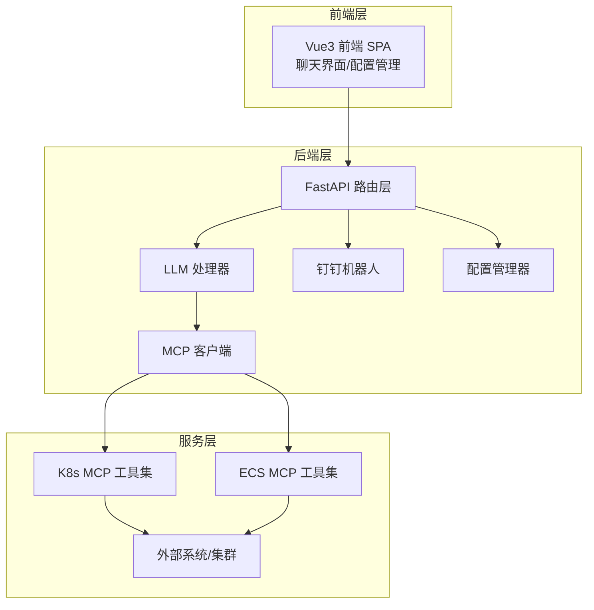
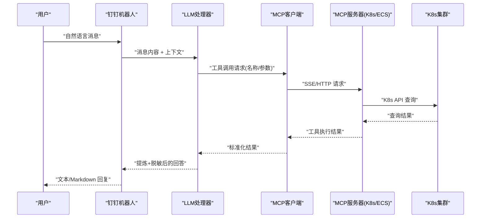
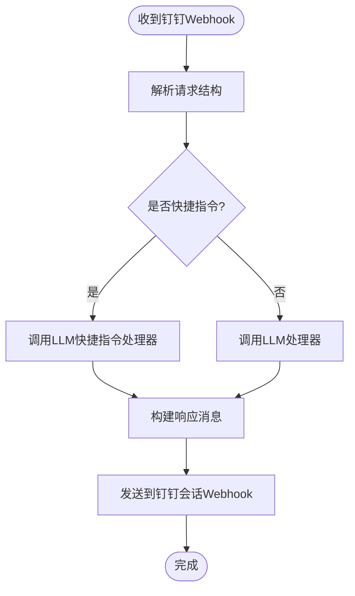
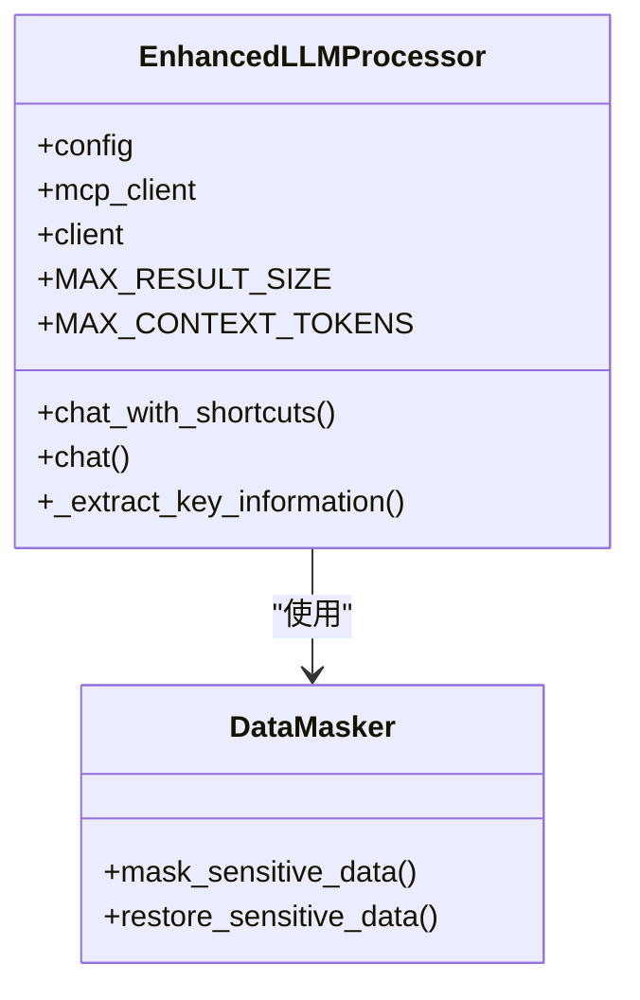
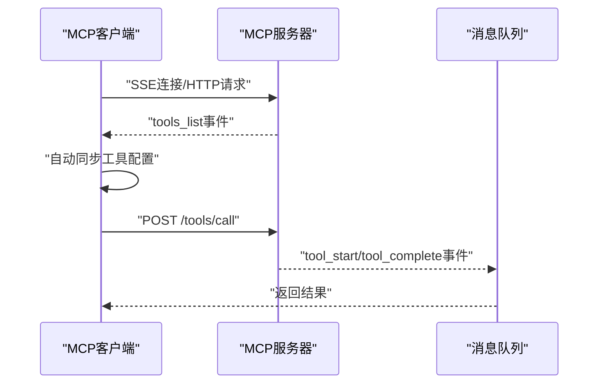
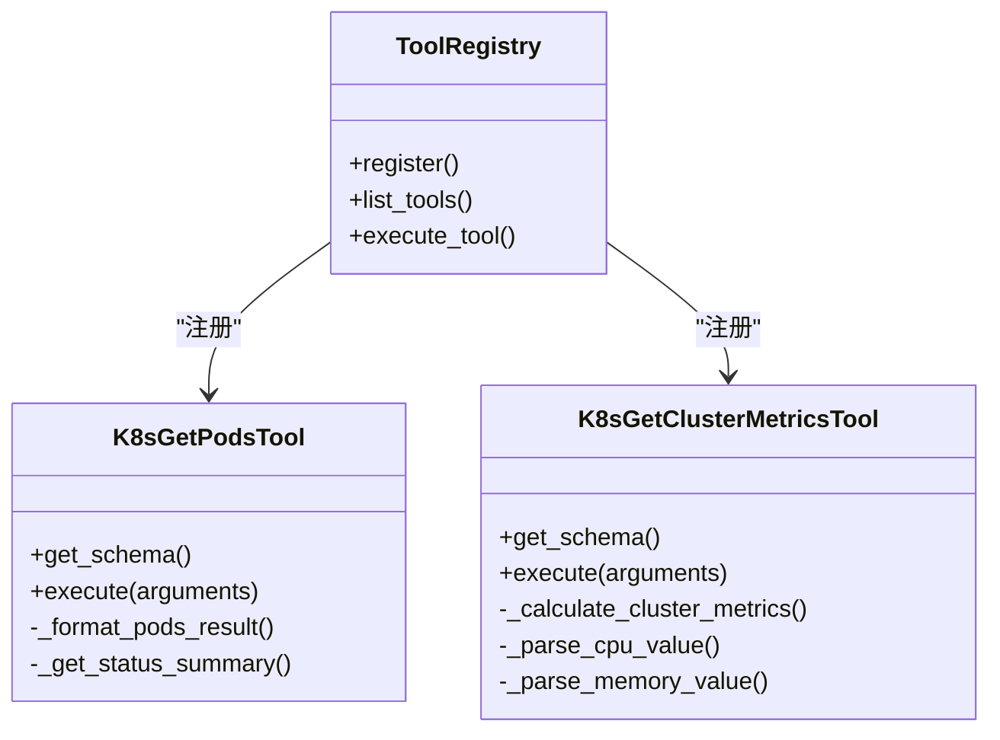
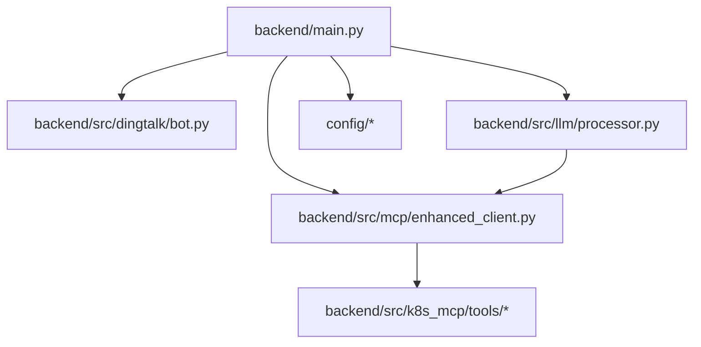

# 项目介绍

<cite>
**本文引用的文件**
- [README.md](file://README.md)
- [backend/main.py](file://backend/main.py)
- [backend/src/dingtalk/bot.py](file://backend/src/dingtalk/bot.py)
- [backend/src/k8s_mcp/server.py](file://backend/src/k8s_mcp/server.py)
- [backend/src/k8s_mcp/tools/__init__.py](file://backend/src/k8s_mcp/tools/__init__.py)
- [backend/src/k8s_mcp/tools/k8s_get_pods.py](file://backend/src/k8s_mcp/tools/k8s_get_pods.py)
- [backend/src/k8s_mcp/tools/k8s_get_cluster_metrics.py](file://backend/src/k8s_mcp/tools/k8s_get_cluster_metrics.py)
- [backend/src/mcp/enhanced_client.py](file://backend/src/mcp/enhanced_client.py)
- [backend/src/llm/processor.py](file://backend/src/llm/processor.py)
- [backend/src/llm/crew_orchestrator.py](file://backend/src/llm/crew_orchestrator.py)
- [config/README.md](file://config/README.md)
- [project_document/技术架构与配置指南.md](file://project_document/技术架构与配置指南.md)
- [project_document/wiki/k8s-ecs-mcp/01-introduction-and-glossary.md](file://project_document/wiki/k8s-ecs-mcp/01-introduction-and-glossary.md)
- [frontend-v2/package.json](file://frontend-v2/package.json)
</cite>

## 目录
1. [简介](#简介)
2. [项目结构](#项目结构)
3. [核心组件](#核心组件)
4. [架构总览](#架构总览)
5. [详细组件分析](#详细组件分析)
6. [依赖关系分析](#依赖关系分析)
7. [性能考量](#性能考量)
8. [故障排查指南](#故障排查指南)
9. [结论](#结论)
10. [附录](#附录)

## 简介
钉钉K8s运维机器人是一个基于钉钉平台的智能运维助手，通过自然语言交互实现对Kubernetes集群的管理与运维操作。它将LLM（大语言模型）与MCP（模型上下文协议）工具系统结合，提供“所想即所得”的运维体验：用户只需用自然语言描述需求，系统即可自动识别意图、路由到合适的工具并返回结构化结果，同时支持钉钉群聊的实时互动与Markdown富文本展示。

本项目的核心价值在于：
- 降低运维门槛：无需记忆复杂的kubectl命令，只需自然语言即可完成常见运维任务
- 提升响应效率：通过LLM+工具链的组合，快速定位问题并给出可执行的建议
- 强化安全与合规：内置脱敏与审计机制，保障敏感信息不泄露
- 一体化管理：统一接入K8s/ECS等多源工具，支持定时巡检与主动告警

## 项目结构
项目采用“后端主进程 + 前端SPA + 配置中心 + 文档体系”的组织方式，核心目录与职责如下：
- backend：后端主应用与服务模块，包含API路由、LLM处理、MCP客户端、钉钉机器人、K8s/ECS工具等
- frontend-v2：现代化Vue3前端，提供聊天界面、配置管理、主题切换等
- config：运行时配置目录，包含LLM/MCP/技能/定时任务等配置文件
- project_document：项目文档与架构说明，涵盖技术设计、配置指南、集成说明等
- archived：历史独立MCP工程归档，便于对比与迁移

图表来源
- [backend/main.py:302-450](file://backend/main.py#L302-L450)
- [backend/src/dingtalk/bot.py:51-114](file://backend/src/dingtalk/bot.py#L51-L114)
- [backend/src/mcp/enhanced_client.py:33-112](file://backend/src/mcp/enhanced_client.py#L33-L112)
- [backend/src/k8s_mcp/server.py:50-90](file://backend/src/k8s_mcp/server.py#L50-L90)

章节来源
- [README.md:64-76](file://README.md#L64-L76)
- [project_document/技术架构与配置指南.md:8-38](file://project_document/技术架构与配置指南.md#L8-L38)

## 核心组件
- 钉钉机器人：接收群聊消息，解析意图，调用LLM与MCP工具，将结果以文本或Markdown形式回复
- LLM处理器：封装LLM客户端，支持工具调用、结果提炼、上下文限制与脱敏
- MCP客户端：统一管理MCP服务器连接、工具发现、路由与调用，支持SSE/HTTP/STDIO等多种传输
- K8s/ECS工具集：提供20+只读工具，覆盖Pod/Service/Deployment/Node/日志/事件/指标等查询
- 配置管理：统一管理LLM/MCP/技能/定时任务配置，支持热重载与自动迁移
- 前端界面：现代化聊天界面，支持流式响应、主题切换、Markdown渲染

章节来源
- [backend/src/dingtalk/bot.py:51-114](file://backend/src/dingtalk/bot.py#L51-L114)
- [backend/src/llm/processor.py:30-58](file://backend/src/llm/processor.py#L30-L58)
- [backend/src/mcp/enhanced_client.py:33-112](file://backend/src/mcp/enhanced_client.py#L33-L112)
- [backend/src/k8s_mcp/tools/__init__.py:46-86](file://backend/src/k8s_mcp/tools/__init__.py#L46-L86)
- [config/README.md:1-17](file://config/README.md#L1-L17)
- [frontend-v2/package.json:1-41](file://frontend-v2/package.json#L1-L41)

## 架构总览
系统采用“前端-后端-服务层”的三层架构，通过MCP协议将LLM与工具解耦，实现可插拔的运维能力扩展。整体流程：
- 用户在钉钉群聊中输入自然语言
- 钉钉机器人接收消息并路由到LLM处理器
- LLM根据上下文判断是否需要调用工具，构造工具调用参数
- MCP客户端连接工具服务器，发起工具调用
- 工具执行完成后，结果经MCP返回LLM，LLM进行结果提炼与脱敏
- 最终以文本或Markdown形式回复到钉钉群聊

图表来源
- [backend/src/dingtalk/bot.py:115-220](file://backend/src/dingtalk/bot.py#L115-L220)
- [backend/src/llm/processor.py:158-186](file://backend/src/llm/processor.py#L158-L186)
- [backend/src/mcp/enhanced_client.py:587-734](file://backend/src/mcp/enhanced_client.py#L587-L734)
- [backend/src/k8s_mcp/server.py:617-656](file://backend/src/k8s_mcp/server.py#L617-L656)

## 详细组件分析

### 钉钉机器人组件
- 消息处理：支持快捷指令与普通消息两类；普通消息统一交由LLM处理
- 响应构建：自动识别Markdown内容并使用Markdown消息类型，支持签名验证
- 主动消息：支持@用户、@全部、关键词前缀等主动推送能力
- 机器人状态：可查询可用工具数、快捷指令、MCP状态等

图表来源
- [backend/src/dingtalk/bot.py:64-114](file://backend/src/dingtalk/bot.py#L64-L114)
- [backend/src/dingtalk/bot.py:223-331](file://backend/src/dingtalk/bot.py#L223-L331)

章节来源
- [backend/src/dingtalk/bot.py:51-114](file://backend/src/dingtalk/bot.py#L51-L114)
- [backend/src/dingtalk/bot.py:350-473](file://backend/src/dingtalk/bot.py#L350-L473)

### LLM处理器组件
- 客户端初始化：支持OpenAI/Ollama等供应商，具备超时与重试策略
- 工具调用：在LLM上下文中注入工具schema，支持函数调用与结果提炼
- 结果处理：对工具返回进行关键信息提炼、上下文大小限制与脱敏
- 供应商管理：当前简化为单一供应商配置，便于快速部署与运维

图表来源
- [backend/src/llm/processor.py:30-58](file://backend/src/llm/processor.py#L30-L58)
- [backend/src/llm/processor.py:158-186](file://backend/src/llm/processor.py#L158-L186)

章节来源
- [backend/src/llm/processor.py:30-58](file://backend/src/llm/processor.py#L30-L58)
- [backend/src/llm/processor.py:158-186](file://backend/src/llm/processor.py#L158-L186)

### MCP客户端组件
- 连接管理：支持SSE/HTTP/STDIO等传输，自动重连与心跳检测
- 工具发现：通过SSE事件流接收工具列表，自动同步到配置文件
- 工具调用：统一的工具调用接口，支持超时与结果等待
- 配置同步：自动将远端工具配置写入本地配置文件，支持热重载

图表来源
- [backend/src/mcp/enhanced_client.py:61-94](file://backend/src/mcp/enhanced_client.py#L61-L94)
- [backend/src/mcp/enhanced_client.py:246-320](file://backend/src/mcp/enhanced_client.py#L246-L320)
- [backend/src/mcp/enhanced_client.py:652-734](file://backend/src/mcp/enhanced_client.py#L652-L734)

章节来源
- [backend/src/mcp/enhanced_client.py:33-112](file://backend/src/mcp/enhanced_client.py#L33-L112)
- [backend/src/mcp/enhanced_client.py:321-504](file://backend/src/mcp/enhanced_client.py#L321-L504)

### K8s工具集组件
- 工具分类：当前仅注册安全的只读工具，避免误操作风险
- 工具示例：Pod查询、集群指标、节点信息、事件日志等
- 结果格式化：统一输出结构化数据，便于LLM提炼与展示

图表来源
- [backend/src/k8s_mcp/tools/k8s_get_pods.py:16-105](file://backend/src/k8s_mcp/tools/k8s_get_pods.py#L16-L105)
- [backend/src/k8s_mcp/tools/k8s_get_cluster_metrics.py:23-83](file://backend/src/k8s_mcp/tools/k8s_get_cluster_metrics.py#L23-L83)
- [backend/src/k8s_mcp/tools/__init__.py:89-116](file://backend/src/k8s_mcp/tools/__init__.py#L89-L116)

章节来源
- [backend/src/k8s_mcp/tools/__init__.py:46-86](file://backend/src/k8s_mcp/tools/__init__.py#L46-L86)
- [backend/src/k8s_mcp/tools/k8s_get_pods.py:53-105](file://backend/src/k8s_mcp/tools/k8s_get_pods.py#L53-L105)
- [backend/src/k8s_mcp/tools/k8s_get_cluster_metrics.py:59-83](file://backend/src/k8s_mcp/tools/k8s_get_cluster_metrics.py#L59-L83)

### 前端界面组件
- 技术栈：Vue3 + Element Plus + Vue Router + Pinia
- 功能：聊天窗口、消息搜索、配置编辑、主题切换、Markdown渲染
- 开发体验：Vite构建，支持热重载与预览

章节来源
- [frontend-v2/package.json:1-41](file://frontend-v2/package.json#L1-L41)

## 依赖关系分析
- 后端主进程负责统一启动与编排，包含LLM、MCP、钉钉机器人、定时巡检与任务调度
- MCP客户端负责与MCP服务器通信，工具注册与调用
- LLM处理器负责与LLM服务交互，工具调用与结果提炼
- K8s/ECS工具集提供只读查询能力，避免误操作风险
- 配置管理器负责配置文件的读取、热重载与迁移

图表来源
- [backend/main.py:148-270](file://backend/main.py#L148-L270)
- [backend/src/dingtalk/bot.py:51-114](file://backend/src/dingtalk/bot.py#L51-L114)
- [backend/src/llm/processor.py:30-58](file://backend/src/llm/processor.py#L30-L58)
- [backend/src/mcp/enhanced_client.py:33-112](file://backend/src/mcp/enhanced_client.py#L33-L112)
- [backend/src/k8s_mcp/tools/__init__.py:89-116](file://backend/src/k8s_mcp/tools/__init__.py#L89-L116)

章节来源
- [backend/main.py:148-270](file://backend/main.py#L148-L270)
- [project_document/技术架构与配置指南.md:42-103](file://project_document/技术架构与配置指南.md#L42-L103)

## 性能考量
- 工具调用超时与重试：MCP客户端支持指数退避重试，避免瞬时网络波动影响
- 结果大小限制：LLM处理器对工具返回进行关键信息提炼，避免上下文溢出
- SSE事件流：MCP服务器通过SSE推送工具执行状态，降低轮询开销
- 前端渲染优化：Markdown渲染与代码高亮，提升可读性与交互体验

章节来源
- [backend/src/mcp/enhanced_client.py:168-244](file://backend/src/mcp/enhanced_client.py#L168-L244)
- [backend/src/llm/processor.py:158-186](file://backend/src/llm/processor.py#L158-L186)
- [backend/src/k8s_mcp/server.py:536-548](file://backend/src/k8s_mcp/server.py#L536-L548)

## 故障排查指南
- 配置迁移：首次启动或缺失配置时，系统会自动迁移环境变量到配置文件
- MCP连接失败：检查服务器状态与认证配置，关注SSE连接超时与网络错误
- LLM客户端初始化失败：检查API Key、代理设置与供应商配置
- 钉钉签名验证：若出现签名错误，检查WEBHOOK_URL与SECRET配置
- 热重载问题：检查文件监控状态与配置文件权限

章节来源
- [backend/main.py:62-129](file://backend/main.py#L62-L129)
- [backend/src/mcp/enhanced_client.py:168-244](file://backend/src/mcp/enhanced_client.py#L168-L244)
- [backend/src/dingtalk/bot.py:320-348](file://backend/src/dingtalk/bot.py#L320-L348)
- [project_document/技术架构与配置指南.md:388-424](file://project_document/技术架构与配置指南.md#L388-L424)

## 结论
钉钉K8s运维机器人通过“LLM+MCP+钉钉”的组合，实现了自然语言驱动的K8s运维体验。其核心优势在于：
- 降低学习成本：自然语言交互，无需记忆复杂命令
- 提升运维效率：自动识别意图、工具调用与结果提炼
- 强化安全合规：内置脱敏与审计，保障敏感信息不泄露
- 一体化管理：统一接入K8s/ECS工具，支持定时巡检与主动告警

面向不同角色的价值：
- 运维工程师：快速定位问题、批量查询与状态概览
- 开发者：通过自然语言获取集群状态、日志与事件，加速问题排查
- 管理员：集中管理配置、监控与告警，统一运维口径

## 附录
- 快速开始：安装依赖、复制配置、启动服务、访问页面
- 常用命令：一键启动、仅后端服务、开发环境、构建前端
- 文档索引：项目状态与计划、技术架构与配置、重构基线、聊天流协议

章节来源
- [README.md:15-98](file://README.md#L15-L98)
- [project_document/技术架构与配置指南.md:427-442](file://project_document/技术架构与配置指南.md#L427-L442)