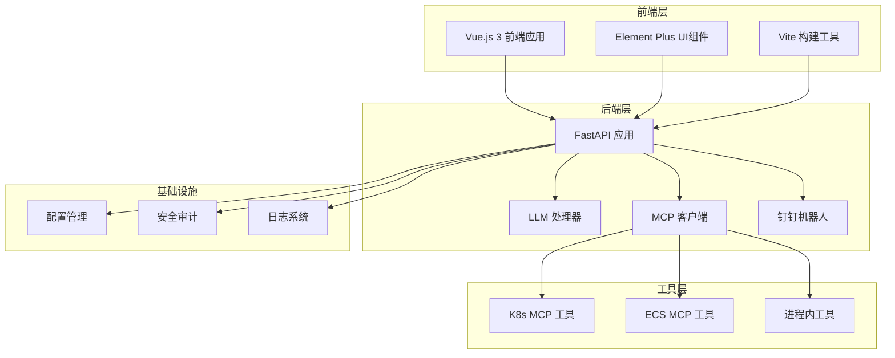
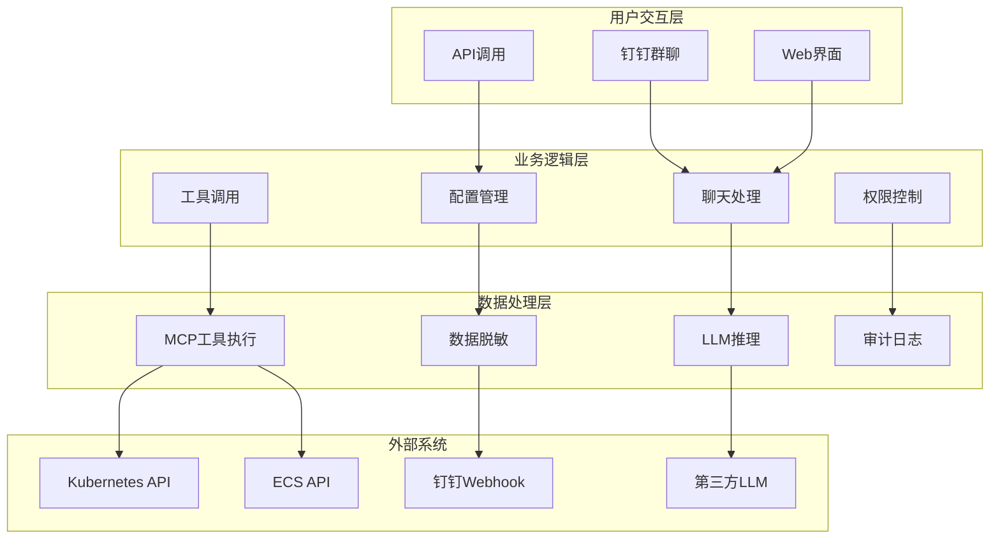
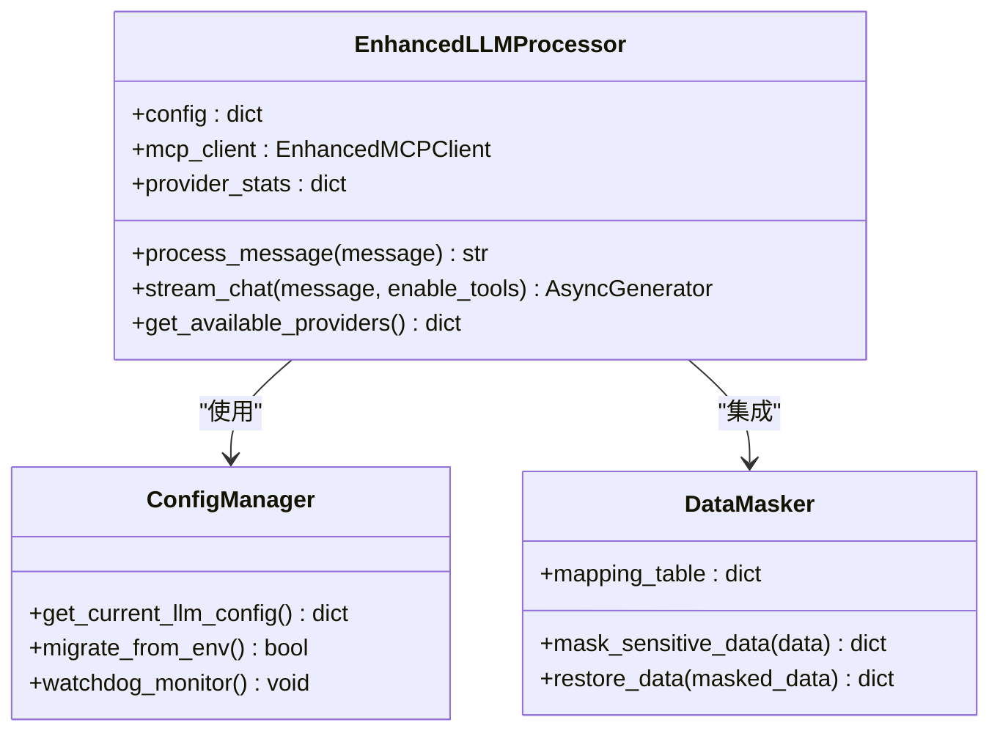
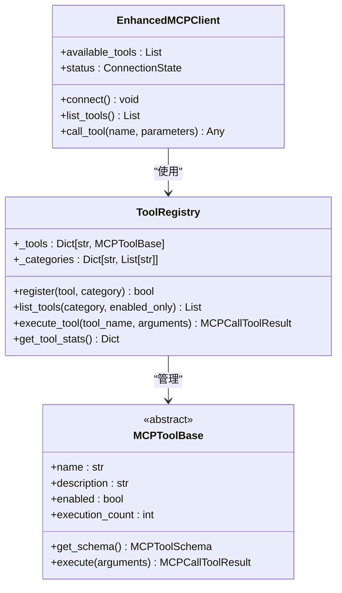
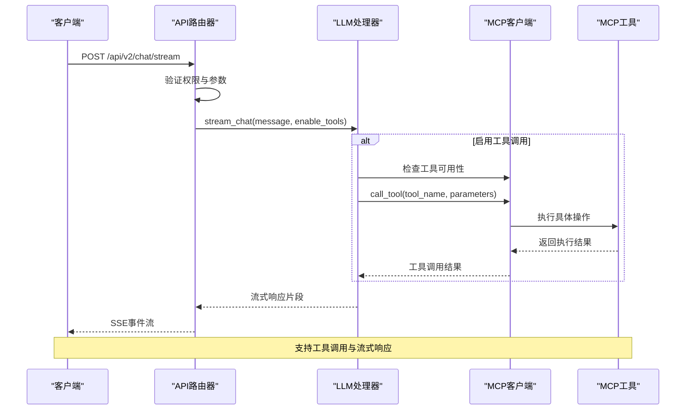
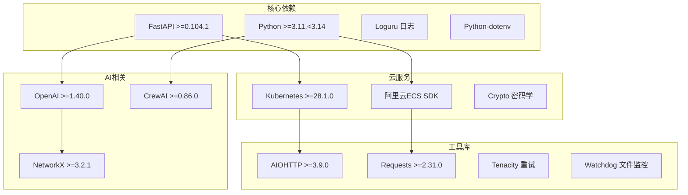
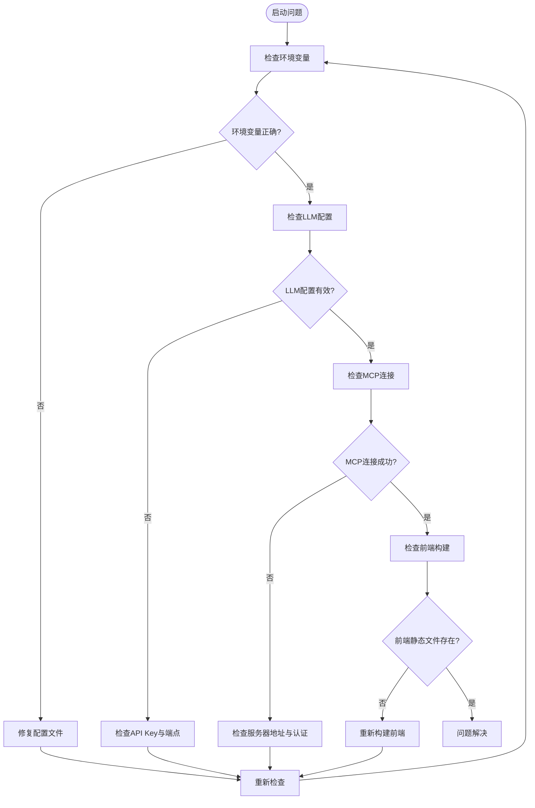

# 项目概述

<cite>
**本文档引用的文件**
- [README.md](file://README.md)
- [backend/main.py](file://backend/main.py)
- [frontend-v2/package.json](file://frontend-v2/package.json)
- [frontend-v2/vite.config.js](file://frontend-v2/vite.config.js)
- [frontend-v2/src/main.js](file://frontend-v2/src/main.js)
- [pyproject.toml](file://pyproject.toml)
- [project_document/技术架构与配置指南.md](file://project_document/技术架构与配置指南.md)
- [project_document/wiki/k8s-ecs-mcp/01-introduction-and-glossary.md](file://project_document/wiki/k8s-ecs-mcp/01-introduction-and-glossary.md)
- [backend/src/mcp/builtin_k8s_ecs.py](file://backend/src/mcp/builtin_k8s_ecs.py)
- [backend/src/k8s_mcp/core/tool_registry.py](file://backend/src/k8s_mcp/core/tool_registry.py)
- [backend/src/ecs_mcp/core/tool_registry.py](file://backend/src/ecs_mcp/core/tool_registry.py)
- [backend/src/api/v2/router.py](file://backend/src/api/v2/router.py)
- [archived/README.md](file://archived/README.md)
- [config/mcp_config.example.json](file://config/mcp_config.example.json)
- [config/llm_config.example.json](file://config/llm_config.example.json)
</cite>

## 目录
1. [引言](#引言)
2. [项目结构](#项目结构)
3. [核心组件](#核心组件)
4. [架构总览](#架构总览)
5. [详细组件分析](#详细组件分析)
6. [依赖关系分析](#依赖关系分析)
7. [性能考虑](#性能考虑)
8. [故障排查指南](#故障排查指南)
9. [结论](#结论)
10. [附录](#附录)

## 引言
钉钉K8s运维机器人是一个基于钉钉平台的智能运维助手，通过自然语言交互实现对Kubernetes集群的管理与运维操作。项目的核心价值在于：
- 降低运维门槛：通过自然语言对话完成复杂的K8s操作
- 提升运维效率：集成MCP工具系统，支持自动化运维任务
- 增强可观测性：提供实时监控与告警能力
- 强化安全性：内置数据脱敏与审计机制

项目定位为统一的智能运维平台，支持K8s与ECS多云资源管理，并提供现代化的Web界面。

## 项目结构
项目采用前后端分离架构，主要分为三个层次：

**图表来源**
- [backend/main.py:302-494](file://backend/main.py#L302-L494)
- [frontend-v2/package.json:1-41](file://frontend-v2/package.json#L1-L41)

**章节来源**
- [README.md:64-76](file://README.md#L64-L76)
- [backend/main.py:302-494](file://backend/main.py#L302-L494)
- [frontend-v2/package.json:1-41](file://frontend-v2/package.json#L1-L41)

## 核心组件
项目包含以下核心组件：

### 1. 后端主应用 (FastAPI)
- **应用入口**: [backend/main.py:1-494](file://backend/main.py#L1-L494)
- **生命周期管理**: 支持应用启动、配置迁移、服务清理
- **中间件**: CORS、审计日志、异常处理
- **静态文件**: 前端构建产物托管

### 2. LLM处理器
- **增强LLM处理器**: 支持多供应商、流式响应
- **配置管理**: 自动迁移、热重载、安全脱敏
- **流式对话**: SSE协议支持，提供实时响应体验

### 3. MCP客户端
- **增强MCP客户端**: 支持远程服务器连接与工具发现
- **进程内工具**: K8s/ECS工具直接在主进程中运行
- **工具注册**: 统一的工具注册与管理机制

### 4. 钉钉机器人
- **Webhook集成**: 支持钉钉群聊机器人
- **消息处理**: 自然语言转运维指令
- **告警通知**: 集成巡检结果与告警信息

### 5. 前端界面 (Vue.js 3)
- **现代化UI**: Element Plus组件库
- **流式聊天**: 实时对话体验
- **多主题支持**: Ops主题、聊天主题等
- **路由管理**: Vue Router单页应用

**章节来源**
- [backend/main.py:148-270](file://backend/main.py#L148-L270)
- [backend/src/mcp/builtin_k8s_ecs.py:1-92](file://backend/src/mcp/builtin_k8s_ecs.py#L1-L92)
- [frontend-v2/src/main.js:1-52](file://frontend-v2/src/main.js#L1-L52)

## 架构总览
项目采用分层架构设计，核心设计理念包括：

**图表来源**
- [project_document/技术架构与配置指南.md:12-38](file://project_document/技术架构与配置指南.md#L12-L38)
- [backend/src/api/v2/router.py:158-345](file://backend/src/api/v2/router.py#L158-L345)

### 技术栈选择
- **后端**: FastAPI + Python 3.11-3.13，支持异步IO与类型安全
- **前端**: Vue.js 3 + Vite，提供现代化开发体验
- **数据库**: 采用文件配置 + 内存缓存，支持热重载
- **通信协议**: SSE流式传输，支持WebSocket扩展

### 系统边界
- **内部边界**: 仅暴露API接口，内部组件通过依赖注入解耦
- **外部边界**: 通过MCP协议与K8s/ECS等外部系统交互
- **安全边界**: 内置数据脱敏与审计机制

**章节来源**
- [project_document/技术架构与配置指南.md:8-38](file://project_document/技术架构与配置指南.md#L8-L38)
- [pyproject.toml:9-51](file://pyproject.toml#L9-L51)

## 详细组件分析

### LLM处理器架构

**图表来源**
- [backend/main.py:189-218](file://backend/main.py#L189-L218)
- [project_document/技术架构与配置指南.md:85-96](file://project_document/技术架构与配置指南.md#L85-L96)

### MCP工具系统

**图表来源**
- [backend/src/k8s_mcp/core/tool_registry.py:75-401](file://backend/src/k8s_mcp/core/tool_registry.py#L75-L401)
- [backend/src/ecs_mcp/core/tool_registry.py:60-140](file://backend/src/ecs_mcp/core/tool_registry.py#L60-L140)
- [backend/src/mcp/builtin_k8s_ecs.py:76-92](file://backend/src/mcp/builtin_k8s_ecs.py#L76-L92)

### API路由架构

**图表来源**
- [backend/src/api/v2/router.py:175-345](file://backend/src/api/v2/router.py#L175-L345)

**章节来源**
- [backend/src/api/v2/router.py:158-345](file://backend/src/api/v2/router.py#L158-L345)
- [backend/src/k8s_mcp/core/tool_registry.py:235-268](file://backend/src/k8s_mcp/core/tool_registry.py#L235-L268)

## 依赖关系分析

### 依赖层次结构

**图表来源**
- [pyproject.toml:9-51](file://pyproject.toml#L9-L51)

### 组件耦合度分析
- **低耦合设计**: 各模块通过接口抽象解耦，支持热插拔
- **依赖注入**: 使用RuntimeContainer统一管理服务实例
- **配置驱动**: 通过配置文件控制功能开关与行为
- **进程内工具**: 减少网络依赖，提升响应速度

**章节来源**
- [pyproject.toml:9-51](file://pyproject.toml#L9-L51)
- [backend/main.py:134-136](file://backend/main.py#L134-L136)

## 性能考虑
项目在性能方面采取了多项优化措施：

### 1. 异步架构
- **异步IO**: 全面使用async/await，提升并发处理能力
- **流式响应**: SSE协议支持实时数据传输
- **后台任务**: 定时巡检与任务调度采用异步模式

### 2. 缓存策略
- **工具注册表缓存**: 工具元数据缓存减少查询开销
- **配置热重载**: watchdog监控配置文件变化
- **连接池管理**: MCP客户端连接复用

### 3. 资源优化
- **内存管理**: 工具执行计数与统计信息
- **日志分级**: 支持不同级别日志输出
- **错误处理**: 统一异常捕获与降级策略

## 故障排查指南

### 常见问题诊断

**图表来源**
- [backend/main.py:62-129](file://backend/main.py#L62-L129)

### 排查步骤
1. **健康检查**: 访问 `/health` 端点确认服务状态
2. **日志分析**: 查看 `logs/app.log` 中的错误信息
3. **配置验证**: 检查 `config/llm_config.json` 和 `config/mcp_config.json`
4. **网络连通性**: 验证MCP服务器与K8s API的可达性
5. **权限检查**: 确认钉钉机器人Webhook配置正确

**章节来源**
- [backend/main.py:464-474](file://backend/main.py#L464-L474)
- [project_document/技术架构与配置指南.md:386-424](file://project_document/技术架构与配置指南.md#L386-L424)

## 结论
钉钉K8s运维机器人项目通过统一的架构设计，实现了以下目标：
- **统一平台**: 将原本独立的MCP工程整合为统一平台
- **智能运维**: 结合LLM与MCP工具，提供智能化运维体验
- **安全可靠**: 内置数据脱敏与审计机制，保障系统安全
- **易于扩展**: 模块化设计支持功能扩展与定制

项目当前处于稳定发展阶段，具备良好的可维护性与扩展性，适合在生产环境中部署使用。

## 附录

### 发展历程
项目经历了从独立MCP工程到统一平台的演进过程：
1. **独立阶段**: k8s-mcp-standalone 与 ecs-mcp-standalone 独立运行
2. **整合阶段**: 将工具逻辑迁入主应用，支持进程内执行
3. **统一平台**: 归档历史独立工程，形成完整的统一平台

### 配置文件说明
- **LLM配置**: `config/llm_config.json` - LLM提供商配置
- **MCP配置**: `config/mcp_config.json` - MCP服务器与工具配置
- **技能配置**: `config/skills.json` - 工具白名单与权限控制

### 快速启动命令
- `poetry run start-all`: 一键启动所有服务
- `poetry run serve`: 启动后端服务
- `poetry run dev`: 开发环境启动
- `poetry run build`: 构建前端静态资源

**章节来源**
- [archived/README.md:1-12](file://archived/README.md#L1-L12)
- [README.md:78-98](file://README.md#L78-L98)
- [config/mcp_config.example.json:1-66](file://config/mcp_config.example.json#L1-L66)
- [config/llm_config.example.json:1-45](file://config/llm_config.example.json#L1-L45)