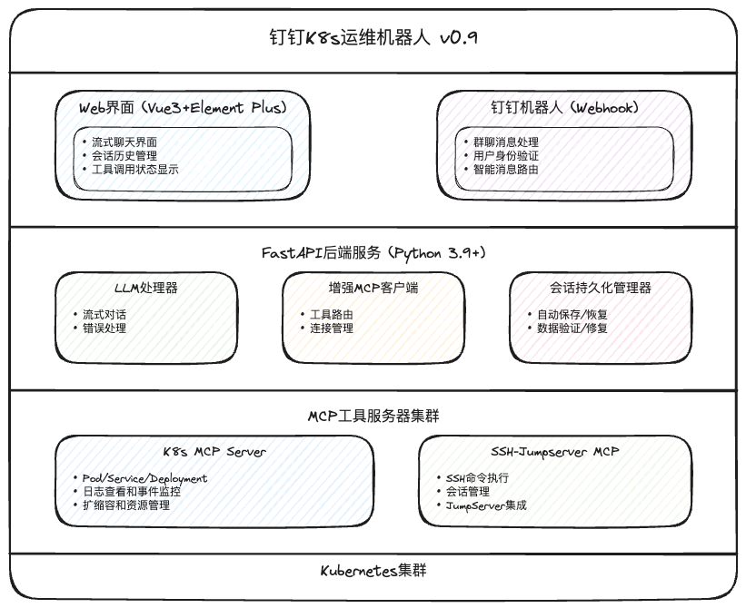

# 钉钉K8s运维机器人

一个基于钉钉的智能Kubernetes运维机器人，支持通过自然语言进行K8s集群管理和运维操作。

## ✨ 核心特性

- 🤖 **智能对话**: 自然语言交互，理解运维意图
- ⚙️ **K8s管理**: Pod、Service、Deployment等资源管理
- 📊 **实时监控**: 集群状态、资源使用情况监控
- 🔧 **MCP协议**: 可扩展的工具系统
- 🌐 **Web界面**: 现代化聊天界面
- 📱 **钉钉集成**: 机器人webhook推送
- 🔐 **安全可控**: 权限控制和操作审计
- 💾 **会话持久化**: 对话历史自动保存，刷新不丢失
- ⚡ **流式响应**: 优化的SSE格式，实时响应体验

## 🚀 最新功能

### Prometheus资源分析 (v1.1.0) ⭐ 最新更新
- ✅ **智能资源分析** - K8s集群资源利用率深度分析
- ✅ **阿里云ARMS集成** - Prometheus指标数据自动获取
- ✅ **优化建议生成** - AI驱动的资源优化建议
- ✅ **实时监控告警** - 资源异常自动检测和通知

### 核心系统功能
- ✅ **配置管理系统** - 统一配置路径，热重载，自动迁移
- ✅ **数据脱敏系统** - IP/主机名/人名脱敏，双阶段恢复
- ✅ **会话持久化** - 页面刷新后保持对话历史
- ✅ **LLM多提供商支持** - OpenAI、Azure、智谱等
- ✅ **MCP协议集成** - K8s和SSH工具集成

## 🎯 项目进度

**当前完成度: 98%** 🎉 **生产就绪**

- ✅ **基础架构** (100%) - 前后端分离架构完成
- ✅ **MCP工具集成** (98%) - 18+个K8s管理工具
- ✅ **智能分析** (95%) - Prometheus资源分析系统
- ✅ **安全系统** (95%) - 数据脱敏和权限控制
- ✅ **配置管理** (100%) - 统一配置和热重载

## 架构设计



## 快速开始

### 1. 环境准备（30秒启动）

> 📋 **项目管理**: 本项目使用 [Poetry](https://python-poetry.org/) 进行Python依赖管理，所有Python命令必须使用 `poetry run` 前缀

```bash
# 克隆项目
git clone <repository-url>
cd ding-robot

# 安装Poetry依赖
poetry install

### 2. 配置文件

编辑 `backend/config.env` 文件：

```env
# LLM配置
OPENAI_API_KEY=your_openai_api_key_here
LLM_MODEL=gpt-3.5-turbo

# Kubernetes配置
KUBECONFIG_PATH=/path/to/kubeconfig
K8S_NAMESPACE=default

# MCP配置 (重要: 使用localhost而不是环境变量)
K8S_MCP_HOST=localhost
K8S_MCP_PORT=8766

# 钉钉配置
DINGTALK_WEBHOOK_URL=https://oapi.dingtalk.com/robot/send?access_token=your_token
DINGTALK_SECRET=your_secret
```

### 3. 启动MCP工具服务器

```bash
# 启动K8s MCP服务器
cd k8s-mcp
poetry run python -m k8s_mcp.server

# SSH-Jumpserver MCP (开发中，暂不可用)
# cd ssh-jumpserver-mcp
# poetry run python -m ssh_jumpserver_mcp.server
```

### 4. 启动主服务

```bash
# 开发环境（前后端分离）
poetry run dev

# 生产环境（单端口集成）
poetry run build && poetry run serve
```

### 5. 访问应用

**开发环境**:
- 🌐 前端: http://localhost:3000 (热重载)
- 🔧 后端: http://localhost:8000
- 📚 API文档: http://localhost:8000/docs

**生产环境**:
- 🌐 主页: http://localhost:8000
- 📱 SPA应用: http://localhost:8000/spa/
- 📚 API文档: http://localhost:8000/docs

## 📚 详细文档

完整的项目文档请查看：**[项目文档导航](./project_document/README.md)**

### 核心文档
- **[项目总览与最新状态](./project_document/项目总览与最新状态.md)** - 完整项目概述
- **[技术架构与配置指南](./project_document/技术架构与配置指南.md)** - 系统架构详解
- **[开发与部署指南](./project_document/development-deployment-guide.md)** - 开发部署完整流程

## 🛠️ 支持的工具

### Kubernetes工具集 (25+个)
- **基础管理**: Pod、Service、Deployment、Node等资源管理
- **智能分析**: 资源关联查询、集群状态摘要、依赖分析
- **监控告警**: Prometheus指标分析、资源利用率监控
- **运维操作**: 扩缩容、日志查看、事件监控

详细工具列表请查看：**[K8s MCP服务器文档](./k8s-mcp/README.md)**

### SSH工具集 (开发中)
- `ssh-execute` - 远程命令执行
- `ssh-asset-list` - 服务器资产管理  
- `ssh-session-manager` - SSH会话管理

## ⚡ 可用命令

| 命令 | 功能 | 使用场景 |
|------|------|----------|
| `poetry run dev` | 启动开发环境 | 日常开发 |
| `poetry run build` | 构建项目 | 部署前准备 |
| `poetry run serve` | 启动生产服务 | 生产部署 |
| `poetry run setup` | 项目初始化 | 第一次设置 |

## 🔧 故障排除

### 常见问题

1. **MCP连接失败** 
   ```bash
   # 检查配置文件 backend/config/mcp_config.json
   # 确保 "host": "localhost" 而不是 "${K8S_MCP_HOST}"
   ```

2. **会话数据丢失**
   ```bash
   # 已修复：现在支持自动数据恢复
   # 刷新页面后对话历史完整保留
   ```

3. **流式响应异常**
   ```bash
   # 已修复：优化了SSE格式
   # 支持更快的实时响应
   ```

### 监控端点
- **健康检查**: `GET /api/v2/health`
- **性能统计**: `GET /api/v2/debug/performance`
- **系统状态**: `GET /api/status`
- **可用工具**: `GET /api/v2/tools`

## 🎯 下一步计划

### v1.2.0 - 性能优化和监控系统
- 🔄 **性能优化** - 系统性能调优和资源优化
- 📊 **监控系统** - 完善的监控和告警体系
- 🔧 **批量操作** - 支持批量K8s资源操作

### v1.3.0 - 多集群支持和权限管理
- 🌐 **多集群支持** - 管理多个K8s集群
- 🔐 **权限管理** - 细粒度的用户权限控制
- 📱 **移动端适配** - 响应式设计优化

### 未来功能
- 🔧 **SSH-Jumpserver MCP** - 企业级SSH运维工具集
- 🤖 **更多AI工具集成** - 扩展AI能力
- 📊 **可视化运维面板** - 图形化运维界面

## 📚 相关文档

- **[项目文档导航](./project_document/README.md)** - 完整文档索引
- **[K8s MCP服务器](./k8s-mcp/README.md)** - MCP服务器详细文档
- **[开发指南](./project_document/development-deployment-guide.md)** - 开发部署指南

## 📄 许可证

MIT License

---

**🎉 项目已生产就绪！98%功能完成，期待你的体验和反馈！**