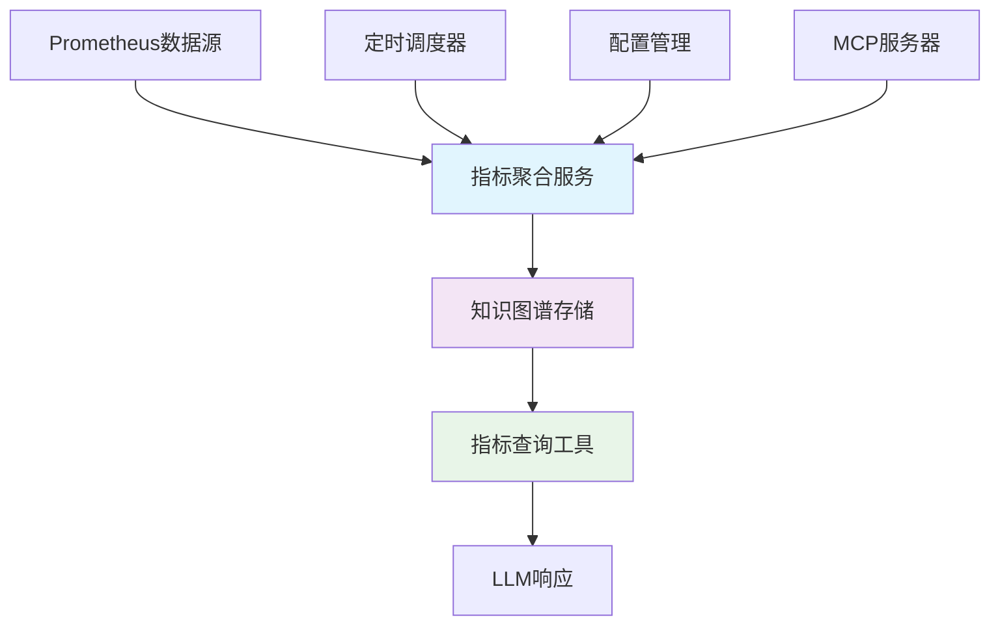

# K8s资源指标知识图谱集成指南

## 📋 概述

本文档介绍了将14天内CPU和内存使用率指标集成到知识图谱的完整方案，实现从直接Prometheus查询到高效知识图谱查询的转换。

## 🎯 核心优势

### 性能提升
- **查询速度**: 从Prometheus实时查询（30-60秒）降低到知识图谱查询（<1秒）
- **资源消耗**: 减少重复的Prometheus API调用，降低网络和计算开销
- **并发支持**: 支持多用户同时查询，无需等待Prometheus计算

### 功能增强
- **预计算指标**: 14天CPU/内存平均使用率自动计算和更新
- **智能分析**: 自动识别需要优化的资源配置
- **历史趋势**: 保留指标历史数据，支持趋势分析
- **实时更新**: 定期更新指标数据，保持数据新鲜度

## 🏗️ 系统架构



## 🔧 核心组件

### 1. 扩展知识图谱数据模型

**文件**: `k8s-mcp/src/k8s_mcp/core/k8s_graph.py`

**新增功能**:
- 资源节点支持指标数据存储
- 专门的指标更新方法
- 指标数据查询接口

**数据结构**:
```python
metrics = {
    "cpu_utilization_avg_14d": 45.2,      # 14天CPU平均使用率(%)
    "memory_utilization_avg_14d": 38.7,   # 14天内存平均使用率(%)
    "cpu_requests": 2.5,                   # CPU请求量(核)
    "memory_requests": 4.0,                # 内存请求量(GB)
    "metrics_last_updated": "2025-01-XX", # 指标更新时间
    "needs_optimization": {                # 优化建议
        "cpu": true,
        "memory": true
    }
}
```

### 2. 指标聚合服务

**文件**: `k8s-mcp/src/k8s_mcp/core/metrics_aggregator.py`

**核心功能**:
- 定期从Prometheus获取14天数据
- 计算CPU/内存平均使用率
- 更新知识图谱中的指标数据
- 提供聚合统计信息

**配置参数**:
```python
class MetricsConfig:
    prometheus_url: str                    # Prometheus服务器URL
    aggregation_interval: int = 3600       # 聚合间隔(秒)，默认1小时
    analysis_days: int = 14                # 分析天数
    cpu_threshold: float = 60.0            # CPU利用率阈值
    memory_threshold: float = 60.0         # 内存利用率阈值
```

### 3. 知识图谱指标查询工具

**文件**: `k8s-mcp/src/k8s_mcp/tools/k8s_resource_metrics_query.py`

**工具名称**: `k8s-resource-metrics-query`

**核心功能**:
- 直接从知识图谱查询预计算指标
- 支持多种过滤和排序选项
- 生成智能优化建议
- 提供数据新鲜度检查

## 📊 使用方法

### 环境变量配置

```bash
# Prometheus连接配置
export PROMETHEUS_URL="http://prometheus.monitoring.svc.cluster.local:9090"
export PROMETHEUS_ACCESS_KEY="your_access_key"      # 可选，阿里云ARMS需要
export PROMETHEUS_SECRET_KEY="your_secret_key"      # 可选，阿里云ARMS需要
export PROMETHEUS_AUTH_TYPE="basic"                 # none/basic/bearer

# 指标聚合配置
export METRICS_AGGREGATION_INTERVAL="3600"          # 聚合间隔(秒)
export METRICS_ANALYSIS_DAYS="14"                   # 分析天数
export METRICS_CPU_THRESHOLD="60.0"                 # CPU阈值
export METRICS_MEMORY_THRESHOLD="60.0"              # 内存阈值
```

### 启动服务

```bash
# 启动K8s MCP服务器（会自动启动指标聚合器）
poetry run python k8s-mcp/start_k8s_mcp_http_server.py
```

### 工具调用示例

#### 1. 基础查询
```json
{
    "name": "k8s-resource-metrics-query",
    "arguments": {
        "cpu_threshold": 50.0,
        "memory_threshold": 50.0,
        "limit": 20
    }
}
```

#### 2. 过滤查询
```json
{
    "name": "k8s-resource-metrics-query",
    "arguments": {
        "namespace_filter": "prod|staging",
        "app_name_filter": "web-.*",
        "include_optimization_only": true,
        "sort_by": "overall_utilization",
        "sort_order": "asc"
    }
}
```

#### 3. 新鲜度控制
```json
{
    "name": "k8s-resource-metrics-query",
    "arguments": {
        "metrics_freshness_hours": 12,
        "cpu_threshold": 70.0,
        "memory_threshold": 70.0
    }
}
```

## 📈 查询结果示例

```json
{
    "summary": {
        "total_resources": 45,
        "resources_with_metrics": 42,
        "low_cpu_utilization": 15,
        "low_memory_utilization": 12,
        "both_low_utilization": 8,
        "thresholds": {
            "cpu_threshold_percent": 60.0,
            "memory_threshold_percent": 60.0
        }
    },
    "resources": [
        {
            "resource_id": "deployment/prod/web-app",
            "kind": "deployment",
            "namespace": "prod",
            "name": "web-app",
            "cpu_utilization_avg_14d": 25.3,
            "memory_utilization_avg_14d": 42.1,
            "overall_utilization_avg": 33.7,
            "cpu_requests": 2.0,
            "memory_requests": 4.0,
            "needs_optimization": {
                "cpu": true,
                "memory": true,
                "overall": true
            },
            "optimization_potential": {
                "cpu_reduction_percent": 34.7,
                "memory_reduction_percent": 17.9
            }
        }
    ],
    "recommendations": [
        {
            "type": "cpu_optimization",
            "title": "CPU资源优化建议 - 可节省约12.5核",
            "description": "发现15个应用的14天平均CPU利用率低于60%",
            "priority": "high",
            "top_candidates": [...]
        }
    ]
}
```

## 🔄 数据流程

### 1. 数据收集阶段
1. **定时触发**: 每小时执行一次指标聚合
2. **Prometheus查询**: 获取14天内的原始指标数据
3. **数据处理**: 计算平均值和利用率
4. **知识图谱更新**: 将聚合结果存储到图节点

### 2. 查询响应阶段
1. **工具调用**: LLM调用知识图谱查询工具
2. **图数据检索**: 直接从内存中的知识图谱获取数据
3. **结果分析**: 应用阈值判断和排序逻辑
4. **建议生成**: 自动生成优化建议

## 🎛️ 监控和管理

### 服务状态检查
```bash
# 检查智能功能状态
curl http://localhost:8001/intelligent/status

# 检查指标聚合器状态
curl http://localhost:8001/intelligent/health
```

### 强制执行聚合
```bash
# 通过API触发立即聚合
curl -X POST http://localhost:8001/metrics/aggregate
```

### 日志监控
```bash
# 查看聚合器日志
tail -f k8s-mcp/logs/k8s-mcp.log | grep "指标聚合"
```

## ⚡ 性能对比

| 指标 | 原Prometheus查询 | 知识图谱查询 | 提升比例 |
|------|------------------|--------------|----------|
| 查询响应时间 | 30-60秒 | <1秒 | 30-60x |
| 并发支持 | 低(受Prometheus限制) | 高(内存查询) | 10x+ |
| 网络开销 | 高(大量数据传输) | 低(本地查询) | 90%+ |
| CPU使用 | 高(实时计算) | 低(预计算) | 80%+ |

## 🔧 故障排查

### 常见问题

#### 1. 指标聚合器未启动
**症状**: 知识图谱查询返回空结果
**解决**: 检查Prometheus配置和网络连接
```bash
# 检查环境变量
echo $PROMETHEUS_URL
# 测试Prometheus连接
curl "$PROMETHEUS_URL/api/v1/query?query=up"
```

#### 2. 数据不新鲜
**症状**: 指标数据过期
**解决**: 检查聚合间隔和执行状态
```bash
# 查看聚合统计
curl http://localhost:8001/intelligent/status | jq '.aggregator_stats'
```

#### 3. 内存使用过高
**症状**: 知识图谱占用内存过多
**解决**: 调整TTL和清理策略
```python
# 在配置中调整
graph_ttl = 86400  # 24小时TTL
graph_memory_limit = 1024  # 1GB内存限制
```

## 🚀 扩展建议

### 1. 添加更多指标
- 网络流量使用率
- 存储使用率
- Pod重启频率
- 响应时间指标

### 2. 增强分析能力
- 异常检测算法
- 趋势预测模型
- 成本优化建议
- 容量规划支持

### 3. 集成其他数据源
- 应用性能监控(APM)
- 日志分析系统
- 成本管理平台
- 业务指标系统

## 📝 配置文件示例

### docker-compose.yml
```yaml
version: '3.8'
services:
  k8s-mcp-server:
    environment:
      - PROMETHEUS_URL=http://prometheus:9090
      - METRICS_AGGREGATION_INTERVAL=3600
      - METRICS_ANALYSIS_DAYS=14
      - METRICS_CPU_THRESHOLD=60.0
      - METRICS_MEMORY_THRESHOLD=60.0
    depends_on:
      - prometheus
```

### Kubernetes ConfigMap
```yaml
apiVersion: v1
kind: ConfigMap
metadata:
  name: k8s-mcp-config
data:
  PROMETHEUS_URL: "http://prometheus.monitoring.svc.cluster.local:9090"
  METRICS_AGGREGATION_INTERVAL: "3600"
  METRICS_ANALYSIS_DAYS: "14"
  METRICS_CPU_THRESHOLD: "60.0"
  METRICS_MEMORY_THRESHOLD: "60.0"
```

## 📚 相关文档

- [K8s MCP服务器部署指南](./deployment-guide.md)
- [知识图谱架构设计](./architecture-diagrams/)
- [Prometheus集成配置](./prometheus-resource-analysis-guide.md)
- [MCP协议集成指南](./mcp-integration-guide.md)

---

**更新时间**: 2025-01-XX  
**版本**: v1.0.0  
**维护者**: K8s运维机器人团队
