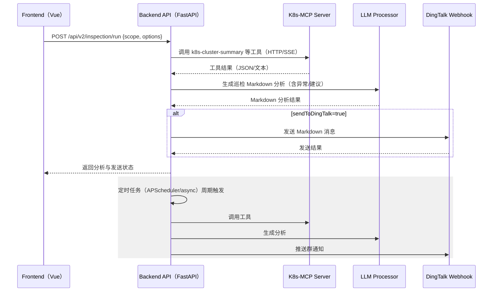

# 运维巡检功能实施方案（前端按钮 + 后端LLM总结 + 钉钉推送 + 定时巡检）

本文档描述在现有 Ding 机器人项目中新增“手动巡检按钮”与“定时巡检”的完整实施方案，涵盖架构流程、API 契约、前后端改动点、配置项、错误处理与测试上线清单。

---

## 1. 目标与范围

- 目标
  - 前端新增“巡检”按钮，一键触发巡检：后端调用 K8s-MCP 工具采集信息→LLM 生成 Markdown 分析→可选推送到钉钉群。
  - 后端支持“定时巡检”：按配置的 CRON/间隔周期自动执行巡检、生成分析并推送钉钉。
- 范围
  - 不改动 K8s-MCP 服务已有工具与协议，仅复用 `k8s-cluster-summary`、`k8s-relation-query` 等工具能力。
  - 后端新增一个协调端点与调度器，前端新增一个按钮和 API 调用。

---

## 2. 总体架构与调用链



---

## 3. API 设计

### 3.1 触发巡检（手动）

- Method: POST
- Path: `/api/v2/inspection/run`
- Request Body（示例）

```json
{
  "scope": {
    "namespace": "default",
    "includeNamespaces": ["default", "kube-system"],
    "maxDepth": 2
  },
  "options": {
    "sendToDingTalk": true,
    "summaryType": "overview", 
    "includeAnomalies": true,
    "maxSizeKB": 16,
    "llmModel": "gpt-4o-mini" 
  }
}
```

- Response（示例）

```json
{
  "analysisId": "2025-08-08T10:20:30Z-ea3b",
  "analysisMarkdown": "# 巡检结果\n- 集群状态...",
  "toolPayload": {
    "clusterSummary": {"nodes": 5, "pods": 120, "anomalies": ["ns/default pod/foo CrashLoop"]}
  },
  "dingTalk": {
    "sent": true,
    "messageId": "dingtalk_abc123"
  }
}
```

- 错误码
  - 400：请求参数非法
  - 502：MCP 工具调用失败
  - 503：LLM 生成失败
  - 500：未知服务器错误

### 3.2 巡检历史（可选扩展）

- Method: GET
- Path: `/api/v2/inspection/history?limit=20`
- Response：最近 N 次巡检的简要摘要与发送状态（便于前端列表显示）。

---

## 4. 后端实现设计

### 4.1 新增端点

- 新文件：`backend/src/api/v2/endpoints/inspection.py`
- 路由：`POST /api/v2/inspection/run`
- 主要步骤
  1. 校验并归一化请求参数（scope、options）。
  2. 使用 `EnhancedMCPClient` 调用 K8s-MCP 工具（优先：`k8s-cluster-summary`；必要时叠加 `k8s-relation-query`）。
  3. 调用 `EnhancedLLMProcessor`：将工具原始结果输入提示词模板，产出 Markdown 分析（“现状/异常/建议/风险等级/下一步动作”）。
  4. 若 `sendToDingTalk=true`，调用 `DingTalkBot` 发送 Markdown（标题：日期+环境；内容：简要摘要+详情链接或折叠段）。
  5. 返回分析结果与发送状态。

### 4.2 工具调用建议

- `k8s-cluster-summary`（必选）
  - 参数：`{"summary_type": "overview", "max_size_kb": 16, "include_anomalies": true}`
  - 产出：全局概况、疑似异常列表、资源规模数据
- `k8s-relation-query`（按需）
  - 参数：对异常对象做“影响半径/上游依赖”快速查询（`query_type: dependencies`）。
  - 产出：异常解释依据与影响分析素材

### 4.3 LLM 总结提示词要点（建议模板）

```
你是资深 SRE，请基于下列 Kubernetes 集群巡检原始数据，生成面向运维群的 Markdown 报告：
- 必含结构：现状总览 -> 异常清单（含严重度）-> 根因猜测 -> 影响范围 -> 建议措施 -> 待跟进事项
- 控制长度（优先清晰）并提供可执行建议
- 如信息不足，明确列出“需要补充的数据”
```

输入变量：`clusterSummary`、`anomalyDetails`（可选）、`time`、`env`、`namespaces`。

### 4.4 钉钉推送

- 使用现有 `backend/src/dingtalk/bot.py` 封装
- 消息类型：Markdown（标题示例：`[巡检][prod] 2025-08-08 18:00`）
- 限流与重试：支持基础重试（3 次指数退避），失败落盘到 `logs/` 并在历史查询 API 中可见。

### 4.5 配置项

在 `backend/config.env`（或统一配置系统）中新增：

- `DINGTALK_WEBHOOK_URL=`（必填，如需推送）
- `DINGTALK_SECRET=`（可选，若启用签名）
- `INSPECTION_ENABLED=true|false`（总开关）
- `INSPECTION_SEND_TO_DINGTALK=true|false`（默认是否推送）
- `INSPECTION_CRON=0 0 9 * * *`（CRON 表达式，或使用 `INSPECTION_INTERVAL_MINUTES=60`）
- `INSPECTION_LLM_MODEL=gpt-4o-mini`（默认模型）
- `INSPECTION_NAMESPACES=default,kube-system`（默认巡检范围）

文档须在 `project_document/技术架构与配置指南.md` 中补充说明。

### 4.6 定时巡检（APScheduler/async 方案）

- 在后端应用启动时挂载调度器：
  - 推荐 `APScheduler`（Poetry 依赖：`poetry add apscheduler`）。
  - 也可使用 FastAPI lifespan/`asyncio.create_task` + `asyncio.sleep` 循环，但 CRON 灵活性较弱。
- 任务实现复用与手动端点相同的业务函数，确保“一处实现、两处复用”。
- 并发控制：同一时间仅允许一个巡检任务在跑（可用文件锁/Redis 锁/进程内原子旗标）。
- 失败处理：
  - 工具失败：记录并提示“工具失败，已跳过本次巡检”。
  - LLM 失败：回退发送“原始数据简报”+“稍后补发分析”。
  - 钉钉失败：落盘并在下一次成功时追加“上次失败补发”。

### 4.7 关键文件改动清单（后端）

- 新增：`backend/src/api/v2/endpoints/inspection.py`
- 可能修改：
  - `backend/src/llm/processor.py`（增加巡检专用模板方法，可选）
  - `backend/src/mcp/enhanced_client.py`（增加工具封装 `run_cluster_inspection`，可选）
  - `backend/main.py` 或 `scripts/serve.py`（注册 APScheduler/Lifespan 任务）
  - `backend/src/config/manager.py`（增加新配置项的读取与校验）

---

## 5. 前端实现设计

### 5.1 入口与交互

- 位置建议：`views/Dashboard.vue` 顶部操作区，或 `views/Chat.vue` 的工具栏中新增“巡检”按钮。
- 交互：点击后弹出对话框，允许选择命名空间、是否推送到钉钉等；确认后调用 API，返回 Markdown 在弹窗或新面板展示。

### 5.2 API 封装示例

文件：`frontend/src/api/client.js`

```js
export async function runInspection(payload) {
  const res = await fetch('/api/v2/inspection/run', {
    method: 'POST',
    headers: { 'Content-Type': 'application/json' },
    body: JSON.stringify(payload)
  });
  if (!res.ok) throw new Error(await res.text());
  return res.json();
}
```

组件内调用（示意）：

```js
const onRunInspection = async () => {
  loading.value = true;
  try {
    const result = await runInspection({
      scope: { includeNamespaces: selectedNamespaces.value, maxDepth: 2 },
      options: { sendToDingTalk: sendToDT.value, includeAnomalies: true }
    });
    analysisMarkdown.value = result.analysisMarkdown;
    dingTalkStatus.value = result.dingTalk?.sent;
  } catch (e) {
    $message.error(`巡检失败: ${e.message || e}`);
  } finally { loading.value = false; }
};
```

### 5.3 展示与留痕

- 使用已有 Markdown 渲染工具（`frontend/src/utils/markdown.js`）展示结果。
- 在“系统通知/历史记录”区域（可新建面板）显示最近 N 次巡检摘要、时间与推送状态。

---

## 6. 安全、权限与资源控制

- 鉴权：沿用现有后端鉴权策略（如有）。必要时为 `/inspection/run` 增加角色校验（只允许运维角色触发）。
- 频控：对手动端点增加节流（例如同一用户/全局 1 分钟 1 次）。
- 数据最小化：LLM 提示词只传必要字段，避免泄露敏感信息。
- 超时：MCP 工具调用与 LLM 生成设置合理超时与取消（如 60s/90s）。
- 并发：避免定时与手动重叠执行（互斥锁）。

---

## 7. 观测性与日志

- 日志字段建议：
  - trace_id / analysis_id、trigger_type（manual/cron）、namespaces、tool_status、llm_status、dingtalk_status、duration_ms、error
- 指标（Prometheus/StatsD，若有）：
  - inspection_success_total、inspection_failure_total、inspection_duration_ms_bucket
- 追踪：为 MCP/LLM/钉钉调用打点，串联 trace_id。

---

## 8. 测试计划

- 单元测试
  - `/inspection/run` 参数校验与分支覆盖
  - MCP 客户端 mock：工具成功/失败
  - LLM 处理 mock：成功/超时/异常
  - 钉钉推送 mock：成功/失败/重试
- 集成测试
  - 启动后端 + 测试 K8s-MCP（可用本地/模拟）
  - 端到端：按钮触发→API→MCP→LLM→钉钉（mock）→前端展示
- 定时任务测试
  - 启动 APScheduler，使用短周期验证任务触发与互斥逻辑
  - 断网/异常注入场景

---

## 9. 上线清单

- 依赖
  - `poetry add apscheduler`（若采用 CRON 调度）
- 配置
  - 设置 `DINGTALK_WEBHOOK_URL`（与可选 `DINGTALK_SECRET`）
  - 开启 `INSPECTION_ENABLED=true`
  - 设置 `INSPECTION_CRON` 或 `INSPECTION_INTERVAL_MINUTES`
- 启动顺序（遵循项目规范）
  1. 启动 MCP 服务器
  2. 启动后端 API（含调度器）
  3. 启动前端
- 验收
  - 手动触发一次巡检并查看前端展示与群消息
  - 等待一次定时巡检并确认群消息

---

## 10. 实施里程碑（建议）

- 第一天
  - 后端端点与业务实现（含 LLM 提示词与 MCP 封装）
  - 钉钉推送与配置接入
  - 基本单元测试
- 第二天
  - 前端按钮、弹窗与展示
  - 定时巡检（APScheduler）与并发互斥
  - 集成测试与观测性完善

---

## 11. 变更摘要（代码位置）

- 后端
  - `backend/src/api/v2/endpoints/inspection.py`（新增）
  - `backend/src/llm/processor.py`（新增巡检模板，可选）
  - `backend/src/mcp/enhanced_client.py`（工具封装，可选）
  - `backend/src/config/manager.py` & `backend/config.env`（新增配置项）
  - `scripts/serve.py` 或 `backend/main.py`（注册定时任务）
- 前端
  - `frontend/src/api/client.js`（新增 `runInspection`）
  - `frontend/src/views/Dashboard.vue` 或 `Chat.vue`（新增按钮与展示模块）

---

如需我直接落地上述改动，请告知优先级（先手动巡检还是先定时），我将按项目规范提交对应编辑并跑通端到端验证。


