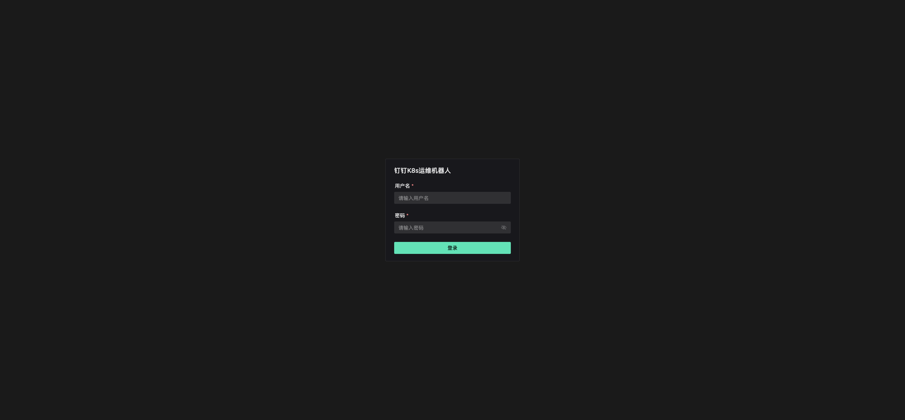
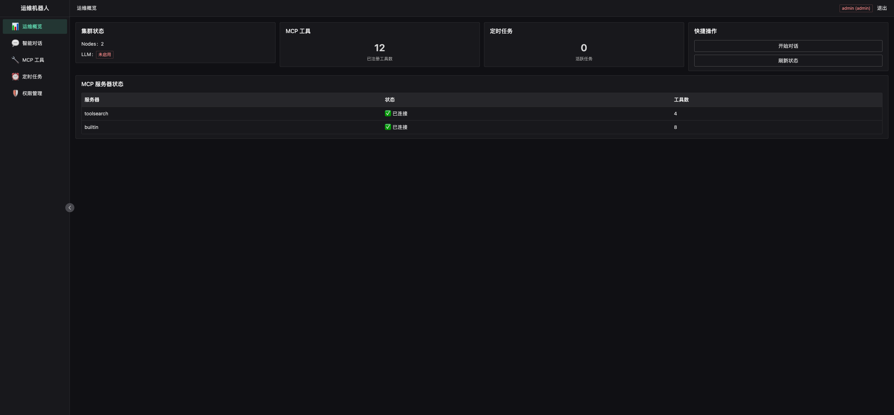
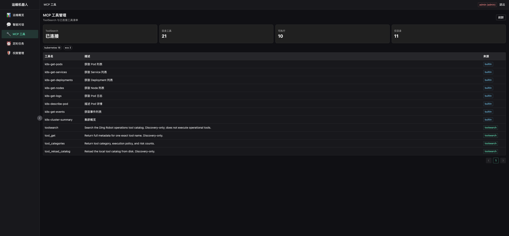
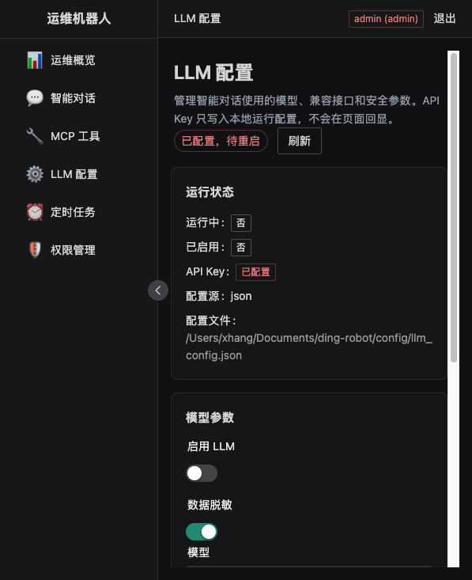
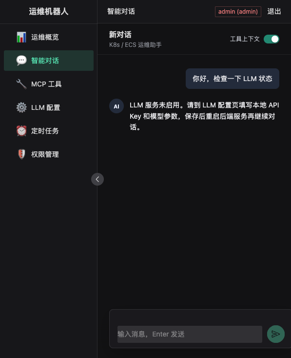
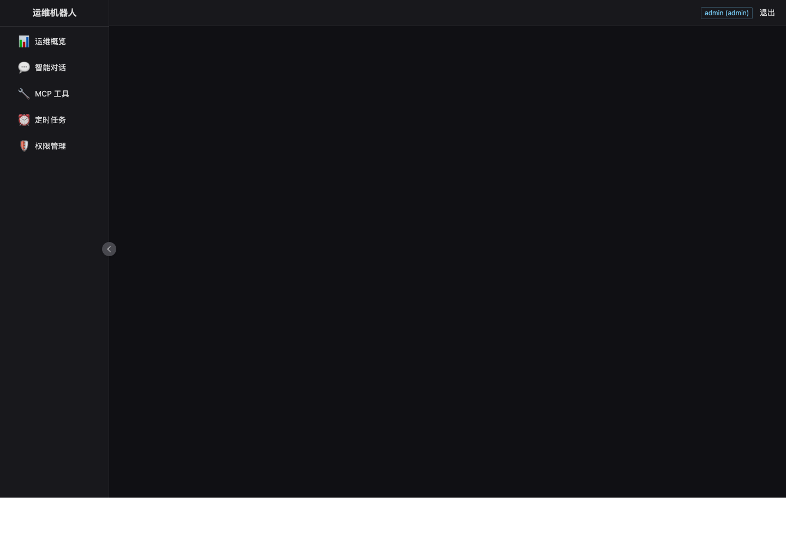
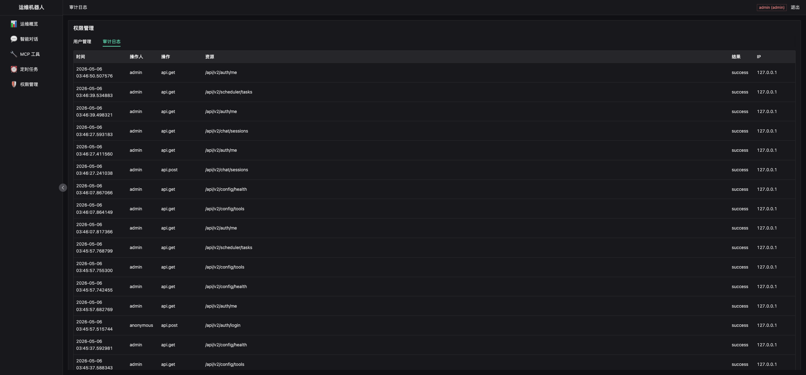

# Browser Smoke Evidence

Date: 2026-05-06

> Historical note: this report records the S3/S4 browser evidence at the time it was run. Later ToolSearch recovery changed the catalog from `21` total / `10` catalog-only to `55` total / `0` catalog-only.

## Runtime

- Backend: `DATABASE_URL=sqlite+aiosqlite:////Users/xhang/Documents/ding-robot/backend-v2/data/app.db SCHEDULER_ENABLED=false MCP_CONFIG_PATH=/tmp/ding-robot-mcp-toolsearch-run.json poetry -C backend-v2 run uvicorn app.main:app --host 127.0.0.1 --port 8001`
- Frontend: `VITE_API_TARGET=http://127.0.0.1:8001 npm run dev -- --host 127.0.0.1 --port 3000`
- Login: `admin / admin`
- Browser method: Browser Use IAB backend.

## API Evidence

`GET /api/v2/config/health` returned:

```json
{
  "status": "healthy",
  "llm_enabled": true,
  "llm_configured": true,
  "mcp_servers": {
    "toolsearch": {
      "connected": true,
      "tools": 4,
      "catalog_total": 21,
      "catalog_categories": [
        { "name": "kubernetes", "count": 18 },
        { "name": "ecs", "count": 3 }
      ],
      "execution_policies": [
        { "name": "executable", "count": 11 },
        { "name": "catalog_only", "count": 10 }
      ]
    },
    "builtin": { "connected": true, "tools": 9 }
  },
  "scheduler": {
    "enabled": false,
    "running": false,
    "jobs": 0
  }
}
```

`GET /api/v2/config/tools` returned 13 active tools: 9 built-in tools plus 4 ToolSearch discovery tools.

LLM config smoke:

- `GET /api/v2/config/llm` renders in the multi-model LLM config page.
- Response exposes provider status, default provider, and model metadata, but does not expose API keys.
- Saving a provider writes to local `config/llm_config.json` and returns `restart_required: false`; new chat messages read the updated runtime config immediately.
- Placeholder API keys are treated as not configured by the backend.

Chat smoke:

- Chat page now uses a full-height workbench with a compact session rail, centered message column, and fixed bottom composer.
- After a session is created, the chat top bar renders a model selector populated from `/api/v2/config/llm`.
- Chat requests send `llm_provider_id` with the message payload so each conversation turn can choose a configured model.

S4 scheduler smoke:

- Created `S4 smoke task` through `POST /api/v2/scheduler/tasks`.
- Ran it once through `POST /api/v2/scheduler/tasks/{task_id}/run`.
- With `LLM_ENABLED=false`, the run correctly produced a failed execution: `LLM service is not enabled`.
- The Scheduler page renders task status, latest result, run action, and execution history entry.

## Page Evidence

| Page | Result | Evidence |
| --- | --- | --- |
| Login | PASS. Login form renders with associated labels and no console issues after the accessibility fix. |  |
| Dashboard | PASS. Health, MCP tool count, scheduler count, and server status render. |  |
| MCP Config | PASS. ToolSearch status, catalog total, executable count, catalog-only count, categories, and tool table render. |  |
| LLM Config | PASS. Runtime status, local config path, provider list, default provider, API key state, and immediate-apply save messaging render. |  |
| Chat | PASS. Chat page uses the refreshed centered conversation layout, bottom composer, and model selector. |  |
| Scheduler | PASS. Scheduler task table renders run/history controls and the failed smoke execution from `POST /run`. |  |
| Audit | PASS. Audit log table renders and records smoke API activity. |  |

## Console And Network

- Dashboard: no console messages; `auth/me`, `config/health`, `config/tools`, and `scheduler/tasks` returned 200.
- MCP Config: no console messages; `auth/me`, `config/tools`, and `config/health` returned 200.
- LLM Config: after restarting the Vite dev server to clear a stale HMR error from an intermediate implementation, the multi-provider page rendered and provider save returned 200.
- Chat: `auth/me`, `config/llm`, and `chat/sessions` returned 200; the model selector rendered the default provider.
- Scheduler: `auth/me`, `scheduler/tasks`, and task execution APIs returned 200. Headless Chrome screenshot completed; console capture was not available in that headless fallback run.
- Audit: no console messages; `auth/me` and `config/audit` returned 200.
