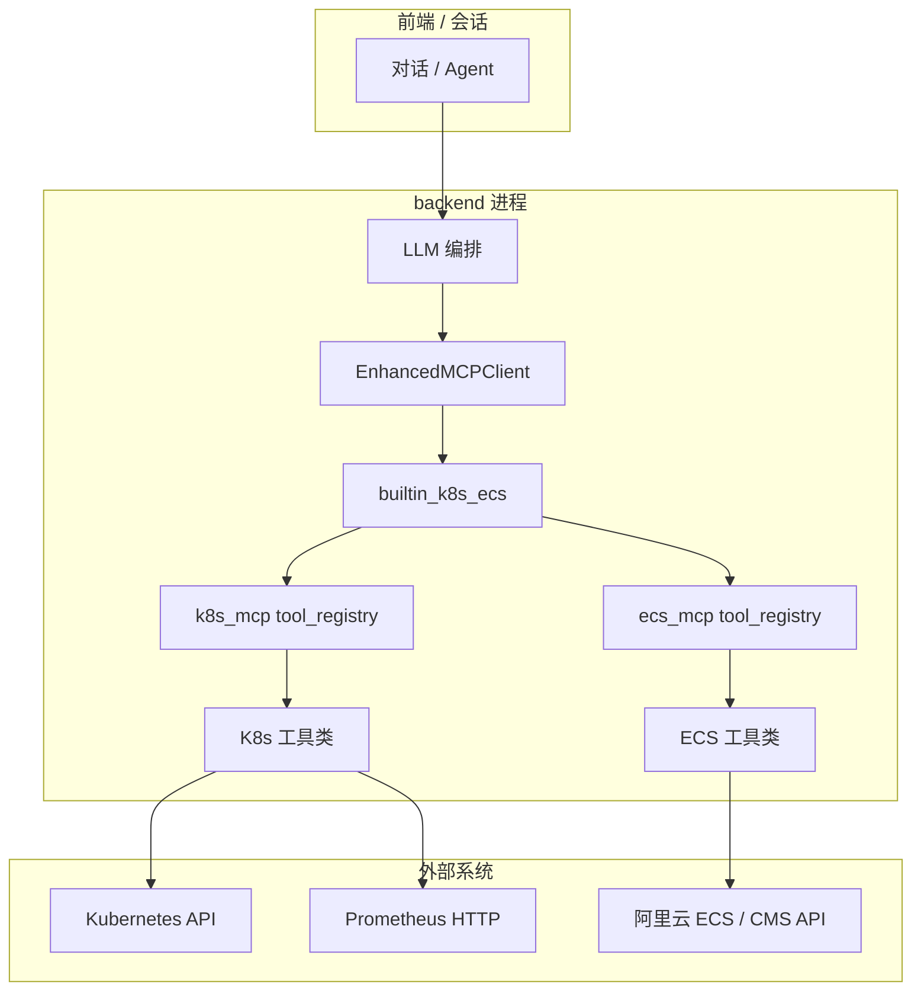

# 02 架构与数据流

[← Wiki 首页](./README.md)

## 1. 逻辑分层

说明：

- **同一进程**内完成工具发现（`list_tools` 合并结果）与 `call_tool`；builtin 工具名命中时**不**走远程 MCP 的 SSE/WebSocket。
- **K8s** 与 **ECS** 使用**两套** `tool_registry`，但对外合并为统一的 `MCPTool` 映射（见 `merge_builtin_mcptools()`）。

## 2. 关键调用链（call_tool）

1. `register_builtin_tools_once()` → `default_builtin_providers()` 中各 Provider 的 `register()` → `k8s_mcp.tools.register_all_tools()`、`ecs_mcp.tools.register_all_tools()`。
2. 每个工具类实例 `tool_registry.register(instance, "kubernetes"|"ecs")`。
3. `merge_builtin_mcptools()` 将各工具的 `get_schema()` 转为后端 `MCPTool`。
4. 执行时：`execute_builtin_tool(name, arguments)` → 对应 registry 的 `execute_tool` → `MCPToolBase.execute()`。

**研发注意**：若新增工具，必须加入对应 `SAFE_QUERY_TOOLS` 并完成注册，否则不会出现在 builtin 列表中。

## 3. 环境开关

| 变量 | 默认 | 作用 |
|------|------|------|
| `BUILTIN_K8S_ECS_TOOLS` | `true` | 为 `false` 时不注册进程内 K8s/ECS 工具，`merge_builtin_mcptools()` 为空。 |
| `MCP_SKIP_REMOTE_SERVER_NAMES` | 空 | 逗号分隔；与 `mcp_config` 中 `implementation=builtin` 的服务器名合并，用于跳过远程 MCP，避免重复工具。 |

## 4. 返回契约（给 Agent/解析器）

- 成功：`MCPCallToolResult` → `content` 多为 `[{"type":"text","text": "<JSON 字符串>"}]`。
- `builtin_k8s_ecs.mcp_call_result_to_payload` 会尝试把文本 **反序列化为 dict** 再交给上层。
- 失败：可能带 `error` / `is_error` 或纯错误文案；具体实现以 `MCPCallToolResult` 与调用方为准。

集成侧应对「**JSON 字符串**」与「**已是 dict**」两种形态做兼容解析。

## 5. 与 Skill（工具白名单）的关系

若启用 Skill：`skill_id` 会话内 **`list_tools`** 会过滤为允许的工具名；**`call_tool`** 侧应做二次校验（防伪造）。详见 [08-integration-for-developers.md](./08-integration-for-developers.md)。

下一章：[03 配置全表](./03-configuration.md)
