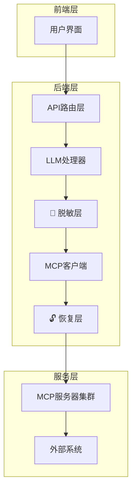

 # 技术架构与配置指南

**文档版本**: v1.0  
**适用范围**: 开发者、运维人员、系统管理员

---

## 🏗️ 系统架构详解

### 整体技术架构



### 核心模块详解

#### 1. 配置管理系统

**统一配置架构**:
```
config/
├── mcp_config.json      # MCP服务器配置
├── llm_providers.json   # LLM提供商配置
└── backups/            # 配置备份目录
```

**配置管理器层次**:
- `ConfigManager` - 环境变量 + 文件配置统一管理
- `MCPConfigManager` - MCP专用配置管理
- `LLMConfigManager` - LLM配置管理 + 热重载

**关键特性**:
- ✅ 环境变量自动迁移到文件配置
- ✅ 实时热重载 (watchdog)
- ✅ 自动备份与恢复
- ✅ 向后兼容性保证

#### 2. MCP协议集成

**MCP工具发现流程**:
```python
# 1. 自动连接MCP服务器
client = EnhancedMCPClient()
await client.connect_to_server(server_config)

# 2. 工具发现与注册
tools = await client.list_tools()
auto_sync_tools_config(tools)

# 3. 智能工具调用
result = await client.call_tool(tool_name, parameters)
```

**支持的MCP服务器**:
- **Kubernetes MCP**: 20+个K8s管理工具
- **SSH Jumpserver MCP**: 远程执行、资源管理工具

#### 3. 数据安全系统

**脱敏处理流程**:
```python
# 脱敏层 (DataMasker)
masked_data = masker.mask_sensitive_data(original_data)
store_mapping(original_data, masked_data)

# 恢复层 (双阶段恢复)
# 阶段1: 流式恢复
stream_response = restore_llm_response(stream_chunk)
# 阶段2: 完整恢复  
final_response = restore_llm_response(full_response)
```

**支持的脱敏类型**:
- **IP地址**: `192.168.1.100` → `10.0.abc1.100` 
- **主机名**: `prod-server-01` → `host-def2a-01`
- **人名**: `张三` → `用户A`

---

## ⚙️ 配置管理指南

### 1. LLM配置管理

**配置文件结构** (`config/llm_providers.json`):
```json
{
  "providers": {
    "openai": {
      "api_key": "sk-xxx",
      "base_url": "https://api.openai.com/v1",
      "model": "gpt-4",
      "enabled": true
    },
    "azure": {
      "api_key": "xxx",
      "azure_endpoint": "https://xxx.openai.azure.com/",
      "api_version": "2024-02-15-preview",
      "model": "gpt-4",
      "enabled": false
    }
  },
  "global_defaults": {
    "temperature": 0.7,
    "max_tokens": 4000,
    "timeout": 30
  }
}
```

**配置API端点**:
- `GET /api/v2/llm/config/current` - 获取当前配置
- `POST /api/v2/llm/config/update` - 更新配置
- `POST /api/v2/llm/config/providers` - 添加/更新提供商
- `GET /api/v2/llm/config/file-watcher/status` - 热重载状态

### 2. MCP配置管理

**配置文件结构** (`config/mcp_config.json`):
```json
{
  "servers": {
    "k8s-server": {
      "enabled": true,
      "connection": {
        "type": "http",
        "url": "http://localhost:8001/mcp"
      }
    }
  },
  "tools": {
    "k8s-get-pods": {
      "enabled": true,
      "server_name": "k8s-server",
      "category": "kubernetes"
    }
  }
}
```

**配置API端点**:
- `GET /api/v2/mcp/config` - 获取完整配置
- `POST /api/v2/mcp/config` - 更新配置
- `POST /api/v2/mcp/config/import` - 导入配置
- `GET /api/v2/mcp/config/export` - 导出配置

### 3. 环境变量迁移

**自动迁移脚本**:
```bash
# 手动迁移
poetry run python scripts/migrate_llm_config.py migrate

# 查看迁移状态
poetry run python scripts/migrate_llm_config.py status

# 回滚到环境变量
poetry run python scripts/migrate_llm_config.py rollback
```

---

## 🔧 开发环境配置

### 1. 环境准备

**Python环境管理**:
- 本项目严格使用 **Poetry** 进行Python依赖管理
- 所有Python相关操作必须通过Poetry执行

**依赖安装**:
```bash
# Python依赖 (Poetry)
poetry install

# Node.js依赖
cd frontend && npm install
```

**环境变量配置**:
```bash
# 复制环境变量模板
cp backend/config.env.example backend/config.env
cp k8s-mcp/config.env.example k8s-mcp/config.env
```

### 1.1. Poetry项目管理规范

> 🚨 **重要提醒**: 本项目的所有Python操作必须通过Poetry管理，禁止直接使用pip或系统Python

#### 基本规则

**✅ 正确使用方式**:
```bash
# 安装依赖
poetry install

# 运行Python脚本
poetry run python script.py

# 运行后端服务
poetry run python backend/main.py

# 执行测试
poetry run python -m pytest

# 启动MCP服务
poetry run python k8s-mcp/start_k8s_mcp_http_server.py

# 添加新依赖
poetry add package_name

# 添加开发依赖
poetry add --group dev package_name
```

**❌ 禁止的操作**:
```bash
# 直接使用pip (会破坏依赖管理)
pip install package_name

# 直接使用系统Python
python script.py

# 在Poetry环境外运行
./script.py
```

#### 多模块项目结构

本项目包含多个独立的Python模块，每个都有自己的`pyproject.toml`:

```
ding-robot/
├── pyproject.toml          # 主项目配置
├── backend/                # 后端API模块
├── k8s-mcp/               # K8s MCP服务器
│   ├── pyproject.toml     # 独立的Poetry配置
│   └── poetry.lock        # 独立的锁文件
└── ssh-jumpserver-mcp/    # SSH跳板机MCP服务器
```

#### 依赖管理最佳实践

1. **环境隔离**: 每个模块使用独立的虚拟环境
2. **版本锁定**: 使用`poetry.lock`确保一致性
3. **分组管理**: 区分生产和开发依赖
4. **定期更新**: 使用`poetry update`更新依赖

#### 常见问题解决

**虚拟环境问题**:
```bash
# 查看虚拟环境信息
poetry env info

# 重建虚拟环境
poetry env remove python
poetry install
```

**依赖冲突解决**:
```bash
# 查看依赖树
poetry show --tree

# 更新特定包
poetry update package_name
```

### 2. 开发启动

**启动顺序**:
```bash
# 1. 启动MCP服务器
poetry run python k8s-mcp/start_k8s_mcp_http_server.py
poetry run python ssh-jumpserver-mcp/start_mcp_server.py

# 2. 启动后端API
poetry run python backend/main.py

# 3. 启动前端开发服务器
cd frontend && npm run dev
```

### 3. 测试验证

**单元测试**:
```bash
# 后端测试
poetry run python -m pytest backend/tests/

# 配置管理测试
poetry run python -m pytest backend/tests/test_config_manager.py -v
```

**API测试**:
```bash
# 健康检查
curl http://localhost:8000/health

# MCP配置测试
curl http://localhost:8000/api/v2/mcp/config

# LLM配置测试  
curl http://localhost:8000/api/v2/llm/config/current
```

---

## 🚀 生产部署

### 1. Docker部署

**Dockerfile示例**:
```dockerfile
FROM python:3.11-slim
WORKDIR /app
COPY pyproject.toml poetry.lock ./
RUN pip install poetry && poetry install --no-dev
COPY . .
EXPOSE 8000
CMD ["poetry", "run", "python", "backend/main.py"]
```

### 2. Kubernetes部署

**基本配置**:
```yaml
apiVersion: apps/v1
kind: Deployment
metadata:
  name: ding-robot-backend
spec:
  replicas: 3
  selector:
    matchLabels:
      app: ding-robot-backend
  template:
    spec:
      containers:
      - name: backend
        image: ding-robot:latest
        ports:
        - containerPort: 8000
        env:
        - name: ENV
          value: "production"
```

### 3. 监控与日志

**日志配置**:
- **应用日志**: `logs/app.log`
- **访问日志**: `logs/access.log` 
- **错误日志**: `logs/error.log`

**监控指标**:
- API响应时间
- MCP工具调用成功率
- 配置热重载状态
- 脱敏恢复准确率

---

## 🔍 故障排除

### 常见问题

1. **配置文件不存在**
   ```bash
   # 解决方案: 自动创建默认配置
   poetry run python scripts/migrate_llm_config.py migrate
   ```

2. **MCP服务器连接失败**
   ```bash
   # 检查服务器状态
   curl http://localhost:8001/health
   ```

3. **热重载不工作**
   ```bash
   # 检查文件监控状态
   curl http://localhost:8000/api/v2/llm/config/file-watcher/status
   ```

### 调试模式

**启用调试日志**:
```python
# backend/main.py
import logging
logging.basicConfig(level=logging.DEBUG)
```

**配置调试**:
```json
{
  "debug_logging": true,
  "log_masked_data": true
}
```

---

## 📚 相关文档

- [项目总览与最新状态](./项目总览与最新状态.md)
- [API文档](./api-documentation.md)
- [LLM配置迁移指南](./llm-config-migration-guide.md)

---

*本文档随着系统演进持续更新*